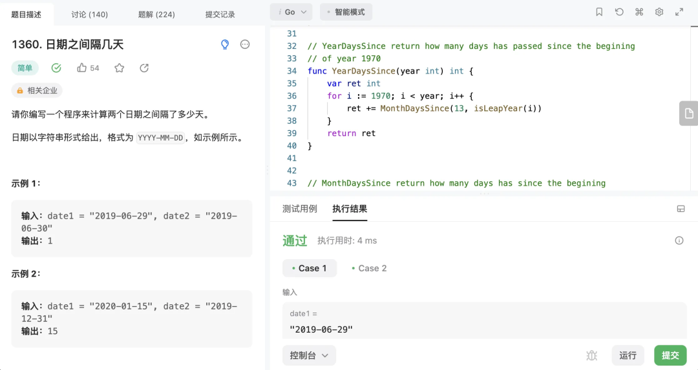
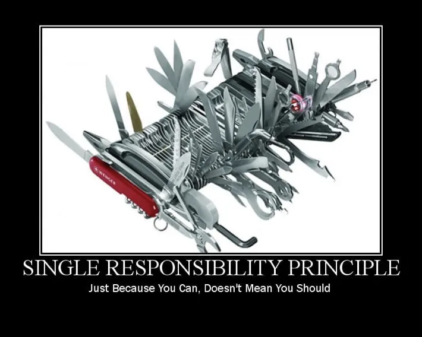
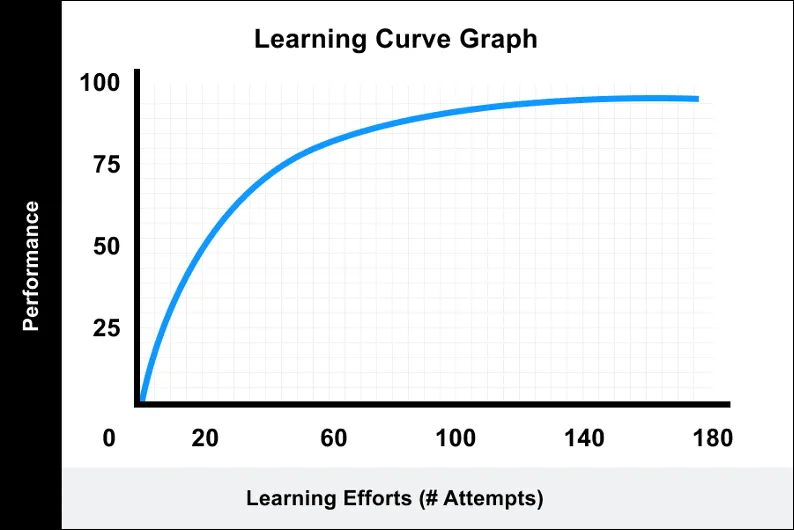
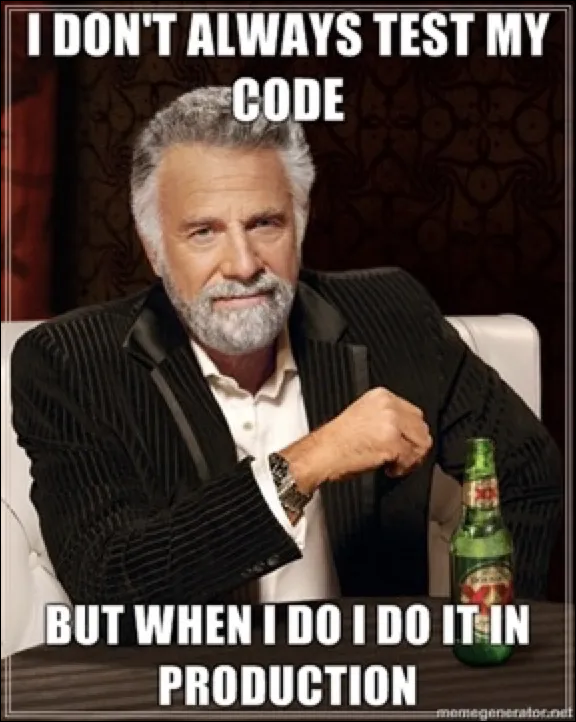
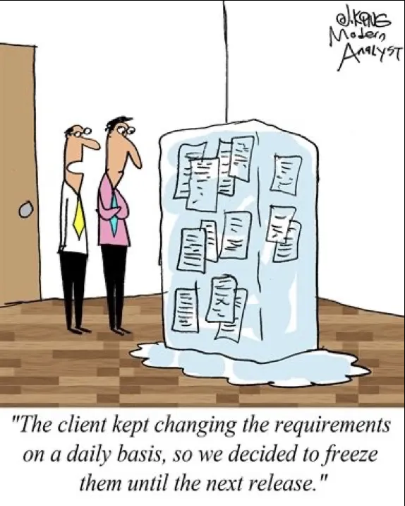
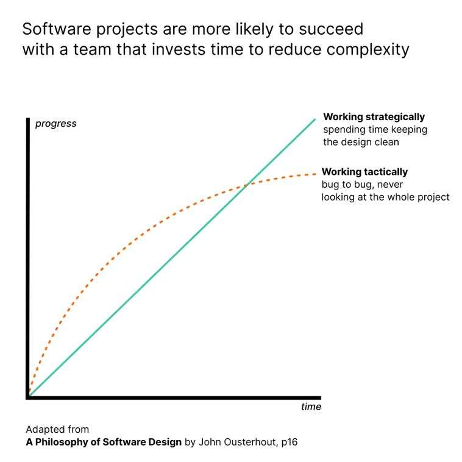

# 入行 15 年，我还是觉得编程很难

  

  

👉目录

  

1 写代码很简单，但写好代码很难

2 编程的精髓是“创造”

3 打造高效试错的环境至关重要

4 避开代码完美主义陷阱

5 技术很重要，但“人”也许更重要

6 求知若渴是好事，但也要注意方法

7 越早开始写单元测试越好

8 程序员最大的敌人是什么？

9 写在最后

  

  

  

程序员的职业成长，可能是诸多行业中最难的那一批了：  

  
校园时学的计算机理论，工作了几乎用不上；  
技术的革新太快，轮子还没精通就被时代淘汰；  
虚拟环境总是顺风顺水，一上生产环境就劫难重重；  
面试时候要求造核弹，工作以后拧螺丝，聊绩效时说没有造核弹的思考；  
觉得技术是最重要的，又觉得只会技术走不远，于是既丢掉了对技术的追求，也没学会对业务的思考；  
……  
  
写代码很简单，写好代码很难；编程的精髓是“创造”；技术很重要，但“人”也许更重要；程序员最大的敌人是什么？腾讯技术专家总结 15 年工作经验，字字珠玑都在这篇文章中了，建议提前收藏，细细品阅。

  

  

  

很多年前，当我还是一名计算机专业的大四学生时，整天上网浏览各类招聘信息，想找到一个合适的程序员实习岗位。

  

除了实习岗位外，我偶尔也会点进一些“高级工程师”的招聘帖里。现在回想起那些帖子，抛开让人眼花缭乱的技术名词，我印象最深的就是常出现在第一行的岗位年限要求：“本职位要求 工作经验 5 年以上”。

  

作为一只一天班都没上过的小菜鸟，这些年限要求在我眼里简直长到夸张。不过，望洋兴叹之余，我有时也会在心中暗暗憧憬一下：“五年工作经验的程序员，那该多厉害啊？写代码对于他们来说，是不是像吃饭一样简单？”

  

时光荏苒，一晃十几年过去了。如今回头一望，自己也成了一名有着 15 年工作经验的光荣打工人。在软件开发行业摸爬滚打这些年后，我发现很多事情，与我在大四时所想象的大不相同，比方说：

-   随着经验增长，编程并不会变简单太多，“像吃饭一样简单”只出现在梦里。
    
-   给许多“大项目”写代码不光没意思，还很危险，远不如在 LeetCode 上做一道算法题有趣。
    
-   只从技术角度思考问题，成不了好程序员，有些东西远比技术更重要。
    

  

细想起来，这类关于编程的感触还有许多。我整理了其中 8 条，写成了这篇文章。如果其中某些观点引起了你的共鸣，我会非常高兴。

  

  

  

# 01

  

  

写代码很简单，但写好代码很难

  

编程曾经是一项门槛很高的专业技能。从前，一个普通人想学编程，最常见的做法就是通过教材和书本学习。不过大部分编程专业书，十分艰深晦涩，对于初学者来说很不友好。因此不少人在尝到编程的乐趣前，就早早地半途而废。

  

但如今，学编程正在变得越来越容易。学习不再像以前那样，只能硬啃书本，而是多了许多新途径。观看教学视频、参加 Codecademy 的交互式课程，甚至直接在 CodeCombat 通过玩游戏来学编程，每个人都能找到适合自己的学习方式。

  

“妈，我真没在玩游戏，我在学编程呢！你看屏幕右边！”

  

此外，编程语言也在变得越来越易用。经典的 C 和 Java 不再是大多数初学者的首选，许多更简单、更易上手的动态类型语言如今大受欢迎，与之相关的 IDE 等工具也变得越来越完善。这些因素进一步降低了编程的学习门槛。

  

总而言之，编程早已褪去了它的神秘面纱，从只有少数人才能掌握的神秘技能，变成了一门人人皆可学习的普通手艺。

  

但更低的学习门槛，更友好的编程语言，并不意味着人人都能写出一手好代码。如果你已经工作，参与过一些项目，那我很想问你一个问题：”你日常接触的这些项目的代码质量如何？是好代码多，还是烂代码多？”

不知你会怎么回答，我先来说说我的答案。

  

####    1.1 好代码还是很少

  

2010 年，我跳槽到了一家总部位于北京五道口的大型互联网公司。

  

加入这家公司前，我只在十人规模的小公司待过，因此，我对新公司在各方面都有着很高的期待，尤其是软件质量方面。当时，我心里想的大概是这样：“这可是支撑了有着千万用户量的产品的‘大’项目，代码质量跟之前那些比，肯定有质的飞跃吧！”

  

等到在新公司工作了一周后，我才发现自己实在是错得离谱。所谓“大”项目的代码质量同我的预期相去甚远。打开 IDE，数百行的函数和神秘的数字字面量比比皆是，开发任何一个小需求都难如登天。

  

后来，在待过更多公司，接触了更多软件项目后，我总结出一个道理：**不论公司多大、项目多牛，在实际工作中遇见好代码，仍然是小概率事件。**

  

####    1.2 好代码有哪些要素？

  

话说回来，到底怎样的代码才算是好代码？在这方面，Martin Fowler 有一句话常被大家引用：

  

> “Any fool can write code that a computer can understand. Good programmers write code that humans can understand.”  
>   
> “任何傻瓜都能写出计算机能理解的代码。优秀程序员写人类能理解的代码。”

  

我认为它可以作为评价好代码的原点：好代码一定是可读、易读，且容易理解的。写出好代码的第一原则，就是把人类读者放在第一位。

  

除了可读性以外，评价代码好坏还有许多其他维度：

-   贴合编程语言：是否使用了当前编程语言的推荐写法？语言特性和语法糖，使用程度是否恰到好处？
    
-   易于修改：代码设计是否考虑了未来的需求变更，当变化发生时，代码是否容易随之修改？
    
-   API 设计合理：API 设计是否合理，易于使用？好的 API 在简单场景下使用方便，在高级场景下又可以随需求扩展。
    
-   性能够用：代码性能是否满足当前业务需求，同时为未来保留了一定提升空间？
    
-   避免过度设计：代码是否存在过度设计、过早优化的毛病？
    
-   …
    

  

总而言之，对于任何层级的程序员来说，好代码都不是什么唾手可得的东西。要写出好代码，需要在许多维度上反复权衡、精心设计，最后再加以持续打磨。

  

既然如此，假如想尽快掌握写代码这门手艺，有捷径吗？

  

####    1.3 写好代码的捷径

  

在许多层面上，我认为编程和写作非常相似。二者都是使用文本和符号来表达思想，只是方式略有不同。

  

谈到写作，我想问一个关于作家的问题：“你听说过不读书的作家吗？你有没有听到过某位作家说，他从来不读其他人的作品，只读自己的东西？”。我猜答案应该是否定的吧。

  

如果你去查阅相关资料，你会发现许多职业作家的日常生活，就是阅读和写作两件事在不断循环。他们每天会花大量时间阅读各类文字，然后再写作。

  

同样是“文字工作者”，程序员们就很少重视阅读。但要想快速提升编程能力，阅读正是不可或缺的重要一环。除了日常工作接触到的项目以外，我们应该更多地阅读那些经典软件项目，从中学习 API 设计、模块架构和代码编写的技巧。

  

不光代码和技术文档，最好再定期读一些计算机方面的专业书，保持阅读书籍的习惯。在这方面，我认为 Jeff Atwood 在十多年前写的文章 "Programmers Don't Read Books -- But You Should（都说程序员不读书——但你应该读）"，如今读来仍不过时。

  

提升编程能力的捷径，就藏在“阅读 <-> 编程”这个无尽循环里。

  

“一个好的程序员应该做什么？”

  

  

  

# 02

  

  

编程的精髓是“创造”

  

在程序员的日常工作中，有很多事情会让人充满成就感，甚至情不自禁地感叹“编程真美好”。比方说，修复了一个极难定位的 Bug，用新算法将代码性能提升了一倍，等等。但在所有的这类事情当中，没有任何一件，能和“亲手**创造**出一件东西”相比。

  

当你在编程时，创造新事物的机会实际上随处可见。因为并非只有发布一个新软件，才称得上是“创造”。写一个可复用的工具函数、设计一套清晰的数据模型，全都可以归入“创造”的范畴。

  

身为程序员，保持对“创造”的热情至关重要。因为它可以帮我们：

-   **更高效地学习**：学习一门新技术，最高效的方式就是用它开发一个真实项目，在创造的过程中学习，效果最好。
    
-   **有机会邂逅了不起的东西**：许多改变世界的开源软件，最初都是作者纯粹出于兴趣所创造，比如 Linus Torvalds 和 Linux，Guido van Rossum 和 Python。
    

  

1989 年的圣诞假期，荷兰人 Guido van Rossum 敲下了 Python 语言的最初几行代码，Python 最初仅被期望作为 ABC 语言的继承者，但后来“吞噬”了全世界

  

虽然“创造”好处多多，程序员们也有大把机会去做，但许多人常常缺少一种身为“创造者”的觉悟。就像那个广为流传的小故事所说：一位哲学家询问正在砌砖的工人，有人清楚地知道自己是在建造一座大教堂，有人却认为自己只是在砌砖。很多程序员正是“只见砖块，不见教堂”。

  

将自己定位成创造者后，看待事物的方式就会发生天翻地覆的变化。举个例子，同样是给 API 增加报错提示文字，创造者们就能跳出“快速完成需求就好”的思维陷阱，向前一步，追问自己一些更重要的问题：“我想为用户**创造**什么样的产品体验？怎样的报错文字，更能帮助我达成该目标？”

  

就像任何一个有用的编程模式一样，“创造者思维”也能成为你的职业生涯的一道巨大推进力。因此，现在就试着问自己一个问题吧——“我的下一份创造会是什么？”

  

  

  

# 03

  

  

打造高效试错的环境至关重要

  

我曾参与开发过一个互联网产品，它设计精美，功能丰富，每天都有大量用户使用。

  

但就是这么一个从市场角度看颇为成功的产品，工程质量却非常糟糕。如果你打开它的后端项目，把所有目录翻个底朝天，都找不到任何一行单元测试代码，其他自动化测试流程也是无从谈起。而业务逻辑偏偏又十分复杂，最后，项目代码间的依赖耦合多如牛毛，开发一个新特性，很容易把旧功能给搞挂。

  

“在忙啥呢？” “试着修复我之前修一个问题时搞出来的问题，那问题是我之前解决另一个问题搞出来的，而那个问题又是我……”

  

因此，项目每次发布时，开发和产品同学全都得严阵以待，氛围十分紧张。整个发布过程也很刺激，紧急回滚时有发生。一个人在这样的环境中工作，技术成长抛开不谈，心理素质肯定能得到极大锻炼。

  

编程原本是一件充满乐趣的工作，但为这样的项目编程，乐趣根本无从谈起。究竟是什么夺走了编程的乐趣？

  

####    3.1 理想的编程体验≈“刷题”

  

LeetCode 是一个著名的编程学习网站，上面提供了许多覆盖各个难度的编程题，大部分与算法相关。用户可以选择自己感兴趣的题目，直接在浏览器上编写代码（支持十几种编程语言）并执行。如果通过了全部的测试用例，则算作解答成功。

  

在 LeetCode 上做题

  

在 LeetCode 刷题很像在玩游戏，富有挑战性，同时也很有趣。整个做题过程，实际完美展现了一种理想化的编程体验：

-   **关注点分离：**每道题目都是一个独立个体，同一时间内，开发者可以完全沉浸在一道题目中；
    
-   **快速获得精准反馈：**开发者每次调整代码后，能通过自动化测试快速获得结果反馈；
    
-   **零成本试错：**写出的代码语法有错误、逻辑有问题，没有任何不良后果，心理负担小。
    

  

不过，屏幕前的你很可能觉得我在说些废话。

  

“不然呢？解算法题、写小脚本，不就是这样的体验吗？有啥特别值得说的？”你很可能会继续补充道，“你知道我们公司的项目有多复杂吗？规模超大，模块巨多，你懂我意思吗？每天服务 ××× 万人，光数据库就好几套，消息队列都有三种，开发起来当然要麻烦一点咯！”

  

确实，全世界的软件千差万别，开发起来不可能都像在 LeetCode 上刷题一样轻松愉快。但这并不意味着，我们不应该努力改善自己身处的编程环境，哪怕只有一点点。

  

要通过改善环境来提升编程体验，可用的理念和工具包括：

-   **模块化思想：**妥善设计项目中的每一个模块，降低耦合，提升正交性
    
-   **设计原则：**微观层面上，应用那些经典的设计原则和模式，比如“SOLID”原则
    
-   **自动化测试：**编写规范的单元测试，必要时使用 Mock 技术，用自动化测试覆盖业务关键路径
    
-   **缩短反馈回路：**切换编译速度更快的工具，优化单测性能，竭尽全力缩短从“改完代码”到“获得反馈”的等待时间
    
-   **微服务架构：**必要时，将大单体拆分为多个职责各异的微服务，分散复杂度
    
-   ……
    

  

关注编程环境，刻意创造出允许高效试错的“代码乐园”，让工作像刷题一样轻松愉快。是经验丰富的程序员能为自身团队做出的最好贡献之一。

  

  

  

# 04

  

  

避开代码完美主义陷阱

  

在代码质量上精益求精是好事，但也要注意别掉进完美主义的陷阱。因为编程不是艺术创作，不鼓励人们无限度地追求极致。作家大可花上数年打磨一本传世之作，但程序员在代码上钻牛角尖就很有问题。

  

世间没有完美的代码。大多数时候，你的代码只要能满足当前需求，又为未来扩展留了一些空间就够了。有那么几次，我在简历上看到候选人给自己打着“代码强迫症”标签。隔着屏幕，我虽能感受到 TA 对代码质量的那份重视，但在我心底，其实更期望 TA 早已将完美主义陷阱远远甩在了后头。

  

  

  

# 05

  

  

技术很重要，但“人”也许更重要

  

在软件开发领域，“单一职责原则”（全称为 Single responsibility principle，后简称为 SRP）是一条非常著名的设计原则。它的定义很简单，一句话就可以概括：“每个软件模块应该只有一个被修改的理由”。

  

单一职责原则：能做到，并不意味着你就该这么做

  

要掌握 SRP 原则，关键在于搞清楚“被修改的理由”为何物。很显然，程序是没有生命的，它自身不能也不需要主动去改变。任何修改程序的理由，都来自与之相关的人，人是导致修改的“罪魁祸首”。

  

举个简单的例子。看看下面这两个类，其中哪一个违反了 SRP 原则？

1.  一个字典数据类，支持两类操作：存数据、取数据；
    
2.  一个员工资料类，支持两类操作：更新个人信息、渲染一张用户资料卡片图。
    

  

在大多数人眼里，第一个例子没问题，但第二个例子却明显违反了 SRP 原则。要得出该结论，好像无需任何严格的分析和证明，运用一丁点直觉即可。但假如做一些正经分析，第二个例子的可疑之处，在于能为其轻松找出两个不同的修改理由：

1.  管理员认为资料中的“个人电话”字段不能有非法号码，需增加简单的校验逻辑。
    
2.  某员工认为资料卡片图上的“名字”部分太小，希望加大字体。
    

  

> ”It is people who request changes. And you don’t want to confuse those people, or yourself, by mixing together the code that many different people care about for different reasons.” ——“The Single Responsibility Principle”  
>   
> “是人在要求软件变更。你绝不想把那些不同人出于不同原因所关心的代码混在一起，这样只会把他们和你自己搞糊涂。”——“单一职责原则”

  

理解 SRP 原则的关键，在于先理解人以及人在软件开发中所扮演的角色。

  

再举一个例子。微服务架构是近些年很火的一个技术话题。但许多人在讨论它时，往往只关注技术本身，却忽视了微服务架构与人之间的关系。

  

将微服务架构风格与其他东西区分开的关键，在于将大单体拆分为独立的微服务后，不同模块间的边界可以变得更清晰。跟数百人的团队一同维护着一个大单体比起来，许多小组织各自维护着独立的微服务，明显拥有更高的运作效率。

  

如果缺少了特定的组织规模（也就是“人”）作为前提，空谈微服务的各种技术优势和那些花活，纯属本末倒置。

  

技术当然很重要。身为技术人员，那一张张瑰丽的架构图和独具匠心的代码细节，天然吸引着我们的注意力。但是，也请千万不要对软件开发里的另一个重要因素“人”视而不见。必要时，转换一下看事情的角度（从“技术”转向“人”），那样对你大有裨益。

  

  

  

# 06

  

  

求知若渴是好事，但也要注意方法

  

如今人人都在说“终身学习”，而程序员是一个尤其需要终身学习的职业。因为计算机技术的迭代更新非常快，某个三年前流行的框架或编程语言，很可能一个月前已经过时。

  

一分钟之内会发生什么事情？Netflix 观看时间增长 70,000 小时；Snapchat 上有三百万视频被观看；Google 新增两百四十万次搜索；一个 JS 新框架被发明（这条不是真的 🤓）

  

要在工作中表现得游刃有余，程序员们需要学习的东西非常多，涵盖各个层面。拿我比较熟悉的后端领域举例，一位合格的后端工程师至少需要掌握以下这些：

  

> 一种或多种后端编程语言 MySQL 等关系数据库 Redis 等常见存储组件 设计模式 用户体验 软件工程 编译原理 操作系统 网络基础 分布式系统 …

  

虽然要学很多，但据我观察，大部分程序员其实都挺爱学习（至少不排斥），因此心态不是问题。不过有的时候，光有“求知若渴”的心态并不够，学习时，我们尤其需要关注“性价比”。

  

####    6.1 关注学习性价比

  

下面这张图，展示了学习成效和投入之间的关系。

  

学习成效与投入关系图，横轴为学习投入，纵轴为学习成效

  

从图中可以看到，在学习的初级阶段，投入较少时，所获得成效增长飞快。但当成效超过某个阈值后，之后再想继续提升，所需要的学习投入就会呈指数级增长。

  

正因如此，我建议你在学习任何一项新事物时，先在脑海中想清楚一个问题：“我应该在上图中的哪个位置停下来？”，而不是闷头猛学。

  

知识的海洋浩瀚无边，有些东西需要我们成年累月的持续学习，不断精进。也有些东西，蜻蜓点水般学到一些皮毛已绰绰有余。准确判断并分配自己有限的学习精力，甚至比努力学习本身更重要。

  

####    6.2 挑选合适的学习资料

  

有了学习目标后，下一步就是寻找合适的学习资料。在这方面，我想分享一次自己的失败经历。

  

有段时间，我突然对产品交互设计产生了浓厚的兴趣，认为自己应该在这方面有所精进。于是，我精心挑选了一本领域内非常经典的专业书：《About Face 4: 交互设计精髓》，将其买回家中，满怀信心地认为自己的交互设计能力可以迅速获得提升。

  

但事与愿违，当我捧着那本经典著作时，发现自己连第一章都无法顺利读完——那句老话说的没错：“隔行如隔山”。

  

从这次失败中，我总结出了一点经验。那就是学习某项新东西时，我们最好挑选那些更易读，更适合“门外汉”的学习资料，不要“眼睛大，嘴巴小”，只知道奔着最经典、最权威的资料而去。

  

回顾之前的经历，我觉得以下几本书非常适合门外汉学习使用，性价比极高：

-   《写给大家看的设计书》：设计相关
    
-   《点石成金》：Web 用户体验相关
    
-   《鸟哥的Linux私房菜》：Linux 系统相关
    

  

也许每个人的内心，都想成为一个博学的人，无所不知，无所不晓。但可供分配的时间的精力总是有限，我们不能，也不需要在所有领域都成为专家。

  

  

  

# 07

  

  

越早开始写单元测试越好

  

我非常非常喜欢单元测试，我认为写单测这件事，对我的编程生涯影响极大。夸张点说，如果以“开始写单元测试”作为分界线，把我的职业生涯分割成两段，后面那段远比前面那段精彩得多。

  

写单测的好处很多，比如单测可以驱动你改善代码的设计、可以作为代码的一种文档，等等。此外，完善的单元测试还是构建前面提到的“高效犯错的环境”的关键。

  

我已经写过几篇关于单测的文章，比如《有关单元测试的 5 个建议》、《游戏“蔚蓝山”教我的编程道理》。所以在这儿，我不打算再重复一遍。只说一句：如果到目前为止，你从未试过写单元测试，或从没重视过测试，我建议你从明天就开始写起来。

  

一般情况下我不测试我的代码，但假如测的话，我在生产环境测

  

  

  

# 08

  

  

程序员最大的敌人是什么？

  

在大多数程序员段子里，产品经理经常作为反派角色出现。他们口中的项目需求总是变个不停，一天冒出一个新想法，搞得程序员苦不堪言。

  

客户每天都在不停修改需求，所以，我们决定在下次发布前，把这些需求“冻结”起来

  

在这些段子的烘托下，不断修改需求的产品经理，仿佛真成了程序员们最大的仇敌。似乎只要产品不乱改需求，大家的工作环境马上就会成为乌托邦。

  

虽然偶尔吐槽一两句产品经理很有意思，但我还是想一本正经的说一句：产品经理不是敌人。

  

因为从某种角度来说，软件生来就是准备被修改的（不然你猜，软件为什么叫“软”件？）。这样看来，开发软件和修建房子完全不同。因为没人会在建好一栋大楼后说：“让我们把它推倒重建一遍吧！一样的楼，但是用的钢筋和水泥比之前少 30%！”

  

所以，产品经理以及不稳定的需求不是程序员的敌人。并且，能否写出易于修改、适配变化的代码，是区分普通程序员和优秀程序员的重要标准之一。

  

那么，程序员们最大的敌人又是什么呢？

  

####    8.1 复杂度是最大的敌人

  

就像《代码大全2》中所说：软件开发的核心问题是管理复杂度。失控的复杂度就是程序员最大的敌人。

  

-   来看看那些导致项目复杂度不断增长的要素：
    
-   不断增加的新功能：更多的功能等于更多的代码，更多的代码通常意味着更高的复杂度
    
-   对高可用的需求：为了实现高可用，消息队列等额外的技术组件和代码被引入
    
-   对高性能的需求：为了提升性能，缓存和相关模块代码被引入，部分模块被拆分后，换成高性能语言重写
    
-   一再被推迟的重构：因项目排期过于紧张，迫在眉睫的重构被一再推迟，技术债越积越多
    
-   忽视自动化测试：没人写单元测试，也没人关心测试
    
-   …
    

  

终有一天，当项目的复杂度增长到一定程度后，空中会传来一声巨响。“咚！”，一个大家不愿改、不敢改的“大坑”凭空出现在了所有人的 IDE 中。

  

猜猜看，究竟是谁挖下了这个坑？

  

那些在降低复杂度上投入时间的团队，所负责的软件项目更容易成功

  

####    8.2 减缓复杂度增长的过程

  

虽然复杂度总是会不可避免地持续增长，但有许多实践可以减缓该过程。如果每个人都能做到以下这些事，复杂度就有可能被长期控制在合理范围内：

-   精通当前编程语言与工具，写整洁的代码
    
-   使用合适的设计模式和编程模式
    
-   对重复代码零容忍，抽象库和框架
    
-   适当运用整洁架构、领域驱动设计思想
    
-   编写详尽的文档和注释
    
-   编写规范有效的单元测试
    
-   分离那些变动的与不变的
    
-   …
    

  

要求看上去很多，但总结起来，核心其实就是一句话：**写更好的代码。**

  

  

  

# 09

  

  

写在最后

  

2020 年，我在小组内做了一个分享，当时的 PPT 标题是《编程十年后的十个感触》。将资料分享在公司内网后，有位同事看到，评论说光看 PPT 不过瘾，希望我能将其扩展成一篇文章，我回复说没问题。如今 3 年过去了，我总算是兑现了自己的承诺。

  

当年准备分享材料时，我做完整个 PPT，最后一页实在不知道该放些啥。于是灵机一动，搞了个纯白色的背景，中间打了一行黑体大字：“十年很短，编程很难”。如今，第二个十年也已快行至中途，而这句话的后半部分好像对我仍然适用——长进不大，继续加油 😅。（文末插入一个小广告：如果你喜欢阅读这篇文章，也欢迎了解作者的这本书：《Python 工匠：案例、技巧与工程实践》 。它专注于基础编程素养与 Python 高级技巧的结合，是一本适合许多人的 Python 编程进阶书。）

  

\-End-

原创作者｜朱雷

  

  

