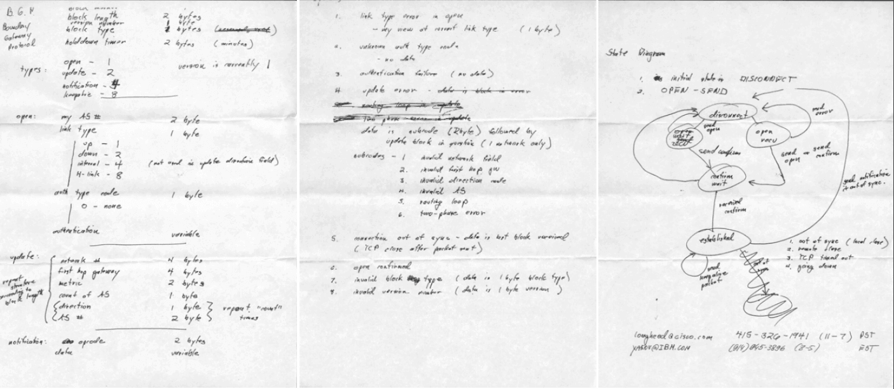
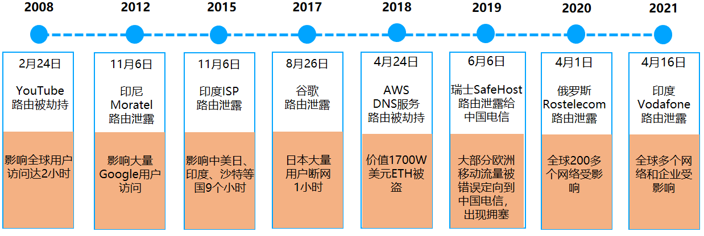
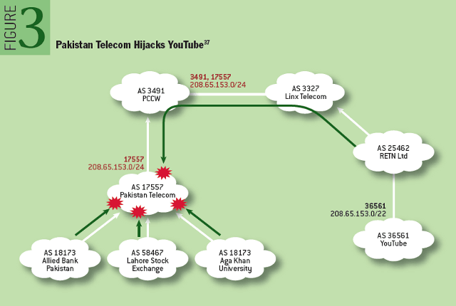
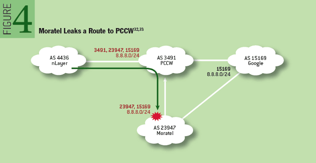
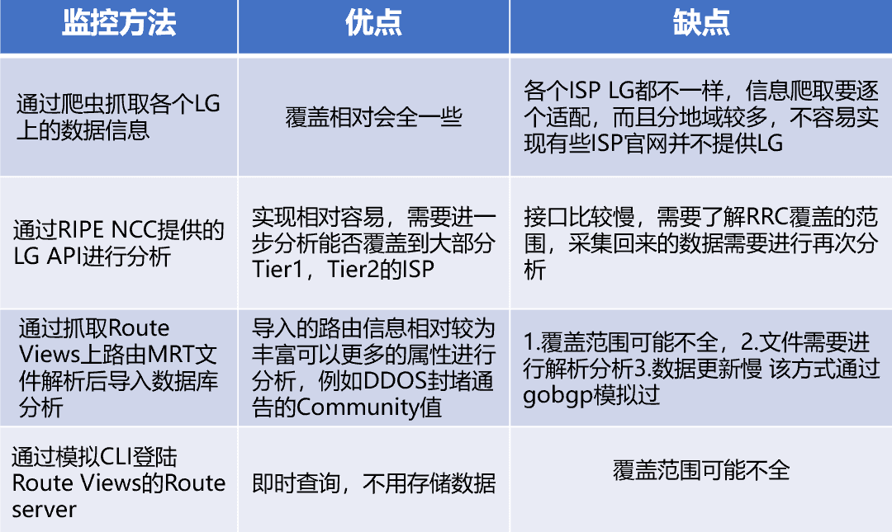

# 关于 BGP 那些事儿

**文｜**宙斯盾 DDoS 防护团队 rocky

# 导语

美国时间 10 月 4 日中午，Facebook 公司网络出现重大故障，故障持续了 6 个小时后才恢复。官方给出的故障原因，简单来说是一次误操作引发了连锁反应（复杂点就是：在例行网络维护中，发送的一条命令无意中关闭了其全球骨干网的所有 BGP 连接，在其 DNS 服务器与内部网络不通后触发了内部机制，自动禁止 DNS 服务所在网段的 BGP 路由播布，而这又导致故障范围进一步加剧，并对故障恢复带来极大困难）。

这是 Facebook 创立以来最严重的一次网络访问事故，在这起故障中，我们又看到了 BGP 的身影（我为什么又要说“又”）。

# BGP 是什么？

BGP 协议，全称 Border Gateway Protocol（边界网关协议），是组成我们当今 Internet 的一种去中心化的自治系统间的动态路由协议，它允许 Internet 上不同 AS（自治系统）之间自动交换 IP 路由信息和可达信息，最主要功能在于控制路由的传播和选择最好的路由，并且还具备冗余备份、消除环路的特点。

该协议，最初是在 1989 年 1 月第 12 次 IETF 会议的午餐期间，Yakov Rekhter、Kurt Lougheed 在 Len Bosak 的帮助下设计的，并写在了三张餐巾纸上（【图 1】），后来于 1989 年 6 月份正式发布了 RFC1105（BGP-1），之后升级到了 RFC1163（BGP-2）、RFC1267（BGP-3）和 RFC1771（BGP- 4），并一直沿用至今当（BGP- 4）。

  
图 1

目前全球有 18W+ 多个 AS，通过 BGP 协议连接构建成了我们整体的互联网，这些 AS 号的使用者包括有各大 ISP 和内容提供商、云服务提供商、互联网企业、教育机构等等。

  
图 2

# BGP 安全问题有哪些？

虽然 BGP 协议在互联网中起着至关重要的作用，但是其安全性却很脆弱，一般 BGP 互联的 2 个 AS 之间，对于接收的 IP 前缀路由缺乏有效的认证机制（国内个别运营商会基于白名单做限制），导致无条件地接收或传播邻居 AS 的路由。

BGP 的这种脆弱性，在遭受恶意攻击或人为变更配置错误时将会变得很突显，会对国家、运营商和企业对来极大威胁。BGP 路由的安全威胁，可以大致分为两大类：BGP 路由劫持（包括 IP 前缀劫持、IP 子前缀劫持、AS 路径篡改）、BGP 路由泄露。前者更多是有目的性、恶意的攻击行为，后者多数发生在网络变更时的配置错误。【图 3】列出了近 10 多年来的一些 BGP 重要安全事件。

  
图 3

## 1、BGP 路由劫持

首先讲讲 IP 前缀劫持，攻击者向外宣告自己拥有受害者的 IP 前缀路由（前缀与受害者 AS 号通告的一样），该路由通过全球网络传播，其他 AS 将使用其本地策略选择合法源 AS 的路由还是攻击者 AS 发起的虚假路由。这种劫持方式，攻击者一般只能劫持到该 IP 前缀的部分流量。

更进一步地，攻击者可以将劫持的 IP 前缀改成比受害者 AS 宣告的更明细（即 IP 子前缀劫持），最终其它 AS 将根据 BGP 最长匹配原则，优先选择攻击者宣告的虚假路由。这种方式，攻击者正常可以劫持绝大部分该子前缀的流量。如【图 4】，2008 年 2 月 24 日，巴基斯坦为了国内言论管制封杀 YouTube 网站，电信局劫持了国内到 YouTube 对应 IP 子前缀 208.65.153.0/24 的访问（比 YouTube 全球宣告的 208.65.153.0/22 粒度更细），但由于电信局上游运营商 PCCW 将该劫持路由也通告了到全球，导致 YouTube 有至少 2/3 的互联网流量被劫持到巴基斯坦，致使其全球用户访问中断了 2 小时。  
  
图 4（截图来自外部）

## 2、BGP 路由泄露

路由泄漏是一种在现网中比较常见的路由事件，一般出现于 ISP 的错误配置，对外宣告了本不应该由该 AS 宣告的 IP 前缀路由，它能够造成 BGP 路由发生严重错误、进而导致互联网部分中断或拥塞。路由泄露，并不涉及虚假的 IP 前缀路由宣告，肇事者向其它 AS 泄露出去的路由是“合法”存在的，只是它违反了 AS 之间的路由策略，结果导致泄露出去的路由涉及 IP 的流量被重定向。

如【图 5】，2012 年 11 月 6 日，因印尼运营商 Moratel 在其路由器的错误配置，导致 Google 的 8.8.8.0/24 的 BGP 网段路由被泄露到了 Moratel 上游运营商 PCCW，并且被 PCCW 扩散了错误的 BGP 路由（由于 PCCW 的本地路由策略）到其网内和互联 AS，结果导致大量访问 Google 的互联网流量经过 PCCW 后先绕行到 Moratel 以至于无法处理，其中香港是影响重灾区，因为 PCCW 是香港的主要电信服务商。

  
图 5（截图来自外部）

这里也总结罗列了下 BGP 安全问题可能造成的影响：

### （1）BGP 路由劫持：

a. 流量被“黑洞”，正常访问中断  
b. 流量被中间人监听或攻击，或重定向到虚假网站以窃取数据  
c. IP 被用于进行垃圾邮件活动  
d. 正常用户访问路径变长，网络延迟增加

### （2）BGP 路由泄露

a. 泄露者 AS 网络流量拥塞，引发网络丢包

b. 造成互联网局部链路拥塞，引发网络丢包

c. 泄露者 AS 无下一跳路径，导致流经该 AS 的流量中断

### （3）其它：

拒绝服务攻击（DoS）：恶意或无意导致的配置错误的 BGP 表内容，将流经该 AS 的流量错误地指向其它 AS 网络，可能引发受害者 AS 网内拥塞或流量中断

# 如何监控和防范

目前业界提出的解决方案主要有两类：一是采集现网数据进行分析、网络主动探测等方式，对 IP 前缀劫持进行检测、定位和缓解，虽然检测与缓解技术目前具有较高的实用性，但现网数据仍存在区域和时间维度的局限性，漏报与误报依然无法避免，且难以预防安全事件的发生。二是通过基于数字签名、安全证书和加密技术等路由认证的安全机制，弥补 BGP 协议认证缺失的缺陷。

## 1、IP 前缀检测

企业可自建监测平台，通过获取全球 BGP 路由更新信息，然后选取本企业的 IP 前缀路由与自己 AS 网络路由发布情况进行对比，主动监控感知 BGP 路由异常情况。包括监控 BGP 路由劫持（判断 BGP 路由信息中 AS\_PATH 的起源 AS 是否正确）、BGP 路由健康度（比如判断单位周期内的路由更新类型、数量）。

监控方案，涉及到的全球 BGP 路由更新数据源，可通过多种方式获取，【图 6】罗列了几种从外界拉取的方式，这些方案均存在一些缺陷，最明显的就是实时性和覆盖率问题。

  
图 6

若无自建监测平台能力，可以使用商业的 BGP 路由监控平台，比如 BGPMon。

企业在监测到 BGP 路由被劫持后，可反制的手段目前比较有限，包括向 ISP 宣告更明细的 IP 子前缀 BGP 路由，或者联系相关涉及 ISP 协助处置。此外，作为用户、企业、教育机构等组织网络接入的提供商（ISP），也有义务针对接入到其网络的 AS 设置路由宣告规则，限制其宣告的 IP 前缀，避免恶意或错误配置导致的错误 IP 前缀 BGP 路由被宣告 ISP 网内，并传播到全球。

## 2、全路由认证安全机制

近年来，比较推广的方案是 RPKI &ROV、BGPsec。

2017 年 10 月，国际互联网工程任务组（IETF）和美国国家标准与技术研究院（NIST）、美国国土安全部（DHS）等机构共同启动了一个名为安全域间路由（SIDR）的联合项目，明确提出应对 BGP 协议进行保护以抵御 BGP 路由攻击威胁。“SIDR”项目主要分为三个基本组成部分：资源公钥基础设施 (RPKI)、BGP 源路由验证（ROV）和 BGP 路径验证 (BGPSec)。

RPKI 是一个分级的认证系统，RPKI 存储有路由来源授权（Route Origin Authorization，ROA），它是一个 IP 地址前缀与 BGP 起源 AS 绑定签名的记录。互联网中的路由器可以利用 ROA 来执行路由来与验证（ROV），识别并丢弃来自未授权 AS 的“无效的”BGP 路由宣告，以此防止 IP 前缀劫持攻击。

不过 RPKI&ROV，只能防范如 BGP 路由劫持中 IP 前缀、子前缀劫持这 2 种起源 AS 欺骗的简单攻击，像 AS 路径篡改、BGP 路由泄露等场景，则需要采用 BGPSec 方案。BGPsec 旨在补充 BGP 源路由验证的不足，当它与 ROV 结合使用时，可以防范各种针对 BGP 的路由劫持攻击。原理是路由宣告过程中，路由器从它的邻居 AS 收到的 IP 前缀路由宣告消息进行签名，签名内容作为路由消息的 BGPsec\_Path 属性传播给其它邻居 AS，当路由器接收到带有 BGPsec\_Path 属性的 IP 前缀更新路由时通过检查签名判断该路由的 AS\_Path 路径是否正确，若错误的话直接丢弃，并不广播给其邻居 AS。

# 我们的一些实践

针对外界 BGP 路由劫持的潜在风险，腾讯安全平台部宙斯盾团队联合网络平台部运营团队，搭建了腾讯 BGP 路由劫持监测平台。

在方案设计上，考虑到监控准确率、时效性以及后续的扩展能力，源数据采集基于网平团队在现网机房的部署 BMP（BGP Monitoring Protocol，BGP 监控协议），通过获取对应的 BGP 路由更新信息进行路由劫持监控。

监测平台上线至今，已在现网多次监控到局部发生的腾讯网段被异常劫持或运营商侧异常变更问题。2021 年 4 月 16 日晚上，Vodafone 在印度的 AS（55410）出现 BGP 路由泄露事件，错误地宣告了 30000 多个 BGP 网段路由，导致全球多个网络和企业受影响，腾讯 BGP 路由劫持监测平台，也及时感知发现了异常，有部分腾讯 BGP 网段被 AS 55410 劫持，并及时进行了处置，最终未影响到业务。

# 写在最后

其实在导语所述故障中除了 BGP 之外，还有另外一个基础协议的身影—DNS，作为互联网的基础设施，BGP 和 DNS 的安全理应得到更多的重视。这类故障不是第一次出现，也必然不会是最后一次出现。希望从顶层设计到底层实现，从业界到厂商，能共同携手更好的提升这里的安全能力。如同这个文章也许受众会很窄、浏览量会很低，但是我们仍然希望更多的朋友能看到。

### 参考资料：

[https://queue.acm.org/detail.cfm?id=2668966](https://queue.acm.org/detail.cfm?id=2668966)

# 团队介绍

宙斯盾 DDoS 防护团队基于十余年的 DDoS 防护技术积累，持续为 QQ、微信、王者荣耀、英雄联盟等自研业务提供专业、可靠的 DDoS 攻击防护解决方案。与腾讯云安全团队合作推出高防产品为云上客户提供专业、可靠的 DDoS 解决方案。
