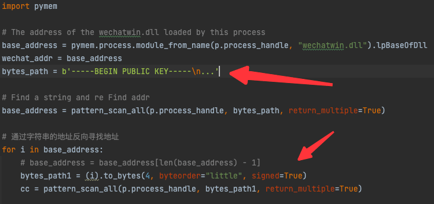
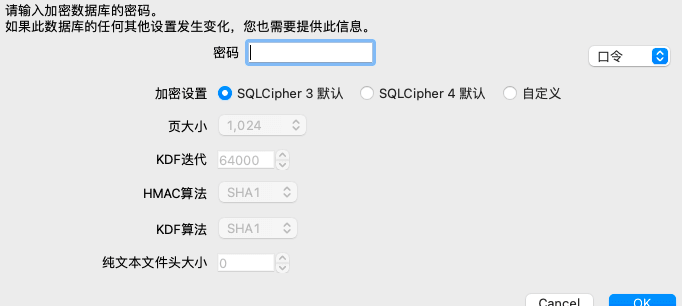
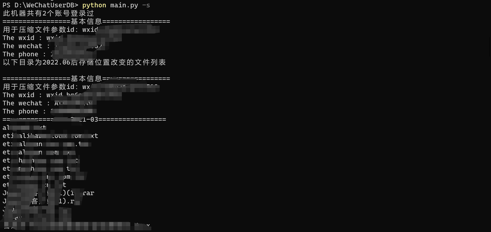

## 关于微信数据库的解密以及取证

- - -

# [0x00 前言](#toc_0x00)

之前研究过一段时间的 wx 聊天记录解密，以及小程序解密，但是在晚上陆续搜了几篇文章后发现解密教程要么下载 Visual Studio，不然就是对 web 安全人员不友好的 od 调试，而且根据系统的不同，解密方法也不同，于是作者用为数不多的编程知识写出了这篇教程 - -在这里记录一下解密的原理以及一些方法分享给大家。

[项目地址](https://github.com/x1hy9/WeChatUserDB) ：代码有些粗糙，有精力的小伙伴们可以自行 fork 改造下，原先想写 GO 版本来着但是用 python 开了个头就继续写下去了

# [0x01 原理](#toc_0x01)

> SQLite 是一个轻量级的、开源的关系型数据库，是目前移动平台（如 iOS、Android）数据库的最佳选择。然而免费版的 SQLite 是不支持加密的（官网下的默认就是免费版的） ，这就导致了存储在 SQLite 中的数据很容易被人查看到，不法分子可能会利用数据库表结构及内容字段分析我们的应用，进而发起攻击。出于安全的考虑，我们当然要对数据库文件进行加密。

微信数据库的类型是 sqlite，不管是 ios 还是 mac 还是 win 或者安卓，区别在于每个数据库都加密了但是加密的密钥不同，这里 win 和 mac 主要采用从远程服务器获取一些信息加上本地的某些信息通过一系列算法生成的密钥通过 AES 加密的，AES 的密钥是 32 位，而且所有数据库文件共用一个密钥，我们需要找到那个 AES 密钥才能进行解密，然后才能对数据库文件进行操作。但是安卓和 ios 不同，通过翻阅一些文章发现，手机端的数据库生成的密钥是通过本地已有数据进行生成的密钥，仅有 7 位，我们可以通过暴力破解的方式获取密钥。

解密 PC 数据库 一般都是通过 od 附加微信进行动态调试 [https://bbs.pediy.com/thread-251303.htm](https://bbs.pediy.com/thread-251303.htm)  
还有一种办法就是通过寻找微信模块的地址然后加上偏移量就能获取密钥以及一些用户信息，但是这也有个问题就是当每次微信版本更新时偏移量也会随之改变，我看到解决方法是作者需要每个版本获取偏移量，然后更新工具这样也很麻烦。  
于是根据别人的文章分析了一下，如果说每次偏移量都会变但是相关信息的数据结构的相对便宜量不会变，这种方式可以全版本通用，通俗一点来讲就是，每次私钥和 wxid 的字符串地址虽然会变但是相对位置不变，我可以通过 wxid 的字符串加减多少一定能找到私钥的地址。

# [0x02 分析](#toc_0x02)

这里我首先通过往常一样的动调发现，在密钥出现的上下地址中存在另一种公钥和私钥的字符串  
\-----BEGIN PUBLIC KEY-----\\n...这不就是一个很好的特征吗  
于是我们首先通过 python 中的 pymem 模块来操作内存，至于为什么要用这个模块的，因为他对初学者比较友好里面封装了很多函数，很方便调用适合我这种对 win 系统不了解的人，按照这个思路我们先找到-----BEGIN PUBLIC KEY-----字符串的地址，再去反向搜索这个地址的地址，根据测试这个地址一般是大于**WeChatWin.dll** 但也不是绝对有些情况会导致搜不到这个字符串地址。  
[](https://storage.tttang.com/media/attachment/2022/07/15/8fe99ea7-56f4-4a4f-a9d9-2eb92c6e0df7.png)

但是这里出现了一个问题，我在学习 pymem 的过程中通过翻阅文档发现有一个全局搜索函数**pattern\_scan\_all**，但是通过实际下载 pymem 模块时候却没有了这个函数，于是我这里只好自己把这个函数再重新写一遍。  
\`\`\`def pattern\_scan\_all(handle, pattern, \*, return\_multiple=False):

```plain
from pymem.pattern import scan_pattern_page
next_region = 0

found = []
user_space_limit = 0x7FFFFFFF0000 if sys.maxsize > 2 ** 32 else 0x7fff0000
while next_region < user_space_limit:
    next_region, page_found = scan_pattern_page(
        handle,
        next_region,
        pattern,
        return_multiple=return_multiple
    )

    if not return_multiple and page_found:
        return page_found

    if page_found:
        found += page_found

if not return_multiple:
    return None

return found
```

```plain
再根据分析整体数据结构的偏移量就可获得很多信息了


# 0x03 解密
上面已经获取了很多信息，接下来我准备开始解密，但是有一个问题，如果我们通过下载 Visual Studio 的 c++ 库编写解密脚本而且还要自行编译，本身我也不会 c++，而且 Visual Studio 太过臃肿，我这里在网上搜了好半天，看看有没有什么 python 解密 sqlite 的库结果发现[pysqlcipher3](https://pypi.org/project/pysqlcipher3/)可以用来解密，但是在安装的过程中，发现安装失败，结果去网上论坛搜索还是需要静态编译链接，我尝试了几次发现还是要下载 Visual Studio，于是这个库我只好放弃，但是在解密 mac 的过程中可以使用上述的这个模块我们只需要在 mac 系统中安装相应工具就可以使用该模块了
```

brew install sqlcipher

```plain
回到 windows，我实在找不到结局方案，只好使用比较 low 的方法，通过 subprocess 去调用工具，工具还是蛮小的方法可行。
```

```plain
if not db_file:
    raise ValueError("db_File is not defined!")

if not secret_key:
    raise ValueError("secret_key is not defined!")
salt = open(db_file, 'rb').read(16)
dk = hashlib.pbkdf2_hmac('sha1', secret_key, salt, 64000, dklen=32)
exe_cmd = "%s %s" % (get_exe_file(), db_file)
p2 = Popen(exe_cmd, stdout=PIPE, stdin=PIPE, stderr=PIPE, shell=True)
cmd_sql = '''PRAGMA key = "x'%s'";PRAGMA cipher_page_size=4096; ATTACH DATABASE 'decrypt_%s' AS plaintext KEY ''; SELECT sqlcipher_export('plaintext'); DETACH DATABASE plaintext;''' % (binascii.hexlify(dk).decode(),os.path.basename(db_file))

code, message = p2.communicate(bytes(cmd_sql, encoding='utf-8'))
```

\`\`\`

这里我们写好了相关解密脚本结果 mac 数据库和 win 数据库采用的加密方式不同，于是我又去了解了一下

> 传入密钥  
> 通过 Rand\_bytes 算法生成 16 个字节的 salt，并存储在数据库第一页的头部（SQLite3 的 db 文件，头部前 16 个字节固定为 SQLite 3 format，所以可以利用文件头来存储一些数据）。  
> 通过 PKCS5\_PBKDF2\_HMAC\_SHA1 算法将密钥和 salt 一起加密并多次迭代，生成 AES 加密所用的 key；此处是对 key 的加密，即使原始的密码泄露，也无法解密数据。  
> 通过 AES 对称加密算法对每一页的文件内容（有效的内容，不包含文件头和 reserved 字段）进行加密。  
> 加密时，文件执行过 AES 加密后，对文件内容，通过 Hmac 算法，获取文件校验码，填充在 page 尾部（SQLite3 提供了 reserved 字段，自动在 page 尾部预留一段空间）。  
> 解密时，先调用 Hmac 算法获取文件标识码，与 page 尾部的数据进行对比，如果数据一致，则证明文件没有被篡改过，不然证明文件已经被篡改，则抛出异常。  
> PS：以上为默认的算法，sqlCipher 没有固定算法，用户可以自己设置。

经测试 windows 系统的 wx 数据库就是用上述加密方式，首先会通过读取文件头生成 16 个字节的 salt，再使用 PBKDF2\_HMAC\_SHA1 算法设置迭代次数为 64000 次生成的密钥这样的话解密就很简单了

```plain
 salt = open(db_file, 'rb').read(16)
    dk = hashlib.pbkdf2_hmac('sha1', secret_key, salt, 64000, dklen=32)
    exe_cmd = "%s %s" % (get_exe_file(), db_file)
    p2 = Popen(exe_cmd, stdout=PIPE, stdin=PIPE, stderr=PIPE, shell=True)
    cmd_sql = '''PRAGMA key = "x'%s'";PRAGMA cipher_page_size=4096; ATTACH DATABASE 'decrypt_%s' AS plaintext KEY ''; SELECT sqlcipher_export('plaintext'); DETACH DATABASE plaintext;''' % (binascii.hexlify(dk).decode(),os.path.basename(db_file))
```

这里也遇到了坑 key 可以有两种表现方式，一种是单纯字符串口令，另一种就是原始密钥，我们从内存中获取的是原始密钥所以要输入的是**PRAGMA key = "x'密钥'"**  
我们回到 mac 密钥的获取，因为 mac 的权限管理做的很死，我们首先需要关闭 SIP(系统完整性保护)

> 系统完整性保护（SIP）是 OS X El Capitan 及更高版本所采用的一项安全技术，旨在帮助防止潜在恶意软件修改 Mac 上受保护的文件和文件夹，但这也造成了安装某些特殊版本软件的或者做特殊修改的时候权限不足。在这里就体现在使用 LLDB 调试时候，所有的调试语句都会被系统拒绝，因此在正式进行调试之前，一个重要的准备工作就是检查系统完整性保护（SIP）的开启状态，如果开启的话，要把它关闭。  
> 检查 SIP 的开启状态  
> 在终端里输入 csrutil status 回车，如果看到：

`System Integrity Protection status: enabled.`

这说明的 SIP 已经开启，如果要继续调试的话，需要关闭。如果是 `System Integrity Protection status: disabled.` 则说明 SIP 已经处于关闭状态，可以直接进行调试。

1.  重启，并在开机的时候长按 Command 和 R
2.  进入系统恢复状态
3.  点击屏幕顶部工具栏上的 实用工具，选择终端
4.  在终端中输入 `csrutil disable` 回车，会出现下述字符串，再次重启生效  
    `Successfully disabled System Integrity Protection. Please restart the machine for the changes to take effect.`

然后我们就可以开始调试微信了  
1\. 打开电脑端微信（不要登陆）  
2\. 在 Terminal 输入命令`lldb -p $(pgrep WeChat)`  
3\. 输入`br set -n sqlite3_key`，回车  
4\. 输入`c`，回车  
5\. 手机扫码登陆电脑端微信  
6\. 这时候电脑端微信是会卡在登陆界面的，不需要担心，回到 Terminal  
7\. 输入`memory read --size 1 --format x --count 32 $rsi`，回车就可以获取到了密钥

```plain
0x6000003624e0: 0x54 0x60 0x97 0x05 0xb5 0x09 0x43 0x9f
0x6000003624e8: 0x94 0xe8 0x38 0x09 0xdc 0x5e 0x79 0x53
0x6000003624f0: 0x4f 0xdc 0xa1 0x66 0x8e 0x96 0x4a 0x98
0x6000003624f8: 0x9a 0x72 0xa6 0x17 0xe0 0x17 0x7c 0x56
```

这里我们可以直接`PRAGMA cipher_compatibility = 3`就可以设置好解密参数了，这是一个标准  
[](https://storage.tttang.com/media/attachment/2022/07/15/cfd07397-fcd4-4600-bae9-054d2e61bda7.png)

解密效果如下  
[](https://storage.tttang.com/media/attachment/2022/07/15/ee006f67-3607-4fa9-948f-c61bab60c04c.png)

# [0x04 一些其它功能](#toc_0x04)

微信在 2022.06 月之后更改了传输文件存储位置，和每个人聊天所传输的文件会被放在不同的文件夹下，大大提升了我们寻找历史文件的难度，于是我写了个整合文件名输出的功能  
[](https://storage.tttang.com/media/attachment/2022/07/15/94856489-a43b-4e73-b508-ac15d9ff6148.png)

还有就是压缩功能可以分别压缩数据库，图片，历史传输文件

[](https://storage.tttang.com/media/attachment/2022/07/15/02180aaf-86e6-48f3-ac9d-776ed9c3a035.png)

# [0x05 碎碎念](#toc_0x05)

原先想继续完善安卓和 ios 的解密脚本来着，但是作者马上要开始准备秋招了没时间写，等过段时间再更新下，写这篇文章的目的是想让大家接触下电子取证这个方向的知识，不仅仅是微信还有一些社交软件都可以尝试去分析下，例如 soul，陌陌，qq 等。不限于 app 甚至是阿里云镜像取证，这个方向也有很多知识值得学习。

参考：  
[https://bbs.pediy.com/thread-250714.htm](https://bbs.pediy.com/thread-250714.htm)  
[https://www.zetetic.net/sqlcipher/sqlcipher-api/](https://www.zetetic.net/sqlcipher/sqlcipher-api/)  
[https://github.com/allen1881996/WeChat-Data-Analysis](https://github.com/allen1881996/WeChat-Data-Analysis)
