# 内网穿透工具 Chisel 二开和使用

> ❝
> 
> Chisel 是一个快速 TCP/UDP 隧道，通过 Websocket 传输，使用 SSH 加密协议进行连接。使用用 Go 语言编写。Websocket 协议是 http 协议的补充，相较于 http 协议，Websocekt 实现了长连接、全双工通信通道，具有更高效的通信效率。该工具相较于 FRP 有没有太多的功能提供选择，代码量远没有 FRP 多，在攻防演练过程中可以作为 FRP 的下位替代。但是同样和常见的开源内网穿透工具一样，如果没有对代码的重构的话，会被各大杀毒软件检测，所以还需要做绕过杀软和流量检测。

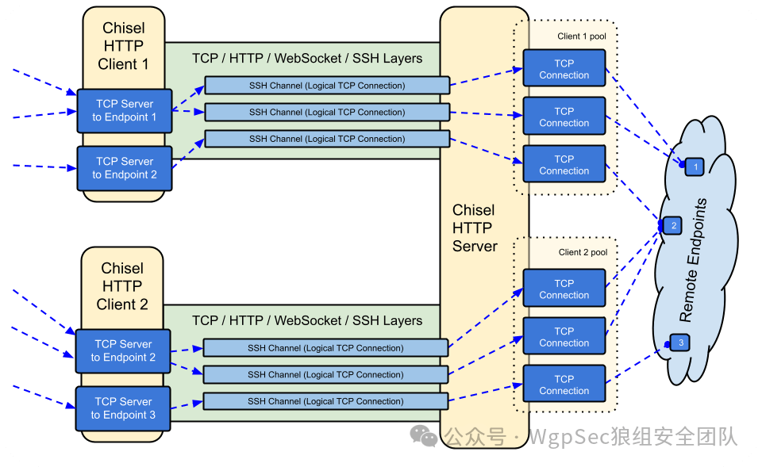

Pasted image 20240107111554.png

# 绕过流量检测

## 硬编码特征

首先 chisel 客户端在连接服务端的过程中使用的是 http 协议，默认是不使用 https 协议的，这就导致在整个的传输过程中请求的信息是以明文的形式传输的。隧道搭建时，客户端会先与服务端建立 Websocket 连接，在 Websocket Upgrade 包中会包含一个隐性的特征 `User-Agent: Go-http-client/1.1` 和一个显性的特征 `Sec-WebSocket-Protocol: chisel-v3` 这两个特征都可以被用来当作检测 chisel 的特征。

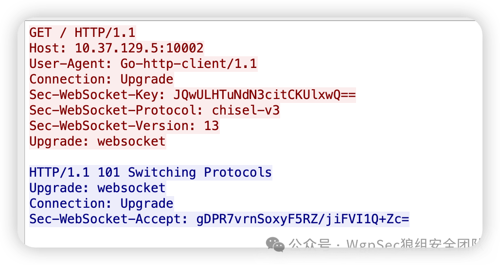

Pasted image 20240107113116.png

这块信息可以在 https://github.com/jpillora/chisel/blob/3de177432cd23db58e57f376b62ad497cc10840f/share/version.go#L7 这里进行修改。而 `User-Agent` 可以在配置文件中的 `header` 参数进行修改。

```plain
// in chisel/share/version.go
package chshare

var ProtocolVersion = "chisel-v3"

var BuildVersion = "0.0.0-src"
```

在 Websocket 建立连接之后，chisel 会在隧道中进行 SSH 加密协议的协商，协商的版本也是一个硬编码特征 `SSH-chisel-v3-server`，这其实也会是一个流量检测的特征。客户端的代码在 https://github.com/jpillora/chisel/blob/3de177432cd23db58e57f376b62ad497cc10840f/client/client.go#L178，服务端的代码在 https://github.com/jpillora/chisel/blob/3de177432cd23db58e57f376b62ad497cc10840f/server/server.go#L117，通过修改成正常的 SSH 协商版本即可，但是因为 SSH 隧道与正常的 SSH 连接之间存在握手、交互方式设计的不同，数据包到达时间、分组大小等统计特征，虽说流量设备不知道具体内容是什么，但是会检测到 SSH 隧道，所以不建议使用明文的 HTTP 进行传输，参考 SSH 加密隧道流量攻击与检测技术。

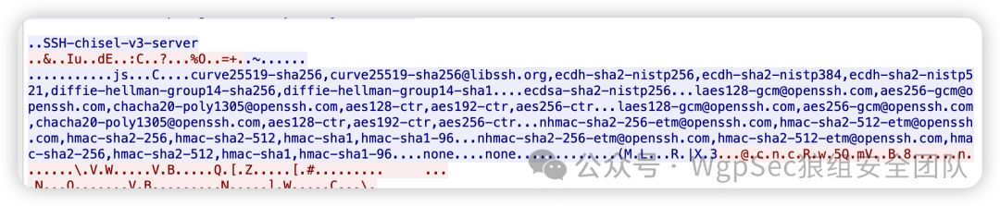

Pasted image 20240107120146.png

那么我们在使用 TLS 加密传输会遇到哪些问题呢，首先很多的内网穿透工具因为要适配各个平台的操作系统，所以大部分会使用 golang 语言进行开发，所以通常会使用 `crypto/tls` 这个官方库，使用这个库去进行 tls 握手是存在一个比较明显的 JA3 指纹的，不仅仅客户端会有 tls 指纹，服务端也会有 tls 指纹。

## JA3 指纹

TLS 握手指纹又叫 SSL 指纹，或者 JA3 指纹，是根据客户端向服务端发送的 Client Hello 信息中部分字段计算得出的 hash 值信息。

此外，在 TLS 握手中还有服务端响应的 Server Hello，这类信息也有特征，根据类似的思路可以得到 JA3S 指纹。又由于服务端会根据不同的 Client Hello 响应不同的 Server Hello，根据这个又可以得到 JARM 指纹。

那么什么是 JA3 和 JA3S 指纹呢？因为 TLS 握手是以明文的形式进程传输的，因此可以使用 Client Hello 数据包中的详细信息对客户端应用程序进行指纹识别。主要是识别以下几个参数：

-   SSLVersion：TLS 版本
    
-   Cipher：可接受的加密方式
    
-   SSLExtension：扩展列表
    
-   EllipticCurve：椭圆曲线
    
-   EllipticCurvePointFormat：椭圆曲线格式
    

然后按顺序将这些值连接在一起，使用`,`分隔每个字段，使用`-`分隔每个字段中的每个值，如果没有 TLS/SSL 扩展则留空，最后对这些字符串进行 MD5 散列以生成易于使用和共享的 32 个字符指纹，这就是 JA3 客户端指纹。通过这些参数计算出 MD5，然后使用该值来标记客户端特征。

常见的客户端 TLS 指纹如下：

| 客户端 | TLS 指纹 |
| --- | --- |
| Golang | 771,49195-49199-49196-49200-52393-52392-49161-49171-49162-49172-156-157-47-53-49170-10-4865-4866-4867,0-5-10-11-13-65281-23-18-43-51,29-23-24-25,0 |
| Chrome 108 | 771,4865-4866-4867-49195-49199-49196-49200-52393-52392-49171-49172-156-157-47-53,0-23-65281-10-11-35-16-5-13-18-51-45-43-27-17513-21,29-23-24,0 |
| Chrome 109 | 771,4865-4866-4867-49195-49199-49196-49200-52393-52392-49171-49172-156-157-47-53,23-10-11-17513-43-18-35-65281-13-27-16-45-51-0-5-21,29-23-24,0 |
| Chrome 120 | 771,4865-4866-4867-49195-49199-49196-49200-52393-52392-49171-49172-156-157-47-53,10-45-13-17513-0-5-43-16-65037-35-18-51-11-65281-23-27,29-23-24,0 |
| Firefox 120 | 771,4865-4867-4866-49195-49199-52393-52392-49196-49200-49162-49161-49171-49172-156-157-47-53,0-23-65281-10-11-16-5-34-51-43-13-28-65037,29-23-24-25-256-257,0 |
| IOS 14 | 771,4865-4866-4867-49196-49195-52393-49200-49199-52392-49188-49187-49162-49161-49192-49191-49172-49171-157-156-61-60-53-47-49160-49170-10,0-23-65281-10-11-16-5-13-18-51-45-43-21,29-23-24-25,0 |
| Android 11 | 771,49195-49196-52393-49199-49200-52392-49171-49172-156-157-47-53,0-23-65281-10-11-5-13,29-23-24,0 |
| Safari 16 | 771,4865-4866-4867-49196-49195-52393-49200-49199-52392-49162-49161-49172-49171-157-156-53-47-49160-49170-10,0-23-65281-10-11-16-5-13-18-51-45-43-27-21,29-23-24-25,0 |

对于服务器端，同一台服务器会根据不同的 Client Hello 对不同的客户端进行不一样的 Server Hello 回复。JA3S 指纹主要依靠 `SSLVersion,Cipher,SSLExtension` 这三个字段进行 hash 计算，而在很多检测中，需要通过结合`JA3 + JA3S`对客户端与其服务器之间的整个加密协商进行指纹识别。因为服务器会对不同的客户端做出不同的响应，但对同一个客户端的响应总是相同的。

那什么是 JARM 呢？TLS Server 根据 TLS Client Hello 中参数的不同，返回不同的 Server Hello 数据包。而 Client Hello 的参数可以人为指定修改，因此通过发送多个精心构造（比如指定不同的 TLS 版本、支持套件等来试探服务端响应情况）的 Client Hello 获取其对应的特殊 Server Hello（包含服务器返回的加密套件、服务器返回选择使用的 TLS 协议版本、TLS 扩展 ALPN 协议信息、TLS 扩展列表等信息），最终形成 JARM 指纹信息，来标记服务器的特征。具体能够产生影响的参数包括但不限于：

-   操作系统及其版本
    
-   OpenSSL 等第三方库及其版本
    
-   第三方库的调用顺序
    
-   用户自定义配置
    

与 JA3/JA3S 是在流量被动监听中得到的方式不同的是，JARM 是通过主动探测的方式得到，在很多云服务厂商在检测恶意流量的时候，会通过使用不同的 Client Hello 指纹探测的方式去探测目标服务器是否是 C2 服务器。

## Bypass TLS 指纹

之前也提到，golang 编写的工具默认使用 `crypto/tls`，在进行 TLS 握手的时候会产生比较强的 golang 指纹，所以在对客户端进行修改的时候需要将 `crypto/tls` 进行替换。

Utls 是 Fork 的 `crypto/tls` 库，所以基本上可以使用 utls 来平替掉 `crypto/tls` 库。又因为 chisel 使用 Websocket 进行隧道搭建，默认使用的是 `github.com/gorilla/websocket` 库，这个库也是默认使用的 `crypto/tls` 官方库，所以需要将 `github.com/gorilla/websocket` 库下载到本地对其进行修改，下面是主要修改的代码，通过自定义的指纹类型和指纹版本对 JA3 指纹的修改。

```plain
// in chisel/websocket/client.go 
if u.Scheme == "https" && d.NetDialTLSContext == nil {  
// If NetDialTLSContext is set, assume that the TLS handshake has already been done  
  
cfg := cloneTLSConfig(d.TLSClientConfig)  
 if cfg.ServerName == "" {  
  cfg.ServerName = hostNoPort  
 }  
 // Client -> UClient
 tlsConn := tls.UClient(netConn, cfg, tls.ClientHelloID{tlsfp, tlsfpversion, nil, nil})  
 netConn = tlsConn  
  
 if trace != nil && trace.TLSHandshakeStart != nil {  
  trace.TLSHandshakeStart()  
 }  
 err := doHandshake(ctx, tlsConn, cfg)  
 if trace != nil && trace.TLSHandshakeDone != nil {  
 //trace.TLSHandshakeDone(tlsConn.ConnectionState(), err)  
}
```

```plain
// in websocket/tls_handshake.go
func doHandshake(ctx context.Context, tlsConn *tls.UConn, cfg *tls.Config) error {  
 if err := tlsConn.HandshakeContext(ctx); err != nil {  
 return err  
}  
 if !cfg.InsecureSkipVerify {  
  if err := tlsConn.VerifyHostname(cfg.ServerName); err != nil {  
 return err  
  }  
 }  
 return nil  
}
```

我们在配置文件中将指纹设置成 Chrome 102：

```plain
tlsfingerprinter = "Chrome"  
tlsfpversion = "102"
```


Pasted image 20240107134724.png

chisel 客户端默认 JA3 指纹：`771,49195-49199-49196-49200-52393-52392-49161-49171-49162-49172-156-157-47-53-49170-10-4865-4866-4867,0-5-10-11-13-65281-23-18-43-51,29-23-24-25,0`

chisel 替换后客户端 JA3 指纹：`771,4865-4866-4867-49195-49199-49196-49200-52393-52392-49171-49172-156-157-47-53,0-23-65281-10-11-35-16-5-13-18-51-45-43-27-17513-21,29-23-24,0`

Chrome 102 JA3 指纹：`771,4865-4866-4867-49195-49199-49196-49200-52393-52392-49171-49172-156-157-47-53,0-23-65281-10-11-35-16-5-13-18-51-45-43-27-17513-21,29-23-24,0`

> ❝
> 
> 因为 Chrome 在 108 版本以后加密套件的位置顺序不一致，会导致指纹不同，所以按照 108 版本以前的来测试。

那我们如何 Bypass JARM 指纹呢，首先 Chisel 是支持开启 https 监听的，同样的默认使用 `crypto/tls` 库的话还是会出现存在特定指纹，所以在绕过 JARM 指纹有以下方法：

-   使用 Nginx 反向代理
    
-   使用 CDN 回源
    

### Nginx 反向代理

在使用 Nginx 方向代理的时候需要自己购买域名，需要自己去编写 Nginx 的配置文件，因为 Websocket 的特性，我们可以使用添加路径的方式去隐藏我们的服务端的真实路径，同样可以使用回落机制（通过路径或者 http 头部判断反向代理地址，默认转发到类似百度的官网这样的地址）去迷惑防守方，但是在国内服务器上容易导致备案，所以在国内服务器上不建议这样做。

nginx 配置文件如下：

```plain
user www-data;
worker_processes auto;
pid /run/nginx.pid;
include /etc/nginx/modules-enabled/*.conf;

events {
  worker_connections 768;
}

http {
 include       mime.types;
 default_type  application/octet-stream;
 map $http_upgrade $connection_upgrade {
    default upgrade;
    '' close;
 }
 sendfile        on;
 keepalive_timeout  65;
 types_hash_max_size 4096;

 server {
   listen 443 ssl;
   listen [::]:443 ssl;

   server_name abc.efg.com;  
   ssl_certificate       /etc/nginx/ssl/dev.crt; 
   ssl_certificate_key   /etc/nginx/ssl/dev.key;
   ssl_session_timeout 1d;
   ssl_session_cache shared:MozSSL:10m;
   ssl_session_tickets off;

   ssl_protocols         TLSv1.2 TLSv1.3;
   ssl_ciphers           ECDHE-ECDSA-AES128-GCM-SHA256:ECDHE-RSA-AES128-GCM-SHA256:ECDHE-ECDSA-AES256-GCM-SHA384:ECDHE-RSA-AES256-GCM-SHA384:ECDHE-ECDSA-CHACHA20-POLY1305:ECDHE-RSA-CHACHA20-POLY1305:DHE-RSA-AES128-GCM-SHA256:DHE-RSA-AES256-GCM-SHA384;
   ssl_prefer_server_ciphers off;
   location / {
        return 404;
    }
    // Arbitrary paths and multiple levels of directories can be used.
    location /abcdefg {
        if ($request_method = 'OPTIONS') {
            add_header 'Access-Control-Allow-Origin' 'https://abc.efg.com';
            add_header 'Access-Control-Allow-Credentials' 'true';
            add_header 'Access-Control-Allow-Headers' 'Authorization,Accept,Origin,DNT,Keep-Alive,User-Agent,X-Requested-With,If-Modified-Since,Cache-Control,Content-Type,Content-Range,Range';
            add_header 'Access-Control-Allow-Methods' 'GET,POST,OPTIONS,PUT,DELETE,PATCH';
            add_header 'Access-Control-Max-Age' 1728000;
            add_header 'Content-Type' 'text/plain charset=UTF-8';
            add_header 'Content-Length' 0;
            return 204; 
        }

        add_header 'Access-Control-Allow-Credentials' 'true';
        add_header 'Access-Control-Allow-Headers' 'Authorization,Accept,Origin,DNT,Keep-Alive,User-Agent,X-Requested-With,If-Modified-Since,Cache-Control,Content-Type,Content-Range,Range';
        add_header 'Access-Control-Allow-Methods' 'GET,POST,OPTIONS,PUT,DELETE,PATCH';

        proxy_redirect off;
        proxy_set_header Host $proxy_host;
        proxy_set_header X-Real-IP $remote_addr;
        proxy_pass "http://127.0.0.1:10001";
        proxy_hide_header 'access-control-allow-origin';
        add_header 'access-control-allow-origin' 'https://abc.efg.com';
        proxy_set_header Upgrade $http_upgrade;
        proxy_set_header Connection $connection_upgrade;
    }
}    


server {
    listen 80;
    server_name abc.efg.com;    
    rewrite ^(.*)$ https://${server_name}$1 permanent;
  }
}
```

这里可以通过修改 `ssl_ciphers` 参数来对 JARM 进行修改，不添加的话使用 Nginx 的默认参数

这里使用默认的 chisel 开启 https 监听端口，这里我们使用本地自签名证书。

```plain
./chisel_1.9.1_linux_arm64 server --port 443 --tls-key /etc/nginx/ssl/dev.key --tls-cert /etc/nginx/ssl/dev.crt 0 0.0.0.0 --reverse -v
```

通过 jarm 获取 jarm 指纹

```plain
python3 jarm.py uat.chiseltools.com
Domain: uat.chiseltools.com
Resolved IP: 10.0.0.0
JARM: 3fd21b20d3fd3fd21c43d21b21b43d50c8594d0a42335f3aca21f0ce31ac7c
```

同样使用不一样的域名和证书，其指纹还是一致的

```plain
python3 jarm.py two.chiseltools.com
Domain: two.chiseltools.com
Resolved IP: 10.0.0.0
JARM: 3fd21b20d3fd3fd21c43d21b21b43d50c8594d0a42335f3aca21f0ce31ac7c
```

使用 nginx 前置代理后的 jarm 指纹如下：

```plain
python3 jarm.py uat.chiseltools.com
Domain: uat.chiseltools.com
Resolved IP: 10.211.55.7
JARM: 29d3fd00029d29d00042d43d0000008aec5bb03750a1d7eddfa29fb2d1deea
```

从这里可以看出 JARM 指纹已经改变了。

通过修改 `ssl_ciphers` 参数后：

```plain
python3 jarm.py uat.chiseltools.com
Domain: uat.chiseltools.com
Resolved IP: 10.0.0.0
JARM: 21d19d00021d21d00042d43d0000006b37d6530d889f7f8b12e5e3252591f7
```

### CDN

这里我推荐两家可以使用白名单域名和证书的国外 CDN 厂商：

-   Fastly
    
-   Gcore
    

这里我以 Fastly 的 CDN 为例：

首先注册一个 Fastly 的账户，这里可以使用临时邮箱进行注册，如果注册失败的话换一个代理地址进行注册。

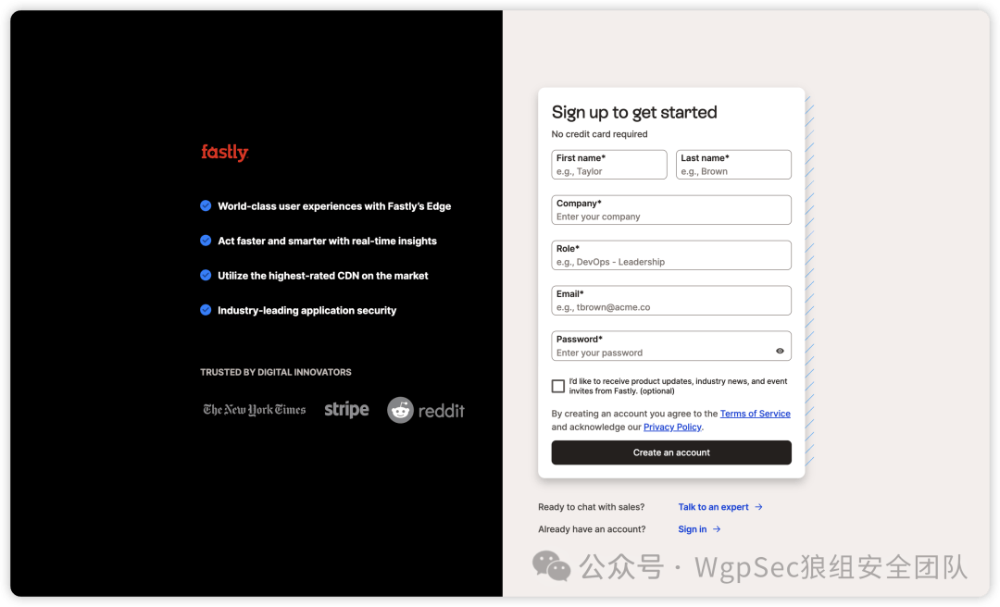

image.png

创建一个 CDN：

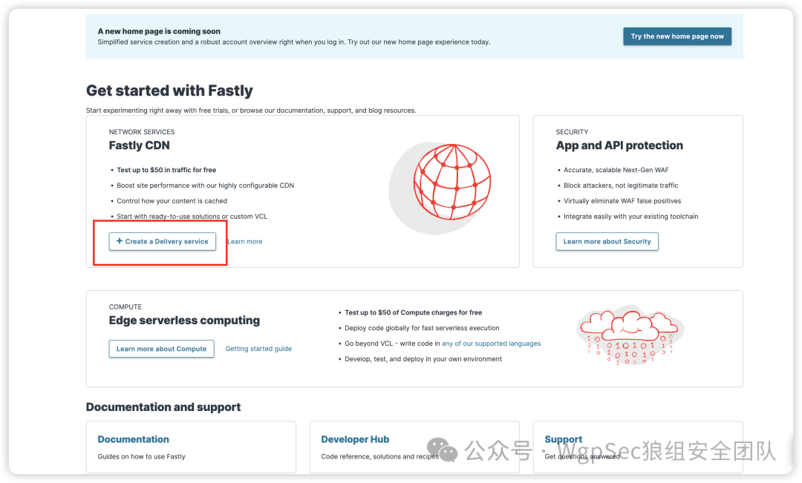

image.png

添加一个域名，这个域名是用来回源的，它不校验真实性，可以随意填写：

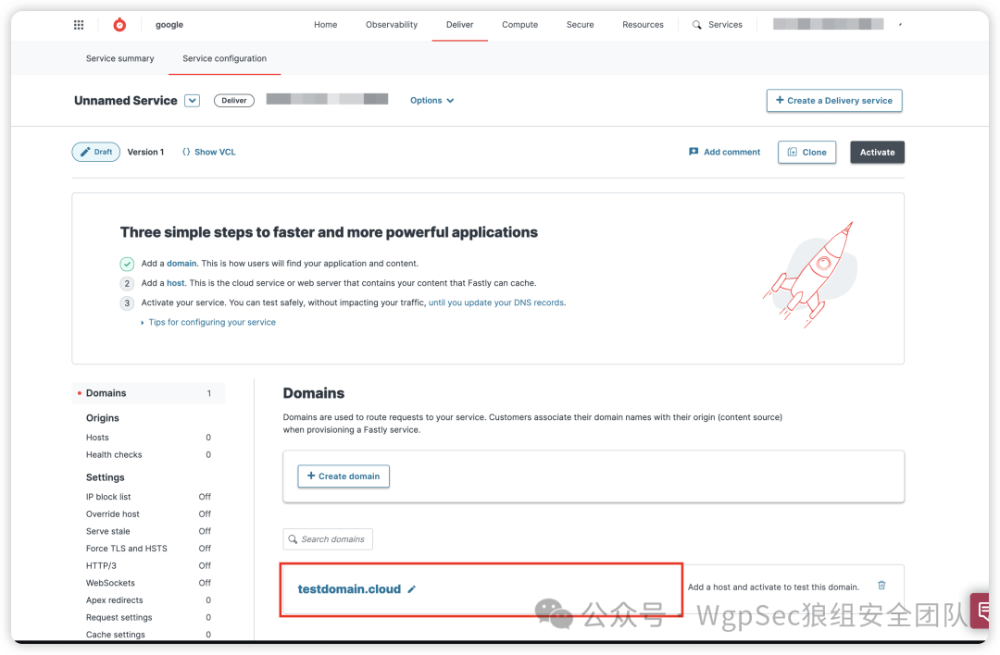

image.png

然后开启 Websocket 回源：

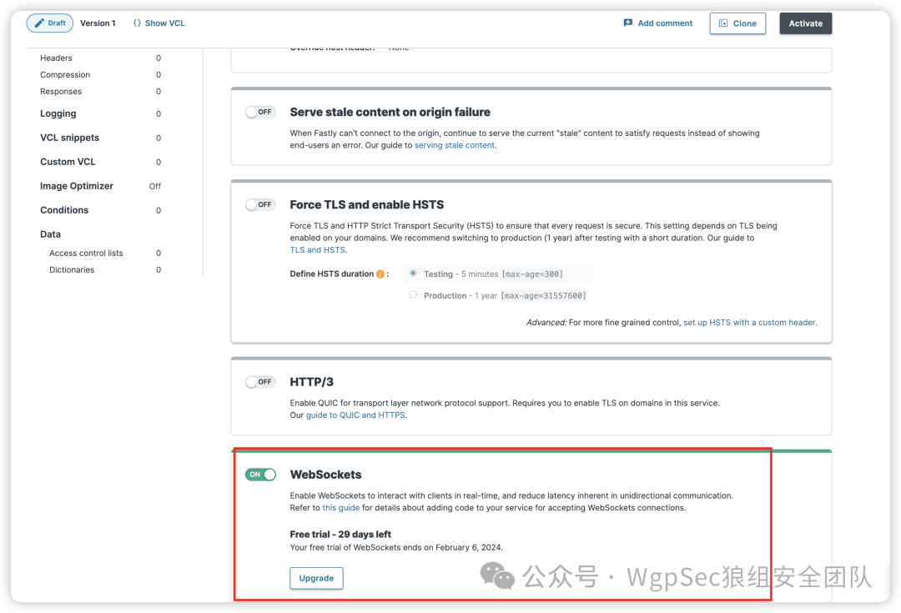

image.png

然后点击 VCL snippets 添加一条规则：

```plain
if (req.http.Upgrade) {
    return (upgrade);
}
```

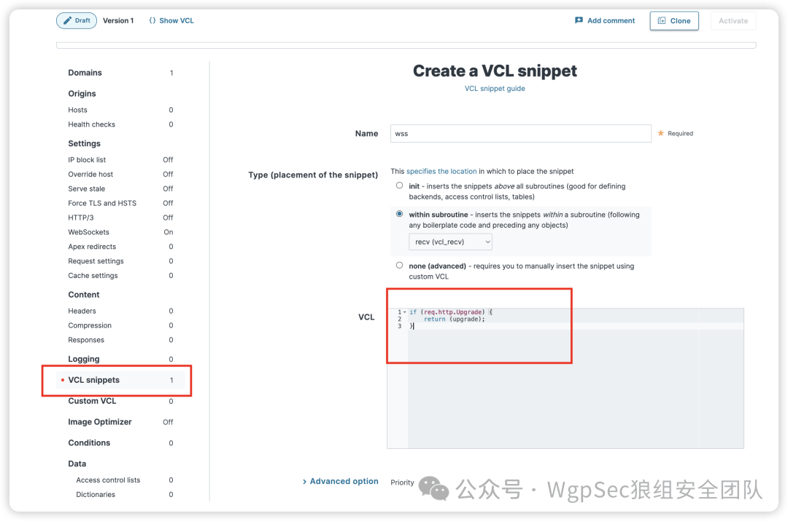

image.png

找到 Host 添加回源的 ip 地址和端口号，默认为 80 端口

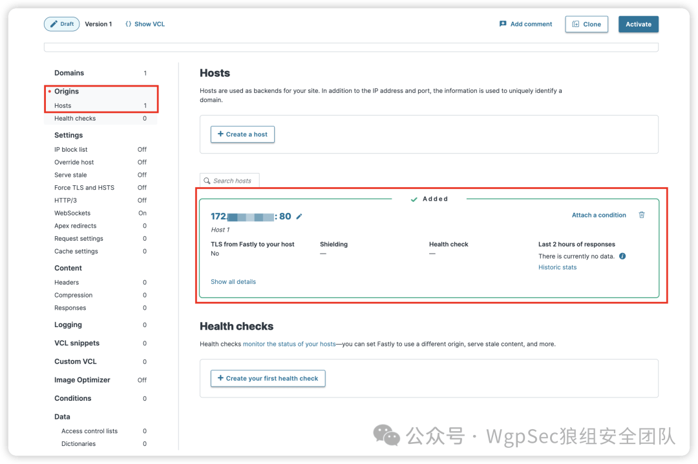

image.png

点击 active 等待几分钟即可。

因为 Fastly 的特点，只要是使用 Fastly CDN 的站点都可以进行进行回源，fofa 查询：`cloud_name="fastly"` ，所以我们可以通过使用别人的域名和别人的证书对 chisel 进行回源。

这里可以看到 `python.org` 所有的子域名都挂在 Fastly 的 CDN 下面，所以我们可以使用 `www.python.org` 对 Websocket 进行回源。

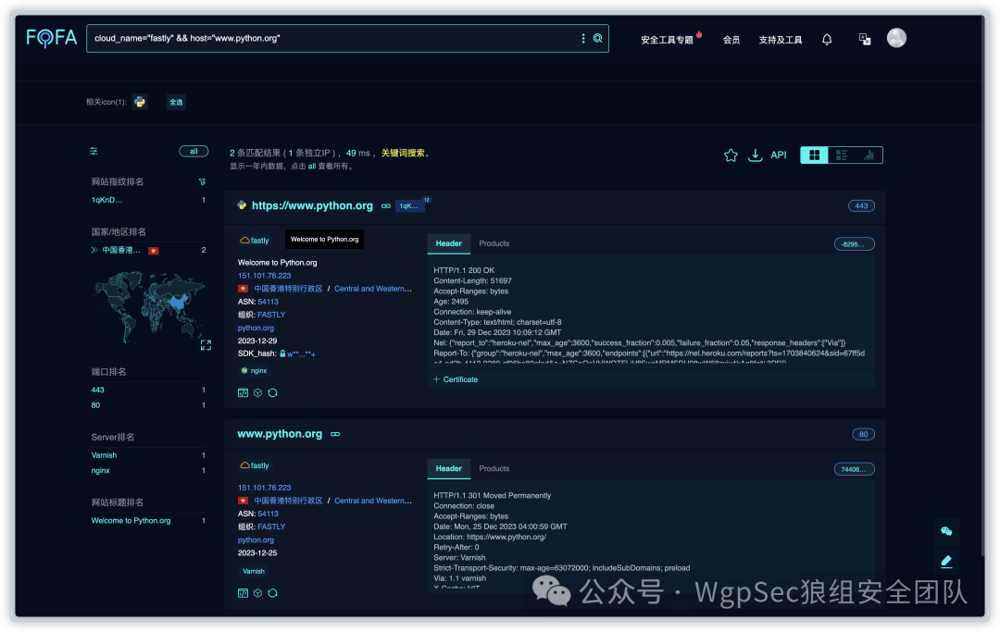

Pasted image 20240107151030.png

配置文件中需要添加如下配置：

> ❝
> 
> 默认 sni 就是访问地址的域名，可以不填写，如果二层代理就需要填写 sni 地址。

```plain
[server]  
addr = "https://www.python.org"  
path = ""
......

# 这里填写当时配置的域名
hostname = "testdomain.cloud"  
sni = "www.python.org"
```

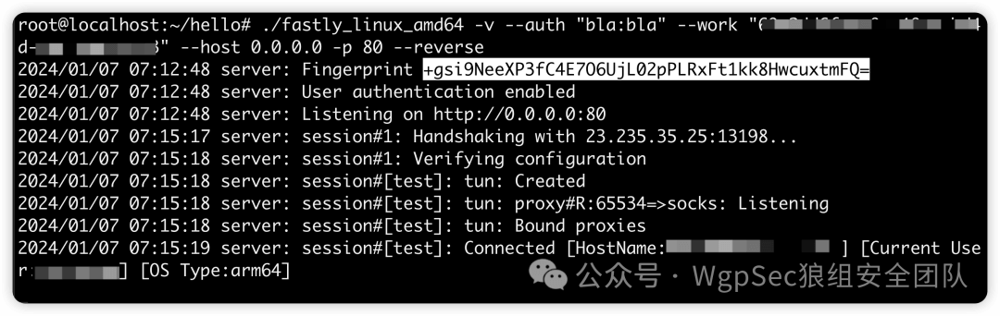

Pasted image 20240107151628.png

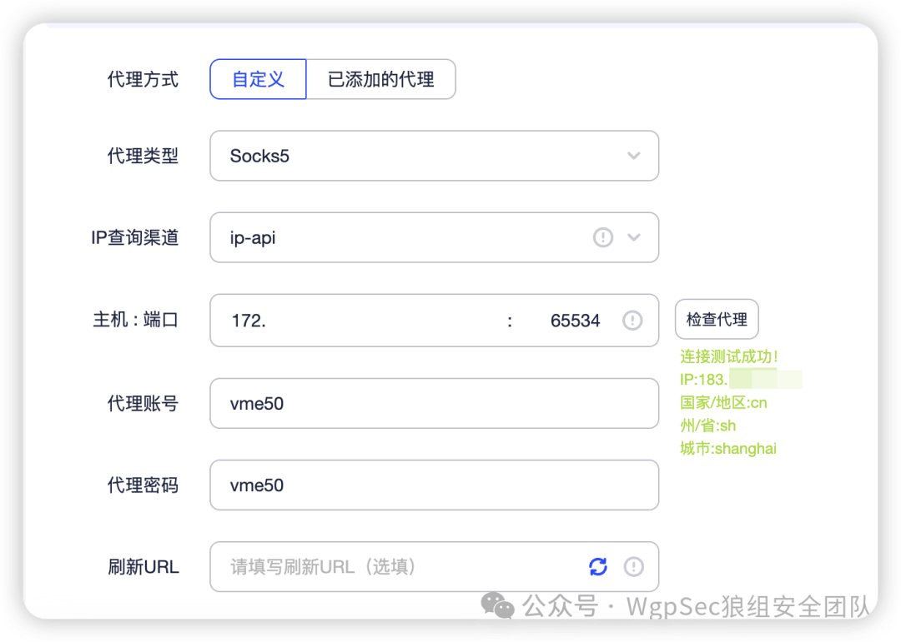

Pasted image 20240107201708.png

从抓流量包来看，SNI 地址为 `www.python.org` 证书也是 `www.python.org` 的证书。

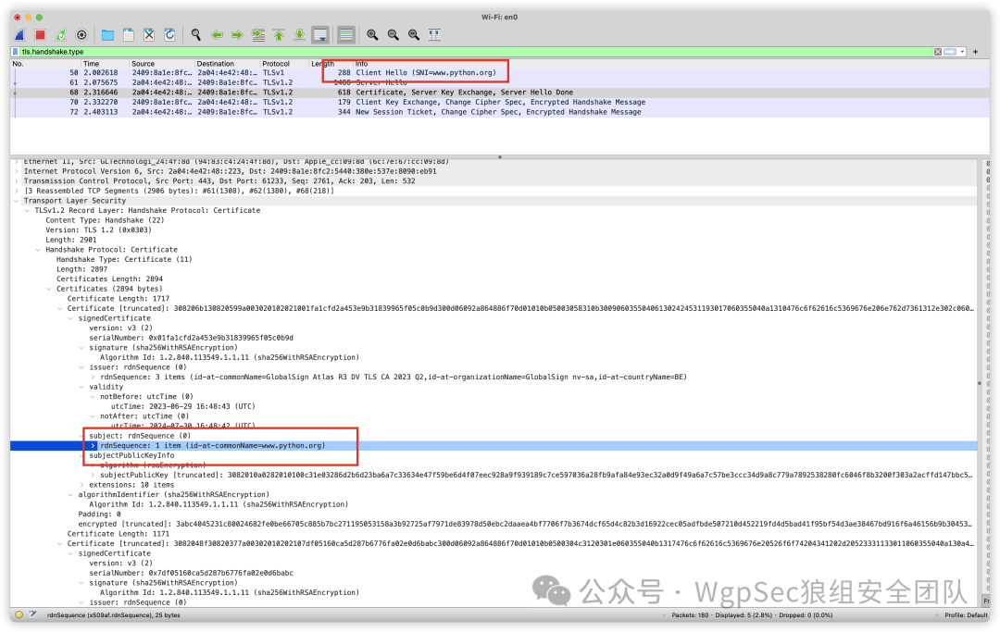

Pasted image 20240107152314.png


Pasted image 20240107152435.png

在学习的过程中发现 Fastly 其实是存在 TLS 指纹检测的，因为客户端的 TLS 指纹是修改过的，所以在之前一直连接不上。

在这篇 Automating and Defending Nefarious Automation 文章中写到 Fastly 是怎么去防御 TLS 指纹修改的，为了检测高级的机器人，Fastly 会去使用 JavaScript 收集的事件和属性，比如是鼠标移动、按下按键、屏幕分辨率和设备属性。显然我们通过修改 TLS 指纹伪装成浏览器的指纹，Fastly 就会自动启动这项检测，所以导致回源不了到我们的服务器地址，经过测试发现，使用 Android 11 和随机非浏览器的指纹能够绕过这个检测，成功回源，所以默认的配置的指纹就是随机的指纹。

> ❝
> 
> 这种通过国外 CDN 回源的连接，最好是在访问 Socks5 前再挂一层代理，速度就会很快了

我这里使用的是 Surge，配置一条规则并开启增强模式即可。

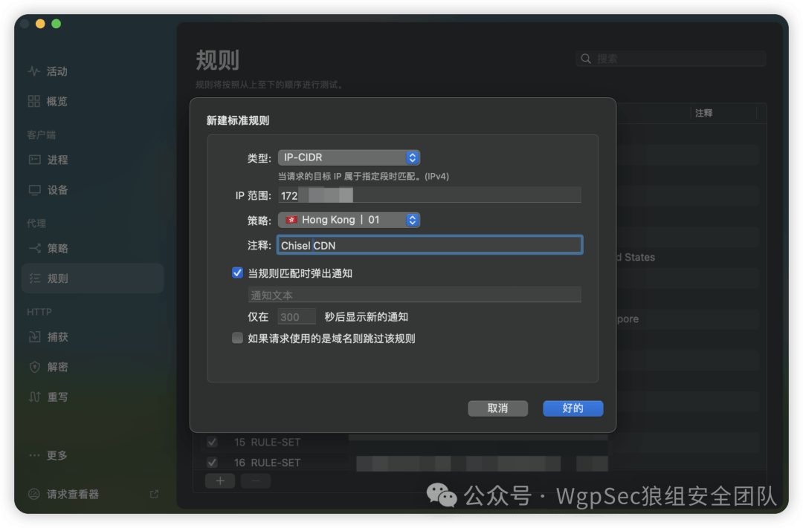

Pasted image 20240107202038.png

## 客户端免杀

其实代理工具和 C2 木马的免杀方式其实不太一样，隧道代理工具主要实现的功能其实就是发出 tcp 或者 http 请求，大部分软件其实都会有这些功能。主要是绕过一些静态特征。

### 修改代码逻辑

因为 Chisel 本身就是客户端服务端一体，所以在修改的时候考虑到程序的大小以及防止白嫖，将客户端和服务端的代码进行了拆分；其次就是通过比如添加函数进行套娃，增加运行函数也在一定程度上修改运行逻辑。

```plain
func ChiselGo() {  
chclient.RunClient()  
}  
  
func main() {  
ChiselGo()  
}
```

### 修改关键字

Golang 在打包文件的时候会将以下信息也打包到二进制文件中：

-   Go Version
    
-   Go BuildID
    
-   GOROOT
    
-   函数名称和源码路径
    
-   struct 和 type 和 interface
    

这里一开始想的是通过 Garble 对这些信息进行混淆，也顺便增加一些逆向的难度，但是这个 go 代码混淆工具被写 C2 免杀的玩坏了，直接全代码混淆，直接会被火绒识别成 `Sliver`。

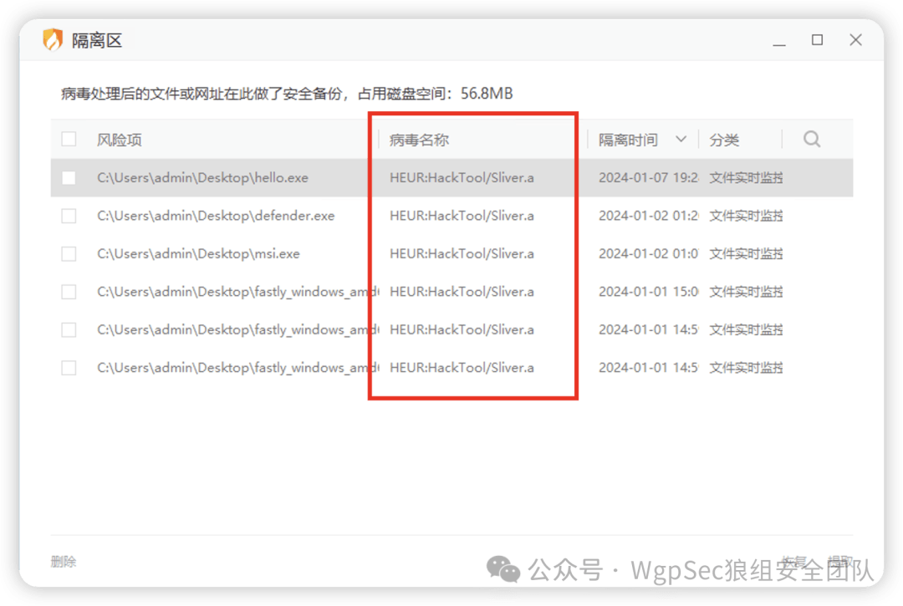发现如果对部分代码进行混淆就可以过免杀，包括 360、火绒和 defender，部分代码混淆的编译语句如下：

> ❝
> 
> 在编译的过程中可能会遇到 `golang.org/x/crypto/ssh`无法编译的问题，可以参考 \[issues 807\](https://github.com/burrowers/garble/issues/807)，使用 `v0.13.0`版本即可。

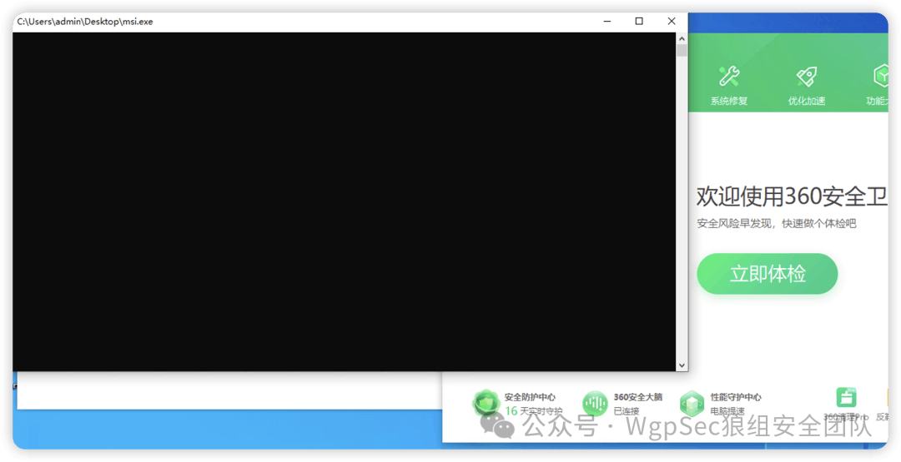

Pasted image 20240107193551.png

主要是通过 `GOGARBLE=chisel,github.com` 这个参数来控制部分代码混淆，但是 Garble 混淆过的二进制文件，不会对结构体的名称以及参数进行混淆，一些工具的特定参数名称就会变成特征值。

## 一些改动

-   \[x\] 增加了服务端 Log 日志回显，包括连接 IP，上线客户端主机信息等
    
-   \[x\] 企业微信上线提醒
    
-   \[x\] 客户端和服务端分离
    
-   \[x\] 客户端以配置文件的形式输入参数，配置文件进行 DES 加密
    
-   \[x\] 添加 socks auth
    
-   \[x\] 自动删除主体文件和配置文件
    
-   \[x\] 自定义 JA3 客户端指纹
    
-   \[x\] 客户端程序 fork 子进程执行，且进程名自定义
    
-   \[ \] SharpChisel
    

## 使用方法

Server 端使用方法：

```plain
# 首先生成 SSH 连接的 Private Key
chisels --keygen -
# or save it to disk --keygen /path/to/mykey

chisles -v --auth {user:pass} --keyfile {keyfile} --work {WxWork Bot ID} --host 0.0.0.0 -p {Port} --reverse
```

Client 端使用方法：

编辑 example.toml 文件：

```plain
# Client Config
[server]
addr = ""
path = ""

[client]
# A *strongly recommended* fingerprint stringto perform host-key validation against the server's public key.
fingerprint = ""
# An optional username and password (client authentication) in the form: "<user>:<pass>".
auth = ""
# An optional keepalive interval. Since the underlying transport is HTTP, in many instances we'll be traversing through proxies, often these proxies will close idle connections.
keepalive = 0
# Maximum number of times to retry before exiting. Defaults to unlimited.
max-retry-count = 0
# Maximum wait time before retrying after a disconnection. Defaults to 5 minutes.
max-retry-interval = 0
# An optional HTTP CONNECT or SOCKS5 proxy which will be used to reach the chisel server.
proxy = ""
# Set a custom header in the form "HeaderName: HeaderContent".
header = ["User-agent: Mozilla/5.0 (Windows NT 10.0; Win64; x64) AppleWebKit/537.36 (KHTML, like Gecko) Chrome/108.0.6099.63 Safari/537.36"]
# Optionally set the 'Host' header (defaults to the host found in the server url).
hostname = ""
# Override the ServerName when using TLS (defaults to the hostname).
sni = ""
# An optional root certificate bundle used to verify the server.
tls-ca = ""
# Skip server TLS certificate verification of chain and host name (if TLS is used for transport connections to server).
tls-skip-verify = false
# a path to a PEM encoded private key used for client authentication (mutual-TLS).
tls-key = ""
# a path to a PEM encoded certificate matching the provided private key.
tls-cert = ""
# Enable verbose logging
verbose = true

remote = ["R:socks"]
tlsfingerprinter = "Randomized-NoALPN"
tlsfpversion = "0"

[socks5]
socks5name = ""
socks5auth = ""
socks5allowhosts = []
```

然后通过 Server 端对客户端配置文件进行加密生成名称为 runtime 的文件，将这个文件保存在和客户端同目录即可。

```plain
chisels --encrypt ./example.toml
```

多级代理的话需要在目标服务器上开启一个转发端口，假设边界的 ip 为 `192.168.1.1`

```plain
# 这里的意思就是将 192.168.1.1 的 2222 端口的流量转发到 uat.chiseltools.com 的 443 端口
remote = ["0.0.0.0:2222:uat.chiseltools.com:443"]
```

然后在需要二级代理的服务器上讲服务器地址填写成以下内容

```plain
[server]
# 一级代理的 2222 端口地址
addr = "192.168.1.1:2222"
# 公网上的服务端路径
path = ""
......

# 如果使用了 CDN 的话需要填写以下信息
# hostname 设置成配置的域名
hostname = ""
# SNI 填写 CDN 直连的域名
sni = ""
```
