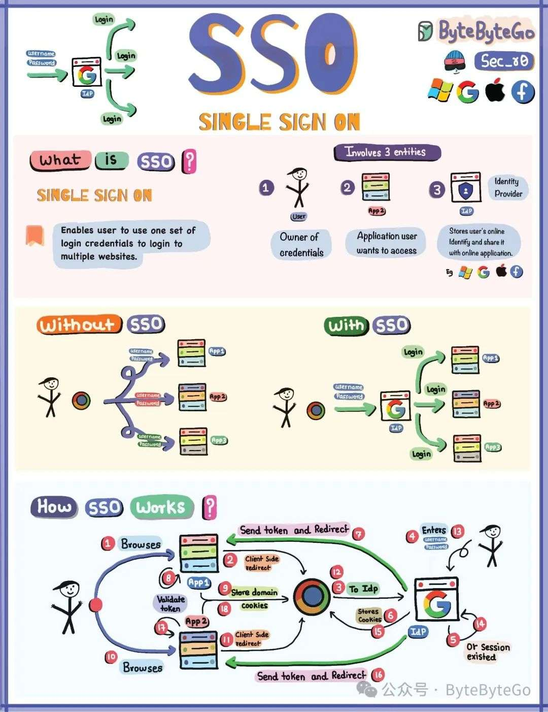

# 单点登录是怎么工作的？

今天来聊聊单点登录（Single Sign On）。

## 01 单点登录的主要参与者

1.  用户 - 申请访问应用程序的个人
    
2.  身份供应商（IDP）- 对用户进行身份验证（如谷歌、Facebook）
    
3.  应用程序 - 用户希望访问的软件或服务
    

## 02 SSO 的优势

### 增强用户体验

用户只需记住一套凭证，简化了对多个服务或应用程序的访问，减少了登录多个系统所花费的时间。

用户可以在应用程序或服务之间进行更无缝的切换，这在用户需要访问各种工具来执行任务的环境中尤为有利。

### 集中安全性和访问管理

SSO 允许集中管理用户访问和身份验证策略，从而更容易实施强大的安全措施，如多因子身份验证（MFA）和密码复杂性要求。

### 提高安全性

当员工离开组织或改变角色时，SSO 可简化一次性撤销或修改其对所有连接系统的访问权限的过程。

### 减少密码疲劳

只需记住一套凭证，用户就不太可能采用不安全的做法，如使用简单、容易猜到的密码或写下密码。

### 简化合规报告

SSO 解决方案通常提供全面的日志和报告功能，使监控访问模式、调查安全事件和证明符合监管要求变得更容易。

### 提高数据准确性

统一身份：SSO 有助于在所有系统中为每个用户保持单一、一致的身份，从而提高用户数据的准确性并减少不一致。

## 03 SSO 如何工作

-   用户尝试登录应用程序
    
-   应用程序将用户重定向到 SSO/IDP
    
-   IDP 验证用户
    
-   IDP 发出经过验证的令牌
    
-   令牌发回浏览器
    
-   浏览器向应用程序出示令牌
    
-   应用程序授予访问权，无需重新输入凭证
    

通过这种简化流程，用户只需一次登录即可访问多个应用程序，从而提高了便利性和安全性。
