# "另类"APP漏洞挖掘 - 先知社区

"另类"APP漏洞挖掘

- - -

## APP渗透常规思路

说到APP渗透，各位可能会想到脱壳、模拟器、刷机、挂代理，然后开展渗透测试。某次渗透测试通过url：下载apk文件，首先进行反编译，发现有壳，尝试脱壳失败。其次抓包的时候发现全部加密。

[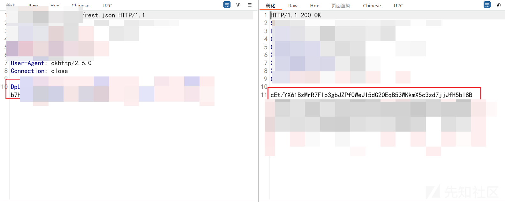](https://xzfile.aliyuncs.com/media/upload/picture/20240301163432-86c2db08-d7a6-1.png)

正常思路是脱壳APP、查询源码等等找加密方式，但是奈何本菜狗啥都不会这里另辟蹊径、走捷径找到了加密方式。

## 另辟蹊径获得严重漏洞

下载完毕APK之后，修改后缀为ZIP。apk文件中的assets目录，看到了www目录。

[](https://xzfile.aliyuncs.com/media/upload/picture/20240301163652-da98af50-d7a6-1.png)

格式化文件umi.js，([https://www.1tool.site/#/javascript?id=1](https://www.1tool.site/#/javascript?id=1) )，使用notepadd++正则表达式匹配路径。

[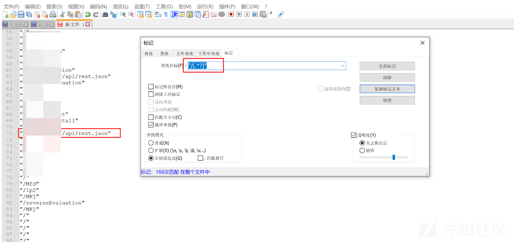](https://xzfile.aliyuncs.com/media/upload/picture/20240301163732-f26bdb16-d7a6-1.png)

在源码中搜索路径和mode字符串,177个结果。

[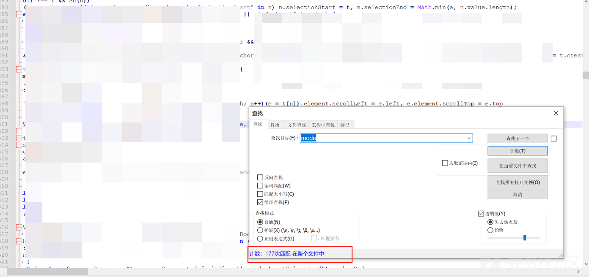](https://xzfile.aliyuncs.com/media/upload/picture/20240301163807-07097362-d7a7-1.png)

直接搜索常见的加密方式:ECB、CBC，发现key和偏移

[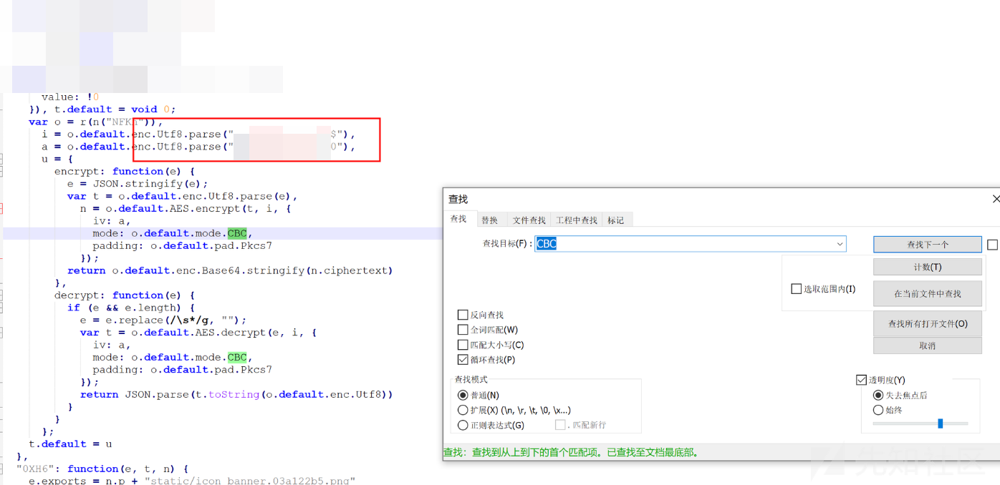](https://xzfile.aliyuncs.com/media/upload/picture/20240301163839-1a8b2f98-d7a7-1.png)

将数据解密得到

[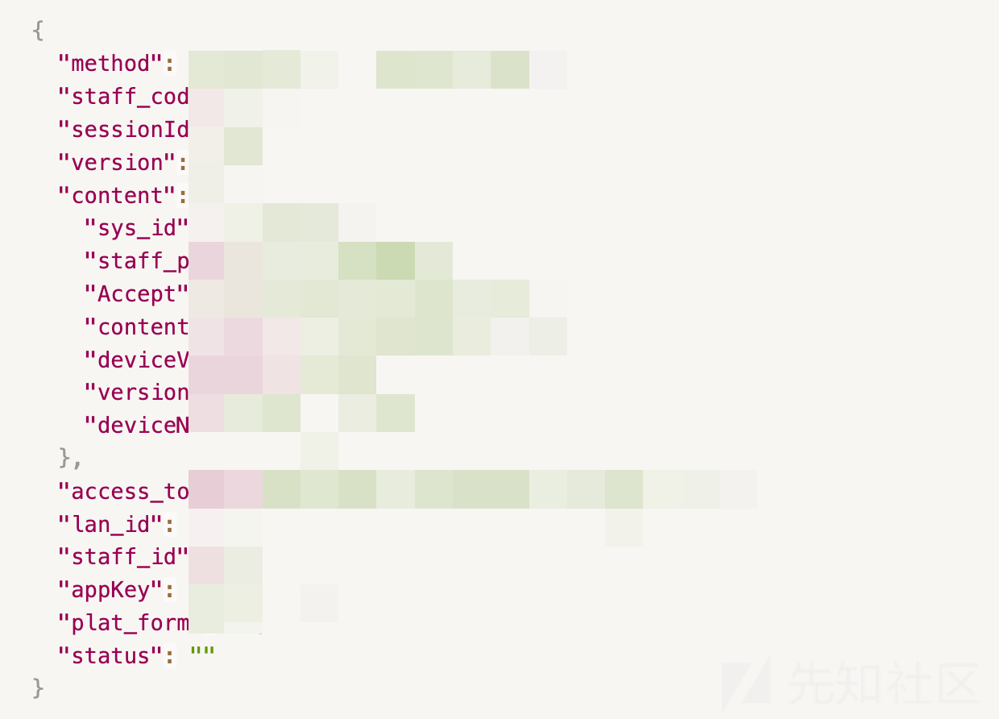](https://xzfile.aliyuncs.com/media/upload/picture/20240301163903-28546b08-d7a7-1.png)

可以看到method参数，继续在js中查看该格式的请求方式。找到一个请求为qryNextOrgStructureView，将请求方式替换为zyhyy.qryNextOrgStructureView，然后加密数据得到响应包。

```plain
return (0, r.requestWithContent)("zyhyy.qryOrgStructureView", {
        user_name: e
      })
    }, t.queryNextOrgnization = function(e) {
      var t = e.areaId,
        n = void 0 === t ? "" : t,
        o = e.staffType,
        i = void 0 === o ? "" : o;
      return (0, r.requestWithContent)("zyhyy.qryNextOrgStructureView", {
        area_id: "" + n,
        staff_type: "" + i
      })
```

[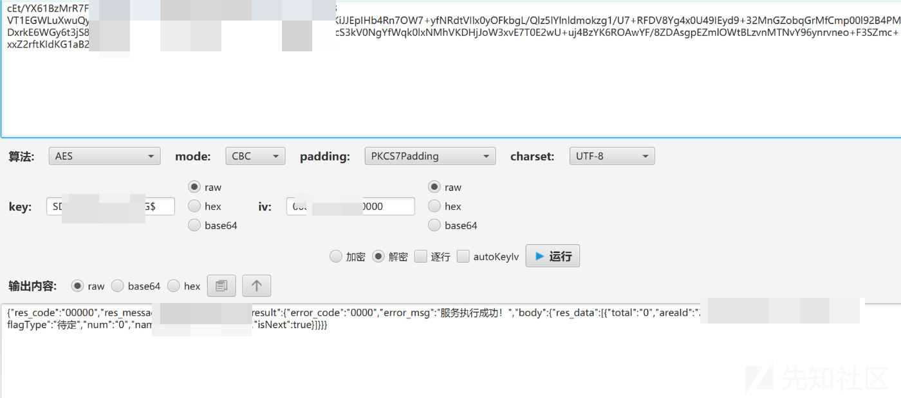](https://xzfile.aliyuncs.com/media/upload/picture/20240301164026-59faaf0a-d7a7-1.png)

发现areaId值可用，于是在js文件中继续搜索method为zyhyy开头的，发现zyhyy.qryOrgInfoByAreaId，构造area\_id值和staff\_type值在数据包中:

[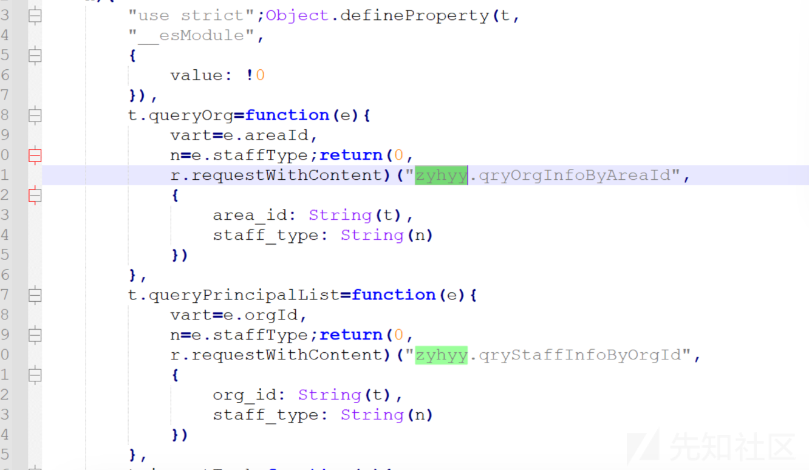](https://xzfile.aliyuncs.com/media/upload/picture/20240301164049-67e2332c-d7a7-1.png)

构造请求包

[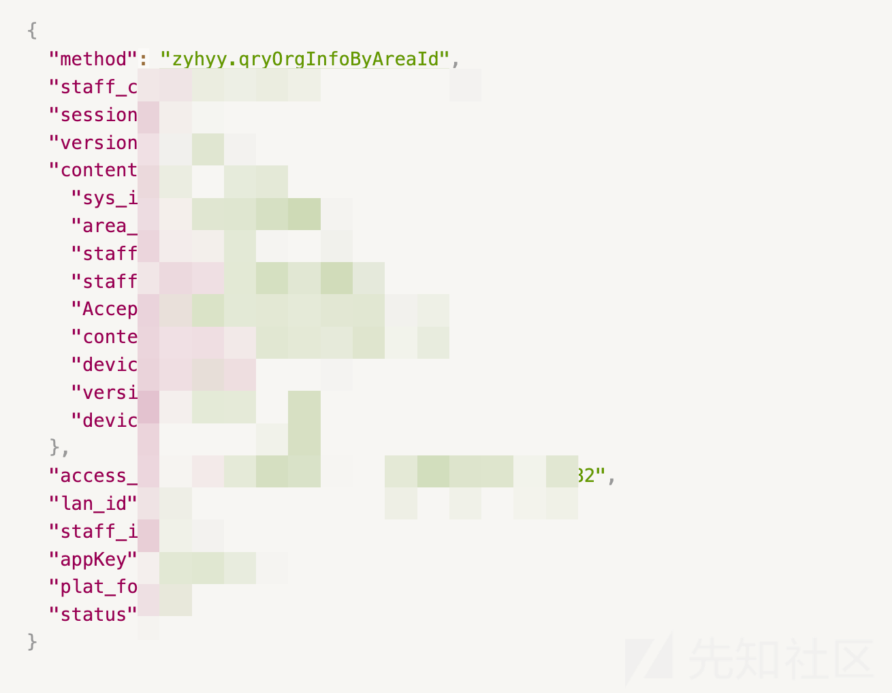](https://xzfile.aliyuncs.com/media/upload/picture/20240301164125-7ceebf42-d7a7-1.png)

加密发包

上面为构造的data数据，发包后解密响应体得到返回结果如下：

[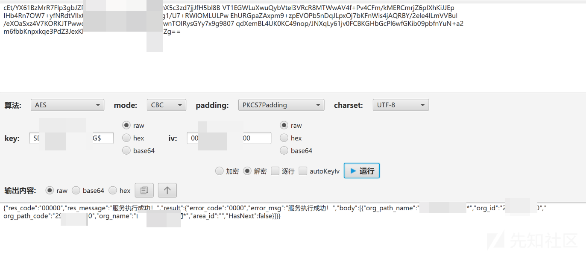](https://xzfile.aliyuncs.com/media/upload/picture/20240301164210-97d6e79e-d7a7-1.png)  
于是在通过上图中第二个接口：qryStaffInfoByOrgId 以及刚刚得到的org\_id值，构造数据包并发包，后解密响应体获取到了该组织中的用户：

[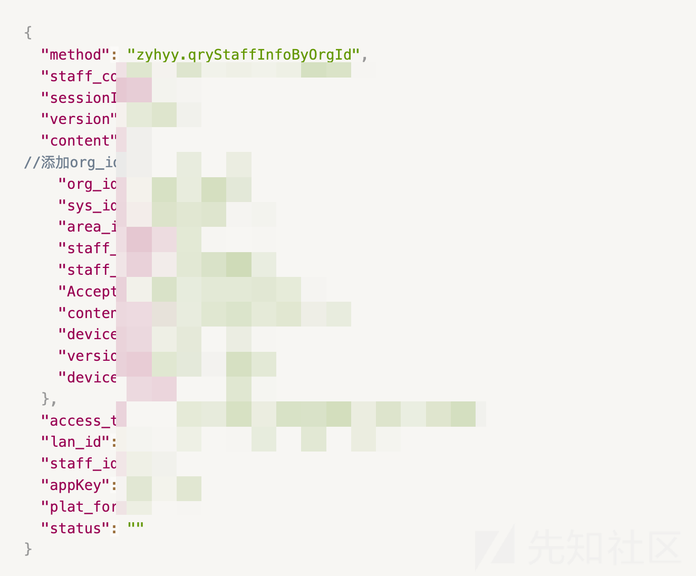](https://xzfile.aliyuncs.com/media/upload/picture/20240301164251-b0b84fa0-d7a7-1.png)

响应包

[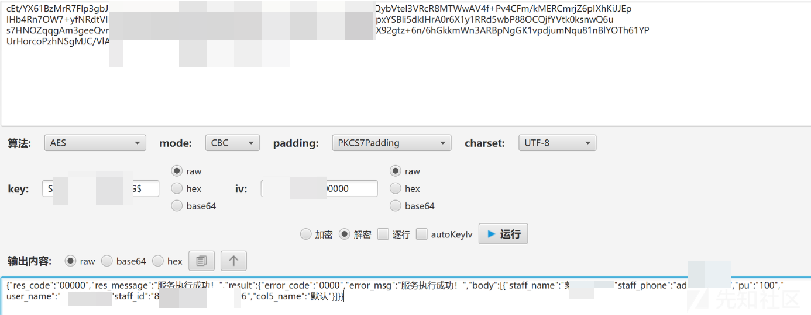](https://xzfile.aliyuncs.com/media/upload/picture/20240301164325-c4777ae8-d7a7-1.png)

最后通过尝试爆破org\_id的值，发现能通过org\_id值爆破出所有组织的用户信息：

[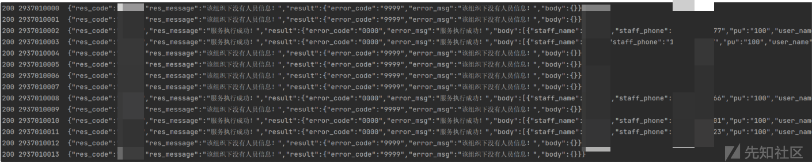](https://xzfile.aliyuncs.com/media/upload/picture/20240301164407-ddc05ed4-d7a7-1.png)
