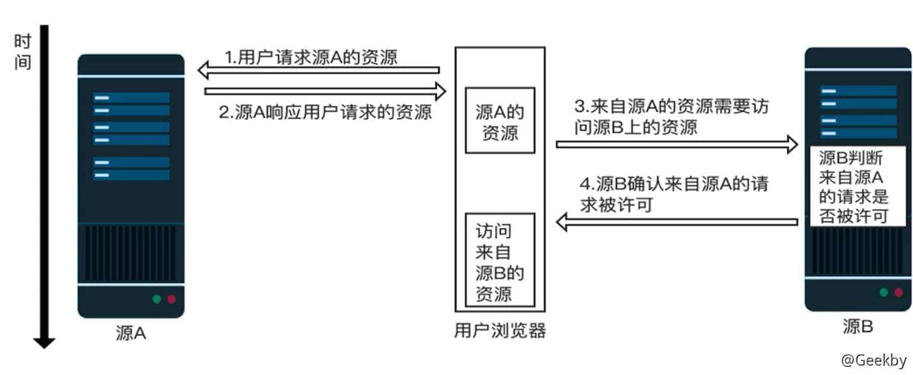
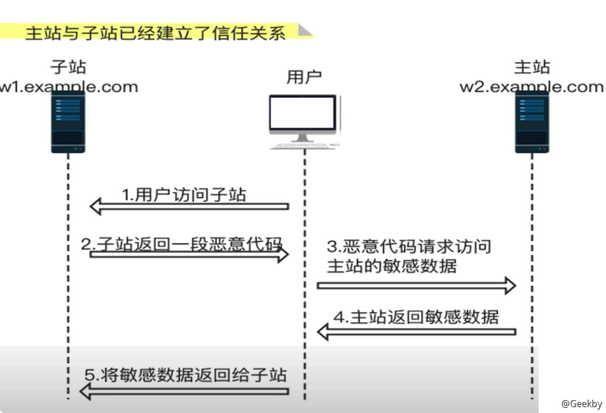
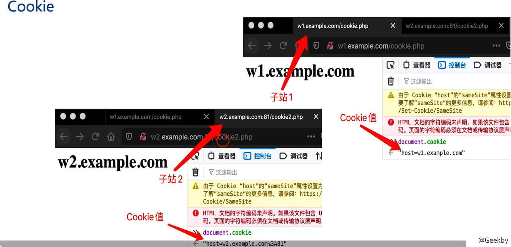
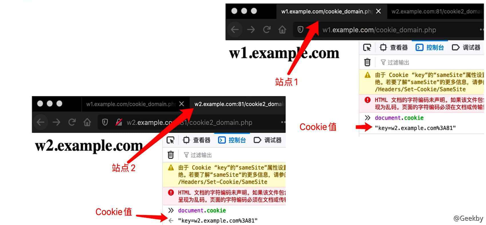

# 同源策略

## 1 定义与原理

### 1.1 同源定义

同源：协议、主机、端口

如果两个 URL 的协议、主机、端口都相同，则认为这两个 URL 同源

示例

`http://example.cpm/dir/page.html`

`http//example.com/dir2/page2.html` 同源

`https://example.com/dir/page.html` 协议不同，不同源

`http://example.com:81/dir/page.html` 端口不同，不同源

`https://other.com/dir/page.html` 主机不同，不同源

域名与对应的 IP 也是不同源

### 1.2 同源策略

同源策略是浏览器的一个安全功能，不同源的客户端脚本在没有明确授权的情况下，不能读写对方资源。

同源策略限制了从一个源加载的文档或脚本如何与来自另一个源的资源进行交互。这是一个用于隔离潜在恶意文件的重要安全机制。

### 1.3 跨域

简单地理解就是访问非同源资源，可以使用 HTML 标签访问，也可以使用 JS 去访问。JS 访问非同源时，访问请求是可以发送的，但是服务端将响应送回来后我们客户端的浏览器默认不接受。

#### 1.4 同源策略限制

非同源时 JS 会受到如下三种行为限制：

-   Cookie、LocalStorage 和 IndexDB 无法读取
-   DOM 无法获得
-   AJAX 请求发送但是浏览器不接受返回信息

同源策略允许「跨域」写，而不允许「跨域」域读，写就是上行，发送请求，send request，读就是下行，接受响应，receive response；

### 1.5 两种常用的跨域方式

#### 1.5.1 JSONP

加载远程 JS，可以把远程 JS 中数据带进来

#### 1.5.2 CORS

为了解决跨域资源共享而提出的在 HTTP 头部添加自定义字段的方法

在浏览器进行请求时，自动在请求头中添加 Origin 字段，服务端通过验证 Origin 字段来判断请求是否被允许，从而实现浏览器进行跨源访问

**CORS 的安全问题**

返回报文头部的 `Access-Control-Allow-Credentials` 为 `True` 时，这表明 Cookie 可以包含在请求中，一起发给服务器，存在安全问题

如果 `Access-Control-Allow-Origin` 头可控，且 `Access-Control-Allow-Credentials` 为 `True`，那么就可以利用一个可控的网站来窃取一个人的隐私信息

当主站与子站通过 CORS 建立信任关系进行资源共享时，如果攻击者控制了子站，也可以获取主站的数据。

## 2 Cookie 与 DOM 中的同源策略

### 2.1 Cookie

在同源策略的限制下，非同源的站点是不能够互相读取 Cookie 的，这个限制在父 / 子域名中同样存在。

可以看到两个站点的 Cookie 并不相同

但是，针对 Cookie 的同源策略是可以指定 domain 来允许不同站点间互相访问 Cookie

通过设置 domain 打破了浏览器对于 Cookie 的同源限制，可以通过子站点入手，通过子站获取子站的 Cookie

信息

cookie 的同源策略不区分协议与端口

### 2.2 DOM 树

在同源策略的限制下，非同源的站点是无法互相获取 DOM 的，这里以子域名之间获取 DOM 为例

通过设置 domain 打破了浏览器对于 DOM 的同源限制，可以通过子站入手，修改主站的 DOM 树

## 3 CORS 与 CSRF

**相同点：**

1.  都需要借助第三方网站
2.  都需要借助 AJAX 的异步过程
3.  一般都需要用户登录

**不同点：**

1.  第三方网站可以利用 CORS 漏洞读取到受害者的敏感信息
2.  第三方网站可以利用 CSRF 漏洞可以提受害者完成注入转账类的敏感操作
3.  一般有 CORS 漏洞的地方都有 CSRF 漏洞
