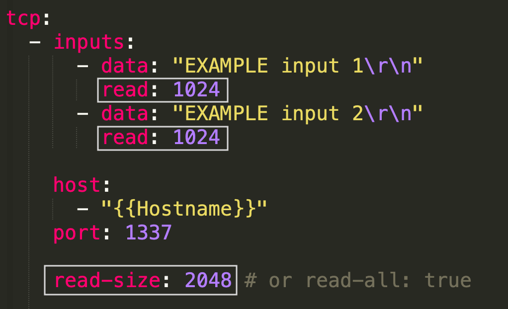
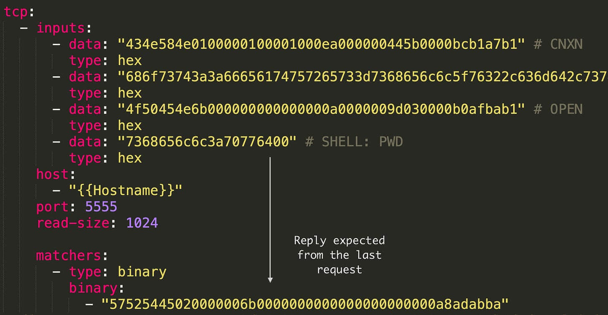
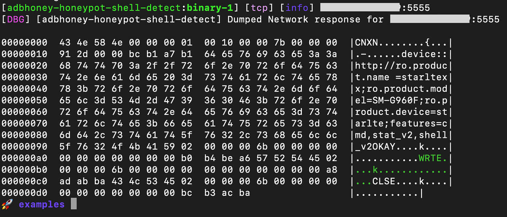
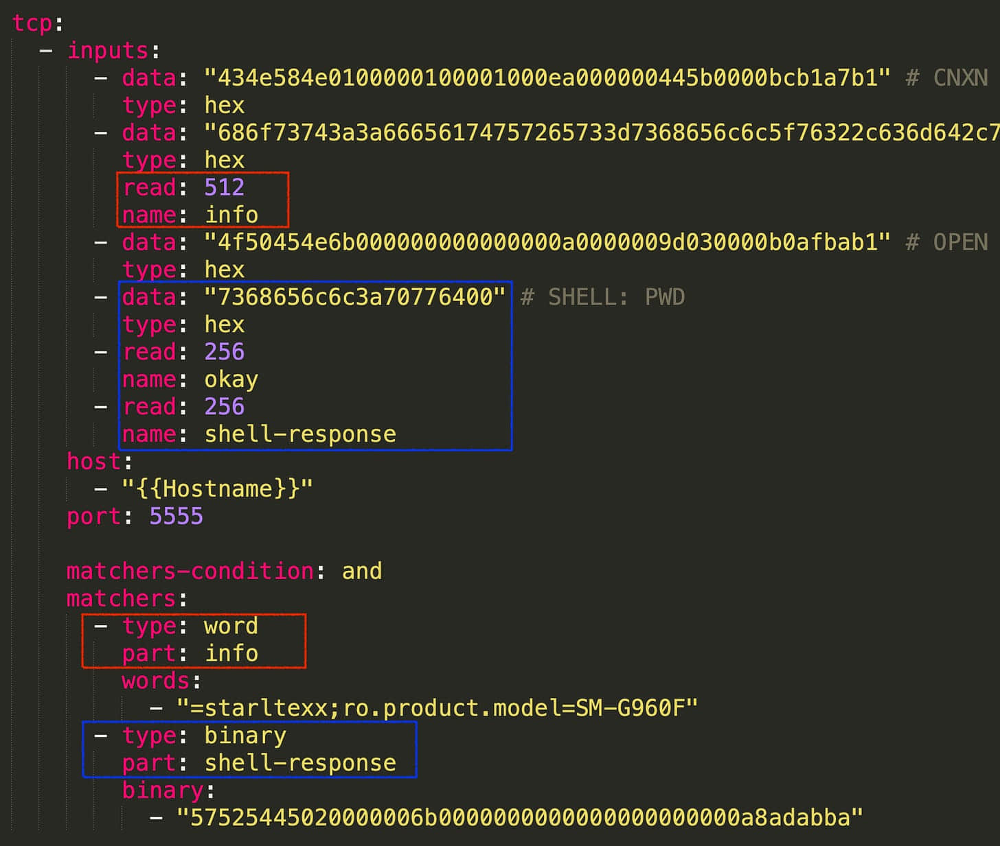
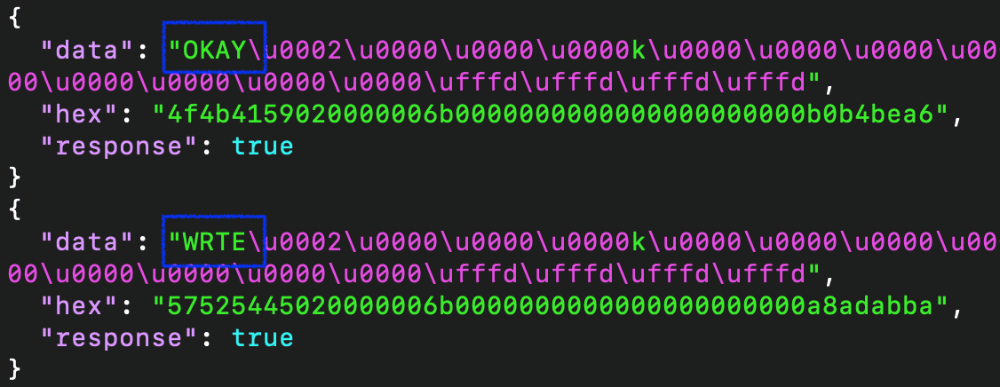
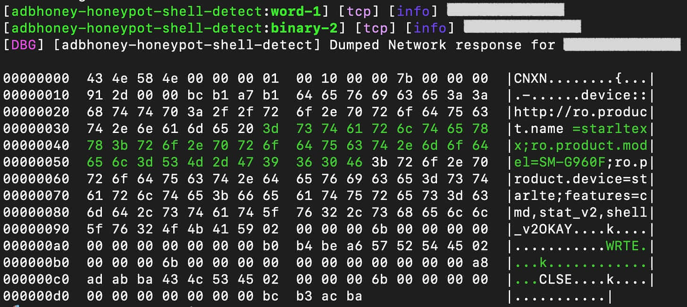
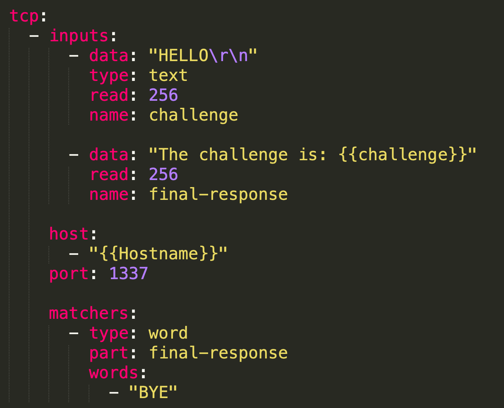

# 在编写 Nuclei“网络”模板时处理 I/O

During my research on [honeypots detection](https://blog.unapibageek.io/p/detecting-honeypots-via-flawed-logic), I had to create several Nuclei templates for a variety of network protocols. I discovered that properly writing inputs and reading outputs might be slightly more complex than it seems. There are a few things to bear in mind, which I would like to share in this post.  
在我研究蜜罐检测的过程中，我不得不为各种网络协议创建几个 Nuclei 模板。我发现正确地编写输入和阅读输出可能比看起来稍微复杂一些。有几件事要记住，我想在这篇文章中分享。

Yet, why is this useful? [Nuclei](https://github.com/projectdiscovery/nuclei) is extremely practical for quickly verifying vulnerabilities, misconfigurations, or whether an application responds as expected to certain HTTP or TCP packets. There are thousands of templates for HTTP requests, which are well-documented with plenty of examples. However, this is not the case for 'network' templates, we'll be delving into these today.  
然而，为什么这是有用的？Nuclei 对于快速验证漏洞、错误配置或应用程序是否按预期响应某些 HTTP 或 TCP 数据包非常实用。HTTP 请求有成千上万的模板，这些模板都有大量的示例。然而，这不是“网络”模板的情况，我们今天将深入研究这些。

### INPUTS  输入

The input is the chunk of bytes we will send to the target application. This can be provided as an ASCII string of characters ('text') or as a hexadecimal string ('hex').  
输入是我们将发送到目标应用程序的字节块。这可以作为 ASCII 字符串（“text”）或十六进制字符串（“hex”）提供。

Inputs are a YAML array, and it is possible to specify several.  
输入是一个 YAML 数组，可以指定多个。  
For example: 举例来说：

Each string will be sent one after the other to the target. You might expect the target to respond to each of these packets individually; we will delve into this shortly.  
每个字符串将一个接一个地发送到目标。您可能期望目标单独响应这些数据包中的每一个;我们将很快深入研究这一点。

Now, you might be wondering, where do those strings I use for the input come from? It depends on what you’re testing. When using TCP packets, you will have to speak the ‘language’ of the targeted protocol. To obtain these packets for use in your Nuclei template, you’ll likely first analyze the network traffic during your test to extract the right packets. For this, the most common tool is the popular traffic analyzer, Wireshark. For less complex protocols or simpler cases, you might want to give [network-fingerprint](https://github.com/projectdiscovery/network-fingerprint) a try.  
现在，您可能想知道，我用于输入的那些字符串是从哪里来的？这取决于你在测试什么。当使用 TCP 数据包时，您必须使用目标协议的“语言”。要获取这些数据包用于您的 Nuclei 模板，您可能首先要在测试期间分析网络流量，以提取正确的数据包。为此，最常用的工具是流行的流量分析器 Wireshark。对于不太复杂的协议或更简单的情况，您可能想尝试给予网络指纹。

Generally, creating the input part of the template is quite straightforward. However, reading the output and properly matching it with your expected response can sometimes bring issues. Let's jump into it.  
通常，创建模板的输入部分非常简单。但是，阅读输出并将其与预期响应正确匹配有时会带来问题。我们开始吧。

### OUTPUTS  输出

According to Nuclei’s [syntax reference](https://github.com/projectdiscovery/nuclei/blob/main/SYNTAX-REFERENCE.md#networkrequest), there are three properties to read the output: `read`, `read-size`, and `read-all`. The most commonly implemented are `read` and `read-size`. However, people often tend to confuse these two (well, the difference is not immediately apparent at first sight!), and incorrect usage may compromise the template's effectiveness.  
根据 Nuclei 的语法参考，有三个属性可以读取输出： `read` 、 `read-size` 和 `read-all` 。最常用的是 `read` 和 `read-size` 。然而，人们往往倾向于混淆这两个（好吧，区别并不是一眼就能看出来的！），并且不正确的使用可能损害模板的有效性。

In the simplest case, you might not need to specify any of those, and ‘`read-size:1024’` will implicitly be used (which works for most cases). Yet, what’s the actual difference between the three options?  
在最简单的情况下，您可能不需要指定其中任何一个，并且' `read-size:1024’` 将被隐式地使用（这适用于大多数情况）。然而，这三种选择之间的实际区别是什么？

To start with, `read` is a property of network.Input() and, in case it is used, should be placed within each input statement. On the other hand, `read-size` and `read-all` are properties of network.Request(), therefore, they are placed outside the list of inputs.  
首先， `read` 是 network 的一个属性。如果使用 input（），则应将它放在每个 input 语句中。另一方面， `read-size` 和 `read-all` 是 network.Request（）的属性，因此，它们被放置在输入列表之外。

As mentioned, `read-size:1024` will be the default. In case you need to read more bytes (because what you are looking for in the output is not within the first 1024 bytes), you can provide a different size (for example, `read-size:2048`) or simply use `read-all:true`, which will read the entire output regardless of its size. Most cases are actually resolved using the `read-size` property, so what is `read` used for? Furthermore, the template above - while still working fine in this case - is not properly structured, as using `read-size` and `read` together in this way doesn’t really make sense.  
如前所述， `read-size:1024` 将是默认值。如果您需要读取更多字节（因为您在输出中查找的内容不在前 1024 个字节内），您可以提供不同的大小（例如， `read-size:2048` ）或简单地使用 `read-all:true` ，这将读取整个输出而不管其大小。大多数情况下实际上是使用 `read-size` 属性解决的，那么 `read` 是用来做什么的呢？此外，上面的模板 - 虽然在这种情况下仍然可以正常工作 - 结构不正确，因为以这种方式一起使用 `read-size` 和 `read` 并没有真正意义。

It seems there are a few cases where it could make sense to use the `read` property instead. Let’s see two examples: 1) Matching strings in the response to specific inputs; 2) Using the response from an input to create the next request.  
似乎有一些情况下，使用 `read` 属性是有意义的。让我们看两个例子：1）匹配特定输入的响应中的字符串; 2）使用输入的响应来创建下一个请求。

#### USING THE `READ` PROPERTY: CASE 1  
使用 `READ` 属性：案例 1

At the beginning of this post, I shared an image with an example of multiple input requests; this belongs to the **ADBHoney-shell** detector I developed weeks ago. It sends multiple requests to the target and then matches a chunk of bytes that comes in the response to the *last* request.  
在这篇文章的开头，我分享了一个带有多个输入请求示例的图像;这属于我几周前开发的 ADBHoney-shell 检测器。它向目标发送多个请求，然后将响应中的字节块匹配到最后一个请求。

As we can see, there is a `read-size:1024` statement in the template. It will read, as seen below, the response to all the requests up to 1024 bytes in total, and then match the expected bytes in the response.  
正如我们所看到的，模板中有一个 `read-size:1024` 语句。如下所示，它将读取对所有请求的响应，总共最多 1024 个字节，然后匹配响应中的预期字节。

What if we would like to also match the string *'=starltexx;ro.product.model=SM-G960F'* that comes in the response to the **second** request? We could simply add one more matcher with this string, and it might work, as long as the response does not surpass 1024 bytes. However, this is where `read` plays a role! It would be best to use the `read` attribute, assign a name to the responses, and indicate to the matcher where to find each string. The code would look as follows:  
如果我们还想匹配第二个请求的响应中的字符串“=starltexx;ro.product.model= SM-G960 F”，该怎么办？我们可以简单地用这个字符串再添加一个匹配器，只要响应不超过 1024 字节，它就可能工作。这就是 `read` 发挥作用的地方！最好使用 `read` 属性，为响应分配一个名称，并指示匹配器在哪里找到每个字符串。代码如下所示：

The first modification, outlined in red, involves reading 512 bytes from the response of the second request and naming this "info". Then, in the matchers section, we indicate to look into the part labeled 'info' for the desired string.  
第一个修改（用红色标出）涉及从第二个请求的响应中读取阅读 512 个字节，并将其命名为“info”。然后，在 matchers 部分，我们指示查看标记为“info”的部分以获得所需的字符串。

That was easy. However, identifying the last chunk of bytes has now become slightly more complicated in this way. This is because ADB responds with two packets (OKAY and WRTE statements) to our last request. Therefore, if we want to match bytes in the last packet (WRTE), we first need to read and ‘skip' the OKAY response.  
很简单。然而，通过这种方式识别最后一个字节块现在变得稍微复杂一些。这是因为 ADB 用两个数据包（OKAY 和 WRTE 语句）响应我们的最后一个请求。因此，如果我们想匹配最后一个数据包中的字节（WRTE），我们首先需要读取并“跳过”OKAY 响应。

That’s the reason behind writing two `read` statements in the template after sending the last packet to the target. The last response is named 'shell-response'. In the matchers section, we specify such a name to match the expected chunk of bytes in this part.  
这就是在将最后一个数据包发送到目标之后在模板中编写两个 `read` 语句的原因。最后一个响应被命名为“shell-response”。在 matchers 部分中，我们指定这样一个名称来匹配这部分中预期的字节块。

As we can see, it is possible to use the structure of inputs to read from the socket without actually sending data. This approach was particularly useful in this scenario, where the target replies with more than one packet, and we need to match bytes in the last response.  
正如我们所看到的，可以使用输入的结构从套接字中读取，而不实际发送数据。这种方法在这种情况下特别有用，在这种情况下，目标响应多个数据包，我们需要匹配最后一个响应中的字节。

In conclusion, for this case, I believe the `read` property can be quite useful in complex situations where it's necessary to read specific bytes from certain responses in a series of network packets. If such complexity isn't required, I highly recommend using `read-size` instead, as it tends to be less prone to failure. Sometimes, the `read` property can lead to timeouts, especially if you're not reading the exact amount of bytes (since Nuclei keeps waiting for more bytes, resulting in a timeout eventually).  
总之，对于这种情况，我相信 `read` 属性在需要从一系列网络数据包中的某些响应中读取特定字节的复杂情况下非常有用。如果不需要这样的复杂性，我强烈建议使用 `read-size` ，因为它不太容易失败。有时， `read` 属性可能导致超时，特别是当您没有阅读确切的字节数时（因为 Nuclei 一直在等待更多的字节，最终导致超时）。

A few weeks ago, I raised an [issue](https://github.com/projectdiscovery/nuclei/issues/4454) related to this in the official Nuclei repository, which was addressed in the release [3.1.2](https://github.com/projectdiscovery/nuclei/releases/tag/v3.1.2). However, in certain cases, depending on the network protocol you're working with, this issue might still occur.  
几周前，我在官方的 Nuclei 存储库中提出了一个与此相关的问题，该问题在 3.1.2 版本中得到了解决。但是，在某些情况下，根据您使用的网络协议，此问题仍可能发生。

#### USING THE `READ` PROPERTY: CASE 2  
使用 `READ` 属性：案例 2

Let’s jump into the second use case for the `read` property: Using the response from one input to create the subsequent request.  
让我们跳到 `read` 属性的第二个用例：使用来自一个输入的响应来创建后续请求。

This is another complex scenario where - for example - you might be dealing with a network protocol that requires exchanging a few packets, including a challenge, to establish a connection. In such cases, it’s often necessary to take a portion of the target's response, which contains the challenge, and send it back in your subsequent request.  
这是另一个复杂的场景，例如，您可能正在处理一个网络协议，该协议需要交换一些数据包，包括一个挑战，以建立连接。在这种情况下，通常需要获取目标响应的一部分（其中包含挑战），并将其发送回您的后续请求。

I've crafted a simple example to demonstrate this particular case:  
我制作了一个简单的例子来演示这个特定的案例：

As observed, we read 256 bytes from the response of the first packet and name it “challenge”. Then, we use these received bytes into our second request. The matchers section isn’t of much importance in this example; the key aspect is how we can utilize the response from one packet for a subsequent request. Here's how it looks like when we use netcat for testing:  
正如所观察到的，我们从第一个数据包的响应中读取了 256 个字节，并将其命名为“challenge”。然后，我们将这些接收到的字节用于第二个请求。matchers 部分在这个例子中并不重要;关键的方面是我们如何将来自一个数据包的响应用于后续的请求。下面是我们使用 netcat 进行测试时的样子：

We successfully receive back the challenge part.  
我们成功地收回了挑战部分。

That’s all. I don’t want to extend this post any further. I hope you find these 'advanced' tips for developing Nuclei network templates useful :)  
仅此而已我不想再延长这篇文章了。我希望你发现这些开发 Nuclei 网络模板的“高级”技巧很有用：）

Subscribe
