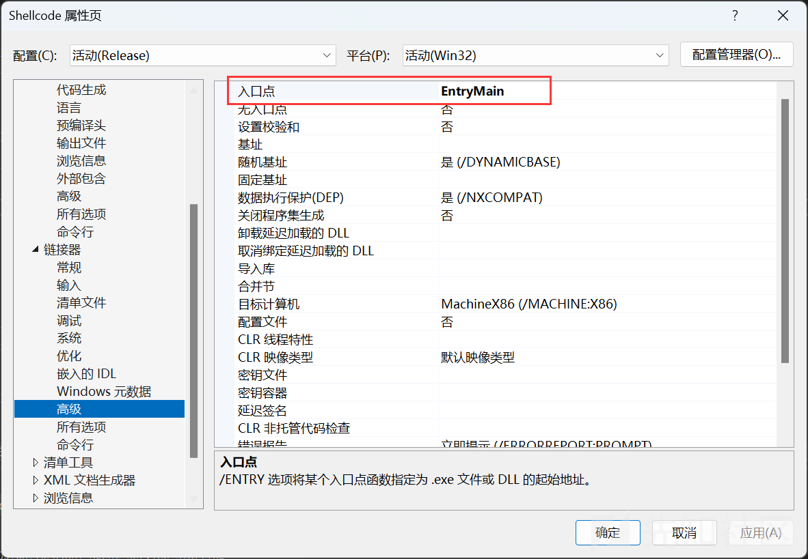
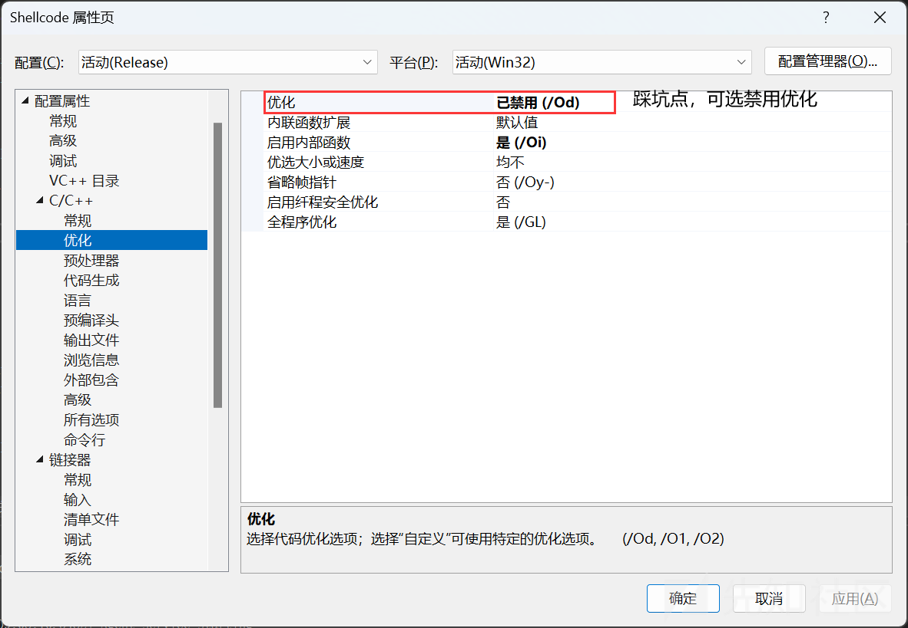
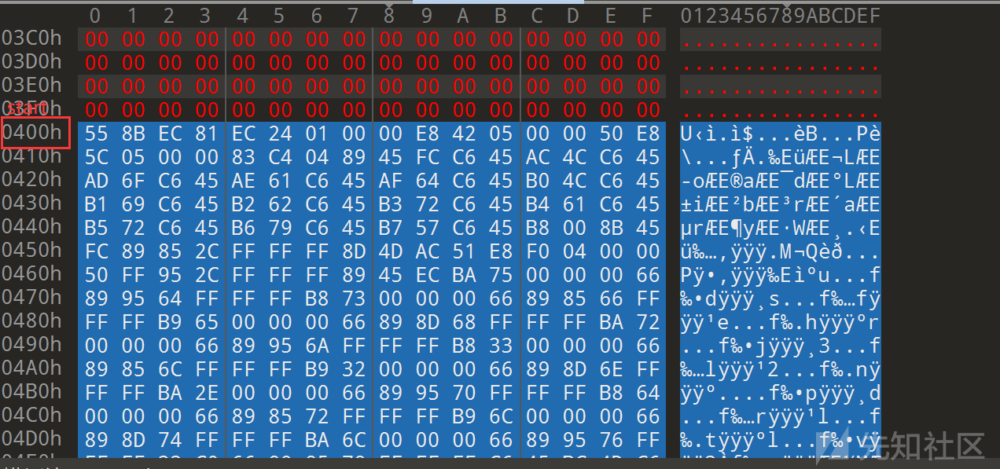
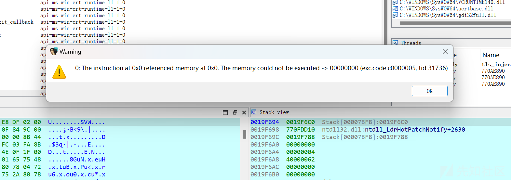
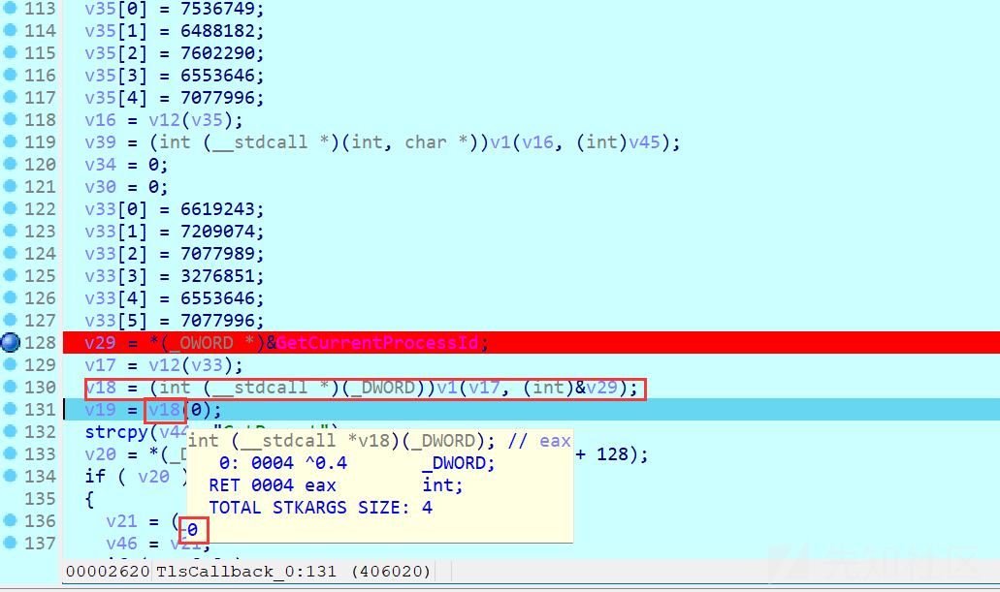
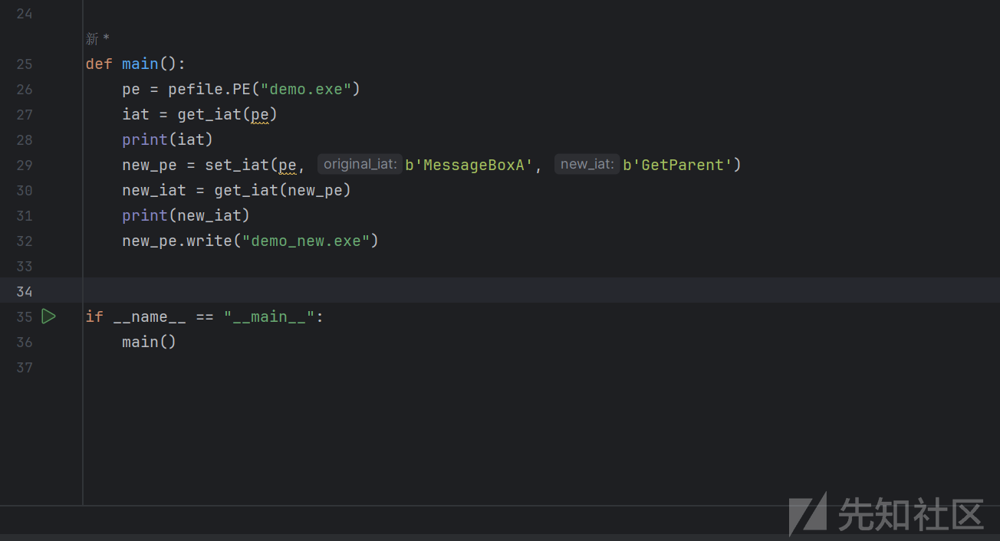
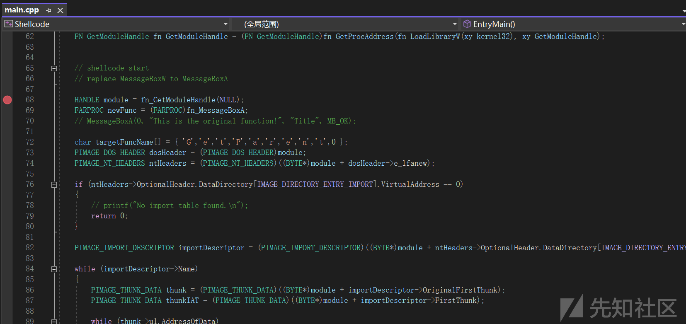
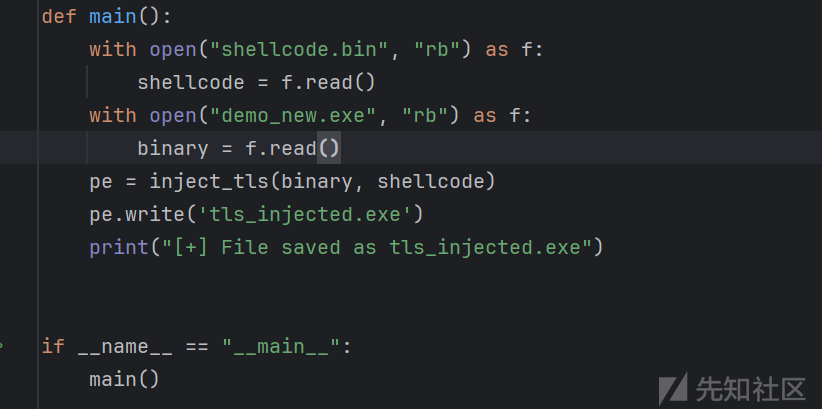
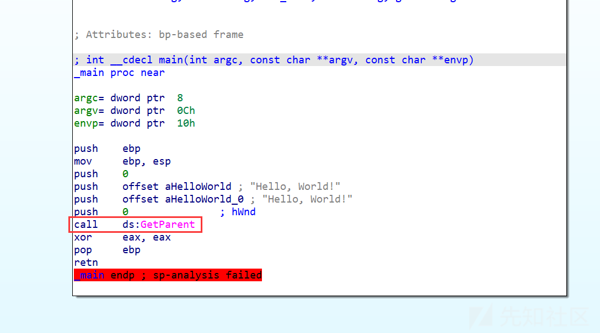
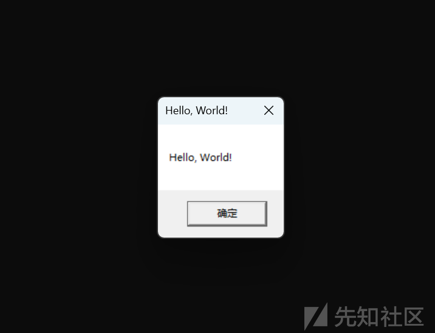

# 基于TLS回调的PE文件导入表项混淆 - 构造精心的解混淆Shellcode - 先知社区

基于TLS回调的PE文件导入表项混淆 - 构造精心的解混淆Shellcode

- - -

TLS(线程局部存储)的概念不再赘述。Shellcode是一段精心构造的代码，其与地址无关，可以直接执行。此处使用的Shellcode目的不是控制流转移，而是解混淆上文中混淆的导入表项。

《基于TLS回调的PE文件导入表项混淆》项目的主体思路不再赘述。此处Shellcode的构造可以细分为两个部分：

1.  使用C/C++编写的代码，用于解混淆导入表项。
2.  去除地址有关性，构造Shellcode。

通常来说Shellcode用汇编编写，但这是低效的，故在此项目我们必须使用C/C++编写Shellcode。此处编写的Shellcode是Windows下的x86 Shellcode。

# 编写代码，解除混淆

先整理思路。上文提及我们混淆的方案是张冠李戴，故解混淆要做的就是“李戴李冠、张戴张冠”。

```plain
FARPROC newFunc = (FARPROC)fn_MessageBoxA;
char targetFuncName[] = { 'G','e','t','P','a','r','e','n','t',0 };
...
```

如上则是将`GetParent`函数解混淆为`MessageBoxA`。这里的`fn_MessageBoxA`是一个函数指针，指向`MessageBoxA`函数。`targetFuncName`是`GetParent`函数的名称。它必须依照这样的书写方式定义，因为这句C代码将会被编译为地址无关的Shellcode。如果使用字符串格式(如`"GetParent"`)，对于编译器来说有概率将其存储到数据段中，并使用地址引用，这样的Shellcode是不可行的。

要将本进程的导入表修改，最直观的想法是用过Win32 API获取自身句柄，遍历PE文件的导入表，找到目标函数，修改。

```plain
void ModifyIAT(HMODULE module, const char* targetFuncName, FARPROC newFunc) {
    PIMAGE_DOS_HEADER dosHeader = (PIMAGE_DOS_HEADER)module;
    PIMAGE_NT_HEADERS ntHeaders = (PIMAGE_NT_HEADERS)((BYTE*)module + dosHeader->e_lfanew);
    // 检查模块是否有导入表
    if (ntHeaders->OptionalHeader.DataDirectory[IMAGE_DIRECTORY_ENTRY_IMPORT].VirtualAddress == 0) {
        printf("No import table found.\n");
        return;
    }
    // 获取模块的导入描述符
    PIMAGE_IMPORT_DESCRIPTOR importDescriptor = (PIMAGE_IMPORT_DESCRIPTOR)((BYTE*)module + ntHeaders->OptionalHeader.DataDirectory[IMAGE_DIRECTORY_ENTRY_IMPORT].VirtualAddress);
    // 遍历所有导入的模块
    while (importDescriptor->Name) {
        // 获取导入描述符的thunk数据
        PIMAGE_THUNK_DATA thunk = (PIMAGE_THUNK_DATA)((BYTE*)module + importDescriptor->OriginalFirstThunk);
        PIMAGE_THUNK_DATA thunkIAT = (PIMAGE_THUNK_DATA)((BYTE*)module + importDescriptor->FirstThunk);
        while (thunk->u1.AddressOfData) {
            // 获取thunk的导入名称结构并检查函数名称是否与目标函数名称匹配
            PIMAGE_IMPORT_BY_NAME importByName = (PIMAGE_IMPORT_BY_NAME)((BYTE*)module + thunk->u1.AddressOfData);
            if (strcmp(importByName->Name, targetFuncName) == 0) {
                // 临时修改其内存保护并修改IAT条目以指向新函数
                DWORD oldProtect;
                VirtualProtect(&thunkIAT->u1.Function, sizeof(FARPROC), PAGE_READWRITE, &oldProtect);
                thunkIAT->u1.Function = (ULONG_PTR)newFunc;
                VirtualProtect(&thunkIAT->u1.Function, sizeof(FARPROC), oldProtect, &oldProtect);
                return;
            }
            thunk++;
            thunkIAT++;
        }
        importDescriptor++;
    }
    printf("Function not found in the import table.\n");
}
```

结合注释，这段代码只是简单粗暴的遍历导入表，找到目标函数，修改IAT，以达到解混淆的目的。编译运行不难发现，这段代码是可行的。

# 去除地址有关性，构造Shellcode

本例使用Visual Studio 2022编写代码，编译器为MSVC。工欲善其事必先利其器，下为项目属性配置。

[](https://xzfile.aliyuncs.com/media/upload/picture/20240301183127-dc47702e-d7b6-1.png)

[](https://xzfile.aliyuncs.com/media/upload/picture/20240301183129-dda7f344-d7b6-1.png)

[](https://xzfile.aliyuncs.com/media/upload/picture/20240301183131-deb03c10-d7b6-1.png)

如果选择Debug配置，编译器会在编译时插入调试信息，这样的Shellcode是不可行的。故选择Release配置。

安全检查在此处是会影响正常运行的，故关闭。

VS默认项目开启优化。由于编译器优化会导致奇奇怪怪的问题（踩坑点），可选择关闭。实测打开优化Shellcode会减小许多。

我们知道Shellcode要求地址无关，但我们上文编写的代码显然用到了大量的系统函数。这些函数的地址是无法预知的，我们难以硬编码进入Shellcode。故我们需要动态获取这些函数的地址。

```plain
#include <windows.h>

FARPROC  getProcAddress(HMODULE hModuleBase);
DWORD getKernel32();

int EntryMain()
{
    // get function address ：GetProcAddress
    typedef FARPROC(WINAPI* FN_GetProcAddress)(
        _In_ HMODULE hModule,
        _In_ LPCSTR lpProcName
        );
    FN_GetProcAddress fn_GetProcAddress = (FN_GetProcAddress)getProcAddress((HMODULE)getKernel32());

    // get function address ：LoadLibraryW
    typedef HMODULE(WINAPI* FN_LoadLibraryW)(
        _In_ LPCWSTR lpLibFileName
        );
    char xyLoadLibraryW[] = { 'L','o','a','d','L','i','b','r','a','r','y','W',0 };
    FN_LoadLibraryW fn_LoadLibraryW = (FN_LoadLibraryW)fn_GetProcAddress((HMODULE)getKernel32(), xyLoadLibraryW);

    // get function address ：AnyFunction

    // insert the shellcode 


    return 0;
}

// get module base ：kernel32.dll
__declspec(naked) DWORD getKernel32()
{
    __asm
    {
        mov eax, fs: [30h]
        mov eax, [eax + 0ch]
        mov eax, [eax + 14h]
        mov eax, [eax]
        mov eax, [eax]
        mov eax, [eax + 10h]
        ret
    }
}

// get function address ：GetProcAddress
FARPROC getProcAddress(HMODULE hModuleBase)
{
    PIMAGE_DOS_HEADER lpDosHeader = (PIMAGE_DOS_HEADER)hModuleBase;
    PIMAGE_NT_HEADERS32 lpNtHeader = (PIMAGE_NT_HEADERS)((DWORD)hModuleBase + lpDosHeader->e_lfanew);
    if (!lpNtHeader->OptionalHeader.DataDirectory[IMAGE_DIRECTORY_ENTRY_EXPORT].Size) {
        return NULL;
    }
    if (!lpNtHeader->OptionalHeader.DataDirectory[IMAGE_DIRECTORY_ENTRY_EXPORT].VirtualAddress) {
        return NULL;
    }
    PIMAGE_EXPORT_DIRECTORY lpExports = (PIMAGE_EXPORT_DIRECTORY)((DWORD)hModuleBase + (DWORD)lpNtHeader->OptionalHeader.DataDirectory[IMAGE_DIRECTORY_ENTRY_EXPORT].VirtualAddress);
    PDWORD lpdwFunName = (PDWORD)((DWORD)hModuleBase + (DWORD)lpExports->AddressOfNames);
    PWORD lpword = (PWORD)((DWORD)hModuleBase + (DWORD)lpExports->AddressOfNameOrdinals);
    PDWORD lpdwFunAddr = (PDWORD)((DWORD)hModuleBase + (DWORD)lpExports->AddressOfFunctions);

    DWORD dwLoop = 0;
    FARPROC pRet = NULL;
    for (; dwLoop <= lpExports->NumberOfNames - 1; dwLoop++) {
        char* pFunName = (char*)(lpdwFunName[dwLoop] + (DWORD)hModuleBase);

        if (pFunName[0] == 'G' &&
            pFunName[1] == 'e' &&
            pFunName[2] == 't' &&
            pFunName[3] == 'P' &&
            pFunName[4] == 'r' &&
            pFunName[5] == 'o' &&
            pFunName[6] == 'c' &&
            pFunName[7] == 'A' &&
            pFunName[8] == 'd' &&
            pFunName[9] == 'd' &&
            pFunName[10] == 'r' &&
            pFunName[11] == 'e' &&
            pFunName[12] == 's' &&
            pFunName[13] == 's')
        {
            pRet = (FARPROC)(lpdwFunAddr[lpword[dwLoop]] + (DWORD)hModuleBase);
            break;
        }
    }
    return pRet;
}
```

使用了`GetProcAddress`函数，我们可以动态获取其他函数的地址。这样的Shellcode是可行的。调用函数前只需要保证库已经加载即可。

要调用系统的函数，我们用上获取到的函数地址即可。这里以`MessageBoxA`为例。

```plain
// get function address ：MessageBoxA
    typedef int (WINAPI* FN_MessageBoxA)(
        _In_opt_ HWND hWnd,
        _In_opt_ LPCWSTR lpText,
        _In_opt_ LPCWSTR lpCaption,
        _In_ UINT uType);
    wchar_t xy_user32[] = { 'u','s','e','r','3','2','.','d','l','l',0 };
    char xy_MessageBoxA[] = { 'M','e','s','s','a','g','e','B','o','x','A',0 };
    FN_MessageBoxA fn_MessageBoxA = (FN_MessageBoxA)fn_GetProcAddress(fn_LoadLibraryW(xy_user32), xy_MessageBoxA);
    // call MessageBoxA
    char xyHello[] = { 'H','e','l','l','o',' ','W','o','r','l','d',0 };
    fn_MessageBoxA(NULL, xyHello, xyHello, 0);
```

编译后，我们只要从其中提取机器码即可。首先获取代码起始地址，然后计算代码长度，最后提取机器码。这里直接手工用010 Editor提取。

[](https://xzfile.aliyuncs.com/media/upload/picture/20240301183140-e3e91404-d7b6-1.png)

[](https://xzfile.aliyuncs.com/media/upload/picture/20240301183142-e540ac5e-d7b6-1.png)

自动化的实现也很简单，其实获取到start后，让`C300`作为结束标记即可（通常情况下）。`C3`即`ret`指令，`00`是段填充。不再展开。

这份Shellcode到底能不能正常运行？注入到PE文件后我们动调看看。前文我已讲述开启编译器优化会导致奇奇怪怪的问题。不妨看一下。

[](https://xzfile.aliyuncs.com/media/upload/picture/20240301183146-e7cebcae-d7b6-1.png)

**踩坑点：**不出所料的报错了，提示`0x0`非法地址。

分析发现`v18`值为0，对照源代码，究其原因是编译器优化莫名其妙的将一个字符串赋值优化了，导致不能找到这个函数名的地址。这是一个典型的编译器优化问题。解决方法是关闭编译器优化。

[](https://xzfile.aliyuncs.com/media/upload/picture/20240301183151-eac921f6-d7b6-1.png)

对于Oier来说编译器优化简直就是天赐好物，但在此简直是灾难。所谓甲之蜜糖乙之砒霜，其此之谓乎！

- - -

结合前文，开始测试。步骤：

1.  混淆PE文件。
2.  编写Shellcode。
3.  注入Shellcode。
4.  IDA查看成功否。

混淆PE文件

[](https://xzfile.aliyuncs.com/media/upload/picture/20240301183156-edcfa3de-d7b6-1.png)

编写Shellcode

[](https://xzfile.aliyuncs.com/media/upload/picture/20240301183202-f13350f2-d7b6-1.png)

注入Shellcode

[](https://xzfile.aliyuncs.com/media/upload/picture/20240301183206-f37096f4-d7b6-1.png)

IDA查看函数名确实被替换为了不正确的`GetParent`

[](https://xzfile.aliyuncs.com/media/upload/picture/20240301183210-f5ecff12-d7b6-1.png)

运行发现正常弹窗。

[](https://xzfile.aliyuncs.com/media/upload/picture/20240301183214-f8827a04-d7b6-1.png)

可见该项目成功混淆了导入表项，且成功解混淆。对逆向工程师来说这种混淆是一种挑战。

# 参考

[d35ha/CallObfuscator(C++)](https://github.com/d35ha/CallObfuscator)  
[xiongsp/TLScallback2Any(Python)](https://github.com/xiongsp/TLScallback2Any)  
[C/C++ 实现ShellCode编写与提取](https://cloud.tencent.com/developer/article/2201895)
