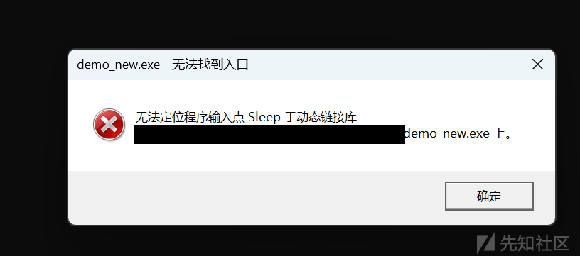
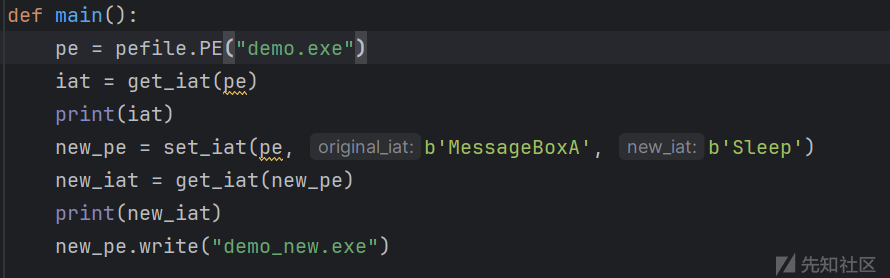
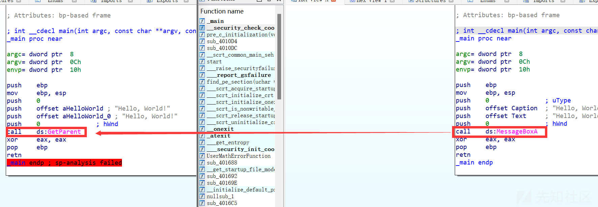
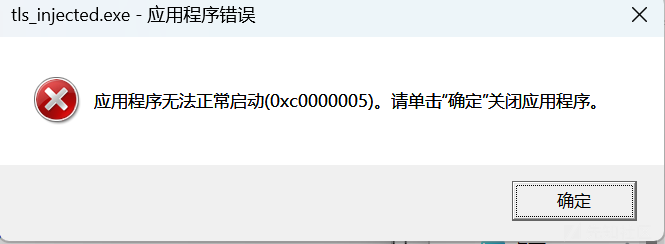
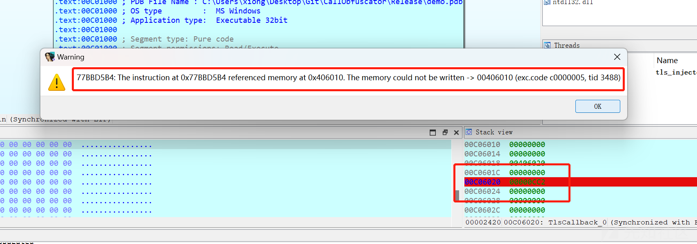
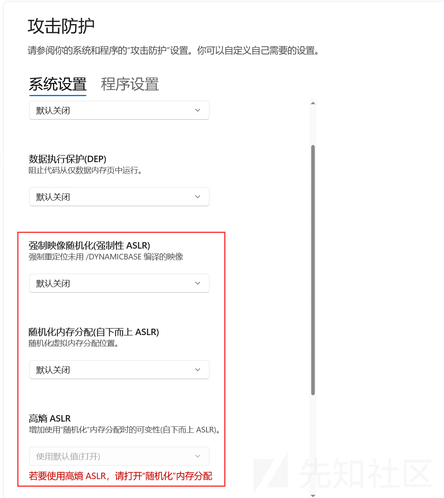
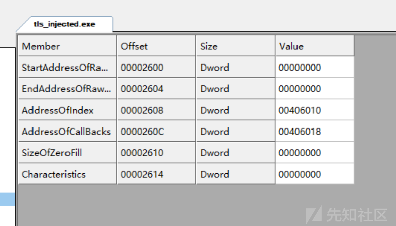
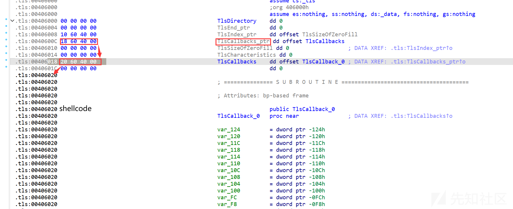

# 基于 TLS 回调的 PE 文件导入表项混淆 - 混淆部分 - 先知社区

基于 TLS 回调的 PE 文件导入表项混淆 - 混淆部分

- - -

TLS(线程局部存储) 是 Windows 下的一个重要概念，它允许程序员创建线程局部变量，这些变量在每个线程中都有自己的副本。具体不再赘述。

通过 TLS 回调函数，我们可以在程序加载前和卸载后执行一些代码。这个特性可以用来实现一些特殊的功能，比如反调试、反虚拟机等。此处主要实现对导入表的混淆。

主体思路如下：

1.  选定 PE 文件，混淆其导入表项目。
2.  向其注册 TLS 回调函数。
3.  编写解混淆 shellcode 并注入。

# 混淆导入表

使用`pefile`库可以很轻易的修改 PE 文件的导入表。具体代码如下：

```plain
def set_iat(pe, original_iat, new_iat):
    """
    Set original_iat to new_iat
    """
    if len(new_iat) < len(original_iat):
        new_iat += b'\x00' * (len(original_iat) - len(new_iat))
    for entry in pe.DIRECTORY_ENTRY_IMPORT:
        for imp in entry.imports:
            if imp.name == original_iat:
                imp.name = new_iat
                return pe
```

要注意的是，混淆后的函数名必须小于等于原函数名的长度，否则会导致导入表项的大小变化，从而破坏 PE 文件的结构。其中 Line6 做的操作就是将混淆的函数名填充零字节，以保证大小一致。

**踩坑点 1：**虽然在此例中函数名可以随意指定，但实际上所使用的函数名必须是库的导出函数名，否则会导致运行时错误。

`MessageBoxA`是`user32.dll`的导出函数，但是`Sleep`是`kernel32.dll`的导出函数。如果混淆后的函数名不是导出函数名，那么在运行时会出现如下错误：

[](https://xzfile.aliyuncs.com/media/upload/picture/20240301165237-0dd7c0ca-d7a9-1.png)

[](https://xzfile.aliyuncs.com/media/upload/picture/20240301165241-0fe8d5b6-d7a9-1.png)

如果混淆为`GetParent`，则毫无问题。

[](https://xzfile.aliyuncs.com/media/upload/picture/20240301165247-136a5912-d7a9-1.png)

# 注册 TLS 回调函数

从上可发现实际上混淆导入表项并不难，主要是注册 TLS 回调函数和编写解混淆 shellcode。注册回调函数的方法实际上在简中互联网上多如牛毛，但都大同小异，像是一个接着一个的复制粘贴，有甚者图都不改，令人唏嘘。

关于 TLS 结构的文章很多，这里不再赘述。

这里参考了 github 上`BorjaMerino/tlsInjector`的代码。主要思路是新增一个节，在其中注册 TLS 回调函数，并在该节中写入解混淆 shellcode。具体代码可见原作者的 repo，或者我使用 Python3.11 重构的简陋代码 (`xiongsp/TLScallback2Any`)

网上的绝大多数方案是把最后一节扩大一点，在其中写入 TLS 结构和 shellcode；我的方案是增加一个新节，在其中写入 TLS 结构和 shellcode。

```plain
def create_section(pe: pefile.PE, shellcode: bytes, flags) -> pefile.PE:
    sections = SectionDoubleP(pe)
    section_name = b".tls"
    try:
        pe = sections.push_back(Characteristics=flags, Data=shellcode, Name=section_name)
        print(f"[+] Section {section_name} created")
        info_section(pe.sections[-1])
    except SectionDoublePError as e:
        print(f"[-] Error: {e}")
    return pe


def info_section(section):
    print("    Name:                      " + str(section.Name))
    print("    RelativeVirtualAddress:    " + str(hex(section.VirtualAddress)))
    print("    SizeOfRawData:             " + str(hex(section.SizeOfRawData)))
    print("    PointerToRawData:          " + str(hex(section.PointerToRawData)))
    print("    VirtualSize:               " + str(hex(section.Misc_VirtualSize)))


def update_tls_structure(rva, pe: pefile.PE) -> pefile.PE:
    # Set AddressOfIndex (It will point to the same structure, SizeOfZeroFill field)
    pe.set_dword_at_rva(rva + 8, pe.OPTIONAL_HEADER.ImageBase + rva + 16)
    # Set AddressOfCallBacks to point to the callbacks array
    pe.set_dword_at_rva(rva + 12, pe.OPTIONAL_HEADER.ImageBase + rva + 24)
    print(f"[+] AddressOfCallBacks pointing to the array of callback "
          f"addresses (va: 0x{pe.OPTIONAL_HEADER.ImageBase + rva + 24:x})")
    # Set first pointer of the callbacks array to point to the Shellcode
    pe.set_dword_at_rva(rva + 24, pe.OPTIONAL_HEADER.ImageBase + rva + 32)
    print(f"[+] First callback entry pointing to the shellcode (va: 0x{pe.OPTIONAL_HEADER.ImageBase + rva + 32:x})")
    # Update the IMAGE_DIRECTORY_ENTRY_TLS.
    pe.OPTIONAL_HEADER.DATA_DIRECTORY[9].VirtualAddress = rva
    pe.OPTIONAL_HEADER.DATA_DIRECTORY[9].Size = 0x18
    print("[+] IMAGE_DIRECTORY_ENTRY_TLS updated")
    print(f"    VirtualAddress: 0x{pe.OPTIONAL_HEADER.DATA_DIRECTORY[9].VirtualAddress:x} ")
    print(f"    Size: 0x{pe.OPTIONAL_HEADER.DATA_DIRECTORY[9].Size:x} ")
    return pe


def section_manage(pe, shellcode):
    pe = create_section(pe, shellcode, 0xE0000020)
    pe = update_tls_structure(pe.sections[-1].VirtualAddress, pe)
    pe = disable_aslr(pe)
    return pe


def disable_aslr(pe: pefile.PE) -> pefile.PE:
    IMAGE_DLL_CHARACTERISTICS_DYNAMIC_BASE = 0x40  # flag indicates relocation at
    if (pe.OPTIONAL_HEADER.DllCharacteristics & IMAGE_DLL_CHARACTERISTICS_DYNAMIC_BASE):  # check if ASLR is enabled
        pe.OPTIONAL_HEADER.DllCharacteristics &= ~IMAGE_DLL_CHARACTERISTICS_DYNAMIC_BASE
        print("ASLR disabled")
        return pe


def inject_tls(binary, shellcode):
    print(f"[+] Shellcode size: {len(shellcode)} bytes")
    pe = pefile.PE(data=binary)
    if not hasattr(pe, 'DIRECTORY_ENTRY_TLS'):
        print("[+] TLS Directory not present")
        # Add the 32 bytes TLS structure to the shellcode
        shellcode = bytes('\0' * 32, 'utf-8') + shellcode
        pe = section_manage(pe, shellcode)

    # DIRECTORY_ENTRY_TLS present
    else:
        print("[-] The binary does already have the TLS Directory.")
    return pe
```

实际上可以看到代码结构相当清楚，主要是调用`pefile`库的 API 来完成操作。大部分的操作都是对 PE 文件结构的修改，实际上和网上的操作大差不差，不过是使用了自动化的手段完成对 PE 文件的修改。新增新节、创建 TLS 结构、写入 shellcode、更新 TLS 结构、禁用 ASLR 等操作实际上都是基础的 PE 文件格式的操作，最踩坑的是 ASLR 的禁用。虽说如此，细节确实值得实际操作一番。

**踩坑点 2：**在完成了上述步骤后，我们会发现报错：

[](https://xzfile.aliyuncs.com/media/upload/picture/20240301165253-1751bad4-d7a9-1.png)

排查问题：拖入 IDA 动调。

[](https://xzfile.aliyuncs.com/media/upload/picture/20240301165257-19a34e7e-d7a9-1.png)

提示内存不可写。注意到 Stack View，其基地址不再是`0x400000`，可联想到 ASLR。实际上确实是 ASLR 捣的鬼。在 PE 文件结构中有一个字段标识了该镜像是否使用随机化基址。在 PE 文件的`IMAGE_OPTIONAL_HEADER`结构中，`DllCharacteristics`字段的`IMAGE_DLL_CHARACTERISTICS_DYNAMIC_BASE`位标识了是否启用 ASLR。在 PE 文件加载时，系统会根据该字段的值决定是否启用 ASLR。因此，我们需要将该字段置零。

```plain
def disable_aslr(pe: pefile.PE) -> pefile.PE:
    IMAGE_DLL_CHARACTERISTICS_DYNAMIC_BASE = 0x40  # flag indicates relocation at
    if (pe.OPTIONAL_HEADER.DllCharacteristics & IMAGE_DLL_CHARACTERISTICS_DYNAMIC_BASE):  # check if ASLR is enabled
        pe.OPTIONAL_HEADER.DllCharacteristics &= ~IMAGE_DLL_CHARACTERISTICS_DYNAMIC_BASE
        print("ASLR disabled")
        return pe
```

使用 CFF 来看一下：

[](https://xzfile.aliyuncs.com/media/upload/picture/20240301165304-1dbc6504-d7a9-1.png)

如果该十六进制字段是`xx40`，则表示 ASLR 启用。如果是`xx00`，则表示 ASLR 禁用。

**踩坑点 3：**实际上，仍然会有极小可能还是出现问题。这个时候会发现即使置位为 0，仍然出现随机偏移。此时就要打开安全中心了。

[](https://xzfile.aliyuncs.com/media/upload/picture/20240301165309-20b4d3fe-d7a9-1.png)

如果打开了强制映像随机化（此处因为我踩坑过了所以被我关了），那么即使 PE 文件中的 ASLR 位是 0，也会被系统强制启用。因此，我们需要关闭强制映像随机化并重启系统。

验证 TLS 结构正确完好的生效：  
使用 CFF 打开：

[](https://xzfile.aliyuncs.com/media/upload/picture/20240301165315-245242e4-d7a9-1.png)

根据 TLS 结构的定义，我们可以看到`AddressOfCallBacks`指向了我们的 shellcode，而`AddressOfIndex`指向了`SizeOfZeroFill`字段。这样我们就可以在 TLS 回调函数中执行我们的 shellcode。  
在 IDA 前往`406018`处，我们可以在附近（上方）看到 TLS 的结构，在下方可见 shellcode。

[](https://xzfile.aliyuncs.com/media/upload/picture/20240301165321-280f1632-d7a9-1.png)

## 可见该自动化添加新节注册 TLS callback 方案可成功实施。

本篇主要介绍混淆部分，实际上 shellcode 部分与之关联不大。混淆部分主要是对 PE 文件的结构进行修改，而 shellcode 部分主要是用 C/C++ 编写相关代码，涉及 WinAPI 的使用。

# 参考

-   [BorjaMerino/tlsInjector](https://github.com/BorjaMerino/tlsInjector)
-   [xiongsp/TLScallback2Any(基于tlsInjector)](https://github.com/xiongsp/TLScallback2Any)

一些不错的关于 TLS 结构和 PE 文件格式的文章：

-   [先知](https://xz.aliyun.com/t/12057)
-   [看雪](https://bbs.kanxue.com/thread-267175.htm)
