# 奇安信攻防社区-Apache ActiveMQ jolokia 远程代码执行漏洞分析（CVE-2022-41678）

### Apache ActiveMQ jolokia 远程代码执行漏洞分析（CVE-2022-41678）

Apache ActiveMQ jolokia 远程代码执行漏洞利用与分析（CVE-2022-41678）

# 一、漏洞分析

漏洞点位于/api/jolokia 接口，通过 webapps/api/WEB-INF/web.xml 可得知对应的 Servlet 是`org.jolokia.http.AgentServlet`

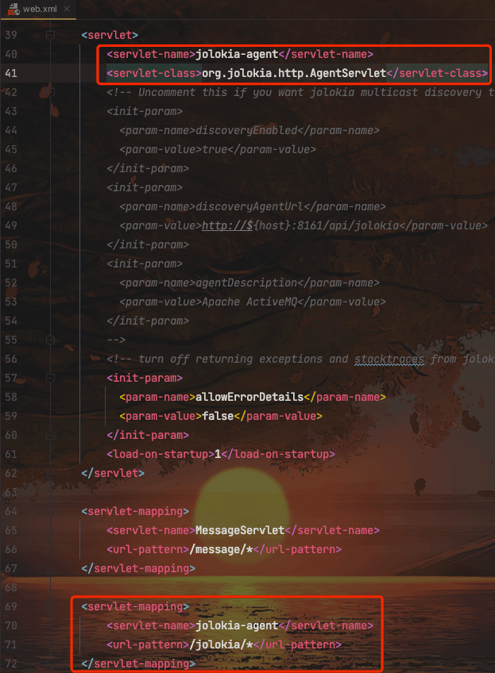

## 1.1 调用栈分析

跟进到该类看代码，在 handle 中调用了 handleSecurely()

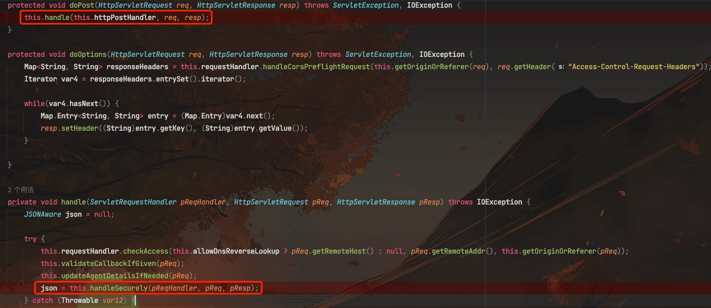

跟进 handleSecurely 方法，这里并没有传递`org.jolokia.jaasSubject`属性，所以执行了`pReqHandler.handleRequest(pReq, pResp);`

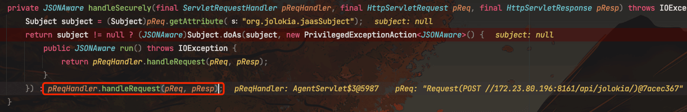

继续跟进 handleRequest 方法，这里创建了`ServletRequestHandler`对象返回给`json`来处理 POST 类型的 HTTP 请求

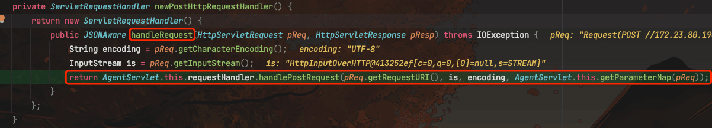

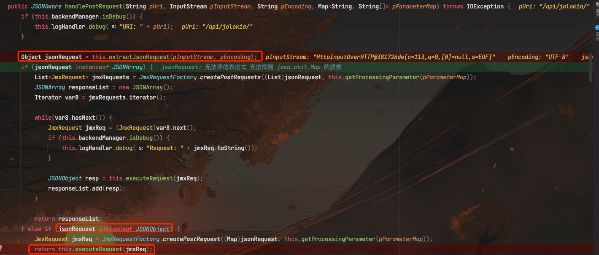

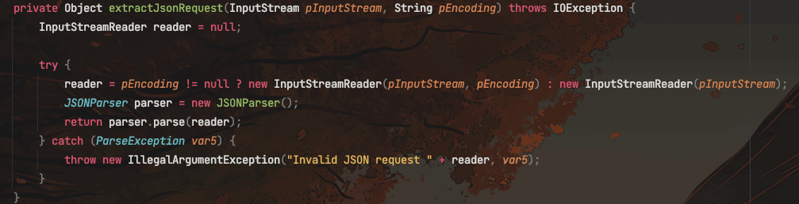

这里 extractJsonRequest 方法的确就是从 POST 请求的输入流中，读取输入数据，然后解析出 JSON 格式的数据，转换为 JSON 对象，然后利用 JmxRequestFactory 来创建一个 JmxRequest 对象，其中封装了对 JMX 管理功能的相关请求信息。然后调用 executeRequest 处理。

继续跟进 executeRequest

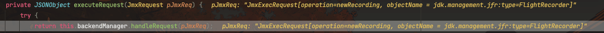

这里调用了 backendManager.handleRequest，继续跟进

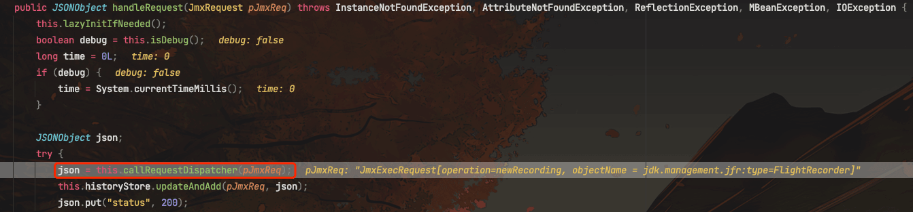

调用 callRequestDispatcher 方法，传入 JmxRequest 请求对象，进行请求调度处理，继续跟进

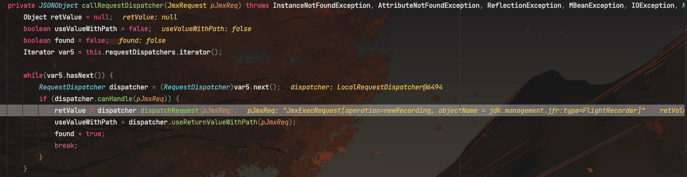

通过一层层的调度和分发，最终将 JMX 请求交给了对应的`ExecHandler`来处理 EXEC 类型的请求。

```java
public Object doHandleRequest(MBeanServerConnection server, JmxExecRequest request) throws InstanceNotFoundException, AttributeNotFoundException, ReflectionException, MBeanException, IOException {

    // 1. 提取目标 MBean 中操作的名称、参数类型等元信息
    OperationAndParamType types = this.extractOperationTypes(server, request);

    // 2. 准备参数数组，将请求参数转换为操作方法参数类型 
    int nrParams = types.paramClasses.length;
    Object[] params = new Object[nrParams];

    List<Object> args = request.getArguments();

    // 3. 验证参数数量、类型是否匹配
    this.verifyArguments(request, types, nrParams, args);

    // 4. 将请求参数转换为操作方法的参数类型
    for(int i = 0; i < nrParams; ++i) {
        if (types.paramOpenTypes != null && types.paramOpenTypes[i] != null) {
            // 使用 OpenTypeConverter 处理复杂类型
            params[i] = this.converters.getToOpenTypeConverter().convertToObject(types.paramOpenTypes[i], args.get(i)); 
        } else {
           // 使用 ToObjectConverter 处理基本类型
           params[i] = this.converters.getToObjectConverter().prepareValue(types.paramClasses[i], args.get(i));
        }
    }

    // 5. 利用 JMX API 调用目标 MBean 对象的操作方法
    return server.invoke(
        request.getObjectName(), 
        types.operationName,
        params,
        types.paramClasses);

}   
```

总结就是：

1.  request.getObjectName() 获取了请求中指定的目标 MBean 的对象名 (ObjectName)
2.  types.operationName 获取了请求中指定的目标 MBean 中的方法名
3.  params 包含了请求中传入的方法参数
4.  types.paramClasses 包含了目标方法的参数类型
5.  然后利用 JMX 服务器的 MBeanServerConnection 对象的 invoke 方法，按照 JMX 的反射调用机制，动态调用了目标 MBean 中的指定方法

通过这种方式，请求可以构造一个任意已注册在 JMX 服务器中的 MBean 对象以及其方法，然后动态执行其中的方法

## 1.2 构造 RCE

根据补丁来看，修改了 jolokia-access.xml 文件。在 ActiveMQ 中，`jolokia-access.xml` 文件用于定义哪些 MBean 和操作是允许或拒绝的。

其中新增了对 jdk.management.jfr:type=FlightRecorder 的限制，拒绝了对该 MBean 的所有属性和操作的访问。

在 Apache 的官方通告中，也说明了 RCE 是通过 FlightRecorder 来实现的，并且告诉了步骤：

1.  调用 newRecording
2.  调用 setConfiguration，其中包含 Webshell 数据
3.  调用 startRecording
4.  调用 copyTo 方法来写入 WebShell

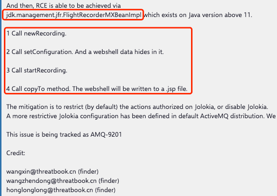

jdk.management.jfr.FlightRecorderMXBeanImpl 类是 JDK Flight Recorder 管理接口的实现类

关于 JDK Flight Recorder:

-   它是 JVM 内置的事件记录和分析工具，可以用来收集 JVM 的内部运行时信息，分析 JVM 和 Java 应用程序的行为。
-   通过它收集到的数据，可以找到各种性能问题并优化 Java 应用程序。

关于 jdk.management.jfr.FlightRecorderMXBeanImpl 类：

-   它实现了 jdk.management.jfr.FlightRecorderMXBean 接口。
-   FlightRecorderMXBean 接口定义了一系列管理 Flight Recorder 的方法。
-   FlightRecorderMXBeanImpl 实现了这些管理方法来控制 Flight Recorder 的行为。
-   这些方法包括：开始和停止 recording，获取 recording 数据，设置 recording 的配置等。
-   JConsole 和其他管理工具可以通过这些 MXBean 接口来管理 Flight Recorder。

接下来我们来跟进代码，看看这几个方法的实现

**newRecording()** 这里就是 new 一个 Recording 对象，返回 ID，后续根据 ID 访问这个 recording 实例，并进行后续的配置、开始/停止记录等操作

```java
public long newRecording() {
    MBeanUtils.checkControl();
    getRecorder(); // ensure notification listener is setup
    return AccessController.doPrivileged(new PrivilegedAction<Recording>() {
        @Override
        public Recording run() {
            return new Recording();
        }
    }, null, new FlightRecorderPermission("accessFlightRecorder")).getId();
}
```

**setConfiguration()** 传入 Recorder ID 和配置文件，解析配置文件，如果符合格式，就会采用该配置文件

```java
public void setConfiguration(long recording, String configuration) throws IllegalArgumentException {
    Objects.requireNonNull(configuration);
    MBeanUtils.checkControl();
    try {
        Configuration c = Configuration.create(new StringReader(configuration));
        getExistingRecording(recording).setSettings(c.getSettings());
    } catch (IOException | ParseException e) {
        throw new IllegalArgumentException("Could not parse configuration", e);
    }
}
```

在[Oracle 官方文档](https://docs.oracle.com/en/java/javase/17/jfapi/flight-recorder-configurations.html#GUID-51B499C9-CF15-48EE-9AAA-47BB69CBDABF)中有介绍默认模版在`<java_home>/lib/jfr/default.jfc`

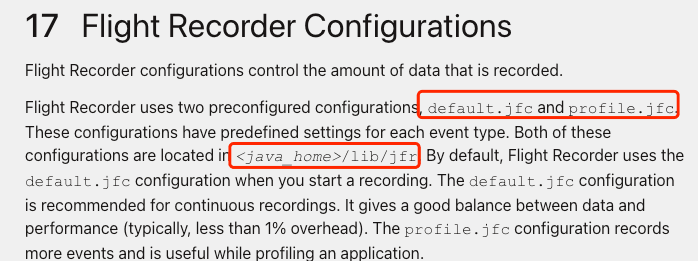

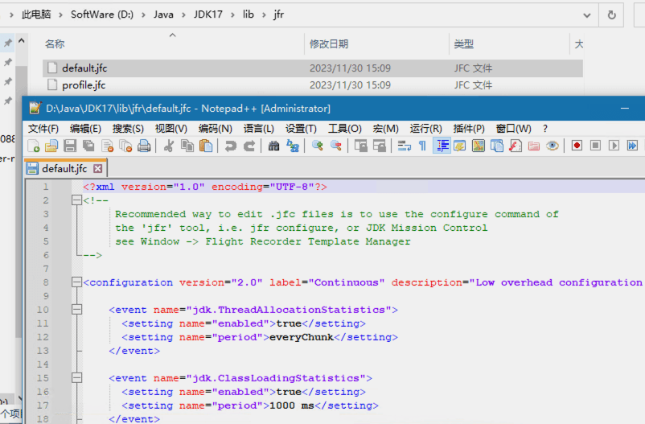

构造包含 WebShell 的配置文件，特殊字符经过 html 实体编码

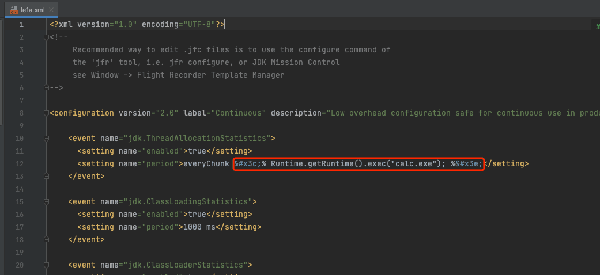

**startRecording** 传入 Recording ID，然后开始录制

```java
public void startRecording(long id) {
    MBeanUtils.checkControl();
    getExistingRecording(id).start();
}
```

**stopRecording**传入 Recording ID，结束录制

```java
public boolean stopRecording(long id) {
    MBeanUtils.checkControl();
    return getExistingRecording(id).stop();
}
```

**copyTo** 传入 Recording ID 和保存路径，这个路径没做限制，我们可以路径穿越到 web 目录去

```java
public void copyTo(long recording, String path) throws IOException {
    Objects.requireNonNull(path);
    MBeanUtils.checkControl();
    getExistingRecording(recording).dump(Paths.get(path));
}
```

# 二、利用完整思路

1.  构造恶意请求，传入目标 MBean 为 FlightRecorderMXBean，调用 FlightRecorderMXBean 的 newRecording 方法创建一个新的 Recording 对象
2.  调用 setConfiguration 方法，设置 Recording 使用的配置文件，在配置文件中的键名中插入 WebShell。由于导出的数据会包含键名，所以当我们在键名中插入 WebShell 时，导出的数据也会包含该 WebShell
3.  调用 startRecording 开启事件记录
4.  调用 stopRecording 停止事件记录
5.  调用 copyTo 方法，将记录的数据保存到指定文件，这里我们可以指定为 web 应用目录下的一个 jsp 文件
6.  这样最终就实现了写入一个包含恶意命令执行代码的 WebShell 文件，之后访问这个 WebShell，命令就会被执行

# 三、漏洞复现

从[stackoverflow](https://stackoverflow.com/questions/27707190/activemq-jolokia-api-how-can-i-get-the-full-message-body)找到了 jolokia api 的使用案例

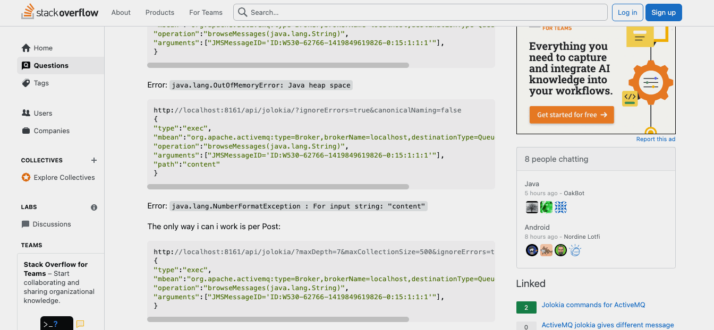

**构造数据包：**

1、调用 newRecording，获取 ID 为 1

```http
POST /api/jolokia/ HTTP/1.1
Host: 172.23.80.196:8161
Origin:172.23.80.196:8161
Authorization: Basic YWRtaW46YWRtaW4=
Content-Type: application/json

{
    "type": "EXEC",
    "mbean": "jdk.management.jfr:type=FlightRecorder",
    "operation": "newRecording",
    "arguments": []
}
```

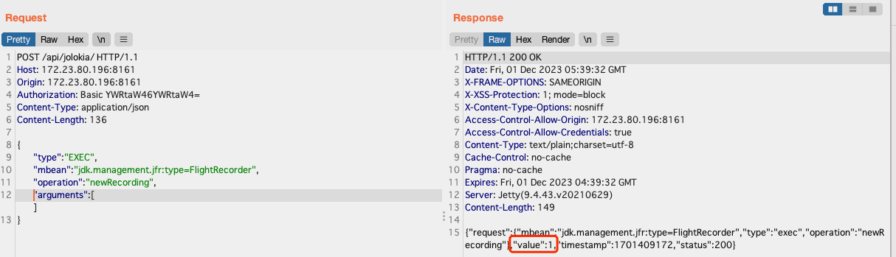

2、调用 setConfiguration 构造包含 WebShell 的配置文件，注意需要把 xml 数据的双引号转义并去除换行

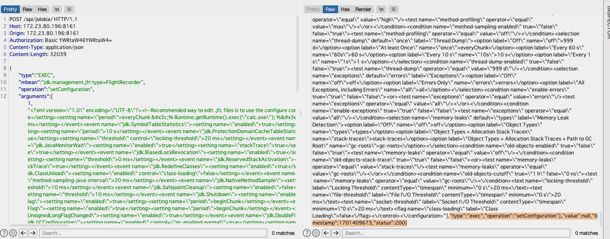

3、开始录制数据

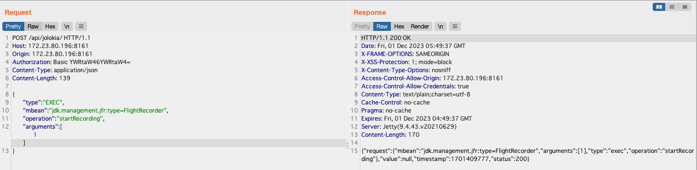

4、结束录制

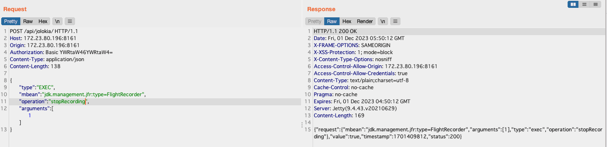

5、调用 copyTo，将文件写入 webapps/admin/le1a.jsp

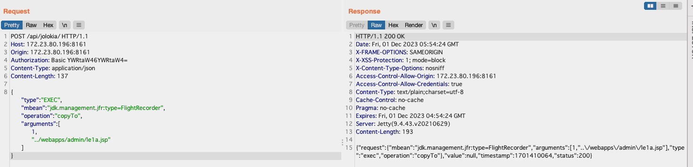

6、访问/admin/le1a.jsp，成功弹出计算器，漏洞验证成功

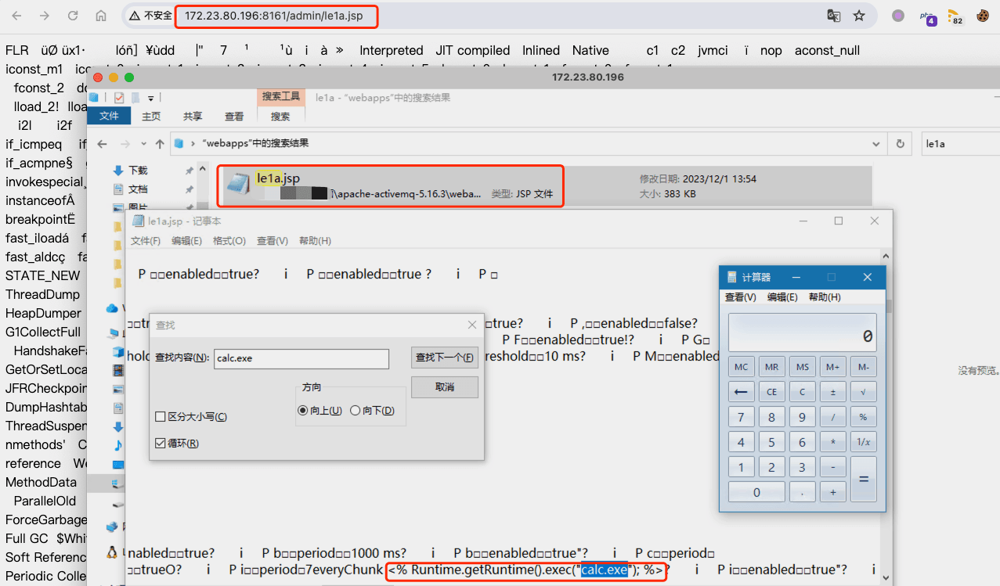
