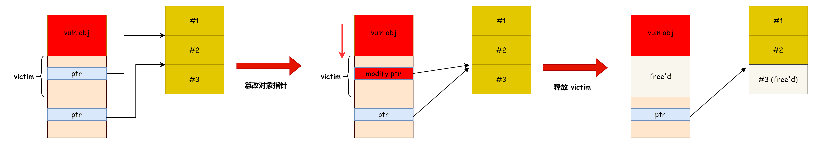
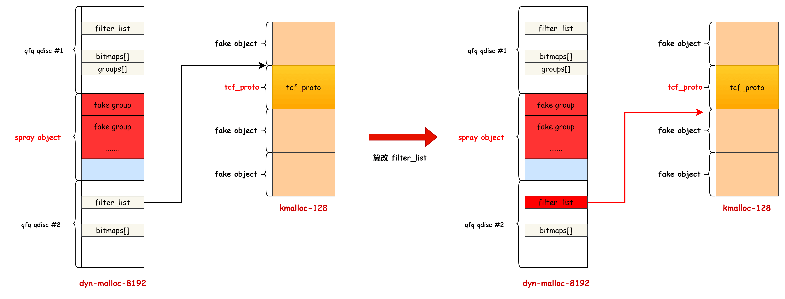

# 奇安信攻防社区-CVE-2023-31436 Linux 内核数组越界漏洞分析与利用

### CVE-2023-31436 Linux 内核数组越界漏洞分析与利用

漏洞分析 在 qfq\_change\_class 里面如果用户态没有提供 TCA\_QFQ\_LMAX，就会取网卡的 mtu 作为 lmax 且不做校验，loopback 网卡的 mtu 可以被设置为 2^31-1​ // qfq\_change\_class() in net/sched...

## 漏洞分析

在 qfq\_change\_class 里面如果用户态没有提供 TCA\_QFQ\_LMAX，就会取网卡的 mtu 作为 lmax 且不做校验，loopback 网卡的 mtu 可以被设置为 `2^31-1`​

```c
// qfq_change_class() in net/sched/sch_qfq.c

// ..
    if (tb[TCA_QFQ_LMAX]) {
        lmax = nla_get_u32(tb[TCA_QFQ_LMAX]);
        if (lmax < QFQ_MIN_LMAX || lmax > (1UL << QFQ_MTU_SHIFT)) {
            pr_notice("qfq: invalid max length %u\n", lmax);
            return -EINVAL;
        }
    } else
        lmax = psched_mtu(qdisc_dev(sch)); // [1]

// ..

        qfq_init_agg(q, new_agg, lmax, weight); // [2]
    }

// ..

    qfq_add_to_agg(q, new_agg, cl); // [3]
```

qfq\_update\_agg 中会使用 lmax，代码通过 lmax 计算 i，然后将 q->groups\[i\] 的地址保存到 agg->grp，之后就会通过 agg->grp 使用该对象。

```c
// qfq_update_agg() in net/sched/sch_qfq.c
    agg->budgetmax = new_num_classes * agg->lmax;
    new_agg_weight = agg->class_weight * new_num_classes;
    agg->inv_w = ONE_FP/new_agg_weight;

    if (agg->grp == NULL) {
        int i = qfq_calc_index(agg->inv_w, agg->budgetmax,
                       q->min_slot_shift);
        agg->grp = &q->groups[i]; // [4]
    }
```

查看结构体定义可以知道 q->groups 的大小为 25，控制 i 大于 25 就会越界访问。

```c
#define QFQ_MAX_INDEX       24
struct qfq_sched {
    struct tcf_proto __rcu *filter_list;
    struct tcf_block    *block;
    struct Qdisc_class_hash clhash;

    u64         oldV, V;    /* Precise virtual times. */
    struct qfq_aggregate    *in_serv_agg;   /* Aggregate being served. */
    u32         wsum;       /* weight sum */
    u32         iwsum;      /* inverse weight sum */

    unsigned long bitmaps[QFQ_MAX_STATE];       /* Group bitmaps. */
    struct qfq_group groups[QFQ_MAX_INDEX + 1]; /* The groups. */
    u32 min_slot_shift; /* Index of the group-0 bit in the bitmaps. */

    u32 max_agg_classes;        /* Max number of classes per aggr. */
    struct hlist_head nonfull_aggs; /* Aggs with room for more classes. */
};
```

‍

补丁分析：[https://git.kernel.org/pub/scm/linux/kernel/git/torvalds/linux.git/commit/?id=3037933448f60f9acb705997eae62013ecb81e0d](https://git.kernel.org/pub/scm/linux/kernel/git/torvalds/linux.git/commit/?id=3037933448f60f9acb705997eae62013ecb81e0d)

```c
diff --git a/net/sched/sch_qfq.c b/net/sched/sch_qfq.c
index cf5ebe43b3b4e..02098a02943eb 100644
--- a/net/sched/sch_qfq.c
+++ b/net/sched/sch_qfq.c
@@ -421,15 +421,16 @@ static int qfq_change_class(struct Qdisc *sch, u32 classid, u32 parentid,
    } else
        weight = 1;

-   if (tb[TCA_QFQ_LMAX]) {
+   if (tb[TCA_QFQ_LMAX])
        lmax = nla_get_u32(tb[TCA_QFQ_LMAX]);
-       if (lmax < QFQ_MIN_LMAX || lmax > (1UL << QFQ_MTU_SHIFT)) {
-           pr_notice("qfq: invalid max length %u\n", lmax);
-           return -EINVAL;
-       }
-   } else
+   else
        lmax = psched_mtu(qdisc_dev(sch));

+   if (lmax < QFQ_MIN_LMAX || lmax > (1UL << QFQ_MTU_SHIFT)) {
+       pr_notice("qfq: invalid max length %u\n", lmax);
+       return -EINVAL;
+   }
+
    inv_w = ONE_FP / weight;
    weight = ONE_FP / inv_w;
```

把 lmax 的校验移到了后面，确保从 mtu 取出的 lmax 也不能越界。

‍

## 漏洞利用

通过漏洞我们可以让 agg->grp 指向 qfq\_sched 对象后面的内存，然后利用 qfq\_slot\_insert 和 qfq\_schedule\_agg 可以实现越界写

```c
static void qfq_slot_insert(struct qfq_group *grp, struct qfq_aggregate *agg,
                u64 roundedS)
{
// ...
    hlist_add_head(&agg->next, &grp->slots[i]); // [1.1]
    __set_bit(slot, &grp->full_slots);          // [1.2]
}

static void qfq_schedule_agg(struct qfq_sched *q, struct qfq_aggregate *agg)
{
    struct qfq_group *grp = agg->grp;
// ...
    s = qfq_calc_state(q, grp);
    __set_bit(grp->index, &q->bitmaps[s]); // [2]
// ...
}
```

越界写原语解释：

-   qfq\_slot\_insert：由于 grp 指向越界的内存，set\_bit 的时候能越界写 bit，hlist\_add\_head 时可以越界写一个指针。
-   qfq\_schedule\_agg：由于 grp 指向越界的内存，通过堆风水可以控制 grp 对象内部的成员，从而控制 grp->index 在 set\_bit 时实现对 q->bitmaps 的越界写。

由于 qfq\_slot\_insert 会写入指针且控制的 bit 有对齐的要求，所以作者采用了 qfq\_schedule\_agg 原语，这个原语比较简单，控制 grp->index 就可以实现越界写 bit.

```c
struct qfq_sched {
    struct tcf_proto __rcu *filter_list;
    struct tcf_block    *block;
    struct Qdisc_class_hash clhash;

    u64         oldV, V;    /* Precise virtual times. */
    struct qfq_aggregate    *in_serv_agg;   /* Aggregate being served. */
    u32         wsum;       /* weight sum */
    u32         iwsum;      /* inverse weight sum */

    unsigned long bitmaps[QFQ_MAX_STATE];       /* Group bitmaps. */
    struct qfq_group groups[QFQ_MAX_INDEX + 1]; /* The groups. */
    u32 min_slot_shift; /* Index of the group-0 bit in the bitmaps. */

    u32 max_agg_classes;        /* Max number of classes per aggr. */
    struct hlist_head nonfull_aggs; /* Aggs with room for more classes. */
};
```

越界写 bit 的漏洞一般就是改 size 字段或者 [指针域](https://github.com/Bonfee/CVE-2022-0995) 构造 重叠对象，从而实现 UAF 或者类型混淆。

​​​​

‍

qfq\_sched->nonfull\_aggs 是一个很好的目标，原因是它 和 bitmaps 都在一个结构体内部，不需要额外的堆排布，该 list 在 qfq\_find\_agg 中被使用

```c
static struct qfq_aggregate *qfq_find_agg(struct qfq_sched *q,
                      u32 lmax, u32 weight)
{
    struct qfq_aggregate *agg;

    hlist_for_each_entry(agg, &q->nonfull_aggs, nonfull_next)
        if (agg->lmax <span style="font-weight: bold;" class="mark"> lmax && agg->class_weight </span> weight)
            return agg;

    return NULL;
}
```

修改 nonfull\_aggs 里面的指针，可以让 agg 指向其他区域，但是作者没有找到合适的布局对象控制 agg->lmax 和 agg->class\_weight，导致无法使用。

最终使用的策略是越界修改相邻 qdisc->filter\_list，让其指向其他的对象实现类型混淆：

​​

PS: 控制 fake group 的 index，通过 `qdisck #1`​ 的 bitmaps 数组越界修改 `qdisc #2`​ 的 filter\_list 指针。

dyn-kmalloc-8192 的堆喷对象为 qdisc\_size\_table .

```c
// qdisc_get_stab() in net/sched/sch_api.c

    struct qdisc_size_table *stab;
// ..
    stab = kmalloc(struct_size(stab, data, tsize), GFP_KERNEL);
```

kmalloc-128 的堆喷对象为 xdp\_umem

```c
// in include/net/xdp_sock.h, size = 112 bytes

struct xdp_umem {
    void *addrs;
    u64 size;
    u32 headroom;
    u32 chunk_size;
    u32 chunks;
    u32 npgs;
    struct user_struct *user;
    refcount_t users;
    u8 flags;
    bool zc;
    struct page **pgs;
    int id;
    struct list_head xsk_dma_list;
    struct work_struct work;
};
```

xdp\_umem 的 addrs 字段和 tcf\_proto 对象的 next 指针重叠\[，\]()addrs 指向的区域是和用户态进程的共享内存，所以让 filter\_list 指向 xdp\_umem 后，用户态就能看控制 next 指针指向的 tcf\_proto 结构体。

```c
// in include/net/sch_generic.h

struct tcf_proto {
    /* Fast access part */
    struct tcf_proto __rcu  *next;
    void __rcu      *root;

    /* called under RCU BH lock*/
    int         (*classify)(struct sk_buff *,
                        const struct tcf_proto *,
                        struct tcf_result *);
    __be16          protocol;

    /* All the rest */
    u32         prio;
    void            *data;
    const struct tcf_proto_ops  *ops;
    struct tcf_chain    *chain;
    /* Lock protects tcf_proto shared state and can be used by unlocked
     * classifiers to protect their private data.
     */
    spinlock_t      lock;
    bool            deleting;
    refcount_t      refcnt;
    struct rcu_head     rcu;
    struct hlist_node   destroy_ht_node;
};
```

在 \_\_tcf\_classify 里面会遍历 tcf\_proto->next，因此可以控制 next 指针指向的 tp，通过 classify 函数指针实现控制流劫持做 ROP.

```c
// in net/sched/sch_qfq.c
static struct qfq_class *qfq_classify(struct sk_buff *skb, struct Qdisc *sch,
                      int *qerr)
{
    struct qfq_sched *q = qdisc_priv(sch);
    struct tcf_proto *fl;
// ..
    fl = rcu_dereference_bh(q->filter_list);
    result = tcf_classify(skb, NULL, fl, &res, false);
// ..
}

// in net/sched/cls_api.c
static inline int __tcf_classify(struct sk_buff *skb,
                 const struct tcf_proto *tp,
                 const struct tcf_proto *orig_tp,
                 struct tcf_result *res,
                 bool compat_mode,
                 u32 *last_executed_chain)
{
// ..
    for (; tp; tp = rcu_dereference_bh(tp->next)) {
        __be16 protocol = skb_protocol(skb, false);
        int err;

        if (tp->protocol != protocol &&
            tp->protocol != htons(ETH_P_ALL))
            continue;

        err = tp->classify(skb, tp, res);
// ..
}
```

漏洞利用的地址泄露是使用侧信道的方式实现的

```c
https://github.com/IAIK/prefetch/blob/master/cacheutils.h
```

‍

## 总结与思考

漏洞产生的原因可能是开发者不了解设备 mtu 可以被用户态设置的非常大从而越界，做变体分析或者审计其他网络子系统代码时可以借鉴该漏洞的思路，设备的一些属性可能是被用户态控制的。

漏洞利用方面是通过堆布局控制了越界访问的对象，然后控制其中的 index 成员实现越界写，这一步控制数据的思路和 [CVE-2020-12352](https://github.com/hac425xxx/heap-exploitation-in-real-world?tab=readme-ov-file#bleedingtooth-linux-bluetooth-zero-click-remote-code-execution) 是类似的。

越界修改 bit 劫持指针也是相对比较常见的思路，不过之前都是利用重叠对象实现 [msg\_msg 的 UAF](https://github.com/hac425xxx/heap-exploitation-in-real-world?tab=readme-ov-file#cve-2021-22555-turning-x00x00-into-10000)，本文的利用思路则是利用类型混淆，控制 next 指针指向的对象，这提示我们可以多搜索、多尝试新的对象，打开思路。

利用侧信道的方式进行信息泄露，最近几年确实也有一些实际的案例，这个思路在真实场景下可能是一个不错的信息泄露策略。

‍

## 参考地址

-   [https://github.com/google/security-research/blob/master/pocs/linux/kernelctf/CVE-2023-31436\_mitigation/docs/exploit.md](https://github.com/google/security-research/blob/master/pocs/linux/kernelctf/CVE-2023-31436_mitigation/docs/exploit.md)

‍
