# 奇安信攻防社区-CVE-2024-22243 与 Java 中常见获取 host 的方式

### CVE-2024-22243 与 Java 中常见获取 host 的方式

Spring 官方近期披露了 CVE-2024-22243，在受影响版本中，由于 UriComponentsBuilder 处理 URL 时未正确处理用户信息中的方括号，攻击者可构造包含方括号的恶意 URL 绕过主机名验证。如果应用程序依赖 UriComponentsBuilder.fromUriString() 等方法对 URL 进行解析和校验，则可能导致验证绕过，出现开放重定向或 SSRF 漏洞。本质上还是安全检查的工具类与组件库解析 host 发起请求的解析逻辑导致的绕过问题。

# 0x00 前言

在实际业务场景中，Open Redirect 以及 SSRF 是比较常见的安全问题。通常情况下会通过解析请求 URL 中的 host，并检查在不在可允许的域名范围或者 ip 内，来避免相关的安全风险。例如通过相关的工具类（例如 java.net.URL 的 getHost 方法）获取 URL 中的 host 进行检查，然后再调用 HTTP 组件库（Apache Httpclient、okhttp 等）进行请求。

这里存在着一个解析差异的问题，**如果检查的工具类与组件库解析 host 发起请求的解析逻辑不一样的话，可能会存在绕过安全防护的问题。**

# 0x01 CVE-2024-22243

开发中我们经常会操作 URL，比如提取端口、提取路径以及最常用的提取参数等等。很多时候需要借助于一些第三方类库或者自己编写工具类来实现。在 Spring Web 中提供了一个用于构建和操作 URI 的工具类 UriComponentsBuilder。

## 1.1 漏洞描述

Spring 官方近期披露了 CVE-2024-22243，在受影响版本中，由于 UriComponentsBuilder 处理 URL 时未正确处理用户信息中的方括号 `[` ，攻击者可构造包含方括号的恶意 URL 绕过主机名验证。如果应用程序依赖 UriComponentsBuilder.fromUriString() 等方法对 URL 进行解析和校验，则可能导致验证绕过，出现开放重定向或 SSRF 漏洞。

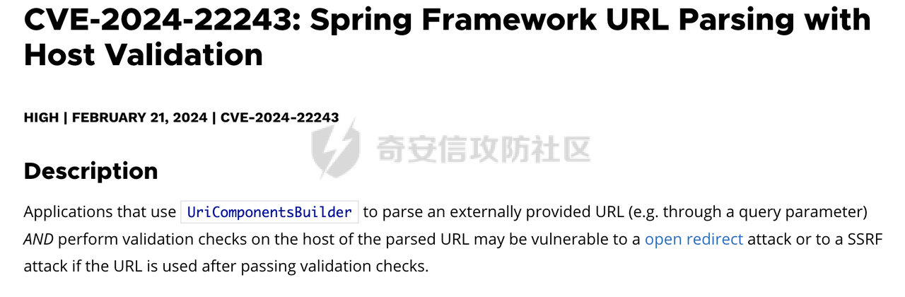

## 1.2 影响版本

Spring Framework

-   6.1.0 - 6.1.3
-   6.0.0 - 6.0.16
-   5.3.0 - 5.3.31
-   Older, unsupported versions are also affected

## 1.3 漏洞分析及复现

根据对应的漏洞描述，问题主要在 URI 的工具类 UriComponentsBuilder 中。

UriComponentsBuilder 提供了一种简单而强大的方式来构建和处理 URI，避免了手动拼接字符串的繁琐和容易出错的问题。通过添加路径、查询参数、片段等组件来构建完整的 URI：

```Java
UriComponents uri =UriComponentsBuilder.fromHttpUrl(url).build();
```

除了上面的 fromHttpUrl 方法以外，比较常用的有：

-   fromUri
-   fromHttpUrl
-   fromUriString

通过返回的 UriComponents 可以轻松的获取 URI 中类似协议、端口、host 等各部分内容。例如可以通过 getHost 方法获取当前请求的 host，结合实际的业务场景检查在不在可允许的域名范围或者 ip 内，来避免类似 SSRF/Open Redirect 等安全风险：

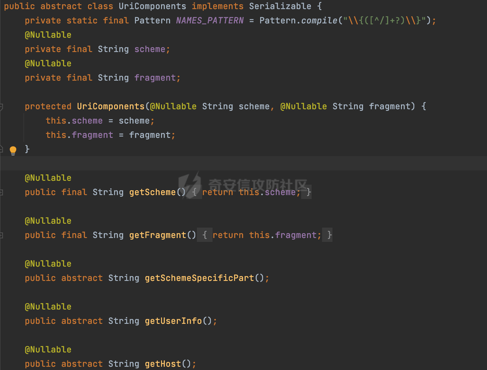

以org.springframework.web.util.UriComponentsBuilder#fromUriString方法为例，查看具体的解析过程，整个逻辑比较简单，主要是通过正则匹配URI中各个部分的内容，然后完成对应的封装：

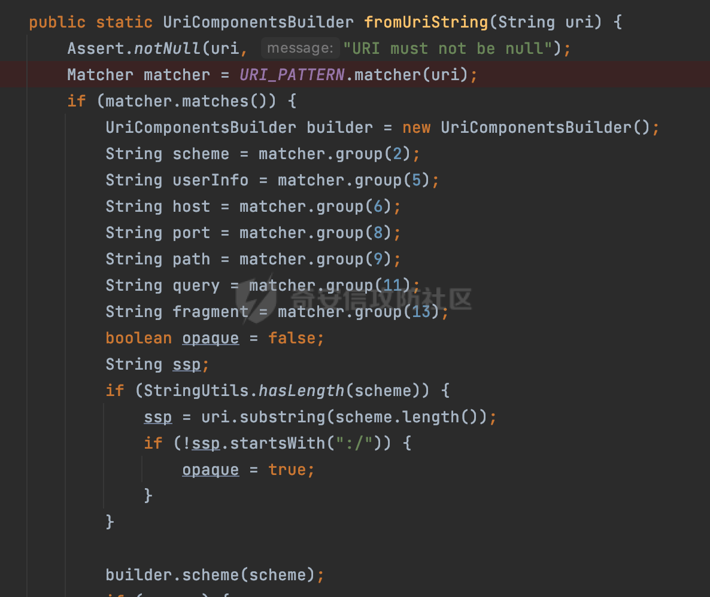

具体的正则如下，具体定义了匹配 URI 的每一个部分内容：

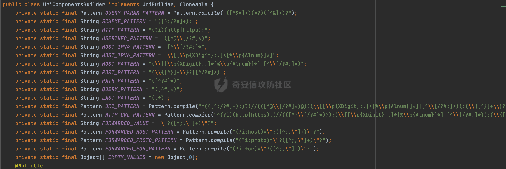

若未匹配相关信息，会抛出`throw new IllegalArgumentException("[" + uri + "] is not a valid URI");`异常，否则进行进一步的封装，同时这里对 scheme 和 host 进行了一定的合法性检查：

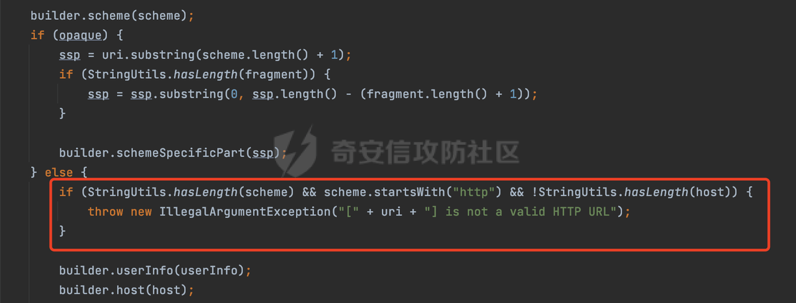

其他方法也是类似的，org.springframework.web.util.UriComponentsBuilder#fromHttpUrl方法的类型也是类似的但是使用的是HTTP\_URL\_PATTERN正则：

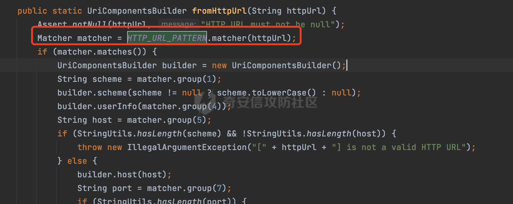

org.springframework.web.util.UriComponentsBuilder#fromUri则是直接使用的java.net.URI进行封装：

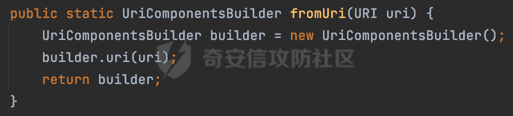

简单了解了具体的使用以后，通过相关的 commit 记录[https://github.com/spring-projects/spring-framework/commit/7ec5c994c147f0e168149498b1c9d4a249d69e87](https://github.com/spring-projects/spring-framework/commit/7ec5c994c147f0e168149498b1c9d4a249d69e87) 可以看到，官方提供的修复方式主要是移除了 USERINFO 中对方括号 `[`的匹配：

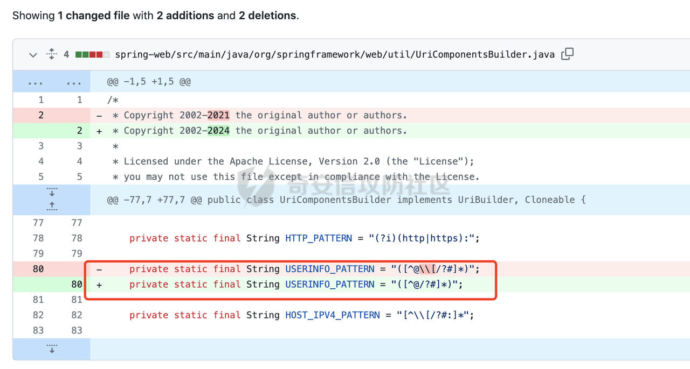

在此之前，可选的 USERINFO 信息由一个或多个非@、`[`、斜杠、问号和#号的字符组成。那么实际利用起来就很简单了，举个例子：

```Java
UriComponents uri =UriComponentsBuilder.fromHttpUrl("http://forum.butian.net[@risk.com").build();
```

解析完成后 USERINFO 为 null，对应的 host 并不是预期的 risk.com，而是 forum.butian.net：

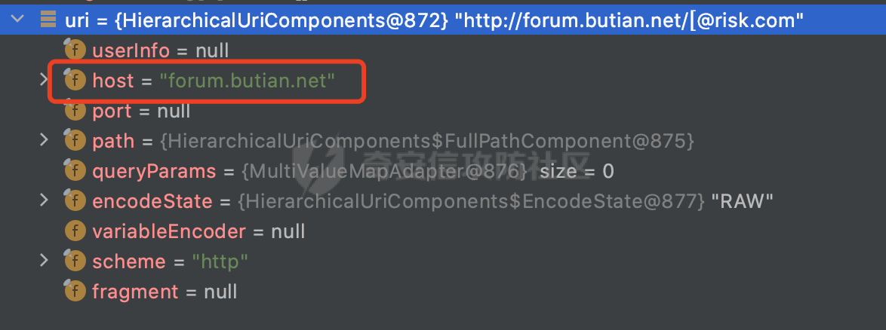

此时若发起请求的 http 组件能解析上述的 URL，且获取到的 host 存在解析差异的话，以 java.net.URL 为例，通过 HttpURLConnection 进行请求，可以看到这里实际获取到的 host 是 risk.com：

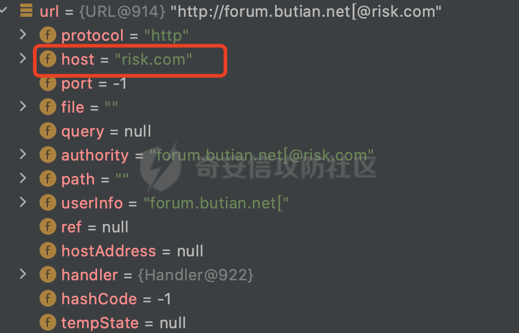

以 Open Redirect 的防护为例，一般会检查请求 host 是否在白名单范围内来进行拦截，通过上述请求，即可绕过对应的白名单 host 检查，访问到 risk.com，造成对应的风险。

实际上除了`[`以外，通过多个@、问号和#号的字符也能在使用 UriComponentsBuilder 获取到意料之外的 host：

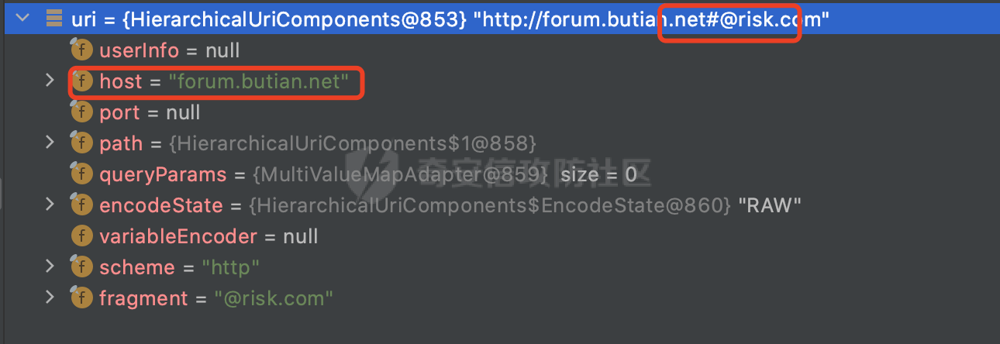

但是前提是发起请求的 http 组件能解析上述的 URL，且获取到的 host 存在解析差异，才可能导致对应的绕过风险，可以看到通过 java.net.URL 解析的 host 是一致的：

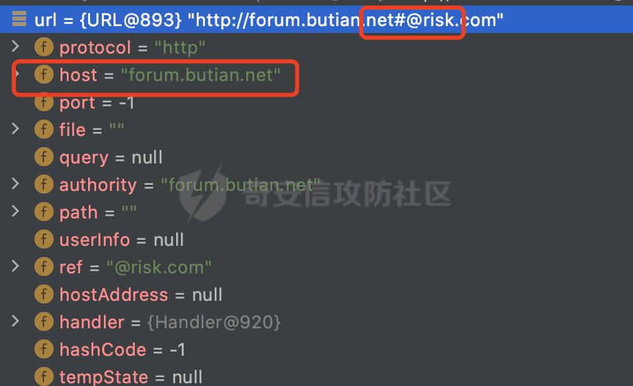

所以这也是为什么官方最终仅调整了`[`的原因吧？:


# 0x02 Java 中常见获取 host 的方式

前面对 SpringWeb 提供的工具类 UriComponentsBuilder 获取 host 的方式进行了简单的分析，除此之外，在 Java 中其他的一些获取 host 方式可能也会存在类似的解析差异导致的绕过问题。下面简单看看 Java 中常见的获取 host 的方式：

## 2.1 java.net

最常见的可以基于 URI 或者 URL 对象的 getHost 方法进行获取。很多组件库也是对其进行封装进行二次处理的：

```Java
URL url = new URL(input);
String host = url.getHost();
```

以 URL 为例，通过其构造器可以知道，最终调用的是 URL(URL context, String spec, URLStreamHandler handler)：

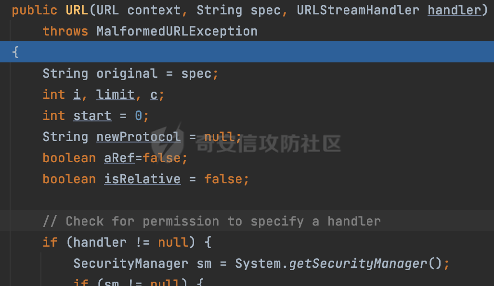

首先会解析出来请求的协议，并根据 protocol 去相应的包里面去加载`Handler`类，然后调用 parseURL 方法进行解析：

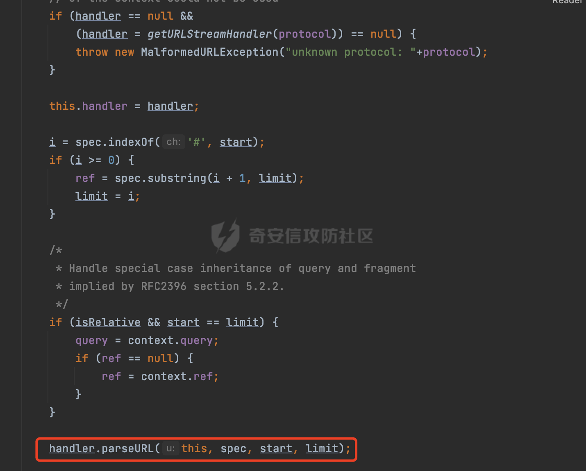

在 parseURL 方法中，主要是解析出 URL 中的字符串信息，最后将这些字符串结果再回设置给 URL 类中去。可以看到关于 host 的解析并不是基于正则的，会直接根据@字符的坐标进行切割：

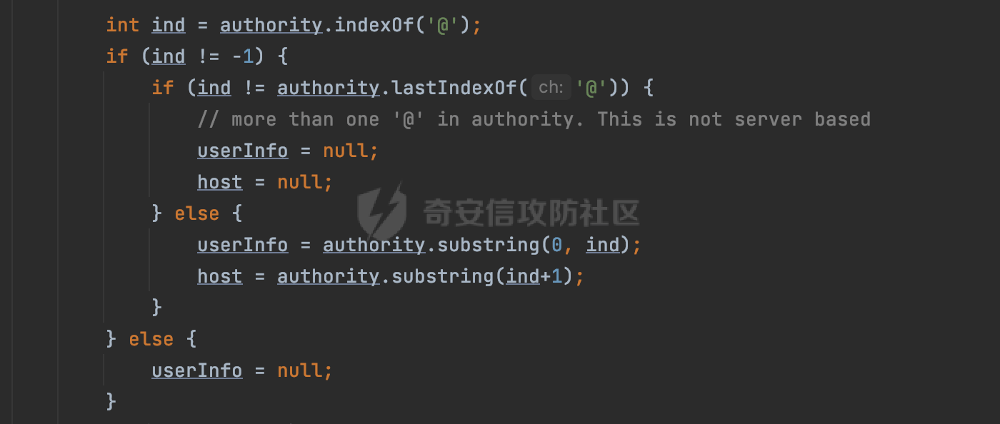

## 2.2 hutool 工具类

Hutool 是一个功能强大的 Java 工具类库，它提供了一系列方便实用的工具类，其中包括解析 URL 的工具类 cn.hutool.core.util.URLUtil，其提供了一系列的方法用于解析 URL。

可以看到其获取 host 的方式是基于 java.net.URL 上进行处理的：

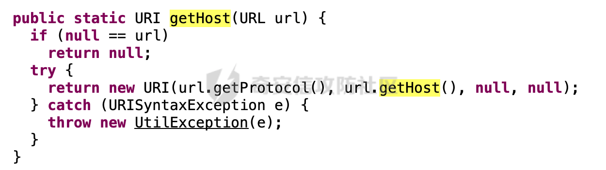

## 2.3 常用 HTTP 组件库

Apache Httpclient 是一个可以用来提供高效的、最新的、功能丰富的支持 HTTP 协议的客户端编程工具包。相比传统 JDK 自带的 URLConnection，增加了易用性和灵活性，它不仅使客户端发送 Http 请求变得容易，而且也方便开发人员测试接口（基于 Http 协议的），提高了开发的效率，也方便提高代码的健壮性。是 Java 中比较常用的 HTTP 组件库。

其中其不同版本解析获取 host 方法方式会有一些区别，下面举例说明：

-   **HttpClient3**

以 Get 请求为例，可以通过如下方法获取请求的 host：

```Java
HttpClient httpclient = new HttpClient();
HttpMethod method = new GetMethod("http://127.0.0.1%23.baidu.com/");
String host = method.getURI().getHost();
```

这里主要通过自实现的 URI 类 org.apache.commons.httpclient.HttpMethodBase 进行解析：

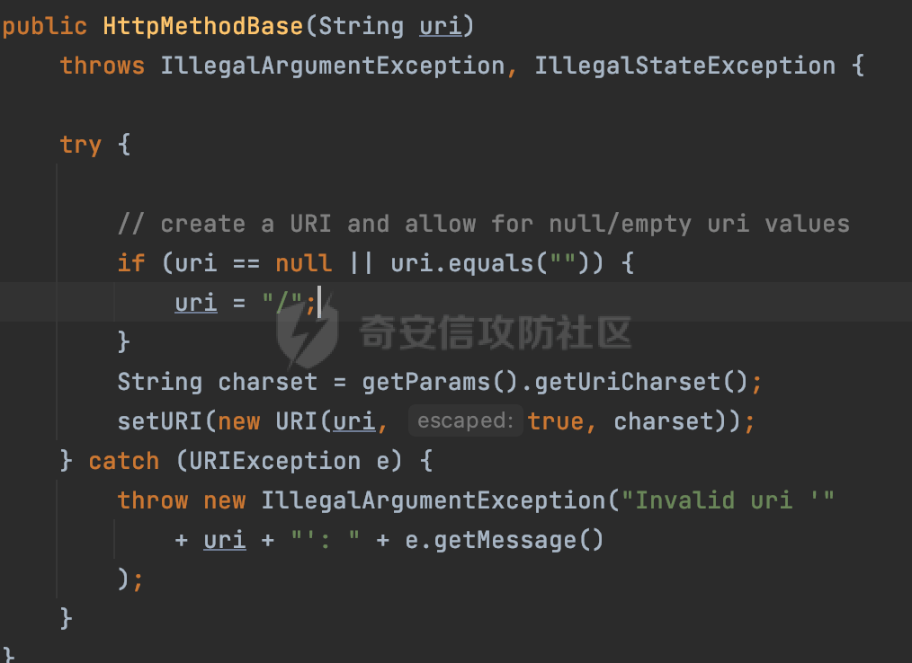

查看URI的具体实现，主要通过org.apache.commons.httpclient.URI#parseUriReference方法进行一些简单的处理:

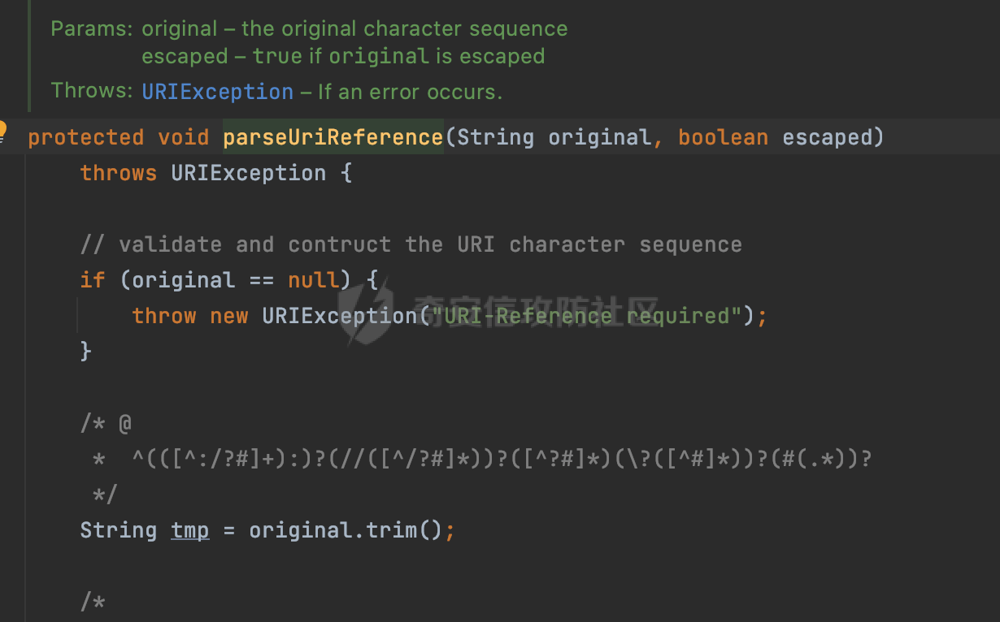

parseUriReference 方法会对不合理的 host 头进行处理。这里有个关键是会对#进行截断，重新组装后赋值给\_query，将处理后的\_query 生成新的 URI:

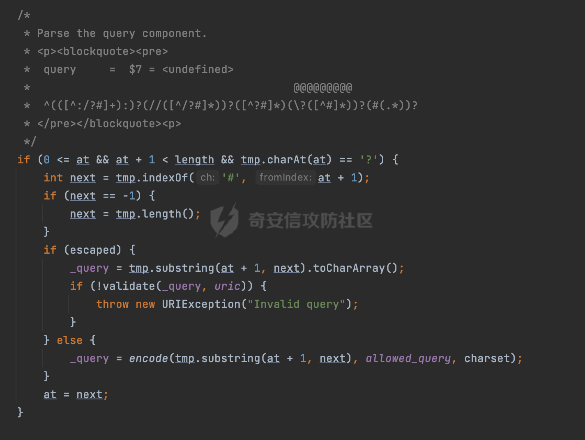

最后调用 HttpMethodBase 自身的 setURI 方法进行处理：

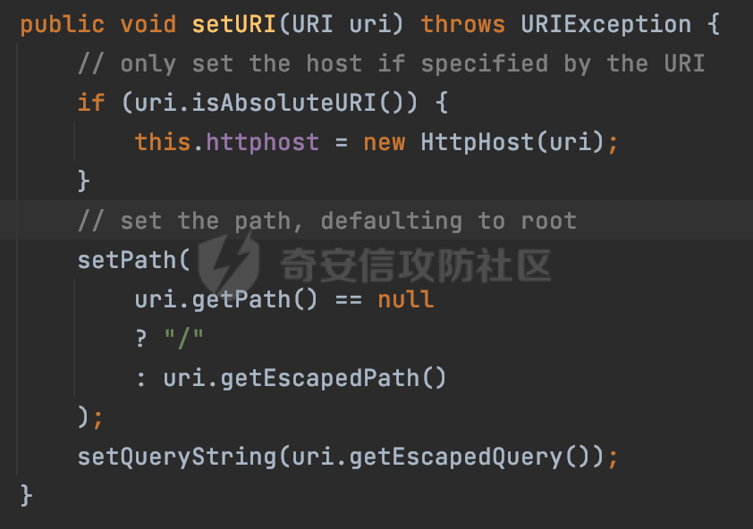

这里新建了 HttpHost 对象，查看其实例化方法，调用了自定义的 uri.getHost 方法，这里还会进行一次 URL 解码：

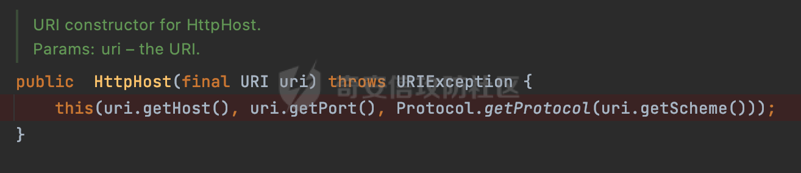

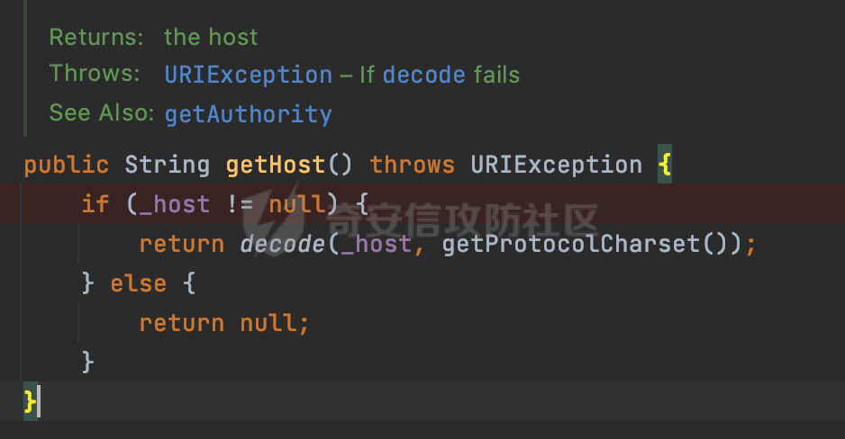

也就是说类似127.0.0.1#的host会经过二次处理变成127.0.0.1，以解析[http://127.0.0.1#forum.butian.net/](http://127.0.0.1/#forum.butian.net/) 为例（将#进行 URL 变成成%23 也是可以的）：

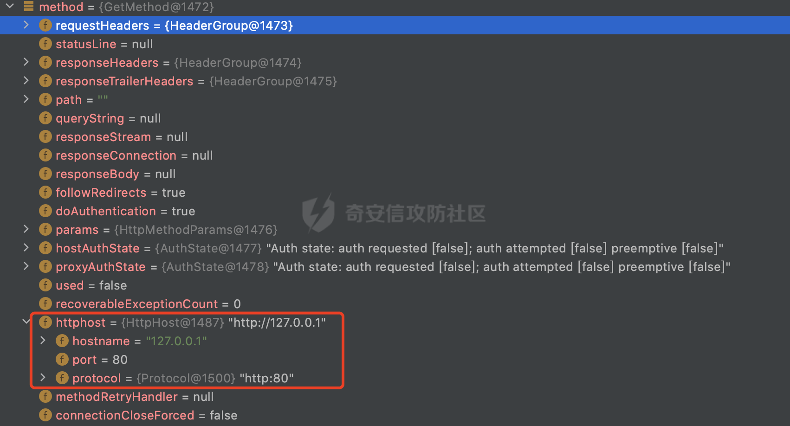

-   **HttpClient4(<=4.5.12 版本)**

可以通过内嵌的URIUtils#extractHost方法获取当前请求的host。

在解析时候先使用自带的 URL 函数获取 port 和 host，如果通过 getHost() 获取失败的话，会调用 getAuthority() 方法来进行调整。然后如果不为 null，则进行进一步的处理，首先对@进行截断，获取@后的内容。然后获取：做拆分，一直获取相关的整数，直到为非数字为止：

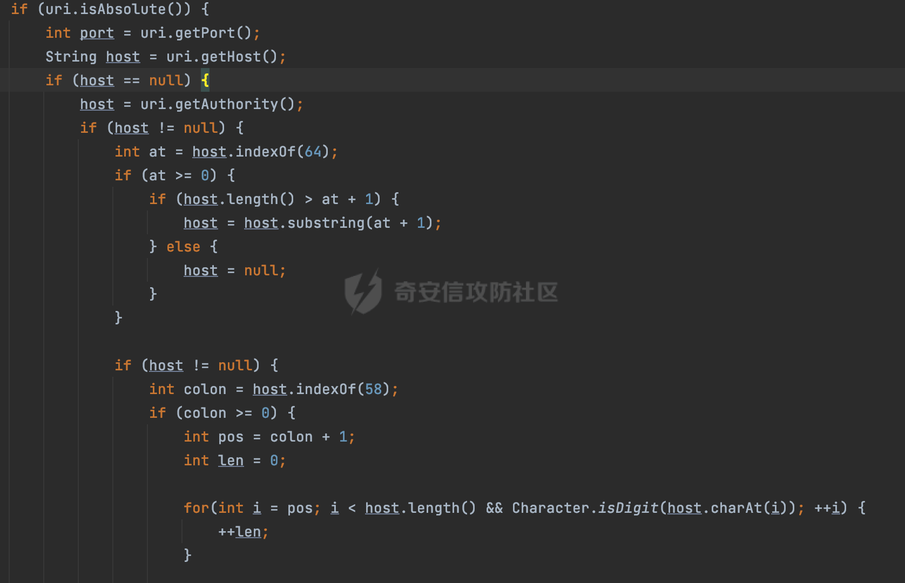

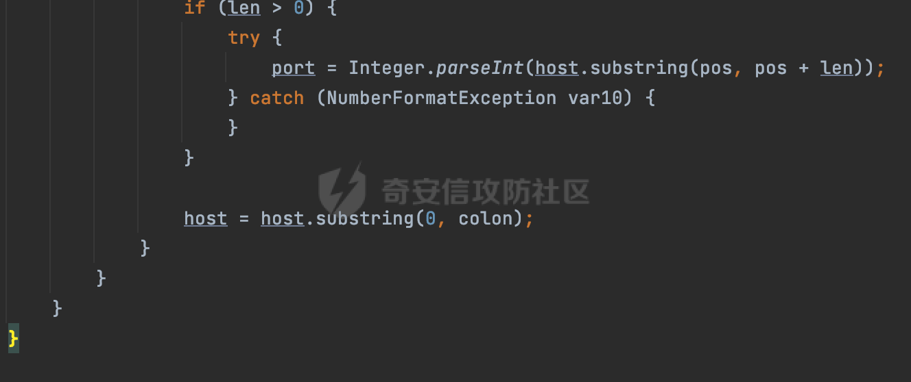

也就是说，类似:80.forum.butian.net 最后获取到的值应该为 80，作为相关的端口。然后 host 的内容以：进行 substring 切割：

```Plaintext
 host = host.substring(0, colon);
```

那么若相关的请求为 127.0.0.1:80.forum.butian.net，最终处理的结果为 127.0.0.1:80。

除此以外，还可以通过 org.apache.http.client.utils.URIBuilder 解析 url 来获取 host，本质上解析还是是基于 java.net.URL 上进行处理的：

```Java
URIBuilder uriBuilder = new URIBuilder("http://127.0.0.1:80.baidu.com");
String host = uriBuilder.build().getHost();
```

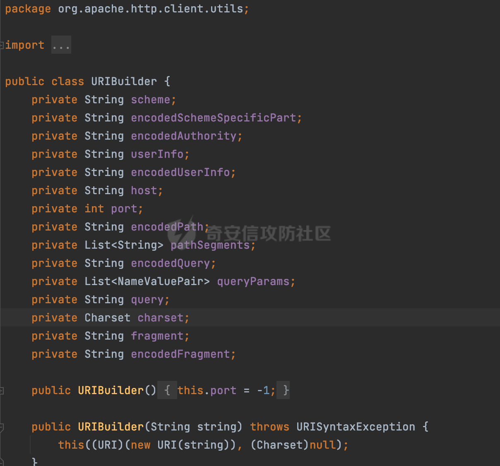

相比自定义的工具类，当使用组件库进行处理时，一般情况下检查的方法与组件库解析的方式是一致的，从一定程度上能避免解析差异导致的绕过问题。

除了 Httpclient 以外，okhttp 也是比较常用的 HTTP 组件库，具体的解析过程可以参考[https://forum.butian.net/share/2427](https://forum.butian.net/share/2427) 。

## 2.4 自定义正则匹配

实际上 UriComponentsBuilder 也是一种自定义正则匹配的场景，因为在实际调用时不清楚发起请求的解析库/工具类的解析模式，当安全检查的工具类存在解析差异的便导致了绕过的风险。
