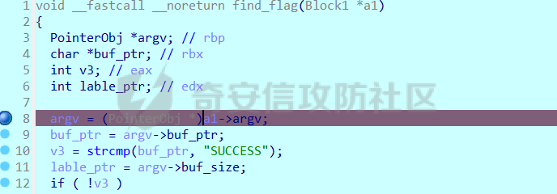

# 奇安信攻防社区-DiceCTF-Rev Scrambled-up

### DiceCTF-Rev Scrambled-up

在今年的 DiceCTF 中，做到了一个很特别的逆向题，比起以往的执行流混淆，这个题目是一个数据流混淆的题目。这里分享一下题目的解题过程

## Scrambled-up

这个题目比起普通的逆向题，最有意思的点就是**数据流编程**这一点。结合最后[主板方给出的源码](https://gist.github.com/srikavin/ebfa3a78cbf24a47d8ff0e83e4aa1295%5D)，应该是经典的函数式编程。根据研究应该是某一种 lisp 的方言，感觉想要复现应该是很困难的了。。  
这个文章前半段会讲一下大体的分析思路，如果只想看整体逻辑的话，可以跳到中间部分的**程序架构介绍**开始

## 初探程序

题目只有一个 elf，当把程序运行起来后，可以看到其大部分的逻辑都很普通，除了那个 mmap 了超大内存的地址，以及两个奇怪的函数（这两个函数我已经重命名过）

```C
  signal(SIGSEGV, invalid_flag);
  __printf_chk(1LL, "Enter the flag: ");
  fflush(stream);
  getline(&input_buffer, &n, qword_558958EEB680);
  input_ptr = &input_buffer[strlen(input_buffer) - 1];
  if ( *input_ptr == '\n' )
    *input_ptr = 0;
  v10 = 1;
  v11[0] = (__int64)input_buffer;
  v11[1] = strlen(input_buffer);
  off_558958EEB698 = (MyString *)v11;
  addr = mmap(0LL, 0xF00000uLL, 3, 0x22, 0, 0LL);// PROT_READ|PROT_WRITE
  inst_array = read_inst(inst_edge, inst_code); // PART I: init block and edge
  parser_inst(lines_number, (__int64)inst_array);// PART II: execute
```

### 程序初始化 read\_inst

这个`read_inst`中会从两个全局变量中读取数据。他这个读取过程会使用两个全局变量`inst_edge`和`inst_code`。在这里，程序会分别将这些数据读入，并且更新一个数组，这里为了方便描述，下文称为`Block`。以下是修改后的大致逻辑：

```Cpp
 // 首先会遍历所有的inst_code
do
{
    line = inst_code->line;
    inst_code = inst_code->next_call;
    if ( max_line < line )
    max_line = line;
}
while ( inst_code );
// 申请足够 max_line大的内存空间存放inst_code
blocks = malloc(max_line * sizeof(Block*))
do
{
    // 拷贝基本的block
    update_block(blocks, each_inst);
    // 注册两个重要概念：argv和slot
    blocks->argv = malloc(blocks->argv_cnt);
    blocks->slot = malloc(blocks->slot_cnt);
}
while ( each_inst_1 );

// 遍历所有的edge_inst，更新每一个Block的argv
foreach(each_edge in edge_inst)
{
    int src_block = each_edge->src;
    int dst_block = each_edge->dst;

    register_argv_slot(blocks[each_edge->dst]->slot, blocks[each_edge->src]->argv);

}
```

根据这里的逻辑，我们可以猜测如下的三个概念：

-   Inst：记录一个类似二进制在磁盘上存储的状态，表示当前的一些运行基本信息
-   Edge：记录了两个不同的二进制块之间的关联
-   Block：类似于加载到内存中的程序块

这三个结构体大致如下：

```C
struct Inst
{
  Block *next_call;
  __int64 line;
  __int64 argc;
  __int64 slot_cnt;
  __int64 exec_type;
  Var var;
};

struct Edge
{
  Edge *next_cond;
  __int64 dst_line;
  __int64 src_line;
};

struct Block
{
  __int64 line;
  int exec_type;
  int field_C;
  __int64 argc;
  Var *argv;
  __int64 slot_cnt;
  Var *slot_buffer;
  Var value;
};
```

第一次看到这些结构体可能会难以理解，我们会在文章后面逐步介绍这些结构体是什么。除了这些关系外，我们可以观察到，不同的 Block（Inst）会被 Edge 关联起来，其关系如下：

```php

                                     +----------+
                                     |          |
                                     |  SRC1    |
                                     |          |
                     +-------+   +---+   BLOCK  |
                     |       |   |   |          |
                     |       |   |   |    argi1 |
                     |       |   |   +----------+
                     |     <-+---+
+-----------+        |       |       +----------+
|           |        |       |       |          |
|  DST      |        |       |       |  SRC3    |
|          <-+-------+       |       |          |
|   BLOCK   |        |     <-+-------+   BLOCK  |
|           |        |       |       |          |
|           |        |       |       |    argi2 |
+-----------+        |SLOT   |       +----------+
                     |       |
                     |       |       +----------+
                     |       |       |          |
                     |       |       |  SRC3    |
                     |       |       |          |
                     |     <-+-------+   BLOCK  |
                     |       |       |          |
                     |       |       |    argi3 |
                     |       |       +----------+
                     +-------+
```

可以看到，每一个`DST`Block 中，会被多个`SRC`Block 注册。其中每一个`SRC`被注册的时候，会将对应的`arg`的**地址**放到`DST`中的`slot`中。每一个`arg`的序号不固定。

其次，我们可以注意到在`Inst`和`Block`末尾能看到一个叫做`Var`的变量：

```C
struct Inst
{
  // ......
  Var var;
};

struct Block
{
  // ....;
  Var value;
};
```

每一个 Block 中**可能包含一个有效的属性变量**。这个属性的定义如下：

```C
struct Var
{
  __int64 var_type;
  __int64 var_or_ptr;
  __int64 var_length;
};
```

成员变量解释如下：

-   `var_type`:当前变量的类型。1 的时候表示当前`var_or_ptr`中存放的为指针，2 的时候表示`var_or_ptr`中存放的是变量本身，0 的时候表示当前值为无效值
-   `var_or_ptr`:当前变量的值
-   `var_length`:当 type 为 1 的时候，表示指针指向的内容长度

总结一下，初始化过程中会发生如下的流程：

-   读取磁盘中的 Inst，将其放入 Blocks 数组中
-   读取磁盘中的 Edge，将不同的 Blocks 的 arg 与另一些 Blocks 的 slot 关联

### 解析 Block parser\_inst

在执行流中，程序执行过程如下：

```C
  new_lines = calloc(lines_number, 1uLL);
  has_been_exec = &new_lines;
  do
  {
    do
    {
      if ( !*has_been_exec )
      {
        if ( !iter_block->exec_type )           // exec_type = 0 means don't call any func
          goto just_execute;
        pointer_cnt = iter_block->argc;
        if ( !pointer_cnt )
        {
SelectCond:
          exec_inst(iter_block);
just_execute:
          *has_been_exec = 1;
          goto LABEL_5;
        }
        pointer_array = iter_block->argv;
        check_idx = 0LL;
        while ( LODWORD(pointer_array->var_type) )
        {
          ++check_idx;
          ++pointer_array;
          if ( check_idx == pointer_cnt )
            goto SelectCond;
        }
      }
LABEL_5:
      ++has_been_exec;
      ++iter_block;
    }
    while ( final_inst != has_been_exec );
    // skip code
}
```

整个程序流执行的时候，有如下的检测逻辑：

-   如果 argc 为 0 的话，进入`exec_inst`逻辑
-   如果 argc 不为 0 的时候，检查 argv 是否已经被完全初始化（不为空），如果彻底初始化，进入`exec_inst`逻辑
-   程序运行完成之后，会检查是否执行到最后一个块，如果执行到最后一个块，但是并未每一个块都执行过，程序将会直接退出

这里将会埋下程序执行流的第一个疑问：**argv 将会在哪儿被初始化？**

#### 执行部分 exec\_inst

这个函数中，存放了 11 个不同的函数：

```C
__int64 __fastcall exec_inst(NewInstr *a1)
{
  void *funcs[11]; // [rsp+0h] [rbp-78h] OVERLAPPED
  unsigned __int64 v3; // [rsp+68h] [rbp-10h]

  funcs[0] = 0LL;
  *(_OWORD *)&funcs[6] = 0LL;
  *(__m128i *)&funcs[1] = _mm_unpacklo_epi64(
                            (__m128i)(unsigned __int64)func1_sum_ptr,
                            (__m128i)(unsigned __int64)func2_multi);
  funcs[5] = func5_assing_if_else;
  *(__m128i *)&funcs[3] = _mm_unpacklo_epi64(
                            (__m128i)(unsigned __int64)func3_assign_valut_to_register,
                            (__m128i)(unsigned __int64)func4_call_func);
  *(__m128i *)&funcs[8] = _mm_unpacklo_epi64(
                            (__m128i)(unsigned __int64)find_flag,
                            (__m128i)(unsigned __int64)func9_send_read_string);
  *(__m128i *)&funcs[10] = _mm_unpacklo_epi64(
                             (__m128i)(unsigned __int64)func10_combine_two_pointer,
                             (__m128i)(unsigned __int64)funcb_get_value_frm_ptr_offset);
  return ((__int64 (*)(void))funcs[a1->exec_type])();
}
```

程序会通过将 9 个不同的函数放到栈上，并且根据`Block`中的`exec_type`指定我们需要执行的函数类型。我们在这里将这些函数定义为**ExecFunc**。这里总结一下不同的 type 对应的函数功能

| type | 函数作用 |
| --- | --- |
| 1   | 将所有的 argv 相加，将答案赋值 |
| 2   | 将所有的 argv 相乘，将答案赋值 |
| 3   | 将 var 位置的 block 赋值 |
| 4   | 调用一个函数指针，并且将调用结果赋值 |
| 5   | 如果 argv\[0\] == 0，则使用 argv\[1\]赋值，否则使用 argv\[2\]赋值 |
| 8   | 检查 flag 是否正确 |
| 9   | 调用 read 函数，将 flag 读入全局变量中 |
| 10  | 将两个指针指向的内存合并到一个新的内存中 |
| 11  | 获取 argv\[0\]\[argv\[1\]\] 的值，并且赋值 |

这里可以看到，反复提到了一个叫做**赋值**的操作。这个操作具体在做什么呢？我们选择其中最简单的类型 3`assgin`为例子看一下：

```C
void __fastcall assign(NewInstr *a1)
  v1 = _mm_loadu_si128((const __m128i *)&a1->value);
  var_length = a1->value.var_length;
  var_cnt = a1->slot_cnt;
  if ( var_cnt )
  {
    var_array = a1->slot_buffer;
    end_var = (Var *)((char *)var_array + 8 * var_cnt);
    do
    {
      each_var_obj = (Var *)var_array->var_type;
      var_array = (Var *)((char *)var_array + 8);
      each_var_obj->var_length = var_length;
      *(__m128i *)&each_var_obj->var_type = v1;
    }
    while ( var_array != end_var );
  }
```

这边可以看到，程序在运行过程中，会将`slot`中存放的内容**作为指针取出**，并且将**从 var 中取出的**数值赋值到指针中。这个就是前文提到的**赋值**概念。更加形象化的描述的话，这个**赋值**过程如下：

1.  程序进入`exec_inst`，执行 block 指定的一个函数
2.  此时，取出`block`中所有的 argv（在之前我们限制了 argv 一定要都处于被初始化的状态，而且类似 assign 过程是不需要参数的）
3.  执行操作，获得一个计算结果
4.  从当前`block`的`slot`中取出所有的指针，并且进行赋值

```C
for(int i; i < block->slot_cnt;i++ )
{
  ptr = block->slot[i];
  *ptr = ret_value;
}
```

至此，我们可以知道当前 Block 的几个特征

-   程序在运行过程中，一个 Block 的输出会影响其他 Block 的输入
-   Block 通常会拥有多个参数，但是所有的参数都要其他的 Block 作为输出赋值，除非当前 Block 的`call_type`为 3，此时 block 不拥有参数，只会有赋值动作
-   Block 的输入参数不会被修改，单个 Block 类似于**pure function**

##### exec\_type 4 -- 新的关键函数

程序在运行的时候，会发现这个`exec_type:4`还蛮关键的，看到其函数如下：

```C

  mprotect(addr, 0xF00000uLL, 3);
  memcpy(addr, (const void *)a1->argv->var_or_ptr, a1->argv->var_length);
  mprotect(addr, 0xF00000uLL, 5);
  memset(v17, 0, 0x188uLL);
  argc = a1->argc;
  v17[0] = argc - 1;
  if ( argc > 1 )
    memcpy(&v17[1], &a1->argv[1], 24 * argc - 0x18);
  v2 = _mm_loadu_si128((const __m128i *)g_flag);
  funcs = _mm_load_si128(v13);
  v11 = funcs;
  qmemcpy(v10, v17, sizeof(v10));
  ((void (__fastcall *)(char *))addr)(v18);     // reorg_buffer(pointer1, pointer2)
  fflush(stream);
  // skip code
```

可以看到，这边会将`argv[0]`作为输入，拷贝到全局变量`addr`中，然后将其他的 argv 作为参数传入到这个函数指针中。然而在逆向过程中会发现，代码中的数据段**并没有任何地方存放了一个完整的函数**。通过一些逆向我们能够知道，函数们似乎**在最初都被加密了**，所以只得让程序运行一段再回头看。这里给出`call_type：4`会执行的函数，为了与上文的**ExecFunc**区分，这里我们定义他们为**CallFunc**（函数名为我们自定义的）。

| 函数名 | 作用  |
| --- | --- |
| xor\_all\_argv | 将所有的参数异或 |
| or\_all\_argv | 将所有的参数或 |
| and\_all\_argv | 将所有的参数相与 |
| check\_if\_zero | 检查第二个参数是否为 0，如果为 0 返回 1，否则返回 0 |
| get\_index\_from\_input | 获取输入的第 index 参数，此时输入会传入该函数中 |
| reorder | 将输入（16 字节）按照指定的顺序重构 |
| maze\_step | 走迷宫函数，最后介绍 |

到这一步，基本上所有静态分析（其实也使用了动态了）能做的就都做完了，接下需要对程序进行一个宏观审视，才能进一步的分析整个逻辑。

## 程序架构介绍

分析了上面的执行流之后，我们发现这个程序的执行过程和传统程序不一样，甚至和传统意义上**被混淆的程序**有所不同。

传统意义上，我们的程序使用了是带有分支的执行流，例如：

```C
if(a > 0)
{
  while(TRUE){
    a += 6;
    if(b-a < 0x100){
      break;
    }
  }
}
else{
  // code
}
```

从程序上来看，`if..else..`是两个完全不相关的逻辑，这就意味这程序本身是以**执行流**作为指导，比如说：

-   程序会因为传入的数据变化进入不同的分支，并非所有的逻辑都会被触发
-   程序执行的过程中，可能同一个变量会持续地被修改
-   程序地条件语句执行变化非常的丰富

即使是进行混淆（例如 ollvm 的**扁平化**），本质是基于执行流，即通过增加状态值，让程序跳转到不同的执行块上。这种程序的编程方式我们临时性的定义为**执行流编程**

然而根据前面分析我们可以知道，本题有以下几个特征

-   程序运行为简单的线性，所有的逻辑都会被执行一遍
-   程序执行过程中，只有输入变量和输出变量，并且输入变量恒定不变。当程序有需要修改输入变量指向的位置地时候，会将输入变量本身输出到另一个代码块，然后再执行
-   程序条件判断很简单，只有判断 0 和非 0 两种情况

根据搜索，这种被称之为**数据流编程**（Dataflow programming）也就是使用数据流作为串联整个程序地核心。

将这两个对比可以得到如下地结果

| 执行流编程 | 数据流编程 |
| --- | --- |
| 根据输入情况，并非所有逻辑都会执行（不考虑 exit 等系统调用） | 无论输入如何变化，所有逻辑都会被执行（不考虑 exit 等系统调用） |
| 程序中的单一变量可能被修改 | 存在输入和输出变量，输入变量一定不能被修改 |
| 条件语句较为丰富 | 条件判断单一 |

## 题目分析

### 题目初步分析

这里对比以后，我们会发现这个题目存在以下难题：

1.  我们不能像以前一样简单的模拟程序，从而还原当前程序。常见地去混淆之类的技巧就是通过模拟运行（或者真实运行）重组当前执行流，然而当前程序执行流均被展开。比如说 for 循环中的 i 在这个数据流中完全被展开了，不存在形如（BlockA -> BlockB -> BlockA）这种执行顺序。因此循环和判断语句需要完全凭借经验进行转换。
2.  即使尝试进行执行流还原，粒度也会非常细。每一个 BlockA 最多只会执行一个简单的函数（除了 maze\_step）这样一来我们就很难像常见的逆向题一样，根据一些特定的特征函数对数据进行还原。
3.  程序的变量传递是随着程序进行的。不同于执行流，这个数据流程序的变量一直都是持续的传递和组合，而传统的执行流程序很多时候**并非真的需要完全解密**（除了某些 SMC 程序）往往找到**条件判断 | 加密**这两部分逻辑，再在关键位置进行 dump，就能够还原原先的逻辑。即便是类 VM 的程序，也能够根据对应的 VM 所指令，将指定的变量按照对应寄存器之类的处理还原，最后能够还原出整体逻辑。然而当前程序本身粒度非常细，并且变量传递非常频繁，这就需要人为主动的根据逻辑分析哪些变量是无需考虑，哪些变量需要我们持续追踪。

分析了上述难点后，我们发现，想要解出这道题，需要满足如下需求：

-   尽可能地打印原始的数据流块，并且需要还原变量传递的关系。虽然粒度非常细，但是通过审计和猜测，可以得到部分数据块之间的关系。
-   在尽可能程序运行结尾处进行内存 dump 等工作，这样能保证所有变量已经完成了传递。这种数据流虽然缺失了执行跳转，但是从另一个角度说，在结尾处，所有的逻辑都会被执行。这就意味着即便是输入出错，我们也能获取完整的逻辑。
-   每一个 Block 都有多个参数，参数的赋值顺序来自于其在 Edge 中注册的顺序，越早注册的 argv 下标越大，需要结合 edge 弄明白变量来自于哪个 block。

### 阶段一：数据流 dump

为了尽可能的获取数据，我们可以在`ExecFunc8`，也就是**确认 flag 是否正确**的函数处下断点，当程序能够运行到当前位置的时候，说明所有的 Block 解密部分以及数据传递已经完成。



此时，内存中的数据如图：  


此即为 Block 所在的堆。于是此时我们可以尝试 dump 完整的运行中 Block 数据。根据当前的偏移，计算起始坐标：

```php
0x7FABE02BC0D8(current_addr) - 0x48(sizeof(Block1))*0x1191(line)
```

同时，我们找到`edge`对应的位置：


  
此时，我们找到了关键的`Block`和对应的关联`Edge`。编写脚本，将所有的执行流 dump 下来：

```python
import idc
import idaapi
import os

CONTENT_TYPE_CGI = 1
CONTENT_TYPE_BIN = 8

def create_dir(path):
    if not os.path.exists(path):
        os.makedirs(path)

func_map = {
    b'UH\x89\xe5H\x81\xec\xd0\x03\x00\x00H\x89\xbd8\xfc\xff\xff\x8bE\x18\x83\xf8\x02\x0f\x85\x91\x00\x00\x00H\xc7E\xf8\x00\x00\x00\x00H\xc7E\xf0\x00\x00\x00\x00\xeb(H\x8bU\xf0H\x89\xd0H\x01\xc0H\x01\xd0H\xc1\xe0\x03H\x8d@\x10H\x01\xe8H\x83\xc0\x10H\x8b\x00H1E\xf8H\x83E\xf0\x01H\x8bE\x10H9E\xf0r\xceH\x8b\x858\xfc\xff\xffH\x89\xc6\xb8\x00\x00\x00\x00\xba1\x00\x00\x00H\x89\xf7H\x89\xd1\xf3H\xabH\x8b\x858\xfc\xff\xffH\xc7\x00\x01\x00\x00\x00H\x8b\x858\xfc\xff\xff\xc7@\x08\x02\x00\x00\x00H\x8b\x858\xfc\xff\xffH\x8bU\xf8H\x89P\x10\xe9\xfc\x00\x00\x00H\x8bE H\x8bU(H\x89E\xc0H\x89U\xc8H\x8bE8H\x8bU@H\x89E\xb0H\x89U\xb8H\x8bE\xc8H\x89E\xe0H\x8bE\xb8H\x89E\xd8H\x8bU\xd8H\x8bE\xe0H9\xc2H\x0fC\xc2H\x89E\xd0H\x8b\x95\x98\x01\x00\x00H\x8bE\xd0H\x89\xc7\xff\xd2H\x89E\xa0H\x8bE\xd0H\x89E\xa8H\xc7E\xe8\x00\x00\x00\x00\xeb2H\x8bU\xc0H\x8bE\xe8H\x01\xd0\x0f\xb60H\x8bU\xb0H\x8bE\xe8H\x01\xd0\x0f\xb6\x08H\x8bU\xa0H\x8bE\xe8H\x01\xd01\xce\x89\xf2\x88\x10H\x83E\xe8\x01H\x8bE\xe8H;E\xd0r\xc4L\x8bE\xa0H\x8b\x858\xfc\xff\xffH\x89\xc6\xb8\x00\x00\x00\x00\xba1\x00\x00\x00H\x89\xf7H\x89\xd1\xf3H\xabH\x8b\x858\xfc\xff\xffH\xc7\x00\x01\x00\x00\x00H\x8b\x858\xfc\xff\xff\xc7@\x08\x01\x00\x00\x00H\x8b\x858\xfc\xff\xffL\x89@\x10H\x8b\x858\xfc\xff\xffH\x8bU\xd0H\x89P\x18H\x8b\x858\xfc\xff\xff\xc9\xc3\x00':"xor_all_argv",
    b'UH\x89\xe5H\x81\xecH\x01\x00\x00H\x89\xbdH\xfe\xff\xffH\x8d\x95p\xfe\xff\xff\xb8\x00\x00\x00\x00\xb91\x00\x00\x00H\x89\xd7\xf3H\xabH\x8bE\x10H\x89\x85p\xfe\xff\xffH\xc7E\xf8\x00\x00\x00\x00\xe9\x91\x00\x00\x00H\x8bU\xf8H\x89\xd0H\x01\xc0H\x01\xd0H\xc1\xe0\x03H\x8d@\x10H\x01\xe8H\x83\xc0\x10H\x8b\x00H\x85\xc0\x0f\x94\xc0\x0f\xb6\xc8H\x8bU\xf8H\x89\xd0H\x01\xc0H\x01\xd0H\xc1\xe0\x03H\x01\xe8H-\x90\x01\x00\x00f\x0f\xef\xc0\x0f\x11@\x08f\x0f\xd6@\x18H\x8bU\xf8H\x89\xd0H\x01\xc0H\x01\xd0H\xc1\xe0\x03H\x01\xe8H-\x88\x01\x00\x00\xc7\x00\x02\x00\x00\x00H\x8bU\xf8H\x89\xd0H\x01\xc0H\x01\xd0H\xc1\xe0\x03H\x01\xe8H-\x80\x01\x00\x00H\x89\x08H\x83E\xf8\x01H\x8bE\x10H9E\xf8\x0f\x82a\xff\xff\xffH\x8b\x85H\xfe\xff\xffH\x89\xc7H\x8d\x85p\xfe\xff\xff\xba1\x00\x00\x00H\x89\xc6H\x89\xd1\xf3H\xa5H\x8b\x85H\xfe\xff\xff\xc9\xc3\x00':"check_if_zero",
    b'UH\x89\xe5H\x81\xecX\x01\x00\x00H\x89\xbd8\xfe\xff\xffH\xc7E\xf8\xff\xff\xff\xffH\xc7E\xf0\x00\x00\x00\x00\xeb(H\x8bU\xf0H\x89\xd0H\x01\xc0H\x01\xd0H\xc1\xe0\x03H\x8d@\x10H\x01\xe8H\x83\xc0\x10H\x8b\x00H!E\xf8H\x83E\xf0\x01H\x8bE\x10H9E\xf0r\xceH\x8b\x858\xfe\xff\xffH\x89\xc6\xb8\x00\x00\x00\x00\xba1\x00\x00\x00H\x89\xf7H\x89\xd1\xf3H\xabH\x8b\x858\xfe\xff\xffH\xc7\x00\x01\x00\x00\x00H\x8b\x858\xfe\xff\xff\xc7@\x08\x02\x00\x00\x00H\x8b\x858\xfe\xff\xffH\x8bU\xf8H\x89P\x10H\x8b\x858\xfe\xff\xff\xc9\xc3\x00':"and_all_argv",
    b'UH\x89\xe5H\x81\xec\xd0\x03\x00\x00H\x89\xbd8\xfc\xff\xffH\x8bE H\x89E\xf8H\x83}\xf8\x00utH\x8b\x85\x98\x01\x00\x00\xbf\x0c@\x00\x00\xff\xd0H\x89E\xe0H\x8bE\xe0\xc7\x00@\x00\x00\x00H\x8bE\xe0\xc7@\x04@\x00\x00\x00L\x8bE\xe0H\x8b\x858\xfc\xff\xffH\x89\xc6\xb8\x00\x00\x00\x00\xba1\x00\x00\x00H\x89\xf7H\x89\xd1\xf3H\xabH\x8b\x858\xfc\xff\xffH\xc7\x00\x01\x00\x00\x00H\x8b\x858\xfc\xff\xff\xc7@\x08\x02\x00\x00\x00H\x8b\x858\xfc\xff\xffL\x89@\x10\xe9\x9d\x02\x00\x00H\x8bE8H\x89E\xd8H\x8bE\xd8H\x83\xf8\x0cutH\x8bE\xf8\x0f\xb6@\x08\x84\xc0t\x08A\xb8\x00\x00\x00\x00\xeb\x17H\x8bE\xf8\x8b\x00\xc1\xe0\x10\x89\xc2H\x8bE\xf8\x8b@\x04\t\xd0A\x89\xc0H\x8b\x858\xfc\xff\xffH\x89\xc6\xb8\x00\x00\x00\x00\xba1\x00\x00\x00H\x89\xf7H\x89\xd1\xf3H\xabH\x8b\x858\xfc\xff\xffH\xc7\x00\x01\x00\x00\x00H\x8b\x858\xfc\xff\xff\xc7@\x08\x02\x00\x00\x00H\x8b\x858\xfc\xff\xffL\x89@\x10\xe9\x17\x02\x00\x00H\x8bE\xd8H\x83\xf8\nt\nH\x8bE\xd8H\x83\xf8\x0buzH\x8bEPH\x89E\xf0H\x8bEhH\x89E\xe8H\x8bE\xf8H\x8bU\xf0H\xc1\xe2\x07H\x01\xc2H\x8bE\xe8H\x01\xd0H\x83\xc0\t\xc6\x00\xffL\x8bE\xf8H\x8b\x858\xfc\xff\xffH\x89\xc6\xb8\x00\x00\x00\x00\xba1\x00\x00\x00H\x89\xf7H\x89\xd1\xf3H\xabH\x8b\x858\xfc\xff\xffH\xc7\x00\x01\x00\x00\x00H\x8b\x858\xfc\xff\xff\xc7@\x08\x02\x00\x00\x00H\x8b\x858\xfc\xff\xffL\x89@\x10\xe9\x89\x01\x00\x00H\x8bE\xd8H\x85\xc0u H\x8bE\xf8\x8b\x00\x8dP\x01H\x8bE\xf8\x89\x10H\x8bE\xf8\x8b@\x04\x8dP\x01H\x8bE\xf8\x89P\x04H\x8bE\xd8H\x83\xf8\x01u\x11H\x8bE\xf8\x8b@\x04\x8dP\x01H\x8bE\xf8\x89P\x04H\x8bE\xd8H\x83\xf8\x02u H\x8bE\xf8\x8b\x00\x8dP\xffH\x8bE\xf8\x89\x10H\x8bE\xf8\x8b@\x04\x8dP\x01H\x8bE\xf8\x89P\x04H\x8bE\xd8H\x83\xf8\x03u\x0fH\x8bE\xf8\x8b\x00\x8dP\xffH\x8bE\xf8\x89\x10H\x8bE\xd8H\x83\xf8\x04u\x0fH\x8bE\xf8\x8b\x00\x8dP\x01H\x8bE\xf8\x89\x10H\x8bE\xd8H\x83\xf8\x05u H\x8bE\xf8\x8b\x00\x8dP\x01H\x8bE\xf8\x89\x10H\x8bE\xf8\x8b@\x04\x8dP\xffH\x8bE\xf8\x89P\x04H\x8bE\xd8H\x83\xf8\x06u\x11H\x8bE\xf8\x8b@\x04\x8dP\xffH\x8bE\xf8\x89P\x04H\x8bE\xd8H\x83\xf8\x07u H\x8bE\xf8\x8b\x00\x8dP\xffH\x8bE\xf8\x89\x10H\x8bE\xf8\x8b@\x04\x8dP\xffH\x8bE\xf8\x89P\x04H\x8bE\xf8\x8b\x10H\x8bE\xf8\x8bH\x04H\x8bE\xf8\x89\xc9\x89\xd2H\xc1\xe2\x07H\x01\xd0H\x01\xc8H\x83\xc0\t\x0f\xb6\x00\x84\xc0t\x08H\x8bE\xf8\xc6@\x08\x01L\x8bE\xf8H\x8b\x858\xfc\xff\xffH\x89\xc6\xb8\x00\x00\x00\x00\xba1\x00\x00\x00H\x89\xf7H\x89\xd1\xf3H\xabH\x8b\x858\xfc\xff\xffH\xc7\x00\x01\x00\x00\x00H\x8b\x858\xfc\xff\xff\xc7@\x08\x02\x00\x00\x00H\x8b\x858\xfc\xff\xffL\x89@\x10H\x8b\x858\xfc\xff\xff\xc9\xc3\x00':"maze_step",
    b'UH\x89\xe5H\x81\xecH\x01\x00\x00H\x89\xbdH\xfe\xff\xffH\x8d\x95p\xfe\xff\xff\xb8\x00\x00\x00\x00\xb91\x00\x00\x00H\x89\xd7\xf3H\xabH\xc7\x85p\xfe\xff\xff\x01\x00\x00\x00\xc7\x85x\xfe\xff\xff\x02\x00\x00\x00H\x8bU H\x8b\x85\xb0\x01\x00\x00H9\xc2s\x16H\x8b\x95\xa8\x01\x00\x00H\x8bE H\x01\xd0\x0f\xb6\x00\x0f\xb6\xc0\xeb\x05\xb8\x00\x00\x00\x00H\x89\x85\x80\xfe\xff\xffH\x8b\x85H\xfe\xff\xffH\x89\xc7H\x8d\x85p\xfe\xff\xff\xba1\x00\x00\x00H\x89\xc6H\x89\xd1\xf3H\xa5H\x8b\x85H\xfe\xff\xff\xc9\xc3\x00':"get_index_from_input",
    b'UH\x89\xe5H\x81\xecp\x02\x00\x00H\x89\xbd\x98\xfd\xff\xffH\xb8\x0f\r\x07\x08\x05\x03\x06\x04H\xba\x0e\x00\x02\x0b\t\x0c\n\x01H\x89\x85`\xff\xff\xffH\x89\x95h\xff\xff\xff\xc6E\xff\x00\xeb0H\x8bU8\x0f\xb6E\xffH\x01\xd0\x0f\xb6\x00\x83\xf0N\x0f\xb6\xc0\x0f\xb6M\xffH\x98\x0f\xb6\x94\x05`\xff\xff\xffHc\xc1\x88\x94\x05P\xff\xff\xff\x80E\xff\x01\x80}\xff\x0fv\xcaH\x8bE H\x89\x85p\xff\xff\xffH\x8b\x85p\xff\xff\xff\xf3\x0fo\x00\x0f)E\xe0H\x8d\x85P\xff\xff\xffH\x89\x85x\xff\xff\xffH\x8b\x85x\xff\xff\xff\xf3\x0fo\x00\x0f)E\xd0f\x0foE\xe0\x0f)E\x90f\x0foE\xd0\x0f)E\x80f\x0foM\x80f\x0foE\x90f\x0f8\x00\xc1\x0f)E\xc0H\x8b\x85\x98\x01\x00\x00\xbf\x10\x00\x00\x00\xff\xd0H\x89E\xb8H\x8bE\xb8H\x89E\xb0f\x0foE\xc0\x0f)E\xa0f\x0foE\xa0H\x8bE\xb0\x0f\x11\x00\x90H\x8b\x85\x98\xfd\xff\xffH\x89\xc6\xb8\x00\x00\x00\x00\xba1\x00\x00\x00H\x89\xf7H\x89\xd1\xf3H\xabH\x8b\x85\x98\xfd\xff\xffH\xc7\x00\x01\x00\x00\x00H\x8b\x85\x98\xfd\xff\xff\xc7@\x08\x01\x00\x00\x00H\x8b\x85\x98\xfd\xff\xffH\x8bU\xb8H\x89P\x10H\x8b\x85\x98\xfd\xff\xffH\xc7@\x18\x10\x00\x00\x00H\x8b\x85\x98\xfd\xff\xff\xc9\xc3\x00':"reorder",
    b'UH\x89\xe5H\x81\xecX\x01\x00\x00H\x89\xbd8\xfe\xff\xffH\xc7E\xf8\x00\x00\x00\x00H\xc7E\xf0\x00\x00\x00\x00\xeb(H\x8bU\xf0H\x89\xd0H\x01\xc0H\x01\xd0H\xc1\xe0\x03H\x8d@\x10H\x01\xe8H\x83\xc0\x10H\x8b\x00H\tE\xf8H\x83E\xf0\x01H\x8bE\x10H9E\xf0r\xceH\x8b\x858\xfe\xff\xffH\x89\xc6\xb8\x00\x00\x00\x00\xba1\x00\x00\x00H\x89\xf7H\x89\xd1\xf3H\xabH\x8b\x858\xfe\xff\xffH\xc7\x00\x01\x00\x00\x00H\x8b\x858\xfe\xff\xff\xc7@\x08\x02\x00\x00\x00H\x8b\x858\xfe\xff\xffH\x8bU\xf8H\x89P\x10H\x8b\x858\xfe\xff\xff\xc9\xc3\x00':"or_all_argv"
}

def parse_var(var_address,var_cnt):
    struct_array = []
    current_address = var_address
    cnt = 0

    while True:

        # addr = current_address
        var_type = idaapi.get_qword(current_address)
        var_or_ptr = idaapi.get_qword(current_address + 8)
        var_length = idaapi.get_qword(current_address + 0x10)
        cnt += 1
        if cnt > var_cnt:
            break
        struct = {
            'value_type':var_type,
            'value_or_ptr':var_or_ptr,
            'var_length':var_length
        }
        struct_array.append(struct)

        # 更新当前地址
        current_address += 0x18

    return struct_array

def parse_route(start_address):
    struct_array = []
    current_address = start_address
    cnt = 0

    while True:
        cnt += 1
        # addr = current_address
        line = idaapi.get_qword(current_address)
        exec_type = idaapi.get_dword(current_address + 4)
        field_C = idaapi.get_dword(current_address + 8)
        pointer_cnt = idaapi.get_qword(current_address + 0x10)
        pointer_array = idaapi.get_qword(current_address + 0x18)
        var_cnt = idaapi.get_qword(current_address + 0x20)
        var_buffer = idaapi.get_qword(current_address + 0x28)
        value_type = idaapi.get_qword(current_address + 0x30)
        value_or_ptr = idaapi.get_qword(current_address + 0x38)
        var_length = idaapi.get_qword(current_address + 0x40)
        # router_name = idaapi.get_dword(current_address + 12)

        if cnt > 0x149d:
            break
        # if length == 0:
        #     break
        argv = parse_var(pointer_array,pointer_cnt)
        struct = {
            'current_addr':current_address,
            'line': line,
            'reserve': exec_type,
            'exec_type': field_C,
            'argc': pointer_cnt,
            'argv':argv,
            'slot_cnt':var_cnt,
            'slot_buf':var_buffer,
            'value_type':value_type,
            'value_or_ptr':value_or_ptr,
            'var_length':var_length
            # 'router_name': router_name
        }
        struct_array.append(struct)

        # 更新当前地址
        current_address += 0x48

    return struct_array

def parse_Block(start_address):
    struct_array = []
    current_address = start_address
    cnt = 0

    while True:
        cnt += 1
        # addr = current_address
        nextBlock = idaapi.get_qword(current_address)
        line = idaapi.get_dword(current_address + 8)
        argc = idaapi.get_qword(current_address + 0x10)
        slot_cnt = idaapi.get_qword(current_address + 0x18)
        exec_type = idaapi.get_qword(current_address + 0x20)
        value_type = idaapi.get_qword(current_address + 0x28)
        value_or_ptr = idaapi.get_qword(current_address + 0x30)
        var_length = idaapi.get_qword(current_address + 0x38)
        # router_name = idaapi.get_dword(current_address + 12)

        if cnt > 0x149d:
            break
        # if length == 0:
        #     break
        struct = {
            'current_addr':current_address,
            'line': line,
            'argc': argc,
            'slot_cnt':slot_cnt,
            'exec_type':exec_type,
            'value_type':value_type,
            'value_or_ptr':value_or_ptr,
            'var_length':var_length
            # 'router_name': router_name
        }
        struct_array.append(struct)

        # 更新当前地址
        current_address += 0x40

    return struct_array

def parse_edge(start_address):
    struct_array = []
    current_address = start_address
    cnt = 0

    next_edge = current_address
    while True:
        cnt += 1
        # addr = current_address
        current_address = next_edge
        if current_address == 0:
            break
        next_edge = idaapi.get_qword(current_address)
        dst = idaapi.get_qword(current_address + 8)
        src = idaapi.get_qword(current_address + 0x10)
        #router_name = idaapi.get_dword(current_address + 12)
        # if length == 0:
        #     break
        struct = {
            'current_adddr': current_address,
            'next_edge':next_edge,
            'dst': dst,
            'src': src,
        }
        struct_array.append(struct)

        # current_address += 0x20

    return struct_array

def dump_router(insts,edges):

    lines_arg = []
    for i in range(0x149d):
        lines_arg.append([])

    for each_edge in edges:
        # print(each_edge['src'])
        lines_arg[each_edge['src']].insert(0,each_edge['dst'])

    output = ""
    map_func = 0x559c80cd3660
    # mappings
    map_line = [[0 for i in range(0x80)] for i in range(0x80)]

    for each_inst in insts:
        outputline = "[0x%x]Block[0x%x]:\n"%(each_inst['current_addr'],each_inst['line'])
        output += outputline
        outputline = "call_type:%x\n"%each_inst['exec_type']
        output += outputline
        outputline = "argc:%d\n"%each_inst['argc']
        output += outputline
        idx = 0
        args = []
        for each_arg in each_inst['argv']:
            outputline = ""
            if each_arg['value_type'] == 2:
                outputline += "argv[%d]:0x%x"%(idx, each_arg['value_or_ptr'])
                args.append(each_arg['value_or_ptr'])
            else:
                length = each_arg['var_length']
                value = idaapi.get_bytes(each_arg['value_or_ptr'], length)
                if length > 0x30:
                    value = func_map.get(value,value)
                outputline += "argv[%d]:%s"%(idx, value)
                args.append(value)

            # print("now the line is " + str(each_inst['line']))
            outputline += " ->" + hex(lines_arg[each_inst['line']][idx])
            idx += 1

            outputline += "\n"
            output += outputline

        # check and mapping
        if len(args) == 5 and args[0] == map_func:
            print("emter")
            if args[2] == 0xa or args[2] == 0xb:
                print("(0x%x,0x%x)"%(args[3],args[4]))
                map_line[args[3]][args[4]] = -1

    fd = open("block_maps.dump",'w')
    for eachline in map_line:
        fd.write(str(eachline))
        fd.write(",\n")
    fd.close()

    fd = open('block_run.dump','w')
    # just check content type == 1
    fd.write(output)
    fd.close()

def main():
    # blocks = parse_Block(0x561F80D6F2C0)
    edge = parse_edge(0x0559C8057D080)
    start_address = 0x7f4477c18010 
    blocks = parse_route(start_address)
    output = ''
    for each_inst in edge:
        for each_item in each_inst:
            outputline = "%s:0x%x"%(each_item, each_inst[each_item]) 
            # print(outputline,end=',')
            output += outputline + ','
        output += '\n'
        # print("")
    fd = open('edge.dump','w')
    # just check content type == 1
    fd.write(output)
    fd.close()

    dump_router(blocks,edge)

    # fd = open('block.dump','w')
    # # just check content type == 1
    # fd.write(output)
    # fd.close()

main()
```

其中的函数表为我们单独在 IDA 中分析得到的结果。之后就能得到一个处理后的 Block 数据关系，由于多达**0x149d**个 block，这里选取部分内容展示：

```php
[0x7f01023890a0]Block[0x402]:
call_type:3
argc:0
[0x7f01023890e8]Block[0x403]:
call_type:3
argc:0
[0x7f0102389130]Block[0x404]:
call_type:4
argc:2
argv[0]:get_index_from_input ->0x1367
argv[1]:0x1 ->0x403
[0x7f0102389178]Block[0x405]:
call_type:4
argc:3
argv[0]:xor_all_argv ->0x1342
argv[1]:0x69 ->0x402
argv[2]:0x31 ->0x404
[0x7f01023891c0]Block[0x406]:
call_type:4
argc:2
argv[0]:check_if_zero ->0x1296
argv[1]:0x58 ->0x405
```

### 阶段二：flag 有效性检查一

在 Blocks 在逆向过程中，会发现存在大量的重复逻辑：

```php
[0x7f0102389208]Block[0x407]:
call_type:3
argc:0
[0x7f0102389250]Block[0x408]:
call_type:3
argc:0
[0x7f0102389298]Block[0x409]:
call_type:4
argc:2
argv[0]:get_index_from_input ->0x1367
argv[1]:0x2 ->0x408
[0x7f01023892e0]Block[0x40a]:
call_type:4
argc:3
argv[0]:xor_all_argv ->0x1342
argv[1]:0x63 ->0x407
argv[2]:0x32 ->0x409
[0x7f0102389328]Block[0x40b]:
call_type:4
argc:2
argv[0]:check_if_zero ->0x1296
argv[1]:0x51 ->0x40a
```

例如上面这段`0x407~0x40b`和上面贴出来的`0x402~0x406`非常类似。并且我们可以观察到，`0x403`获取的值为 1，`0x408`获得的值为 2。总结一下特点：

-   逻辑极为相似
-   存在固定值递增

几乎可以断定，即便是从不同的 Block 取出来的值，这些值**应该是循环中使用的同一个变量中的递增值**。于是经过分析，可以得出如下的逻辑：

```C
int length = strlen(flag);
    // first check
    if(length != 0x26)
    {
        return;
    }

    // second check
    for(int j = 0; j < length-1; j++)
    {
        //?+j
        if((j+1) ^ length == 0)
        {
            res = flag[j] * 0x7 + res;
        }
        else
        {
            res =  res ^ j ^ flag[j] ^ (flag[j] * 0xe + flag[j+1]);
        }
    }

    if(res ^ 0x784 != 0)
    {
        return;
    }
```

可以看到，这些检测并不能确认一个具体的值，而是【将数值限制在了某个范围内】。所以后面的程序逻辑极有可能都是【限制数值的取值】。后面的逻辑逆向如下：

```C
    // third check
    if(input[0] ^ 0x64 !=0)
    {
        return;
    }

    // forth check
    if(input[1] ^ 0x69 !=0)
    {
        return;
    }

    if(input[2] ^ 0x63 !=0)
    {
        return;
    }

    if(input[3] ^ 0x65 !=0)
    {
        return;
    }

    if(input[4] ^ 0x7b !=0)
    {
        return;
    }

    if(input[0x25] ^ 0x7d !=0)
    {
        return;
    }

    //fiith check
    int res = 0;
    for(int i = 0; i < 0x20; i++)
    {
        if(j&(1))
        {
            res = reorder_s2[i&0xf] * 0xee + res;
        }
        else
        {
            res = reorder_s2[i&0xf] * 0x1604b + res;
        }
    }

    if(0x369e9f5 ^ res !=0)
    {
        return;
    }

    //sixth check
    int res = 0;
    for(int i = 0; i < 0x10; i++)
    {
        if(j&(1))
        {
            res = reorder_s1[i&0xf] * 0xee + res;
        }
        else
        {
            res = reorder_s1[i&0xf] * 0x1604b + res;
        }
    }

    if(0x365c292 ^ res !=0)
    {
        return;
    }

    // seventh check
    if(!check_maps(flag))
    {
        return;
    }
```

根据前 6 个 check，我么能够知道如下信息：

-   flag 长度为 0x26
-   flag 为`dice{XXXXXXXXXXXXXX}`的形式
-   从中间开始，flag 被打乱排序进行检测

然而如果我们仅用前六个逻辑，使用 z3 会计算出非常大量的答案，根本没办法确认哪个才是正确答案。在这六个逻辑后，还有最关键的第七个`maze_step`，也就是前面未提到的走迷宫函数。显然，需要配合迷宫才能完成最后的约束。

### 阶段三：迷宫绕路

在进入迷宫前，会将 flag 中间的数值（总共 32 字节）取出，并且打乱后重组。在逆向这个迷宫函数的时候，发现迷宫函数本身有点怪异。与其他**CallFunc**不同，迷宫函数本身非常大，功能也很多：

```cpp
_QWORD *__fastcall maze_step(a)
{
  _DWORD *v56; // rax
  __int64 v57; // r8
  if ( argv0 )
  {
    if ( argv1 == 12 )        // 0xc -> sepcial_high_low_number
    {
      if ( *((_BYTE *)argv0 + 8) )
        v57 = 0LL;
      else
        v57 = (*argv0 << 16) | argv0[1];
      memset(a1, 0, 0x188uLL);
      *a1 = 1LL;
      *((_DWORD *)a1 + 2) = 2;
      a1[2] = v57;
    }
    else if ( argv1 == 10 || argv1 == 11 )
    {
      *((_BYTE *)&argv0[32 * argv2 + 2] + argv3 + 1) = -1;    //  10|11 -> update_argv0
      memset(a1, 0, 0x188uLL);
      *a1 = 1LL;
      *((_DWORD *)a1 + 2) = 2;
      a1[2] = argv0;
    }
    else
    {
      if ( !argv1 )                                            // 0 -> add_right_1_add_up_1
      {
        ++*argv0;
        ++argv0[1];
      }
      if ( argv1 == 1 )                                        // 1 -> add_right_1
        ++argv0[1];
      if ( argv1 == 2 )                                        // 2 -> add_right_1_sub_up_1
      {
        --*argv0;
        ++argv0[1];
      }
      if ( argv1 == 3 )                                        // 3 -> sub_up_1
        --*argv0;
      if ( argv1 == 4 )                                        // 4 -> add_up_1
        ++*argv0;
      if ( argv1 == 5 )                                        // 5 -> add_up_1_sub_right_1
      {
        ++*argv0;
        --argv0[1];
      }
      if ( argv1 == 6 )                                        // 6 -> sub_right_1
        --argv0[1];
      if ( argv1 == 7 )                                        // 7 -> sub_right_1_sub_up_1
      {
        --*argv0;
        --argv0[1];
      }
      if ( argv0[0x80 * (unsigned __int64)*argv0 + argv0[1] + 9 + 1] ) // if(real_map[map[0]][map[1]])
        *((_BYTE *)argv0 + 8) = 1;
      memset(a1, 0, 0x188uLL);
      *a1 = 1LL;
      *((_DWORD *)a1 + 2) = 2;
      a1[2] = argv0;
    }
  }
  else
  {
    v56 = (_DWORD *)a56_malloc(16396LL);
    *v56 = 64;
    v56[1] = 64;
    memset(a1, 0, 0x188uLL);
    *a1 = 1LL;
    *((_DWORD *)a1 + 2) = 2;
    a1[2] = v56;
  }
  return a1;
}
```

可以看到，当前函数中，既有创建地图的逻辑，又有初始化地图的逻辑，移动的逻辑，以及检查逻辑。  
并且在此时，Block 中出现了三个不同的数据表：

```php
[0x7f4477c54160]Block[0xd5a]:
call_type:b
argc:3
argv[0]:b'\x07\x06\x04\x06\x07\x00\x06\x05\x07\x02\x01\x06\x00\x01\x07\x07\x05\x06\x04\x08\x07\x08\x02\x01\x00\x01\x08\x08\x01\x00\x03\x03\x05\x04\x01\x08\x08\x02\x03\x05\x06\x01\x06\x07\x04\x01\x00\x04\x07\x04\x05\x02\x07\x05\x05\x05\x06\x04\x03\x07\x07\x07\x06\x00\x08\x08\x01\x01\x07\x03\x08\x06\x02\x08\x03\x06\x03\x00\x07\x00\x07\x05\x02\x06\x05\x06\x07\x02\x05\x07\x00\x07\x00\x08\x04\x07\x07\x04\x06\x05\x06\x04\x02\x07\x07\x04\x05\x01\x04\x00\x07\x02\x03\x08\x01\x07\x06\x04\x05\x00\x08\x03\x02\x03\x02\x04\x08\x08\x05\x00\x06\x05\x07\x06\x02\x07\x05\x08\x00\x08\x00\x00\x01\x06\x05\x06\x05\x00\x01\x07\x01\x06\x02\x02\x03\x05\x05\x01\x05\x04\x00\x05\x00\x01\x02\x06\x02\x00\x00\x05\x08\x02\x03\x01\x05\x03\x00\x01\x07\x04\x07\x03\x07\x07\x08\x08\x06\x00\x07\x00\x03\x08\x08\x01\x04\x08\x00\x04\x02\x07\x03\x06\x06\x00\x07\x04\x01\x03\x04\x05\x01\x03\x00\x04\x02\x02\x02\x08\x02\x07\x02\x08\x07\x02\x07\x00\x04\x06\x05\x01\x06\x02\x04\x01\x00\x03\x08\x04\x00\x06\x01\x01\x01\x06\x02\x08\x02\x01\x04\x02\x05\x03\x02\x02\x05\x07' ->0x149c
argv[1]:0x37 ->0xd57
argv[2]:0xdeadbeef ->0xd59
[0x7f4477c541a8]Block[0xd5b]:
call_type:3
argc:0
[0x7f4477c541f0]Block[0xd5c]:
call_type:4
argc:4
argv[0]:maze_step ->0x145d
argv[1]:0x559c80cd3660 ->0xd45
argv[2]:0x5 ->0xd5a
argv[3]:0x1 ->0xd5b
[0x7f4477c54238]Block[0xd5d]:
call_type:3
argc:0
[0x7f4477c54280]Block[0xd5e]:
call_type:b
argc:3
argv[0]:b'\x07\x06\x04\x06\x07\x00\x06\x05\x07\x02\x01\x06\x00\x01\x07\x07\x05\x06\x04\x08\x07\x08\x02\x01\x00\x01\x08\x08\x01\x00\x03\x03\x05\x04\x01\x08\x08\x02\x03\x05\x06\x01\x06\x07\x04\x01\x00\x04\x07\x04\x07\x01\x07\x04\x05\x07\x06\x04\x03\x07\x07\x07\x06\x00\x08\x08\x01\x01\x07\x03\x08\x04\x02\x08\x03\x06\x03\x00\x07\x00\x07\x05\x01\x06\x05\x06\x07\x02\x05\x07\x00\x07\x00\x08\x04\x05\x07\x04\x06\x05\x06\x06\x02\x07\x06\x05\x07\x01\x05\x00\x03\x02\x03\x08\x01\x07\x07\x04\x05\x04\x08\x03\x02\x03\x02\x04\x08\x08\x05\x00\x06\x05\x07\x06\x02\x07\x05\x08\x00\x08\x00\x00\x01\x06\x05\x06\x05\x00\x01\x07\x01\x06\x02\x02\x03\x05\x05\x01\x05\x04\x00\x05\x00\x01\x02\x06\x02\x00\x00\x05\x08\x02\x03\x01\x05\x03\x00\x01\x07\x04\x07\x03\x07\x07\x08\x08\x06\x00\x07\x00\x03\x08\x08\x01\x04\x08\x00\x04\x02\x07\x03\x06\x06\x00\x07\x04\x01\x03\x04\x05\x01\x03\x00\x04\x02\x02\x02\x08\x02\x07\x02\x08\x07\x02\x07\x00\x04\x06\x05\x01\x06\x02\x04\x01\x00\x03\x08\x04\x00\x06\x01\x01\x01\x06\x02\x08\x02\x01\x04\x02\x05\x03\x02\x02\x05\x07' ->0x12d5
argv[1]:0x37 ->0xd57
argv[2]:0xdeadbeef ->0xd5d
[0x7f4477c542c8]Block[0xd5f]:
call_type:3
argc:0
[0x7f4477c54310]Block[0xd60]:
call_type:4
argc:4
argv[0]:maze_step ->0x145d
argv[1]:0x559c80cd3660 ->0xd5c
argv[2]:0x7 ->0xd5e
argv[3]:0x2 ->0xd5f
[0x7f4477c54358]Block[0xd61]:
call_type:3
argc:0
[0x7f4477c543a0]Block[0xd62]:
call_type:b
argc:3
argv[0]:b'\x07\x06\x04\x06\x07\x00\x06\x05\x07\x02\x01\x06\x00\x01\x07\x07\x05\x06\x04\x08\x07\x08\x02\x01\x00\x01\x08\x08\x01\x00\x03\x03\x05\x04\x01\x08\x08\x02\x03\x05\x06\x01\x06\x07\x04\x01\x00\x04\x02\x06\x06\x02\x07\x05\x05\x07\x06\x04\x03\x07\x07\x07\x06\x00\x08\x08\x01\x01\x03\x03\x08\x04\x02\x08\x03\x06\x03\x00\x07\x00\x07\x05\x02\x06\x05\x06\x07\x02\x05\x07\x00\x07\x00\x08\x04\x05\x07\x06\x06\x05\x05\x07\x02\x07\x04\x04\x06\x01\x07\x00\x07\x02\x03\x08\x01\x07\x06\x04\x05\x05\x08\x03\x02\x03\x02\x04\x08\x08\x05\x00\x06\x05\x07\x06\x02\x07\x05\x08\x00\x08\x00\x00\x01\x06\x05\x06\x05\x00\x01\x07\x01\x06\x02\x02\x03\x05\x05\x01\x05\x04\x00\x05\x00\x01\x02\x06\x02\x00\x00\x05\x08\x02\x03\x01\x05\x03\x00\x01\x07\x04\x07\x03\x07\x07\x08\x08\x06\x00\x07\x00\x03\x08\x08\x01\x04\x08\x00\x04\x02\x07\x03\x06\x06\x00\x07\x04\x01\x03\x04\x05\x01\x03\x00\x04\x02\x02\x02\x08\x02\x07\x02\x08\x07\x02\x07\x00\x04\x06\x05\x01\x06\x02\x04\x01\x00\x03\x08\x04\x00\x06\x01\x01\x01\x06\x02\x08\x02\x01\x04\x02\x05\x03\x02\x02\x05\x07' ->0x1255
argv[1]:0x37 ->0xd57
argv[2]:0xdeadbeef ->0xd61
[0x7f4477c543e8]Block[0xd63]:
call_type:3
argc:0
[0x7f4477c54430]Block[0xd64]:
call_type:4
argc:4
argv[0]:maze_step ->0x145d
argv[1]:0x559c80cd3660 ->0xd60
argv[2]:0x7 ->0xd62
argv[3]:0x3 ->0xd63
```

结合程序逻辑，我们能够大胆猜测，这个函数的运行逻辑如下：

-   先尝试初始化 maps
-   读取`flag[i]`，然后从三个不同的表`steps1,steps2,steps3`中取出对应的数字
-   根据数字，得到当前的 maps 的前进路径
-   最后检查的时候，获取当前的坐标

通过进一步分析 maze 函数和 blocks，能够得知以下信息：

-   起点为 (0x40,0x40)
-   终点为 (0x45,0x8)
-   每个 flag 会强迫当前迷宫前进三步，这意味着这个迷宫必须要在 96 步中完成
-   每一步都不能碰到数字`-1`

在最初的时候，我尝试过直接使用最短路径来计算如何前往目的地。毕竟大多数时候，这种逆向题目都会将最短路径作为唯一解。最初的时候，我尝试过使用 BFS 找最短路径，然而最后得到的路径居然只需要 89 步，而不是题目要求的 96 步。  
简单分析了一下，我发现这个题目中，总共有 9 种前进模式。除了常见地上下左右，还能斜着前进，以及原地不动。于是我修改成上述地样子，指定**必须在规定的步数内完成**:

```python

def find_path():
    stack = [start]
    visited = set()
    predecessor = {}  # 存储前驱节点

    paths = []
    while stack:
        x, y, cnt = stack.pop()
        # print(x,y,cnt)

        if (x, y, cnt) == end:
            # print(len(stack))
            # 找到了满足条件的路径，回溯获取完整路径
            path = [(x, y, 0)]
            c = cnt
            i = 0
            while (x, y, c) != start:
                # print(x,y,c,i)
                x, y, c, i = predecessor[(x, y, c)]
                # print(x,y,c,i)
                c -= 1
                path.append((x, y, i))
            path.reverse()
            paths.append(path)
            # return path
            continue

        if 0x60 < cnt:
            continue
        # if (x, y, cnt-1) not in visited:
        #     visited.add((x, y, cnt))

        # 检查上、下、左、右四个相邻位置
        for dx, dy in [(-1, 0), (1, 0), (0, -1), (0, 1), (-1, -1), (-1, 1), (1, -1), (1, 1)]:
            new_x, new_y = x + dx, y + dy

            # print(new_x,new_y)
            # if (new_x, new_y) not in visited and is_valid(steps):
            if (new_x, new_y, cnt+1) not in visited and \
                new_x >=0 and new_y >= 0 and \
                new_x < 0x80 and new_y < 0x80 and \
                    mappings[new_x][new_y] == 0:
                # print(hex(new_x), hex(new_y))
                stack.insert(0,(new_x, new_y, cnt+1))
                i = stps_map[(dx, dy)]
                predecessor[(new_x, new_y, cnt+1)] = (x, y, cnt+1, i)  # 记录前驱节点
                visited.add((new_x, new_y, cnt+1))

    return paths  # 未找到满足条件的路径
```

然而我打印了路径后发现，**算法得到的路径只是先原地打转，然后再直接使用最短路径前进**如果答案真的这样做，那可能的情况也太多了。在朋友地提示下，我打印出了当前执行地地图，地图的一部分如下：


在这个地图片段的最下方，有一个像是 L 的地方。如果用算法的话，它总是会这样前进：


然而，根据一般逆向题的逻辑，这里的路径应该是要长成这个样：


再三纠结了以下，我尝试手动走这个迷宫，并且在拐角处尽可能地转弯而不是走斜线，发现正好在 96 步完成了迷宫。然而，正如我们前文提到的，我们的前进方向会受到前面三个表的限制，他这个前进模式如下：

```C
char* steps[] = {step1, step2, step3};
for(int i=0; i< strlen(flag); i++)
{
  char c = flag[i];
  for(int j=0; j < 2; j++)
  {
    s = steps[j][c];
    update_map(s,walk);
  }
}
```

举个例子：当我们的 c 取值为 0 的时候，`step1[0]`的值为 0，`steps2[0]`的值为 0。在我们获得了正确前进路线的情况下，这里尝试**一口气使用三个前进方向来反向限制当前的输入**。根据这个逻辑，可以写出如下的代码：

```python

steps1 = b"\x07\x06\x04\x06\x07\x00\x06\x05\x07\x02\x01\x06\x00\x01\x07\x07\x05\x06\x04\x08\x07\x08\x02\x01\x00\x01\x08\x08\x01\x00\x03\x03\x05\x04\x01\x08\x08\x02\x03\x05\x06\x01\x06\x07\x04\x01\x00\x04\x07\x04\x05\x02\x07\x05\x05\x05\x06\x04\x03\x07\x07\x07\x06\x00\x08\x08\x01\x01\x07\x03\x08\x06\x02\x08\x03\x06\x03\x00\x07\x00\x07\x05\x02\x06\x05\x06\x07\x02\x05\x07\x00\x07\x00\x08\x04\x07\x07\x04\x06\x05\x06\x04\x02\x07\x07\x04\x05\x01\x04\x00\x07\x02\x03\x08\x01\x07\x06\x04\x05\x00\x08\x03\x02\x03\x02\x04\x08\x08\x05\x00\x06\x05\x07\x06\x02\x07\x05\x08\x00\x08\x00\x00\x01\x06\x05\x06\x05\x00\x01\x07\x01\x06\x02\x02\x03\x05\x05\x01\x05\x04\x00\x05\x00\x01\x02\x06\x02\x00\x00\x05\x08\x02\x03\x01\x05\x03\x00\x01\x07\x04\x07\x03\x07\x07\x08\x08\x06\x00\x07\x00\x03\x08\x08\x01\x04\x08\x00\x04\x02\x07\x03\x06\x06\x00\x07\x04\x01\x03\x04\x05\x01\x03\x00\x04\x02\x02\x02\x08\x02\x07\x02\x08\x07\x02\x07\x00\x04\x06\x05\x01\x06\x02\x04\x01\x00\x03\x08\x04\x00\x06\x01\x01\x01\x06\x02\x08\x02\x01\x04\x02\x05\x03\x02\x02\x05\x07"
steps2 = b"\x07\x06\x04\x06\x07\x00\x06\x05\x07\x02\x01\x06\x00\x01\x07\x07\x05\x06\x04\x08\x07\x08\x02\x01\x00\x01\x08\x08\x01\x00\x03\x03\x05\x04\x01\x08\x08\x02\x03\x05\x06\x01\x06\x07\x04\x01\x00\x04\x07\x04\x07\x01\x07\x04\x05\x07\x06\x04\x03\x07\x07\x07\x06\x00\x08\x08\x01\x01\x07\x03\x08\x04\x02\x08\x03\x06\x03\x00\x07\x00\x07\x05\x01\x06\x05\x06\x07\x02\x05\x07\x00\x07\x00\x08\x04\x05\x07\x04\x06\x05\x06\x06\x02\x07\x06\x05\x07\x01\x05\x00\x03\x02\x03\x08\x01\x07\x07\x04\x05\x04\x08\x03\x02\x03\x02\x04\x08\x08\x05\x00\x06\x05\x07\x06\x02\x07\x05\x08\x00\x08\x00\x00\x01\x06\x05\x06\x05\x00\x01\x07\x01\x06\x02\x02\x03\x05\x05\x01\x05\x04\x00\x05\x00\x01\x02\x06\x02\x00\x00\x05\x08\x02\x03\x01\x05\x03\x00\x01\x07\x04\x07\x03\x07\x07\x08\x08\x06\x00\x07\x00\x03\x08\x08\x01\x04\x08\x00\x04\x02\x07\x03\x06\x06\x00\x07\x04\x01\x03\x04\x05\x01\x03\x00\x04\x02\x02\x02\x08\x02\x07\x02\x08\x07\x02\x07\x00\x04\x06\x05\x01\x06\x02\x04\x01\x00\x03\x08\x04\x00\x06\x01\x01\x01\x06\x02\x08\x02\x01\x04\x02\x05\x03\x02\x02\x05\x07"
steps3 = b"\x07\x06\x04\x06\x07\x00\x06\x05\x07\x02\x01\x06\x00\x01\x07\x07\x05\x06\x04\x08\x07\x08\x02\x01\x00\x01\x08\x08\x01\x00\x03\x03\x05\x04\x01\x08\x08\x02\x03\x05\x06\x01\x06\x07\x04\x01\x00\x04\x02\x06\x06\x02\x07\x05\x05\x07\x06\x04\x03\x07\x07\x07\x06\x00\x08\x08\x01\x01\x03\x03\x08\x04\x02\x08\x03\x06\x03\x00\x07\x00\x07\x05\x02\x06\x05\x06\x07\x02\x05\x07\x00\x07\x00\x08\x04\x05\x07\x06\x06\x05\x05\x07\x02\x07\x04\x04\x06\x01\x07\x00\x07\x02\x03\x08\x01\x07\x06\x04\x05\x05\x08\x03\x02\x03\x02\x04\x08\x08\x05\x00\x06\x05\x07\x06\x02\x07\x05\x08\x00\x08\x00\x00\x01\x06\x05\x06\x05\x00\x01\x07\x01\x06\x02\x02\x03\x05\x05\x01\x05\x04\x00\x05\x00\x01\x02\x06\x02\x00\x00\x05\x08\x02\x03\x01\x05\x03\x00\x01\x07\x04\x07\x03\x07\x07\x08\x08\x06\x00\x07\x00\x03\x08\x08\x01\x04\x08\x00\x04\x02\x07\x03\x06\x06\x00\x07\x04\x01\x03\x04\x05\x01\x03\x00\x04\x02\x02\x02\x08\x02\x07\x02\x08\x07\x02\x07\x00\x04\x06\x05\x01\x06\x02\x04\x01\x00\x03\x08\x04\x00\x06\x01\x01\x01\x06\x02\x08\x02\x01\x04\x02\x05\x03\x02\x02\x05\x07"

import string
step_idx = 0
while step_idx+2 < len(targets):
    for i in range(len(steps1)):
        if steps1[i] == targets[step_idx] and \
        steps2[i] == targets[step_idx+1] and \
        steps3[i] == targets[step_idx+2] and \
            chr(i) in string.printable:
            print("[%d]find it:%c[%d]"%(step_idx, chr(i),i))

    step_idx += 3
```

在代码中的`targets`即为一个由三个步子构成的前进方向方向。在脚本的配合下，走迷宫走到终点后能够得到一个这样的对应关系：

```python
targets = [
    0,4,5, # w
    4,6,7, # e
    7,7,2, # 0
    7,7,3, # D
    2,1,2, # 3|R
    2,1,2, # 3|R
    7,7,2, # 0
    7,5,5, # _
    7,5,5, # _
    4,5,7, # l
    6,6,5, # d
    4,5,4, # i
    6,7,6, # t
    7,3,7, # n
    5,4,5, # 5
    5,5,5, # '| |6|Q|T|X|c|v
    5,7,7, # 7
    7,3,7, # n
    7,5,5, # _
    7,6,4, # h
    5,7,6, # 2|j
    5,5,5, # '| |6|Q|T|X|c|v
    7,3,7, # n
    5,7,6, # 2|j
    6,4,4, # G
    6,6,5, # d
    4,4,6, # 1|a
    7,3,7, # n
    5,7,6, # 2|j
    4,4,6, # 1|a
    4,5,4, # i
    4,4,6  # 1|a
    ]
```

可以看到，即使尝试利用路径限制，每一个 flag 的取值也不是固定的。最终，我们将这一个约束条件也加入，可以得出如下的解题脚本：

```python

from z3 import *

BITS = 8
# target = 0x66de3c1bf87fdfcf

# Solver, which will help to get answer
solver = Solver()

flags = []

for i in range(0x20):
    each_flag = BitVec("flag%d"%i ,BITS)
    flags.append(each_flag)
    solver.add(each_flag <= 0x7f)
    solver.add(each_flag >= 0x10)

# [2, 6, 1, 15, 13, 12, 4, 7, 10, 0, 5, 8, 11
# , 14, 9, [3], 20, 23, 19, 25, 30, 
solver.add(flags[2] == ord('w'))
solver.add(flags[6] == ord('e'))
solver.add(flags[1] == ord('0'))
solver.add(flags[15] == ord('D'))
solver.add(Or(flags[13] == ord('3'),flags[13] == ord('R')))
solver.add(Or(flags[12] == ord('3'),flags[12] == ord('R')))
solver.add(flags[4] == ord('0'))
solver.add(flags[7] == ord('_'))
solver.add(flags[10] == ord('_'))
solver.add(flags[0] == ord('l'))
solver.add(flags[5] == ord('d'))
solver.add(flags[8] == ord('i'))
solver.add(flags[11] == ord('t'))
solver.add(flags[14] == ord('n'))
solver.add(flags[9] == ord('5'))
solver.add(Or(flags[3] == ord(' '),flags[3] == ord('\''),
              flags[3] == ord('6'),flags[3] == ord('Q'),
              flags[3] == ord('T'),flags[3] == ord('X'),
              flags[3] == ord('c'),flags[3] == ord('v'),))
solver.add(flags[20] == ord('7'))
solver.add(flags[23] == ord('n'))
solver.add(flags[19] == ord('_'))
solver.add(flags[25] == ord('h'))
solver.add(Or(flags[30] == ord('2'),flags[24] == ord('j')))
solver.add(Or(flags[24] == ord(' '),flags[24] == ord('\''),
              flags[24] == ord('6'),flags[24] == ord('Q'),
              flags[24] == ord('T'),flags[24] == ord('X'),
              flags[24] == ord('c'),flags[24] == ord('v'),))
# 24, 31, 28, 18, 26, 27, 17, 22, 29, 16, 21]
solver.add(flags[31] == ord('n'))
solver.add(Or(flags[28] == ord('2'),flags[28] == ord('j')))
solver.add(flags[18] == ord('G'))
solver.add(flags[26] == ord('d'))
solver.add(Or(flags[27] == ord('1'),flags[27] == ord('a')))
solver.add(flags[17] == ord('n'))
solver.add(Or(flags[22] == ord('2'),flags[22] == ord('j')))
solver.add(Or(flags[29] == ord('1'),flags[29] == ord('a')))
solver.add(flags[16] == ord('i'))
solver.add(Or(flags[21] == ord('1'),flags[21] == ord('a')))

flag_start = [0x64,0x69,0x63,0x65,0x7b]
flag_end = [0x7d]

total_flag = flag_start + flags + flag_end

res = 0
for i in range(len(total_flag)-1):
    res = res ^ i ^ total_flag[i] ^ (total_flag[i]*0xe+total_flag[i+1])

res = res + total_flag[len(total_flag)-1]*7

solver.add(res == 0x784)

t1 = [2, 6, 1, 15, 13, 12, 4, 7, 10, 0, 5, 8, 11, 14, 9, 3]
t2 = [0x04, 0x07, 0x03, 0x09, 0x0E, 0x08, 0x0F, 0x0C, 0x02, 0x0A, 0x0B, 0x01, 0x06, 0x0D, 0x00, 0x05]
flag_s1 = flags[:0x10]
flag_s2 = flags[0x10:]
remap_s1 = [flag_s1[i] for i in t1]
remap_s2 = [flag_s2[i] for i in t2]
reorg_t = t1
reorg_t += [i + 0x10 for i in t2]

res = 0
for i,each in enumerate(remap_s2):
    if i & 1:
        res = remap_s2[i&0xf] * 0xee + res
    else:
        res = remap_s2[i&0xf] * 0x1604b + res

# solver.add(res == 0x365c292)
solver.add(res == 0x369e9f5)
# 0x369e9f5

res = 0
for i,each in enumerate(remap_s1):
    if i & 1:
        res = remap_s1[i&0xf] * 0xee + res
    else:
        res = remap_s1[i&0xf] * 0x1604b + res

# solver.add(res == 0x369e9f5)
solver.add(res == 0x365c292)

# import string
# # try add mapping solver
# for each_c in flags:
#     for c in string.printable:

ans = []
# and calculate answer
while solver.check() == sat:
    model = solver.model()

    # print(model)
    ans.append(model)
    flag = ""
    for each_flag in flags:
        flag += chr(model[each_flag].as_long())
    print(flag)
    solver.add(Or([ model[v]!=v for v in flags]))
```

最终在这个约束下，能够求得唯一的 flag。

## 总结

在过去的 CTF 比赛中，很少见到这种使用数据流而非程序执行流作为主体的题目。在面对这种题目的时候，目前笔者感觉必须要将执行过程中的数据流输入输出关系搞清楚，然后才能进一步的使用各类工具/人工审计。
