# 奇安信攻防社区-Jdbc Attack 防护绕过浅析

### Jdbc Attack 防护绕过浅析

对于 Jdbc Attack，常见的防护主要是对拼接到 jdbcUrl 中的相关字段进行格式校验。浅析其中的绕过方式。

# 0x00 前言

当传入 DriverManager.getConnection(jdbcUrl) 中的 jdbcUrl 用户任意可控时，通过构造恶意的 jdbcUrl（恶意连接属性、恶意连接类型等），在 JDBC Driver 处理 jdbcUrl 进行连接的过程中进行恶意操作（这类 JDBC Driver 本身是有漏洞的），从而导致任意文件读取、RCE 等危害。

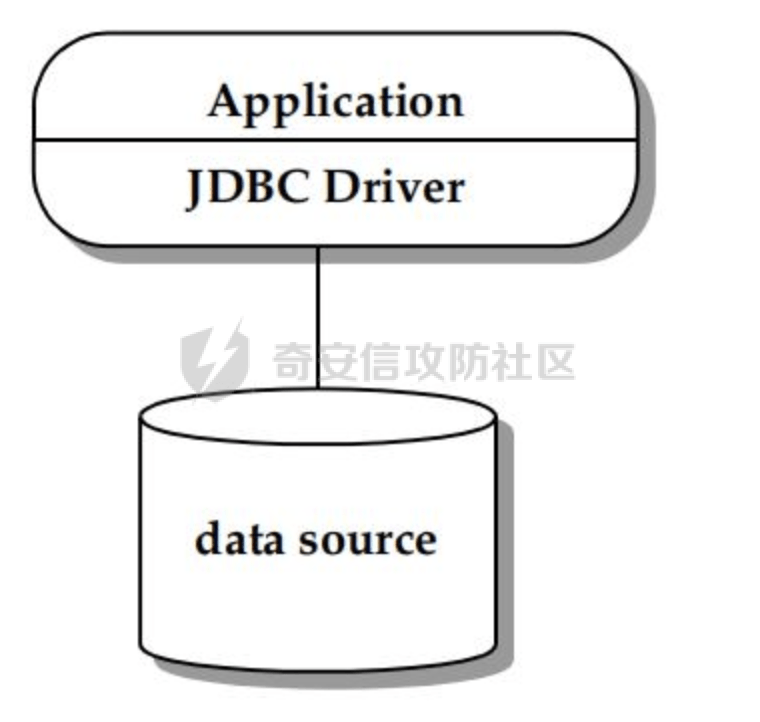

# 0x01 常见防护方法

可以使用 jdbc 支持的数据库来构造连接需要使用的 jdbc 串，一般是如下的格式，主要是由数据库类型，连接地址还有额外的属性对组成：

```text
jdbc:<type>://<hosts|host:port>/<db><properties>
```

一般情况下，常见的防护主要是对**拼接到 jdbcUrl 中的相关字段进行格式校验。**

-   对 type 字段，主要是数据源类型，如果可以调用任意类型的数据源，就可以执行任意风险数据源对应的攻击方式，比如 jdbc:mysql 可以实现任意文件读取、RCE、jdbc:postgresql 可以实现任意文件写、RCE 等。一般情况下会使用黑白名单限制数据源的连接。

可以看到 JDBC 支持相关数据库的有这些：[https://www.oracle.com/java/technologies/industry-support.html](https://www.oracle.com/java/technologies/industry-support.html)

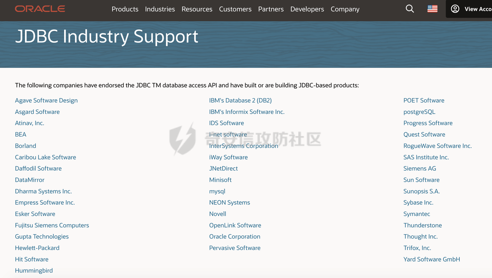

-   对于 host 和 port 以及 db 字段，一般会进行输入格式的限制，例如 port 限制只允许数字，host 字段限制只允许大小写字母、数字、中文、点 (.)，短横线 (-)，斜杠 (/) 冒号 (:) 等。
-   对于连接时设置的属性 properties，一般情况下会对存在漏洞的数据源的黑名单属性校验，不同数据源的恶意连接属性（property）不同，需要不断维护对应的黑名单，避免可能的字段校验缺失导致可控 jdbcUrl 进而绕过。以 mysql 为例，例如类似的属性配置会导致对应的风险：

```TypeScript
/**
     * The sensitive param may lead the attack.
     */
    private static final Map SENSITIVE_REPLACE_PARAM_MAP = new HashMap() {

        {
            put("autoDeserialize", "false");
            put("allowLoadLocalInfile", "false");
            put("allowUrlInLocalInfile", "false");
        }
    };

    private static final Set SENSITIVE_REMOVE_PARAM_MAP = new HashSet() {

        {
            add("allowLoadLocalInfileInPath");
        }
    };
```

# 0x02 绕过方式

在简单了解了常见的防护方法后，下面以 MySQL 驱动里的一些绕过姿势为例进行讨论，对于其他类型的数据库源，同样存在类似的思路和手法。

## 2.1 使用特定的值替换

mysql JDBC 中包含⼀个危险的扩展参数：autoDeserialize。这个参数配置为 true 时，JDBC 客户端将会⾃动反序列化服务端返回的 BLOB 类型字段。一般情况下，会获取并校验提交的配置参数以及相关的值，避免设置了不安全的参数。例如会**检测 autoDeserialize 参数是否设置成了 true**。

实际上可以通过 yes 关键字进行绕过，在 mysql-connector-java 中，yes 跟 true 实际上是等价的。这里以几个版本为例，查看具体的源码实现：

-   **mysql-connector-java-8.0.12**

在 com.mysql.cj.conf.BooleanPropertyDefinition 的 AllowableValue 枚举类中可以看到，设置 TRUE 和设置 YES 效果是⼀样的：

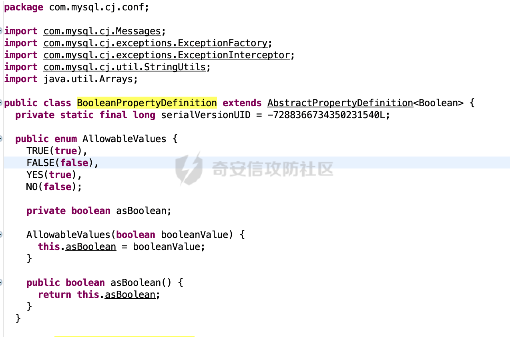

-   **mysql-connector-java-6.0.5**

com.mysql.cj.core.conf.BooleanPropertyDefinition#getAllowableValues方法中，同样可以看到设置TRUE和设置YES效果是⼀样的：

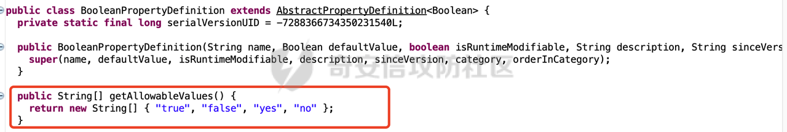

-   **mysql-connector-java-5.1.1**

在BooleanConnectionProperty#getAllowableValues中，同样可以看到设置TRUE和设置YES效果是⼀样的：

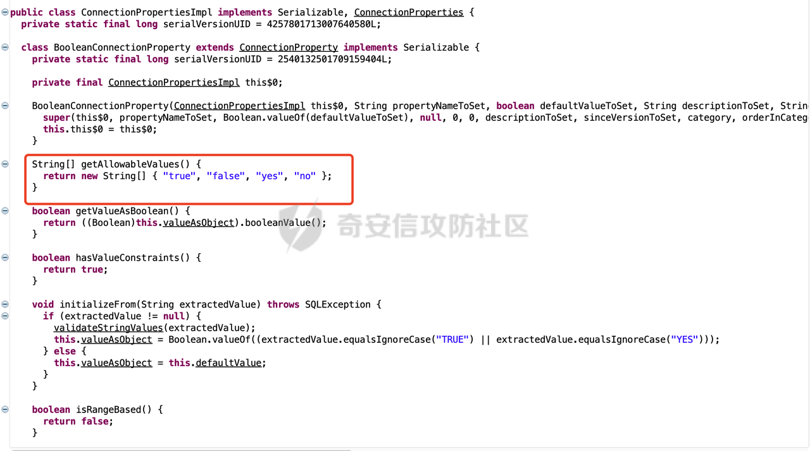

综上，也就是说可以通过设置`autoDeserialize=yes`来尝试绕过一些现有的属性值检查防护措施。

## 2.2 大小写绕过

从前面的枚举类可以看到，mysql-connector-java-8.0.12 在解析时还会统一转换成大写：

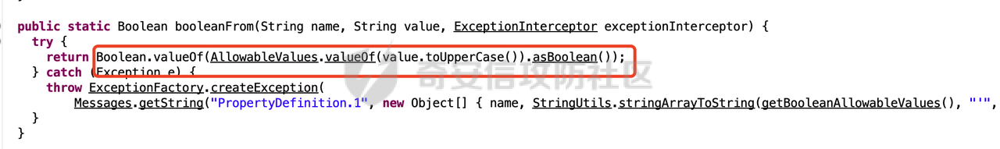

其他版本在值判断时，通过 equalsIgnoreCase() 方法**将字符串与指定的另一个字符串进行比较，不考虑大小写**:

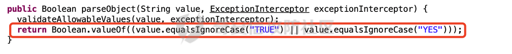

也就是说，对于`autoDeserialize=true`，可以通过将对应恶意属性的 value 进行大小写转换来尝试绕过一些现有的属性值检查防护措施。

## 2.3 URL 编码绕过

除了上面的方法外，还可以考虑使用 URL 编码进行绕过。以 mysql-connector-java-8.0.12 为例，查看 8.0.x 版本的解析过程。

主要是加载过程，在 getConnection ⽅法中，会遍历 registeredDrivers 变量的值，⾥⾯存放着注册过的驱动，然后通过 DriverInfo 对象获取对应驱动，并调⽤其 connet ⽅法进⾏连接：

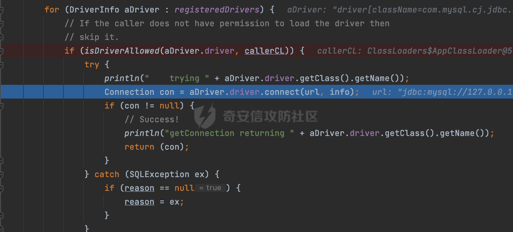

在 connect 方法中，会对传入的 jdbcUrl 进行解析：

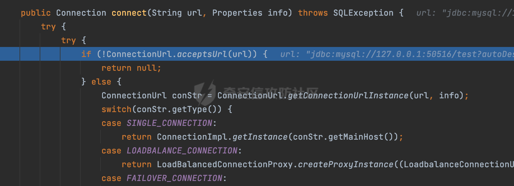

ConnectionUrl.acceptsUrl(url)⽅法判断url是否合法，调用com.mysql.cj.conf.ConnectionUrlParser#isConnectionStringSupported方法判断协议是否支持：

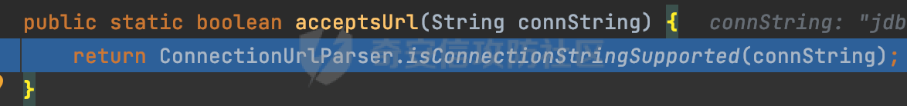

在 isConnectionStringSupported 方法中，主要通过正则捕获对应的协议，然后进行 URL 解码后进行匹配：

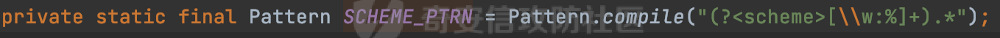

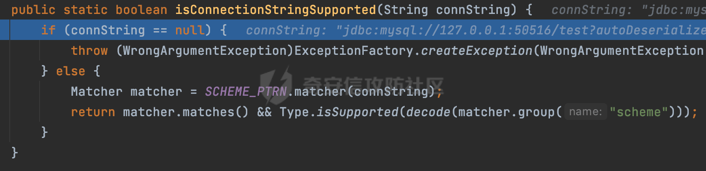

如果url合法，则调用ConnectionUrl.getConnectionUrlInstance⽅法，这里会调用ConnectionUrlParser#parseConnectionString方法对传入的url进行进一步的处理：

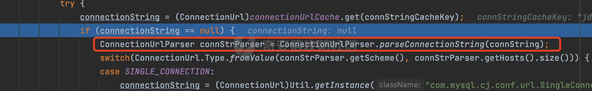

首先会再次判断 url 是否合法，然后再调用 parseConnectionString 方法：

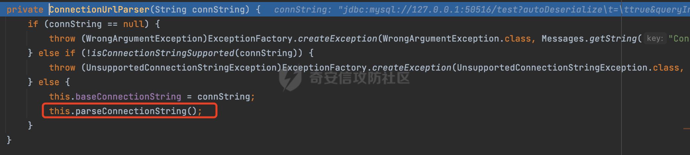

在 parseConnectionString 方法中，主要通过正则捕获对应的内容，可以看到除了协议部分以外，path 部分同样进行了 URL 解码操作：

```java
private static final Pattern CONNECTION_STRING_PTRN = Pattern.compile("(?[\\w:%]+)\\s*(?://(?[^/?#]*))?\\s*(?:/(?!\\s*/)(?[^?#]*))?(?:\\?(?!\\s*\\?)(?[^#]*))?(?:\\s*#(?.*))?");
```

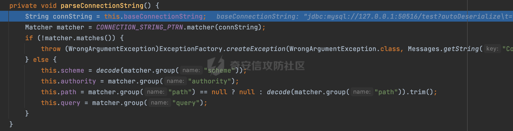

解析完成后，会调⽤ Util.getInstance ⽅法，这里实例化了⼀个 SingleConnettionUrl 对象：

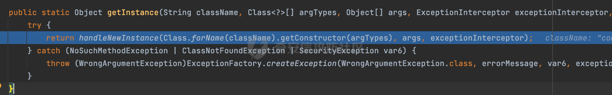

这里会调用对应对象的构造方法：

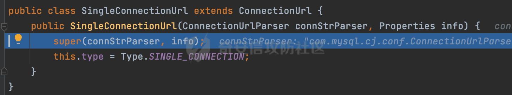

在其父类的构造方法中，会调⽤ collectProperties ⽅法，从字面上看应该是进行 url 中的参数收集：

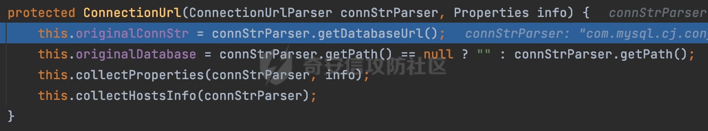

最终会调用com.mysql.cj.conf.ConnectionUrlParser#processKeyValuePattern方法解析query为键值对，并通过HashMap对象进⾏封装，可以看到这里对参数的值以及参数都进行了url解码操作：

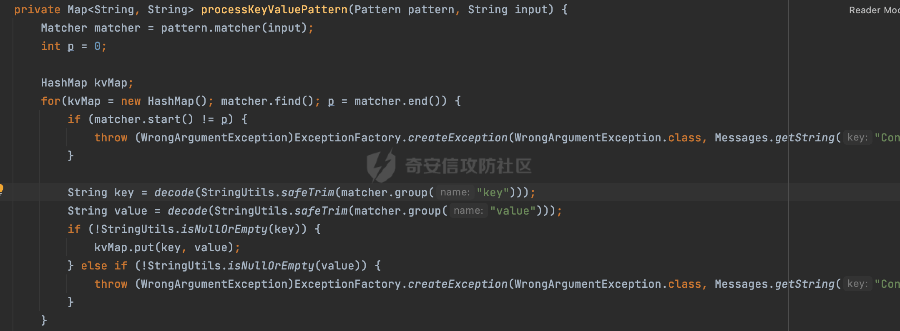

后续解析完传入的 url 并建立连接后，即可完成对应的 sql 交互。

通过上述分析，**对 8.0.x 版本来说**，可以看到**在解析过程中，对协议、path 以及请求的参数对都进行了 URL 解码操作**。也就是说，对于`autoDeserialize=true`，可以考虑进行 URL 编码`%61%75%74%6f%44%65%73%65%72%69%61%6c%69%7a%65=%74%72%75%65`，来尝试绕过现有的属性值检查防护措施。

但是在低版本 5.1.x 版本，仅仅只对参数值进行了解码操作：

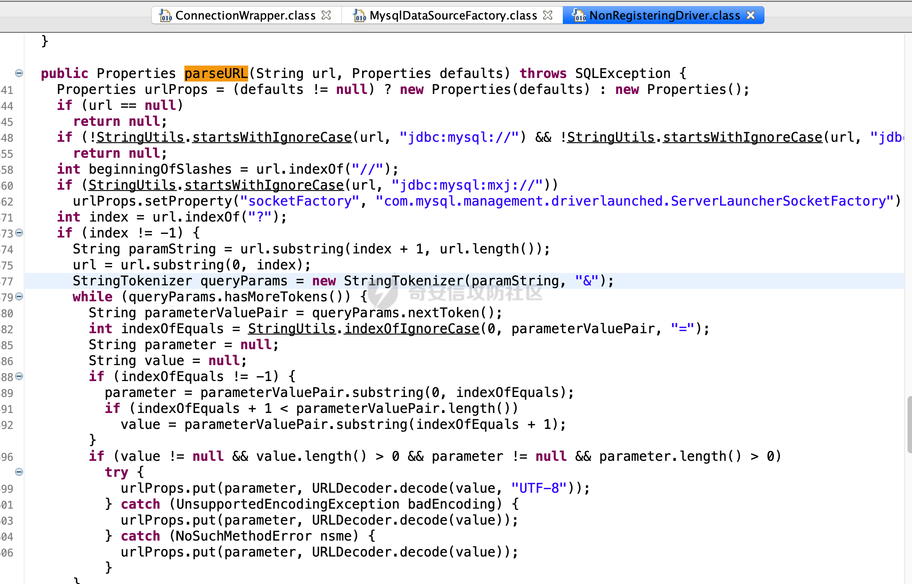

## 2.4 头尾空白符绕过

前面提到了，对于通过属性值检查的防护措施，可以通过大小写/URL 编码的方式进行绕过，如果在实际防护时进行按照标准 URL 处理字符串进行自动解码并统一大小写，然后再过滤 yes 和 true 选项。那这样是不是就万无一失了呢？


实际上很多基于属性值检查的防护措施都是在获取到 jdbcUrl 后，进行 URL 解码以及统一大小写的操作后，提取到请求参数部分，然后通过&进行分隔，提取到对应的 key-value 后再通过黑名单的方式进行匹配。例如下面的代码：

```Java
private static boolean check(String jdbcUrl){
    try {
        Map params = new HashMap&lt;&gt;();
        String query = jdbcUrl.split("\\?")[1];
        if (query != null) {
            String[] pairs = query.split("&amp;");
            for (String pair : pairs) {
                String[] keyValue = pair.split("=");
                String key = keyValue[0];
                String value = keyValue.length &gt; 1 ? keyValue[1] : "";
                params.put(key, value);
            }
        }

        for (Map.Entry p: params.entrySet()){
            if (p.getKey().equals("autoDeserialize")) {
                if(p.getValue().equals("true")||p.getValue().equals("yes")){
                    return false;
                }
            }
        }

        return true;
    } catch (Exception e) {
        e.printStackTrace();
        return false;
    }
}
```

上述代码通过 split 获取到参数部分，然后通过&以及=获取请求的 key-value 并封装在 Map 中，然后遍历获取到的 Map 进行黑名单的检测，如果发现请求参数存在 autoDeserialize 并且值为 true/yes 时认为存在风险，返回 false。

实际上只需要通过`autoDeserialize = true`结合头尾空白符的方法即可绕过上述的安全检查了，此时获取到的 key 和 value 多了额外的空格，并不在黑名单范围内。前提是 mysql-connector-java 在解析参数时对空白符号进行了处理。

结合前面mysql-connector-java-8.0.12的解析过程，在com.mysql.cj.conf.ConnectionUrlParser#processKeyValuePattern方法解析query为键值对时，除了对参数的值以及参数都进行了url解码操作以外，在此之前调用了StringUtils#safeTrim方法进行处理：


这里对通过 trim() 方法去除了字符串两端的空白字符。这些空白字符包括空格（Space）、制表符（Tab）、换行符（Line Feed）、回车符（Carriage Return）等：

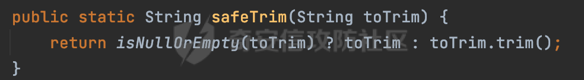

也就是说前面**通过`autoDeserialize = true`结合头尾空白符绕过的猜想是可行的**。（5.1.x 版本并没有对空白符进行额外的处理）

Apache inlong 也有过类似的绕过 case，对应 CVE 编号 CVE-2023-46227（Apache inlong JDBC URL 反序列化漏洞），在受影响版本中，由于只对用户输入的 jdbc url 参数中的空格做了过滤，没有对其他空白字符过滤。具备 InLong Web 端登陆权限的攻击者可以使用\\t绕过对 jdbc url 中 autoDeserialize、allowUrlInLocalInfile、allowLoadLocalInfileInPath 参数的检测，进而在 MySQL 客户端造成任意代码执行、任意文件读取等危害。

简单看下对应的代码，防护方式主要是定义了对应的属性黑名单进行检查：

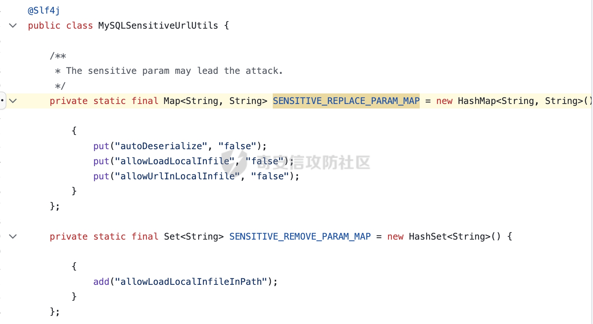

可以看到在受影响版本中，仅仅替换了 jdbcUrl 中的空格，而修复版本则对空白字符进行了彻底过滤，然后再进行 key-value 的获取以及安全检查：

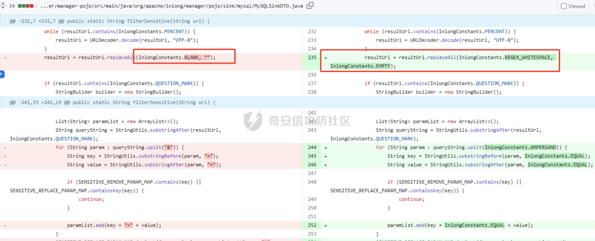

InlongConstants.REGEX\_WHITESPACE 是定义的常量，\\\\s 是正则表达式，含义是匹配全部空白字符：

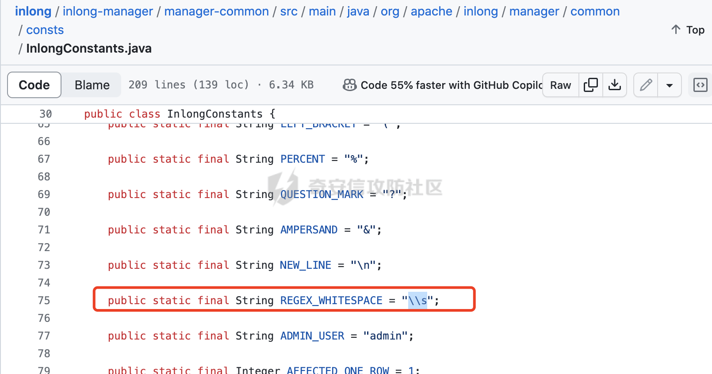

此外，这里还有通过 java.net.URI 对 jdbcUrl 进行封装，然后获取 query 进行解析的：

```Java
URI uri = new URI(jdbcUrl.replace("jdbc:", ""));
String query = uri.getQuery();
```

这样做的好处是在解析时会判断是否存在非法字符，能从一定程度避免无关字符的干扰，避免潜在的绕过风险：

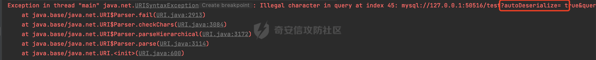

## 2.5 使用注释符

除了通过属性值检查以外，某些修复方式可能会通过在 jdbcUrl 尾部强行添加 autoDeserialize=false通过覆盖变量进行处理,这样即使攻击者在连接url中设置了autoDeserialize参数也会被覆盖掉。.结合前面mysql-connector-java-8.0.12的解析过程，会调用ConnectionUrlParser#parseConnectionString方法对传入的url进行进一步的处理，而在parseConnectionString方法中，主要通过正则捕获对应的内容：

```java
private static final Pattern CONNECTION_STRING_PTRN = Pattern.compile("(?[\\w:%]+)\\s*(?://(?[^/?#]*))?\\s*(?:/(?!\\s*/)(?[^?#]*))?(?:\\?(?!\\s*\\?)(?[^#]*))?(?:\\s*#(?.*))?");
```

在匹配 URL 的查询参数部分时，使用 `(?\[^#\]\*)` 匹配查询参数，这里#充当了注释符的作用，在获取 query 时会将#后面的注释部分去掉。

也就是说，**8.0.x 版本实际上是支持通过注释符#来注释掉后面的内容的**。那么就可以通过#注释掉之后拼接的内容，从而覆盖后面想要赋值的变量。而 5.1.x 版本是不支持注释符的。

## 2.6 注入拼接

除了jdbcUrl直接可控的场景以外，用户可控还可能是host、用户名、密码、数据库名以及自定义的连接字符串。这一系列输入可能通过StringBuilder#append进行拼接，最终合并成一个完成的jdbcUrl进行连接:

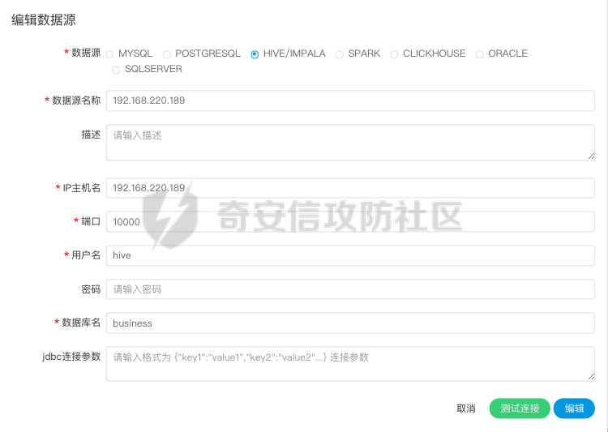

类似上面的例子，jdbc连接参数可能已经做了严格的过滤了，但是类似user和password字段也是用户可控的，如果这两个字段没有过滤，且一系列用户输入可能通过StringBuilder#append进行拼接。那么就可以在用户名密码字段尝试注入恶意参数拼接到最终的jdbcUrl中，完成利用。

PS：**user 和 password 若以 DriverManager.getConnection(url, user, password) 的形式传入，则不受影响**

# 0x03 其他

前面讨论了一些常见防护方法的绕过，简单总结下在实际修复的时候需要考虑的问题：

1.  升级数据源组件至安全版本，例如通过将 mysql-connector/j 升级到 8.0.21 来解决该问题，在 mysql-connector/j 8.0.21 的`ServerStatusDiffInterceptor#populateMapWithSessionStatusValues`中不再使用 getObject 而是使用 getString。
2.  使用支持同一数据源但不存在漏洞的组件进行替换，比如使用 mariadb-java-client 替换 mysql-connector-java，都支持 mysql 等的连接。
3.  在进行属性值检查防护措施时，需要考虑归一化的问题，例如大小写、URL 编码、额外空白符以及注释符#的问题。同时，不同数据源的恶意连接属性（property）不同，需要长期维护对应的黑名单内容。
4.  类似 userName、password 字段内容不要包含类似等于 (=) 敏感字符，进行类似黑名单校验。同样的，对 host 等字段同样也需要进行检查，例如 port 应该限制输入，只允许数字。
5.  限制支持的数据源，若对应的数据源都非恶意，则可以省略其他字段的校验，只需保证数据源 type 是符合预期的。
