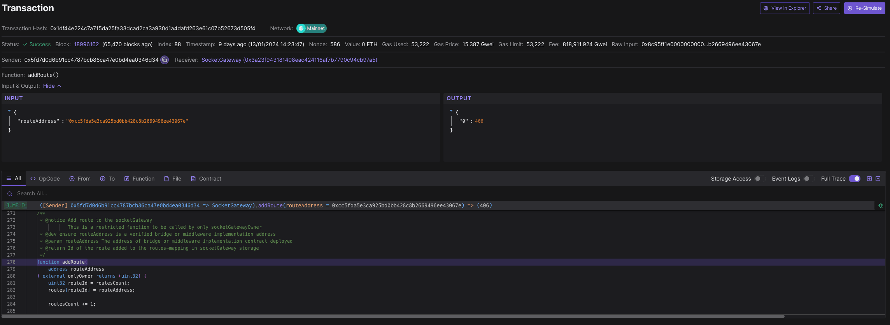
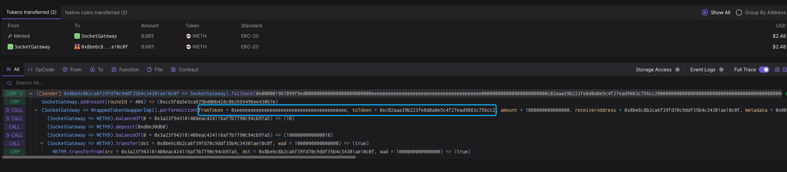
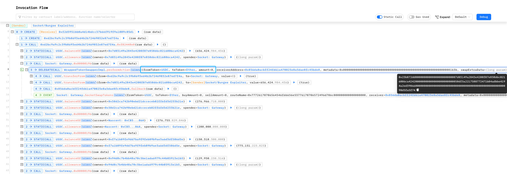

# 奇安信攻防社区-Socket Gateway - 代币交换逻辑漏洞

### Socket Gateway - 代币交换逻辑漏洞

2024 年 1 月 17 日，Socket Gateway 由于 performAction 函数中代码逻辑出现错误，导致大约 330 万美元的损失

## 事件概述

2024 年 1 月 17 日，Socket Gateway 由于 performAction 函数中代码逻辑出现错误，导致大约 330 万美元的损失

## 相关地址

攻击者地址：0x50DF5a2217588772471B84aDBbe4194A2Ed39066

被攻击合约地址：0x3a23F943181408EAC424116Af7b7790c94Cb97a5

漏洞合约地址：0xCC5fDA5e3cA925bd0bb428C8b2669496eE43067e

攻击交易：0xc6c3331fa8c2d30e1ef208424c08c039a89e510df2fb6ae31e5aa40722e28fd6

攻击合约地址：0xf2D5951bB0A4d14BdcC37b66f919f9A1009C05d1

## 攻击过程

1.攻击者创建 2 个攻击合约


2.通过漏洞分别转移用户的 USDC, USDT, WETH, WBTC, DAI，MATIC


3.将获取的代币全部转换为 ETH，获利约 330 万美金


## 攻击分析

Socket Getway 的 Admin 在 1 月 13 日执行了函数 addRoute 添加了新的 routeAddress




部署后进行了 ETH 与 WETH 的代币交换测试，漏洞出现在这个新部署的合约中的 performAction 函数中


在获利 USDC 的攻击交易 0xc6c3331fa8c2d30e1ef208424c08c039a89e510df2fb6ae31e5aa40722e28fd6 中

攻击者首先获取受害者的 USDC 的余额和 Socket Getway 中的批准数量


然后通过控制 swapExtraData 参数 操纵 calldata 调用 token 的 transferfrom 函数 将受批准的代币转移

```php
(bool success, ) = fromToken.call(swapExtraData);
```


```php
function performAction(
        address fromToken,
        address toToken,
        uint256 amount,
        address receiverAddress,
        bytes32 metadata,
        bytes calldata swapExtraData
    ) external payable override returns (uint256) {
        uint256 _initialBalanceTokenOut;
        uint256 _finalBalanceTokenOut;

        // Swap Native to Wrapped Token
        if (fromToken == NATIVE_TOKEN_ADDRESS) {
            _initialBalanceTokenOut = ERC20(toToken).balanceOf(socketGateway);
            (bool success, ) = toToken.call{value: amount}(swapExtraData);

            if (!success) {
                revert SwapFailed();
            }

            _finalBalanceTokenOut = ERC20(toToken).balanceOf(socketGateway);

            require(
                (_finalBalanceTokenOut - _initialBalanceTokenOut) == amount,
                "Invalid wrapper contract"
            );

            // Send weth to user
            ERC20(toToken).transfer(receiverAddress, amount);
        } else {
            _initialBalanceTokenOut = address(socketGateway).balance;

            // Swap Wrapped Token To Native Token
            ERC20(fromToken).safeTransferFrom(
                msg.sender,
                socketGateway,
                amount
            );

            (bool success, ) = fromToken.call(swapExtraData);

            if (!success) {
                revert SwapFailed();
            }

            _finalBalanceTokenOut = address(socketGateway).balance;

            require(
                (_finalBalanceTokenOut - _initialBalanceTokenOut) == amount,
                "Invalid wrapper contract"
            );

            // send ETH to the user
            payable(receiverAddress).transfer(amount);
        }

        emit SocketSwapTokens(
            fromToken,
            toToken,
            amount,
            amount,
            Identifier,
            receiverAddress,
            metadata
        );

        return amount;
    }
```

代码功能主要是用于用户 WETH 与 ETH 的转换，虽然没有检测 fromToken 与 toToken 的地址，但由于检查了函数执行前后的代币数量，所以逻辑上是限定了传入 WETH 地址


例如该功能的一笔正常交易，fromToken 与 toToken 应为 ETH 与 WETH 地址才会成功交易，否则无法通过代币数量检测

```php
require(
          (_finalBalanceTokenOut - _initialBalanceTokenOut) == amount,
          "Invalid wrapper contract"
);
```

但如果传入 amout 参数为 0 时，就会导致 (\_finalBalanceTokenOut - \_initialBalanceTokenOut) == amount 恒通过，导致代币数量检测失效，这里再通过控制 fromToken 和 swapExtraData 就可以将其他用户批准的代币转移且无需转入 ETH



