# 奇安信攻防社区-Spring Data REST 代码审计浅析

### Spring Data REST 代码审计浅析

Spring Data REST 是建立在 Data Repository 之上的，它能直接把 resository 以 HATEOAS 风格暴露成 Web 服务，而不需要再手写 Controller 层。客户端可以轻松查询并调用存储库本身暴露出来的接口。浅析其中的代码审计技巧。

# 0x00 前言

Springboot + Spring MVC 大大简化了 Web 应用的 RESTful 开发，而 Spring Data REST 更简单。Spring Data REST 是建立在 Data Repository 之上的，它能直接把 resository 以 HATEOAS 风格暴露成 Web 服务，而不需要再手写 Controller 层。客户端可以轻松查询并调用存储库本身暴露出来的接口。

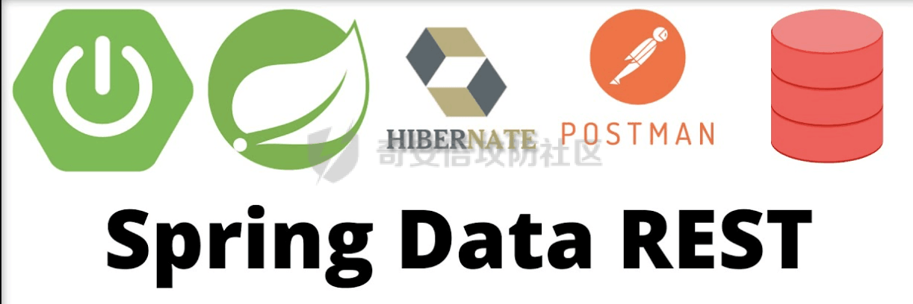

# 0x01 请求路径组成

首先是 Spring Data REST 的根 URL 属性 basePath。

默认情况下，Spring Data REST 在根 URI`/`处提供 REST 资源。可以通过`spring.data.rest.basePath` 属性进行修改该属性用于设置仓库资源路径的基本路径。

通过使用如下配置，所有的路由都会以 `/api` 为基础构建，包括仓库路径、实体资源路径、查询路径等：

```Java
spring.data.rest.basePath=/api
```

当然也可以通过通过注册 RepositoryRestConfigurer（或扩展 RepositoryRestConfigurerAdapter(高版本已经弃用)）来自定义配置，例如下面的例子：

```Java
@Configuration
class CustomRestMvcConfiguration {

  @Bean
  public RepositoryRestConfigurer repositoryRestConfigurer() {

    return new RepositoryRestConfigurerAdapter() {

      @Override
      public void configureRepositoryRestConfiguration(RepositoryRestConfiguration config) {
        configuration.setBasePath("/api")
      }
    };
  }
}
```

然后就是 Sping Data REST 生成的 rest 接口，在进行路由处理时会使用**DelegatingHandlerMapping，然后委托给 RepositoryRestHandlerMapping 和 BasePathAwareHandlerMapping 处理。**

主要是处理@RepositoryRestController 和@BasePathAwareController 对应的类：

-   @RepositoryRestController
    
    -   RepositoryController
    -   RepositoryEntityController
    -   RepositoryPropertyReferenceController
    -   RepositorySearchController
-   @BasePathAwareController
    
    -   ProfileController
    -   AlpsController
    -   HalExplorer

以下面的例子为例，生成的 rest 接口都会由上面几个 Controller 进行处理，简单看看 Spring Data REST 的路径组成：

```Java
@RepositoryRestResource(path = "tenantPath")
public interface TenantRepository extends CrudRepository<Tenant, Long> {
    Page<Tenant> findAllByNameContaining(String name, Pageable page);

    Page<Tenant> findAllByIdCardContaining(String idCard, Pageable page);

    @RestResource(path = "mobile",rel = "mobile")
    Tenant findFirstByMobile(String mobile);

    @RestResource(exported = false)
    Tenant findFirstByIdCard(String idCard);

}
```

-   **仓库路径（Repository Path）**：
    
    -   仓库路径是仓库资源路径的子路径，表示单个仓库的根路径。
    -   例如，如果有一个名为 `TenantRepository` 的仓库，其路径可能为 `/tenants`（默认情况下）或根据@RepositoryRestResource 注解的配置路径为`tenantPath`
-   **实体资源路径（Entity Resource Path）**：
    
    -   实体资源路径是仓库路径的子路径，表示具体实体资源的路径。
    -   例如，`Tenant` 实体的路径可能是 `/tenants/1`
-   **查询路径（Search Path）**：
    
    -   用于执行仓库中定义的查询。
    -   例如，`findAllByNameContaining` 查询的路径可能是 `/tenants/search/findAllByNameContaining` ,也可以通过注解@RestResource 进行定义。
-   **关系路径（Association Path）**：
    
    -   用于导航到实体之间的关系。
    -   例如，如果 `Tenant` 与 `Address` 有关联关系，可能存在 `/tenants/1/address` 的关系路径。
-   **Profile 路径**：
    
    -   `/profile` 用于查看服务器支持的功能和约束信息。
    -   例如，`/profile` 提供有关 Spring Data REST 服务器配置和功能的元信息。

# 0x02 请求解析过程

Spring Data REST 本身是一个 Spring MVC 的应用。以 spring-data-rest-webmvc-3.7.18 以及下面的 Repository 为例：

```Java
@RepositoryRestResource(path = "tenantPath")
public interface TenantRepository extends CrudRepository<Tenant, Long> {

    Page<Tenant> findAllByIdCardContaining(String idCard, Pageable page)

}
```

当请求/tenantPath/search/findAllByIdCardContaining 时，查看具体的请求解析过程：

当接收到请求后，跟 SpringWeb 类似，Servlet 容器会调用 DispatcherServlet 的 service 方法（方法的实现在其父类 FrameworkServlet 中定义）：

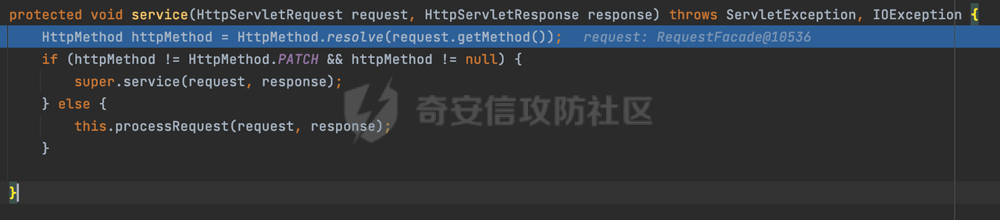

前面的流程跟 SpringWeb 类似，经过一系列处理后，会在 getHandler 方法中，按顺序循环调用 HandlerMapping 的 getHandler 方法：

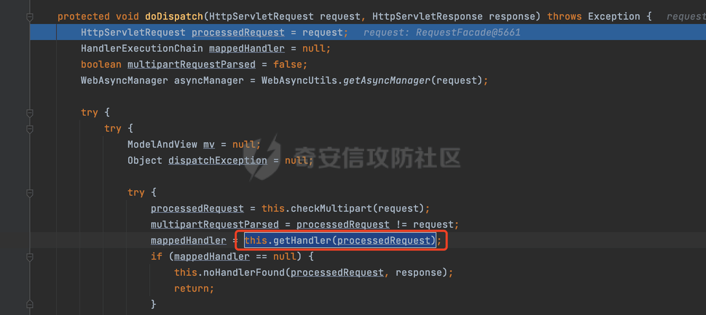

这里不再使用 RequestMappingHandlerMapping，会使用**DelegatingHandlerMapping，然后委托给 RepositoryRestHandlerMapping 和 BasePathAwareHandlerMapping 处理**：

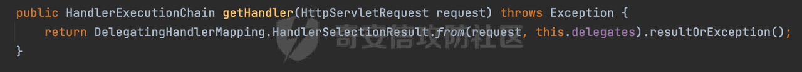

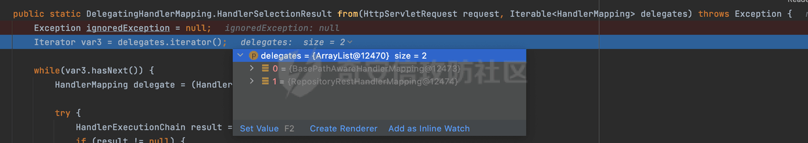

以RepositoryRestHandlerMapping为例，从org.springframework.data.rest.webmvc.RepositoryRestHandlerMapping#isHandlerInternal方法可以知道，主要是处理RepositoryRestController注解类：

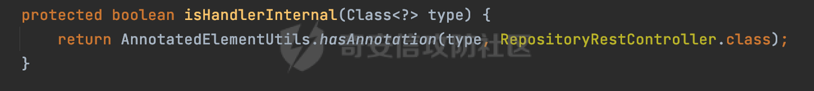

首先在RepositoryRestHandlerMapping#getHandler方法中通过getHandlerInternal获取handler构建HandlerExecutionChain并返回：

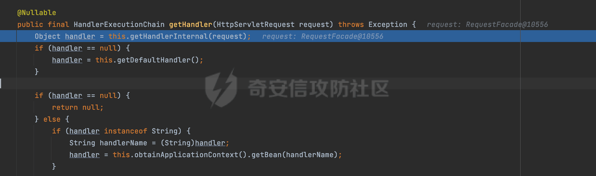

getHandlerInternal方法会调用org.springframework.web.servlet.handler.AbstractHandlerMethodMapping#getHandlerInternal从request对象中获取请求的path并根据path找到handlerMethod：

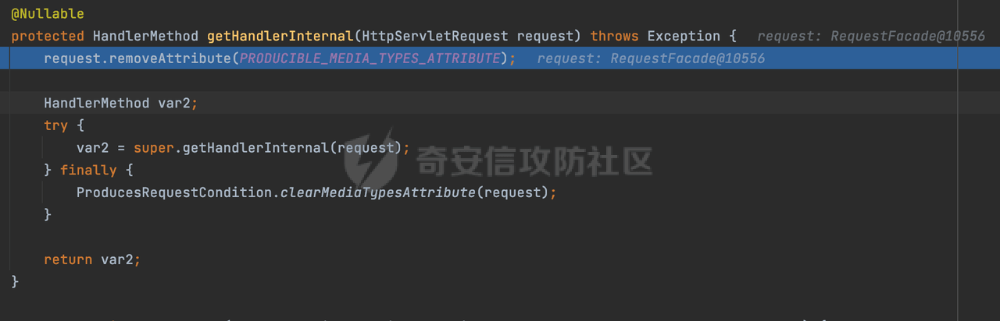

这里跟 SpringWeb 类似，在 initLookupPath 方法中，主要用于初始化请求映射的路径，这里会根据是否使用 PathPattern 解析器来调用**UrlPathHelper**类进行不同程度路径的处理（具体可以参考[https://forum.butian.net/share/2214）](https://forum.butian.net/share/2214%EF%BC%89) ：

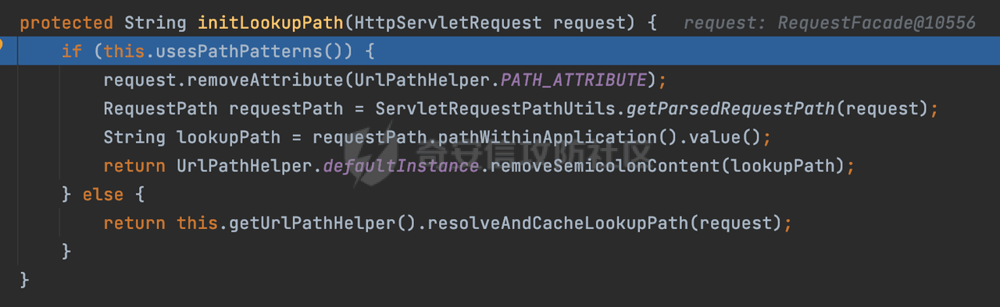

获取到路径后，调用RepositoryRestHandlerMapping#lookupHandlerMethod方法，首先调用父类org.springframework.data.rest.webmvc.BasePathAwareHandlerMapping#lookupHandlerMethod方法进行处理：

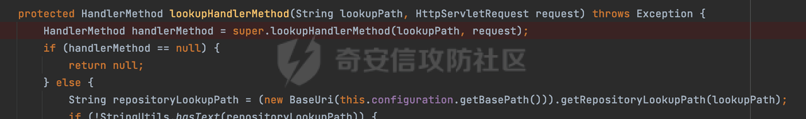

在BasePathAwareHandlerMapping#lookupHandlerMethod方法中，首先从请求头中获取`Accept`的值：

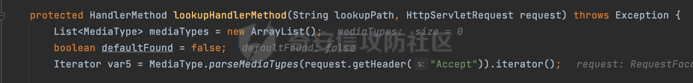

对获取到的值进行处理，将配置中设置的默认媒体类型加入媒体类型列表中，然后调用父类的RequestMappingHandlerMapping#lookupHandlerMethod方法进行进一步处理，跟SpringWeb类似，首先直接根据路径获取对应的Mapping，获取不到的话调用addMatchingMappings遍历所有的ReuqestMappingInfo对象并进行匹配：

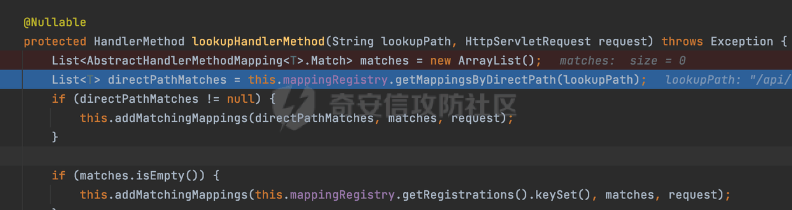

例如当前的 ReuqestMappingInfo 对象如下：

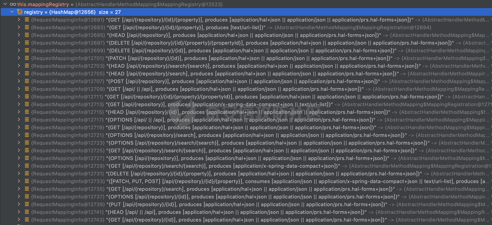

在 addMatchingMappings 方法中，遍历识别到的 ReuqestMappingInfo 对象并进行匹配，跟 SpringWeb 类似，在 getMatchingCondition 中会根据不同版本调用不同的解析模式来匹配，高版本会使用 PathPattern 来进行 URL 匹配（**不同版本会有差异，在 2.6 之前，默认使用的是 AntPathMatcher**进行的字符串模式匹配）：

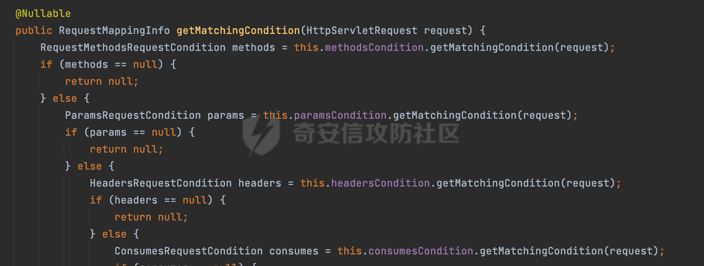

在获取到对应的handlerMethod后，回到RepositoryRestHandlerMapping#lookupHandlerMethod的逻辑，如果反悔的handlerMethod为null则直接返回，否则进一步调用BaseUril#getRepositoryLookupPath方法获取repositoryLookupPath：

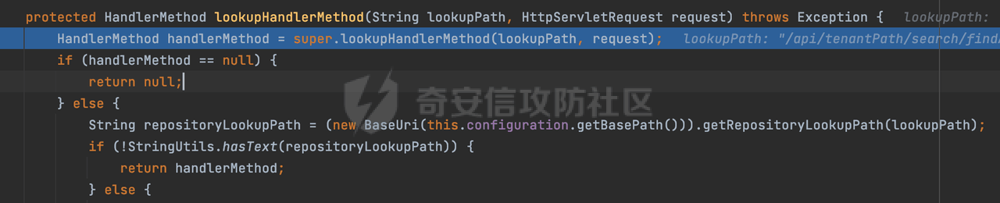

getRepositoryLookupPath 具体实现如下，这里主要是对 baseUri 进行处理，以得到最终的仓库查找路径，例如如果配置了`spring.data.rest.base-path=api`那么会剔除掉路径里的`/api`，这里还进行了一些额外的处理：

-   将重复的斜杠（//）替换为单个斜杠（/）
-   去除路径末尾的斜杠

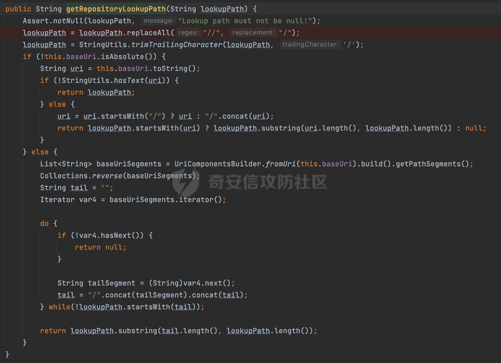

然后会调用 getRepositoryBasePath 方法：

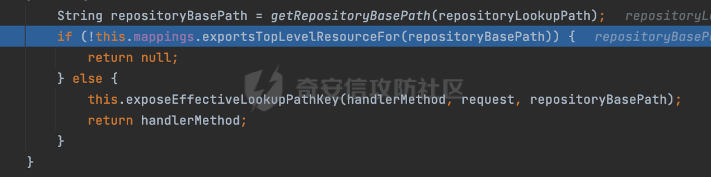

根据 repositoryLookupPath 是否以`/`来获取第二个目录斜杠的索引，这是因为，如果 repositoryLookupPath 以斜杠开头，第一个斜杠是路径的一部分，应该从第二个斜杠处分割，这个方法用于根据仓库查找路径提取仓库的基本路径，以便确定请求中要访问的具体仓库：

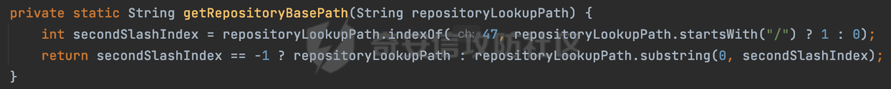

在获取到RepositoryBasePath后，调用org.springframework.data.rest.core.mapping.PersistentEntitiesResourceMappings#exportsTopLevelResourceFor方法,判断与metadata的path是否匹配：

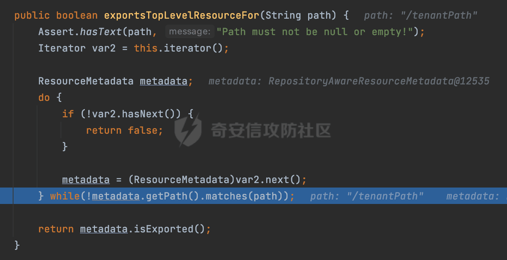

这里首先使用 Pattern.quote 对匹配的字符串进行转义，然后通过正则进行匹配：

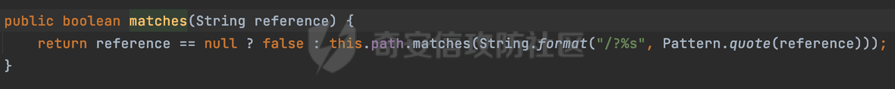

若匹配失败则返回 null，否则继续调用 exposeEffectiveLookupPathKey 方法进行处理：

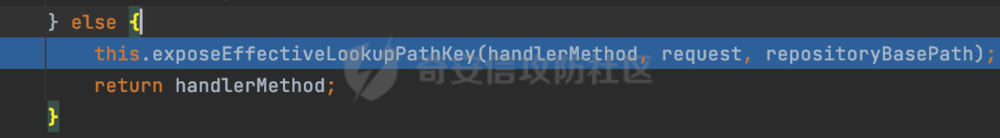

在 exposeEffectiveLookupPathKey 方法中，在获取到对应的 Pattern 后，例如`/api/{repository}/search/{search}`,会把`/{repository}`替换成前面获取到的 repositoryBasePath，然后创建路径模式解析器 PathPattern，并将其设置到请求属性中，以便后续处理中使用：

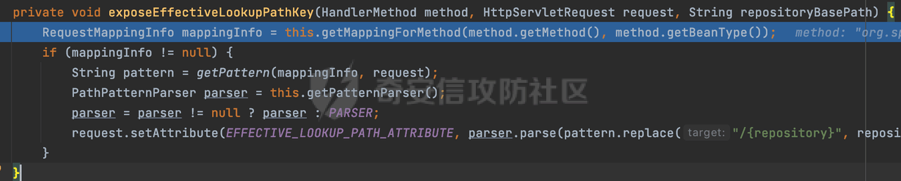

在获取到 url 和 Handler 映射关系后，就可以根据请求的 uri 来找到对应的 Controller 和 method，处理和响应请求。这里一般处理的是 RepositoryRestController 注解类。

上述案例最终映射到的 org.springframework.data.rest.webmvc.RepositorySearchController#executeSearch：

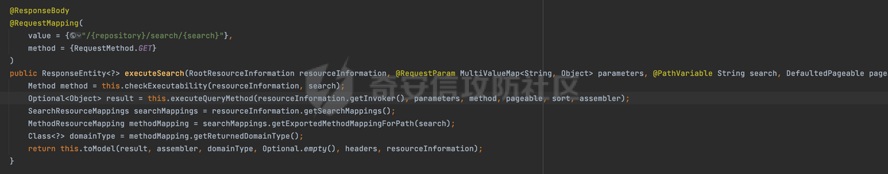

首先会调用 checkExecutability 处理，实际上就是匹配调用的方法，例如案例中的是 findAllByIdCardContaining：

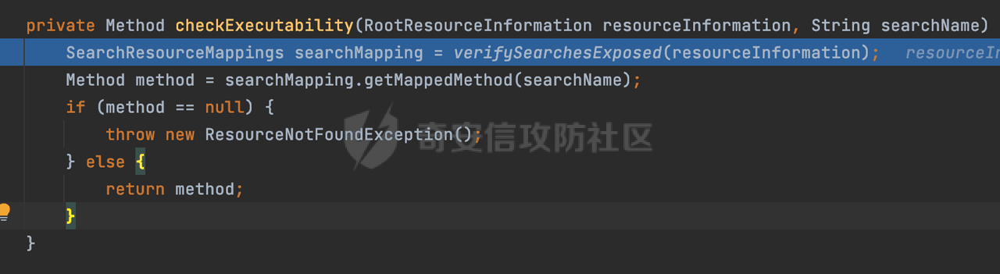

这里首先会获取所有的 SearchResourceMappings：

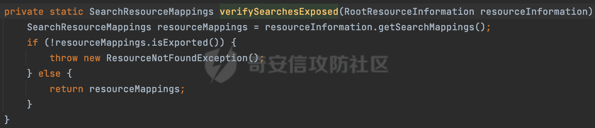

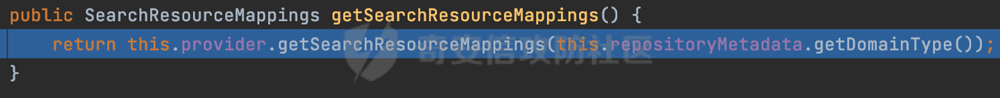

在获取时会对@RestResource 注解进行处理，这里可以自定义访问的 path：

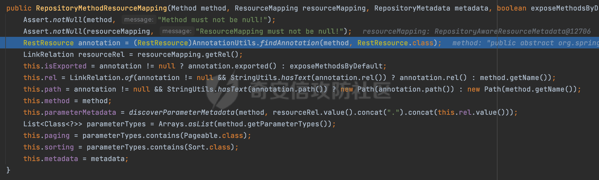

若当前的 resourceMappings 都是非暴露的，则会抛出异常，否则继续调用 searchMapping.getMappedMethod 进行匹配：

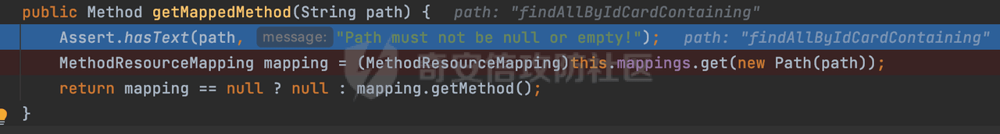

在匹配前会先将对应的 path 封装在 org.springframework.data.rest.core.Path 对象中，这里 cleanUp 默认是 true：

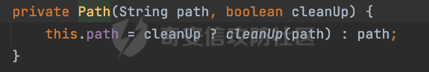

在 cleanUp 方法中，会对对输入的路径字符串进行清理和规范化处理：

-   使用 `path.trim().replaceAll(" ", "")` 去除路径两端的空格，并将路径中的空格替换为空字符串。
-   截取路径，并在需要时添加斜杠

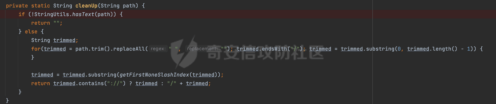

然后进行匹配，匹配到对应的 Method 后进行返回。回到 Controller 的逻辑调用 executeQueryMethod 方法进行处理，获取对应 Repository 方法操作的结果：

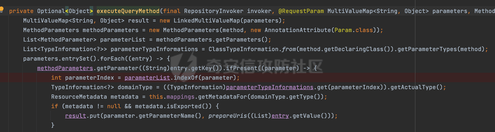

获取到 result 后，这里重新获取所有的 SearchResourceMappings，然后调用 getExportedMethodMappingForPath 进行处理，这里会重新对当前 path 进行匹配，检查对应的 mapping 是否暴露且对应的 path 是否匹配，匹配的方式跟之前一样，也是通过正则表达式对 Pattern.quote 转义后的字符串进行匹配：

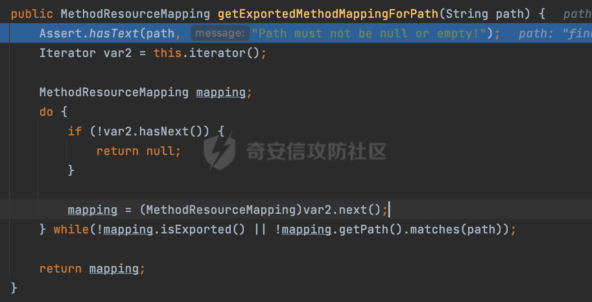

最后获取对应的返回值，完成对应的响应。以上是 Spring Data REST 简单的 search 请求解析过程。大致可以总结为，通过请求的 path，找到对应的 Repository 定义，然后通过 Repository 定义，使用对应的 RepositoryInvoker 并执行对应的方法。

## 2.1 与 SpringWeb 的区别

整体的调用过程与 SpringWeb 类似，都会通过 DispatchServlet 统一处理。但是不再使用 RequestMappingHandlerMapping，会使用**DelegatingHandlerMapping，然后委托给 RepositoryRestHandlerMapping 和 BasePathAwareHandlerMapping 处理。**

路径处理模式也是类似的，同样的会在 initLookupPath 方法中初始化请求映射的路径，并且根据是否使用 PathPattern 解析器来调用**UrlPathHelper**类进行不同程度路径的处理：


也就是说，类似 SpringWeb 中的一些变形后的 URL，在 Spring Data REST 同样可以处理。但是实际上还是会有一些区别。以上述分析的`/{repository}/search/{search}`请求过程为例。

在 SpringWeb 中，是可以对请求路径进行 URL 编码并且均可以正常解析的。但是对于类似 Spring Data REST 中的`/{repository}/search/{search}`接口，`{repository}`并不能进行 URL 编码处理：

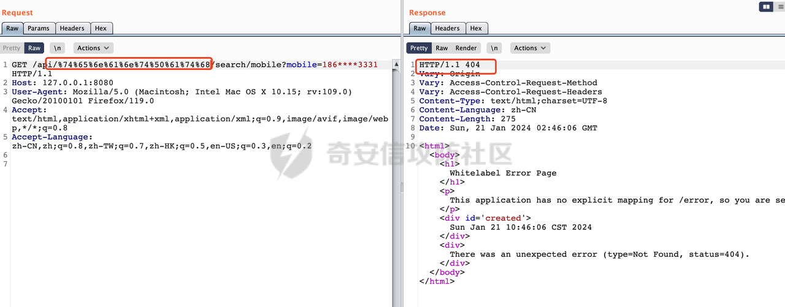

根据前面的分析，在获取到RepositoryBasePath后，调用org.springframework.data.rest.core.mapping.PersistentEntitiesResourceMappings#exportsTopLevelResourceFor方法,判断与metadata的path是否匹配：


这里首先使用 Pattern.quote 对匹配的字符串进行转义，然后通过正则进行匹配：


这里并不会进行 URL 解码处理，所以返回 404 status。

同理，类似`/{repository}/{id}`的访问也没办法解析编码后的`{repository}`：

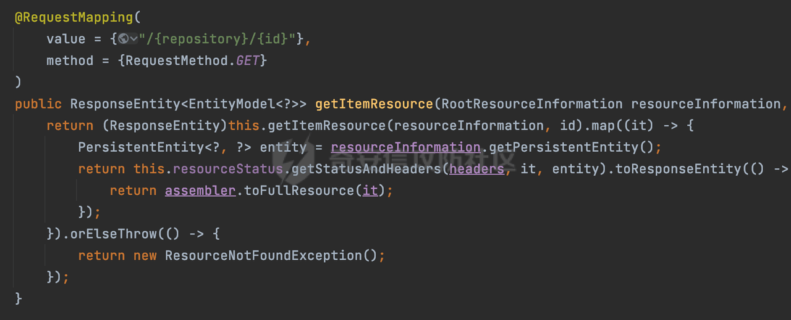

可以看到返回了 404 status：

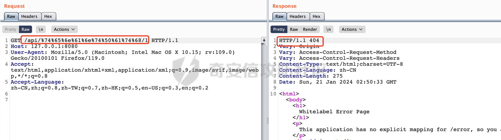

但是类似尾部额外的`/`,getRepositoryLookupPath 时会进行额外的剔除，所以跟 SpringWeb 一样，在匹配时也会支持尾部额外的`/`，同样可以正常解析。

# 0x03 潜在的安全风险

## 3.1 ALPS 文档信息泄漏

ALPS 是一种描述 RESTful 服务中资源和操作的元数据格式。在 SpringDataRest 中主要是为每个导出的存储库提供一个 ALPS 文档。它包含有关 RESTful 转换以及每个存储库的属性的信息（例如服务支持的资源、属性、关系以及相关操作的 ALPS 元数据）。

`org.springframework.data.rest.webmvc.alps.AlpsController` 是 Spring Data REST 中负责处理 Application-Level Profile Semantics (ALPS) 的 Controller 类：

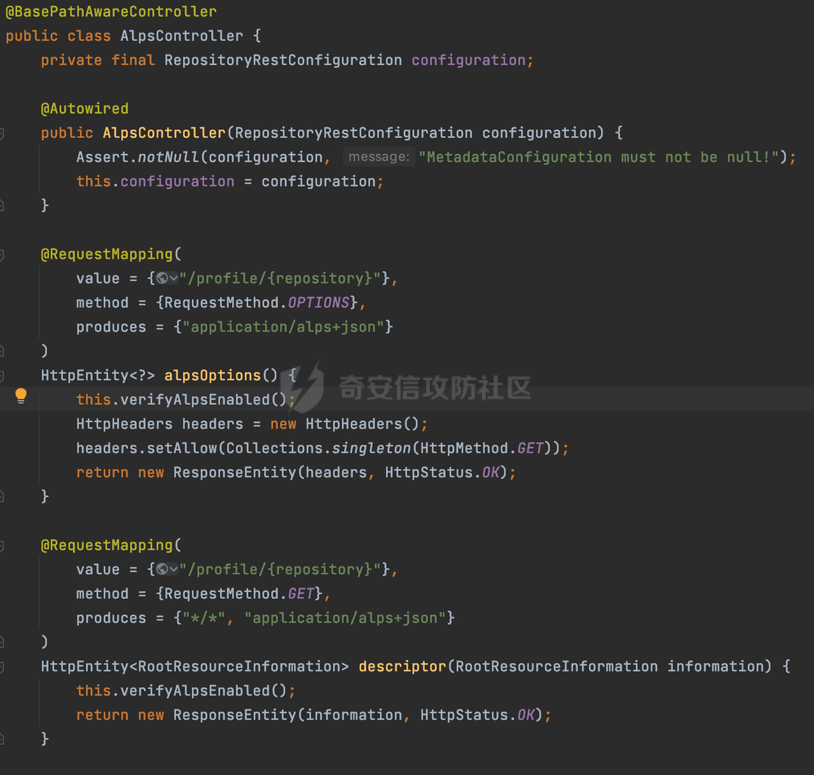

通过访问 `/profile` 路径，`AlpsController` 会提供 ALPS 文档，例如下面的例子：

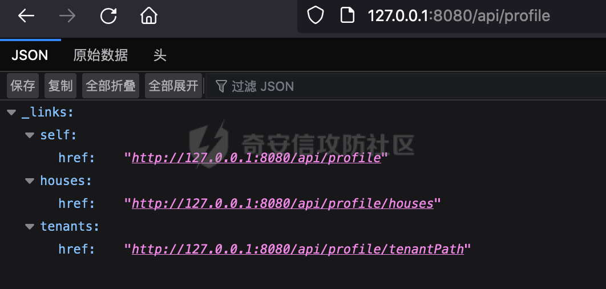

其中具体的文档包含了关于支持的资源、属性、关系和操作的信息：

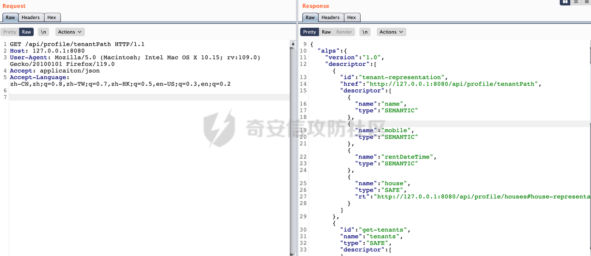

在某些情况下可能存在信息泄露的风险。

### 3.1.1 禁用 Alps

可以看到，是否启用 Alps 主要是通过 org.springframework.data.rest.core.config.MetadataConfiguration 的 alpsEnabled 属性来控制的：

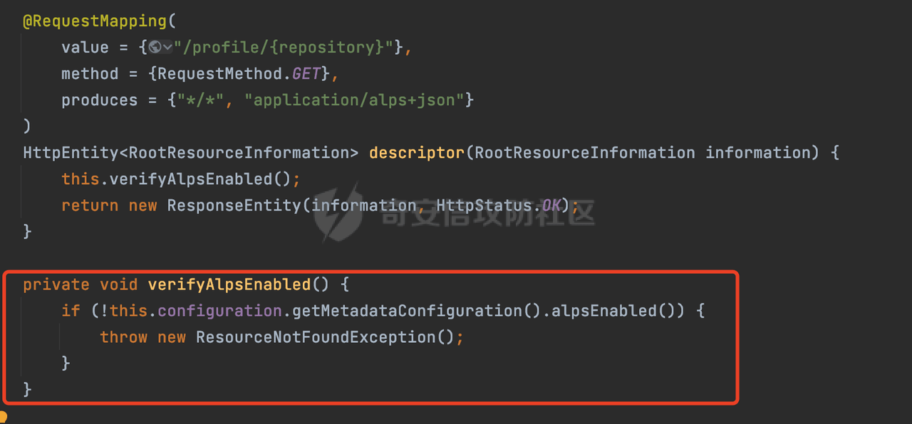

默认情况下 alpsEnabled 的值为 true:

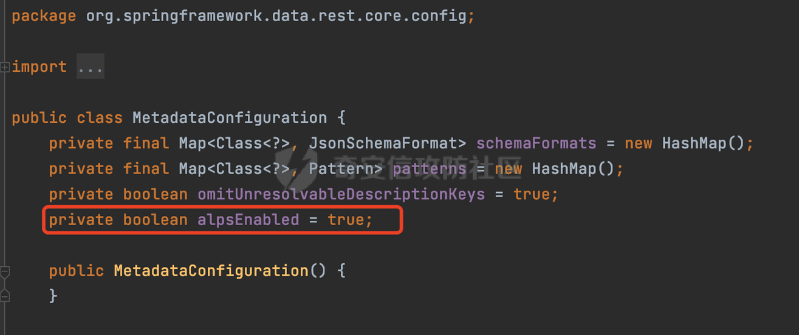

可以通过注册 RepositoryRestConfigurer（或扩展 RepositoryRestConfigurerAdapter(高版本已经弃用)）来自定义配置，例如下面的例子：

```Java
@Configuration
public class CustomRestMvcConfiguration {

    @Bean
    public RepositoryRestConfigurer repositoryRestConfigurer() {

        return new RepositoryRestConfigurerAdapter() {
            @Override
            public void configureRepositoryRestConfiguration(RepositoryRestConfiguration config) {
                MetadataConfiguration metadataConfiguration = config.getMetadataConfiguration();
                metadataConfiguration.setAlpsEnabled(false);
            }
        };
    }
}
```

高版本通过直接实现 RepositoryRestConfigurer 来自定义配置：

```Java
@Configuration
public class CustomRestMvcConfiguration {

    @Bean
    public RepositoryRestConfigurer repositoryRestConfigurer() {

        return new RepositoryRestConfigurer() {
            @Override
            public void configureRepositoryRestConfiguration(RepositoryRestConfiguration config, CorsRegistry cors) {
                MetadataConfiguration metadataConfiguration = config.getMetadataConfiguration();
                metadataConfiguration.setAlpsEnabled(false);
            }
        };
    }
}
```

同样是上面的例子，通过对应的配置设置 alpsEnabled 的值为 false 后，尝试访问相关的 ALPS 文档会返回 404：

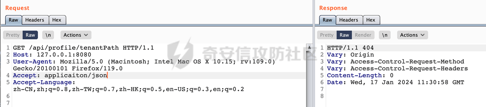

## 3.2 暴露的端点

在 Spring Data REST 中可以通过如下方式将 exported 属性设置为 false 来实现接口及接口中的所有方法不对外暴露，从而限制访问。一般情况下为了防止 HTTP 用户调用 CrudRepository 的删除方法，会覆盖所有这些删除方法，并将对应的注释添加到覆盖方法中。

-   在接口级别增加@RepositoryRestResource(exported = false)

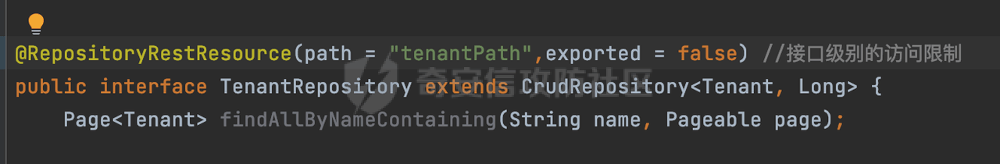

-   在指定的方法使用@RestResource(exported = false)

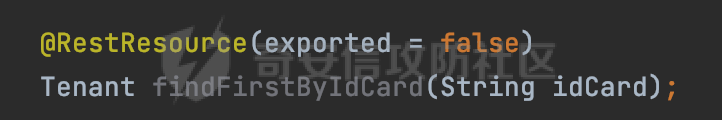

此外，还可以通过 SpringSecurity 对相关的请求路径进行防护。网上很多的案例都是使用 AntPathRequestMatcher 基于 Ant 风格模式进行匹配的。实际上这里会存在解析差异的问题。实际上应该使用 MvcRequestMatcher，在匹配时会更严谨。

如果通过自定义 filter 基于请求 Path 进行权限控制的话，这里跟 SpringWeb 是类似的，同样也存在解析差异导致的绕过风险。在审计过程中需要额外注意。

### 3.2.1 获取请求路径的方式

之前简单分析了 SpringWeb 中获取当前请求路径的方式，具体可以参考[https://forum.butian.net/share/2606。](https://forum.butian.net/share/2606%E3%80%82)

HandlerMapping 是 Spring Framework 中用于处理请求映射的核心接口之一。它定义了一种策略，用于确定请求应该由哪个处理器（Handler）来处理。HandlerMapping 接口提供了一组方法，用于获取与请求相关的处理器。BEST\_MATCHING\_PATTERN\_ATTRIBUTE 属性在处理请求时，Spring 会尝试找到最适合处理请求的 Controller。该属性存储了在这个过程中找到的最佳匹配的 Controller。

在 Spring Data Rest 中也存在类似的属性`RepositoryRestHandlerMapping.`*`BEST_MATCHING_PATTERN_ATTRIBUTE`*。但是通过类似`request.getAttribute(RepositoryRestHandlerMapping.`*`BEST_MATCHING_PATTERN_ATTRIBUTE`*`);`获取的 path 某些时候并不能满足对应的鉴权需求。例如请求 RepositoryEntityController 时获取到的路径为`/{repository}/{id}`。缺少了具体的仓库路径 Repository Path。

根据前面的分析，可以通过`EFFECTIVE_REPOSITORY_RESOURCE_LOOKUP_PATH`属性获取包含仓库路径 Repository Path 的请求 path：

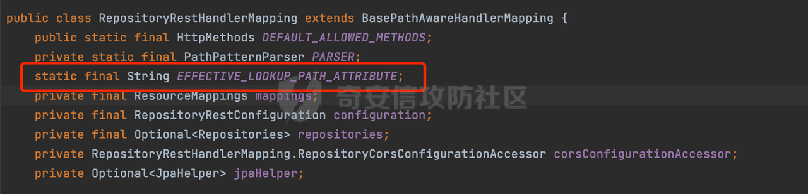

在 exposeEffectiveLookupPathKey 方法中，在获取到对应的 Pattern 后，例如`/api/{repository}/search/{search}`,会把`/{repository}`替换成前面获取到的 repositoryBasePath：

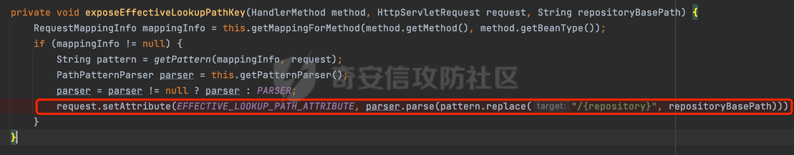

也就是说，可以通过下面的方法来获取包含仓库路径 Repository Path 的请求 path：

```Java
PathPattern pathPattern = (PathPattern) request.getAttribute("org.springframework.data.rest.webmvc.RepositoryRestHandlerMapping.EFFECTIVE_REPOSITORY_RESOURCE_LOOKUP_PATH");
String requestPath = pathPattern.getPatternString();
```

以 RepositorySearchController 调用为例，尝试调用前面的 findFirstByMobile 方法，此时获取到的请求路径为`/tenantPath/search/{search}`。

## 3.3 敏感数据暴露

默认情况下，Spring Data REST 可能会暴露实体类的所有字段，包括敏感信息。

-   避免在响应中暴露敏感信息。
-   使用投影来控制响应中返回的数据。

具体使用可以参考[https://docs.spring.io/spring-data/rest/docs/current-SNAPSHOT/reference/html/#projections-excerpts](https://docs.spring.io/spring-data/rest/docs/current-SNAPSHOT/reference/html/#projections-excerpts)

## 3.4 Denial of Service

Spring Data REST 是建立在 Data Repository 之上的，可能通过执行大量数据查询来导致服务器负载过高，引发拒绝服务攻击。对于查询类的接口，需要限制查询端点的返回结果数量，并配置合适的分页和排序。

## 3.5 其他

除此之外，本身的 sql 注入问题在审计时也是需要关注的。
