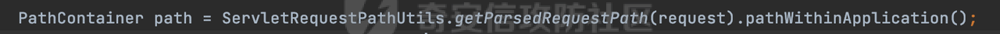
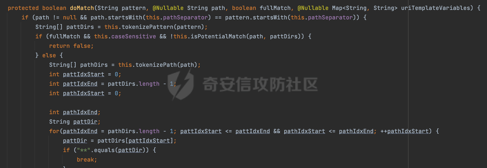
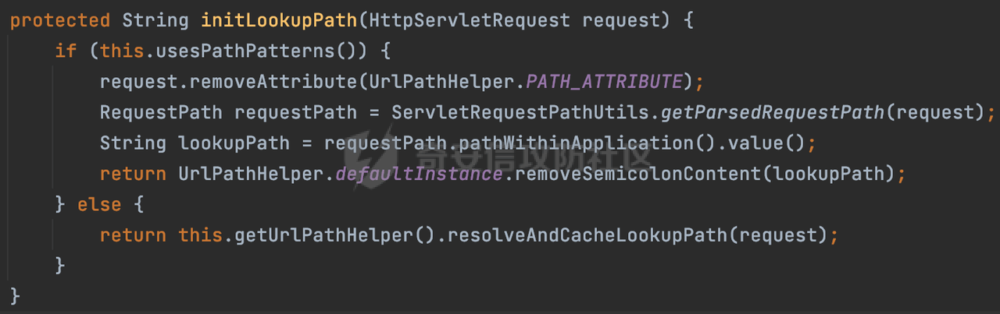

# 奇安信攻防社区-SpringWeb中获取@PathVariable参数值的方式与潜在的权限绕过风险

### SpringWeb中获取@PathVariable参数值的方式与潜在的权限绕过风险

在某些业务场景中，会获取@PathVariable 参数值，根据具体的角色权限来进行对比，以达到访问不同的数据的效果。浅谈SpringWeb中获取@PathVariable 参数值的方式与潜在的权限绕过风险。

# 0x00 前言

在实际业务中，为了防止越权操作，通常会根据对应的URL进行相关的鉴权操作。前面总结和SpringWeb中获取当前请求路径的方式以及路径前缀的方式，具体可以参考[https://forum.butian.net/share/2606](https://forum.butian.net/share/2606) 、[https://forum.butian.net/share/2761](https://forum.butian.net/share/2761) 。

除了上述场景外，还发现在某些业务场景中，会获取@PathVariable 参数值，根据具体的角色权限来进行对比，以达到访问不同的数据的效果。下面看看SpringWeb中是如何获取 @PathVariable 参数值的。

# 0x01 获取 @PathVariable 参数值的方式

在SpringWeb中，一般获取@PathVariable 参数值的方式主要有以下几种：

-   HandlerMapping属性对应的方法
-   AntPathMatcher和PathPattern自带方法

下面详细看看具体的解析逻辑：

## 1.1 HandlerMapping属性

以spring-webmvc-5.3.27为例，查看具体的实现：

### 1.1.1 URI\_TEMPLATE\_VARIABLES\_ATTRIBUTE

在获取Controller资源的过程中，RequestMappingHandlerMapping调用getHandler方法，找到匹配当前请求的HandlerMethod，然后处理匹配到的HandlerMapping，进而解析路径的参数。

主要是在org.springframework.web.servlet.mvc.method.RequestMappingInfoHandlerMapping#handleMatch方法进行处理的：


首先会获取模式匹配的条件，然后根据不同条件，调用extractMatchDetails方法选择使用PathPattern还是AntPathMatcher解析模式提取请求路径里的详细信息：


下面分别是两种解析模式的提取过程：

-   **PathPattern解析模式**

若PathPatternsRequestCondition模式不为空的话进入对应的解析流程：


首先获取当前请求的路径path，这里跟获取Controller资源的过程中的通过PathPattern匹配前获取请求路径的方式是一致的：




获取到请求路径后，通过PathPattern模式的matchAndExtract方法来提取变量，提取完的变量可以通过getUriVariables方法获取，最终将对应的值分别设置在request的MATRIX\_VARIABLES\_ATTRIBUTE和URI\_TEMPLATE\_VARIABLES\_ATTRIBUTE中：


-   **AntPathMatcher解析模式**

前面的逻辑跟PathPattern的情况是类似的，只是这里不重新获取请求path，而是直接对lookupPath进行处理：


lookupPath主要通过initLookupPath获取用于初始化请求映射的路径：


然后AntPathMatcher解析匹配，通过其extractUriTemplateVariables方法来提取变量检验UrlPathHelper中的removeSemicolonContent参数，removeSemicolonContent默认是true，默认不会提取MatrixVariable变量，因此需要设置为false，才能进入该分支，这里主要是对@MatrixVariable进行处理：


最后调用UrlPathHelper的decodePathVariables方法对提取出来的参数进行处理，并设置request的URI\_TEMPLATE\_VARIABLES\_ATTRIBUTE属性：


在decodePathVariables方法中，会根据urlDecode确定是否需要对请求路径里参数值进行URL解码操作：


## 1.2 不同解析模式自带的方法

### 1.2.1 AntPathMatcher

-   **org.springframework.util.AntPathMatcher#extractUriTemplateVariables**

以spring-web-5.3.27.jar为例，查看具体的实现，这里会直接调用org.springframework.util.AntPathMatcher#doMatch方法进行处理，并且将对应的参数及内容封装到传入的variables参数中：


首先调用tokenizePattern()方法将pattern分割成了String数组，如果是全路径并且区分大小写,那么就通过简单的字符串检查，看看path是否有潜在匹配的可能，没有的话返回false，然后调用tokenizePath()方法将需要匹配的path分割成string数组,主要是通过java.util 里面的StringTokenizer来处理字符串：



然后将pathDirs和pattDirs两个数组从左到右开始匹配，主要是一些正则的转换还有通配符的匹配，这里调用了org.springframework.util.AntPathMatcher#matchStrings方法来处理URI中对应的参数内容：


实际调用的是AntPathStringMatcher#matchStrings进行处理:


在matchStrings方法中，首先会根据pattern进行匹配：


可以看到对于@PathVariable场景，对应Pattern为`((?s).*)`，代表匹配包括换行符在内的任意字符：


匹配过程主要做了两个检查：

-   查看参数列表的数量与匹配的数量是否一致，如果不一致则抛出异常
-   然后遍历匹配的结果，这里首先会对参数列表里的参数名进行检查，如果以`*`开头的话则抛出对应的异常（主要是区分PathPattern的新特性，`{*spring}`表示匹配余下的path路径部分并将其赋值给名为spring的变量，变量名可以根据实际情况随意命名，与`@PathVariable`名称对应即可）

最后将匹配的结果封装到Map结构中，并返回：


到这里已经将对应的参数及内容封装到传入的variables参数。

### 1.2.2 PathPattern

-   **org.springframework.web.util.pattern.PathPattern#matchAndExtract**

以spring-web-5.3.27.jar为例，查看具体的实现，首先会创建MatchingContext对象，然后调用matches方法在匹配过程中完成请求路径中参数的提取：


这里会根据PathPattern的链式节点中对应的PathElement的matches方法逐个进行匹配，其中对于@PathVariable的处理是在org.springframework.web.util.pattern.CaptureVariablePathElement#matches完成的。

通过matchingContext.pathElementValue获取当前节点的值并保存在candidateCapture参数中，然后通过java.util.regex.compile#matcher对匹配到的内容进行检查：


最终调用set方法将candidateCapture封装：


匹配结束后通过getPathMatchResult方法返回对应的刚刚封装的解析结果：


在创建PathElement链式结构时，会有一些处理：

-   **默认会对路径中的分号进行截断处理：**


-   **默认情况下会进行URL解码操作,主要是通过decodeAndParseSegments属性控制的（默认是true）：**


# 0x02 潜在的绕过风险

本质上还是由于解析差异导致的绕过风险。在SpringWeb中绕过的方式也是大同小异。下面看一个实际遇到的例子：

首先通过HandlerMapping的PATH\_WITHIN\_HANDLER\_MAPPING\_ATTRIBUTE属性来获取请求的path，然后通过BEST\_MATCHING\_PATTERN\_ATTRIBUTE属性获取到最佳匹配的Controller。最后通过AntPathMatcher#extractUriTemplateVariables方法来提取@PathVariable 参数值，然后对对应的参数&值进行对应的检查：

```Java
String reqPath = (String) request.getAttribute(HandlerMapping.PATH_WITHIN_HANDLER_MAPPING_ATTRIBUTE);
String bestMatchPattern = (String) request.getAttribute(HandlerMapping.BEST_MATCHING_PATTERN_ATTRIBUTE);
Map<String, String> map =  new AntPathMatcher().extractUriTemplateVariables(bestMatchPattern, reqPath);
```

类似`/admin/{param}/index`,当请求`/admin/manage/index`时会获取到的@PathVariable 参数值为manage。

Spring在获取到请求路径后，会调用lookupHandlerMethod方法，首先直接根据路径获取对应的Mapping，获取不到的话调用addMatchingMappings遍历所有的ReuqestMappingInfo对象并进行匹配。匹配完成后，会存储请求相对于Controller映射的路径：


可以看到PATH\_WITHIN\_HANDLER\_MAPPING\_ATTRIBUTE属性值主要跟lookupPath有关。而lookupPath实际上还是从initLookupPath方法获取的：



当使用PathPattern进行解析时，仅会移除URL路径中分号之后还有移除URL路径中的JSESSIONID参数。所以当对请求Path进行URL编码时，获取到的Path并不会进行URL解码处理，解码操作仅仅在PathPattern链式匹配时才会进行。

根据前面的分析AntPathMatcher#extractUriTemplateVariables方法在匹配时本身也不会进行URL解码操作。那么这里上述提取@PathVariable 参数值则存在一个解析差异的问题：

-   低版本使用AntPathMatcher进行路由匹配时，通过PATH\_WITHIN\_HANDLER\_MAPPING\_ATTRIBUTE属性值是经过URL解码后的，此时类似`/admin/{param}/index`,当请求`/admin/manage/index`时会获取到的@PathVariable 参数值为manage
-   高版本使用PathPattern进行路由匹配时，通过PATH\_WITHIN\_HANDLER\_MAPPING\_ATTRIBUTE属性值是没有经过解码的。此时类似`/admin/{param}/index`,当请求`/admin/%6d%61%6e%61%67%65/index`时会获取到的@PathVariable 参数值为%6d%61%6e%61%67%65。但是在PathPattern链式匹配时会进行解码，并不会影响正常的业务调用，此时若后续的鉴权判断逻辑是直接遍历map的key-value进行类似equals判断时，明显会存在绕过的风险。

# 0x03 其他

PathVariableMethodArgumentResolver主要用于解析@PathVariable注解，一般会把解析后的参数名传递给 resolveName() 方法，从请求中获取参数值，可以看到其也是通过HandlerMapping的URI\_TEMPLATE\_VARIABLES\_ATTRIBUTE来获取对应的值的：


