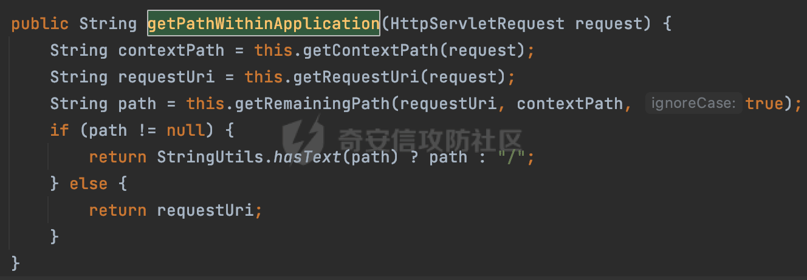
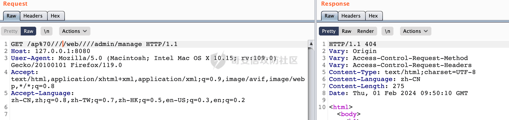
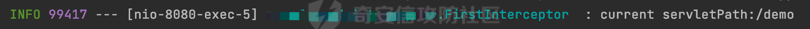

# 奇安信攻防社区-SpringWeb 中获取路径前缀的方式与潜在的权限绕过风险

### SpringWeb 中获取路径前缀的方式与潜在的权限绕过风险

在实际业务中，为了防止越权操作，通常会根据对应的 URL 进行相关的鉴权操作。除了实际访问的资源路径以外，通过动态配置资源权限时，很多时候在数据库或者权限中台配置的鉴权请求路径通常还会包含路径前缀。浅谈 SpringWeb 中获取当前请求路径前缀的方式。

# 0x00 前言

在实际业务中，为了防止越权操作，通常会根据对应的 URL 进行相关的鉴权操作。SpringWeb 中获取当前请求路径的方式可以参考[https://forum.butian.net/share/2606。](https://forum.butian.net/share/2606%E3%80%82)

除了实际访问的资源路径以外，通过动态配置资源权限时，很多时候在数据库或者权限中台配置的鉴权请求路径通常还会包含路径前缀。下面看看 SpringWeb 路径前缀具体内容。

# 0x01 SpringWeb 路径前缀

DispatcherServlet 从 Tomcat 中获取的 Request 中包含了完整的 URL，并且会按照 Servlet 的映射路径把路径划分为 contextPath、servletPath 和 pathInfo 三部分。


在 Spring MVC 中，`spring.mvc.servlet.path` 和 `server.servlet.context-path` 是两个配置属性，用于配置 contextPath、servletPath 的相关信息。

## 1.1 contextPath

`contextPath` 是 Web 应用程序在 Web 服务器上运行时的上下文路径。在一个 Web 容器中可以同时运行多个 Web 应用程序，为了区分它们，每个 Web 应用都有一个唯一的上下文路径。可以通过`server.servlet.context-path`属性进行配置。

通过下面的配置，会影响整个应用程序的上下文路径。此时个应用程序将在 `/myapp` 路径下访问，而不是根路径`/`:

```Java
server.servlet.context-path=/myapp
```

## 1.2 servletPath

`servletPath` 是指请求中用于定位到 Servlet 的部分路径。在 Spring MVC 中，DispatcherServlet 负责处理请求。一般指的是 DispatcherServlet 的路径。可以通过`spring.mvc.servlet.path` 属性进行配置。（在 SpringBoot 的早期版本中，该属性位于 `ServerProperties` 类中，名称为 `server.servlet-path=/`。从 2.1.x 版开始，该属性被移至 `WebMvcProperties` 类，并更名为 `spring.mvc.servlet.path=/`）

通过下面的配置，主要影响 DispatcherServlet 的路径，DispatcherServlet 的处理将映射到 `/api/*`，其下的所有请求都将由 DispatcherServlet 处理：

```Java
spring.mvc.servlet.path=/api
```

结合上述的两个配置，DispatcherServlet 将处理 `/api/*` 的请求，而整个应用程序将在 `/myapp` 路径下访问。最终通过访问`http://localhost:8080/myapp/api/someEndpoint`来访问 Controller 中配置的资源。

# 0x02 servletPath 的检查机制

前面提到，可以通过配置`spring.mvc.servlet.path` 来影响 DispatcherServlet 的路径。Spring Web 解析请求时，高版本会通过 PathPattern 进行解析。同样的这里会引入对 servletPath 的检查机制。下面是具体的过程。

当 Spring MVC 接收到请求时，Servlet 容器会调用 DispatcherServlet 的 service 方法（方法的实现在其父类 FrameworkServlet 中定义），这里会根据不同的请求方法，调用 processRequest 方法，例如 GET 请求会调用 doGet 方法。在执行 doService 方法后，继而调用 doDispatch 方法处理。

而在 doService 方法中，根据 parseRequestPath 的值，会进行对应的处理：


通过org.springframework.web.servlet.DispatcherServlet#initHandlerMapping可知,当使用了PathPattern进行路径匹配时，该值会设置为true：


继续跟进对应的处理逻辑，在 parseAndCache 方法中，会调用 ServletRequestPathUtils 对请求进行解析：


在 parse 中会尝试获取 servletPath，如果 servletPathPrefix 不为 null，会处理`spring.mvc.servlet.path`配置的内容并返回：


这里主要是通过 getServletPathPrefix 来获取 servletPathPrefix 的，这里主要是通过 request.getServletPath 获取并进行编码操作：


当存在 servletPathPrefix 时，会创建 ServletRequestPath 对象：


这里将 contextPath 和 servletPathPrefix 拼接，然后调用 RequestPath.parse 方法进行处理：


在 initContextPath 方法中，这里调用了 validateContextPath 方法进行了相关的检查：


可以看到，当 fullPath 不以 contextPath 和 servletPathPrefix 拼接内容开头时，会抛出 Invalid contextPath 的异常：


fullPath 是从前面 parse 方法的 request.getRequestURI() 方法获取的，没有经过相关归一化的处理：


那么也就是说，假设当前 servletPath 配置如下：

```Java
spring.mvc.servlet.path=/app
```

当尝试以`/ap%70`(%70 是 p 的 URL 编码) 进行访问时，因为获取到的 servletPathPrefix 是经过 URL 解码处理的，在 validateContextPath 方法中会因为匹配不一致而抛出异常：


同理`app;`的方式也是一样的。从一定的程度访问了通过编码等方式进行 URL 权限的绕过。

## 2.1 其他

在实际的鉴权组件中，通常会获取当前请求的路径进行操作。获取到的请求路径没有经过规范化处理的话，结合对应的鉴权逻辑（白名单，模式匹配等）可能存在绕过的风险。跟资源路径一样，若路径前缀也是匹配的内容，不规范的获取方式同样会存在绕过风险。

例如如下 contextPath 仍可正常访问对应的 Controller 资源接口：

```Java
server.servlet.context-path=/app/web
```


上面的例子是在 spring-boot-starter-2.7.12.jar 下运行的。这里可能会有一个疑问，高版本 SpringWeb 在解析时使用的是 PathPattern，会因为解析模式的不同导致在路径匹配时经过不同的处理。默认情况下 PathPattern 是无法处理类似//的情况的，但是上述案例明显正常获取到了对应的资源：


实际上在匹配路径时，contextPath 并不会影响，因为在构建 requestPath 时会根据 contextPath 进行路径的分离：


而从前面的分析也可以知道，当使用 PathPattern 进行解析时，会将 contextPath 和 servletPathPrefix 进行拼接合并，也就是说不论是 contextPath 还是 servletPath 都不会影响后续路径匹配的过程，contextPath 的匹配在调用 DispatcherServlet 之前就已经处理了，所以上述例子中，即使是在 contextPath 中包含了//，使用 PathPattern 模式的 SpringWeb 仍可正常访问。

而当低版本使用 AntPathMatcher 进行路径匹配时：


在 getPathWithinApplication 方法中，同样获取了 contextPath 进行路径的分离：



只是这里并没有考虑 servletPath：


但是这里在获取 contextPath 时仅仅进行了解码操作，而获取 requestUri 时额外调用了 getSanitizedPath 方法对多个`/`进行了处理，也就是说如果 contextPath 包含多个`/`的话，可能会导致路径无法匹配：



而 servletPath 的处理是主要依赖于 alwaysUseFullPath 属性，通过 getPathWithinServletMapping 方法进行额外处理：


Spring 也对类似的问题进行了说明，具体可见[https://docs.spring.io/spring-framework/reference/web/webmvc/mvc-servlet/handlermapping-path.html](https://docs.spring.io/spring-framework/reference/web/webmvc/mvc-servlet/handlermapping-path.html)

# 0x03 获取路径前缀的方式

在 SpringWeb 中，一般获取当前请求路径前缀主要有以下方式：

-   通过`javax.servlet.http.HttpServletRequest`来获取请求的上下文
-   SpringWeb 中自带的方法

## 3.1 使用 javax.servlet.http.HttpServletRequest

下面看看通过 javax.servlet.http.HttpServletRequest 分别是怎么获取对应的 contextPath 和 servletPath 的：

### 3.1.1 contextPath

以如下配置为例，查看不同方法获取到的 contextPath 的区别：

```Java
server.servlet.context-path=/app/web
```

-   **request.getContextPath()**

这里获取到的上下文路径默认情况下是没有经过归一化处理的（SpringWeb 默认使用 tomcat 进行解析）：


这种情况下获取到的路径前缀存在风险的，结合类似 URL 编码的方式可能可以绕过现有的鉴权措施。

-   **request.getServletContext().getContextPath()**

通过 HttpServletRequest 对象的 getServletContext() 方法获取 ServletContext，然后再调用 getContextPath() 方法。

同样是上面的例子，此时可以看到获取到的 contextPath 已经经过一系列的归一化处理：


### 3.1.2 servletPath

以如下配置为例，查看不同方法获取到的 servletPath 的区别：

```Java
spring.mvc.servlet.path=/demo
server.servlet.context-path=/app/web
```

-   **request.getServletPath()**

`getServletPath()` 方法返回请求的 Servlet 路径。Servlet 路径是请求的相对于上下文根的部分，不包括任何额外的路径信息。这个方法通常用于获取处理请求的 Servlet 路径。

当尝试以畸形前缀进行请求时，可以看到听过 request.getServletPath() 获取到的 servletPath 已经经过一系列的归一化处理：




## 3.2 SpringWeb 中自带的方法

### 3.2.1 contextPath

#### 3.2.1.1 RequestContextUtils

`org.springframework.web.servlet.support.RequestContextUtils` 是 Spring Web MVC 框架中的一个工具类，用于获取当前请求的`RequestContext`。最常用的方法是`findWebApplicationContext(request)`，一般用于查找当前请求的 `WebApplicationContext`，其是 Spring Web MVC 应用程序中的一个关键接口，它是 Spring IoC 容器的一种扩展，用于管理 Web 层的 Bean：


这里可以获取 ServletContext，然后再调用 getContextPath() 方法：

```Java
RequestContextUtils.findWebApplicationContext(request).getServletContext().getContextPath()
```

得到的 contextPath 是经过归一化处理的。

#### 3.2.1.2 ServletRequestPathUtils

`org.springframework.web.util.ServletRequestPathUtils` 是 Spring Framework 提供的一个工具类，用于处理`ServletRequest`（通常是`HttpServletRequest`）的请求路径信息。主要用于从请求中获取有关路径的信息，并提供了一些方法来处理和解析路径。

前面在 servletPath 的检查机制时提到过，当使用 PathPattern 进行解析时，会进行一系列的处理并且将处理后的结果封装到 PATH\_ATTRUBYTE 属性中：


而 ServletRequestPathUtils 可以通过 getParsedRequestPath 进行获取，并调用对应的方法获取 contextPath：


```Java
ServletRequestPathUtils.getParsedRequestPath(request).contextPath().value()
```

根据前面的分析，在处理过程中并没有对 contextPath 进行相关的归一化处理，所以通过这种方式获取到的 contextPath 在某种场景下也是存在风险的：


同理，直接使用 parseAndCache 方法处理获取到的 contextPath 也是没有进行相关的归一化处理的：

```Java
ServletRequestPathUtils.parseAndCache(request).contextPath().value()
```

以上是 SpringWeb 中常见的获取当前请求路径前缀的方式。在实际代码审计过程中可以根据不同的方式，结合实际场景判断是否存在绕过的可能。
