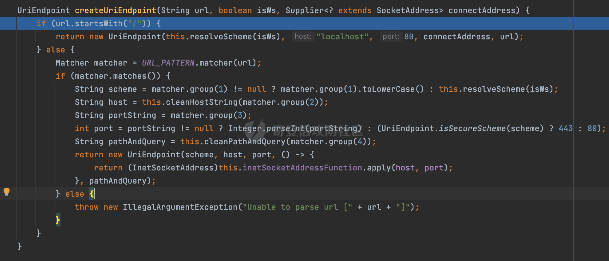
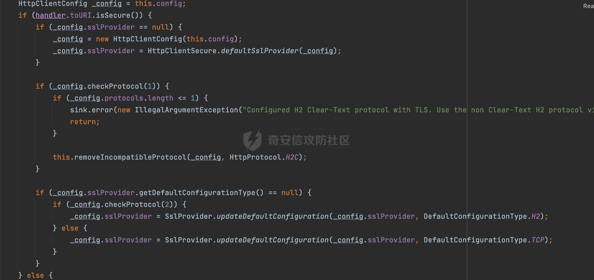
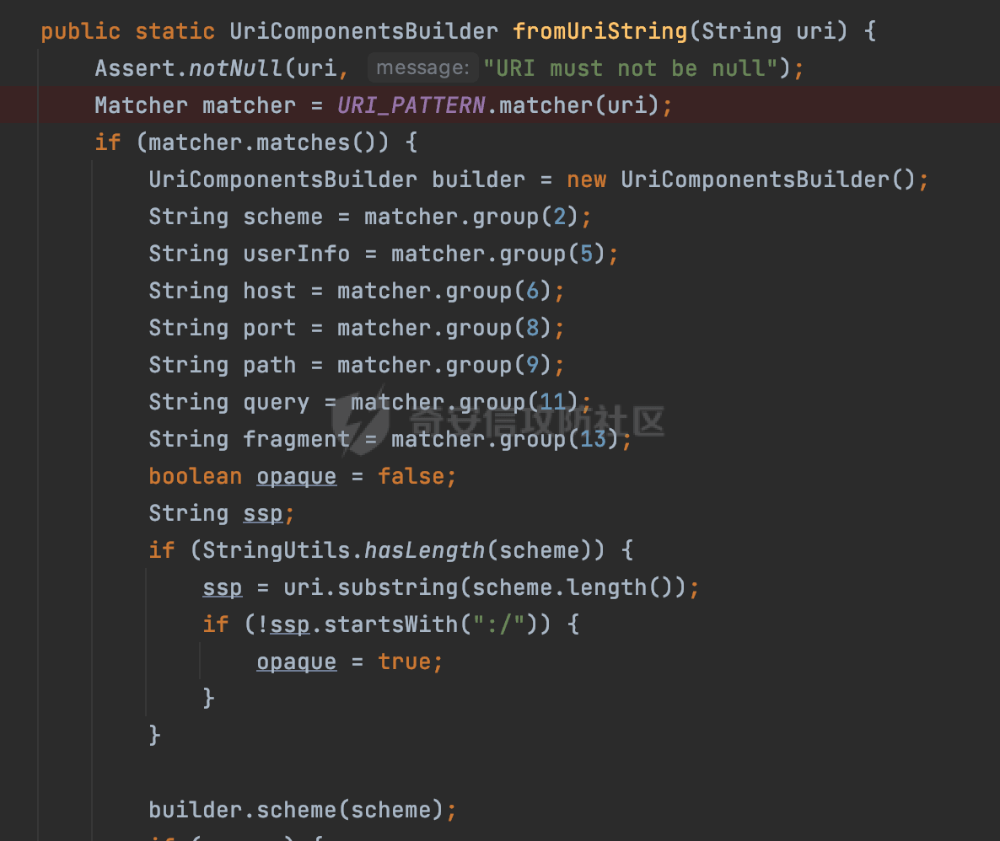
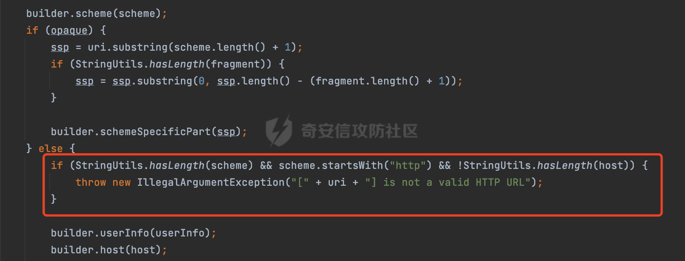

# 奇安信攻防社区 -【Web 实战】浅谈 reactor netty httpclient 请求解析过程

### 【Web 实战】浅谈 reactor netty httpclient 请求解析过程

Reactor Netty HttpClient 是 Reactor Netty 框架提供的一个用于进行异步 HTTP 请求的客户端库。它基于 Reactor 框架，采用响应式编程模型，允许以非阻塞的方式执行 HTTP 请求和处理响应。浅谈其 HTTP 请求解析过程。

# 0x00 前言

Reactor Netty HttpClient 是 Reactor Netty 框架提供的一个用于进行异步 HTTP 请求的客户端库。它基于 Reactor 框架，采用响应式编程模型，允许以非阻塞的方式执行 HTTP 请求和处理响应。


通过引入对应的依赖，即可通过使用 Reactor Netty 从 HttpClient 获取目标的响应报文：


下面是一个具体的例子，首先创建了一个 HttpClient 对象，通过 Reactor Netty 的链式调用 API 来构建我们的请求，发起了一个 GET 请求访问了 target 并打印对应响应的内容，完成了整个请求与响应处理过程：

```Java
HttpClient httpClient = HttpClient.create().wiretap(true);
httpClient.get().uri(target).responseContent().aggregate().asString().doOnSuccess(s -> {
    System.out.println("s1=" + s);
}).block();
```

上述代码串联了多个 Reactor Netty 的方法，下面是简单的说明：

-   `httpClient.get().uri(target)`：通过 httpClient 创建了一个 HTTP GET 请求，并指定了请访问的目标 URL。
-   `.responseContent()`:调用.responseContent() 方法，会获取到一个表示 HTTP 响应内容（响应体）的 Flux\\<ByteBuf>，其中 Flux 是 Reactor 中的一种反应式数据类型，表示异步流。异步处理响应体的数据信息。
-   `.aggregate()`:因为 HTTP 响应的内容通常会被分成多个字节块，该方法用于将它们进行整合。
-   `.asString()`:调用该方法将`ByteBuf`内容解码为字符串方便后续的处理。
-   `doOnSuccess(s -> {` `System.out.println("s1=" + s);})`:使用.doOnSuccess() 方法注册一个回调函数，当 HTTP 响应成功完成时，执行这个函数将 HTTP 响应的内容打印到控制台中。
-   `.block()`:阻塞当前线程以等待 HTTP 响应的完成。.block() 方法会触发实际的 HTTP 请求发送和响应处理，然后等待直到 HTTP 请求完成，并且只有在响应成功时才会解除阻塞。

当然除了 block 以外，还可以通过类似 subscribe 获取响应报文。

# 0x01 "畸形 scheme"HTTP 请求

以 GET 请求为例，下面对 reactor netty httpclient 请求解析过程进行简单的分析：

在 Reactor Netty 框架中，MonoHttpConnect 是一个用于表示 HTTP 连接的 Mono 类型。它代表了一个异步的 HTTP 请求，并返回一个 Mono 类型的结果。通过调用 subscribe 方法，可以触发实际的 HTTP 请求，并通过订阅者来处理响应结果：


首先这里会实例化 HttpClientConnect，这里会调用`uriEndpointFactory.createUriEndpoint`创建 UriEndpoint，UriEndpoint 是一个用于表示网络请求的目标地址的类。它封装了 URI 的相关信息，包括协议、主机名、端口号、路径等。reactor.netty.http.client.UriEndpointFactory#createUriEndpoint方法根据传入的参数，创建一个 UriEndpoint 对象，并返回该对象：



可以看到，在 createUriEndpoint 方法中，主要是通过正则匹配的方式获取 URI 的相关信息：


创建完 HttpClientHandler 后，会通过配置对象（\_config）来设置一些参数：



这里会调用 resolverInternal 方法用于获取地址解析器组。它负责将主机名解析为一个或多个 IP 地址，以便 HttpClient 可以与目标服务器建立连接：


实际调用的是其父类 ClientTransportConfig 的方法：


这里会 create 一系列的组件：


例如创建 ConnectionProvider 用来管理连接池，Builer 这里硬编码传入对应的 name 为 http，后续会创建一组连接并存储在连接池中。当需要进行网络通信时，可以从连接池中获取一个连接并使用它来发送请求：


又例如 PooledConnectionProvider，这个在后面会用到：


调用完后，此时会调用`_config.httpConnectionProvider().acquire`从 HTTP 连接提供者中获取一个可用的连接。以便进行 HTTP 请求：


查看具体的过程，这里最终会调用 PooledConnectionProvider 的 acquire 方法：


reactor.netty.resources.PooledConnectionProvider 的作用是提供连接池管理功能。在使用 Reactor Netty 进行网络通信时，可以通过 PooledConnectionProvider 来管理和复用连接，以提高性能和资源利用率，这里会调用 acquire 方法获取一个可用的连接，以便进行网络通信。获取到的连接可以用于发送请求、接收响应等操作，如果连接池中没有可用的连接，它可能会创建一个新的连接：


从对应的调试信息可以知道，这里创建的是 http client pool，结合前面解析请求 target 的过程，这里 name 的值并不是从请求 target 的 schema 获取的，是从前面 Builer 里硬编码获取的：


后面是 HttpClientOperations 的处理，也没有对 schema 进行相应检查操作，那么这里有没有可能 reactor netty httpclient 可以以任意符合正则匹配的 schema 进行请求呢？


验证下前面的猜想：


正常情况下，通过 reactor netty httpclient 请求`http://127.0.0.1:8080/health`正常返回：


将 scheme 替换成任意字符，可以发现依旧能正常请求并返回：


查看 reactor netty httpclient 的日志，确实没有考虑用户输入的协议，在 PooledConnectionProvider 创建了新的 http client pool，同时也没有发现关于 schema 的检查：


结合前面请求 target 解析的正则：


scheme 还支持下划线匹配，所以类似`anyt____hing`的 schema 同样能正常请求：


# 0x02 其他

WebClient 是从 Spring WebFlux 5.0 版本开始提供的一个非阻塞的基于响应式编程的进行 Http 请求的客户端工具。它的响应式编程的基于 Reactor 的。WebClient 中提供了标准 Http 请求方式对应的 get、post、put、delete 等方法，可以用来发起相应的请求。

通过引入如下依赖即可使用 WebClient:


从依赖关系可以看到，实际上 spring-boot-starter-webflux 也是基于 reactor-netty-http 来发起相应的请求的：


下面的代码是一个简单的 WebClient 请求示例。可以通过`WebClient.create()`创建一个 WebClient 的实例，然后选择调用方式 get，在`uri()`指定需要请求的路径，然后调用`retrieve()`发起请求并获得响应，`bodyToMono(String.class)`用来指定请求结果需要处理为 String:

```Java
WebClient webClient = WebClient.builder().build();
String response = webClient.get().uri(url).retrieve().bodyToMono(String.class).block();
return response;
```

简单看下WebClient的处理过程，首先会在org.springframework.web.util.UriComponentsBuilder#fromUriString方法处理需要请求的目标：



可以看到这里也是通过正则的方式进行匹配：


若未匹配相关信息，会抛出`throw new IllegalArgumentException("[" + uri + "] is not a valid URI");`异常，否则进行进一步的封装，同时这里对 scheme 和 host 进行了一定的合法性检查：



但是并没有强制校验 scheme 是否是 http/https，所以同样的当尝试请求`anything://127.0.0.1:8080/health`，WebClient 同样也是能正常解析并正常返回：


可以看到结合 reactor netty httpclient 解析过程中的一些处理方式，可以构造类似上述任意协议的“畸形”的请求样式，在某种情况下可以绕过现有 ssrf 的一些安全防护措施。开发人员应该避免将不受信任且未经验证的数据从 HTTP 请求传递给 reactor netty httpclient，避免不必要的绕过导致 ssrf 风险。
