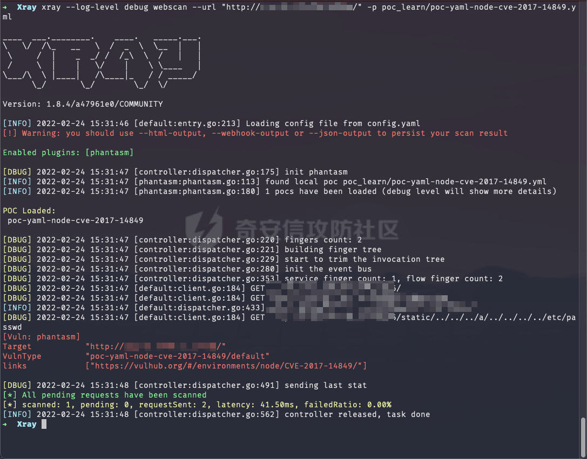
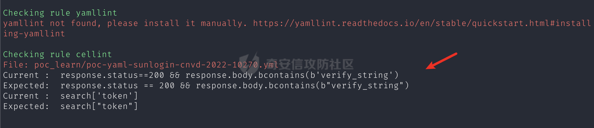
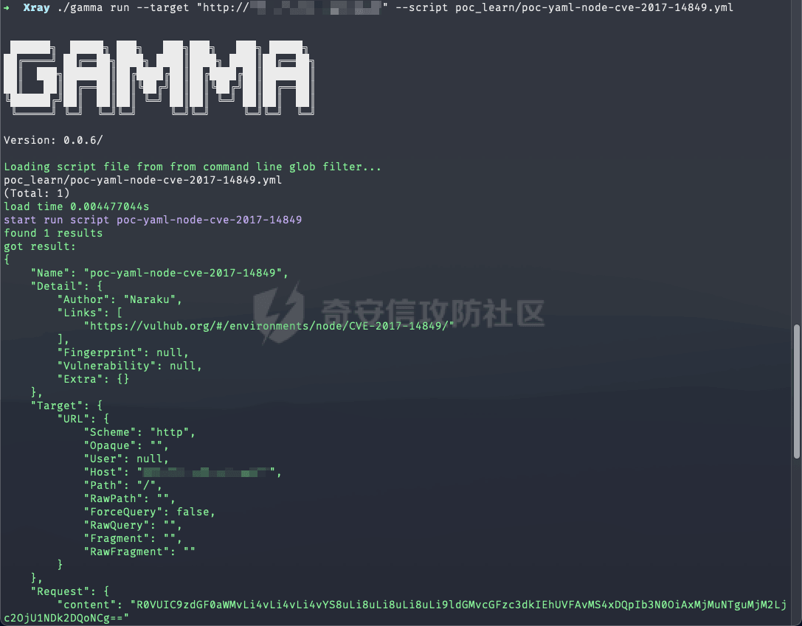

# 奇安信攻防社区-Xray POC 编写指南

### Xray POC 编写指南

一份 Xray POC 的简单食用指南

## 脚本编写

建议先过一遍参考文档：[https://docs.xray.cool/#/guide/poc/v2](https://docs.xray.cool/#/guide/poc/v2)

### YAML

> 一种可读的序列化数据，类似 JSON。参考：[YAML - Wiki](https://en.wikipedia.org/wiki/YAML)

-   特点：
    -   大小写敏感
    -   可以使用`#`号注释
    -   **使用缩进表示层级关系**，缩进**不允许**使用`Tab`，可以用空格
-   关于 YAML 字符串转义：[https://stackoverflow.com/questions/3790454/](https://stackoverflow.com/questions/3790454/)

### 基本信息

文件命名格式为：`组件-编号-漏洞类型.yml`，如：`node-cve-2017-14849-fileread.yml`

```yaml
# 基本信息
# POC 名称，一般格式为 poc-yaml-<组件名>-<漏洞编号>-<漏洞类型>
name: poc-yaml-test
# 区分是否手工编写，Xray 有一些 poc 是自动生成的
manual: true
```

### 脚本部分

-   `set`：定义全局变量
    -   随机整数：`变量名: randomInt(min, max)`
    -   随机字符：`变量名: randomLowercase(length)`
-   `transport`：通信协议，`tcp/udp/http`
-   `rules`：语法规则
    -   `request`字段：定义请求方式和目标路径
    -   `expression`字段：判断规则是否命中，返回`true/false`
    -   `out`字段：可以从响应包中获取数据
        -   `search`字段定义匹配的正则表达式，返回一个字典
        -   `info:search["info"]`：
            -   `info`是自定义的变量名，后面可以用`{{info}}`进行调
            -   `search["info"]`：`search`字典中 Key 为`info`的值
-   `expression`：全部`rule`的执行顺序，遵循短路求值
    -   短路求值：即`r1() || r2()`，如果`r1()`的结果为`true`，那么`r2()`不会执行
    -   示例：
        -   `r1() && r2() && r3()`，全部规则命中时返回`true`
            
        -   `r1() || r2() || r3()`，任一规则命中时返回`true`
            
        -   `r1() || (r2() && r3())`，`r1`规则命中，或者`r2、r3`规则同时命中时返回\`true\`\`\`\`yaml
            
            # 脚本部分
            
            # 全局变量
            
            set:
            
            # 范围随机整数/字符
            
            randInt0: randomInt(1000, 9999)  
            randStr1: randomLowercase(10)
            

# 通信协议

transport: http

# 匹配规则

rules:  
r1:

# 请求方式

```php
    request:
        method: GET
        path: "/"

    # 最终执行结果
    expression: |
        response.status == 200 && response.body.bcontains(b"example") 

    # 从响应包获取数据
    output:  
        # search，指定搜索语法
        search: |
            r'(?P<info>\|.*\|)'.bsubmatch(response.raw)'
        # 变量名：匹配规则
        info: search["info"]
```

# rule 执行顺序

expression:  
r1()

````php

### 信息部分

非必填内容：

```yaml
# 信息部分
detail:
  author: Chaitin(https://www.chaitin.cn/)
  links:
    - https://docs.xray.cool/
  # 还有一些指纹和漏洞信息，可以参考文档
````

完整POC：

```yaml
# 基本信息
# POC 名称，一般格式为 poc-yaml-[框架名]-<漏洞编号>
name: poc-yaml-test
# 区分是否手工编写，Xray 有一些 poc 是自动生成的
manual: true

# 脚本部分
# 全局变量
set:
    # 范围随机整数/字符
    randInt0: randomInt(1000, 9999)
    randStr1: randomLowercase(10) 

# 通信协议
transport: http     

# 匹配规则
rules:
    r1:
        # 请求方式
        request:
            method: GET
            path: "/"

        # 最终执行结果
        expression: |
            response.status == 200 && response.body.bcontains(b"example") 

        # 从响应包获取数据
        output:  
            # search,指定搜索语法
            search: |
                r'(?P<info>\|.*\|)'.bsubmatch(response.raw)'
            # 变量名:匹配规则
            info: search["info"]

# rule 执行顺序
expression:
    r1()

# 信息部分，非必填内容
detail:
  author: Chaitin(https://chaitin.com/)
  links:
    - https://docs.xray.cool/
  # 还有一些指纹和漏洞信息，可以参考文档
```

## expression

匹配响应包：

```yaml
expression: response.status == 200                    # Status-Code
expression: "zbx_session" in response.headers         # Header
expression: response.body.bcontains(b"verify_string") # Body

# 前面使用了 md5 加密随机值：md5({{randNum}}), 后面可使用以下语句来进行匹配：
expression: response.body.bcontains(bytes(md5(string(randNum))))
```

搜索字符：

```yaml
# 搜索 Body
search: |
  "\"verify_string\":\"(?P<token>\\w+)\"".bsubmatch(response.body) 
```

## 常用字段

### output - rule完成后的全局变量

> 定义了这条 rule 运行完成之后的一些变量，该字段定义的变量会被添加到全局变量

`out`字段下的变量是全局变量，如果2条`rule`里在匹配正则时，都用到`search`变量，后面的`search`的内容会和前面的`search`一样，也就是说第2条正则不会生效，所以后面`info2`自然和前面`info1`一样。不会覆盖也不会报错，第一次遇到的时候排查了很久，记录一下

```yaml
# 错误示例

r0:
    request:
                method: GET
                path: /
    expression: response.status == 200 
    output:
        search: "?P<info>\\w+".bsubmatch(response.body) 
        info1: search["info"]
r1:
    request:
        method: GET
        path: /test.php
    expression: response.status == 200
    output:
        search: "?P<info>\\w+".bsubmatch(response.body) 
        info2: search["info"]
```

正确写法应该是命名不同的变量

```yaml
# 正确示例

r0:
    request:
    method: GET
    path: /
    expression: response.status == 200 
    output:
        r0search: "?P<info>\\w+".bsubmatch(response.body) 
        info1: r0search["info"]
r1:
    request:
        method: GET
        path: /test.php
    expression: response.status == 200
    output:
        r1search: "?P<info>\\w+".bsubmatch(response.body) 
        info2: r1search["info"]
```

### follow\_redirects - 跟随跳转

可以通过设置`follow_redirects: bool`来判断是否允许跟随30X跳转

举例场景：如果需要从一个 302 跳转的包中取值并设置到`Cookie`中，这个时候就需要显式设置`follow_redirects`为`false`，然后再手动发起一次新的请求包。否则如果跟随跳转的话，则会携带原来`Cookie`

### payload - 全局变量载荷

> 该字段用于定义多个 Payload，来实现发送不同 Payload 的效果。

这个字段是[POCv2版本](https://docs.xray.cool/#/guide/poc/v2)新增的，Gamma 语法检查时会报错，但是实际可以运行

| **变量名/函数名** | **类型** | **说明** |
| --- | --- | --- |
| continue | bool | 命中一个之后是否继续，默认`false`命中即停 |
| payloads | map\[string\]Set | 和 set 一样的结构和语法 |

每个 Payload 中的`key`必须严格一致

```shell
payloads:
  payloads:
    ping:
      cmd: r"ping test.com"
    curl:
      cmd: r"curl test.com"
```

### reverse - 反连平台

设变量名为`reverse`，需要先使用`newReverse()`生成实例

| **变量名/函数名** | **类型** | **说明** |
| --- | --- | --- |
| reverse.url | urlType | 反连平台的 url |
| reverse.domain | string | 反连平台的域名 |
| reverse.ip | string | 反连平台的 ip 地址 |
| reverse.is\_domain\_name\_server | bool | 反连平台的 domain 是否同时是 nameserver |
| reverse.wait(timeout) | func (timeout int) bool | 等待 timeout 秒，并返回是否在改时间内获得了信息 |

```yaml
set:
  reverse: newReverse()
  reverseURL: reverse.url

rules:
  r1:
    request:
      method: POST
      path: "/xxx/{{reverseURL}}"
      expression: |
        reverse.wait(5)
```

## 参考知识

### CEL

-   [CEL语法 - 官方文档](https://github.com/google/cel-spec)
-   [expression编写](https://docs.xray.cool/#/guide/poc/v2?id=expression%E7%BC%96%E5%86%99)

### 脚本调试

Xray格式检测：使用以下命令进行格式检测，格式通过才可以在社区进行提交，否则会报错提示：**POC 代码错误，建议使用Xray进行格式检测**

```shell
$ xray poclint --script poc-yaml-xxx.yml
```

Xray功能调试：先在`config.yaml`中配置`proxy`，可以通过Burp查看数据包

```shell
$ xray --log-level debug webscan --url http://example.com -p ./poc-yaml-xxx.yml
```



[Gamma](https://github.com/chaitin/gamma)：提供YAML脚本运行环境，请求响应会以`Base64`编码形式返回，可以使用`--http-proxy`参数代理到 Burp 中

```shell
# 语法检查
$ gamma lint --script xxx.yml

# 运行
$ gamma run --target "http://xxx.com" --script xxx.yml

# 调试运行
$ GAMMA_LOG_LEVEL=debug ./gamma run --no-cache --target "http://xxx.com" --script xxx.yml

# 搭配 Burp 调试
$ gamma run --target "http://xxx.com" --script xxx.yml --http-proxy http://127.0.0.1:8080
```





最后再推荐两款 Xray POC 编写辅助工具

-   [https://poc.xray.cool/](https://poc.xray.cool/)
-   [https://phith0n.github.io/xray-poc-generation/](https://phith0n.github.io/xray-poc-generation/)
