# 奇安信攻防社区 - 实战 | 记某次攻防演练钓鱼专项

### 实战 | 记某次攻防演练钓鱼专项

由客户授权，组织一场钓鱼攻防演练专项，以此来提高员工安全意识。本次演练通过自搭邮件服务器以及搭建钓鱼平台 Gophish 来完成，通过附件携带木马以及制作钓鱼页面来骗取敏感信息两个角度来进行测试，最后效果不错，完美收工，且听我娓娓道来。

### 前言

由客户授权，组织一场钓鱼攻防演练专项，以此来提高员工安全意识。本次演练通过自搭邮件服务器以及搭建钓鱼平台 Gophish 来完成，通过附件携带木马以及制作钓鱼页面来骗取敏感信息两个角度来进行测试，最后效果不错，完美收工，且听我娓娓道来。

### 搭建邮件服务器 poste

为什么要自己搭建邮件服务器呢？主要是为了方便，发信无限制，定制化程度比较高。通过调研，最终选择使用 poste 搭建邮服，选择 poste 的原因有两个，首先 poste 邮件服务器基于 Docker 搭建，搭建过程比较方便，然后是占用资源较少，1H1G 服务器就可以跑起来。然后**需要注意的是 25 端口是否被封禁**，推荐使用香港服务器，笔者这里随便选了一个服务商，买了 1H1G 香港服务器 (CentOS)，只用来跑邮服。可以用 telnet 测试 25 端口是否开放，命令如下：

```php
telnet smtp.163.com
```

出现如下提示说明 25 端口正常  
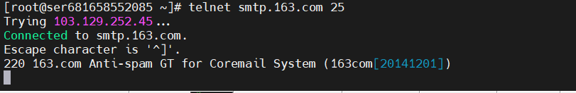  
端口测试完毕后，开始安装 docker，这里使用官方脚本一键安装如下：

```php
curl -fsSL https://get.docker.com | bash -s docker --mirror Aliyun
```

出现如下提示，说明安装成功：  
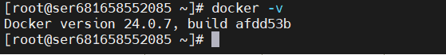  
然后需要购买一个具有迷惑性的域名，用来降低企业员工的警惕心，可以到 godaddy 上购买一个，也不贵，购买成功以后，需要配置如下域名解析：  
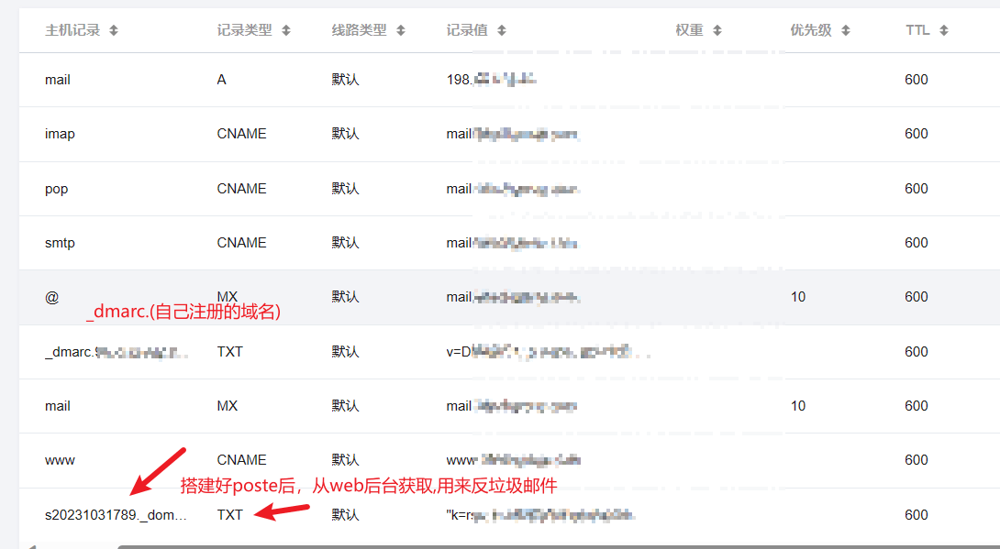  
需要注意的是，除了第一个 A 记录为 IP 地址，其他记录大部分记录为 mail.(自己购买的域名)，倒数第四个的记录值为`v=DMARC1; p=none; pct=100; rua=mailto:dmarc@xxxxx.com(自己购买的域名)`，最后一个需要搭建好 poste 后从 web 后台获取。  
以上都准备完成后，开始搭建 poste，非常简单，只需要如下一条命令即可，然后等待几分钟即可搭建完成，命令如下：

```php
docker run \  
    -p 25:25 \  
    -p 80:80 \  
    -p 110:110 \  
    -p 143:143 \  
    -p 443:443 \  
    -p 587:587 \  
    -p 993:993 \  
    -p 995:995 \  
    -v /etc/localtime:/etc/localtime:ro \  
    -v /opt/poste/data:/data \  
    --name "sometimesnaive" \  
    -h "mail.xxxxx.com" \  
    -t analogic/poste.io
```

**注意：倒数第二行需要修改为自己购买的域名**，跑起来以后，直接 ip 访问即可。  
WEB 控制台  
[https://xx.xx.xx.xx](https://xx.xx.xx.xx/)  
邮箱后台  
[https://xx.xx.xx.xx/webmail](https://xx.xx.xx.xx/webmail)  
第一次访问 WEB 控制台需要设置账号密码，然后登陆成功如下：  
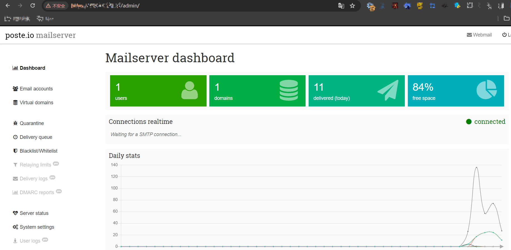  
在上文说到有一个 TXT 的解析记录需要到 Web 控制台来生成，用来反垃圾邮件如下：  
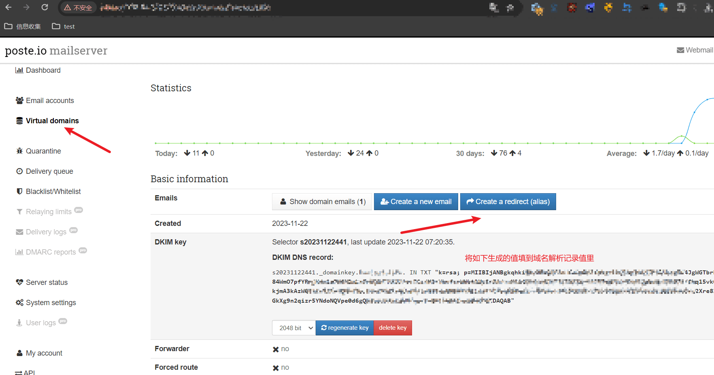  
然后登陆邮箱后台来测试收发邮件，先给 qq 邮箱发一份，发送成功如下：  
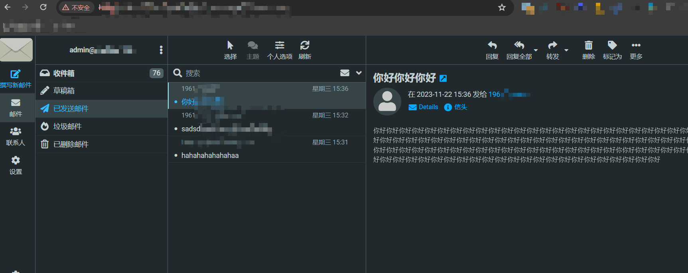  
qq 邮箱成功收到邮件如下：  
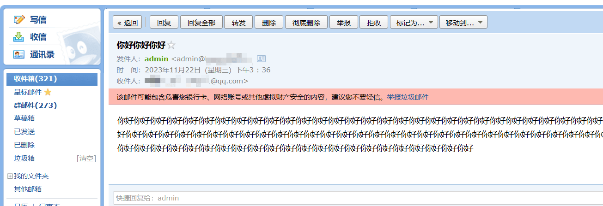  
邮件服务器搭建成功，接下来搭建钓鱼平台 Gophish，建议钓鱼平台和邮件服务器分开，使用两台服务器。

### 搭建钓鱼平台 Gophish

选择 Gophish 搭建钓鱼平台，主要是 gophish 自带 web 面板，对于邮件编辑、网站克隆、数据可视化、批量发送等功能的使用带来的巨大的便捷。(重要的是其数据可视化模块，方便书写报告)。  
Gophish 项目地址：[https://github.com/gophish/gophish](https://github.com/gophish/gophish)  
Gophish 官网地址：[https://getgophish.com/](https://getgophish.com/)  
搭建起来也比较简单，同样是 docker 跑起来，运行如下命令：

```php
docker pull gophish/gophish
```

然后运行 Gophish 如下：

```php
docker run -it -d --rm --name gophish -p 3333:3333 -p 8003:80 -p 8004:8080 gophish/gophish
```

跑起来后通过`docker logs gophish`命令可以看到密码，然后访问 3333 端口，第一次登陆会让重新更新密码，登陆成功如下：  
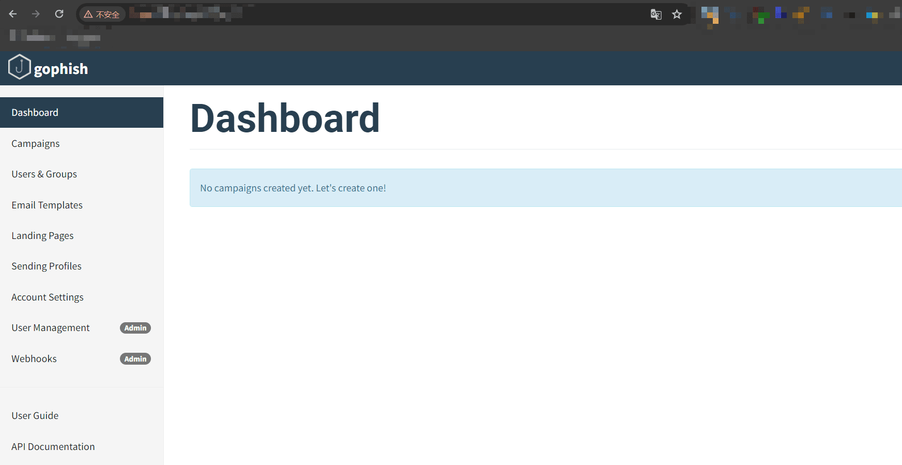  
然后联动之前搭建的邮件服务器如下：  
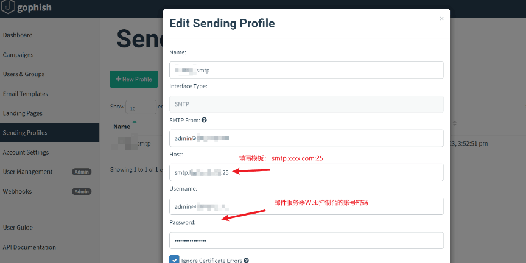  
点击测试发信，邮箱成功收到测试邮件如下：  
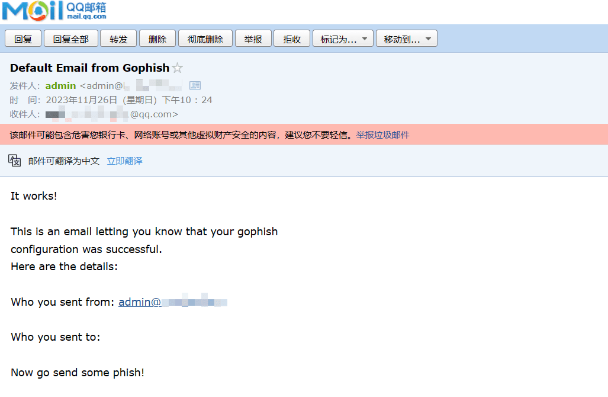

### 目标邮箱获取

通过对目标企业外网信息收集，发现一处 springboot 信息泄露，下载到 heapdump，获取到大量该企业邮箱如下：  
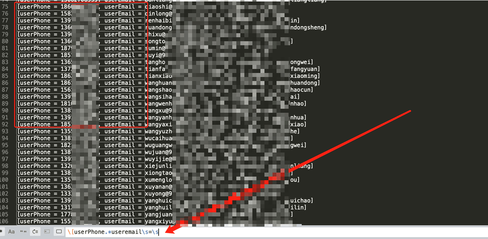

### 邮箱模板/网站模板制作

通过调研，发现该企业使用的为某讯企业邮，通过此信息，构造异地登陆邮件模板如下：  
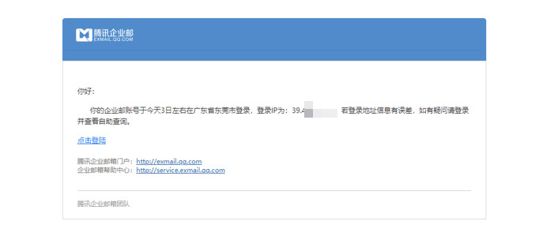  
点击登陆后跳转到伪造的钓鱼页面，然后获取员工的敏感信息。这里涉及到钓鱼页面的制作，Gophish 提供了一键导入功能，但是有些页面直接导入会出现乱码问题如下：  
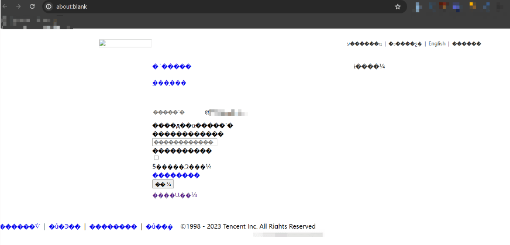

所以，这里需要使用到一些扒网站工具，或者一些浏览器插件来完成，这里选择使用浏览器插件`Save Page WE`，会将网页直接保存成 HTML，然后本地打开，需要将 form 表单的 action 清空如下：  
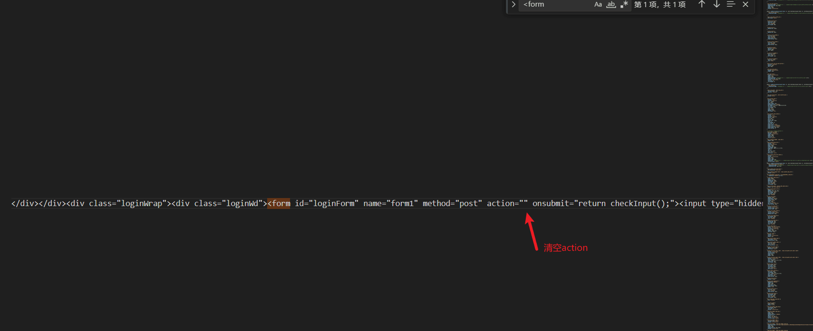  
然后将 HTML 文件复制到 Gophish 再次查看页面，发现已经正常，非常逼真如下：  
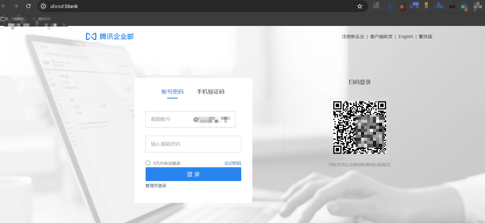  
直接发信测试，发现已经有员工上钩，输入了相关数据如下：  
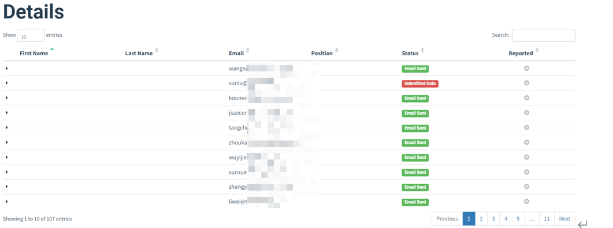  
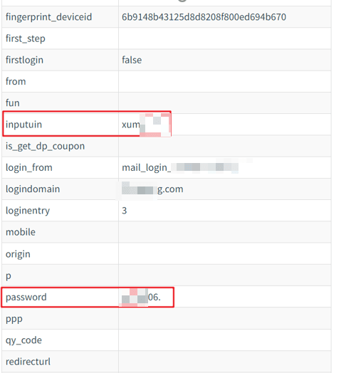

### 邮件制作附件捆绑木马

由于上面通过钓鱼页面获取员工敏感信息，**没有控制发信频率，导致后面大部分邮件都进入垃圾箱**，上钩人数并不多，导致数据不好看，直接提交报告无法满足客户要求，所以现在将从另一个角度继续发送钓鱼邮件，而本次不再获取敏感信息，**而是精心构造邮件主题并附件携带木马**，控制员工电脑终端。

#### 精心构造钓鱼邮件

附件携带木马，这样就不用再制作钓鱼页面，只需要构思一个好的钓鱼邮件模板，引起受害者关注，主动下载附件木马并运行，这里通过思考，决定使用调薪话术，然后借助 chatgpt 生成美化源码如下：  
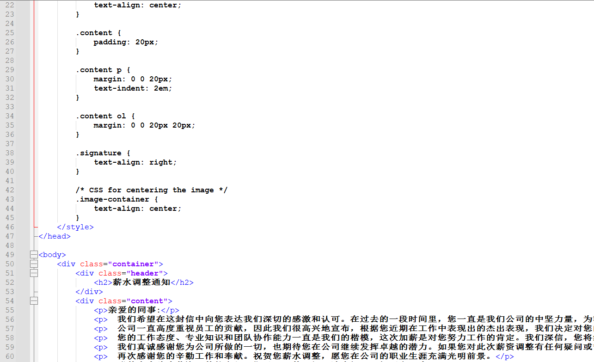  
具体成品如下图：  
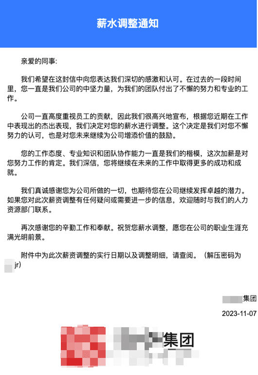

#### 附件木马免杀制作

另外的一个主要工作就是免杀木马制作，由于 CS 已经被各大杀毒软件快分析烂了，自写加载器也是只能免杀一会儿，然后就被拉小黑屋了，所以经过调研，决定使用另外一款开源 C2 产品 Havoc，因为它目前用的人比较少，且支持生成 shellcode，在写个加载器免杀性比 CS 强很多。  
地址为：[https://github.com/HavocFramework/Havoc](https://github.com/HavocFramework/Havoc)  
并且有比较详细的搭建分档，为避免篇幅太长，这里不详细写搭建过程了，各位看官直接看文档一步步来即可。  
编译好客户端运行如下，和 CS 操作很类似。  
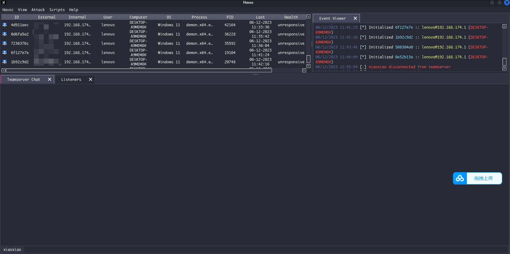  
做好免杀马之后，还需要考虑一个问题，**那就是如何绕过邮件网关**，前面我们已经知道客户使用的是某迅企业邮，**而某迅企业邮，只需要双层压缩，最外层设置密码即可绕过**。现在先自测发现木马免杀且可以正常上线如下：  
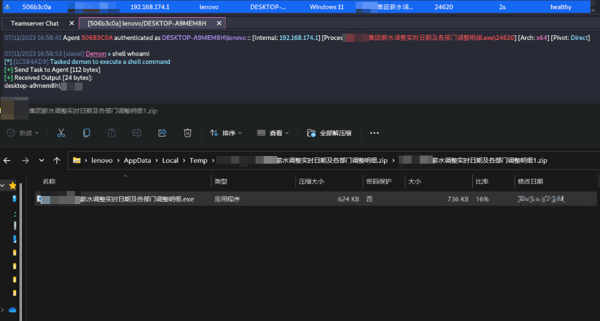  
开始使用 Gophish 进行批量发送，**Gophish 支持设置时间段发送，这样可以降低发信频率，从而降低进入垃圾箱概率**。发信结果如下：  
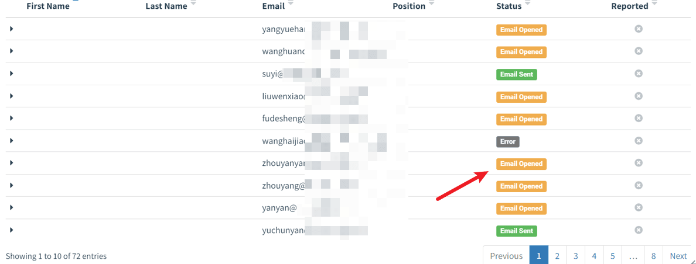  
大部分员工会点击查看邮件，这次效果不错，最终有 6 人双击附件，控制其终端，对其中一台执行命令如下：  
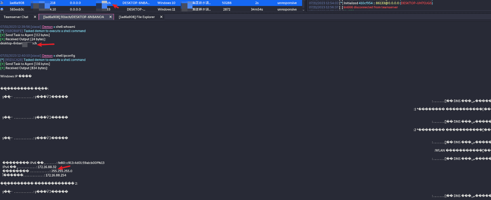

### 最终成果

本次钓鱼专项，共发送 269 封钓鱼邮件，**其中共计 65 次钓鱼邮件被打开，2 次员工信息输入，6 次鱼附件木马被运行**。详细图如下：  
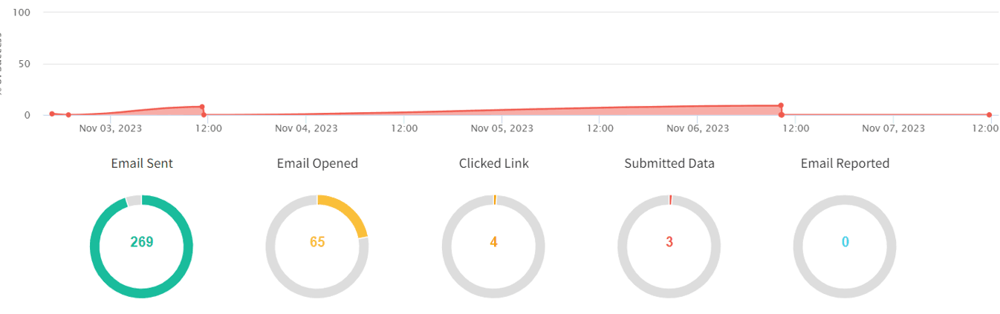

### 总结

#### 安全意识测评总结

在收到钓鱼邮件/短信时，大多数是抱着好奇的心态进行点击链接，然后跳转到钓鱼页面，输入个人信息，导致个人信息造成泄露。在日常和定期的安全意识培训中，应反复和员工强调，尤其是新入职的员工，对于来历不明的邮件，USB 设备等，在无法确认来源是否可信的情况下，要及时进行上报，不能擅自进行点击或者使用，避免个人信息造成泄露，甚至对公司资产造成损失。

在安全意识方面的工作应当形成定期培训，日常测试的机制，以及相关的制度等。对关键系统的关键管理人员应当提出更高的要求，对于邮件、USB 设备，陌生电话等，都应该提起足够的重视，凡是涉及个人信息或者公司信息的，都应该保持足够的警惕。

#### 攻击防范建议总结

识别钓鱼邮件的主要方法如下：  
1、看发件人地址。如果是公务邮件，发件人多数会使用工作邮箱，如果发现对方使用的是个人邮箱帐号或者邮箱账号拼写很奇怪，那么就需要提高警惕。钓鱼邮件的发件人地址经常会进行伪造，比如伪造成本单位域名的邮箱账号或者系统管理员账号。

2、看邮件标题。大量钓鱼邮件主题关键字涉及“系统管理员”、“通知”、“订单”、“采购单”、“发票”、“会议日程”、“参会名单”、“历届会议回顾”等，收到此类关键词的邮件，需提高警惕。

3、看正文措辞。对使用“亲爱的用户”、“亲爱的同事”等一些泛化问候的邮件应保持警惕。同时也要对任何制造紧急气氛的邮件提高警惕，如要求“请务必今日下班前完成”，这是让人慌忙中犯错的手段之一。
