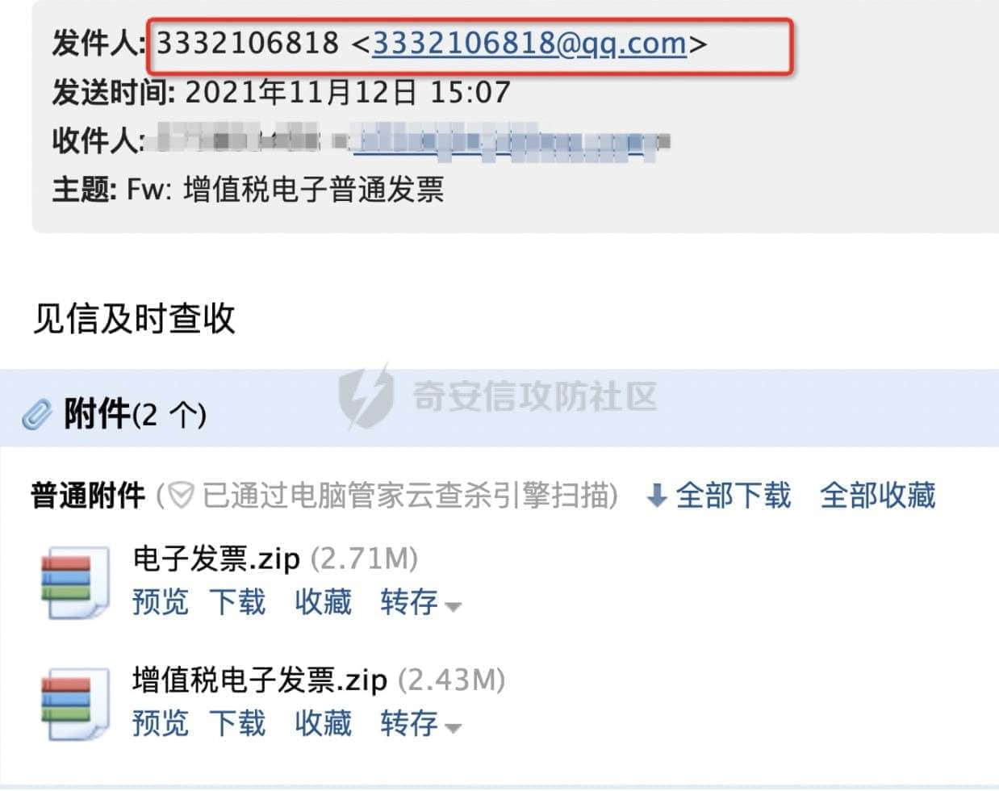
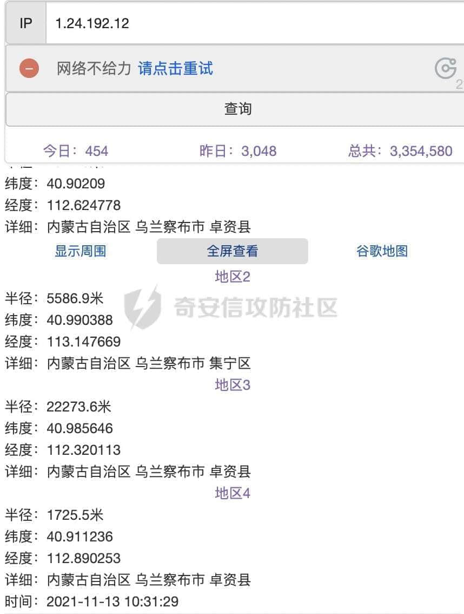
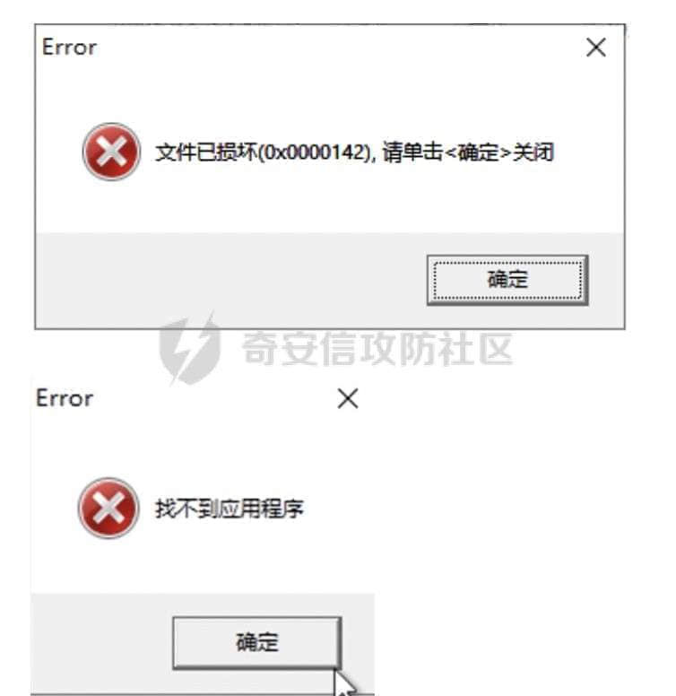
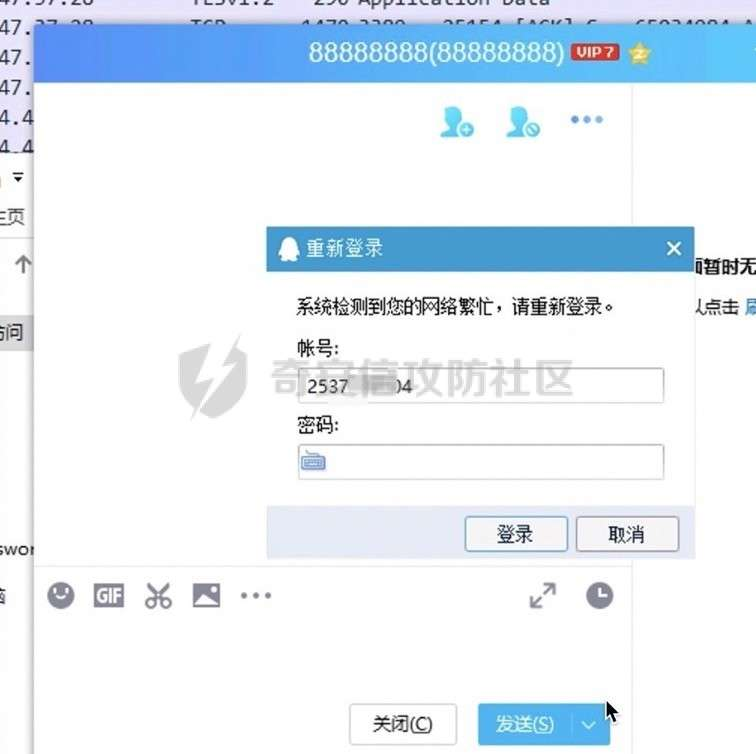
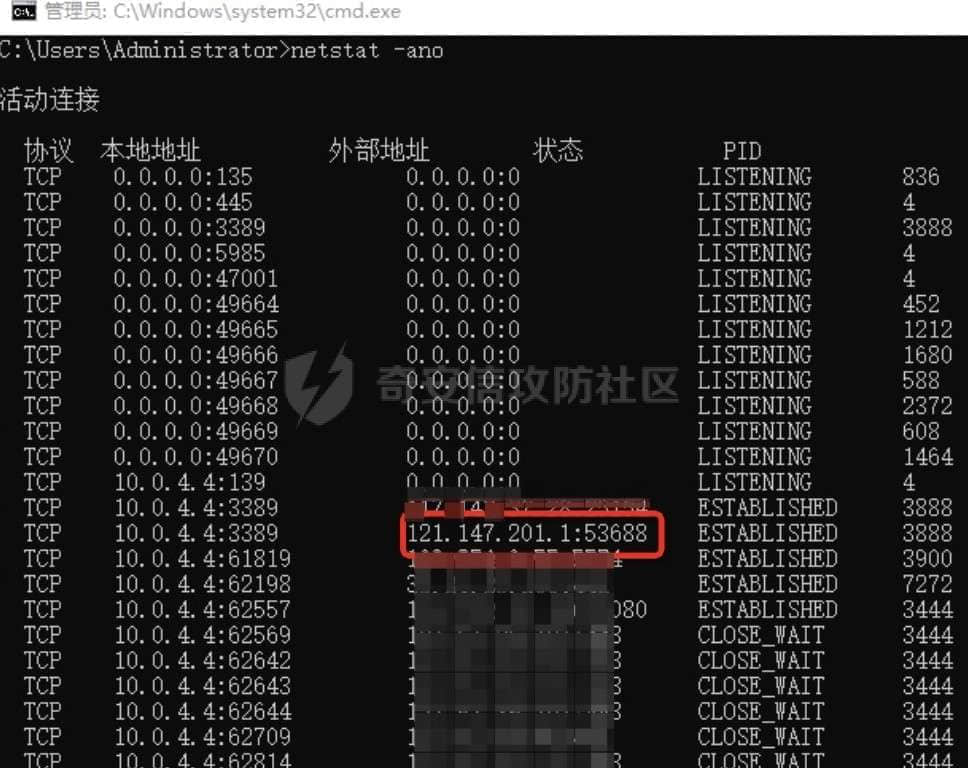
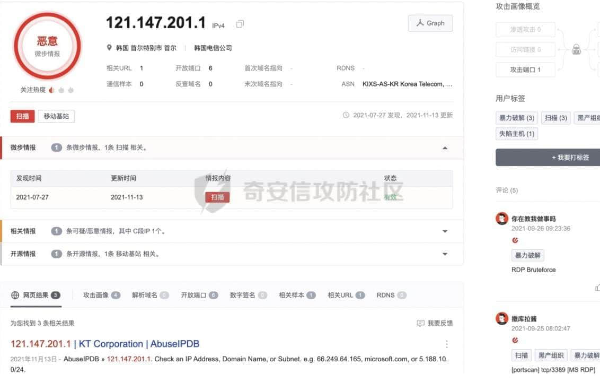
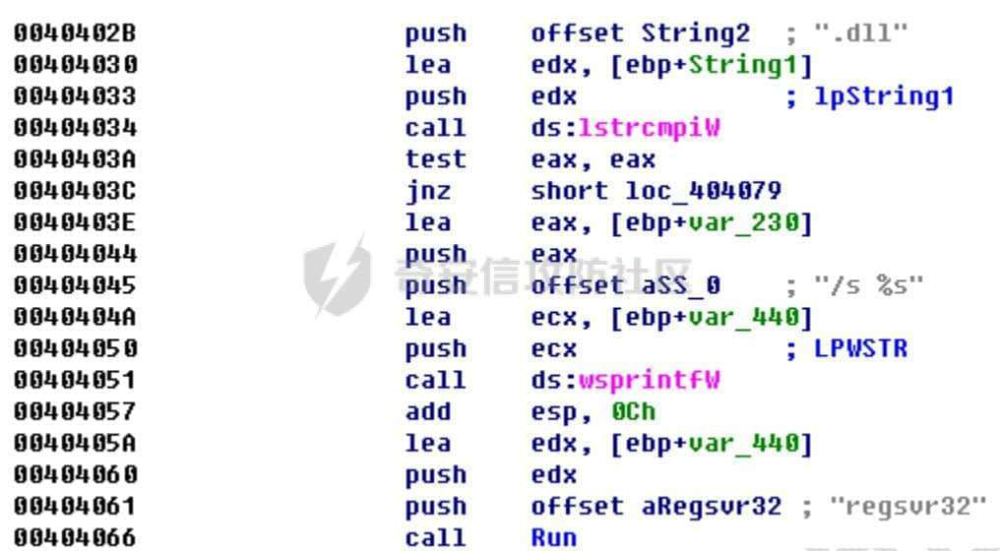
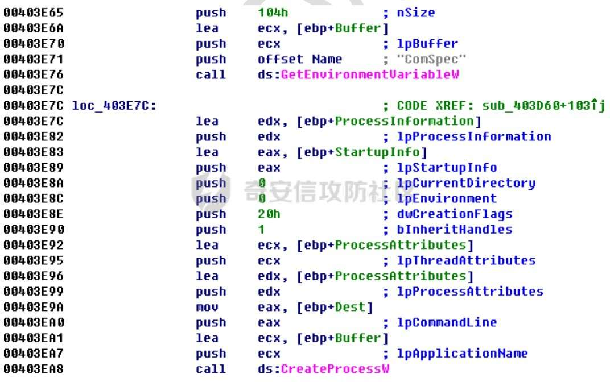
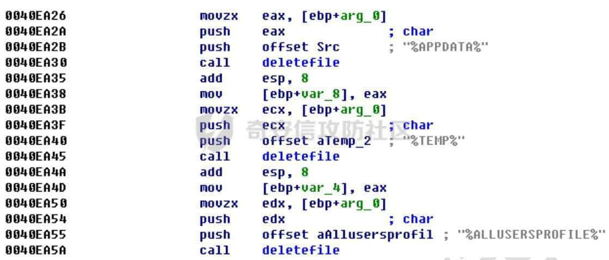
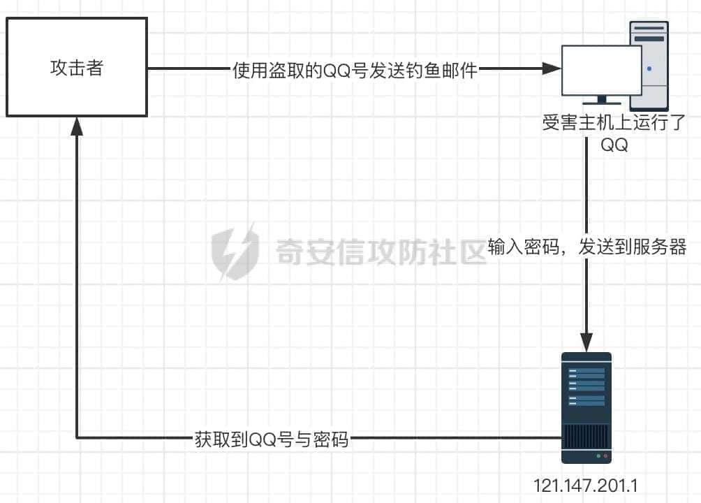

# 奇安信攻防社区 - 应急响应之钓鱼邮件

### 应急响应之钓鱼邮件

自电子邮件发明以来，网络钓鱼攻击一直困扰着个人和组织。钓鱼邮件攻击是黑客用来渗透受害者帐户和入侵网络的最常用方法之一。黑客会利用一些热点事件，比如新冠病毒疫情、娱乐八卦、春节假期等重大事件，精心构造了一封足够真实的钓鱼邮件，我们越希望了解最新动态，就越容易提高网络钓鱼攻击的成功率。在钓鱼邮件中，黑客会让受害者试图点击或重定向到一个具有欺骗性的钓鱼网站，欺骗用户输入敏感信息，泄露帐户密码。

## 前言：

前几日接到一个关于钓鱼邮件的应急响应任务，某公司的一名 HR 收到了一封主题为《增值税电子普通发票》的钓鱼邮件，并运行了附件中的带毒 exe 文件，之后才意识到问题的严重性，上报了他们公司的信息部门，然后请求我司派技术人员赶往现场。

## 处置：

1、提前在电话中与客户沟通情况，先让其将电脑网络关闭，避免再出现一些其它问题。  
2、在去往现场的路上，思考可能是什么情况，对于钓鱼邮件附件绑定的木马无非就那几种，远程控制木马、密码发送木马、键盘记录木马、代理木马。  
3、到达现场后，首先使用了安全软件对电脑进行了病毒快速查杀，但并没有报毒。  
[](https://shs3.b.qianxin.com/attack_forum/2021/11/attach-ac2df1e0ef8fd9ba6836d8063eeec4f9d813f882.jpg)  
又使用了全盘扫描，由于时间较长，就放在后台扫描，期间查看了其它情况。  
4、查看钓鱼邮件，主题为《增值税电子普通发票》，正文为“见信及时查收”，有两个附件：电子发票.zip、增值税电子发票.zip，伪造得还是挺逼真，但是突然看到发件人是个 QQ 邮箱，心想这都能上钩？收件人也是 QQ 邮箱，对于企业进行的钓鱼攻击可能性降低一半。  
（tips:如果发件人邮箱是自建邮箱服务器，可以从域名下手，国内的 ip 信息一般都是要做备案的，不然用来做邮件服务器很容易被封）  
[](https://shs3.b.qianxin.com/attack_forum/2021/11/attach-cb112793a634ec6bdffeff47356eb657c187a380.jpg)  
5、搜索发件人的 QQ，发现是个顶着公司昵称的 QQ，根据上面的电话号码打电话过去，得知 QQ 号码已被盗（和我猜测的一样）。  
[](https://shs3.b.qianxin.com/attack_forum/2021/11/attach-9bc9e4b1c6e01bf9f495aefb78490fbcf6fb9085.jpg)  
6、查看邮件原文，查看发件人的 IP 地址。  
[](https://shs3.b.qianxin.com/attack_forum/2021/11/attach-c649f96153c8eaf2d3cd9b549c31538d7ef351eb.jpg)  
X-Originating-IP 即为发件人 ip 地址。  
[](https://shs3.b.qianxin.com/attack_forum/2021/11/attach-3968f41ec2ee0b247ca6596769bdb44348df75bf.jpg)  
查询后发现是一个动态 ip。  
[](https://shs3.b.qianxin.com/attack_forum/2021/11/attach-92e79e856c7e1735be62db1f021d5dc7bb137e44.jpg)  
定位在内蒙古自治区 乌兰察布市 卓资县。  
[](https://shs3.b.qianxin.com/attack_forum/2021/11/attach-4e6f80d14d50addb6c12c4a3ddc4724dc4427c3e.jpg)  
7、此时全盘文件扫描结果出来了，也没有报毒，这就很奇怪了（提示的一个病毒是正常软件被当作了病毒，杀毒软件的日常骚操作）  
[](https://shs3.b.qianxin.com/attack_forum/2021/11/attach-fed41edc9f57b6a91cd038e9ed54266fc315681d.jpg)  
8、将木马文件放到沙箱中运行，也没有报毒。  
[](https://shs3.b.qianxin.com/attack_forum/2021/11/attach-853e5e1c05071c5866caf92b368dd663a7964868.jpg)  
意味着要么这个文件是正常的，要么就是这个木马很牛逼（有些木马可以识别是否是沙箱），例如 Neutrino 家族，他们的木马文件中有许多有很多反沙箱反调试的检测代码，

```php
利用 IsDebuggerPresent 检测是否为调试器
利用 CheckRemoteDebuggerPresent 检测是否为远程调试器
检测用户名称是否包含这些字符串：MALTEST、TEQUILABOOMBOOM、SANDBOX、VIRUS、MALWARE
检测当前进程路径是否包含\SAMPLE、\VIRUS、SANDBOX
检测磁盘是否小于 10G，首先打开\\.\PhysicalDrive0，随后调用 DeviceIoControl 向其发送控制码 IOCTL_DISK_GET_LENGTH_INFO，小于 10G 也退出进程。
```

Neutrino 主要通过以上方式进行反沙箱反调试检测，希望我碰到的不是这类病毒。  
9、将电脑连接上手机热点，查看流量（netstat -ano）、进程（windows 任务管理器）也都未发现问题。  
[](https://shs3.b.qianxin.com/attack_forum/2021/11/attach-4f165ee9ce5c269f4d5ee2e24a427d9e488c3fe6.jpg)

使用 wireshark 抓包，也未发现异常流量。  
10、只能先将电脑上的木马文件删除，并将电脑关机，使用主机安全软件对全公司的主机进行了病毒查杀，但也都未发现问题。于是我开始对附件进行了研究。

#### 小结：

当遇到关于钓鱼邮件的应急演练时，可以按照以下顺序来进行。  
1、先对需要处理的事件现场情况进行详细的了解，先将受害主机进行断网关机处理，如果有主机安全管理设备，先对所有主机资产进行病毒查杀。  
2、查看发件人的邮件名，如果是自建的邮件服务器，可以查询域名 IP 备案信息等，扩大信息收集面。  
3、通过查看邮件原文，查看发件人的 IP 地址，在威胁情报系统上进行查询。  
4、上机排查： 
a、`Netstat -ano(windows)/netstat-antpleu(linux)`查询外联  
b、记录有问题的进程 PID，使用`tasklist /svc/fi “PID eq pid” (windows)/ ps aux | grep pid(linux)`，定位到进程  
c、`wmic process get name,executablepath,processid|findstr PID`查看进程对应的文件路径

## 研究：

1、将两个 exe 文件放在我的虚拟机内运行，提示文件已损坏，然后提示找不到应用程序，其实这是这种带毒文件的管用伎俩，其实木马已经在运行了。  
[](https://shs3.b.qianxin.com/attack_forum/2021/11/attach-257a9bcf5fa353b2cd439ebca1da2def8bb8a422.jpg)

2、但是查看进程并没有问题。开始我看到有两个文件，以为是子母木马（简单来说就是将一个木马分成两个，一个作为启动器，启动另一个木马。在制作免杀木马时经常使用这种技术，将木马分离为子母两个，将 shellcode 使用加载器，加载到内存里面执行）这里来看并不是。  
这里讲解两个比较知名的子母木马：vbs+shellcode 和 Delphi + Shellcode。  
vbs+shellcode：这类 Loader 的最外层是 VBS 编写的 Loader，VBSLoader 负责将内层的自解压包形式的 shellcode loader 解密出来并启动，之后 shellcodeloader 负责将真正的 PE 解密出来并注入到傀儡进程中执行。  
Delphi + Shellcode：这种 Loader 不再是简单的将两种不同语言的 Loader“糅合”在一起。而是更加体现出了一种“组合攻击”的迹象，即：同一个 Loader 可释放两种及以上木马;经历了至少两个以上的阶段，才释放了最终的木马。这类 Loader 同样也是自解压包。自解压包中包含两个文件，一个为解压后需要执行的 exe 文件，另一个是名为 x 的二进制文件，攻击过程如下图所示。  
[](https://shs3.b.qianxin.com/attack_forum/2021/11/attach-686a9e5c916b091de7073b8b54fb2c3b716cc225.jpg)  
[](https://shs3.b.qianxin.com/attack_forum/2021/11/attach-b2b213acf124efb514112b4c04a7d03aca009c26.jpg)  
3、这时我认为木马可能设置的有定时任务，会在半夜执行，于是打开了一个流量设备进行监控。  
4、同时准备使用 ILSpy 对 exe 文件进行反编译，但是失败了，可能是加壳了，只能看流量设备能不能半夜捕获到一些异常流量  
[](https://shs3.b.qianxin.com/attack_forum/2021/11/attach-9223ad86eb8c6b86c8e4c5f01bc0c663e817e4ff.jpg)  
5、第二天一大早就兴奋的去打开虚拟机查看情况，但可惜的是并未有异常流量，这时我有些蒙了。  
6、过了一段时间，看着“找不到应用程序”的提示，我好像悟了，看到受害者的 8 位数 QQ 号更坚定了我的猜测，我在虚拟机中下载了个 QQ，然后运行文件，果然不提示“找不到应用程序”了，然后我登录了我的 QQ 小号，又运行了木马文件，此时出现了一个对话框  
[](https://shs3.b.qianxin.com/attack_forum/2021/11/attach-6eb24b827f7c68fe522854d1b204125025137043.jpg)  
原来如此，是个盗取 QQ 密码的，并不是针对企业进行的攻击。沙箱运行没有报毒也可以解释了，沙箱里面没有。  
7、查看 wireshark，发现可疑流量，与 121.147.201.1 进行通信  
[](https://shs3.b.qianxin.com/attack_forum/2021/11/attach-04e84f09e1fe8ed97f579fb644f931e4be35f5b9.jpg)  
查看进程，发现可疑进程  
[](https://shs3.b.qianxin.com/attack_forum/2021/11/attach-ac813fdc6d54297905528ffa6353e8cfc787a657.jpg)  
通过威胁情报平台查询，发现是恶意 IP  
[](https://shs3.b.qianxin.com/attack_forum/2021/11/attach-c864b7a623a46261f21877f76a22c927175df0d1.jpg)

#### 小结：

当对木马病毒文件分析时，注意以下几点：  
1、一定要把木马放在虚拟机上运行，并且做好隔离；  
2、可以使用反编译软件如 ILSpy 对木马文件进行反编译；  
3、在反编译后的代码中寻找以下危险函数：  
a、loader(加载动态库或启动其他程序)：下载指定地址的文件到本地，如果下载的是 dll，则调用 regsvr32 加载。  
[](https://shs3.b.qianxin.com/attack_forum/2021/11/attach-9600bfac26dc3f89c9a2addf523b55dfb2cbfdc3.jpg)  
b、findfile(查找文件)：在本地磁盘查找指定文件，找到后上传该文件到 C&C 服务器。  
[](https://shs3.b.qianxin.com/attack_forum/2021/11/attach-96e3cdcedf310723149bc8fea9c0ed033731ee2b.jpg)  
c、cmdshell(启动 cmd)：在本机开启一个简单的 cmd 后门。  
[](https://shs3.b.qianxin.com/attack_forum/2021/11/attach-decd911c0324fd1c838bb4e499a9b0072107c260.jpg)  
d、botiller ( 删除其他僵尸网络文件)  
[](https://shs3.b.qianxin.com/attack_forum/2021/11/attach-80a2aece2122acc263205f26a5653b86e6746910.jpg)  
e、keylogger ( 键盘记录)：窃取并上传数据，主要是按键记录、剪贴板数据以及截屏。  
[](https://shs3.b.qianxin.com/attack_forum/2021/11/attach-04652c96b0c57889775313dfd7bd0ff2b71d8a70.jpg)  
f、挂钩主流浏览器 (firefox.exe、chrome.exe、iexplore.exe、opera.exe) 客户端进程的数据发送相关函数（如：PR\_Write、WSASend、HttpSendRequestW、send）：截取浏览器 post 表单数据，然后会按照 ff=1&host=%s&form=%s&browser=%s 形式把 Form 表单数据上传到 C&C 服务器。  
[](https://shs3.b.qianxin.com/attack_forum/2021/11/attach-702c706028c74197ba7cff01a327059014c050e5.jpg)  
g、挂钩常见的 FTP 客户端软件，对于 FTP 客户端登陆时，当检测到 USER 和 PASS 命令则把账号和密码记录下来，并上传到 C&C 服务器。ftp://%s:%s@%s:%d 形式把窃取的 FTP 凭证上传到 C&C 服务器  
[](https://shs3.b.qianxin.com/attack_forum/2021/11/attach-6af618aa3a3227e47e6a36023d7645c7200815bc.jpg)

## 总结：

事件整体分析流程：  
[](https://shs3.b.qianxin.com/attack_forum/2021/11/attach-f6a9d455fc6c49e76973c5669ea5166b65839952.jpg)  
钓鱼邮件防范措施：  
对公司来说：  
1) 组织员工进行钓鱼邮件防范培训，提高全员网络空间安全防范意识;  
2) 在公司内部不定期进行钓鱼邮件安全测试，及时发现问题并采取补救措施;  
3) 使用高安全性邮件系统，并及时配置安全过滤机制;  
4) 敦促员工安装杀毒软件，并及时更新病毒库。 
对个人来说：  
1) 认真学习 CNCERT 发布的《钓鱼邮件攻击防范指南》，做到“五要”“五不要”，增强安全防范意识;  
2) 不要轻信发件人地址显示的“显示名”,遇到索要敏感信息的邮件需要及时通过电话核实;  
3) 切忌轻易打开邮件中文中的短链接，谨防上当受骗，造成财物损失;  
4) 安装杀毒软件，邮件附件运行前先进行病毒查杀。
