# 奇安信攻防社区 - 手把手掌握 - 弱类型比较漏洞

### 手把手掌握 - 弱类型比较漏洞

有配套独立讲解视频，后续发出

# 弱类型比较漏洞

# 第 1 掌：漏洞原理（！理论必过）

## 0、什么是比较判断（开发视角下）

比较、判断，是开发当中及其常见的行为，这个行为往往决定了，程序是否可以继续下一步执行

尤其是在做身份判断、行为判断的时候，比较尤为重要，比较成功也就意味着信任，信任也是风险的开始，突破程序执行的逻辑

举个例子：  
1、注册功能比较：是否注册过该账号？如果没有注册过才能够注册，否则就提示已经注册  
2、会员身份比较：是否是会员？如果是会员才能观看，否则提示充值会员  
3、是否付费比较：是否付费？如果付费了就没有广告，否则间歇性出现广告

‍

## 1、什么强弱类型比较

注意：类型这里指的是数据类型，比较肯定是正常用户使用过程当中所需要的比较，  
而开发过程中，用户功能，能用到的类型，无非整型和字符型，所以比较无非两种类型的比较。

1.  所谓弱类型比较：  
    主要是因为 PHP 的自由度过高，在数据之间进行比较时，  
    如果类型不同，那么会自动转化成为相同的类型再进行比较（数据值）。
    
    因为比较这个行为，都是在相同类型数据之间产生的， ----重点：开发者的角度、用户的角度
    
    所以编写这门语言的人，为了避免正常用户的误操，导致程序崩溃，所以在进行比较时，PHP 语言为了保险起见，会自动将类型转换成为同一种类型，之后再进行比较。从编写这套程序语言的人来说，是为了开发人员更加便利的使用，让使用体验变得更好，
    

截止目前，这都是编写这套程序语言的比较逻辑，还不能称之为“弱类型比较”，只能被称之为一门程序语言的比较逻辑。

随着，该门语言的使用变得愈加广泛，该比较逻辑，就被有心人加以利用，最后成为了一门  
攻击手法、技巧、方式。在不同的比较位置，危害也随之不同。 ---危害

2.所谓的强类型比较：  
强类型比较的特点，必须人为的强制转换类型才能改变类型，  
强类型比较的比较方式，先比较类型，类型是否一致，然后才开始比较数据内容

题外：至于类型比较，不过是该语言逻辑，被有心之人利用以后，才被发明出来的词汇，对于开发和用户而言，比较永远都是数据比较。根本不会区分什么类型比较，什么强弱比较

提前预告：弱类型比较，在不同的场景下，同一个数据，有可能代表不同的意义，时而真时而假

‍

## 2、强弱比较区别（重点）

‍两个== 和 ===三个 的区别

强类型比较：===  
强类型比较在进行比较的时候，会先判断两种字符的类型是否相等，在比较数值

弱类型比较：==  
弱类型比较在进行比较的时候，会先将字符串类型转换成相同的类型，再比较，中间有一个强转的过程（优先转换为数字类型）---重点

如果比较一个数字和字符串 或者 比较涉及到数字内容的字符串，  
\----重点则首个字符串值会被转换成数值，并按照数值来进行比较  
‍

# 第 2 章：场景划分（实操训练）

## \== 两个等号 弱类型比较

### 核心：比较逻辑

字符串的开始部分决定了它的值，如果该字符串以合法的数值开始，则使用该数值，否则其值为 0。

```php
 <?php
     var_dump("admin"==0); //Ture
     var_dump("2admin"==1); //Flas
     var_dump("admin" == 2);//Flas
     var_dump("admin" ==0);//True
     var_dump("0e123456"=="0e654321");//True
```

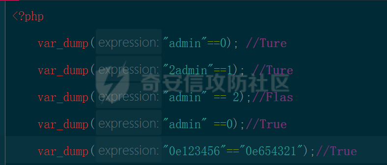

### 1、和布尔型比较

总结：在布尔值之间进行比较的时候，  
0 和 '' 空字符串，都代表 false  
`'     '`，非空的字符串，代表非 false

```php
 <?php
     var_dump(0==false);//Ture
     var_dump(''==false);//True
     var_dump('     '==false);//False 有空格意味着非空
```

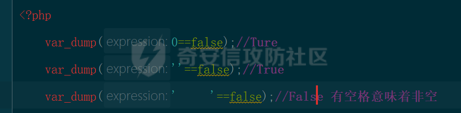

### 2、单引号 0 意味着等于空

思考：为什么会存在‘0’和 布尔值之间的比较

总结：'0' 字符串'0' "0"等于空等于 false

```php
 
<?php   
     var_dump('0'==false);//单引号零，意味着等于空‘’

     if(empty('0')){
         echo "kong";
     }else{
         echo '222';
     }
```

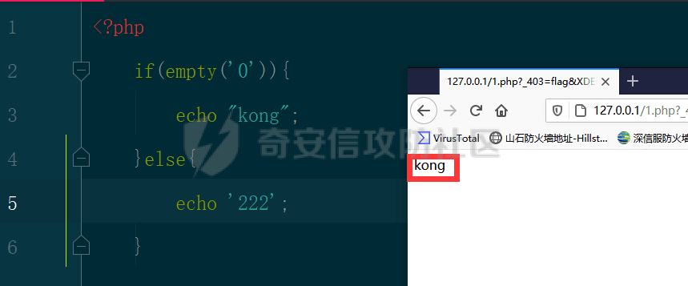

### 3、‘0’等于‘ ’二者又不相等

注意以前： ‘’引号里面没有内容，代表 false， ‘0’引号里面有个 0，也代表 false

奇怪的特性死记硬背

> 当‘0’单引号 0 和 别的数据相比较时，‘0’单引号 0 意味着等于‘’空 等于 false  
> 但是‘0’单引号和‘’空相比较时，他们二者又不相等

```php

<?php
var_dump('0'==false);//Ture   单引号‘0’意味着等于空，空等于 false，所以结果为 Ture
var_dump(''=='0');//False‘’这个也等于空，‘0’这个也等于空，但是二者相比较时，二者又不相等，所以结果为 False
```

```js
'0' == 0 //true  
'0'=='' //false
```

### 4、0e 开头的字符串比较 hash 值比较

在进行比较运算时，如果遇到了 0e 这类字符串，PHP 会将它解析为科学计数法。

PHP 它把每一个以”0E”开头的哈希值都解释为 0，

如果两个不同的数据参数值经过哈希以后，其哈希值都是以”0E”开头的，那么 PHP 将会认为他们相同，都是 0

```php
 <?php
 var_dump("0e1234" == "0e4567"); // true
 
```

参考：哈希值 0e 开头的，不同密码值

[https://blog.csdn.net/qq\_38603541/article/details/97108663](https://blog.csdn.net/qq_38603541/article/details/97108663)

> 0e 开头的 md5 和原值：  
> QNKCDZO  
> 0e830400451993494058024219903391  
> 240610708  
> 0e462097431906509019562988736854  
> s878926199a  
> 0e545993274517709034328855841020  
> s155964671a  
> 0e342768416822451524974117254469

### 5、0x 开头的字符串比较

**在进行比较运算时，如果遇到了 0x 这类字符串，PHP 会将它解析为十六进制**

所谓的弱类型比较漏洞，也就在在进行比较判断下一步执行行为的时候，可以利用该漏洞，实现一个  
最终结果为真的 一个 返回值

```php
 <?php
 var_dump("0x1046a" == "66666" ); // true
   
```

### 6、in\_array

重点：函数搜索 比较的时候，是有可能存在弱类型比较漏洞的

#### 6.1、源码

```php
<?php
header('Content-Type:text/html;charset=utf-8');
     $arr1 = array("hello","nihao","wohao") ;
     $brr1 = "hello";

     if(in_array($brr1,$arr1)){
         echo "在数组中";
     }else{
         echo "不在数组中";
     }
```

#### 6.2、语法

关键在于第三个参数：  
true 代表=== 强类型比较  
false 代表== 弱类型比较

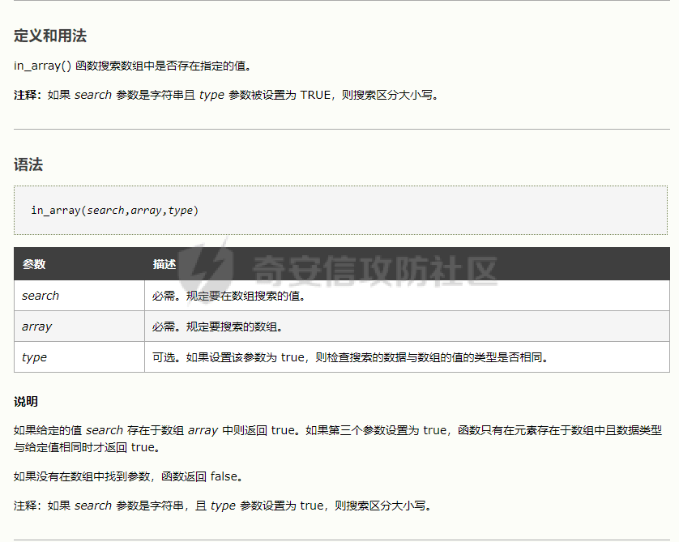

#### 6.3、实验理解

##### 第 1 次实验

结论：肯定匹配成功，意料当中，因为比较的参数值是 100% 一样的

第 1 次实验：在参数为 false 的情况下，两个相同的值，比较，是否在另一个值当中


##### 第 2 次实验

结论：肯定匹配成功，意料当中，因为比较的参数值是 100% 一样的

第 2 次实验：在参数为 true 的情况下，两个相同的值，比较，是否在另一个值当中

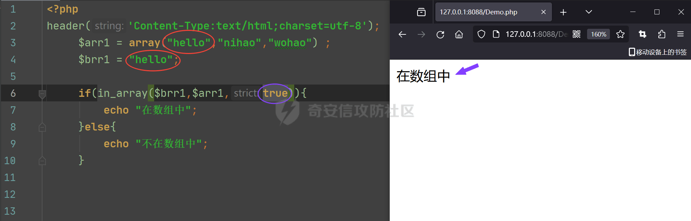

##### 第 3 次实验

```php
var_dump(&quot;admin&quot;==0); //Ture
```

结论：肯定匹配成功，因为比较类型 type=false，相当于==比较，所以 0 和任何字符串相等

第 3 次实验：在参数为 false 的情况下，两个不同的值，比较，是否在另一个值当中

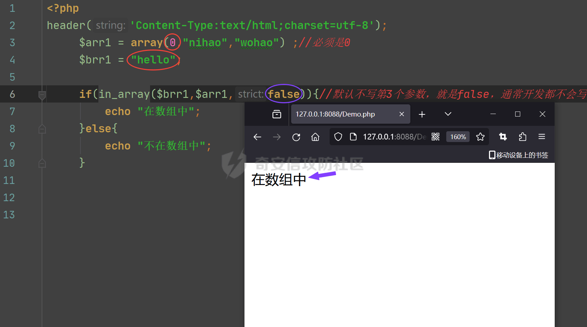

##### 第 4 次实验

结论：肯定匹配失败，因为，比较类型等于 true 相当于三个等号强类型比较，必须 100% 一致，才会成功

第 3 次实验：在参数为 true 的情况下，两个不同的值，比较，是否在另一个值当中

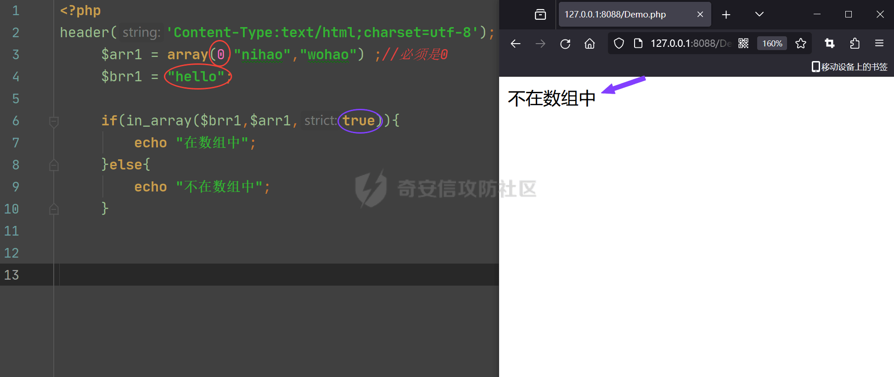

#### 6.4、类型比较表（略）

类型比较表：[https://www.cnblogs.com/zbligang/articles/12143102.html](https://www.cnblogs.com/zbligang/articles/12143102.html)

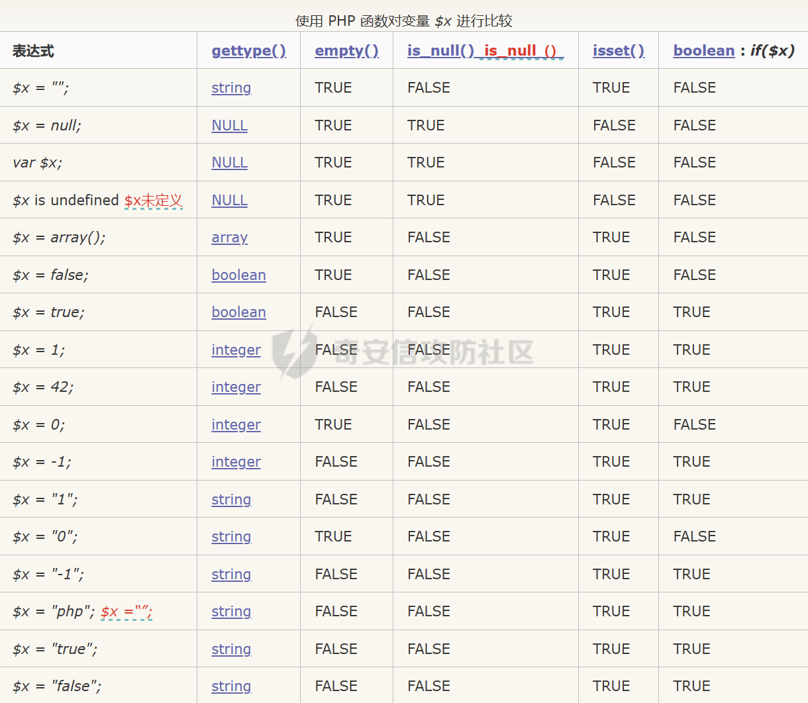  
‍  
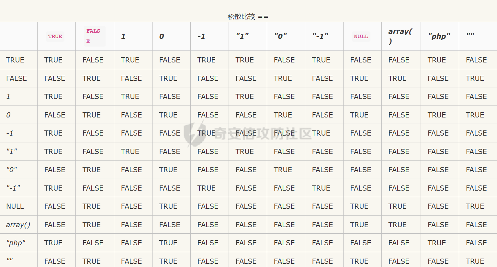

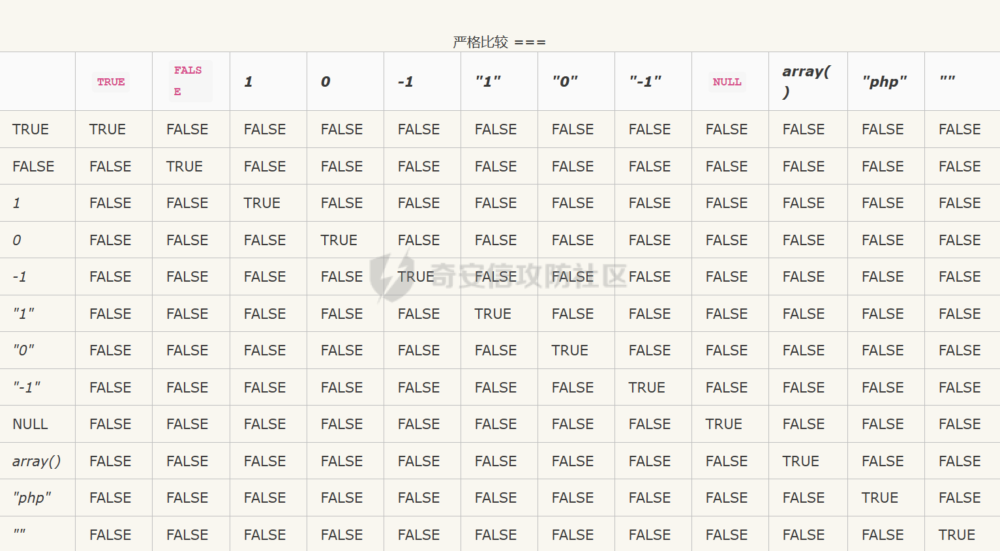

#### 6.5、结论实验（略）

```php
 //提示：关键在于第三个参数（为 true 先比较数据类型 且还区分大小写）
 <?php
 
 $a = "1 and 1=1";
 var_dump(in_array($a, array(0,1,2,3,4,5), true));//false
 var_dump(in_array($a, array(0,1,2,3,4,5)));//true
 
```

### 7、strcmp() 字符串比较 -Ascii 码

#### 7.1、语法

```txt
注意：此比较区分大小写
用途：比较括号内的两个字符串 string1 和 string2 的大小
语法：strcmp(string $string1, string $string2): int
返回：
            str1 等于 str2 时候，返回 0
            str1 大于 str2 时候，返回 1
            str1 小于 str2 时候，返回 -1

略记：strcmp -二进制安全字符串比较
```

#### 7.2、源码

注意：比较的值会转换为 ASCII 码进行比较 [最全的 ASCII 码对照表](https://blog.csdn.net/luolt42/article/details/132271911)

更多比较案例：参考官网[PHP: strcmp - Manual](https://www.php.net/manual/zh/function.strcmp.php)

在 5.3 及以后的 php 版本中，当 strcmp() 括号内是一个数组与字符串比较时，也会返回 0。

结论：进行字符串进行比较的时候，比较的是，第 1 个字符的值，第 1 个字符的值，决定了整个比较结果

进行比较的时候，只比较字符串，只比较 ascii 码，含有特殊意义的字符，也只会被认为是字符，并不会具有特殊意义

```php
<?php
    $a ='abc';
    $c = 'dbc';
    echo strcmp($a,$c);//-1<0    -1
    echo "<br>";

    $a ='abc';
    $c = 'Abc';
    echo strcmp($a,$c);//1>0   1
    echo "<br>";

    $a ='abc';
    $c = 'abc';
    echo strcmp($a,$c);//0=0  0
```

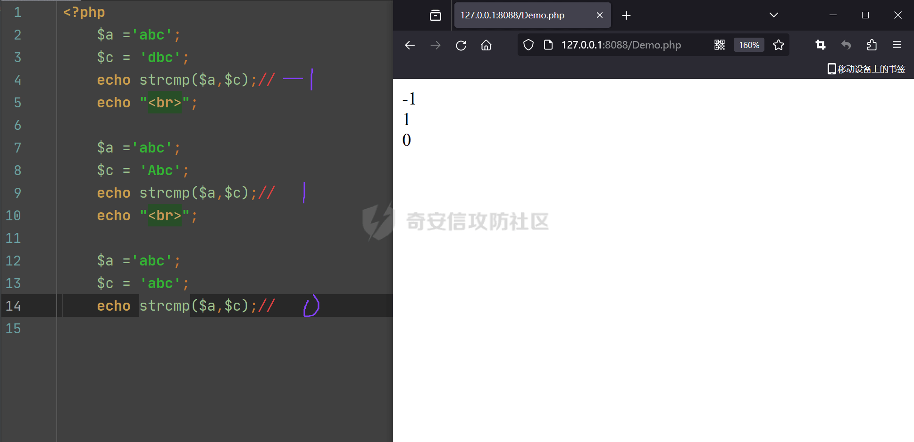

‍

### 8、MD5 比较--利用条件苛刻

注意：在进行 MD5 弱类型比较漏洞利用的时候，必须是对方也使用了 MD5(数组) 的情况下，才有可能利用成功

#### 8.1、语法

官方理解

用途：计算字符串的 MD5 散列值  
语法：md5(string $string, bool $binary = false): string

参数：  
参数 1：string  
要计算的字符串： 
参数 2：binary  
如果可选的 binary 被设置为 true，那么 md5 摘要将以 16 字符长度的原始二进制格式返回。

返回：以 32 字符的十六进制数形式返回散列值。

测试理解

但是当你传递一个 array 时，md5() 不会报错，只是会无法正确地求出 array 的 md5 值，返回 null，  
这样就会导致任意 2 个 array 的 md5 值都会相等。

#### 8.2、源码

```php
<?php
header('Content-Type:text/html;charset=utf-8');
    $a = array("abcde");
    $b = array("qwerio");
    if ($a != $b && md5($a) == md5($b)){
        echo '比较的值相等';
    }else{
        echo '比较的值不相等';
    }
```

‍

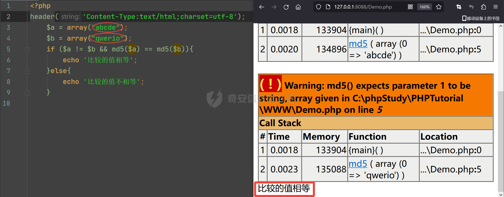

### 9、Json\_decode 相关的弱类型比较

注意：变量不变量并不重要，重要的是，我们可以通过 key，取到对应的值

#### 9.1、语法

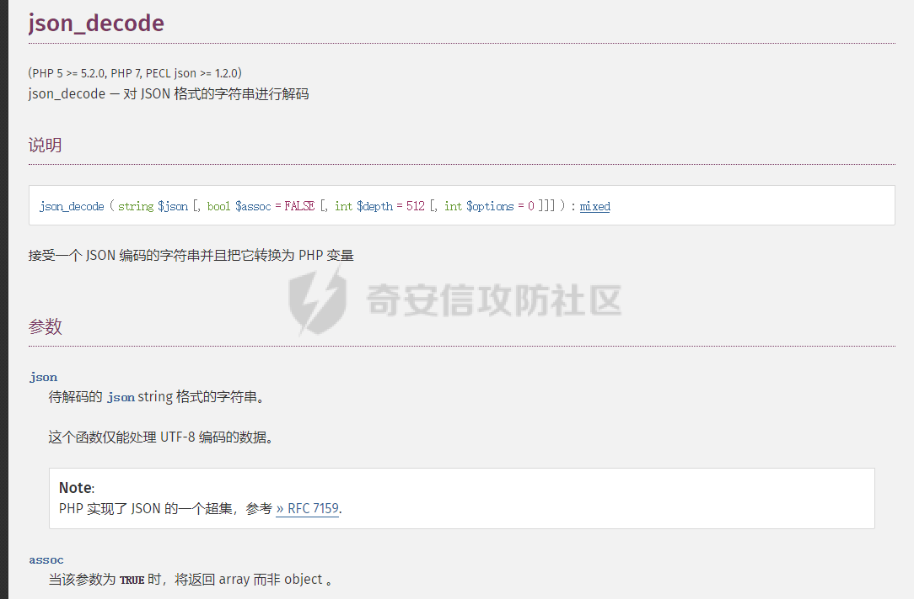

```js
//json_decode 变量存在的证明
<?php
    header('Content-Type:text/html;charset=utf-8');

    $a="ssss";//字符串类型的 4个s

    //$b="ssss" 
    //   {key1:value1, key2:value2,key3:value3}
    // 'xxx'  "xxx"
    //"{key1:value1}"  '{key1:value1}'
    $message = json_decode('{"b":"ssssb"}'); // object 对象
    if($a === $message->b)//"ssss"
    { //强类型证明变量 a 的存在
        echo "ok";
    }else{
        echo "no";
    }

//返回值：obj  和 array 的证明
    <?php
    header('Content-Type:text/html;charset=utf-8');
    $json_str = '{"a":1,"b":2,"c":3}';
    $ret =json_decode($json_str,true);
    var_dump($ret);
```

#### 9.2、源码

```php
<?php
header('Content-Type:text/html;charset=utf-8');
$a="ssss";//1、这是程序要比较的值，这个值对于攻击者而言是不可知的

if (isset($_GET['message']))//3、最终 payload message={"key":0}
{
    $message = json_decode($_GET['message']);//将 json 格式的 key value，转换成变量$key=value ==>  $message=sss
    if ($message->key == $a)
    {//2、但是没有关系，因为这里用的是两个等号，弱类型比较，只需要利用比较逻辑，就可以让其实现相等
        //也就是可以利用 0=="admin"这种形式绕过

        echo '你比较的值二者相等';//目的输出 ok
    }
    else{
        echo '失败';
    }
}
```

‍

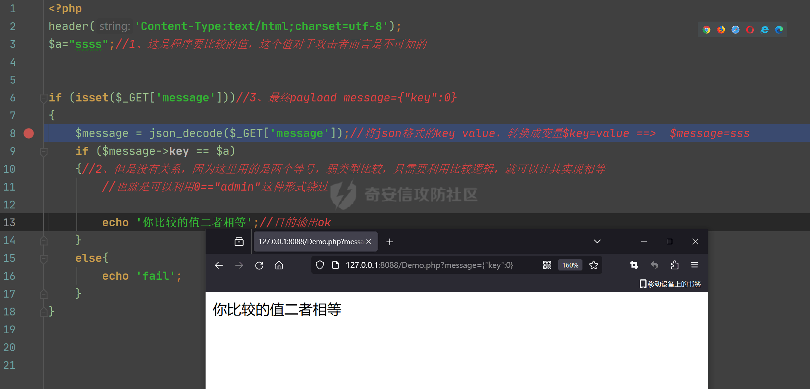

‍

### 10、Array\_search 弱类型

#### 10.1、语法

官方理解

用途：在数组中搜索给定的值，如果成功则返回首个相应的键名

语法：array\_search(mixed $needle, array $haystack, bool $strict = false): int|string|false

返回：如果找到了 needle 则返回它的键，否则返回 false  
参数：  
参数 1：needle  
待搜索的值  
注意：如果 needle 是字符串，则比较以区分大小写的方式进行。  
参数 2：haystack  
待搜索的数组  
参数 3：strict --默认一般开发不会写  
被指定为 true，则只有在数据类型和值都一致时才返回相应元素的键名 --- 强比较 相当于 100% 一致

array\_search() 函数在数组中搜索某个键值对的值，并返回对应的键名。

```php
<?php
$a=array("a"=>"red","b"=>"green","c"=>"blue");
echo array_search("red",$a);//$a是数组
?>
```

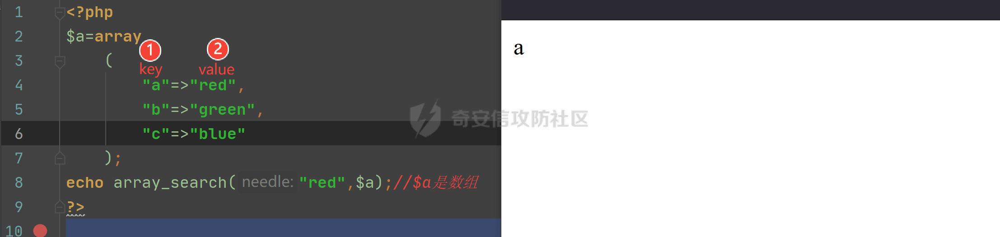

‍

#### 10.2、实验理解

##### 第 1 次实验

思考 1：如何通过搜索返回对应的 key，键名？

答案：之所以会返回对应的键名，原因在于，它内部做了一个比较行为

验证：经过验证这个比较还是一个“弱类型比较”--- 比较逻辑

‍

思考 2：为什么会有这么多的弱类型比较呢？

答案：原因在于 PHP 数据的类型要求并不严格，可以让数据类型自行互相转换

‍

```php
//1-我已经把 red 删了
//2-返回了 b？说明他在得到对应键名的时候做了一个弱类型的比较 0==‘red’
<?php
header('Content-Type:text/html;charset=utf-8');
$a=array("a"=>"llll","b"=>0,"c"=>"blue");
echo array_search("red",$a); //返回键名 b
?>
```

‍

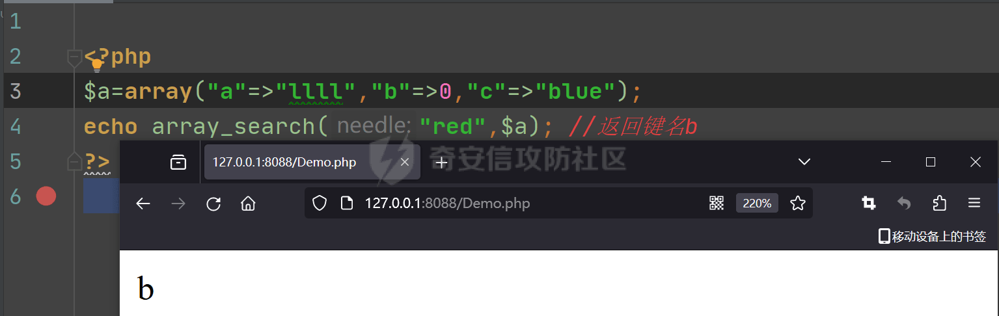

‍

##### 第 2 次实验

###### 01、源码

```php
<?php
header('Content-Type:text/html;charset=utf-8');

if (!is_array($_GET['cmd'])){ //4-判断 GET 类型传进来的值是不是数组
    // 所以？cmd[]=
    //值是多少先不需要管
    die();
}
$cmd = $_GET['cmd'];//5-将数组赋值给变量 cmd，$cmd=array(cmd[]=>),也就是说$cmd 是一个数组
for($i = 0; $i < count($cmd); ++$i){ //3-发现关键在于变量 cmd，而 cmd 又是从上面产生的 所以从头分析
    //6-取出变量 cmd 数组中的值是否全等于‘cmd’,在这里只需要不全等于就退出//进入 16 行
    if($cmd[$i] === 'kkkk'){
        //6-
        echo 'no';
        die(); //2-不能进入，进入了就没法继续往下执行
    }
    $cmd[$i] = intval($cmd[$i]);//7-取出数组中的值 intval 转换成整数结合 第一段分析得知 $cmd =array(a=>0)
    //所以，cmd 里面的某个键值对的值等于 0
    //所以，结合第 4 段分析得出？cmd[]=0，就完成了绕过
}

//思路：这里是做什么的不重要，对于攻击者而言，这里就是安全检测
if (array_search('kkkk', $cmd) === 0){ //1-在数组变量$cmd 中搜索某个值，如果全等于 0 那么就进入
    //注意这里是全等也就意味着数据类型 和值都要是一样的，也就只有 0 才等于 0
    //所以$cmd = array(a=>0);这个数组中有一个键值对的值等于 0

    echo '看见我就说明，你通过弱类型比较，进入到了这里，交易成功/转账成功/任何操作 '; //目的打印这句话
}
else{
    echo 'no, you failed';
}

//paylaod: cmd[]=0
```

###### 02、分析过程

1、定位关键点

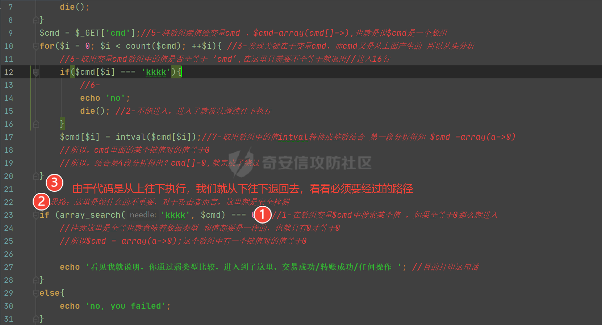

2、确认执行路径/攻击路径

注意：这里的关键点在于，最终执行的后退一步，进入到这一步也就是红色的 3，那么就说明成功绕过

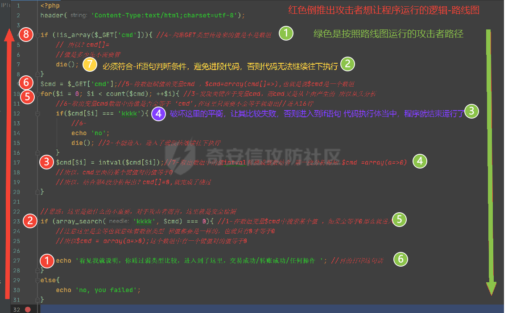

‍

3、区分功能模块

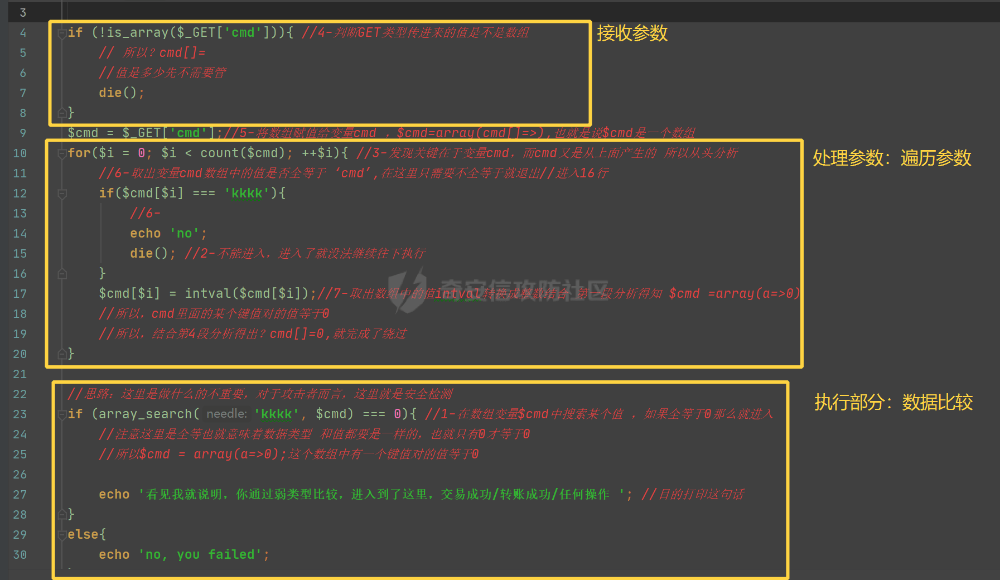

###### 03、构造过程

1、假设最终要使用的数据 ---这里使用到的是 - 执行参数部分

答案：$cmd 数组类型，其中键值对，至少包含 key=>0 值等于 0

```php
//思路：这里是做什么的不重要，对于攻击者而言，这里就是安全检测

if (array_search('kkkk', $cmd) === 0){ //1-在数组变量$cmd 中搜索某个值，如果全等于 0 那么就进入
    //注意这里是全等也就意味着数据类型 和值都要是一样的，也就只有 0 才等于 0
    //所以$cmd = array(a=>0);这个数组中有一个键值对的值等于 0

    echo '看见我就说明，你通过弱类型比较，进入到了这里，交易成功/转账成功/任何操作 '; //目的打印这句话
}
```

2、找到传参点，先传参 ---这里使用到的是 - 接收参数部分

```php
if (!is_array($_GET['cmd'])){ //4-判断 GET 类型传进来的值是不是数组
    // 所以？cmd[]=0
    //值是多少先不需要管
    die();
}
```

3、越过参数处理部分，想办法成功进入，执行参数部分，完成类型比较绕过，成功攻击

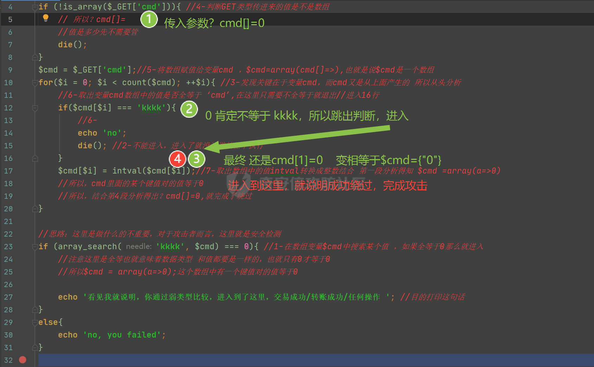  
‍

### 11、Switch 比较缺陷

**//本质上 switch 做了一个弱类型比较** //$a=='hello'?

```php
<?php
header('Content-Type:text/html;charset=utf-8');

    $a = 0;
//本质上 switch 做了一个弱类型比较
//$a=='hello'?
    switch ($a){
        case 'hello':
            echo 'hello';
            break;
        case 0:
            echo 0;
            break;
        default:
            echo '没找到';
    }
```
